# U1 — 배포 아키텍처 (GitHub Actions 파이프라인 설계)

> 2026-07-04 · CONSTRUCTION · U1 Infrastructure Design 산출물 — **프로젝트 공통 파이프라인 정본**(U1 스캐폴드가 생성, U2~U8 재사용)
> 전역 확정: CI/CD=**GitHub Actions** / 롤백=**버전 고정 재배포(ECR 이미지 태그)** + DB **forward-only** / 배포=**롤링(Multi-AZ 2+ 인스턴스)**. 인프라 정본: [shared-infrastructure.md](../../shared-infrastructure.md)(SI). AWS 인증은 **OIDC 단기 토큰만**(SI §7.2 — 장기 키 금지).

## 1. 모노레포 경로 필터 (워크플로 트리거)

| 워크플로 | 트리거 | 경로 필터 |
|---|---|---|
| `server-ci.yml` | PR·main push | `server/**`, `.github/workflows/server-*.yml` |
| `mobile-ci.yml` | PR·main push | `apps/mobile/**`, `.github/workflows/mobile-*.yml` |
| `infra-ci.yml` | PR·main push | `infra/**` (`terraform plan` diff를 PR 코멘트로 — 경량 변경 관리 게이트) |
| `server-deploy.yml` | main 머지(dev 자동) / 릴리스 태그+환경 승인(prod) | `server-ci` 성공 후속 |

- 경로 무관 공통(예: 루트 설정) 변경은 양쪽 CI 모두 실행. 필터는 `paths` 기준 — 유닛별 모듈 추가(U2~U8)는 `server/**` 안이므로 워크플로 수정 불요(U1이 파이프라인을 완성하는 근거).

## 2. PR 워크플로 (머지 게이트)

```text
PR 열림
  +-> [server] 빌드(Gradle, JDK21) -> ktlint/detekt -> 단위·통합 테스트(Testcontainers PostgreSQL)
  |      +-> 하드 제약 게이트: 태그 hard-constraint 테스트 100% 통과 = 머지 차단 (D37/G114)
  |      +-> PBT 실행: Kotest property — 시드 로깅 활성·실패 시 시드 아티팩트 업로드 (PBT-08)
  |      +-> 마이그레이션·append-only 권한 검증(실 PostgreSQL — NFR-U1-MT-02)
  |      +-> 아키텍처 테스트(Konsist — 모듈 경계·비인증 핸들러 검출, NFR-U1-SEC-20)
  +-> [server] 공급망(SECURITY-10): Gradle 의존성 검증 메타데이터 + OWASP Dependency-Check(또는 Trivy fs)
  |      취약점 Critical/High = 차단, SBOM(CycloneDX) 생성·아티팩트 보존
  +-> [mobile] tsc(strict) -> ESLint -> Jest(+fast-check — 시드 로깅, PBT-08) -> pnpm audit(Critical/High 차단)
  +-> [infra]  terraform fmt/validate/plan -> PR diff 코멘트
전 잡 성공 + 리뷰 승인 = 머지 가능 (브랜치 보호 규칙 — SECURITY-13 파이프라인 접근 통제)
```

**텍스트 대안**: PR이 열리면 서버(빌드→린트→Testcontainers 테스트→하드 제약 100% 게이트→PBT 시드 로깅→마이그레이션 권한 검증→아키텍처 테스트→취약점 스캔·SBOM), 모바일(타입체크→린트→Jest/fast-check→감사), 인프라(plan diff) 잡이 병렬 실행되고, 전부 성공+리뷰 승인이 머지 조건이다.

- **하드 제약 게이트(D37)**: 하드 제약 계열 테스트(U1=계정 무결성)를 별도 Gradle 태스크(`hardConstraintTest`)로 분리 — **100% 통과가 머지 차단 조건**, 그 외 품질 리포트는 비차단으로 시작(G114). 외부 의존(IdP·메일)은 전부 Port fake — 실 API 호출 0(D37 계층 분리).
- **PBT 시드 로깅(PBT-08)**: Kotest `PropertyTesting` 전역 설정으로 시드를 테스트 리포트에 출력, 실패 시 시드·수축 결과를 GitHub Actions 아티팩트로 업로드 — 재현은 `PropTestConfig(seed=...)` 고정. fast-check도 실패 리포트의 seed/path를 동일 방식 보존.
- **공급망(SECURITY-10)**: 잠금 파일(gradle verification-metadata·pnpm-lock) 커밋 필수, 액션 자체도 **커밋 SHA 고정**(`uses: actions/checkout@<sha>`), 러너 도구 버전 고정. SBOM은 릴리스 아티팩트로 S3 `artifacts` 버킷 보존(SI §5.2).

## 3. main 머지 → 빌드·배포 (dev 자동)

```mermaid
flowchart LR
  M[main merge] --> B[Docker build multi-stage arm64]
  B --> S[Trivy image scan gate]
  S --> P[ECR push tag=git SHA immutable]
  P --> G[OIDC assume gha-deploy-dev]
  G --> F[Flyway migration task exit 0 gate]
  F --> R[ECS rolling update new task def]
  R --> W[wait services-stable + smoke check]
  W --> N[deploy record + SNS notify]
```



**텍스트 대안**: main 머지 시 멀티스테이지 Docker 빌드(ARM64) → Trivy 이미지 스캔 게이트 → ECR에 git SHA 불변 태그로 푸시 → OIDC로 배포 역할 수임 → Flyway 마이그레이션 일회성 태스크 실행·종료 코드 0 확인 → 신규 태스크 정의로 ECS 롤링 업데이트 → 안정화 대기·스모크 체크(`/actuator/health/liveness` + 로그인 무해 시나리오 1건) → 배포 기록·SNS 알림 순서로 진행된다.

- **이미지(SECURITY-10)**: 멀티스테이지 Dockerfile — 빌드 스테이지(temurin-jdk21 digest 고정) / 런타임(temurin-jre21 또는 distroless-java21 digest 고정, non-root, `latest` 태그 금지). 태그 = `{git-sha}`(불변 — ECR immutability ON, SI §1.2). Trivy 이미지 스캔 Critical = 배포 차단.
- **롤링 배포(전역 결정)**: `minimumHealthyPercent=100 / maximumPercent=200` — 신 태스크 2개 기동·헬시 후 구 태스크 드레인(무중단 — NFR-U1-AV-05는 토큰 무상태 검증으로 세션 무손실). **Deployment Circuit Breaker + 자동 롤백 ON** — 헬스 실패 시 직전 태스크 정의로 자동 복귀.
- **배포 기록(경량 변경 관리 — RESILIENCY-03, NFR Design 프로세스와 연동)**: 배포 잡이 태그·수행자·마이그레이션 버전을 릴리스 노트(GitHub Release/Deployments API)에 자동 기록 — 롤백 노트의 입력.

## 4. DB 마이그레이션 순서 — forward-only·호환 규칙 (전역 확정)

**순서**: ①마이그레이션 태스크 실행(신 스키마 적용) → ②종료 코드 0 게이트 → ③앱 롤링 배포. **롤백 시 DB는 되돌리지 않는다**(forward-only) — 따라서 아래 호환 규칙이 머지 리뷰 체크 항목이다:

| # | 규칙 (N-1 호환 — 구버전 앱이 신 스키마 위에서 동작해야 롤백 가능) |
|---|---|
| 1 | 컬럼·테이블 추가는 자유(구버전은 무시) — 단 신규 NOT NULL은 DEFAULT 필수 |
| 2 | 컬럼·테이블 삭제/개명은 **expand-contract 2단계**: 릴리스 N에서 신규 추가·이중 기록, N+1(구버전 롤백 대상 소멸 후)에서 제거 |
| 3 | 제약 강화(NOT NULL화·타입 축소·유니크 추가)는 구버전 쓰기 경로가 위반하지 않음을 확인 후 별도 릴리스 |
| 4 | 파괴적 데이터 이관은 마이그레이션이 아닌 배치 잡으로 분리(마이그레이션은 초 단위 완료 유지 — 롤링 지연 방지) |
| 5 | append-only 테이블(동의 증적·법정 로그)은 스키마 변경도 추가만 — REVOKE 상태 회귀 검증 테스트 동반(NFR-U1-SEC-24) |

## 5. 롤백 절차 — 이전 태그 재배포 runbook (전역 확정: 버전 고정 재배포)

1. **판단**(경량 인시던트 프로세스 입력): 배포 후 A1(5xx)·A2(p95)·U1-S1~S7 알람 또는 스모크 실패 — Deployment Circuit Breaker가 잡는 경우 자동 복귀로 종결(사후 기록만).
2. **수동 롤백**: `server-deploy.yml`의 `workflow_dispatch` 입력에 **직전 안정 태그(git SHA)** 지정 → 마이그레이션 단계 스킵(신 스키마는 유지 — forward-only) → 해당 태그 이미지의 태스크 정의로 롤링 재배포. 불변 태그이므로 "그때 그 바이너리" 보장(SECURITY-10).
3. **DB**: 되돌리지 않음. 데이터 오염 시나리오만 PITR 복원(RPO 시간 단위 내 — CQ4·RESILIENCY-11) — 복원은 신 인스턴스 복원 후 엔드포인트 전환(runbook, Backup & Restore 전략). **복원 리허설은 Operations 이연(전역 결정)** — 본 절차서가 그 시나리오 문서를 겸한다(RESILIENCY-14).
4. **기록**: 롤백 사유·구간·후속 조치를 릴리스 노트에 기록(경량 변경 관리) + 사후 회고 템플릿(NFR Design 소유).

## 6. 환경 승격 흐름 (dev → prod)

```text
PR 머지(main) --> dev 자동 배포(§3) --> dev 검증(스모크+수동 확인)
  --> 릴리스 태그(vX.Y.Z) 생성 --> prod 배포 워크플로
       +-> GitHub Environment "prod": 승인자 승인 필수(보호 규칙) + OIDC sub 조건 environment:prod
       +-> 동일 이미지 태그 재사용(재빌드 금지 — dev에서 검증된 그 아티팩트) --> 마이그레이션 --> 롤링
```

**텍스트 대안**: main 머지는 dev에 자동 배포되고, dev 검증 후 릴리스 태그를 만들면 prod 워크플로가 GitHub Environment 승인 게이트(승인자 필수, OIDC 신뢰 조건도 environment 한정)를 거쳐 **dev에서 검증된 동일 이미지 태그를 재빌드 없이** prod에 마이그레이션→롤링 순으로 배포한다.

- 코드 작성자 ≠ prod 배포 승인자 분리(SECURITY-13 직무 분리 — 1인 팀인 경우 승인 단계 자체를 기록 게이트로 유지). 워크플로 정의 변경은 CODEOWNERS 리뷰 필수(파이프라인 접근 통제).

## 7. 모바일 — EAS Build 개요 (스토어 제출은 Operations)

- **EAS Build**(Expo 관리형 클라우드 빌드): development build(내부 배포·시뮬레이터)·preview(내부 테스터)·production 프로파일 3종(`eas.json`). U1은 development/preview까지 파이프라인화 — `mobile-ci.yml` 성공 후 수동 트리거(`workflow_dispatch`)로 EAS 빌드 제출(EAS 토큰은 GitHub Secrets — 장기 키 예외로 문서화, Expo가 OIDC 미지원).
- prebuild(config plugin — U3 지도 SDK 대비)는 EAS 원격 빌드에서 재현 — 네이티브 프로젝트 커밋 안 함. 앱 시크릿 없음(PKCE — 소셜 교환은 서버, tech-stack §3.2).
- **스토어 제출(EAS Submit)·심사·OTA 업데이트 정책은 Operations 단계 소관** — P9(개발자 계정) 개설만 U1 기간 중 병행(unit-of-work.md U1 선결).

## 8. 컴플라이언스 요약 (파이프라인 관점)

| 규칙 | 판정 | 근거 |
|---|---|---|
| SECURITY-10 | 준수 | §2 스캔·SBOM·잠금 파일·액션 SHA 고정, §3 digest·불변 태그, §5 태그 재배포 |
| SECURITY-13 | 준수 | §6 브랜치 보호·CODEOWNERS·승인 분리·배포 감사 기록 |
| SECURITY-12(자격 증명) | 준수 | OIDC 단기 토큰(장기 키 금지) — EAS 토큰 예외 문서화(§7) |
| RESILIENCY-04 | 준수 | CI/CD=GitHub Actions·롤링·버전 고정 롤백(전역 확정 반영) + Circuit Breaker 자동 복귀 |
| RESILIENCY-03·15 | 준수(연동) | §3·§5 기록 게이트가 경량 변경 관리·인시던트 프로세스(NFR Design 소유)의 입력 |
| PBT-08 | 준수 | §2 시드 로깅·아티팩트 보존·고정 재현 |
| D37/G114 | 준수 | §2 하드 제약 100% 머지 차단·외부 fake·실 LLM 회귀는 릴리스 파이프라인 전용(U5부터 활성) |
