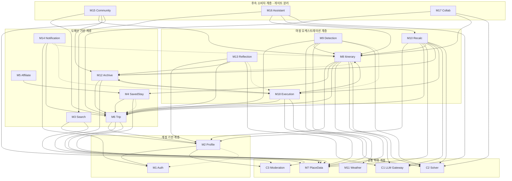
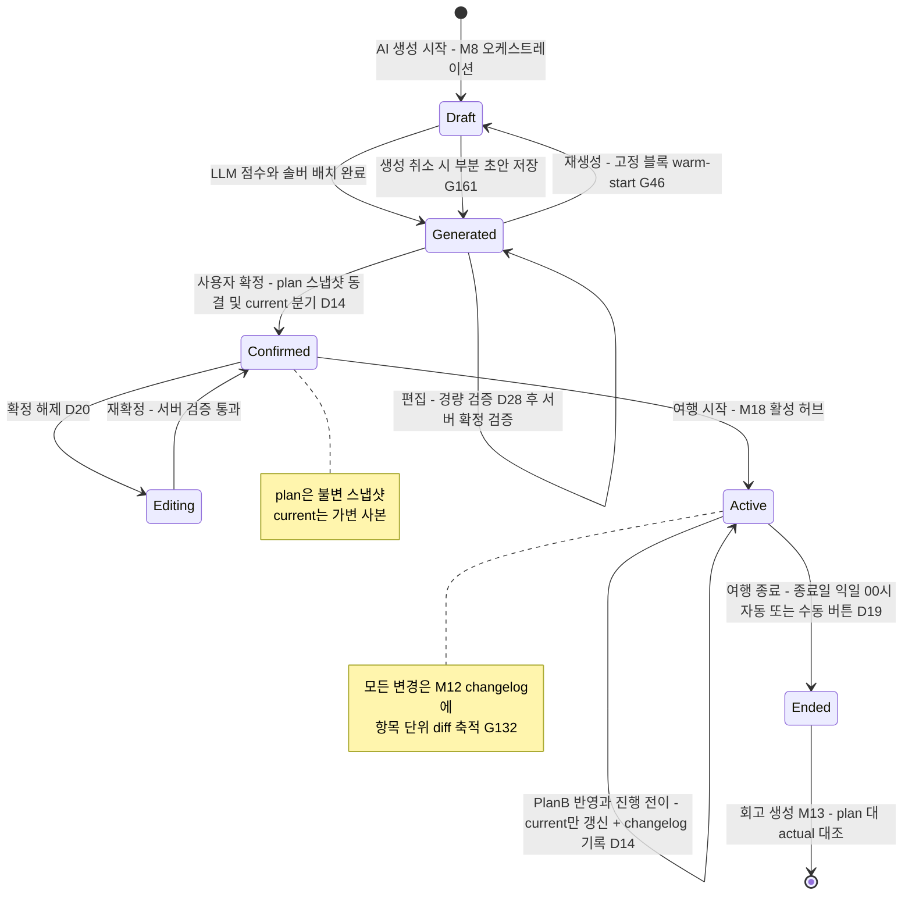

# 컴포넌트 의존 관계 (Component Dependency)

> 2026-07-04 심화 개정 · 정본: [components.md](./components.md)의 M1~M18·C1~C3 경계, [requirements.md](../requirements/requirements.md)의 D01~D38·N1~N8.
> **방향 규약**: 매트릭스의 행(사용 모듈) → 열(의존 대상). `S[n]`=동기 의존(공개 퍼사드 호출), `E[n]`=이벤트 구독(열 모듈이 발행한 이벤트를 행 모듈이 구독), `·`=의존 없음, `[n]`=§1.5 의존 사유 각주 번호.
> **순환 판정 규약**: 이벤트 구독(E)은 의존 순환 판정에서 제외한다 — 발행자는 구독자를 모르며(발행자→구독자 방향의 컴파일 의존 없음), 페이로드는 ID 참조 최소 계약이다. 동기(S) 간선만으로 순환 부재를 §5.1에서 증명한다.

---

## 1. 의존 매트릭스

### 1.1 1차 범위 매트릭스 (M1~M14, M18 + C1~C3)

| ↓사용 \ 대상→ | M1 | M2 | M4 | M6 | M7 | M8 | M11 | M12 | M14 | M18 | C1 | C2 | C3 |
|---|---|---|---|---|---|---|---|---|---|---|---|---|---|
| M1 Auth | — | · | · | · | · | · | · | · | · | · | · | · | · |
| M2 Profile | S[1] E[2] | — | · | · | · | · | · | · | · | · | · | · | S[3] |
| M3 Search | · | S[4] | · | · | S[5] | · | · | · | · | · | · | · | · |
| M4 SavedStay | · | · | — | S[6] E[7] | S[8] | · | · | · | · | · | · | · | · |
| M5 Affiliate | · | · | S[9] | · | · | · | · | · | · | · | · | · | · |
| M6 Trip | · | S[10] | · | — | S[11] | · | · | · | · | · | · | · | S[12] |
| M7 PlaceData | · | · | · | · | — | · | · | · | · | · | · | · | · |
| M8 Itinerary | · | S[13] | S[14] | S[15] | S[16] | — | · | E[17] | · | · | S[18] | S[19] | · |
| M9 Detection | · | · | · | S[20] | S[21] | S[22] | S[23] | · | · | E[24] | · | S[25] | · |
| M10 Recalc | · | S[26] | · | S[27] | S[28] | S[29] | · | S[30] | · | S[31] | S[32] | S[33] | · |
| M11 Weather | · | · | · | · | · | · | — | · | · | · | · | · | · |
| M12 Archive | · | · | · | S[34] | S[35] | · | · | — | · | E[36] | · | · | · |
| M13 Reflection | · | S[37] | · | S[38] | · | · | · | S[39] | · | E[40] | S[41] | · | · |
| M14 Notification | S[42] | · | · | S[43] | · | E[44] | · | · | — | E[45] | · | · | · |
| M18 Execution | · | · | · | S[46] | S[47] | S[48] | · | S[49] | · | — | · | S[50] | · |

- **M1은 어떤 모듈에도 의존하지 않는 최하위 계정 기반**이다. M1은 `가입 완료`·`계정 삭제 개시(30일 유예 진입, D18)`·`유예 만료(완전 삭제)` 도메인 이벤트의 **발행자**이며, M2(프로필 초기화·소프트 삭제)를 비롯한 각 모듈이 구독해 연쇄 처리한다.
- **공통 컴포넌트 C1(LLM Gateway)·C2(Solver Engine)·C3(Moderation)은 기능 모듈에 의존하지 않는다.** C1의 컨텍스트 서버 재조회(D31)는 호출자가 전달한 조회 콜백/참조 해석기로 수행해 역의존을 방지한다.
- **M3·M5는 상호 독립**이다(카드 UI에서 클라이언트가 조합). M5→M4는 숙소 식별 참조(읽기 전용)만이다.
- M7·M11은 공급 전용 최하위 모듈로 어떤 기능 모듈에도 의존하지 않는다.

### 1.2 후속 모듈 매트릭스 (M15~M17 — 1차 코드 생성 제외, 아키텍처 여지만 확보)

| ↓사용 \ 대상→ | M3 | M6 | M8 | M10 | M12 | C1 | C2 | C3 |
|---|---|---|---|---|---|---|---|---|
| M15 Community | · | S[51] | S[52] | · | S[53] | · | · | S[54] |
| M16 Assistant | S[55] | · | S[56] | S[57] | · | S[58] | · | · |
| M17 Collab | · | S[59] | S[60] | · | · | · | S[61] | · |

- 후속 3개 모듈은 전부 **기존 모듈의 공개 퍼사드만 사용하는 상위 소비자**다. 역방향(1차 모듈 → M15/M16/M17) 의존은 S·E 모두 0건이다 — §5.2 게이트 분리 근거.

### 1.3 초안 대비 보정 이력 (2건)

압축 초안의 "순환 없음" 선언을 실제로 성립시키기 위해 아래 2건의 동기 상호 참조를 이벤트로 전환·해소했다. 매트릭스의 나머지 셀은 초안과 동일하다.

| # | 초안 | 문제 | 보정 | 근거 |
|---|---|---|---|---|
| 보정1 | M1→M2 `S` + M2→M1 `S` | 동기 상호 참조 = 순환 | M1→M2 동기 호출 **제거**. 가입 완료 시 프로필 초기 생성은 M1의 `가입 완료` 이벤트를 M2가 구독(E[2])하는 방식으로 전환. M2→M1 S[1](계정 상태 조회)만 유지 | Auth는 최하위 기반 — 상위 도메인을 알면 안 됨. 계정 삭제 연쇄(D18)도 동일 이벤트 패턴으로 통일 |
| 보정2 | M6→M4 `S` + M4→M6 `S` | 동기 상호 참조 = 순환 | M6→M4 동기 호출 **제거**. 여행-거점 연결 조인은 components.md 정의대로 **M4가 소유**("여행 거점 연결·날짜 비중첩 검증"은 M4 책임) — 거점 지정 UI 흐름은 클라이언트가 M4 퍼사드를 직접 호출. 여행 삭제 시 거점 연결 정리는 M6의 `여행 삭제` 이벤트를 M4가 구독(E[7]) | D15(계정 레벨 풀 + 여행 연결 조인)의 조인 소유권을 M4로 단일화. 거점 조회가 필요한 상위 모듈(M8 등)은 이미 M4를 직접 호출(S[14]) |

### 1.4 이벤트 카탈로그 (E 셀의 발행자·페이로드 계약)

| 발행자 | 이벤트 | 구독자 | 페이로드 원칙 |
|---|---|---|---|
| M1 | 가입 완료 / 계정 삭제 개시 / 유예 만료 | M2 (연쇄 대상 모듈 확장 가능) | user_id + 발생 시각만 — 상세는 구독자가 재조회 |
| M6 | 여행 삭제 / 여행 날짜 변경 | M4 | trip_id + 변경 유형 |
| M8 | 일정 확정 / current 변경 | M14 | trip_id + itinerary_version — 알림 스케줄 재계산 트리거(D32) |
| M12 | changelog 기록 / 오프라인 병합 완료(G74) | M8 | trip_id + changelog_seq — current 버전·변경 배지 동기화 |
| M18 | 방문 시작·완료 전이 / 여행 시작·종료(D19) / 휴식 모드 전환(G54) / 체류 초과·이동 지연 신호(D27) | M9, M12, M13, M14 | trip_id + slot_id + 전이 유형 + 시각 — actual 상세는 M12가 소유 데이터로 생성 |

모든 이벤트는 모듈러 모놀리스 내 인프로세스 이벤트 버스(Spring `ApplicationEventPublisher` 계열 + 트랜잭셔널 아웃박스)로 전달하며, 추후 분리 워커 전환(D04) 시 브로커 교체가 가능하도록 발행/구독 인터페이스를 platform 계층에 둔다.

### 1.5 의존 사유 각주

**계정·프로필·숙소·여행 (1~12)**

1. M2→M1 S: 프로필 조회·수정 시 계정 상태(활성/삭제 유예 30일, D18) 확인 및 요청자 식별 검증.
2. M2→M1 E: `가입 완료` 구독 → 닉네임 자동 생성(G23)·중립 기본 취향 초기화. `계정 삭제` 구독 → 프로필 소프트 삭제·익명화 연쇄.
3. M2→C3 S: 닉네임 설정·변경 시 금칙어 사전 검증(가입 검증부터 적용, G23).
4. M3→M2 S: 탐색 필터 기본값 제안 — 계정 취향의 예산대(1박 가격대 환산 G26)·동행 유형 조회.
5. M3→M7 S: 숙소 정적 콘텐츠 TTL 캐시·지역 좌표 정규화 조회(TourAPI 소스 계약을 M7과 공유, D09).
6. M4→M6 S: 거점 연결 시 여행 기간 조회 — 여행 내 거점 간 날짜 비중첩 검증(D15).
7. M4→M6 E: `여행 삭제` 구독 → 거점 연결 레코드 정리(계정 풀의 등록 숙소 원본은 유지, G129 독립성).
8. M4→M7 S: 외부 숙소 ID → 내부 숙소 ID N:1 매핑, 좌표+이름 유사도 자동 매칭(D17).
9. M5→M4 S: 딥링크 생성 대상 숙소의 이름·소스 매핑 식별 참조(읽기 전용, D09 숙소명 검색 딥링크).
10. M6→M2 S: 여행 속성(동행 유형·이동 수단·예산대) 기본값으로 계정 취향 제안(G134).
11. M6→M7 S: 필수 방문지 POI 검증·확정 시점 스냅샷 저장(D13)·국내 좌표 검증(G120)·canonical ID 참조(G133).
12. M6→C3 S: 여행 제목 금칙어 검증(N6).

**일정 생성 M8 (13~19)**

13. M8→M2 S: 취향 7종 조회 — LLM 점수화 개인화 입력.
14. M8→M4 S: 여행 거점 숙소(위치·연결 날짜) 조회 — 일자별 출발·복귀점, 숙소 전환일 편도 동선 모델링(G50).
15. M8→M6 S: 여행 기간·일자별 시간창(G119, D29)·예산 총액(D26)·필수 방문지 목록 조회.
16. M8→M7 S: closed-set 후보 풀 조회(G115) 및 배치 POI 스냅샷 참조 — LLM 그라운딩 실패의 구조적 차단.
17. M8→M12 E: `changelog 기록`·`오프라인 병합 완료`(G74) 구독 → current 버전 카운터·변경 배지 동기화(diff 누적 재구성 정합, G132).
18. M8→C1 S: 후보 POI 취향 점수화(경량 티어)·배치 설명 생성(상위 티어) — D11 티어 라우팅.
19. M8→C2 S: OPTW 배치·하드 제약 검증·편집 저장 시 서버 확정 검증(D28).

**Plan-B 감지 M9 (20~25)**

20. M9→M6 S: 감지 대상 활성 여행 스코핑(항상 최대 1개, D21) — 기간·필수 방문지 보호 대상 식별.
21. M9→M7 S: 영업시간 변경·휴무 폴링 재조회(당일 아침 1회, G58·G192).
22. M9→M8 S: current 일정 조회 — 트리거 영향 슬롯·고정 블록·LOCK 식별.
23. M9→M11 S: 강수확률·기상특보 폴링(1시간 주기, D10·G58) — 날씨 트리거 판정 입력.
24. M9→M18 E: 클라이언트 발 위치 신호(이동 지연·체류 초과, D27 포그라운드 한정) 구독 — M18이 실행 상태 이벤트로 정규화해 발행.
25. M9→C2 S: 거리 기반 이동시간 추정(안전계수·버퍼 G106)으로 지연 임계(30분) 판정.

**재계획 M10 (26~33)**

26. M10→M2 S: 대안 후보 개인화 — 취향 가중치 입력.
27. M10→M6 S: 예산·필수 방문지·시간창 제약 재조회(재계획도 동일 하드 제약).
28. M10→M7 S: 대안 후보 풀 조회 — 사용자 저장 장소 우선, 부족 시 주변 신규 POI 확장(G53).
29. M10→M8 S: current 일정 읽기 + 확정된 재계획안 반영 요청(current 소유권은 M8), LOCK·고정 블록 warm-start(G46).
30. M10→M12 S: 확정 재계획 diff의 changelog 기록(행위자·출처·사유·전후값, G132).
31. M10→M18 S: 현재 진행 위치·잔여 슬롯 상태 조회 — 당일 잔여만 재정렬, 이월분 미배치 목록 처리(C10).
32. M10→C1 S: 트리거 사유 해석(경량 티어)·대안 비교 설명 생성.
33. M10→C2 S: 대안 2~3개 솔버 검증 + 사용자 확정 버튼 시점 재검증 1회(G56).

**기록·회고·알림·실행 (34~50)**

34. M12→M6 S: 기록 귀속 여행 메타(기간·여행지·상태) 참조.
35. M12→M7 S: 즉석 방문 POI 검색(G77)·changelog의 POI 내부 ID 참조 해석(G132).
36. M12→M18 E: `방문 시작/완료 전이` 구독 → actual 레코드 생성(N7) — 방문 종료 시각은 다음 체크 시각으로 추정(D23).
37. M13→M2 S: 스타일 분석의 취향 7종 축 매핑 택소노미(G76).
38. M13→M6 S: 회고 대상 여행 메타(제목·기간·여행지) 조회.
39. M13→M12 S: actual 기록·사진 메타·plan/current 대조 데이터 조회(D14) — 대조 연산은 M12 소유.
40. M13→M18 E: `여행 종료 전이`(D19: 종료일 익일 00시 자동 또는 수동 버튼) 구독 → 전체 회고 자동 생성, 일자 경계 신호 → 당일 회고.
41. M13→C1 S: 회고·전체 요약·스타일 분석 생성(상위 티어, 10곳 게이트) — 실패 시 기본 카드 폴백.
42. M14→M1 S: 발송 직전 수신 계정 상태 확인 — 삭제 유예·탈퇴 계정 발송 차단(D18).
43. M14→M6 S: 여행 날짜 기반 리마인드 스케줄 산출(D32).
44. M14→M8 E: `일정 확정/current 변경` 구독 → 알림 스케줄 재계산(D32).
45. M14→M18 E: `여행 시작·종료·휴식 모드`(G54) 전이 구독 → 알림 억제·재개, 방해금지 예외(G100) 판정 입력.
46. M18→M6 S: 여행 기간 조회 — 자동 종료 판정 기준일(D19)·활성 허브 노출 조건.
47. M18→M7 S: 다음 예정지 좌표 조회 — 도착 확인 프롬프트의 지오펜스 반경 산출(D23).
48. M18→M8 S: current 일정 조회 — 활성 허브 표시·다음 슬롯·여유 시간 단순 차이 산출(G67).
49. M18→M12 S: 방문 기록 존재 조회(읽기 전용) — 진행률(방문 체크 완료 비율, G3)·완료 표시. actual **쓰기**는 이벤트(E[36])로 분리.
50. M18→C2 S: 잔여 슬롯 실행 가능성 경량 점검 — 지연 배지·재계산 제안 배지 판단(이동시간 추정 재사용, G106).

**후속 모듈 (51~61)**

51. M15→M6 S: 게시 시점 여행 메타 스냅샷 소스(D16) — 상대 시기 3필드 변환(G84).
52. M15→M8 S: 게시 시점 일정 스냅샷 소스(D16) — 공유 범위는 plan+숙소 위치·날짜 한정(C1★ 정책).
53. M15→M12 S: 공개 범위 내 기록·사진 스냅샷 소스 — EXIF GPS 기본 제거(G185).
54. M15→C3 S: 캡션·댓글 금칙어 자동 필터(G86).
55. M16→M3 S: 대화 조건 → 탐색 필터 변환 위임(Δ9 — 04 필터 축 한정, 평점은 OTA 위임 안내).
56. M16→M8 S: 일정 편집·재검증 API 위임 — 전 편집이 검증 경유.
57. M16→M10 S: 대화 발 재계획 흐름 위임.
58. M16→C1 S: 대화 LLM 호출 — 서버 재조회 컨텍스트 주입(D31), 요청자 권한으로만 재조회.
59. M17→M6 S: 공유 대상 여행·참여자 권한 귀속 참조.
60. M17→M8 S: 항목별 버전 낙관적 잠금 편집(D30) 대상 일정 접근.
61. M17→C2 S: 공동 편집 저장 시 서버 확정 검증(D28).

---

## 2. 의존별 통신 계약 (주요 동기 의존 15건)

모듈러 모놀리스(D04)이므로 모든 S 의존은 **인프로세스 퍼사드 호출**이다. 따라서 "피호출 모듈 다운"의 실체는 (a) 피호출 모듈이 감싼 **외부 API 장애**, (b) **공유 PostgreSQL 장애**, (c) 피호출 모듈의 **논리 실패(해 없음·검증 실패)** 세 가지다. 서킷 브레이커(RESILIENCY-10)는 프로세스 간이 아닌 **외부 어댑터 경계(§6)** 에 두고, 모듈 간에는 타임아웃·폴백·우아한 저하 계약으로 대응한다. 침묵 실패 금지(ADR-0011): 아래 모든 폴백은 사용자 고지 또는 관측 계측을 동반한다.

### 2.1 M8 → M7 (S[16]) — closed-set 후보 풀

| 항목 | 내용 |
|---|---|
| 호출 방향·능력 | M8 → `PlaceFacade.getCandidatePool(지역, 시간창, 카테고리 필터)` / `getPoiSnapshots(poiIds)` |
| 결합도 | **중간** — 후보 POI 요약 DTO 계약. closed-set 설계상 M8은 M7이 준 ID 목록 밖의 POI를 알 수 없어 데이터 결합은 구조적으로 낮음. M7 내부 저장 스키마(정본/캐시 구분)는 미노출 |
| 장애 전파 | M7의 외부 소스(TourAPI·카카오) 장애 시: 서킷은 M7 내부 어댑터 단에서 오픈 → **캐시 정본(TTL 잔존분)으로 응답**. 신규 지역 등 후보 부족 시 M8은 부분 생성이 아닌 '후보 부족' 오류로 생성 중단 + 사용자 안내(침묵 실패 금지) |

### 2.2 M8 → C1 (S[18]) — LLM 점수·설명

| 항목 | 내용 |
|---|---|
| 호출 방향·능력 | M8 → `LlmGateway.scoreCandidates(후보 ID 목록, 취향 컨텍스트 참조, tier=경량)` / `explainPlacement(tier=상위)` — 출력 스키마 검증 포함 |
| 결합도 | **낮음** — 프롬프트·모델·벤더는 C1 은닉. M8은 점수 스키마(poi_id→score)만 인지 |
| 장애 전파 | LLM 벤더 다운·타임아웃·스키마 검증 실패 → C1 서킷 오픈 → M8은 **결정론적 솔버 폴백**(취향 가중 휴리스틱 점수)으로 지속 + '품질 저하 고지'(§6.1 전체 20초 한계와 정합). 중요도 Medium 경로 — 생성 자체는 절대 LLM에 인질 잡히지 않음 |

### 2.3 M8 → C2 (S[19]) — 솔버 배치·확정 검증

| 항목 | 내용 |
|---|---|
| 호출 방향·능력 | M8 → `SolverEngine.solve(OPTW 입력: 후보+점수, 시간창, 이동시간, 고정 블록)` / `validate(하드 제약)` |
| 결합도 | **강함** — 솔버 입력 모델이 일정 도메인과 밀접. **완화**: C2 입력을 순수 값 객체 명세로 고정하고 D28 클라이언트 경량 검증기와 동일 계약 문서를 공유(단일 명세 원천), M8 엔티티 직접 참조 금지 |
| 장애 전파 | C2는 인프로세스 결정론 코드 — 외부 다운 없음. 실패 모드는 '해 없음/시간 예산 초과' → 부분 일정 초안 저장 + '이어서 생성'(G161), 제약 완화 안내. TMap 거리 어댑터 실패는 C2 내부에서 직선거리×우회계수(G106) 폴백으로 흡수 |

### 2.4 M8 → M6·M4·M2 (S[13]~[15]) — 생성 입력 조회 묶음

| 항목 | 내용 |
|---|---|
| 호출 방향·능력 | M8 → 여행 제약(M6)·거점 숙소(M4)·취향(M2) 읽기 전용 스냅샷 DTO 조회 |
| 결합도 | **낮음** — ID 기반 읽기 전용. **완화**: 생성 시작 시 1회 로드 후 불변 입력으로 취급(생성 도중 재조회 없음 → 부분 장애 창 최소화, 입력 일관성 보장) |
| 장애 전파 | 세 모듈 모두 공유 DB Critical 경로 — DB 장애 시 생성 자체 불가(폴백 없음, 오류·재시도 안내). Multi-AZ(RESILIENCY-08)가 1차 방어 |

### 2.5 M10 → M8 (S[29]) — current 읽기·재계획 반영

| 항목 | 내용 |
|---|---|
| 호출 방향·능력 | M10 → `ItineraryFacade.getCurrent(tripId)` / `applyRecalcProposal(변경 diff 제안)` — current **소유권은 M8**, 쓰기는 이 단일 경로만 |
| 결합도 | **강함** — 일정 구조 공유. **완화**: 재계획안을 '변경 diff 제안' 계약으로 전달하고 M8이 자체 하드 제약 재검증 후 반영(소유권 침범 방지, M17 공동편집·M16 어시스턴트도 동일 경로 재사용) |
| 장애 전파 | 반영 실패(버전 충돌·재검증 실패) 시 재계획 세션(M10 소유 데이터)을 보존하고 후보 재산출 안내(G56). current는 절대 반쯤 반영되지 않음(트랜잭션 원자성) |

### 2.6 M10 → C2 (S[33]) — 대안 검증·확정 재검증

| 항목 | 내용 |
|---|---|
| 호출 방향·능력 | M10 → `SolverEngine.validate/solve` — 후보 2~3개 검증, warm-start 재배치, 확정 버튼 시점 재검증 1회(G56) |
| 결합도 | 강함 — 2.3과 동일 완화(공유 값 객체 명세) 적용 |
| 장애 전파 | 시간 예산(Plan-B 10초, §6.1) 초과 시 **수동 수정 폴백 제안** — Plan-B는 High 중요도이나 수동 폴백 존재로 우아한 저하 |

### 2.7 M9 → M11 (S[23]) — 날씨 폴링

| 항목 | 내용 |
|---|---|
| 호출 방향·능력 | M9 → `WeatherFacade.getForecast(격자)` / `getAlerts()` — 1시간 주기 폴링(G58) |
| 결합도 | **낮음** — 격자 예보·특보 DTO만. 좌표→격자 변환은 M11 은닉 |
| 장애 전파 | 기상청 API 장애 → M11 어댑터 서킷 오픈 + **마지막 성공 캐시** 제공(신선도 표시). 캐시 신선도 초과 시 M9는 날씨 트리거 판정을 **skip**(스테일 데이터로 오탐 알림 발송 방지) + 실패율 대시보드 계측(§6.7) |

### 2.8 M9 → M8 (S[22]) — 감지 대상 일정 조회

| 항목 | 내용 |
|---|---|
| 호출 방향·능력 | M9 → `ItineraryFacade.getCurrent(tripId)` — 트리거 영향 슬롯·고정 일정 식별 |
| 결합도 | 낮음 — 읽기 전용 |
| 장애 전파 | 조회 실패 시 해당 폴링 사이클 skip 후 다음 주기 재시도 — 트리거 지연만 발생, 오동작 없음. 반복 실패는 알람(SECURITY-03·§6.7) |

### 2.9 M18 → M8 (S[48]) — 활성 허브 일정 조회

| 항목 | 내용 |
|---|---|
| 호출 방향·능력 | M18 → `ItineraryFacade.getCurrent(tripId)` — 허브 표시·다음 슬롯·여유 시간(G67) |
| 결합도 | 낮음 — 읽기 전용 |
| 장애 전파 | Critical 경로(여행 중 일정 접근 — §6.3 현장 피해 최대). 오프라인 조회 미보장(D24) 정책상 클라이언트 오류·재시도 UX로 대응하고, 서버는 Multi-AZ·헬스체크로 가용성 확보. 별도 기능 폴백 없음(의도된 결정) |

### 2.10 M18 → M12 (S[49]) — 진행률 조회 (쓰기와 분리)

| 항목 | 내용 |
|---|---|
| 호출 방향·능력 | M18 → `ArchiveFacade.getVisitSummary(tripId)` — 진행률·완료 표시(G3) |
| 결합도 | **낮음** — 읽기 전용. actual **생성은 이벤트(E[36])로 역전**되어 있어 M12 처리 지연이 방문 체크 UX를 차단하지 않음(핵심 분리 설계) |
| 장애 전파 | 조회 실패 시 진행률 배지만 생략하는 우아한 저하 — 허브 핵심(다음 일정 표시)은 유지 |

### 2.11 M12 → M7 (S[35]) — 즉석 방문 POI 검색

| 항목 | 내용 |
|---|---|
| 호출 방향·능력 | M12 → `PlaceFacade.searchPoi(질의)` — 즉석 방문 입력(G77) |
| 결합도 | 낮음 |
| 장애 전파 | 외부 검색 실패 시 **자유 텍스트 입력 폴백**(좌표·카테고리 없음, 분석 '기타' 처리 — G77에 이미 정의된 이중 경로) |

### 2.12 M14 → M6 (S[43]) — 리마인드 스케줄 산출

| 항목 | 내용 |
|---|---|
| 호출 방향·능력 | M14 → `TripFacade.getTripDates(tripId)` — 서버 스케줄링 재계산(D32) |
| 결합도 | 낮음 |
| 장애 전파 | 재계산 실패 시 기존 스케줄 유지 + 재시도 큐 적재. 중요도 Medium — 미발송분은 인앱 재평가로 보완(§6.3) |

### 2.13 M13 → C1 (S[41]) — 회고·분석 생성

| 항목 | 내용 |
|---|---|
| 호출 방향·능력 | M13 → `LlmGateway.generate(회고/요약/스타일 분석, tier=상위)` |
| 결합도 | 낮음 — 2.2와 동일 은닉 |
| 장애 전파 | LLM 실패 → **기본 카드 폴백**(components.md 정본 명시) + 수동 '다시 생성' 진입점(C11). 회고는 비동기 생성이라 사용자 대기 차단 없음 |

### 2.14 M4 → M6 (S[6]) — 날짜 비중첩 검증

| 항목 | 내용 |
|---|---|
| 호출 방향·능력 | M4 → `TripFacade.getTripDates(tripId)` — 거점 연결 시 여행 내 거점 간 날짜 비중첩 검증(D15) |
| 결합도 | 낮음 — 기간 값만 |
| 장애 전파 | 조회 실패 시 거점 연결 **거부(fail-closed)** — 데이터 정합성이 편의보다 우선. 등록 숙소 CRUD 자체(여행 미연결)는 M6 무관하게 동작 |

### 2.15 M6 → M7 (S[11]) — 필수 방문지 검증·스냅샷

| 항목 | 내용 |
|---|---|
| 호출 방향·능력 | M6 → `PlaceFacade.resolveAndSnapshot(poiId)` — canonical ID 검증·국내 좌표 검증(G120)·확정 스냅샷(D13) |
| 결합도 | **중간** — 스냅샷 스키마 공유. 완화: 스냅샷은 M7이 발급하는 불변 값 객체(버전 포함)로 계약 |
| 장애 전파 | 외부 소스 실패 시 캐시 정본으로 검증 지속. 미확인 POI는 '확인 불가' 상태로 추가 보류 + 안내(G8) — 검증 없는 통과는 없음 |

---

## 3. 핵심 데이터 흐름 상세 (4종 생명주기)

### 3.1 POI 데이터 — 수집 → 정본 저장(D13) → 후보 풀 → 스냅샷

```text
[수집]     TourAPI 배치(정적 콘텐츠 일 1회, G196) + 카카오 로컬 실시간 검색
              │  (어댑터: M7 소유, §6)
[정규화]   M7: canonical POI ID 발급(G133) — 좌표 근접 50m + 명칭 유사도 매칭,
              소스별 place_id N:1 매핑(D17 패턴), 한국어명 정본 + 영문 alias
[정본 저장] M7 이원 저장(D13):
              (a) 캐싱 허용 공공 소스(TourAPI) → 정본 테이블 영구 저장
              (b) 지도 API 소스 → 실시간 호출 + 약관 허용 TTL 캐시(영구 캐싱 금지)
[후보 풀]  M7: closed-set 후보 풀(G115) — 지역·영업시간·카테고리 사전 필터
              → M8/M10에 ID 목록으로만 공급 (LLM은 목록 밖 선택 불가 = 그라운딩 보장)
[스냅샷]   사용자 확정 시점에 '사용자 입력 데이터'로 영구 스냅샷(D13, 법무 P2 전제):
              필수 방문지(M6→M7 S[11]) · 등록 숙소(M4→M7 S[8]) · 방문 체크(M12)
              일정 배치 POI도 배치 시점 스냅샷 참조(M8 S[16])
[소멸/변질] 원본 소실 POI → '확인 불가' 배지 유지, 시드 재투입 시 제외 안내(G8)
              영업시간 변경 → M9 휴무 폴링(S[21])이 Plan-B 트리거로 승격(G192)
[파생]     인기 장소 배치 집계(최근 7일 저장+방문 가중합, 일 1회, M7 소유 — G2)
```

**소유권 요약**: 정본·캐시·풀·집계는 전부 M7 단일 소유. 스냅샷은 확정한 모듈(M6·M4·M12·M8)이 자기 데이터로 소유하되 스키마(값 객체)는 M7이 발급 — 약관 리스크(D13)가 M7 어댑터 한 곳에 격리된다.

### 3.2 일정 데이터 — 생성 → plan 동결 → current → actual → changelog (D14)

```text
[생성]     M8: M6(기간·시간창·예산·필수방문지) + M2(취향) + M4(거점)
              → M7 후보 풀 → C1 점수(폴백: 휴리스틱) → C2 배치 → 초안(draft)
[편집]     클라이언트 경량 검증(D28 공유 명세) → 저장 시 서버 C2 확정 검증
              재생성은 LOCK·체류 고정·수동 POI 고정 블록 보존 warm-start(G46)
[확정]     사용자 확정 → plan 불변 스냅샷 동결 + current 가변본 분기(D14)
              확정 해제→재확정 상태 머신(D20): 편집 중엔 신규 공개 불가
[여행 중]  current만 변경 가능:
              M10 재계획 diff 반영(S[29], M8 단일 쓰기 경로) · M18 진행 상태 전이
              모든 변경은 M12 changelog에 항목 단위 diff 기록(G132:
              행위자·출처 유형·사유·전/후 값, POI는 내부 ID 참조)
              — Plan-B·공동편집(후속)·어시스턴트(후속) 공용 스키마
[actual]   M18 방문 시작/완료 전이 이벤트 → M12가 actual 레코드 생성(E[36])
              오프라인 기록 입력은 로컬 큐 → 재접속 병합(G74: 레코드 버전 비교,
              사진·메모 합집합) → 병합 완료 이벤트 → M8 배지 동기화(E[17])
[종료]     M18 여행 종료 전이(D19) → M13이 plan(의도) vs current(계획 최종)
              vs actual(실행) 3자 대조로 회고 생성 — 대조 데이터는 M12 소유(S[39])
[재구성]   과거 시점 일정은 plan 스냅샷 + changelog diff 누적 재생(G57)
```

### 3.3 위치 데이터 — 동의 3층(G182) → 포그라운드 수집 → 법정 로그(N2) → 파기

```text
[동의 3층]  ①OS 위치 권한 × ②위치기반서비스 약관 필수 동의(별도 체크, N2)
              × ③GPS 여행 기록 옵트인(선택) — 조합별 동작 매트릭스는
              Functional Design에서 명문화(G182). 소유: ②③은 M1 동의 증적
[수집]     클라이언트 shared/location — 포그라운드 한정(D27, 백그라운드 권한
              미요청 G62), 저빈도 1~5분 간격(G55)
[소비 분기] (a) 도착 확인: 지오펜스 근접 판정 → M18 프롬프트(D23)
                 — 좌표는 즉시 소비, 서버 미보존
              (b) 트리거 신호: 이동 지연·체류 초과 → M18 정규화 이벤트
                 → M9 구독(E[24]) — 판정 결과만 저장, 원시 좌표 미보존
              (c) GPS 발자취: ③옵트인 시에만 — 단순화 폴리라인만 서버 보존,
                 원시 좌표는 가공 후 즉시 파기(G55/G73). 이동 거리는
                 실측+추정 혼합 합산(G72)
[법정 로그] 위치정보 수집·이용·제공 사실 확인자료 테이블(N2):
              append-only · 최소 6개월 보존 · 애플리케이션 역할은 자기 로그
              삭제 권한 없음(SECURITY-14 정합) — 소비 분기 (b)(c) 발생 시 기록
[파기]     ③옵트인 철회 또는 탈퇴 → 위치 데이터(폴리라인 포함) 즉시 파기(N2)
              계정 삭제 30일 유예(D18)와 무관하게 위치 데이터는 즉시 —
              법정 로그만 분리 보관 후 보존 기간 경과 시 삭제
```

### 3.4 알림 — 이벤트 → 스케줄 → 억제 → 발송 → 알림함

```text
[이벤트]   발생원: M8 일정 확정·변경(E[44]) / M18 여행·방문·휴식 전이(E[45])
              / M9 Plan-B 트리거 확정 / M13 회고 생성 완료
              (M9 자체 빈도 상한·무시 억제 G58는 이 단계 이전에 선차단)
[스케줄]   M14 서버 스케줄링 단일화(D32): 여행 날짜 기반 리마인드 산출(S[43]),
              일정 변경 이벤트 수신 시 관련 스케줄 재계산·무효화
              출발점 해제 시 리마인드 중단 + 재생성 유도 배지(G97)
[억제]     발송 직전 3중 필터:
              ①종류별 사용자 토글 → ②방해금지 22~08시(G100 — 여행 진행 중
              Plan-B 알림만 예외) → ③휴식 모드(G54 — 경미 트리거 억제,
              기상특보·고정 일정 위협만 통과) + 계정 상태 확인(S[42], 삭제 유예 차단)
[발송]     FCM 단일 채널(D12, iOS 포함) — PushSenderPort 어댑터, 타임아웃·
              서킷 브레이커·재시도(RESILIENCY-10). 실패·억제 여부와 무관하게 다음 단계 진행
[알림함]   인앱 알림함 DB 적재(단일 파이프라인, D12) — 억제된 알림도 적재(G100),
              90일 보존·읽음 관리(D32). 딥링크는 대상 탭 활성화 + 스택 푸시(G7)
```

---

## 4. 다이어그램

### 4.1 컴포넌트 계층·의존 그래프

실선 = 동기 의존(S, 사용→대상), 점선 = 이벤트 구독(E, 구독자→발행자). 후속 모듈(M15~M17)은 최상위 소비자 계층.



**텍스트 대안 (계층·의존 방향 요약)**:

```text
[후속 소비자]        M15 Community    M16 Assistant    M17 Collab
                       (M6,M8,M12,C3)  (M3,M8,M10,C1)  (M6,M8,C2)
                          │ 전부 하향 의존 · 역방향 0건 (게이트 분리)
[여정 오케스트레이션] M10 Recalc → {M8, M18, M12, M6, M7, M2, C1, C2}
                     M9 Detection → {M8, M6, M7, M11, C2} + M18 이벤트 구독
                     M18 Execution → {M8, M12읽기, M6, M7, C2}, 전이 이벤트 발행
                     M13 Reflection → {M12, M6, M2, C1} + M18 종료 이벤트 구독
                     M8 Itinerary → {M6, M4, M2, M7, C1, C2} + M12 이벤트 구독
[도메인 기반]        M5→M4 / M3→{M2,M7} / M4→{M6,M7} + M6 삭제 이벤트 구독
                     M6→{M2,M7,C3} / M12→{M6,M7} + M18 이벤트 구독
                     M14→{M1,M6} + M8·M18 이벤트 구독
[계정 기반]          M2→{M1,C3} + M1 가입·삭제 이벤트 구독 / M1→ 없음(이벤트 발행만)
[공통 하위]          M7 PlaceData · M11 Weather · C1 LLM · C2 Solver · C3 Moderation
                     (전부 기능 모듈 무의존 — 최하위)
```

### 4.2 일정 데이터 생명주기 (D14·D19·D20)



**텍스트 대안 (일정 생명주기)**:

```text
[*] → Draft(초안): M8 생성 시작 (M6+M2+M4 입력 → M7 후보 → C1 점수 → C2 배치)
Draft → Generated(생성 완료): 배치 완료 / 취소 시 부분 초안 저장(G161)
Generated ↔ Draft: 재생성 (LOCK·고정 블록 warm-start, G46)
Generated → Generated: 편집 (클라 경량 검증 D28 → 서버 확정 검증)
Generated → Confirmed(확정): plan 불변 스냅샷 동결 + current 가변본 분기 (D14)
Confirmed ↔ Editing(편집 중): 확정 해제 → 재확정 (D20, 편집 중 신규 공개 불가)
Confirmed → Active(여행 중): M18 활성 허브 — current만 갱신 가능,
    Plan-B(M10)·진행 전이(M18) 전부 changelog(M12, G132)에 diff 기록
Active → Ended(종료): 종료일 익일 00:00 자동 또는 수동 종료 버튼 (D19)
Ended → [*]: M13 회고 — plan(의도)/current(최종 계획)/actual(실행) 대조
```

---

## 5. 아키텍처 검증

### 5.1 순환 의존 부재 증명 (동기 의존 위상 정렬)

§1.3 보정 2건 적용 후, 동기(S) 간선만의 그래프는 다음 **위상 정렬 순서**를 가진다(왼쪽이 하위 — 각 모듈의 모든 S 의존 대상은 자신보다 왼쪽에만 존재):

```text
C1 → C2 → C3 → M7 → M11 → M1 → M2 → M3 → M6 → M4 → M12 → M14
   → M5 → M8 → M13 → M9 → M18 → M10 → [후속] M17 → M15 → M16
```

검증(각 모듈의 S 의존 집합이 전부 선행함):

| 모듈 | S 의존 대상 | 전부 선행? |
|---|---|---|
| C1, C2, C3, M7, M11, M1 | (없음) | ✓ 최하위 |
| M2 | M1, C3 | ✓ |
| M3 | M2, M7 | ✓ |
| M6 | M2, M7, C3 | ✓ |
| M4 | M6, M7 | ✓ |
| M12 | M6, M7 | ✓ |
| M14 | M1, M6 | ✓ |
| M5 | M4 | ✓ |
| M8 | M2, M4, M6, M7, C1, C2 | ✓ |
| M13 | M2, M6, M12, C1 | ✓ |
| M9 | M6, M7, M8, M11, C2 | ✓ |
| M18 | M6, M7, M8, M12, C2 | ✓ |
| M10 | M2, M6, M7, M8, M12, M18, C1, C2 | ✓ |
| M17 | M6, M8, C2 | ✓ |
| M15 | M6, M8, M12, C3 | ✓ |
| M16 | M3, M8, M10, C1 | ✓ |

유효한 위상 정렬이 존재하므로 동기 의존 그래프는 **DAG(순환 없음)** 이다. 이벤트(E) 간선 8건(§1.4)은 발행자→구독자 방향의 컴파일 의존이 없으므로 순환 판정 대상이 아니며, 실행 시 되먹임 루프(예: M8 변경 이벤트→M14, M12 기록 이벤트→M8 배지)는 상태 갱신 멱등성과 M9의 빈도 상한(G58)으로 발산을 차단한다.

### 5.2 후속 게이트 분리 성립 근거

- **1차 모듈(M1~M14, M18, C1~C3) → 후속 모듈(M15·M16·M17) 의존: S·E 합계 0건.** §1.1 매트릭스에 M15~M17 열 자체가 존재하지 않는 것이 그 증명이다.
- 후속 모듈은 §1.2와 같이 기존 공개 퍼사드·이벤트만 소비하는 상위 계층이므로, **후속 모듈 미구현 상태로 1차 범위가 완결 빌드·배포 가능**하다(D03 별도 출시 게이트).
- 후속 대비 선반영은 의존이 아니라 **데이터 모델 여지**로만 존재: 공개 스냅샷 스키마(D16·G84), changelog 공용 스키마(G132), 계정 제재 상태 필드(G179), 항목 버전 컬럼(D30), C1 컨텍스트 권한 경계(D31). 전부 1차 모듈 소유 데이터의 스키마 확장이며 코드 의존을 만들지 않는다.

### 5.3 Gradle 모듈 경계 매핑 (server/modules/* ↔ M/C)

각 모듈은 `api`(퍼사드 인터페이스·DTO·이벤트 정의)와 `internal`(구현·영속성) 소스셋/서브모듈로 분리하고, **Gradle 의존 선언은 대상 모듈의 `api`에만 허용**한다. 허용 의존 목록은 §1.1~1.2 매트릭스의 S 셀과 1:1로 일치해야 하며, 위반은 빌드 실패(Konsist/ArchUnit 아키텍처 테스트 + Gradle 의존 제약)로 차단한다 — 매트릭스가 곧 빌드 규칙의 정본.

| Gradle 모듈 | 컴포넌트 | 비고 |
|---|---|---|
| `server/modules/auth` | M1 | 이벤트 발행 전용(가입·삭제 연쇄), 상위 무의존 |
| `server/modules/profile` | M2 | |
| `server/modules/stay-search` | M3 | TourAPI 소스 계약은 place와 공유 |
| `server/modules/stay-registry` | M4 | 여행-거점 연결 조인 소유(보정2) |
| `server/modules/affiliate` | M5 | 외부 호출 없음 — 딥링크 URL 조립만 |
| `server/modules/trip` | M6 | |
| `server/modules/place` | M7 | POI 정본·캐시·후보 풀·집계 단일 소유(D13) |
| `server/modules/itinerary` | M8 | plan/current 소유 — current 쓰기 단일 경로 |
| `server/modules/planb-detection` | M9 | 서버 폴링 잡 포함(분리 워커 전환 후보) |
| `server/modules/planb-recalc` | M10 | 최상위 오케스트레이터(위상 정렬 1차 말단) |
| `server/modules/weather` | M11 | 기상청 어댑터 격리 |
| `server/modules/archive` | M12 | actual·changelog·사진 메타 소유 |
| `server/modules/reflection` | M13 | |
| `server/modules/notification` | M14 | FCM 어댑터·스케줄러 잡 포함 |
| `server/modules/execution` | M18 | 실행 상태 머신·전이 이벤트 발행자 |
| `server/modules/community` 등 3종 | M15·M16·M17 | **1차 미생성** — 게이트 통과 시 신설(§5.2) |
| `server/common/llm-gateway` | C1 | 기능 모듈 무의존(D31 콜백 주입) |
| `server/common/solver` | C2 | 검증 명세를 클라 `shared/validation`과 단일 원천 공유(D28) |
| `server/common/moderation` | C3 | |
| `server/platform/*` | (컴포넌트 아님) | 이벤트 버스·아웃박스·웹 공통·관측성 — 전 모듈이 의존 가능한 기술 기반 |

클라이언트(RN Expo)는 `features/*`가 모듈 퍼사드의 REST API를 소비하는 소비자 계층이며, 서버 모듈 경계와 별개의 의존 체계(components.md 클라이언트 구조 참조)를 가진다.

---

## 6. 외부 어댑터 격리 표

모든 외부 호출은 소유 모듈 내부의 포트(인터페이스) 뒤에 격리한다(AD-2). 명시적 타임아웃 + 서킷 브레이커 + 우아한 저하(RESILIENCY-10)를 어댑터 계층에서 일괄 적용하고, 실패율은 대시보드 계측(§6.7 요구사항)·80% 쿼터 알람(RESILIENCY-09) 대상이다. PR CI에서는 전 포트를 fake로 대체한다(D37).

| 외부 API | 소유 모듈 | 어댑터 인터페이스(포트) | 폴백 (RESILIENCY-10) | 약관·정책 제약 |
|---|---|---|---|---|
| 카카오 로컬 (장소 검색·지오코딩) | M7 | `PlaceSearchPort` / `GeocodingPort` | 네이버 2차 폴백(D08) → TTL 캐시 잔존분 → '확인 불가' 안내(G8) | **영구 캐싱 금지·실시간 호출·출처 표기**(D13) — 캐시는 약관 허용 TTL 한정 |
| 카카오 지도 SDK (클라이언트) | 클라 `shared/map` | 지도 브리지(config plugin 네이티브 모듈) | 지도 로드 실패 시 목록 뷰 폴백 | 출처 표기, SDK 약관 |
| TMap (도로 거리) | C2 | `RoadDistancePort` | 직선거리×우회계수 1.3+안전계수(G106) → 네이버 2차(D08) | **소요시간 미표시 — 거리만**(D25/ADR-0009, Δ1). 호출 쿼터 문서화 |
| 기상청 공공데이터포털 (단기예보·특보) | M11 | `WeatherForecastPort` / `WeatherAlertPort` | 마지막 성공 캐시(신선도 표기) → 초과 시 날씨 트리거 판정 skip+계측 | API 활용 신청 선결(P3), 좌표→격자 변환은 어댑터 은닉 |
| TourAPI (POI·숙소 정적 콘텐츠) | M7 (M3이 계약 공유) | `TourContentPort` | 카카오 검색 대체 → 정본 테이블 잔존분 → '확인 불가' 배지 | 활용 신청·**캐싱 조건 확인 선결**(P4) — 캐싱 허용분만 정본 영구 저장(D13). 정적 콘텐츠 갱신 일 1회(G196) |
| LLM 벤더 (단일 관리형) | C1 | `LlmPort` (기능별 모델 티어 라우팅, D11) | M8: 결정론적 솔버 폴백+품질 고지 / M10: 수동 수정 제안 / M13: 기본 카드 | 서버 경유 단일 경로(D11), 사용자별 rate-limit(SECURITY-11), **국외 이전·처리위탁 고지**(G181, P6), 컨텍스트는 서버 재조회 최소화(D31) |
| FCM (푸시) | M14 | `PushSenderPort` | 발송 실패와 무관하게 인앱 알림함 적재(단일 파이프라인, D12) | iOS 포함 FCM 단일(D12) |
| OTA (딥링크) | M5 | `DeeplinkBuilder` (외부 호출 없음 — 숙소명 검색 URL 조립) | 링크 생성 불가 시 숙소명 복사 안내 | **크롤링 금지·리뷰/평점 미표시·제휴 수수료 고지**(§6.5), 파트너별 딥링크 정책 확인(P5), URL 파싱은 화이트리스트 한정(G31) |

**격리 원칙 요약**: 외부 API 1종 = 소유 모듈 1곳(어댑터 포트 1벌). 다른 모듈은 외부 API의 존재를 모르고 소유 모듈의 퍼사드 DTO만 본다. 따라서 벤더 교체(예: 지도 D08 폴백 순서 변경, LLM 벤더 전환)는 해당 어댑터 구현 교체로 한정되며 의존 매트릭스에 영향이 없다.
