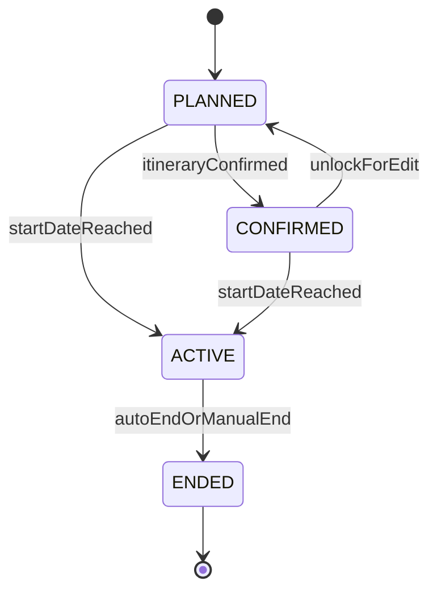
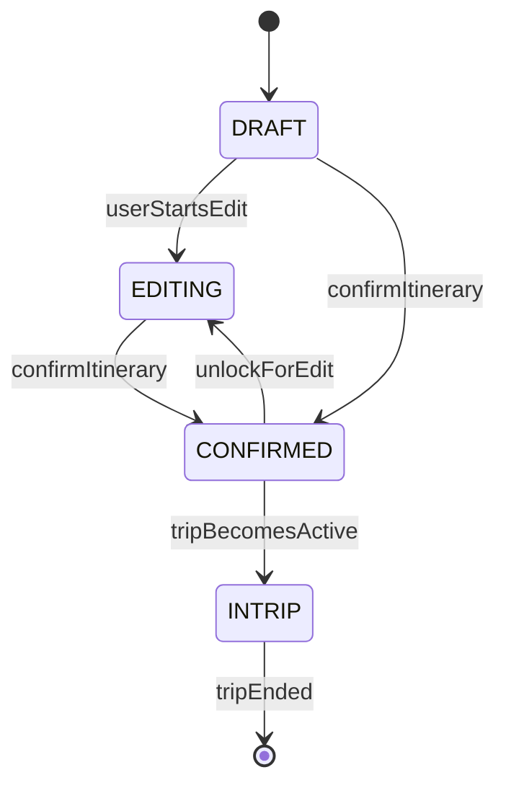
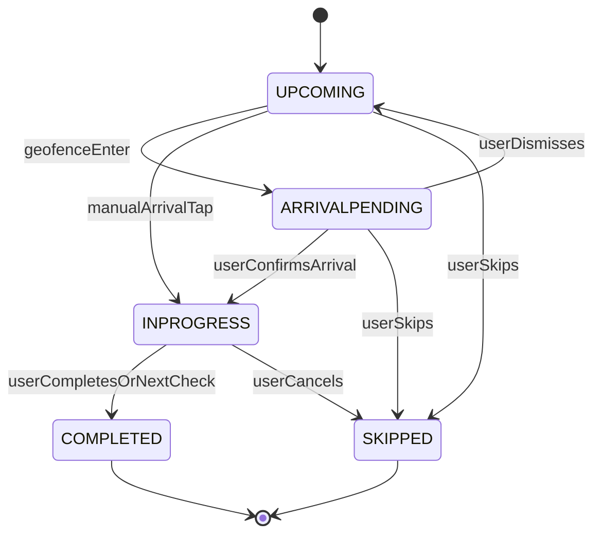

# 컴포넌트 정의 (Components)

> 2026-07-04 · 경계 근거: PRD 13-구현결정 모듈 17개 + M18(Δ7) + 공통 3개. `[후속]`은 1차 코드 생성 제외(아키텍처 여지만 확보).
>
> **문서 위상**: 본 문서는 컴포넌트의 **목적·책임·소유 데이터·상태 머신·폴백 책임**의 정본이다. 메서드 시그니처는 [component-methods.md](./component-methods.md), 의존 관계는 [component-dependency.md](./component-dependency.md), 오케스트레이션 플로우·이벤트는 [services.md](./services.md)가 각각 소유한다. 기능 상세 동작·수용 기준은 docs/PRD/ 원문이 정본이며, 결정 ID(D/Δ/N/G)는 [requirements.md](../requirements/requirements.md) §4·§5·§7을 가리킨다.

---

## 1. 컴포넌트 지도

### 1.1 기능 모듈 (M1~M18)

| ID | 컴포넌트 | 한 줄 책임 | 관련 에픽 | 태그 |
|---|---|---|---|---|
| M1 | Auth | 가입·로그인·토큰·동의 증적·계정 생명주기 | E1 | 1차 |
| M2 | User Profile | 닉네임·취향 7종·중립 기본값·개인화 입력 공급 | E1, E9 | 1차 |
| M3 | Accommodation Search | 숙소 탐색·필터·상세·위시리스트 | E3 | 1차 |
| M4 | Saved Accommodation | 등록 숙소(계정 풀)·여행 거점 연결·숙소 ID 통합 | E3, E4 | 1차 |
| M5 | Affiliate Link | OTA 딥링크 생성·고지·아웃바운드 클릭 기록 | E3 | 1차 |
| M6 | Trip Creation | 여행 CRUD·예산·시간창·필수 방문지·여행 상태 머신 | E4 | 1차 |
| M7 | Place Data | POI 정본·canonical ID·하이브리드 캐싱·후보 풀 | E2~E8 횡단 | 1차 |
| M8 | Itinerary Generation | 일정 생성 오케스트레이션·편집 재검증·일정 상태 머신 | E5 | 1차 |
| M9 | Plan-B Detection | 자동 트리거 4종 감지·억제·민감도 | E7 | 1차 |
| M10 | Itinerary Recalculation | 재계획 세션·후보 생성·전/후 비교·확정 | E7 | 1차 |
| M11 | Weather & Context | 기상청 예보·특보 수집·격자 변환·캐시 | E7 | 1차 |
| M12 | Travel Archive | actual 기록·사진·changelog·오프라인 동기화 | E8 | 1차 |
| M13 | AI Reflection | 회고·전체 요약·스타일 분석·공유 카드 | E8 | 1차 |
| M14 | Notification | 서버 스케줄링 발송·FCM·알림함·토글·방해금지 | E9 | 1차 |
| M15 | Community | 공개 스냅샷·피드·좋아요·댓글·신고·차단 | E11 | `[후속]` |
| M16 | Assistant | 대화 오케스트레이션·모듈 호출 위임·가드레일 | E10 | `[후속]` |
| M17 | Collaborative Editing | 초대·권한·항목 잠금·충돌 해소·프레즌스 | E12 | `[후속]` |
| M18 | Trip Execution | 활성 허브·도착 확인·방문 상태 머신·여행 종료 전이 | E6, E2 | 1차 |

### 1.2 공통(횡단) 컴포넌트 (C1~C3)

| ID | 컴포넌트 | 한 줄 책임 |
|---|---|---|
| C1 | LLM Gateway | 단일 벤더 서버 경유 호출·티어 라우팅·서버 재조회 주입·스키마 검증 |
| C2 | Solver Engine | OPTW/TOPTW 최적화·하드 제약 검증·이동시간 추정·결정론적 폴백 |
| C3 | Content Moderation | 금칙어 사전 검증(닉네임·여행 제목 1차, UGC 확장 여지) |

### 1.3 계층 다이어그램

```text
+------------------------------------------------------------------+
| [후속 상위 소비자]  M15 Community | M16 Assistant | M17 Collab    |
+------------------------------------------------------------------+
| [여정 오케스트레이션]                                             |
|   M8 Itinerary <-> M10 Recalc <- M9 Detection <- M18 Execution   |
|                                        |              |          |
|                                        v              v          |
|                                   M11 Weather    M13 Reflection  |
+------------------------------------------------------------------+
| [도메인 기반]                                                     |
|   M6 Trip - M4 SavedStay - M3 Search - M5 Affiliate              |
|   M12 Archive - M14 Notification                                 |
+------------------------------------------------------------------+
| [계정 기반]   M1 Auth - M2 Profile                                |
+------------------------------------------------------------------+
| [공통 하위]   C1 LLM | C2 Solver | C3 Moderation | M7 PlaceData   |
+------------------------------------------------------------------+
```

(텍스트 대안: 후속 모듈 M15~M17은 1차 모듈의 공개 퍼사드만 소비하는 최상위 계층. 여정 오케스트레이션 계층(M8·M9·M10·M11·M13·M18)이 도메인 기반 계층(M3~M6·M12·M14)과 계정 계층(M1·M2)에 의존하며, 공통 하위 계층(C1~C3·M7)은 어떤 기능 모듈에도 의존하지 않는다.)

---

## 2. 공통 설계 규약

모든 컴포넌트에 공통 적용되는 경계 규칙. 개별 컴포넌트 절에서는 이 규약과의 차이만 기술한다.

1. **모듈러 모놀리스 경계 (D04)** — 단일 배포 단위 내에서 각 모듈은 자기 소유 테이블에만 쓰기 접근한다. 타 모듈 데이터는 반드시 공개 퍼사드(동기) 또는 도메인 이벤트(비동기)로만 접근한다. 스케줄러·워커도 동일 배포 내 스레드로 시작하되 모듈 경계를 지켜 추후 분리 워커 전환이 가능해야 한다.
2. **어댑터 계약 (Port/Adapter, D37·RESILIENCY-10)** — 모든 외부 API는 `{Capability}Port` 인터페이스 뒤에 `{Vendor}Adapter` 구현으로 격리한다. PR CI는 Port에 대한 fake로 테스트하고, 실 어댑터는 명시적 타임아웃 + 서킷 브레이커 + 실패율 계측(§6.7 관측성)을 갖는다.
3. **침묵 실패 금지 (ADR-0011)** — 각 컴포넌트는 자기 외부 의존·AI 산출의 폴백 경로를 소유한다. "실패 시 어떤 사용자 관찰 가능한 대체 경로를 제공하는가"를 각 절의 '실패·폴백 책임'에 명시한다.
4. **plan/current/actual/changelog 구분 (ADR-0013, D14)** — 계획 스냅샷(plan, 불변)은 M8, 현재본(current, 가변)은 M8(변경 주체는 M8·M10), 실제(actual)와 변경 이력(changelog)은 M12가 소유한다. changelog는 통합 스키마(G132: 행위자·출처 유형·사유·전/후 값) 하나로 Plan-B·공동편집·어시스턴트 변경을 모두 수용한다.
5. **권한 검증 (SECURITY-08)** — 모든 퍼사드는 deny-by-default. 리소스 ID 참조 시 소유권 검증(IDOR 방지)은 각 소유 모듈의 책임이다.
6. **금칙어 검증 (C3)** — 사용자 노출 텍스트(닉네임·여행 제목, 후속: 캡션·댓글)는 저장 전 C3를 경유한다.
7. **상태 머신 PBT (PBT 전체 강제)** — §3의 상태 머신 3종(여행·일정·방문)과 솔버 하드 제약은 속성 기반 테스트 1급 대상이다(Kotest/fast-check, 시드 로깅·수축 필수). 속성 식별은 유닛별 Functional Design에서 수행(PBT-01).

**외부 어댑터 소유 맵**:

| Port(계약 인터페이스) | 대표 Adapter | 소유 컴포넌트 |
|---|---|---|
| `SocialOAuthPort` | Google/Apple/Kakao/Naver OAuthAdapter | M1 |
| `MailDeliveryPort` | (관리형 메일 발송) | M1 |
| `PlaceSearchPort` / `GeocodingPort` | `KakaoLocalAdapter`(1차), `NaverLocalAdapter`(2차 폴백) | M7 |
| `TourContentPort` | `TourApiAdapter` | M7 (M3 공용 소비) |
| `RoadDistancePort` | `TmapDistanceAdapter`(1차), `NaverDistanceAdapter`(2차), 직선거리 추정(최종) | C2 |
| `WeatherPort` | `KmaOpenApiAdapter`(단기예보·특보) | M11 |
| `LlmPort` | `ManagedLlmVendorAdapter`(단일 벤더, 티어 2종) | C1 |
| `PushPort` | `FcmAdapter`(iOS 포함 FCM 단일) | M14 |
| `OtaDeeplinkPort` | 파트너별 `OtaPartnerAdapter`(URL 템플릿) | M5 |
| `MediaStoragePort` | S3 호환 오브젝트 스토리지 + CDN | M12 |

---

## 3. 핵심 상태 머신 정본

여행·일정·방문 3종은 시스템 전체 흐름을 결정하는 정본 상태 머신이다. 소유 컴포넌트가 전이 규칙을 강제하며, 타 모듈은 이벤트로만 관찰한다. (상세 전이도의 최종 확정은 Functional Design — requirements.md §9)

### 3.1 여행(Trip) 상태 머신 — 소유: M6 (ACTIVE/ENDED 전이 트리거는 M18)



(텍스트 대안: 계획중(PLANNED)에서 일정 확정 시 확정(CONFIRMED), 확정 해제 시 계획중 복귀. 계획중·확정 어느 쪽이든 시작일 도달 시 진행중(ACTIVE), 진행중에서 자동/수동 종료 시 종료(ENDED). 종료는 최종 상태.)

| 전이 | 트리거 | 가드 조건 | 효과 |
|---|---|---|---|
| PLANNED → CONFIRMED | M8 `ItineraryConfirmed` 이벤트(일정 확정) | 여행 시작 전 · 활성 일정 존재 | plan 스냅샷 동결(D14) 참조, M14 리마인드 스케줄 |
| CONFIRMED → PLANNED | M8 `unlockForEdit`(확정 해제, D20) | 여행 시작 전(여행 중 편집은 current에만 반영되므로 이 전이 불가) | 재확정 전 신규 커뮤니티 공개 불가(D20) |
| PLANNED/CONFIRMED → ACTIVE | 시작일 00:00 도달(M18 일자 경계 배치) | D21로 동시 활성 여행은 구조적으로 최대 1개(생성 시 날짜 겹침 차단) · 일정 미확정이라도 날짜 구간 진입이면 ACTIVE(PRD 07-1 '여행 중' 정의) | 홈 활성 카드·일정 탭이 M18 허브로 수렴, plan/current 분리 시작(D14) |
| ACTIVE → ENDED | (a) 종료일 다음날 00:00 자동 배치(M18 `autoEndTrips`) (b) 사용자 '여행 종료' 수동 버튼 | ACTIVE 상태 · 숙소 유무 무관 단일 규칙(D19, Δ4) | `TripEnded` 발행 → M13 회고 자동 생성, M14 완료 알림, M12 기록 귀속 마감 |
| ENDED (최종) | — | 재개 없음 · 종료 후 기록 편집은 허용, 회고 갱신은 수동 재생성만(C11) | — |

- **하위 상태(ACTIVE 내)**: `NORMAL` / `REST`(휴식 모드, G54) — 소유 M18. §4.M18 참조.
- **직교 플래그**: `deletedAt`(소프트 삭제 30일 유예, D18) — 상태와 독립으로 즉시 비노출 처리.

### 3.2 일정(Itinerary) 상태 머신 — 소유: M8



(텍스트 대안: 초안(DRAFT)에서 편집 시작으로 편집중(EDITING), 확정 조작으로 확정(CONFIRMED, plan 스냅샷 동결). 확정 해제 시 편집중 복귀(재확정 필요). 여행이 진행중이 되면 여행 중(INTRIP) 모드로 전환되어 plan 불변 + current 가변 이원 구조로 동작하고, 여행 종료 시 종결.)

| 전이 | 트리거 | 가드 조건 | 효과 |
|---|---|---|---|
| (없음) → DRAFT | `generateItinerary` 시작(3방식 공통) | 등록 숙소 존재 또는 숙소 나중 등록 온램프(PRD 06-1·11) | 생성 취소 시 부분 일정을 초안으로 보존 + '이어서 생성' 진입점(G161) |
| DRAFT → EDITING | 사용자 편집 진입(추가·삭제·재정렬·시간 조정) | — | 매 수정마다 클라이언트 경량 검증(D28) + 위반 배지 표시(차단 아님, PRD 06-7) |
| DRAFT/EDITING → CONFIRMED | 사용자 '일정 확정' | 서버 확정 검증(C2 `validate`) 통과 · 위반 잔존 시 'AI 자동 보정 / 그대로 저장' 선택 완료(PRD 06-7 예외) | **plan 스냅샷 동결(D14)** · `ItineraryConfirmed` → M6 여행 CONFIRMED 전이, M14 리마인드 재계산 |
| CONFIRMED → EDITING | `unlockForEdit`(D20) | 여행 시작 전 | '편집 중' 표시 · 저장 후 재확정 필요 · 기존 공개본(D16 스냅샷)은 유지, 재확정 전 신규 공개 불가 |
| CONFIRMED → INTRIP | 여행 ACTIVE 전이(M18) | — | 이후 모든 편집·Plan-B 결과는 **current에만** 반영(D14) · plan은 회고 대조용으로 불변 유지 |
| any → DRAFT(재생성) | 사용자 '다시 생성' | LOCK 슬롯·체류 고정값·수동 추가 POI는 고정 블록으로 보존(warm-start, G46/G136) | 여행당 활성 일정 1개, 이전 상태는 changelog로 추적 |

### 3.3 방문(Visit) 상태 머신 — 소유: M18 (기록 영속은 M12)



(텍스트 대안: 다음(UPCOMING)에서 지오펜스 진입 시 도착확인대기(ARRIVALPENDING)로, 사용자가 확인 탭하면 진행중(INPROGRESS), 무시하면 다음으로 복귀. 수동 도착 탭으로 지오펜스 없이 바로 진행중 진입 가능. 진행중에서 완료 탭 또는 다음 장소 체크로 완료(COMPLETED). 어느 상태에서든 사용자 스킵으로 스킵(SKIPPED).)

| 전이 | 트리거 | 가드 조건 | 효과 |
|---|---|---|---|
| UPCOMING → ARRIVALPENDING | 지오펜스 진입 감지(포그라운드) 또는 외부 지도앱 복귀 시 다음 예정지 근접(G66) | 위치 3층 동의 충족(G182) · GPS 정확도 충분(미달 시 이 전이 생략, 수동 경로만) · 동일 방문지 재프롬프트 억제 | '도착하셨나요?' 프롬프트 노출 — **자동 기록 없음, 확정은 항상 사용자 탭**(D23) |
| ARRIVALPENDING → INPROGRESS | 사용자 '도착했어요' 탭 | — | `arrivedAt` 기록(기기 시각, 수정 가능) → M12 actual · `VisitChecked(start)` 발행 |
| UPCOMING → INPROGRESS | 사용자 수동 '도착' 탭 | 위치 동의·감지와 무관하게 항상 가능(ADR-0010·D23) | 동일 |
| ARRIVALPENDING → UPCOMING | 프롬프트 닫기/무시 | — | 해당 방문지 재프롬프트 억제 |
| INPROGRESS → COMPLETED | (a) 사용자 '방문 완료' 탭 (b) 다음 장소 도착 체크 | (b)의 경우 `departedAt`은 다음 장소 체크 시각으로 추정(D23) | 실제 체류 시간 산출 → M12 보관(plan 체류와 대조) · 체류 초과 시 M9에 신호(`VisitChecked(complete)`) |
| any → SKIPPED | 사용자 '방문 안 함/스킵/취소' | — | M12에 스킵 기록 · 잔여 일정 영향 시 Plan-B 제안 연결(PRD 09-1) |
| COMPLETED/SKIPPED 이후 | 사용자 시각·상태 수정 | 기록 편집으로 처리(상태 재전이 아님, PRD 09-1·C11) | changelog 기록 |

### 3.4 보조 상태 머신 목록

| 상태 머신 | 소유 | 상태 개요 | 상세 위치 |
|---|---|---|---|
| 계정(Account) | M1 | 미인증 → 활성 → 삭제유예(30일) → 삭제 | §4.M1 |
| Plan-B 트리거 수명 | M9 | 감지 → 발화 → 노출 → 수락/무시 → 억제 | §4.M9 |
| 재계획 세션 | M10 | 시작 → 후보 제시 → 비교 → 확정/취소 | §4.M10 |
| 사진 업로드 | M12 | 로컬 보관 → 업로드 대기 → 재시도(3회) → 실패/완료 | §4.M12 |
| 오프라인 기록 동기화 | M12 | 로컬 작성 → 동기화 대기 → 충돌 해소 → 반영 | §4.M12 |
| 알림 수명 | M14 | 스케줄 → 발송/억제 → 알림함 적재 → 읽음 → 만료(90일) | §4.M14 |
| 게시물(공개 콘텐츠) `[후속]` | M15 | 비공개 → 공개 → 검토중(보류) → 복원/삭제 | §4.M15 |
| 항목 잠금 `[후속]` | M17 | 해제 → 잠김(TTL) → 하트비트 연장 → 만료/강제 해제 | §4.M17 |

---

## 4. 기능 모듈 상세

### M1 Auth (인증)

**목적** — 여행자 단일 사용자 유형의 가입·로그인·세션·법정 동의 증적·계정 생명주기를 소유한다. 전 기능의 Critical 의존 지점(§6.3 워크로드 분류)으로, 앱 부트스트랩 계약(세션·약관 버전·최소 지원 버전)도 제공한다.

**책임**
- 소셜 4종(Google·Apple·카카오·네이버) OAuth 가입/로그인 — 제공자 `sub` 기준 계정 식별, 동일 이메일 충돌 시 기존 수단 유도, Apple 비공개 릴레이는 best-effort 대조 후 별도 계정 허용 (PRD 03-1)
- 이메일 가입: 인증 링크(유효 24시간, 재발송 분당 1회·일 5회), 미인증 계정 7일 후 정리, 비밀번호 8자+영문/숫자+유출 목록 검증, bcrypt/argon2 해시 (G22, SECURITY-12)
- 비밀번호 재설정(재설정 링크), 로그인 브루트포스 방어(점진 지연 또는 잠금)
- 토큰 발급·회전: 액세스 1시간 + 리프레시 90일 회전, 다기기 동시 로그인 허용, 세션별 무효화 (D36)
- 연령 확인: 생년월일 또는 '만 14세 이상' 확인 필수, 미만 차단 — 소셜 경로 동일 적용 (N1)
- 약관 동의 증적: 항목·일시·버전 저장(append-only), 약관 버전별 '재동의 필요' 플래그, 중대 변경 시 스플래시 분기 재동의 강제 판정 제공 (PRD 03-2, N3)
- 위치기반서비스 약관 별도 필수 동의 + GPS 기록 옵트인 동의의 서버측 기록 (N2 — 조합 상태 해석은 클라이언트 shared/location, 증적 정본은 M1)
- 마케팅 수신 동의 수집·철회 토글 상태 관리 (N8)
- 계정 삭제 30일 유예: 즉시 비노출 → 유예 만료 배치가 연쇄 삭제 오케스트레이션(services.md S6), 유예 중 동일 식별자 재가입 제한 (D18, C4)
- 부트스트랩 응답 계약: 세션 유효성·약관 재동의 필요 여부·**서버 최소 지원 버전**(강제 업데이트 게이트 입력) 제공 (N4, PRD 01-1)

**소유 엔티티/데이터**

| 엔티티 | 핵심 속성 | 상태 필드 |
|---|---|---|
| Account | email, passwordHash?, birthDateOrAgeConfirm, marketingOptIn | `status: UNVERIFIED → ACTIVE → DELETION_PENDING → DELETED` + (후속 예약) 제재 상태 필드(G179) |
| SocialIdentity | provider, providerSub, linkedAccountId (N:1) | — |
| ConsentRecord | consentType(이용약관/개인정보/위치약관/GPS옵트인/마케팅/개인화), termsVersion, agreedAt, revokedAt? | append-only |
| TermsVersion | version, effectiveAt, reconsentRequired(중대/경미) | — |
| RefreshSession | tokenHash, deviceId, issuedAt, rotatedAt, revokedAt? | 회전 체인 |
| DeletionSchedule | requestedAt, purgeAt(+30일) | 유예 관리 |

**공개 인터페이스 개요** (시그니처: component-methods.md)
- 가입·로그인 그룹: 소셜/이메일 가입, 이메일 인증, 로그인, 비밀번호 재설정
- 세션 그룹: 토큰 갱신(회전), 로그아웃(세션 무효화), 부트스트랩 확인
- 동의 그룹: 동의 기록·조회, 재동의 필요 판정, 마케팅/개인화/GPS 옵트인 토글
- 생명주기 그룹: 삭제 요청·철회, (배치) 유예 만료 처리·미인증 정리

**외부 의존** — `SocialOAuthPort`(4종 어댑터), `MailDeliveryPort`(인증·재설정 메일)

**상태 머신 (계정)**

| 전이 | 트리거 | 가드 |
|---|---|---|
| UNVERIFIED → ACTIVE | 이메일 인증 완료(소셜은 생성 즉시 ACTIVE) | 연령 확인 통과(N1) |
| UNVERIFIED → 삭제(정리) | 7일 경과 배치 | 미인증 유지(G22) |
| ACTIVE → DELETION_PENDING | 사용자 삭제 요청 | 재확인 완료 · 연쇄 삭제 범위 사전 고지(PRD 12-9) |
| DELETION_PENDING → ACTIVE | 유예 내 삭제 철회 로그인 | 30일 이내 |
| DELETION_PENDING → DELETED | 유예 만료 배치(D18) | 법정 보존 데이터(위치 로그 등)만 분리 보관, 나머지 완전 삭제·익명화 |

**실패·폴백 책임 (ADR-0011)**
- 소셜 제공자 오류(타임아웃·5xx): "잠시 후 다시 시도" + 재시도 버튼, 계정 미생성 보장 (PRD 03-1 예외)
- 인증 메일 발송 실패: 미인증 상태 유지 + 재발송 동작 제공, 온보딩 진행 차단
- 부트스트랩 확인 지연: 클라이언트가 마지막 로컬 세션 상태로 분기(G5) — 서버는 온라인 복구 시 재검증을 위한 멱등 확인 API 보장

**관련 결정** — D18, D22, D36, N1, N2(증적), N3, N4, N8, G5, G20, G22, C4 / SECURITY-08·12·14

---

### M2 User Profile (사용자 프로필)

**목적** — 닉네임과 여행 취향 7종(스타일·페이스·예산·동행·선호 활동·이동 방식·음식)을 저장·수정하고, AI 일정 생성·재계획·숙소 탐색의 개인화 입력값을 **미설정 시 중립 기본값 포함**으로 공급한다.

**책임**
- 닉네임 자동 생성: '형용사+여행명사+2자리 숫자' 패턴, 충돌 시 재추첨 (G23) — 자동 생성값만으로 온보딩 통과 허용 (PRD 03-3)
- 닉네임 수정 검증: 2~20자·금칙어(C3 위임)·중복, 위반 시 인라인 오류 + 대체 추천 (PRD 03-3)
- 취향 7종 CRUD: 온보딩과 설정에서 동일 선택지, 건너뛰기=미설정 저장, 수정 즉시 반영 (PRD 03-5~12·15)
- 동행 유형은 기본 유형 단일 선택 + '반려동물 동반' 보조 불리언 분리 (G19)
- 러프 예산: 4구간 + 직접 입력 시 총액 원값+매핑 구간 함께 저장, 1박 가격대 환산은 여행 생성 시점 위임 — **전체 여행 총액 기준**(Δ2) (G26)
- 중립 기본값 공급: 미설정 축 무가중치, 이동 방식 미설정 시 '대중교통' 보수 추정 — 전 취향 미설정에도 일정 생성 무실패 보장 (PRD 03-14)
- 미설정 취향 목록 제공 → 홈·첫 여행 생성 직전 점진 설정 카드의 데이터 소스 (G24/G157)
- 개인화 입력 우선순위: 사용자 직접 설정 값 > M13 자동 스타일 분석 (PRD 12-10)
- 여행 기록 개인화 활용 동의(옵트아웃 시 과거 기록 추천 입력 제외) 상태 반영 (PRD 09-10)
- 온보딩 완료 판정 데이터: '약관 동의 + 닉네임 통과' = 완료, 취향 이탈은 완료 처리 (G24)

**소유 엔티티/데이터**

| 엔티티 | 핵심 속성 | 상태 필드 |
|---|---|---|
| Profile | accountId, nickname, onboardingCompletedAt | — |
| PreferenceSet | style[], pace, budgetTier+rawAmount?, companionType+petFlag, activities[], transportModes[], foodTastes[] | 각 축 nullable(미설정=중립) |
| PersonalizationConsent | historyBasedRecommendation: on/off | — |

**공개 인터페이스 개요** — 닉네임 그룹(생성·검증·수정) / 취향 그룹(조회 — 중립 기본값 채움, 수정) / 개인화 그룹(입력 벡터 공급, 미설정 축 목록)

**외부 의존** — 없음(내부 C3만)

**실패·폴백 책임** — 취향 미설정·부분 설정은 실패가 아니라 정상 경로(중립 기본값). 추천 근거 부족 시 "취향을 설정하면 더 맞춤화" 안내 데이터를 소비자(M8)에 제공 (PRD 03-14 예외).

**관련 결정** — D26(Δ2), G19, G23, G24/G157, G26, C3(§7.4 닉네임 전파 규칙: 표시=라이브 참조, 기록 출처=시점 스냅샷)

---

### M3 Accommodation Search (숙소 탐색)

**목적** — TourAPI+지도 기반으로 숙소를 탐색·필터링하고 정적 콘텐츠 상세와 위시리스트를 제공한다. D09(OTA 계약 확정 전 MVP)에 따라 가격·재고·리뷰는 보유하지 않고 외부 위임 경계를 지킨다.

**책임**
- 여행지(또는 '내 주변') 단일 입력 탐색 — 날짜·인원은 탐색 단계에서 받지 않음 (PRD 04-1)
- 데이터 소스: TourAPI + 지도 장소 데이터(M7 경유), 국내 OTA 크롤링 금지 — 딥링크 위임만 (PRD 04 데이터 모델 註, D09)
- 필터·정렬: 대표 가격대(구간)·숙소 유형(TourAPI cat3 정본)·편의시설(채움률 검증 후 노출, 미확보 시 핵심 3종 폴백)·거리(검색 여행지 중심 좌표 기준 직선거리 G34) — 정확 가격 의존 가격순 정렬은 미제공, '대표 가격대순' 대체 (PRD 04-2)
- 상세 화면 데이터: 위치·사진·가격대·편의시설·체크인/아웃 시각 등 정적 콘텐츠만 — 리뷰·평점 미표시(외부 OTA 위임), 누락 필드 "미확인" 표기 (PRD 04-3)
- 위시리스트: 계정 귀속 저장·삭제·메모, 가격 변동 가능 고지, 최신 정보 확인 불가 시 stale 표시 (PRD 04-4, 05-4)
- 필터 0건 시 원인 필터 표기 + 완화 제안, 결과 0건 시 다음 행동 제안(수동 등록 우회 포함) (PRD 04-2·10)
- 정적 콘텐츠 캐시 일 1회 갱신, 라이브 가격 호출은 파트너 계약 후 약관 최소치로만 확대 (G196 — 1차는 정확 가격 조회 자체를 M5 딥링크로 위임)
- 위시리스트→등록 전환 진입점 데이터('예약했어요/등록' 액션) 제공 — 등록 자체는 M4 (PRD 04-6)

**소유 엔티티/데이터**

| 엔티티 | 핵심 속성 | 상태 필드 |
|---|---|---|
| WishlistItem | accountId, stayRef(M4 StayIdentity 참조), memo, savedAt, snapshotAtSave | staleFlag(외부 소스 소실 시) |
| StayStaticCache | stayRef, name, coord, type, amenities[], priceBand, photos[], checkInOut | fetchedAt + TTL(약관 허용 범위, D13) |

**공개 인터페이스 개요** — 탐색 그룹(검색·필터·페이지네이션) / 상세 그룹(정적 상세) / 위시리스트 그룹(저장·삭제·메모·목록)

**외부 의존** — M7 경유 `TourContentPort`·`PlaceSearchPort` (M3 자체 어댑터 없음 — 소스 표준화는 M7 소유, ADR-0009)

**실패·폴백 책임 (ADR-0011)**
- 일부 소스 실패: 가용 결과로 목록 구성 + "일부 정보가 빠졌을 수 있어요" 표기 (PRD 04-11)
- 전체 조회 실패: 재시도 + 숙소 수동 등록(M4 직접 등록 3경로) 우회 안내
- 데이터 누락 필드: 빈칸 대신 "미확인" (혼잡도 등은 1차 '미확인' 통일 G199와 동일 관행)

**관련 결정** — D09, D13(TTL 캐시), G8, G33(가격 보기 — 계약 후 확대 여지), G34, G103(M4와 통합 목록), G123, G196

---

### M4 Saved Accommodation (등록 숙소)

**목적** — 사용자가 외부에서 예약했거나 앱에서 저장한 숙소를 '등록'해 관리하는 **계정 레벨 풀**을 소유하고, 여행과의 거점 연결(조인)·날짜 비중첩 검증·숙소 식별 통합을 담당한다. 등록 숙소 = AI 일정 생성의 출발점(ADR-0002·0004).

**책임**
- 등록 CRUD: 숙소(장소)·체크인/아웃·인원 필수, OTA명·예약번호·금액 선택 — 예약 상태 추적 없음(사용자 입력 기록만) (PRD 04-6·9)
- 직접 등록 3경로: (a) 지도/장소 검색 자동 채움(M7), (b) OTA URL 붙여넣기 파싱 — URL 패턴만, 페이지 fetch 없음, 지원 도메인 화이트리스트 (G31), (c) 지도 핀 직접 지정 (PRD 04-8)
- 계정 레벨 풀 + 여행 거점 연결: 여행 없이 등록 가능, 날짜 비중첩 검증은 **같은 여행 내 거점끼리만** (D15)
- 겹침·공백 구간의 스마트 기본 거점(공백일=직전 숙소, 겹침=체크인 우선) 채움 + 비차단 사후 수정 안내 데이터 (PRD 05-6)
- 다박 등록: 체크인~아웃 연속 기간 단일 등록, 'N박 체류' 묶음 표기 데이터 (PRD 05-7)
- 숙소 식별 통합: 내부 canonical 숙소 ID + 소스별 외부 ID N:1 매핑, 좌표+이름 유사도 자동 매칭 + 운영자 보정 여지 (D17)
- 등록 시점 스냅샷 영구 저장 — '사용자 입력 데이터'로 취급(법무 확인 전제 §8-P2) (D13)
- 거점 지정/해제 전환: 해제 시 기존 일정 유지 + 리마인드 중단·재생성 유도 배지 이벤트 발행 (G97, PRD 12-6)
- 체크인/아웃 날짜를 여행 기간으로 가져오기 제안·충돌 시 병렬 제시 데이터 (PRD 05-5)
- 저장(M3 위시리스트)/등록 통합 목록 + 출처 라벨('외부 OTA 예약 등록'/'앱 내 저장') (G103, PRD 12-6)

**소유 엔티티/데이터**

| 엔티티 | 핵심 속성 | 상태 필드 |
|---|---|---|
| SavedStay | accountId, stayIdentityRef, placeSnapshot(이름·주소·좌표 — 등록 시점 동결 D13), checkIn, checkOut, party, otaName?, reservationNo?, amount? | coordConfirmed(핀 확정 여부) |
| StayIdentity | canonicalStayId, externalIds[{source, externalId}] (N:1), matchConfidence | 운영자 보정 플래그 |
| BaseAssignment | savedStayId, tripId, dateRange, isSmartDefault | 거점 활성 여부 |

**공개 인터페이스 개요** — 등록 그룹(3경로 등록·수정·취소) / 거점 그룹(여행 연결·해제·비중첩 검증·스마트 기본 거점) / 식별 그룹(외부 ID 해석·매핑) / 목록 그룹(통합 목록)

**외부 의존** — M7 경유 장소 검색·지오코딩. URL 파싱은 자체(네트워크 fetch 없음).

**실패·폴백 책임 (ADR-0011)**
- 지오코딩 실패·좌표 미확정: "지도에서 위치 확인" 단계 강제, 확정 전 해당 숙소 기준 일정 생성 보류 (PRD 06-1 예외)
- URL 추출 실패: "위치를 찾지 못했어요" + 수동 핀 지정 흐름 (PRD 04-8 예외)
- 지도 검색 API 무응답: 핀 직접 지정 폴백
- 날짜 불완전·역전: 저장 차단 + 누락 항목 인라인 표시 (PRD 04-6 예외)

**관련 결정** — D13, D15, D17, G30, G31, G97, G103, G128, G150

---

### M5 Affiliate Link (제휴 링크)

**목적** — 숙소 예약·결제로 나가는 외부 경로(OTA 딥링크)의 생성·고지·클릭 기록을 소유한다. 앱은 실거래를 보유하지 않으며(ADR-0003·0012), 1차는 **숙소명 검색 딥링크만** 제공한다(D09).

**책임**
- OTA 숙소명 검색 딥링크 생성: 파트너별 URL 템플릿, 동일 숙소 복수 OTA 시 선택 목록 데이터 (PRD 04-5, D09)
- 제휴 고지 트리거: 외부 이동 직전 "예약·결제는 외부 OTA에서 진행 + 제휴 수수료" 고지 필요 여부 판정, '다시 보지 않기' 설정 연동 (PRD 04-5, 12-12 — 광고·제휴 표시 규제)
- 아웃바운드 클릭 기록: 내부 집계 전용, 사용자·LLM 컨텍스트 비노출(내부 운영 지표 — PRD 13 비고, SECURITY-11 정합)
- 복귀 핸드오프 판단 데이터: 딥링크 이탈 후 24시간 내 첫 복귀 시 1회 노출·최근 이탈 숙소 1건, 무시 시 재노출 없음 (G32, PRD 04-5)
- 포스트백(예약 확인→1탭 자동 등록) 수신 인터페이스의 **설계 여지만** 확보 — 1차 미구현, 집계용 스키마만 (G29/G108, D09)
- 링크 유효성 실패 대응: 404·만료 시 다른 OTA 링크 또는 장소 검색 우회 경로 제시 데이터 (PRD 04-5 예외)

**소유 엔티티/데이터**

| 엔티티 | 핵심 속성 | 상태 필드 |
|---|---|---|
| OutboundClick | accountId, stayRef, otaPartner, clickedAt | handoffShownAt?(복귀 카드 1회 노출 추적) |
| OtaPartner | partnerCode, deeplinkTemplate, policyNote(약관 최소치) | 활성 여부 |
| (예약) PostbackRecord | 스키마만 — 1차 미사용 | — |

**공개 인터페이스 개요** — 딥링크 그룹(생성+고지 판정) / 추적 그룹(클릭 기록·복귀 핸드오프 후보 조회) / (여지) 포스트백 수신

**외부 의존** — `OtaDeeplinkPort`(파트너별 어댑터 — 실호출 없는 URL 조립 중심, 링크 유효성 검사 시에만 경량 확인)

**실패·폴백 책임 (ADR-0011)** — 링크 열기 실패 시 이동 미진행 + "링크를 열 수 없습니다" 안내(PRD 12-12 예외). 클릭 기록 실패는 사용자 흐름을 차단하지 않는다(비동기 best-effort, 내부 지표 손실만 계측).

**관련 결정** — D09, Δ10(예약 링크 리마인드 알림 제외), G28, G29/G108, G32, G188, G189

---

### M6 Trip Creation (여행 생성)

**목적** — 여행 단위(목적지·기간·인원·예산·제목)의 생성·편집과 필수 방문지 관리를 소유하고, **여행 상태 머신(§3.1)의 정본**을 보관한다.

**책임**
- 여행 CRUD: 여행지·날짜 필수, 인원(기본 1명)·예산 선택 (PRD 05-1)
- 여행 제목: 선택 입력, 미입력 시 '{여행지} N박M일' 자동 생성, 수시 수정, C3 금칙어 검증 (N6)
- 날짜 검증: 종료일≥시작일, **기존 여행과 날짜 구간 겹침 차단**(활성 여행 항상 최대 1개, D21·Δ3), 시작일 오늘 이후·최대 30일 (G42)
- 국내 한정 강제: 여행지 좌표 국내 범위(bounding box/역지오코딩) 검증, 벗어나면 차단+사유 (G120)
- 예산: **여행 전체 총액(항공 제외)** 입력·저장, 1인·1일 값은 인원·일수 나눔 파생 (D26·Δ2) — v1 카테고리 분배 없음, 일예산 산출만·솔버 소프트 가중치 전달 (G37/G47)
- 시간창: 기본 09:00~21:00 + 여행별 조정(D29), 날짜별 '이용 가능 시작/종료 시각' 선택 입력(첫날·마지막날 대응, G119), 자정 초과 활동은 해당 일자 귀속(논리적 하루)
- 여행별 속성: 동행 유형·이동 수단·예산대를 여행 속성으로 저장, 계정 취향(M2)을 기본값 제안 (G134)
- 필수 방문지 관리: 포함 고정형(기본)/시각 고정형 2유형(PRD 05-8), 일수 비례 한도(하루 3곳×일수, 초과 차단 G40), 저장 POI는 **사본 복제** 투입(원본 삭제와 독립, G129), 체크박스 투입 화면·권역 밖 경고 배지(G158), 좌표 미확인 시 핀 지정 요구
- 첫날 거점 공백 시 여행지 중심 좌표를 기본 거점으로 (G41)
- 기간 축소·숙소 삭제 등 파괴적 변경: 차단형 확인 — 영향 블록 나열 후 사용자 확인 필수 (G39)
- 여행 상태 머신 정본 보관(§3.1) — CONFIRMED 전이는 M8 이벤트, ACTIVE/ENDED 전이는 M18 트리거를 수용
- 소프트 삭제(D18): 삭제 시 연쇄 영향(일정·기록) 미리보기 후 확정

**소유 엔티티/데이터**

| 엔티티 | 핵심 속성 | 상태 필드 |
|---|---|---|
| Trip | title, destination(+중심 좌표), startDate, endDate, party, budgetTotal?, attributes{companion, transport, budgetTier}, perDayWindows[] | `status: PLANNED → CONFIRMED → ACTIVE → ENDED` (§3.1) + deletedAt? |
| MustVisit | tripId, poiSnapshotRef(사본, D13·G129), type: `ANYTIME` \| `FIXED`, fixedDate?, fixedStart?, stayDuration? | 배치 불가 시 '확인 필요' 분리 플래그 |

**공개 인터페이스 개요** — 여행 그룹(생성·수정·삭제·상태 조회) / 시간창 그룹(기본+날짜별 조정) / 필수 방문지 그룹(추가·삭제·유형 전환·한도 검증) / 검증 그룹(날짜 겹침·국내 범위·파괴적 변경 미리보기)

**외부 의존** — M7 경유 POI 검색·지오코딩(직접 어댑터 없음), C3(제목 금칙어)

**상태 머신** — §3.1 여행 상태 머신 (정본 소유)

**실패·폴백 책임 (ADR-0011)** — 필수 방문지 좌표 확인 불가: 지도 핀 지정 요구(PRD 05-8 예외). 필수 방문지·고정 블록 충돌: 자동 변경 없이 충돌 강조 + 사용자 선택(정본 처리 규칙은 M8/PRD 06-4). 겹침 검증은 명확한 오류 사유와 함께 차단(Δ3).

**관련 결정** — D18, D21(Δ3), D26(Δ2), D29, N6, G37/G47, G39, G40, G41, G42, G119, G120, G129, G134, G158

---

### M7 Place Data (장소 데이터)

**목적** — 관광지·식당·카페 등 POI를 외부 소스에서 수집·정규화해 **단일 표준 스키마**(ADR-0009)로 전 모듈에 공급한다. canonical POI ID와 하이브리드 캐싱 정책(D13)의 정본 소유자이며, LLM 그라운딩을 구조적으로 보장하는 closed-set 후보 풀(G115)을 만든다.

**책임**
- POI 수집·정규화: 카카오 장소 검색·지오코딩 + TourAPI를 표준 스키마로 변환, 소스별 카테고리 코드 표준화 (ADR-0009, PRD 04-2)
- canonical POI ID: 내부 ID + 소스별 place_id N:1 매핑, 좌표 근접(50m)+명칭 유사도 매칭, 한국어명 정본+영문 alias (G133/G148)
- 하이브리드 캐싱: 탐색·추천 풀은 실시간 호출+약관 허용 TTL 캐시, 사용자 확정 데이터(필수 방문지·방문 체크·등록 숙소)는 확정 시점 스냅샷 영구 저장 (D13) — 출처 표기·영구 캐싱 금지 약관을 데이터 모델에 반영 (ADR-0017)
- 영업시간·카테고리 공급 + 체류 시간 기본값: 카테고리 20~30종 정적 테이블(최소·권장·최대 범위), 출시 후 실측 보정 (G51, PRD 06-3)
- closed-set 후보 풀: 여행 컨텍스트(권역·시간창·취향 축) 기준 후보 집합 구성 — LLM은 이 목록의 ID에서만 선택하므로 그라운딩 실패가 구조적으로 불가능 (G115, §6.6)
- 인기 장소 배치 집계: 최근 7일 저장+방문 가중합 일 1회 배치, 홈 '지금 인기 장소' 공급 (G2)
- 휴무·정기 영업시간 변경 감지: TourAPI·지도 재조회(당일 아침 1회 배치, M9 트리거 입력) — 당일 임시휴무는 자동 감지 대상 아님(수동 트리거 대응) (G192)
- 소실 POI 처리: '확인 불가' 배지 유지, 일정 시드 투입 시 제외 안내 (G8)
- 영업시간 미확인 POI: 확정 배치 대신 사용자 확인 후보로 분리하는 판정 데이터 제공 (PRD 06-3 예외)
- 데이터 품질 게이트 지표: 좌표 확보율 95%·영업시간 채움률 70% (출시 게이트, G192)

**소유 엔티티/데이터**

| 엔티티 | 핵심 속성 | 상태 필드 |
|---|---|---|
| Poi | canonicalPoiId, nameKo(정본)+aliasEn, coord, category(표준), openingHours?, stayRange{min,rec,max}, sourceRefs[{source, placeId}] | `dataStatus: ACTIVE / UNVERIFIED(영업시간 미확인) / LOST(확인 불가) / CLOSED` |
| PoiSnapshot | 사용자 확정 시점 사본(이름·좌표·카테고리·영업시간), snapshotAt, sourceAttribution | 불변 |
| TrendingAggregate | region, poiId, weightedScore(7일 저장+방문), computedAt | 일 1회 갱신 |
| StayTimeTable | category, min/rec/max 기본값 | 운영 정의·remote config 보정 |

**공개 인터페이스 개요** — 조회 그룹(검색·단건·지오코딩) / 후보 풀 그룹(closed-set 구성) / 스냅샷 그룹(사용자 확정 스냅샷 생성) / 집계 그룹(인기 장소) / 배치 그룹(정본 동기화·휴무 재조회)

**외부 의존** — `PlaceSearchPort`+`GeocodingPort`(`KakaoLocalAdapter` 1차, `NaverLocalAdapter` 2차 폴백 — D08), `TourContentPort`(`TourApiAdapter`)

**실패·폴백 책임 (ADR-0011)**
- 1차 소스(카카오) 실패 → 2차(네이버) 폴백 → 최종 캐시 잔존분+"일부 정보 미확인" 표기
- 영업시간·좌표 누락은 오류가 아니라 `UNVERIFIED` 상태로 명시 전파 — 소비자(M8·M9)가 분리 처리
- TTL 만료+재조회 실패 시 stale 데이터에 갱신 실패 표기(허위 최신성 금지)

**관련 결정** — D08, D13, G1, G2, G8, G51, G70, G105, G115, G123, G124, G133/G148, G169, G192, G193 / ADR-0009·0017

---

### M8 Itinerary Generation (AI 일정 생성)

**목적** — 등록 숙소·취향·필수 방문지를 입력으로 LLM 점수(C1)→솔버 배치(C2) 파이프라인을 오케스트레이션해 날짜별 일정을 생성하고, **일정 상태 머신(§3.2)과 plan/current 이원 구조(D14)의 정본**을 소유한다.

**책임**
- 생성 오케스트레이션: M6(여행·시간창·필수 방문지)+M2(취향)+M4(거점)+M7(closed-set 후보 풀)→C1(LLM 선호 점수·설명)→C2(OPTW/TOPTW 배치) — LLM=취향 해석·점수·설명 / 알고리즘=선택·순서·시간 보장 (PRD 06-2, ADR-0008)
- 다중 숙소 날짜별 기준점 자동 전환, 숙소 전환일은 출발점=A·복귀점=B 편도(open-ended) 모델링 (PRD 06-1, G50)
- 3방식 분기: 완전 AI 자동 / 같이 고르기(기준점=직전 확정 슬롯, 첫 슬롯=등록 숙소 G48, 반경 후보·거리 트레이드오프) / 직접 만들기 — 도중 방식 전환 시 진행분 보존 (PRD 06-10)
- 점진 노출: 첫 1일 5초 내 우선 노출, 전체 20초 한계, 단계 텍스트·진행률, 취소 시 부분 일정 초안 보존+'이어서 생성' (D38, G161, PRD 06-9)
- 체류 시간 범위 관리: 최소·권장·최대, 솔버 축소 배치 시 사실 고지 데이터, 사용자 고정 시 고정 제약 전환 (PRD 06-3)
- 편집 재검증: 클라이언트 경량 검증(D28 규칙 명세 공유)+저장 시 서버 확정 검증, 위반은 차단 없이 경고 배지·사유 보존, 저장 시 'AI 자동 보정(최소 변경 — 시각·순서만, POI 추가/삭제 없음 G49) / 그대로 저장' 분기 (PRD 06-7)
- 확정/해제 상태 머신(D20)과 plan 스냅샷 동결·current 관리(D14) — §3.2
- LOCK·고정 블록: 사후 고정(LOCK)·재생성 시 warm-start 보존(LOCK·체류 고정·수동 추가 POI), 여행당 활성 일정 1개 (G46/G136)
- 추천·배치 이유: LLM 설명(표시용)과 솔버 실제 제약 근거 병기, 설명-시각 불일치 시 검증값 우선 (PRD 06-5)
- 이동 구간 표시 데이터: 거리·이동 수단만(범위·추정 표기), **소요시간 삭제**(D25·Δ1), 외부 지도 길찾기 위임 좌표 제공 (PRD 06-6)
- 숙소 나중 등록 온램프: 동선 무게중심 기반 숙소 권역 추천 + before/after 추정 이동 거리 (PRD 06-11)
- 필수 방문지 배치 불가 시: 빈 일정 대신 불가 사유 + 3선택지(다른 날짜/고정 해제/인접 조정) 제안 (PRD 06-4 예외)

**소유 엔티티/데이터**

| 엔티티 | 핵심 속성 | 상태 필드 |
|---|---|---|
| Itinerary | tripId, mode(생성 방식), version | `status: DRAFT → EDITING → CONFIRMED → INTRIP` (§3.2) |
| PlanSnapshot | 확정 시점 전체 일정 동결본(D14) — day·slot·시각·이유 포함 | 불변 |
| CurrentItinerary | 여행 중 가변 현재본 — Plan-B·편집 반영 대상 | 가변(변경은 changelog 경유) |
| DaySchedule / Slot | poiSnapshotRef, start, end, stayRange/fixedStay, sourceType(AI추천/사용자/필수방문지/숙소), locked, violations[], llmReason?, solverReason | 위반 배지 보존 |
| GenerationSession | mode, progress(단계), partialDraft, cancelState | 이어서 생성 지원 |

**공개 인터페이스 개요** — 생성 그룹(3방식 세션·진행 스트림·취소) / 편집 그룹(검증·적용·자동 보정) / 확정 그룹(확정·해제·스냅샷 조회) / 슬롯 그룹(LOCK·교체·같이 고르기 후보) / 온램프 그룹(숙소 권역 추천)

**외부 의존** — C1(LLM 점수·설명), C2(배치·검증·이동시간) — 자체 외부 어댑터 없음

**상태 머신** — §3.2 일정 상태 머신 (정본 소유)

**실패·폴백 책임 (ADR-0011)** — 이 모듈의 폴백 계단이 시스템에서 가장 깊다:
1. LLM 실패 → 규칙 점수 기반 **결정론적 솔버 모드**로 일정 생성 + "일부 추천이 기본 모드로 생성" 고지 (PRD 06-9)
2. LLM 설명만 실패 → 일정은 정상 제공, "추천 이유를 불러오지 못했어요"
3. 외부 POI·영업시간·거리 API 실패 → 캐시·직선거리 추정으로 결정론적 생성 지속
4. 전체 20초 초과 → 결정론적 솔버 폴백 고지 (D38)
5. 모든 경로 실패 → 등록 숙소+시각 고정형 필수 방문지만 배치한 **최소 일정** + 재시도 (PRD 06-9 예외)
6. 저장 중 네트워크 오류 → 클라이언트 임시 보관·재연결 자동 동기화("저장 대기 중") (PRD 06-8)

**관련 결정** — D14, D20, D25(Δ1), D28, D29, D38, G43, G45, G46/G136, G48, G49, G50, G115, G119, G152, G161 / ADR-0008·0009

---

### M9 Plan-B Detection (재계획 트리거 감지)

**목적** — 여행 중 재계획이 필요한 상황 4종(날씨·휴무·이동 지연·체류 초과)을 하이브리드(서버 폴링+클라이언트 신호, D27)로 감지하고, 빈도 상한·억제·민감도를 적용해 **제안만** 발화한다(자동 일정 변경 없음).

**책임**
- 서버 배치 폴링: (a) 날씨 — 다음 방문지 도착 시간대 강수확률 60%↑ 또는 기상특보(M11, 1시간 주기), (b) 휴무·영업시간 변경(M7, 당일 아침 1회) (PRD 07-2, D27, G58 폴링 주기)
- 클라이언트 신호 수신: (c) 이동 지연 — 계획 대비 기본 15분 초과(추정 오차 마진 위 임계, ADR-0009), (d) 체류 초과 — 계획 대비 기본 20분 초과로 다음 고정 일정 위협 — 둘 다 **포그라운드 한정**(D27, G62 백그라운드 권한 미요청), M18 이벤트 입력
- 판정 로직을 clock·외부 데이터 주입 가능한 **순수 함수**로 분리(결정적 테스트, G116)
- 빈도 상한·묶음: 전역 상한 시간당 2회/하루 8회(초과 시 1회로 묶음), 동일 사유·동일 방문지 1회 노출, 무시 2회 연속 시 당일 동일 사유 억제(학습), 민감도 3단계 ±50% — 전부 remote config (G58/G195, PRD 07-2)
- 심각도 분류: 푸시는 기상특보·고정 일정 도착 위협만, 경미 건은 인앱 칩 (PRD 07-2)
- 트리거 페이로드에 외부 데이터 출처·감지 시각 포함 (PRD 07-2)
- 위치 동의 철회 시 위치 의존 트리거(c·d) 미평가, 위치 비의존(a·b)만 지속 (PRD 12-3)
- 휴식 모드 중 경미 트리거 억제, 심각(기상특보·고정 일정 위협)만 유지 (G54 — 휴식 상태 자체는 M18 소유)
- 발화 시 M14(알림)·M10(재계획 진입) 공급 — `TriggerFired` 이벤트

**소유 엔티티/데이터**

| 엔티티 | 핵심 속성 | 상태 필드 |
|---|---|---|
| TriggerEvent | tripId, type(weather/closure/delay/overstay), severity, affectedSlots[], source, detectedAt | `lifecycle: DETECTED → FIRED → SHOWN → ACCEPTED/DISMISSED → SUPPRESSED` |
| SuppressionState | tripId별 시간당/일 카운터, 사유별 무시 누적, 당일 억제 목록 | remote config 파라미터 참조 |
| SensitivitySetting | accountId, level(적게/보통/많이) | — |
| PollingSchedule | 대상 활성 여행·다음 평가 시각 | — |

**공개 인터페이스 개요** — 서버 평가 그룹(배치 폴링 트리거 판정) / 클라이언트 신호 그룹(지연·체류 이벤트 수신→판정) / 설정 그룹(민감도) / 억제 그룹(상한·학습 상태 조회)

**외부 의존** — 없음(직접 어댑터 없음 — M11·M7 경유). 판정 함수는 외부 데이터를 파라미터로 주입받는다.

**상태 머신 (트리거 수명)** — 표의 lifecycle 참조. 핵심 가드: FIRED 전 상한·억제·민감도·방해금지 예외(진행 중 Plan-B는 방해금지 예외 — G100, 억제 여부 최종 판단은 M14) 통과.

**실패·폴백 책임 (ADR-0011 — 허위 알림 금지 방향)** — 외부 API(날씨·휴무) 무응답 시 **자동 알림을 띄우지 않고 침묵**, 수동 재계획 경로만 유지, 다음 정상 응답 시점에 재평가 (PRD 07-2 예외, 12-3 예외). 이는 침묵 실패 금지의 예외가 아니라 "잘못된 정보로 행동 유도 금지" 원칙이며, 실패 자체는 관측 지표로 계측한다(§6.7).

**관련 결정** — D27, G52, G54, G58/G195, G62, G100, G116, G137, G167, G190, G192

---

### M10 Itinerary Recalculation (일정 재계산)

**목적** — 수동·자동 트리거로 시작된 재계획 세션을 소유한다: 사유 해석→후보 2~3개 생성→솔버 검증→전/후 비교→확정(current 반영). 등록 숙소는 항상 불변 고정 제약(ADR-0006 — Plan-B는 예약 변경이 아니라 실행 보조).

**책임**
- 재계획 세션 시작: 수동(사유 5종+사유 없음, PRD 07-1) / 자동 트리거 '대안 보기' 진입 — 진행 중 여행에서만(날짜 구간 기준, 숙소 0개여도 가능)
- 영향 분석 입력 수집: 현재 위치(GPS 또는 수동 입력)·현재 시각·남은 방문지·고정 제약(숙소 체크인/아웃·시각 고정형 필수 방문지)·당일 영업시간·이동시간 추정 — **현재 시각 이후 잔여 일정만**, 완료 방문 불변 (PRD 07-3)
- 후보 생성: C1(사유 해석·사유 부합 — 날씨→실내 우선, 체력→이동·방문 수 축소) + M7(소싱 — 사용자 저장 장소 우선, 부족 시 주변 신규 확장 G53) + C2(하드 제약 검증) → 후보 2~3개, 10초 목표 (PRD 07-4·5, D38)
- 후보 표시 데이터: 추천 이유(구체 근거)·이동 거리·이동 수단·체류·고정 제약까지 여유 시간 — 소요시간 미표시(D25), 추정 명시 (PRD 07-5)
- 분기: 'AI에게 맡기기(후보 택일)' / '직접 수정(수동 편집)' — 양쪽 모두 숙소 고정 제약 위반 불가 (PRD 07-12)
- 재정렬 범위: **당일 잔여만**, 이월 방문지는 미배치 목록 보관(사용자가 날짜 선택 시 해당 일 재계산) (C10) · warm-start(완료 방문·시각 고정 보존, PRD 07-7)
- 제외·이월 방문지 명시 + 확정 전 동의 (PRD 07-7)
- 전/후 비교: 추가/삭제/시간이동 구분, 지표 요약(총 이동 거리 증감·방문지 수·숙소 복귀 시각) (PRD 07-8)
- 확정: **확정 버튼 시점 솔버 재검증 1회**(무효화 시 후보 재산출 안내, G56) → current 갱신(D14) + changelog(M12, 사유·전/후 스냅샷·트리거 유형) (PRD 07-9)
- 휴식 모드 재개 시 남은 일정 재계산 제안 (G54 — 상태는 M18, 재계산은 M10)
- 주변 추천 편입은 반드시 이 모듈의 솔버 재검증 경유 (G64)

**소유 엔티티/데이터**

| 엔티티 | 핵심 속성 | 상태 필드 |
|---|---|---|
| ReplanSession | tripId, reason?, triggerRef?, basePosition(GPS/수동/최후 완료 방문지/숙소 — 가정 표기), candidates[] | `status: STARTED → CANDIDATES → COMPARING → CONFIRMED/CANCELLED` |
| Alternative | 후보 일정 diff, 사유 부합 근거, 검증 결과 | 솔버 통과분만 보관 |
| UnplacedList | tripId, 이월 방문지[], 사유 | 날짜 재배치 대기 |

**공개 인터페이스 개요** — 세션 그룹(시작·위치 입력·취소) / 후보 그룹(대안 조회·수동 수정 모드) / 확정 그룹(비교 데이터·확정·재검증) / 휴식 그룹(재개 재계산 제안) / 미배치 그룹(이월 목록·재배치)

**외부 의존** — C1·C2·M7 경유(자체 어댑터 없음)

**상태 머신 (재계획 세션)** — 표의 status. 가드: CONFIRMED 전이는 확정 시점 C2 재검증 통과 필수(G56), 실패 시 CANDIDATES로 복귀+재산출 안내.

**실패·폴백 책임 (ADR-0011)**
- 대안 0개: 빈 화면 대신 (a) 방문지 1개 건너뛰기 (b) 휴식 모드 전환 (c) 수동 수정 진입 + 사유 한 줄 (PRD 07-4 예외 — AI/직접 두 분기 대칭, 07-12 예외)
- 외부 API 오류: 수동 일정 수정 화면 전환 — 순서 재배열·삭제·시각 직접 입력 허용, 누락 데이터 표기, 숙소 제약은 수동에서도 위반 차단, API 복구 시 자동 검증 재활성화 (PRD 07-11)
- 위치 권한 거부·GPS 불가: 수동 위치 입력(핀·검색), 생략 시 최후 완료 방문지 또는 숙소 기준+가정 명시 (PRD 07-10)
- 10초 초과: 수동 수정 폴백 제안 (D38)

**관련 결정** — D14, D25, D38, C10, G43, G53, G54, G56, G64, G106(임계 파라미터는 C2 공유)

---

### M11 Weather & Context (날씨·맥락)

**목적** — 기상청 공공데이터포털에서 단기예보(강수확률)와 기상특보를 수집·캐싱해 M9(트리거 판정)와 M8(생성 시 맥락)에 공급한다 (D10).

**책임**
- 단기예보 수집: 방문 예정지 좌표→기상청 격자 변환→도착 시간대 강수확률 조회 (D10, PRD 07-2a)
- 기상특보 수집: 지역 특보 발효 여부 — Plan-B 심각 사유·푸시 대상 입력 (PRD 07-2)
- 폴링 주기 정합 캐시: 1시간 폴링(G195)과 정합하는 TTL 캐시, 동일 격자 중복 호출 억제(API 쿼터 보호, RESILIENCY-09)
- 좌표→격자 변환 유틸의 정본 소유(기상청 격자계)
- 응답 페이로드에 발표 시각·출처 포함 — 트리거 알림의 출처 표기 입력 (PRD 07-2)
- 실패 상태의 명시적 전파: 소비자(M9)가 '데이터 없음'과 '맑음'을 구분하게 함

**소유 엔티티/데이터**

| 엔티티 | 핵심 속성 | 상태 필드 |
|---|---|---|
| ForecastCache | gridXY, timeSlot, pop(강수확률), sky, announcedAt | fetchedAt+TTL |
| WeatherAlert | region, alertType, effectiveAt, source | 활성 여부 |

**공개 인터페이스 개요** — 예보 그룹(격자·시간대 예보) / 특보 그룹(활성 특보) / 변환 그룹(좌표→격자)

**외부 의존** — `WeatherPort`(`KmaOpenApiAdapter`) — 타임아웃·서킷 브레이커·쿼터 80% 알람 (RESILIENCY-09·10)

**실패·폴백 책임 (ADR-0011)** — API 실패 시 `DataUnavailable`을 명시 반환(추정치 조작 금지). M9는 이를 받아 자동 알림을 침묵시키고(허위 알림 금지), M8은 날씨 무반영 생성을 지속한다. 실패율은 외부 API 대시보드 계측 (§6.7).

**관련 결정** — D10, G191, G195(폴링 주기), P3(활용 신청 — 선결 과제)

---

### M12 Travel Archive (여행 기록)

**목적** — 실제(actual) 방문 기록·사진·메모·GPS 발자취와 **changelog 통합 스키마(G132)** 를 소유하고, 오프라인 입력의 동기화·충돌 해소를 담당한다. plan(M8)·actual·changelog 3종 구분 저장(ADR-0013)에서 actual·changelog의 정본.

**책임**
- 방문 기록 영속: M18 전이 이벤트를 받아 actual 기록(방문 시각 자동 기록·사용자 수정 허용, 실제 체류를 계획 체류와 함께 보관) (PRD 09-1)
- 즉석 방문: POI 검색 + 자유 텍스트 허용(자유 입력은 좌표·카테고리 없음 → 분석 '기타') (G77, PRD 09-1)
- 사진: 장소당 최대 20장, 클라이언트 압축(장당 5MB·긴 변 2048px) 업로드 + 서버 썸네일, 원본 기기 보관, S3 호환 스토리지+CDN (G75/G145/G168, PRD 09-2)
- 메모·방문 체크는 사진 실패와 독립 저장(부분 실패 격리) (PRD 09-2 예외)
- changelog 통합 스키마: 항목 단위 diff(행위자·출처 유형(PlanB/수동/공동편집/어시스턴트)·사유·전/후 값), 스냅샷은 diff 누적 재구성, POI는 내부 ID 참조, (후속) 유발 대화 메시지 ID 단방향 참조(G13) (G57/G132, PRD 07-9·09-4)
- GPS 발자취: 포그라운드 저빈도(1~5분) 수집분을 단순화 폴리라인만 서버 보존(원시 좌표 가공 후 파기), **GPS 기록 옵트인(N2) 전제**, 철회·탈퇴 시 즉시 파기 (G55/G73)
- 이동 거리: GPS 동의 구간=실측 경로 합산 + 미동의 구간=장소 간 거리 추정 혼합 합산, 걸음 수는 환산 추정 명시 (G72, G59)
- 오프라인 입력 동기화: 방문 체크·사진·메모·수동 체크인의 로컬 큐 수신, 레코드 단위 버전 비교 충돌 → 항목별 사용자 선택, 사진·메모 추가는 합집합 병합 (G74, Δ6, PRD 09-12)
- 방문 기록의 숙소·날짜 귀속(다중 숙소는 날짜별 기준 숙소, 숙소 없는 날은 날짜만) (PRD 09-5)
- plan/actual 대조 데이터: 미방문·추가 방문·순서 변경 비교 뷰, 3종 라벨 구분 (PRD 09-4)
- 여행 캘린더(월별 여행 마킹)·여행 단위 기록 목록 데이터 (PRD 09-11·14)
- 종료 후 기록 편집 허용 — 회고·분석 갱신은 수동 재생성만(M13) (C11)

**소유 엔티티/데이터**

| 엔티티 | 핵심 속성 | 상태 필드 |
|---|---|---|
| VisitRecord | tripId, slotRef?(즉석 방문은 null), poiSnapshotRef 또는 freeText, visitStatus(done/skipped), arrivedAt, departedAt(추정 여부 플래그), actualStay, coord? | `syncState: LOCAL → PENDING → SYNCED / CONFLICT` · recordVersion |
| Photo | visitId, storageKey, thumbnailKey, takenAt, sizeMeta | `uploadState: LOCAL → QUEUED → RETRYING(≤3) → FAILED / DONE` |
| Memo | visitId, text, editedAt | syncState 동일 |
| ChangeLogEntry | tripId, actor, sourceType, reason, beforeValue, afterValue, at, causeMessageRef?(후속) | append 전용 |
| GpsTrack | tripId, date, simplifiedPolyline, consentRef | 옵트인 철회 시 파기 |

**공개 인터페이스 개요** — 기록 그룹(방문 체크·즉석 방문·시각 수정) / 미디어 그룹(사진 업로드·썸네일·메모) / 동기화 그룹(오프라인 배치 수신·충돌 해소) / 이력 그룹(changelog 기록·조회) / 대조 그룹(타임라인·plan/actual 비교·캘린더)

**외부 의존** — `MediaStoragePort`(S3 호환+CDN)

**상태 머신 (사진 업로드 / 오프라인 동기화)** — 표의 uploadState·syncState. 가드: 재시도 3회 실패 → FAILED(수동 재시도 버튼), CONFLICT는 사용자 선택으로만 해소(침묵 덮어쓰기 금지).

**실패·폴백 책임 (ADR-0011)**
- 사진 업로드 실패: 로컬 보관+'업로드 대기'→자동 재시도 3회→'업로드 실패, 다시 시도' 버튼 (PRD 09-2 예외)
- 오프라인: 입력은 전부 로컬 큐 보존('동기화 대기' 표시), 복구 시 자동 동기화 — **조회 오프라인 보장은 하지 않음**(D24·Δ6 — 조회/입력 구분)
- 동기화 충돌: 두 버전 제시+사용자 선택, 데이터 임의 폐기 금지 (G74)
- GPS 불가·미동의: 좌표 없는 기록 정상 생성, 수동 체크인 기본 수단 (PRD 09-3)

**관련 결정** — D13, D24(Δ6), N2(GPS 파기), C11, G13, G55/G73, G57/G132, G59, G72, G74, G75/G145, G77, G168 / ADR-0007·0013

---

### M13 AI Reflection (AI 회고·요약)

**목적** — 방문 기록·사진·메모·changelog를 근거로 당일 회고·전체 여행 요약·여행 스타일 분석을 생성하고(C1 상위 티어), 실패 시 기본 카드로 폴백하며, SNS 공유 카드를 구성한다.

**책임**
- 당일 회고 초안 자동 생성: 일자 경계(M18 `DayClosed`) 트리거, 방문 수·이동 거리·사진 수·주요 변경 이력 포함, 완료 시 M14 알림 (PRD 09-6)
- 부분 데이터 처리: 가용 데이터만으로 생성, 누락 항목(사진 0장·위치 기록 없음)은 제외하되 누락 사실을 회고에 명시 (PRD 09-6 예외)
- 사용자 수정: 수정본을 원본 초안과 **별도 저장**, 수정본을 최종 표시본으로 (PRD 09-7)
- 재생성: 허용하되 수정본 존재 시 덮어쓰기 경고 후 확인 시에만 교체 (G78) — 종료 후 갱신은 수동 재생성만 (C11)
- 전체 여행 요약: `TripEnded` 트리거, 지도 히어로(방문 순서 핀·날짜별 동선·기준 숙소 마커)+총계+날짜별 하이라이트, GPS 동의 구간=실측/미동의 구간=체크인 연결 경로 (PRD 09-8, D19·Δ4)
- 여행 스타일 분석: **누적 방문 장소 ≥ 10곳 단일 게이트**, 수치·카테고리 근거 제시, 미달 시 온보딩 취향 기반 '임시 미리보기'(정식 아님 명시)+진행 게이지 (PRD 09-9, 12-8)
- 분석 분류는 온보딩 취향 7종 축 매핑 자체 택소노미(임시 미리보기와 스키마 공유) (G76)
- 공유 카드: 대표 사진·제목·기간·통계·동선·워터마크, 3포맷(9:16/1:1/4:5), 캡션·해시태그 편집, 사진 0장 시 지도·통계 레이아웃 — 외부 SNS 정적 이미지 채널(커뮤니티 공개와 병렬) (PRD 09-13)
- 개인화 피드백 루프: 분석 결과를 M2 경유 다음 여행 추천 입력으로(직접 설정 우선 원칙 하위) (PRD 09-10, 12-10)

**소유 엔티티/데이터**

| 엔티티 | 핵심 속성 | 상태 필드 |
|---|---|---|
| Reflection | tripId, date, draftContent(AI 원본), editedContent?(수정본), basis(입력 데이터 요약·누락 명시) | `status: GENERATED / FALLBACK_CARD / EDITED` |
| TripSummary | tripId, stats, dailyHighlights, mapHeroSpec | 생성/폴백 구분 |
| StyleAnalysis | accountId, metrics(카테고리 분포·평균 체류·이동 반경·밀도), basedOnVisitCount, updatedAt | 정식/임시 미리보기 구분 |
| ShareCardSpec | tripId, format, caption, hashtags, layoutVariant(사진 유/무) | — |

**공개 인터페이스 개요** — 회고 그룹(당일 생성·수정·재생성) / 요약 그룹(전체 요약 생성·조회) / 분석 그룹(스타일 분석·게이트 진행도) / 공유 그룹(카드 구성)

**외부 의존** — C1(상위 티어 모델 — D11 티어 분리)

**실패·폴백 책임 (ADR-0011)**
- 회고 생성 실패·타임아웃: '방문 N곳·이동 Nkm·사진 N장' **기본 카드** 제공, 사용자가 기본 카드 위에 직접 작성 가능 (PRD 09-6·7)
- 전체 요약 실패: 날짜별 기본 카드 모음 폴백 (PRD 09-8 예외)
- 데이터 전무: '기록된 활동이 없습니다' + 수동 기록 추가 버튼 (PRD 09-6 예외)
- 지도 경로 데이터 전무: 방문 장소 목록(순서·날짜)으로 대체 (PRD 09-8 예외)

**관련 결정** — D11, D19(Δ4), C11, G76, G78 / ADR-0007

---

### M14 Notification (알림)

**목적** — 모든 알림의 **서버 스케줄링 발송(D32)** 과 FCM 단일 파이프라인(D12), 인앱 알림함(90일), 종류×채널 토글, 방해금지 창을 소유한다.

**책임**
- 알림 종류 정본(Δ10 — 12번 문서 목록): 숙소 등록/저장 완료, 여행 시작 D-1, 당일 일정 요약(기본 8시·설정 가능), 개별 일정 시작 전(0/15/30/60분), Plan-B 재계획, 회고 완료, (후속) 커뮤니티 좋아요·댓글, 공동편집 초대·권한 — '체크인 임박'·'예약 링크 리마인드'는 제외
- 서버 스케줄링 통일: 일정 확정·변경 이벤트 수신 시 리마인드 재계산 (D32, `ItineraryConfirmed/Changed` 구독)
- 발송 전 파이프라인: 종류별 토글 → 방해금지 창(기본 22~08시, **진행 중 여행의 Plan-B만 예외**, 억제분은 알림함 적재 G100) → 중복 억제(동일 일정 10분 1회, PRD 12-3) → FCM+인앱 적재
- FCM 단일 발송(iOS 포함), 토큰 등록·갱신 관리 (D12)
- 인앱 알림함: 90일 보존·읽음 관리, 푸시 OFF여도 알림함 적재 지속(역도 동일) (D32, PRD 12-5)
- 종류×채널(푸시/인앱) 독립 토글, 즉시 저장·다음 알림부터 반영, OS 권한 거부 시 토글 비활성+설정 이동 안내 (PRD 12-5)
- 보안·계정 시스템 알림은 전 채널 OFF에도 인앱 표시 (PRD 12-5 예외)
- 알림 본문 규칙: 장소명·시작 시각·**이동 거리(소요시간 미표시 D25)**, Plan-B는 트리거 유형·영향 일정 명시+'대안 보기' 액션 (PRD 12-2·3)
- 숙소 미등록 시 일정 단계 알림 대신 유도 안내 1회 (PRD 12-2 예외), 거점 해제 시 리마인드 중단 (G97)
- 알림 탭 딥링크 페이로드: 대상 화면 탭 활성화+스택 푸시 규칙(G7)의 서버측 라우팅 정보 제공
- (후속) 좋아요·댓글 묶음 발송('○○ 외 N명'), self-notification 제외 (PRD 10-8·9)

**소유 엔티티/데이터**

| 엔티티 | 핵심 속성 | 상태 필드 |
|---|---|---|
| NotificationSchedule | type, targetAccountId, fireAt, payload(딥링크 포함), sourceRef | `status: SCHEDULED → FIRED / SUPPRESSED(사유) / CANCELLED(재계산)` |
| InboxNotice | accountId, type, body, deeplink, createdAt | readAt?, expiresAt(+90일) |
| NotificationToggle | accountId, perType{push:on/off, inApp:on/off}, reminderOffset | — |
| DndSetting | window(기본 22~08), 예외 규칙 | — |
| PushToken | accountId, deviceId, fcmToken | 갱신·무효화 |

**공개 인터페이스 개요** — 스케줄 그룹(여행 알림 일괄 스케줄·재계산·취소) / 발송 그룹(이벤트성 즉시 발송 — 파이프라인 경유) / 알림함 그룹(목록·읽음) / 설정 그룹(토글·방해금지·리마인드 오프셋)

**외부 의존** — `PushPort`(`FcmAdapter`)

**상태 머신 (알림 수명)** — SCHEDULED → FIRED(발송)/SUPPRESSED(토글·방해금지·중복) → 알림함 적재 → 읽음 → 90일 만료. 가드: SUPPRESSED여도 인앱 적재는 채널 토글에 따라 독립 판단.

**실패·폴백 책임 (ADR-0011)** — FCM 발송 실패: 인앱 알림함 적재는 보장(단일 파이프라인의 인앱 경로 독립), 재시도 후 실패 계측. 허위 정보 알림 금지는 M9 책임과 연동(M14는 수신 페이로드를 신뢰하되 출처 표기 유지). OS 권한 거부는 오류가 아니라 안내 상태.

**관련 결정** — D12, D32(Δ10), D25, G7, G96, G97, G99, G100

---

### M15 Community (여행자 커뮤니티) `[후속]`

> 1차 코드 생성 제외. 단, **공개 스냅샷 모델(D16)·기본 비공개 원칙·모더레이션 인프라 요건·상대 시기 스키마(G84)·계정 제재 필드(G179)** 는 1차 데이터 모델에 선반영한다(D03).

**목적** — 사용자가 명시적으로 공개(옵트인)한 일정을 마스킹해 노출하고, 둘러보기·읽기전용 상세·프로필·'내 여행으로 가져오기'(복제)·좋아요·댓글·신고·차단을 제공한다 (ADR-0014).

**책임**
- 공개 게시: 기본 비공개, 콘텐츠 1건 단위 옵트인, 노출/비노출 항목 사전 확인 — **확정 일정만 공개 가능**(미확정 시 확정 진입 1탭 연결) (PRD 10-5, D20 연계)
- 마스킹: 닉네임만 표기, 숙소 정확 위치→권역(동/지역), 절대 날짜→상대 표현(계절+주중/주말+N박M일 3필드 스키마 G84), EXIF GPS 자동 제거(G185), 자동 마스킹 한계 best-effort 고지 (PRD 10-5)
- 게시 시점 **스냅샷 고정**(D16): 원본 갱신 자동 미반영, 갱신은 명시적 '공개본 업데이트', 재공개 시 이전 공개 식별자 재사용 금지 (PRD 10-5 예외)
- 둘러보기 피드: 최신 게시순 v1(G81), 필터(여행지·동행·이동 수단·예산대·기간·상대 시기), 게시물형 카드(사진·캡션·해시태그·좋아요/댓글 수), '가져옴' 표시 — 1차 검색 없음(필터·정렬로 정리, C13) (PRD 10-1)
- 읽기전용 상세: plan만 노출(actual·GPS·개인 메모·미공개 사진 제외), 시간표/지도 2뷰 재사용 (PRD 10-2)
- 가져오기(복제): plan 스냅샷을 독립 사본으로 복제(decouple), 원작자 출처 표시·복제 체인에도 최초 원작자 보존, 복제 후 사용자 숙소·날짜 기준 재검증 연결, 중복 복제 확인, 복제 플로우에 날짜 입력 필수 스텝(G156) (PRD 10-6)
- 좋아요: 토글·1인 1회·집계만 노출(좋아요 목록 비노출), 낙관적 업데이트+실패 롤백, 연타 정규화, 묶음 알림 (PRD 10-8)
- 댓글: 평면 단일 레벨·300자(G85)·본인 삭제만·금칙어(C3 확장 G86)·도배 방지, 삭제 사용자는 '삭제된 사용자' 익명화(D18) (PRD 10-9)
- 신고·차단: 사유 선택 신고→신고 큐, 신고 N회 누적 자동 보류+운영자 확정(G178), 양방향 차단, 침묵 삭제 금지(검토 중 노출 보류+작성자 사유 고지) (PRD 10-4)
- 어드민 연동: 신고 큐 조회+보류/복원/삭제 API — 커뮤니티 출시 선결 (D35)
- 프로필: 공개용 스타일 요약 미러+공개 일정 목록, 소셜 그래프(팔로우 등) 없음 (PRD 10-3)

**소유 엔티티/데이터** — PublishedItinerary{planSnapshotRef(D16), maskedFields, relativePeriod(G84), caption, hashtags(≤10, 표시 전용 G82), `status: PRIVATE → PUBLISHED → UNDER_REVIEW → RESTORED/REMOVED`}, ImportRecord{originAuthor 전파 체인}, Like, Comment, Report{queue, status}, BlockRelation(양방향)

**공개 인터페이스 개요** — 게시 그룹 / 피드 그룹 / 복제 그룹 / 반응 그룹(좋아요·댓글) / 안전 그룹(신고·차단·검토 전이)

**외부 의존** — 없음(내부 M6·M8·M12·C3·M14 소비)

**상태 머신 (게시물)** — PRIVATE → PUBLISHED(옵트인 게시) → UNDER_REVIEW(신고 누적/자동 필터, 노출 보류·작성자 고지) → RESTORED/REMOVED(운영자 확정). PUBLISHED → PRIVATE(철회 — 즉시 전 노출면 제거, 기존 복제 사본은 독립 유지+출처만 갱신).

**실패·폴백 책임** — 피드 부분 실패 시 가용 카드 우선+누락 표기, 비공개 전환 경쟁 상태(열람·복제 진행 중) 처리, 좋아요/댓글 실패 시 상태 롤백+재시도 (전부 PRD 10 각 예외, ADR-0011).

**관련 결정** — D03, D16, D18, D35, G79, G81~G86, G130, G153, G156, G178, G179, G185, C13 / ADR-0014

---

### M16 Assistant (대화형 AI 어시스턴트) `[후속]`

> 1차 코드 생성 제외. 단, **LLM 호출 아키텍처(D11)·서버 재조회 컨텍스트 권한 경계(D31)는 C1에 1차 선반영**되어 본 모듈은 C1 위에 순수 소비자로 얹힌다(D03).

**목적** — 앱 전반에서 호출되는 대화형 오케스트레이션 계층. 자연어 요청을 해석해 기존 모듈(M3·M8·M10 등)을 호출·조립·설명하며, **실현가능성 판단과 확정은 항상 솔버에 위임**한다(ADR-0015 — 통역·중개자, 결정권자 아님).

**책임**
- 모달/바텀시트 호출 + 현재 화면 컨텍스트(여행·숙소·일정 상태·진행 단계·직전 결과) 자동 전달, 사용 컨텍스트 투명 표기 (PRD 02-1)
- 재질의(티키타카): 자연어→모듈 필터/입력값 변환, 누적 조건 유지, 변환 조건 명시 요약, 대화↔화면 상태 일관 — 평점 필터 요청은 외부 OTA 위임 안내(Δ9) (PRD 02-2)
- 진행 검토: 여행 상태 요약+문제 지적 — 위반 정보는 솔버 검증·표기값만 인용, 미검증 수치 생성 금지, 각 문제에 해결 동선 연결 (PRD 02-3)
- 액션 위임: 제안 적용 시 M8 편집 재검증/M10 재계산 경유로만 반영, 단독 확정·저장 금지, 전후 비교 후 사용자 '적용' (PRD 02-4)
- dead-end 금지: 거절·위임·폴백 응답에도 다음 행동 1개 상시 동봉 (PRD 02-1)
- 세션: 여행 단위 스레드 1개·여행 생명주기 연동 보관(G135/G197), 컨텍스트 전환 시 맥락 분리, 대화 발 변경은 changelog와 단방향 연결(G13)
- 가드레일: 역할 변경·지시 유출·유해 요청 거절, LLM rate-limit — 타 사용자 비공개 데이터·내부 지표 비노출은 **C1의 서버 재조회 권한 경계로 구조 강제**(프롬프트 거절 의존 금지) (PRD 02-6, D31, SECURITY-11)
- 범위 한계: 예약·결제→OTA 딥링크, 길찾기→외부 지도, 반복 거절 대신 근접 대안 (PRD 02-7)
- 로그인 필수 원칙: 비로그인 진입은 초대·공유 딥링크 한정 해석(D22·Δ5) — 일반 도움 모드 게이트

**소유 엔티티/데이터** — ConversationThread{tripId 단위, 생명주기 연동}, Message{role, content, invokedModule?, appliedChangeRef?}, GuardrailLog

**공개 인터페이스 개요** — 대화 그룹(메시지 송수신·컨텍스트 바인딩) / 위임 그룹(모듈 호출 결과 조립) / 세션 그룹(스레드 조회·전환)

**외부 의존** — C1(전 LLM 호출 — 자체 어댑터 금지)

**실패·폴백 책임 (ADR-0011)** — LLM 실패: "도우미가 응답하지 못했어요"+재시도, 비대화형 기존 흐름 지속 보장(어시스턴트는 보조 계층 — 핵심 여정은 어시스턴트 없이 완결). 솔버 비가용: 추측 금지, 결정론적 폴백/수동 편집 연결. 어시스턴트 문구와 솔버 검증 불일치: 검증값 우선 표시 (PRD 02-8).

**관련 결정** — D03, D11, D22(Δ5), D31, Δ9, G9, G11, G12, G13, G16~G18, G135/G197 / ADR-0015

---

### M17 Collaborative Editing (동행 공동 편집) `[후속]`

> 1차 코드 생성 제외. 단, **서버 권위+낙관적 잠금 동기화 아키텍처(D30 — 항목별 버전 필드·잠금 테이블 여지)는 1차 일정 스키마에 확장 가능하게 반영**한다(D03). 공유 뷰 범위는 plan+숙소 위치·날짜만(C1 — §7.5).

**목적** — 여행 소유자가 동행자를 초대해 하나의 일정을 **항목 단위 잠금(soft lock) 교대 편집**으로 함께 고치게 한다(ADR-0016 MVP). 문자 단위 CRDT·여행 중 멀티유저 현장 실행은 후속.

**책임**
- 초대: 링크(다회용·만료 7일·발급 시 권한 지정·회수/재발급, G91) 또는 계정 지정, 수락 즉시 참여, 최대 10명(G92, D30) (PRD 11-1)
- 권한: 소유자(편집·확정·공개·초대·공유 종료)/편집자(일정 편집만)/뷰어(읽기) — 서버측 강제(SECURITY-08), 즉시 반영·강등 시 미저장 편집 처리 명시 (PRD 11-2)
- 항목 잠금: 편집 시작 시 항목 잠금+프레즌스('○○ 편집 중'), TTL 60~120초+하트비트+소유자 강제 해제(D30), 영향 일자(day) 전체 잠금 승격(G89)
- 동기화: 서버 권위+항목별 낙관적 버전, WebSocket, 3초 수렴 목표(D30, D38)
- 충돌 해소: 온라인 충돌은 잠금으로 예방, 오프라인 재연결 충돌은 두 버전 제시+당사자 선택+서버 직렬화 선착 적용(G93), 되돌리기 지원, 전 참여자 동일 수렴 (PRD 11-4·6)
- 솔버 재검증: 모든 공동 편집은 M8 편집 재검증 동일 경로, 편집자에게는 위반 시 AI 자동 보정만 허용·재생성/어시스턴트 편집은 소유자 전용(G90) (PRD 11-5)
- 확정 후 편집: 편집자 편집 허용(전부 이력·재검증 경유), 현장 실행 액션은 소유자만(G94/G160)
- 변경 이력: 변경자(닉네임)·전/후를 changelog(M12 통합 스키마)에 통합 (PRD 11-7)
- 공유 종료·나가기·소유권: 원본은 항상 소유자 귀속, 동행자 사본 자동 생성 없음, 소유자 계정 삭제 시 공유 종료 고지 (PRD 11-8)
- 알림: 초대·권한 제거·공유 종료만 푸시, 리마인드·Plan-B는 소유자에게만(G95/C8)

**소유 엔티티/데이터** — Participant{tripId, accountId, `role: OWNER/EDITOR/VIEWER`}, InviteLink{token, permission, expiresAt(7일), revokedAt?}, ItemLock{itemRef, holder, `state: FREE → LOCKED(TTL) → EXPIRED/FORCE_RELEASED`, heartbeatAt}, ItemVersion{itemRef, version}, PresenceState(휘발)

**공개 인터페이스 개요** — 초대 그룹 / 권한 그룹 / 잠금·프레즌스 그룹 / 동기화·충돌 그룹 / 종료 그룹

**외부 의존** — 없음(WebSocket 인프라는 배포 관심사)

**상태 머신 (항목 잠금)** — FREE → LOCKED(편집 시작, 가드: 미잠금+편집 권한) → (하트비트 연장) → FREE(저장/해제) 또는 EXPIRED(TTL)/FORCE_RELEASED(소유자). 가드: 잠금 중 타 참여자 쓰기 거부(명시 안내, 침묵 거부 금지).

**실패·폴백 책임 (ADR-0011)** — 실시간 채널 단절: '실시간 반영 안 될 수 있음' 고지+로컬 편집 허용→재연결 동기화·충돌 해소. 동기화 최종 실패: 로컬 보존+'다시 시도'. 권한 없는 조작: 침묵 거부 대신 사유+소유자 요청 경로 (PRD 11-2~6 예외).

**관련 결정** — D03, D30, D38(3초), C1(공유 뷰 범위), C8, G87, G88, G89~G95, G107, G141, G160, G165 / ADR-0016

---

### M18 Trip Execution (여행 중 실행)

**목적** — 여행 중 정상 실행의 허브: 활성 일정 상태, 도착 확인 프롬프트, **방문 상태 머신(§3.3)**, 실제 체류 측정, 휴식 모드, 여행 ACTIVE/ENDED 전이 트리거를 소유한다. M9에 체류·이동 이벤트를, M12에 actual 기록을 공급한다 (Δ7·N7 — PRD 08 정본).

**책임**
- 활성 허브 상태: 진행 중 여행(항상 최대 1개, D21)의 오늘 일정·진행 상태(완료/진행 중/다음)·다음 예정지 — 홈 활성 카드와 일정 탭이 이 허브로 수렴(PRD 01-3 단일 허브)
- 도착 확인 프롬프트: 지오펜스 진입 감지 시 '도착하셨나요?' — 확정·완료는 항상 사용자 탭, 자동 기록 없음, 스킵·취소 지원 (D23, PRD 08-1)
- 방문 상태 전이(§3.3) 소유 + `VisitChecked` 이벤트 발행 → M12(actual 영속)·M9(체류 초과·지연 신호)
- 실제 체류 측정: 방문 시작~종료(다음 장소 체크 시각으로 추정) 산출, Plan-B 트리거 (d) 입력 (D23, PRD 09-1·08-1)
- 다음 예정지 거리 인라인 표시 데이터: 화면 진입/포커스 시 1회 산출+수동 새로고침(G65), **소요시간 미표시**(D25), 외부 지도앱 위임·복귀 시 도착 프롬프트 핸드오프(G66) (PRD 08-3)
- 여유 시간 표시: 다음 계획 시작 시각까지 단순 차이(이동시간 미반영 — D25 정합) (G67)
- 현장 장소 상세: 영업시간·예상 체류·혼잡도('미확인' 통일 G199)·주변 추천(탭 시 Plan-B 수동 재계획 연결 G64) (PRD 08-2)
- 휴식 모드(ACTIVE 하위 상태, G54): 진입 시 경미 트리거·일정 알림 억제 신호, 재개 시각 도달 시 알림+남은 일정 재계산 제안(M10 위임)
- 여행 종료 전이: 종료일 다음날 00:00 자동 배치(`autoEndTrips`) + 수동 '여행 종료' 버튼 → M6 상태 전이 + `TripEnded` (D19·Δ4)
- 일자 경계 배치(`DayClosed`): 당일 회고 트리거(M13)·다음날 시작 준비
- 계획/실제 경로 토글 뷰 데이터(계획 동선+GPS 발자취 레이어 — 발자취 데이터는 M12) (PRD 07-13)

**소유 엔티티/데이터**

| 엔티티 | 핵심 속성 | 상태 필드 |
|---|---|---|
| ExecutionState | tripId, currentDate, currentSlotRef, nextSlotRef | ACTIVE 하위: `NORMAL / REST{resumeAt?}` |
| VisitState | slotRef, §3.3 상태, arrivedAt?, promptSuppressed | `UPCOMING → ARRIVALPENDING → INPROGRESS → COMPLETED/SKIPPED` |
| ArrivalPromptLog | slotRef, shownAt, outcome | 재프롬프트 억제 근거 |

**공개 인터페이스 개요** — 허브 그룹(활성 상태·다음 예정지·여유 시간) / 방문 그룹(지오펜스 이벤트 수신·도착 확인·완료·스킵) / 휴식 그룹(진입·재개) / 종료 그룹(수동 종료 + 배치 자동 종료·일자 경계)

**외부 의존** — 없음(지오펜스 감지는 클라이언트 shared/location, 서버는 이벤트 수신) — M6·M7·M8·M12·C2 소비

**상태 머신** — §3.3 방문 상태 머신(정본 소유) + ACTIVE 하위 상태(NORMAL↔REST: 진입=사용자 선택(휴식 전환), 복귀=재개 시각 도달 또는 즉시 재개; 가드=진행 중 여행).

**실패·폴백 책임 (ADR-0011)**
- 위치 권한 없음·GPS 정확도 낮음: 자동 도착 감지 보류, **수동 체크인이 기본 수단**(전 기능 동작 보장 — ADR-0010) (PRD 08-1 예외)
- 외부 지도앱 없음: 웹 지도 폴백 → 그것도 불가 시 앱 산출 거리 요약이 최종 안내 (PRD 08-3 예외)
- 활성 일정 조회는 온라인 전제(D24) — 실패 시 오류·재시도 안내(오프라인 조회 미보장, 기록 '입력'은 M12 로컬 큐)
- 장소 상세 데이터 누락: '미확인' 표기

**관련 결정** — D19(Δ4), D21, D23, D24, D25, Δ7(N7), G54/G159, G64, G65, G66, G67, G199

---

## 5. 공통(횡단) 컴포넌트 상세

### C1 LLM Gateway

**목적** — 모든 LLM 호출의 단일 관문. 단일 벤더 관리형 API를 서버 경유로만 호출하고(D11), 기능별 모델 티어 라우팅·서버 재조회 컨텍스트 주입(D31)·rate-limit·출력 스키마 검증을 강제한다. **어떤 기능 모듈도 LLM을 직접 호출할 수 없다.**

**책임**
- 단일 벤더 API 서버 경유 호출 — 클라이언트 직접 호출 금지 (D11)
- 기능별 티어 라우팅: 취향 해석·재질의=경량 티어 / 회고·설명·요약=상위 티어 (D11)
- **서버 재조회 컨텍스트 주입(D31)**: 호출자는 참조 ID만 전달, C1이 요청자 권한으로 재조회해 주입 — 타 사용자 비공개 데이터·내부 지표(제휴 수수료 등)가 **구조적으로 LLM 입력에 미포함**(프롬프트 주입으로 우회 불가, SECURITY-11). 재조회는 호출자가 전달한 조회 콜백/참조 해석기로 수행해 기능 모듈로의 역의존 방지(component-dependency.md)
- 사용자별 호출 rate-limit (SECURITY-11)
- 출력 스키마 검증: 타입드 응답 강제, 검증 실패 시 제한 재시도 후 실패 반환 — closed-set 선택(POI는 후보 ID 목록에서만) 검증 포함(G115)
- 국외 이전 최소화: LLM 전송 필드 목적 최소화(직접 식별자 미전송), 국외 이전·처리위탁 고지 근거 데이터 (G181, §6.5)
- 프롬프트·응답 로깅(PII 마스킹, SECURITY-03)·비용/지연 계측, 릴리스 파이프라인 실 LLM 회귀 평가의 훅 제공 (D37)
- 어댑터 계약 인터페이스 + fake 제공 — PR CI 모킹 지점 (D37)

**소유 엔티티/데이터** — LlmCallLog{feature, tier, tokenUsage, latency, outcome}(PII 제외), RateLimitState{accountId별 카운터}, PromptTemplate{feature별 버전}

**공개 인터페이스 개요** — 호출 그룹(기능 태그·컨텍스트 참조·프롬프트→타입드 결과) / 정책 그룹(rate-limit 조회) — 소비자: M8(점수·설명), M10(사유 해석), M13(회고·요약·분석), (후속) M16

**외부 의존** — `LlmPort`(`ManagedLlmVendorAdapter`) — 타임아웃·서킷 브레이커 필수(RESILIENCY-10)

**실패·폴백 책임 (ADR-0011)** — C1 자체는 **실패를 명시적 타입으로 반환**(침묵 성공 위장 금지)하고, 대체 산출의 소유자는 호출자다: M8=결정론적 솔버 모드, M13=기본 카드, M10=수동 수정. 타임아웃·스키마 검증 실패·rate-limit 초과를 구분해 반환하며 전 건 계측한다(§6.7).

**관련 결정** — D11, D31, D37, G110, G115(검증 협력), G171, G181, G194 / SECURITY-11, ADR-0015 선반영

### C2 Solver Engine

**목적** — OPTW/TOPTW 최적화와 하드 제약 검증의 단일 소유자. **사용자에게 보이는 모든 시각·순서는 이 엔진이 소유·검증한 값**이어야 한다(ADR-0008, PRD 06-3). M8·M10 공용이며, 클라이언트 경량 검증기(D28)와 규칙 명세를 공유한다.

**책임**
- OPTW/TOPTW 최적화: LLM 선호 점수를 목적함수 보상으로, 필수 방문지를 필수 노드로, 체류 범위(최소·권장·최대)를 유연 변수로 배치 (PRD 06-2·3·4)
- 하드 제약 검증 4종: (a) 영업시간 내 배치, (b) 이동시간 부등식(직전 종료+이동시간(마진 포함) ≤ 다음 시작), (c) 고정 블록(숙소 체크인/아웃·시각 고정형 필수 방문지) 불가침, (d) 시간창(D29·G119) — 위반 배치는 결과에서 제외 (PRD 06-3)
- 이동시간 추정: 도로 거리(TMap) 우선, 직선거리+우회계수 1.3 보정, 수단별 안전계수(대중교통 ×1.5·도보 ×1.4)+버퍼 15분 — remote config(G106). **시간값은 내부 제약 계산 전용, UI 비노출(D25)**, 거리만 외부 제공 (ADR-0009)
- warm-start 재최적화: LOCK·고정 블록·완료 방문 보존 부분 재계산 (G46, PRD 07-7)
- 결정론적 폴백 모드: LLM 점수 없이 규칙 점수만으로 제약 만족 일정 생성 — M8·M10 폴백의 실체 (PRD 06-9)
- 편도(open-ended) 동선 모델링: 숙소 전환일 출발점≠복귀점 (G50)
- 예산 소프트 가중치: 하드 제약이 아닌 LLM 추천 가중치 보조(카테고리 무료/저/중/고) (G37/G47)
- **검증 규칙 명세 공유(D28)**: 클라이언트 경량 검증기(shared/validation)가 소비하는 규칙 명세(영업시간·이동시간 부등식·고정 블록)를 버전 있는 계약으로 발행 — 편집 중 즉시 검사=클라이언트, 저장 확정 검증=서버(C2)
- 배치 근거 데이터: "영업시간이 오전만 → 오전 배치" 등 실제 사용 제약 근거 제공 (PRD 06-5)
- PBT 1급 대상: 하드 제약 4종 불변식 속성 테스트, 시드 로깅·수축 (§6.6, PBT-08) — PR CI에서 실코드 테스트(모킹 금지, D37)

**소유 엔티티/데이터** — 상태 비보유(순수 계산 엔진). ConstraintSpec{버전 있는 규칙 명세 — D28 공유 계약}, TravelTimeParams{안전계수·우회계수·버퍼 — remote config G106}

**공개 인터페이스 개요** — 최적화 그룹(solve — 전체/부분/warm-start, 결정론 모드 플래그) / 검증 그룹(validate — 위반 목록 반환) / 추정 그룹(거리·내부 이동시간) / 명세 그룹(검증 규칙 명세 발행)

**외부 의존** — `RoadDistancePort`(`TmapDistanceAdapter` 1차 → `NaverDistanceAdapter` 2차 → 직선거리 추정 최종 폴백 — D08)

**실패·폴백 책임 (ADR-0011)** — 거리 API 실패: 직선거리+우회계수 추정으로 계속(추정치 플래그 전파 — UI '추정' 표기 근거). 해 없음(제약 만족 배치 불가): 빈 결과 대신 불가 사유(어느 제약이 지배적인지)를 구조화 반환 — M8의 "이동 거리가 멀어 하루 한 곳만", M10의 대안 0개 폴백 입력. 최적화 시간 초과: 현재까지 최선해+미배치 목록 반환.

**관련 결정** — D08, D25, D28, D29, G37/G47, G46, G50, G106, G119 / ADR-0008·0009

### C3 Content Moderation

**목적** — 사용자 노출 텍스트의 금칙어 사전 검증 단일 지점. 1차는 닉네임·여행 제목, 후속 커뮤니티에서 캡션·해시태그·댓글·공개 메모로 확장한다(G86).

**책임**
- 금칙어 사전 매칭 검증: 1차 대상 = 닉네임(M2)·여행 제목(M6) — 가입 검증부터 적용 (G23, PRD 03-3)
- 위반 시 구조화 결과 반환(어느 항목·어느 규칙) — 호출자가 인라인 오류 표시 (PRD 03-3)
- 사전 관리: 기본 사전(P8 — 선결 과제)·버전 관리·운영 갱신 여지
- 확장 여지: 커뮤니티 캡션·댓글 자동 필터(텍스트 매칭만 자동, 이미지·스팸은 신고 기반 수동 — G86), 검토 보류 연동(M15) 인터페이스 예약
- 닉네임과 동일 금칙어 기준을 전 UGC에 일관 적용하는 정책 소유 (PRD 10-4)

**소유 엔티티/데이터** — BannedWordDictionary{version, entries, category}, (후속) FilterHit 로그

**공개 인터페이스 개요** — 검증 그룹(텍스트 검증 — 대상 유형 태그) / 사전 그룹(버전 조회·갱신)

**외부 의존** — 없음

**실패·폴백 책임** — 사전 로딩 실패 시 fail-closed(검증 불가 상태로 저장 보류) — 금칙어 우회 게시 방지가 우선. 다만 1차 대상(닉네임·제목)은 저빈도 조작이므로 사용자에게 재시도 안내.

**관련 결정** — G23, G86, P8, N6

---

## 6. 클라이언트 (RN Expo) 구조

> 스택: React Native + Expo(development build + prebuild), 국내 지도 SDK는 config plugin으로 네이티브 모듈 관리 (D02). 클라이언트는 서버 모듈의 공개 API만 소비하며 비즈니스 규칙의 정본은 항상 서버(경량 검증 D28은 UX용 사본).

### 6.1 features/ — 기능 10개

| feature | 담당 에픽 | 화면 목록 | 주요 서버 의존 |
|---|---|---|---|
| `onboarding` | E1 | 스플래시(세션·약관 버전·**최소 지원 버전 N4** 확인 분기, 타임아웃 3초 로컬 폴백 G5) · 강제 업데이트 게이트(N4) · 로그인/회원가입(소셜 4종+이메일) · 이메일 인증 안내/재발송 · 약관 동의(이용약관·개인정보·**위치기반서비스 별도 필수 N2**·마케팅 선택 N8) · 연령 확인(N1) · 재동의 화면(N3 중대 변경 분기) · 닉네임 · 취향 7단계(각 건너뛰기+'나중에 설정하고 시작' 일괄 탈출구, PRD 03-11) | M1, M2 |
| `home` | E2 | 홈 대시보드(여행 카드 D-day·진행률 G3, 활성 여행 카드→execution 허브, '지금 인기 장소' G2, 점진 취향 카드 G24, 여행 추억 진입) · 탐색 랜딩('무엇을 찾을까요?' — 숙소/장소/여행자 일정 3진입, PRD 01-3) · 장소 검색·저장(Case A 온램프, PRD 01-5) | M2, M7, (후속 M15) |
| `stay` | E3 | 숙소 검색·결과 목록(필터·0건 안내) · 숙소 상세(정적 콘텐츠·'미확인' 표기) · 위시리스트 · OTA 선택·제휴 고지 시트(12-12) · 숙소 등록 폼(지도 검색/URL 붙여넣기/핀 지정 3경로 — 04-8 정본) · 복귀 핸드오프 카드(G32) | M3, M4, M5 |
| `trip` | E4 | 여행 생성 폼(제목 N6·날짜 겹침 오류 Δ3·예산 총액 Δ2·'등록 숙소에서 날짜 가져오기') · 여행 목록/상세 · 거점 관리(스마트 기본 거점 비차단 안내 05-6) · 필수 방문지 지정('아무 때나 꼭 가기'/'시간 정해두기' 라벨, 05-8) · 저장 POI 투입 체크박스(권역 밖 경고 G158) · 파괴적 변경 확인(G39) | M6, M4, M7 |
| `itinerary` | E5 | 생성 방식 선택(결과 예고·소요 안내, 06-10) · 생성 진행(단계 텍스트·첫 1일 우선·취소/백그라운드, 06-9) · 시간표/지도 토글 뷰(이동 구간=거리·수단만 Δ1) · 일정 편집(경량 검증 배지 D28·'AI 자동 보정/그대로 저장') · 같이 고르기 슬롯 플로우(반경·회색 처리) · 확정 화면(읽기 전용·확정 의미 설명, 06-12) · 확정 해제 재진입(D20) · 숙소 권역 추천(06-11) | M8, C2(규칙 명세), M7 |
| `execution` | E6 | 여행 중 활성 일정 허브(홈 카드·일정 탭 수렴 단일 허브, 01-3) · 도착 확인 프롬프트(D23) · 방문 완료/스킵/시각 수정 · 현장 장소 상세('미확인'·주변 추천→planb 연결) · 다음 예정지 거리 인라인+외부 지도 시트(G66) · 계획/실제 경로 토글(07-13) · 휴식 모드(G54) | M18, M12, M7 |
| `planb` | E7 | 트리거 배너/인앱 칩(출처·감지 시각 표기) · 재계획 사유 선택('사유 없음' 포함) · AI 맡기기/직접 수정 분기(07-12) · 대안 후보 카드(2~3개·구체 근거) · 대안 0개 폴백(건너뛰기/휴식/수동) · 전/후 비교·확정(07-8) · 수동 일정 수정 폴백 화면(07-11) · 수동 위치 입력(07-10) | M9, M10, M11 |
| `archive` | E8 | 기록 타임라인(plan/actual/changelog 3종 구분, 09-4) · 방문 기록 편집·즉석 방문 추가 · 사진 첨부(업로드 대기/실패 상태) · 당일 회고(초안·수정·재생성 경고 G78) · 전체 요약(지도 히어로) · 스타일 분석(10곳 게이트·임시 미리보기·진행 게이지) · 공유 카드 편집(3포맷) · 여행 캘린더(09-14) | M12, M13 |
| `notification` | E9 | 인앱 알림함(90일·읽음) · 알림 딥링크 라우팅(대상 탭 활성화+스택 푸시 G7) · 푸시 권한 프리프롬프트 | M14 |
| `settings` | E9 | 마이페이지(여행 예정/진행/종료 분류, 숙소 통합 목록 G103, 스타일 요약 카드) · 프로필·취향 수정(온보딩 동일 선택지) · 알림 종류×채널 토글·방해금지·민감도 · **위치 동의 3층 관리 화면**(용도 고지·철회 영향 고지, 12-11) · 정책 문서 재열람·오픈소스 라이선스·이메일 문의(N5) · 데이터 내보내기(JSON 즉시, 사진 제외 G101) · 계정 삭제(연쇄 고지·30일 유예 D18) · 제휴 고지 다시 보기 토글(12-12) | M1, M2, M14, M12 |

### 6.2 shared/ — 공통 6개

**`api`** — 서버 클라이언트 단일 계층.
- 액세스 토큰 첨부·만료 시 리프레시 회전(D36) 자동 처리, 동시 갱신 직렬화
- 부트스트랩 계약 소비: 세션 유효성·약관 재동의 플래그(N3)·**최소 지원 버전(N4)** — 미달 시 강제 업데이트 게이트로 라우팅
- 오류 정규화: 모든 API 실패를 표준 오류 타입으로 변환해 화면이 침묵 실패 없이 처리(ADR-0011의 클라이언트측 표준 표면), 타임아웃 기본값·재시도 정책
- 스플래시 타임아웃 시 마지막 로컬 세션 상태 분기+온라인 복구 재검증 (G5)

**`ui`** — 디자인 시스템·내비게이션 골격.
- 공용 바텀 탭바 단일 컴포넌트(5탭 고정, PRD 01-3) + 탭바 숨김 규칙(온보딩·입력 폼·일정 생성/편집·여행 중 실행·Plan-B·바텀시트, PRD 01-4)
- 빈 상태·로딩(스켈레톤)·오류·'미확인' 표기의 표준 패턴 (ADR-0011 관행 통일)
- 접근성: 핵심 여정 화면(온보딩·일정·여행 중·재계획) KWCAG 준수 우선 (G143)

**`map`** — 카카오 지도 SDK 브리지 (config plugin 네이티브 모듈, D02).
- 지도 렌더·순서 핀·**핀 간 직선 경로**(실제 도로 미표시 — ADR-0009), 계획/실제 경로 레이어 토글
- 외부 지도앱 연동 시트: 설치 앱 목록→좌표 전달, 미설치 시 웹 지도 폴백 (G66, PRD 06-6)
- 지도 타일 실패 시 시간표형 폴백 신호 (PRD 06-6 예외)

**`location`** — 위치 권한·수집의 단일 소유.
- **3층 동의 상태 관리(G182)**: OS 권한 × 앱 내 법정 동의(위치약관, N2) × GPS 기록 옵트인 — 조합별 기능 동작 매트릭스(Functional Design에서 명문화)의 런타임 판정기. 예: OS만 허용=현위치 편의 기능, +법정 동의=위치 기반 서비스, +옵트인=GPS 발자취 보존
- just-in-time 프리프롬프트: 온보딩에서 OS 다이얼로그를 바로 띄우지 않고 첫 사용 맥락 직전 1회 안내 (PRD 03-4)
- 포그라운드 한정 수집(D27·G62 — 백그라운드 권한 미요청): 여행 중 저빈도(1~5분, G55) 위치 폴링, 지오펜스 진입 감지→M18 프롬프트 트리거, 이동 지연·체류 초과 신호 산출→M9 전송
- 철회 즉시 수집 중단(PRD 09-3), 동의 상태 변경의 서버 증적 동기화(M1 ConsentRecord)

**`validation`** — 경량 제약 검증기 (D28).
- C2가 발행하는 **검증 규칙 명세(버전 있는 계약)** 를 소비: 영업시간 내 배치·이동시간 부등식·고정 블록 충돌을 편집 조작 즉시 로컬 검사 → 위반 경고 배지(차단 아님, PRD 06-7)
- 판정의 정본은 항상 서버(저장 시 C2 확정 검증) — 명세 버전 불일치 시 로컬 검사를 보수적으로 비활성화하고 서버 검증에 위임(오판 방지)
- 폼 수준 검증(날짜 역전·필수 입력 등) 공통 유틸 포함

**`storage`** — 로컬 영속의 단일 소유.
- **오프라인 입력 큐(Δ6)**: 방문 체크·사진·메모·수동 체크인을 로컬 저장('동기화 대기' 표시)→네트워크 복구 시 M12 배치 동기화, 충돌 시 사용자 선택 UI로 위임 (G74, PRD 09-12). **일정 조회 오프라인 캐시는 제공하지 않음**(D24 — 조회/입력 구분)
- 사진 업로드 대기 큐(압축본·재시도 카운터, G75)
- 토큰 보안 저장: OS 보안 저장소(Keychain/Keystore) (SECURITY-12)
- 탭 상태 세션 내 메모리 보존(재시작 초기화)·스크롤 위치 (G6), 제휴 고지 '다시 보지 않기' 등 경량 설정

---

## 7. 델타·신규 요구사항 커버리지

| 결정 | 소유 컴포넌트 |
|---|---|
| Δ1 소요시간 삭제 | M8(표시 데이터), C2(내부 전용), M14(알림 본문), M18(인라인 거리) |
| Δ2 예산 전체 총액 | M6(정본), M2(러프 예산) |
| Δ3 날짜 겹침 차단 | M6 |
| Δ4 여행 종료 규칙 | M18(전이 트리거), M6(상태), M13(회고 트리거) |
| Δ5 로그인 필수 해석 | M1, (후속) M15·M16 게이트 |
| Δ6 오프라인 입력/조회 구분 | M12(서버측), shared/storage(클라이언트 큐), M18(조회 온라인 전제) |
| Δ7 M18 신설 | M18 (M9·M12 이벤트 공급) |
| Δ8 테스트 대상 M18 추가 | (테스트 문서 관심사 — M18 절 반영) |
| Δ9 평점 필터 위임 | (후속) M16 |
| Δ10 알림 종류 정본 | M14 |
| N1 연령 확인 | M1 |
| N2 위치정보법 | M1(동의 증적·법정 로그), M12(GPS 파기), shared/location(3층 상태) |
| N3 약관 재동의 | M1, features/onboarding(분기) |
| N4 강제 업데이트 | M1(최소 버전 계약), shared/api·features/onboarding(게이트) |
| N5 정책 문서 재열람 | features/settings |
| N6 여행 제목 | M6 + C3 |
| N7 Trip Execution | M18 |
| N8 마케팅 동의 | M1, features/settings(철회 토글) |

> 위치정보 수집·이용·제공 사실 확인자료 로그 테이블(N2, append-only·6개월+·앱 역할 자기 삭제 불가)은 M1(동의 증적)과 별도의 **법정 로그 저장소**로 데이터 모델에 포함하며, 스키마 상세는 Functional Design·SECURITY-14 검증 대상이다.
