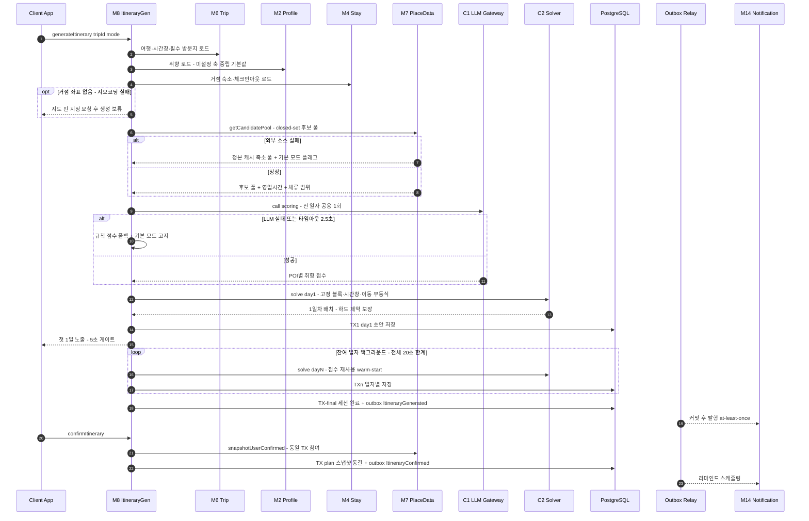
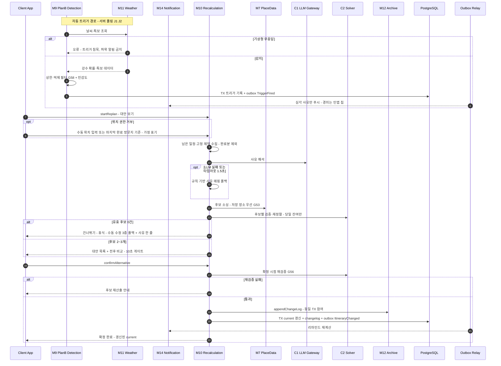

# 서비스 계층·오케스트레이션 (Services)

> 2026-07-04 · 모듈러 모놀리스(D04) — 오케스트레이션은 각 플로우 소유 모듈의 application 계층이 담당하고, 모듈 간에는 **공개 퍼사드 동기 호출**과 **도메인 이벤트 비동기 발행**만 사용한다 (AD-3). 컴포넌트·메서드 정의는 [components.md](./components.md)·[component-methods.md](./component-methods.md), 의존 구조는 [component-dependency.md](./component-dependency.md) 참조.

## 0. 공통 오케스트레이션 원칙

### 0.1 실패 처리 원칙 (ADR-0011 침묵 실패 금지)

모든 플로우의 모든 외부 의존 단계는 **명시적 타임아웃 + 폴백 + 사용자 고지** 3요소를 갖는다 (RESILIENCY-10).

| 의존 | 실패 시 폴백 | 사용자 고지 |
|---|---|---|
| LLM (C1) | 결정론 경로 — 규칙 점수·규칙 사유 매핑, 설명 문구 생략 | "일부 추천이 기본 모드로 생성되었어요" / "추천 이유를 불러오지 못했어요" |
| 지도·라우팅 API (M7 어댑터) | 직선거리 × 우회계수(G106) 추정, 최후 수동 입력 모드 | 추정치·수동 입력임을 화면 표기 |
| 기상청 (M11) | **트리거 침묵** — 허위 알림 금지, 자동 알림 미발화 | 없음(수동 재계획 경로는 항상 유지) |
| TourAPI·영업시간 소스 (M7) | 정본 캐시 사용, 미확인은 '영업시간 미확인' 분리 | '미확인' 배지 + 사용자 확인 후보 분리 |
| FCM (M14) | 인앱 알림함은 선(先) 적재로 항상 보존 | 알림함에서 확인 가능 |
| 솔버 전 경로 실패 (C2 포함) | 숙소 + 시각 고정형 필수 방문지만 배치한 최소 일정 | "추천을 다시 시도" 동작 노출 |

### 0.2 트랜잭션·이벤트 발행 원칙

- **원자성 단위**: 소유 모듈의 애그리거트 상태 변경 + **아웃박스 레코드 insert**를 단일 DB 트랜잭션으로 묶는다 (transactional outbox).
- **발행 시점**: 커밋 후 아웃박스 릴레이(J10)가 발행 — **at-least-once**. 모든 구독자는 이벤트 ID 기준 **멱등 처리** 필수.
- **순서 보장**: 동일 애그리거트 키(예: tripId) 내에서만 발행 순서를 보장한다. 교차 애그리거트 순서는 가정하지 않는다.
- **외부 호출 격리**: LLM·지도·기상청·FCM 등 외부 호출은 **DB 트랜잭션 밖**에서 수행한다. 외부 호출 결과 반영은 별도 트랜잭션.
- **퍼사드 동기 호출의 트랜잭션 참여**: 기본은 피호출 모듈이 자체 트랜잭션을 연다. 예외적으로 **호출자 트랜잭션 참여를 허용하는 계약**은 2건만 인정한다 — (a) `M12.appendChangeLog`(일정 변경과 changelog의 원자성, G132), (b) `M7.snapshotUserConfirmed`(확정과 스냅샷의 원자성, D13). 이 2건은 후속 워커 분리 시 이벤트 구독 경로로 대체하는 전환 계획을 유닛 설계에 명시한다.

### 0.3 성능 예산 원칙 (D38)

- AI 일정 생성: **첫 1일 5초 노출 / 전체 20초 한계** — 단계별 예산은 §S1.4
- Plan-B 대안 제시: **10초** — 단계별 예산은 §S2.4
- 예산 초과가 예상되는 단계(LLM)는 **타임아웃을 예산보다 짧게** 잡아 폴백 전환 시간을 확보한다 (타임아웃 후 폴백 실행까지 포함해 예산 내 완료).

---

## 1. 오케스트레이션 플로우

### S1. AI 일정 생성 (소유: M8.application)

관련 결정: D11, D13, D14, D25(Δ1), D28, D29, D38, G40, G41, G46, G49, G50, G51, G106, G115, G119, G120, G129, G161 · 정본: PRD 06

#### S1.1 전제·진입

- 등록 숙소 존재(06 스토리 1) 또는 숙소 나중 등록 온램프(06 스토리 11, S3 역방향과 연결).
- 방식 3분기(완전 AI / 같이 고르기 / 직접 만들기, 06 스토리 10). 아래 시퀀스는 완전 AI 기준이며, '같이 고르기'는 3~5단계를 슬롯 단위 루프로 반복(기준점 = 직전 확정 슬롯, G48), '직접 만들기'는 5단계의 검증부(`M8.validateEdit`)만 사용한다. 방식 전환 시 이미 확정된 슬롯은 고정 블록으로 보존한다(06 스토리 10 — 진행분 손실 없음).

#### S1.2 단계별 시퀀스

1. `M8.generateItinerary(tripId, mode)` — GenerationSession 생성(상태 `COLLECTING`), 진행 스트림 채널 개설(단계 텍스트·진행률·경과 시간).
2. **컨텍스트 병렬 로드**: `M6.getTrip`(날짜·여행 속성 G134·시간창 D29/G119·필수 방문지 G40)、`M2.getPreferences`(미설정 축 중립 기본값 채움)、`M4.listBaseAssignments`(거점 숙소·체크인/아웃).
   - 실패 분기: M6·M4 로드 실패 → 세션 `FAILED`, 재시도 노출. **M2 실패 → 중립 기본값 전량 대체**(취향 없음이 생성 실패가 되지 않게 — 무실패 보장).
   - 거점 좌표 없음(지오코딩 실패) → 지도 핀 지정 요청 후 생성 보류(06 스토리 1 예외). 첫날 거점 공백 → 여행지 중심 좌표를 기본 거점으로(G41). 날짜 누락·역전 → 생성하지 않고 날짜 수정 화면(06 스토리 1 예외).
3. `M7.getCandidatePool(tripContext)` — closed-set 후보 풀(G115) + 영업시간 + 체류 기본값 **최소/권장/최대 범위**(G51) + 국내 좌표 범위 검증(G120). 저장 POI 투입분은 사본(G129).
   - 실패 분기: 외부 소스(지도 API) 실패 → **정본 캐시(J7 동기화분)로 축소 풀** 구성 + 기본 모드 플래그. 정본도 불가 → 사용자 저장 POI + 필수 방문지만으로 최소 풀. 조건 과협소로 후보 0건 → 0을 만든 조건 표시 + 완화 제안(06 스토리 2 예외). 영업시간 없는 POI → '영업시간 미확인' 후보로 분리(확정 배치 제외, 06 스토리 3 예외).
4. `C1.call(scoring, candidateIds, preferences)` — 경량 티어(D11), **전 일자 공용 1회 호출**(일자별 재호출 없음), 서버 재조회 컨텍스트 주입(D31).
   - 실패 분기: 타임아웃(2.5초)·오류 → **규칙 점수 폴백**(카테고리-취향 축 매핑 + 인기 집계 가중) + "기본 모드" 고지. 출력 스키마 위반 → 1회 재시도 후 폴백. closed-set 밖 ID 반환 → 구조적으로 불가하나(G115) 방어적으로 드롭·계측.
5. `C2.solve(day1)` — 고정 블록(숙소 체크인/아웃·시각 고정형 필수 방문지·LOCK 슬롯 G46), 포함 고정형 필수 방문지는 필수 노드(06 스토리 4), 시간창(D29·G119), 이동시간 부등식(안전계수 G106), 체류 범위 압축 시 표시 사유 생성(06 스토리 3), 숙소 전환일은 편도 동선(G50).
   - 실패 분기: 고정 블록 상호 충돌 → **자동 변경 없이** 충돌 항목 강조 + 어느 쪽을 옮길지 사용자 질의(06 스토리 4 예외). 필수 방문지 배치 불가 → 사유 표시 + 3안 제안(다른 날짜 / 시각 고정 해제 / 인접 조정). 하루 배치 1개 이하 → "이동 거리가 멀어 하루에 한 곳만 추천돼요" 안내(06 스토리 3 예외).
6. **TX1**: day1 초안 저장(세션 상태 `DAY1_READY`) → **첫 1일 응답 반환** (5초 게이트). 이후 단계는 백그라운드.
7. **백그라운드 잔여 일자 루프**: `C2.solve(dayN)` — 4단계 점수 재사용, 일자별 독립 TX 저장, 진행 스트림 갱신.
   - 실패 분기: 전체 20초 한계 도달 → 잔여 일자를 **결정론 솔버 단독 모드**로 완성 + 폴백 고지. 사용자 '취소' → 부분 일정을 초안 저장 + '이어서 생성' 진입점(G161). '백그라운드로 계속' → 완료 시 알림 없이 화면 복귀 시 반영.
8. **TX-final**: 세션 `GENERATED` 전이 + outbox `ItineraryGenerated`.
9. (별도 상호작용) `M8.confirmItinerary(itineraryId)` — **TX**: plan 스냅샷 동결(D14) + `M7.snapshotUserConfirmed`(확정 POI 스냅샷, D13 — 호출자 TX 참여 예외 (b)) + outbox `ItineraryConfirmed`. 확정 해제는 `unlockForEdit` → 재확정 필요(D20).
   - 최후 폴백: 전 생성 경로 실패 시 빈 화면 대신 **숙소 + 시각 고정형 필수 방문지만 배치한 최소 일정** + "추천을 다시 시도"(06 스토리 9 예외).

#### S1.3 트랜잭션·일관성 경계

- **일자별 저장은 독립 TX** — 부분 결과 노출을 허용하며, GenerationSession 상태가 진행 정본이다(부분 일정은 세션 상태로 '생성 중'임이 식별됨).
- `ItineraryGenerated`는 전체 완료 TX에서만 발행(부분 완료는 이벤트 없음). `ItineraryConfirmed`는 확정 TX와 원자적.
- LLM(4)·솔버(5, 7) 호출은 TX 밖. 편집 재검증(`validateEdit`)은 무상태 — 저장(`applyEdit`)만 TX.

#### S1.4 성능 예산 (D38: 첫 1일 5초 / 전체 20초)

| 단계 | 예산 | 비고 |
|---|---|---|
| 1~2. 세션 생성 + 컨텍스트 병렬 로드 | 0.3초 | 단일 DB 왕복 병렬화 |
| 3. 후보 풀 | 1.0초 | 정본 캐시 히트 시 0.2초, 외부 보강 시 상한 1.0초 |
| 4. LLM 취향 점수 | 2.5초 | **타임아웃 2.5초** — 초과 즉시 규칙 점수(+0.1초) |
| 5. 1일차 solve | 0.8초 | 후보 상한(지역당 5천, §6.8 규모) 기준 |
| 6. 저장 + 직렬화 + 응답 | 0.4초 | |
| **첫 1일 합계** | **5.0초** | |
| 7. 잔여 일자 (최대 29일, G42) | 15초 내 | 일자당 solve 0.5초 목표 — 점수 재사용으로 LLM 재호출 없음 |
| **전체 한계** | **20초** | 초과 시 결정론 단독 모드 전환 |

### S2. Plan-B 재계획 (소유: M10.application / 트리거 감지: M9.application)

관련 결정: D10, D14, D23, D25, D27, D28, D38, G53, G54, G56, G58, G106, G195, C10 · 정본: PRD 07

#### S2.1 트리거 경로 (자동 — 사용자 동의 전에는 어떤 일정도 바꾸지 않음)

1. **서버 감지**: J1(날씨 1시간)·J2(휴무 당일 아침) → `M9.evaluateServerTriggers(activeTrips)` — (a) 다음 예정지 도착 시간대 강수확률 60 퍼센트 이상 또는 기상특보(M11), (b) 당일 임시 휴무·영업시간 변경(M7, 정기 변경 자동 감지만 G192).
   - 실패 분기: **기상청·영업시간 소스 무응답 → 트리거 침묵**(허위 알림 금지, 07 스토리 2 예외) + 실패율 계측(§6.7). 수동 재계획 경로는 항상 유지.
2. **클라이언트 감지**(포그라운드 한정, D27): (c) 이동 지연(임계 15분, G106)·(d) 체류 초과(임계 20분) → `M9.reportClientSignal(tripId, signal)`.
   - 실패 분기: 위치 권한 거부·GPS 불가 → 신호 자체 미발생(자동 감지 축소를 화면에 표기), 수동 경로 안내. 체류 초과 오발화 → 연속 무시 2회 시 당일 동일 사유 억제(학습, G58).
3. **상한·억제 필터**(G58, 원격 구성 G195): 전역 상한 시간당 2회/하루 8회(초과분 묶음 1회), 동일 사유·동일 방문지 1회 노출, 민감도 3단계 ±50 퍼센트, 휴식 모드 중 경미 사유 억제(G54).
4. **TX**: 트리거 이력 기록 + outbox `TriggerFired` → M14 구독: **심각 사유(기상특보·고정 일정 도착 위협)만 푸시**, 경미는 인앱 칩(07 스토리 2). 알림에 출처·감지 시각 표기.

#### S2.2 재계획 세션 (사용자가 '대안 보기'를 눌러야 시작)

5. `M10.startReplan(tripId, reason?, currentPosition?)` — '여행 중' 상태 검증(여행 날짜 구간 정의 — 숙소 0개여도 허용, 07 스토리 1). 사유 미선택('그냥 바꾸고 싶음') 허용. 방식 분기: **AI에게 맡기기 / 직접 수정**(07 스토리 12 — 직접 수정 선택 시 9단계의 수동 편집 화면으로 직행).
   - 위치 폴백 체인(07 스토리 10): GPS → 수동 입력(지도 핀·검색) → 마지막 완료 방문지 → 등록 숙소. 어느 폴백이든 **가정을 화면에 표기**.
6. **영향 분석 입력 수집**: 현재 위치·현재 시각, 남은 일정(완료 방문지 제외 — 07 스토리 3), 고정 제약(숙소 체크인/아웃 일시·위치는 **변경 불가**, ADR-0006 / 시각 고정형 필수 방문지), `M7`의 당일 영업시간, `C2.estimateTravel` 이동시간.
7. `C1.call(reason, sessionContext)` — 사유 해석·후보 정렬 힌트(날씨→실내 우선, 체력→이동·방문 수 최소).
   - 실패 분기: 타임아웃(1.5초)·오류 → **규칙 기반 사유-카테고리 매핑 폴백**, 추천 이유 문구는 템플릿 대체 또는 생략 고지.
8. `M7` 후보 소싱 — **사용자 저장 장소 우선**, 부족 시 주변 신규 POI 확장(G53). 그라운딩은 closed-set으로 구조 보장(G115).
9. `C2.solve/validate` 후보별 검증 — 2~3개 산출, 사유 부합 정렬(07 스토리 4), warm-start(시각 고정형·완료 방문지 보존, 07 스토리 7), 재정렬 범위는 **당일 잔여만**(C10 — 이월 방문지는 미배치 목록).
   - 실패 분기: **유효 후보 0건 → 3중 폴백** — "남은 방문지 1개 건너뛰기 / 휴식 모드 전환 / 수동 일정 수정" + 사유 한 줄(07 스토리 4·12 예외 대칭). **외부 API 오류(길찾기·POI 검색 등) → 수동 일정 수정 화면 전환**(07 스토리 11) — 누락된 외부 데이터를 화면에 표기, 숙소 고정 제약은 수동에서도 위반 불가(입력 차단), API 복구 시 자동 검증 재활성화.
10. **대안 표시**: 후보별 추천 이유(LLM/템플릿)·이동 거리·수단·체류·다음 고정 제약까지 여유 시간(**소요시간 미표시** D25/Δ1, 추정 기준 표기) → 전/후 비교 화면(추가/삭제/이동 구분, 총 이동 거리·방문지 수·숙소 복귀 시각 증감 요약, 07 스토리 8). 제외·이월되는 방문지는 확정 전 명시 동의(07 스토리 7).
11. `M10.confirmAlternative(sessionId, choiceId)` → **확정 시점 `C2.validate` 재검증 1회**(G56).
    - 실패 분기: 재검증 무효화(그 사이 상황 변화) → 후보 재산출 안내(확정 차단).
    - 통과 → **TX**: current 갱신(D14 — plan 스냅샷 불변) + `M12.appendChangeLog`(사유·전/후 diff·행위자·트리거 유형, G132 — 호출자 TX 참여 예외 (a)) + outbox `ItineraryChanged`.
12. M14 구독: 리마인드 재계산(D32). **휴식 모드** 선택 시: `M10.enterRestMode(tripId, resumeAt?)` — 경미 트리거·일정 알림 억제, resumeAt을 리마인드 큐(J4)에 등록 → 재개 시각 도달 시 알림 + 남은 일정 재계산 제안(G54). "기존 유지" 선택 시 어떤 변경도 저장하지 않음(07 스토리 6).

#### S2.3 트랜잭션·일관성 경계

- 트리거 기록(4)과 재계획 세션(5~)은 완전 분리 — 세션은 트리거 없이도(수동) 시작 가능.
- 재계획 세션 상태는 세션 레코드 단독 TX로 관리, **current 일정은 11단계 확정 TX에서만 변경**된다(그 전까지 어떤 후보도 일정에 반영되지 않음).
- current 갱신 + changelog + outbox = 단일 TX (원자적). `ItineraryChanged`는 커밋 후 발행.

#### S2.4 성능 예산 (D38: 대안 제시 10초)

| 단계 | 예산 | 비고 |
|---|---|---|
| 5~6. 세션 생성 + 영향 분석 입력 수집 | 1.0초 | 위치 수동 입력 시간은 예산 외(사용자 상호작용) |
| 7. LLM 사유 해석 | 1.5초 | **타임아웃 1.5초** — 초과 즉시 규칙 매핑 |
| 8. 후보 소싱 | 1.5초 | 저장 장소 우선이라 대부분 내부 조회 |
| 9. 후보별 솔버 검증·재정렬 (2~3개) | 4.5초 | 후보당 1.5초, 당일 잔여만이라 문제 크기 소 |
| 10. 비교 지표 산출 + 응답 | 0.5초 | |
| **합계** | **9.0초** (여유 1.0초) | 초과 시 산출된 후보만이라도 제시, 0건이면 3중 폴백 |
| 11. 확정 재검증 | 1.0초 | 별도 상호작용 — 10초 예산 외 |

### S3. 숙소 등록 → 일정 온램프 (소유: M4.application)

관련 결정: D09, D15, D17, G28~G34, G103 · 정본: PRD 04·06 스토리 11

1. **경로 A(탐색)**: `M3.searchStays` → `M3.getStayDetail`(누락 필드 '미확인' 표기) → `M5.buildDeeplink`(수수료 고지 포함) + `M5.recordOutboundClick` → OTA 이탈.
   - 실패 분기: TourAPI·지도 소스 실패 → 캐시 목록 + 갱신 실패 고지. 딥링크 파트너 무응답 → 웹 검색 URL 폴백.
2. **복귀 핸드오프**: 이탈 후 24시간 내 첫 복귀 시 핸드오프 카드 1회 노출(최근 이탈 숙소 1건, 무시 시 재노출 없음, G32) → 빠른 등록 진입. 포스트백 자동 등록은 1차 제외(G29, D09).
3. `M4.registerStay(accountId, stayInput)` — 좌표 확보: 지오코딩 실패 시 지도 핀 지정 요구(06 스토리 1 예외와 동일 계약). OTA 링크 붙여넣기 등록은 URL 패턴 파싱만(화이트리스트, 실패 시 수동 핀, G31).
4. `M4.resolveStayIdentity(externalRefs)` — 내부 canonical ID 매핑(좌표+이름 유사도, D17).
5. **TX**: SavedStay 저장 + ID 매핑 + outbox `StayRegistered`.
6. `M4.linkToTrip(savedStayId, tripId)` — **같은 여행 내 거점 날짜 비중첩 검증**(D15) — 위반 시 차단 + 충돌 구간 표시. **TX**: 거점 연결 + outbox `StayLinkedToTrip` → M6(여행 화면 갱신)·M14(등록 알림).
   - 연결할 여행 제안: 날짜 매칭되는 진행/예정 여행 자동 제안, 없으면 여행 생성 유도.
7. **온램프**: 등록 완료 화면에 'AI 일정 생성' CTA → S1 진입.
8. **역방향(숙소 나중 등록, 06 스토리 11)**: `M8.recommendStayZone(tripId)` — 완성 동선 무게중심 + 평균 이동 거리 기반 권역 추천(추정임을 표기, before/after는 '추정 이동 거리').
   - 실패 분기: 방문지 2개 미만 등 동선 부족 → 권역 추천 미제공, 일반 탐색 유도. 등록 후 → S1 재정렬(warm-start). 끝까지 미등록한 날은 동선만으로 유지(06 스토리 11 예외).

트랜잭션 경계: 5·6단계 각각 독립 TX. 이벤트는 각 TX의 outbox로 커밋 후 발행.

### S4. 여행 종료 → 회고 (소유: M18.application + M13.application)

관련 결정: D19(Δ4), G72, G76, G78, C11 · 정본: PRD 09·12

1. **종료 전이**: J3 `M18.autoEndTrips()`(종료일 다음날 00:00, 숙소 유무 무관 단일 규칙) 또는 `M18.endTripManually(tripId)` — **TX**: 여행 상태 조건부 전이(`ACTIVE→ENDED`, 이미 종료면 no-op — 수동/자동 경합 안전) + outbox `TripEnded`.
2. **M13 구독**(`TripEnded`): `M13.generateTripSummary(tripId)` — 입력: M12 actual·changelog·plan 대조(D14), 이동 거리(GPS 동의 구간 실측 + 미동의 구간 거리 추정 혼합, G72).
3. `C1.call(reflection)` — 상위 티어(D11).
   - 실패 분기: 타임아웃·오류 → **기본 카드 폴백**(통계·타임라인만, LLM 문구 없음) + '다시 생성' 버튼(G78 — 수정본 존재 시 덮어쓰기 경고).
4. **스타일 분석**: `M13.analyzeTravelStyle(accountId)` — 방문 10곳 게이트 미달 시 `Pending(nOf10)` 반환(생성 시도 없음). 분류는 취향 7종 축 택소노미(G76).
5. **TX**: 회고 저장 + outbox `ReflectionReady` → M14 알림.
6. **당일 회고**: J3의 일자 경계에서 `DayClosed` 발행 → M13이 동일 패턴으로 `generateDailyReflection` (2~5단계 축소판).
7. 종료 후 기록 편집은 허용하되 회고·분석 갱신은 수동 '다시 생성'만(C11).

멱등성: M13의 `TripEnded` 핸들러는 (tripId, kind) 기준 기존 회고 존재 시 skip — 이벤트 중복 수신 안전.

### S5. 알림 스케줄링·발송 (소유: M14.application)

관련 결정: D12, D32, G97, G100 · 정본: PRD 12

**구독 이벤트와 반응**:

| 이벤트 | 반응 |
|---|---|
| `ItineraryConfirmed` | 리마인드 세트 생성 — D-1·당일 8시·개별 일정 N분 전(D32) |
| `ItineraryChanged` | 해당 여행 리마인드 **전체 무효화 후 재계산**(멱등 키: tripId+slotId+type) |
| `TriggerFired` | severity=severe만 푸시, minor는 인앱 칩 신호만(푸시 없음) |
| `ReflectionReady` | 회고 완료 알림 |
| `StayRegistered` / `StayLinkedToTrip` | 등록 완료·여행 연결 알림 |
| `TripEnded` | 관련 리마인드 잔여분 취소 |
| 거점 해제(M4 퍼사드 경유) | 리마인드 중단 + 재생성 유도 배지(G97) |

**발송 파이프라인** (J4가 due 알림마다 실행):

1. 종류별 토글 확인(`updateToggles` 즉시 반영) — off면 종결(적재도 없음, 사용자 의사).
2. **방해금지 창**(기본 22~08시, G100) — 억제 대상이면 **인앱 알림함에는 적재**하고 푸시만 보류. 예외: 여행 '진행 중' Plan-B 알림(severe)은 통과.
3. **중복 억제**: 동일 dedupeKey 10분 창 내 재발송 차단.
4. **TX**: 인앱 알림함 적재(90일 보존, D32) + 발송 상태 `PENDING→CLAIMED`.
5. FCM 발송(D12) — TX 밖.
   - 실패 분기: 재시도 3회 지수 백오프 → 최종 실패 시 dead letter + 계측. **인앱 알림함은 4단계에서 이미 적재**되어 사용자 관측 가능(침묵 실패 금지). FCM 토큰 무효 응답 → 기기 토큰 정리.
6. 발송 결과 기록(TX) — `SENT/FAILED`.

### S6. 계정 삭제 연쇄 (소유: M1.application)

관련 결정: D18, D34(N2), C4 · SECURITY-14

1. `M1.requestAccountDeletion(accountId)` — **TX**: 계정 상태 `ACTIVE→DEACTIVATED` + purgeDueAt(+30일) 기록 + 전 세션·리프레시 토큰 무효화 + outbox `AccountDeletionRequested`. 즉시 전 표면 비노출. 유예 중 동일 식별자 재가입 제한(C4).
2. **위치 데이터 즉시 파기**(D34 — 유예 없음): 이벤트 구독 즉시 실행 — GPS 폴리라인·위치 파생 데이터 파기. 단 **위치정보 수집·이용 법정 로그(append-only)는 분리 보관 유지**(N2, 앱 역할은 자기 로그 삭제 권한 없음).
3. 30일 내 재로그인 → 복구 흐름(상태 `ACTIVE` 복원, purge 취소).
4. **만료 배치**(J6): purgeDueAt 경과 계정 → **TX**: 상태 `PURGING` 전이 + outbox `AccountDeletionExpired`.
5. **모듈별 파기 핸들러**(구독): M6 여행·필수 방문지, M8 일정(plan/current), M12 기록·changelog·사진(오브젝트 스토리지 객체 포함), M13 회고, M14 알림함·스케줄·FCM 토큰, M2 프로필·취향, M4 등록 숙소. 법정 보존 데이터(동의 증적·위치 로그·감사 로그)만 분리 보관. (후속) M15 커뮤니티 콘텐츠는 '삭제된 사용자' 익명화(D18).
   - 실패 분기: 모듈별 핸들러 실패 → 이벤트 재전달로 재시도(at-least-once), 전 핸들러 완료 확인 후 계정 레코드 최종 삭제. 핸들러는 **이미 삭제된 리소스 skip으로 멱등**.

트랜잭션 경계: 계정 상태 전이만 원자적. 모듈별 파기는 각자 독립 TX(부분 진행 허용 — `PURGING` 상태가 진행 정본).

### S7. 온보딩·동의 (소유: M1.application + M2)

관련 결정: D22, D33(N1), D34(N2), N3, N4, N8, G5, G22, G23, G24 · 정본: PRD 01·03

1. **스플래시 게이트**(순서 고정): (a) 서버 최소 지원 버전 확인(N4) → 미달 시 강제 업데이트 화면(종결). (b) 로컬 토큰 검사 — 미만료면 홈 진입 + 백그라운드 재검증, 만료면 로그인(G5, 전체 타임아웃 3초).
   - 실패 분기: 버전 확인 무응답 → **fail-open**(통과 허용, 홈 진입 후 재시도) — 가용성 우선, 강제 게이트가 서버 장애로 앱 전체를 막지 않게 한다. 토큰 재검증 실패(위조·철회) → 즉시 로그아웃.
2. **약관 버전 확인**: 재동의 필요 플래그(N3) → 중대 변경이면 재동의 화면 강제(통과 전 진행 불가), 경미 변경은 인앱 공지.
3. **가입**: `M1.signUpWithSocial(provider, providerToken, ageConfirmed)` 또는 `M1.signUpWithEmail(...)` — **연령 확인 필수(N1): 만 14세 미만 차단 + 사유 안내**(소셜 경로 동일 적용).
   - 이메일 경로: 인증 링크 24시간 유효, 재발송 분당 1회·일 5회, 미인증 7일 후 정리(J8, G22).
4. **동의 기록**: `M1.recordConsent(accountId, consents)` — **TX**: 이용약관·개인정보처리방침·**위치기반서비스 약관(별도 필수 체크, N2)**·마케팅 수신(선택, N8) 버전·시각 증적 저장. GPS 여행 기록 보관은 여기서 받지 않고 **별도 옵트인**(N2 — 기록 기능 최초 사용 시점, 3층 동의 모델의 3층).
5. **닉네임**: `M2.generateNickname()`(패턴 자동 생성) → `C3.checkText` 금칙어 + 중복 검증 → 충돌 시 재추첨(상한 도달 시 숫자 접미 확장, G23).
6. **취향 7종**(선택): `M2.updatePreferences` — 이탈해도 온보딩 완료 처리('완료'=약관+닉네임, G24), 미설정 축은 이후 중립 기본값 + 점진 카드 회수.
7. 완료 → 홈 진입. 마케팅 동의는 설정 철회 토글 제공(발송 기능은 후속, N8).

트랜잭션 경계: 계정 생성 + 동의 증적 = 단일 TX(동의 없는 계정이 존재하지 않게). 취향은 별도 TX(선택 단계).

### S8. 오프라인 기록 동기화 (소유: M12.application + 클라이언트 storage)

관련 결정: D24(Δ6), G74, G75 · 정본: PRD 09 스토리 12

> 범위: **기록 입력**(방문 체크·사진·메모)만 오프라인 로컬 큐. 일정 **조회**의 오프라인 보장은 없음(D24 — 온라인 전제, 오류·재시도 안내만).

1. **오프라인 입력**: 클라이언트 `shared/storage` 로컬 큐에 적재 — 레코드마다 클라이언트 생성 UUID(recordId) + 원 발생 시각(recordedAt) + 베이스 버전 부여. UI는 '저장 대기 중' 표시.
2. **재연결 감지** → `M12.syncOfflineRecords(batch)` — 텍스트·상태 레코드 배치 업로드(사진은 4단계 분리).
3. **서버 병합**(레코드 단위 독립 TX — 부분 성공 허용): recordId 기준 **이미 적용된 레코드는 skip(멱등)**. 버전 비교(G74) — 충돌 없음 → 적용 + outbox `VisitChecked`(syncedFromOffline=true, recordedAt 원 시각 보존). 충돌(서버 측 변경 존재) → 해당 레코드만 conflict 목록으로 반환.
   - 사진·메모 **추가**는 합집합 병합(충돌 아님). 상태 필드(완료/스킵·시각)만 충돌 대상.
4. **충돌 해소**: 클라이언트가 항목별 전/후 값을 제시 → 사용자 선택 → 선택 결과 재제출(새 버전으로 적용).
5. **사진 업로드**: `M12.attachMedia(visitId, photos[])` — 레코드 동기화와 분리 스트림, 클라이언트 압축(장당 5MB·긴 변 2048px, G75), 장당 재시도 3회, **부분 실패 격리**(실패분만 큐 잔류 + 재시도 배지).
6. **하류 전파**: `VisitChecked` 구독 — M12 actual 타임라인 반영, M9 체류 신호. 단 **recordedAt이 과거(현재 시각 임계 초과)면 M9 트리거 평가에서 제외**(뒤늦은 동기화로 오발화 방지).

일관성 경계: 배치 전체 원자성은 **의도적으로 없음** — 레코드별 독립 커밋으로 부분 성공을 허용하고, 응답에 per-record 결과(applied/conflict/failed)를 담는다.

### S9. 데이터 내보내기 (소유: M1.application)

관련 결정: G101, G186 · §6.5 개인정보보호법(데이터 주권)

1. 설정 → `M1.requestDataExport(accountId)` — rate-limit(계정당 시간당 1회) + 본인 재인증(민감 작업).
2. **읽기 전용 수집**(각 모듈 공개 퍼사드, TX 불요): M2 프로필·취향, M6 여행·필수 방문지, M8 일정(plan/current), M12 방문 기록·메모·changelog(사진 파일 제외 — 메타만, G101), M13 회고, M14 알림 설정.
3. **JSON 스트리밍 직렬화** → 즉시 다운로드 응답(비동기 잡 없이 동기 — 1차 규모 §6.8에서 충분).
   - 실패 분기: 특정 모듈 수집 실패 → **해당 섹션에 오류 마커 포함 + 재시도 안내**(침묵 누락 금지 — 부분 성공을 완전본으로 위장하지 않는다). 전체 실패 → 오류 + 재시도.
4. 내보내기 이력 감사 로그 기록(SECURITY-03). 사진 포함 전체 아카이브는 후속(G186).

---

## 2. Mermaid 시퀀스 다이어그램

### 2.1 S1 — AI 일정 생성

**텍스트 대안 (S1)**:
1. 클라이언트가 M8에 일정 생성을 요청한다(tripId, 방식).
2. M8이 M6(여행·시간창·필수 방문지), M2(취향 — 미설정은 중립 기본값), M4(거점 숙소)를 병렬 로드한다. 거점 좌표가 없으면 핀 지정을 요청하고 보류한다.
3. M8이 M7에서 closed-set 후보 풀을 받는다. 외부 소스 실패 시 정본 캐시 축소 풀 + 기본 모드 플래그로 폴백한다.
4. M8이 C1(LLM)에 취향 점수를 1회 요청한다. 실패·2.5초 타임아웃 시 규칙 점수로 폴백하고 기본 모드를 고지한다.
5. C2가 1일차를 하드 제약(고정 블록·영업시간·이동 부등식) 보장으로 배치한다.
6. TX1로 1일차 초안을 저장하고 클라이언트에 첫 1일을 5초 내 노출한다.
7. 잔여 일자를 백그라운드 루프로 solve·저장한다(점수 재사용, 전체 20초 한계 — 초과 시 결정론 단독 모드).
8. 전체 완료 TX에서 outbox에 ItineraryGenerated를 기록하고, 릴레이가 커밋 후 M14 등에 발행한다.
9. 사용자가 확정하면 plan 스냅샷 동결 + M7 사용자 확정 스냅샷 + ItineraryConfirmed 발행이 단일 TX로 수행되고, M14가 리마인드를 스케줄링한다.

### 2.2 S2 — Plan-B 재계획

**텍스트 대안 (S2)**:
1. 서버 잡(J1 날씨 1시간·J2 휴무 당일 아침)이 M9 트리거 평가를 구동한다. 기상청·소스 무응답이면 트리거를 침묵시킨다(허위 알림 금지, 수동 경로는 유지).
2. 감지 시 M9가 상한·억제 필터(G58)와 민감도를 적용하고, TX로 트리거를 기록·TriggerFired를 발행한다. M14는 심각 사유만 푸시하고 경미는 인앱 칩으로 처리한다.
3. 사용자가 '대안 보기'를 누르면 M10이 재계획 세션을 시작한다. 위치 권한 거부 시 수동 입력 → 마지막 완료 방문지 → 등록 숙소 순으로 폴백하고 가정을 표기한다.
4. M10이 남은 일정(완료분 제외)·고정 제약(숙소 체크인/아웃·시각 고정형)을 수집한다.
5. C1이 사유를 해석한다. 실패·1.5초 타임아웃 시 규칙 기반 사유 매핑으로 폴백한다.
6. M7이 저장 장소 우선으로 후보를 소싱하고, C2가 후보별 검증·당일 잔여 재정렬로 2~3개를 산출한다(10초 게이트).
7. 유효 후보 0건이면 "건너뛰기 / 휴식 / 수동 수정" 3중 폴백과 사유 한 줄을 제시한다. 외부 API 오류면 수동 수정 화면으로 전환한다.
8. 사용자가 대안을 확정하면 C2가 확정 시점 재검증(G56)을 수행한다. 실패 시 후보 재산출을 안내한다.
9. 통과 시 current 갱신 + M12 changelog(동일 TX) + ItineraryChanged 발행이 단일 TX로 수행되고, M14가 리마인드를 재계산한다.

---

## 3. 도메인 이벤트 카탈로그

발행 보장 공통: 전 이벤트 **트랜잭셔널 아웃박스** — 상태 변경 TX에 outbox insert, 커밋 후 J10 릴레이가 발행, at-least-once, 구독자는 eventId 기준 멱등. 공통 봉투 필드: `eventId(UUID)`, `eventType`, `occurredAt`, `aggregateKey`, `schemaVersion`.

| 이벤트 | 발행자 | 구독자 | 페이로드 (봉투 외 필드) | 발행 시점 |
|---|---|---|---|---|
| `ItineraryGenerated` | M8 | M14(완료 알림 후보), 관측 | itineraryId, tripId, accountId, mode(auto·together·manual), degraded(기본 모드 여부), dayCount | 전체 일자 생성 완료 TX 커밋 후 (부분 완료는 미발행) |
| `ItineraryConfirmed` | M8 | M14(리마인드 생성), M12(plan 기준선 기록) | itineraryId, tripId, accountId, planSnapshotId, confirmedAt | plan 동결 + 확정 스냅샷 TX 커밋 후 |
| `ItineraryChanged` | M10, M8(편집 저장) | M14(리마인드 재계산), M12(대조 뷰 무효화) | itineraryId, tripId, accountId, changeSource(planB·manualEdit·coEdit후속), changelogEntryId, affectedDates[], removedOrDeferredSlotIds[] | current 갱신 + changelog TX 커밋 후 |
| `TriggerFired` | M9 | M14(푸시·칩), M10(세션 사전 컨텍스트) | triggerId, tripId, accountId, kind(weather·closure·delay·overstay), severity(severe·minor), targetSlotId, evidence{source, observedAt, value}, bundled(묶음 여부) | 상한·억제 필터 통과분만, 트리거 기록 TX 커밋 후 |
| `VisitChecked` | M18(온라인), M12(오프라인 동기화 적용) | M12(actual), M9(체류·진행 신호) | visitRecordId, tripId, slotId?, poiRef?, status(started·done·skipped), recordedAt(원 발생 시각), syncedFromOffline | 방문 상태 전이 TX 커밋 후. M9는 recordedAt 과거분 트리거 평가 제외 |
| `TripEnded` | M18 | M13(전체 회고), M14(리마인드 취소) | tripId, accountId, endType(auto·manual), endedAt | 상태 전이 TX 커밋 후 (조건부 전이로 자동·수동 경합에도 1회) |
| `DayClosed` | M18(J3) | M13(당일 회고), M14 | tripId, accountId, date | 일자 경계 처리 TX 커밋 후 |
| `ReflectionReady` | M13 | M14(알림) | reflectionId, tripId, accountId, kind(daily·tripSummary·styleAnalysis), fallback(기본 카드 여부) | 회고 저장 TX 커밋 후 (폴백 카드도 발행 — 관측 가능) |
| `StayRegistered` | M4 | M14(알림), 관측 | savedStayId, accountId, canonicalStayId, source(search·deeplinkReturn·manual) | 숙소 저장 TX 커밋 후 |
| `StayLinkedToTrip` | M4 | M6(여행 화면), M14, M8(재정렬 제안 배지) | savedStayId, tripId, accountId, checkIn, checkOut | 거점 연결(비중첩 검증 통과) TX 커밋 후 |
| `AccountDeletionRequested` | M1 | 위치 데이터 즉시 파기 핸들러(M12·M18), M14(발송 중지) | accountId, requestedAt, purgeDueAt | 비활성화 TX 커밋 후 |
| `AccountDeletionExpired` | M1(J6) | M2·M4·M6·M8·M12·M13·M14 파기 핸들러, (후속) M15 익명화 | accountId, expiredAt | 유예 만료 `PURGING` 전이 TX 커밋 후. 각 핸들러 멱등(기삭제 skip), 전 핸들러 완료 후 계정 최종 삭제 |

---

## 4. 스케줄러 잡 상세

단일 배포 내 워커 스레드로 실행(D04)하되 모듈 경계를 유지해 후속 분리 워커 전환이 가능해야 한다. 공통: 잡 실행 이력·실패는 관측 대상(§6.7), 다중 인스턴스 대비 분산 잠금(또는 `SELECT FOR UPDATE SKIP LOCKED` 클레임)으로 중복 실행 방지.

| ID | 잡 | 소유 | 주기 (원격 구성 G195) | 입력 → 출력 | 실패 처리·재시도 | 멱등성 |
|---|---|---|---|---|---|---|
| J1 | 날씨·특보 폴링 | M9 (M11 경유) | 1시간 · **원격 구성** | 진행 중 여행의 당일~익일 방문 예정지 좌표(격자 변환·중복 제거) → 날씨 캐시 갱신 + 트리거 평가 → `TriggerFired` | 기상청 무응답: 즉시 1회 재시도 후 **트리거 침묵**(허위 알림 금지) + 실패율 계측. 잡 자체 실패는 다음 주기 자연 복구 | 동일 (여행, 방문지, 사유) 1회 노출 규칙(G58)이 중복 발화 흡수 |
| J2 | 휴무·영업시간 재조회 | M9 (M7 경유) | 당일 아침 1회(기본 07:00) · 원격 구성 | 당일 방문 예정 POI 목록 → TourAPI·지도 재조회(정기 변경만, G192) → 변경 감지 시 `TriggerFired` | 소스 무응답: 해당 POI 스킵 + 로깅, 트리거 침묵. 부분 실패 허용 | POI별 upsert — 같은 날 재실행 안전 |
| J3 | 여행 자동 종료·일자 경계 | M18 | 일 1회 자정(KST, D19) | 종료일 경과 진행 중 여행 / 일자 경계 도달 여행 → `TripEnded`·`DayClosed` | 잡 실패 시 다음 실행이 잔여분 처리(대상 조회가 상태 기반). 수동 종료와 경합은 조건부 UPDATE로 안전 | 상태 기반 조회 + 조건부 전이 = 자연 멱등 |
| J4 | 리마인드 발송 큐 | M14 | 분 단위 | due 도달 알림 스케줄 행 → S5 발송 파이프라인(토글→방해금지→중복 억제→적재→FCM) | 알림 단위 재시도 3회 지수 백오프 → dead letter + 계측. 인앱 적재는 발송 전 완료로 관측 보장 | `SKIP LOCKED` 클레임 + dedupeKey + 발송 상태 전이 — 이중 발송 방지 |
| J5 | 인기 장소 집계 | M7 | 일 1회 | 최근 7일 저장+방문 가중합(G2) → 지역별 집계 테이블 교체 | 실패 시 이전 집계 유지(스테일 허용 — 비핵심), 알람만 | 전체 재계산 후 원자적 교체(replace) |
| J6 | 삭제 유예 만료 처리 | M1 | 일 1회 | purgeDueAt 경과 `DEACTIVATED` 계정 → `PURGING` 전이 + `AccountDeletionExpired` | 핸들러별 실패는 이벤트 재전달로 재시도. 계정 최종 삭제는 전 핸들러 완료 확인 후 | 상태 기반 + 파기 핸들러 기삭제 skip |
| J7 | POI 정본 동기화(TourAPI) | M7 | 일 1회 | TourAPI 변경분 → canonical POI upsert(G133), 소실 POI '확인 불가' 배지 처리(G8) | 부분 실패 시 성공분만 반영, 실패분 다음 주기. 전량 실패 시 기존 정본 유지 | canonical ID 기준 upsert |
| J8 | 미인증 계정 정리 | M1 | 일 1회 | 생성 7일 경과 미인증 계정(G22) → 정리 | 실패 시 다음 실행 잔여 처리 | 상태 기반 조회 = 자연 멱등 |
| J9 | 알림함 보존 정리 | M14 | 일 1회 | 90일 초과 알림함 항목(D32) → 삭제 | 실패 시 다음 실행 잔여 처리 | 시각 조건 삭제 = 자연 멱등 |
| J10 | 아웃박스 릴레이 | 횡단(인프라) | 수 초 폴링 | 미발행 outbox 행 → 이벤트 발행 + 발행 마킹 | 발행 실패·크래시 시 미마킹분 재발행(**at-least-once** — 구독자 멱등 전제). 누적 미발행 임계 알람 | 발행 마킹 + 구독자 eventId dedupe |

---

## 5. 결정 추적 요약

| 플로우/영역 | 추적 ID |
|---|---|
| S1 일정 생성 | D11, D13, D14, D20, D25(Δ1), D28, D29, D38, G40, G41, G46, G48~G51, G106, G115, G119, G120, G129, G161 |
| S2 Plan-B | D10, D14, D23, D25, D27, D28, D38, ADR-0006, G53, G54, G56, G58, G106, G192, G195, C10 |
| S3 숙소 온램프 | D09, D15, D17, G28~G34, G103 |
| S4 종료·회고 | D11, D14, D19(Δ4), G72, G76, G78, C11 |
| S5 알림 | D12, D32, G97, G100, Δ10 |
| S6 삭제 연쇄 | D18, D34(N2), C4, SECURITY-14 |
| S7 온보딩·동의 | D22, D33(N1), D34(N2), N3, N4, N8, G5, G22~G24 |
| S8 오프라인 동기화 | D24(Δ6), G74, G75 |
| S9 데이터 내보내기 | G101, G186, SECURITY-03 |
| 이벤트·잡·실패 원칙 | D04, D12, D32, ADR-0011, RESILIENCY-05·10, G195, AD-3 |
