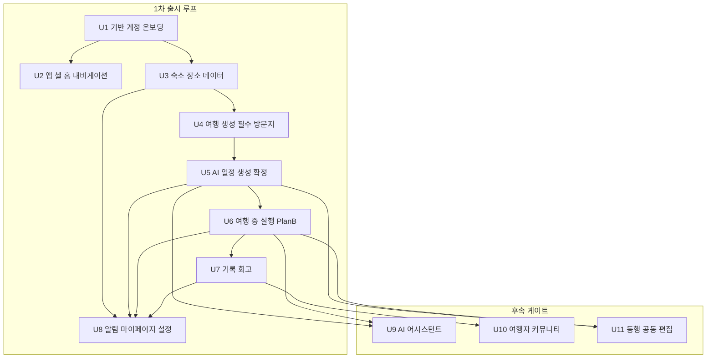

# 유닛 의존 매트릭스 (Unit Dependencies)

> 2026-07-04 · 개발 순서: **U1 → U2 → U3 → U4 → U5 → U6 → U7 → U8** (기본 순차, UW-4) + 후속 게이트 U9~U11. 순환 없음.
> 정본 관계: 유닛 정의·DoD·담당 모듈은 [unit-of-work.md](./unit-of-work.md), 스토리 배정은 [unit-of-work-story-map.md](./unit-of-work-story-map.md), 결정 ID(D01~D38)·갭(G번호)·선결 과제(P1~P9)는 [requirements.md](../requirements/requirements.md)를 따른다. 본 문서는 **유닛 간 의존의 근거·계약 포인트(CP1~CP5)·검증 방법**을 소유한다.

---

## 1. 유닛 의존 그래프

**텍스트 대안** (위 다이어그램과 동일 내용 — 화살표는 "선행 → 후행"):

- 1차 출시 루프
  - U1 기반·계정·온보딩 → U2 앱 셸·홈·내비게이션
  - U1 기반·계정·온보딩 → U3 숙소·장소 데이터
  - U3 숙소·장소 데이터 → U4 여행 생성·필수 방문지 (계약 포인트 CP1)
  - U4 여행 생성·필수 방문지 → U5 AI 일정 생성·확정 (계약 포인트 CP2)
  - U5 AI 일정 생성·확정 → U6 여행 중 실행·Plan-B (계약 포인트 CP3)
  - U6 여행 중 실행·Plan-B → U7 기록·회고 (계약 포인트 CP4)
  - U3, U5, U6, U7 → U8 알림·마이페이지·설정 (계약 포인트 CP5 — 알림 이벤트 4계열 + 전 모듈 설정·홈 카드 통합)
- 후속 게이트
  - U5, U6 → U9 AI 어시스턴트 (C1 LLM Gateway·퍼사드 재사용)
  - U7 → U10 여행자 커뮤니티 (확정 일정 스냅샷·기록 소비)
  - U5, U6 → U11 동행 공동 편집 (편집 재검증·C2 솔버 재사용 + WebSocket 신규)

---

## 2. 의존 표 (계약 수준 상세)

각 행은 "이 유닛을 시작하려면 무엇이 어느 수준까지 완성되어 있어야 하는가"를 계약 수준으로 기술한다. **선행 필수**는 착수 차단 조건, **의존 내용**은 소비하는 산출물의 구체 형태다.

| 유닛 | 선행 필수 | 소비하는 계약(입력) | 공급하는 계약(출력) | 의존 내용 상세 |
|---|---|---|---|---|
| U1 기반·계정·온보딩 | — (최초 유닛) | 없음 | 세션 검증·온보딩 완료 판정·재동의 필요 플래그 API(U2 소비), 계정·동의·취향 데이터 모델(전 유닛 귀속 기반), `common/core` 이벤트 버스 계약, 위치 동의 3층 모델(G182 — U3·U6·U7 소비), 삭제 유예 상태 모델(U8이 S6로 완결) | 스캐폴드(Gradle 모듈 경계=컴포넌트 경계, `features/`+`shared/` 골격)와 전역 보안 설정(deny-by-default·에러 핸들러·구조화 로깅)이 이후 전 유닛의 컴파일·CI 전제. `common/core` 이벤트 계약(발행·구독 인터페이스)은 U1에서 동결 — CP4·CP5의 구조적 기반 |
| U2 앱 셸·홈 | U1 | U1 세션 검증(3초 타임아웃 G5)·온보딩 완료 판정(약관+닉네임 G24)·약관 재동의 플래그(N3) — 스플래시 5분기의 판정 입력 전부 | 부트스트랩 API(최소 지원 버전 N4·세션 상태·재동의 플래그 집약), 5탭 셸·탭 규칙(G6·G7)·탭바 숨김 단일 컴포넌트, 홈 대시보드 카드 슬롯 스키마(후행 유닛이 채울 응답 필드를 U2에서 고정) | 탭 셸·내비게이션 규칙은 U3~U8 전 화면의 진입 틀. 홈 카드 슬롯 계약을 U2에서 스키마로 고정해야 U3(인기 장소)·U4(여행 카드)·U6(활성 일정 카드)·U7(추억)이 재협상 없이 데이터만 공급 가능. 서버 의존이 얕아 U1 완료 후 U3과 병행 가능(§5) |
| U3 숙소·장소 데이터 | U1 (+선결 P2·P4 — 설계 차단) | U1 계정 귀속(위시리스트·등록 숙소·저장 POI의 소유자), 취향 7종(탐색 가격 필터 기본값 — US-E1-13), 위치 동의 3층 상태('내 주변' 탐색의 just-in-time 발화 1번째 지점) | **CP1 공급자**: 등록 숙소·저장 POI 스키마(§3.1). M7 canonical POI ID·하이브리드 캐싱(D13)은 U5 후보 풀·U6 재계획 소싱·U7 즉석 입력의 공통 기반. `StayRegistered` 이벤트(CP5 일부). U2 온램프 셸(US-E2-05)의 백엔드 활성화 | POI 정본 파이프라인이 이후 전 유닛의 장소 데이터 단일 소스 — canonical ID 무결성(동일 실세계 장소 1 canonical)이 U5 POI 그라운딩 하드 제약의 전제. P2(지도 약관·D13 스냅샷 적법성)·P4(TourAPI 캐싱 조건)가 저장 정책을 좌우하므로 Functional Design 착수 전 완료 필수 |
| U4 여행 생성 | U3 | **CP1 소비자**: 등록 숙소(거점 배정 입력 — 내부 ID·좌표·체크인/아웃 날짜), 저장 POI(필수 방문지 시드 — 체크박스 투입 G158), M7 장소 검색 API 재사용 | **CP2 공급자**: 여행 컨텍스트 계약(§3.2 — 시간창·거점 목록·필수 방문지·여행 속성). 날짜 겹침 차단(D21)·거점 비중첩(D15)·한도(G40)의 입력 무결성 보장 | U4의 산출 스키마가 U5 솔버의 문제 정의를 결정 — CP2 계약의 정밀도가 U5 성패를 좌우(unit-of-work.md U4 리스크 표). 숙소 날짜→여행 기간 자동 반영(US-E4-05)은 CP1의 체크인/아웃 필드에 직결. 여행 없이 등록 가능한 계정 레벨 풀(D15)이 전제이므로 U3 완료 전 착수 불가 |
| U5 일정 생성 | U4 (+선결 P6 — C1 설계 입력) | **CP2 소비자**: 여행 컨텍스트 전체. U3 M7 후보 풀(canonical POI·영업시간·체류 기본값), U1 취향(C1 점수화 가중치), TMap 도로 거리(P2 기완료 전제) | **CP3 공급자**: 일정 기준선 계약(§3.3 — plan/current·고정 블록·확정 상태). **CP5 공급 일부**: `ItineraryConfirmed/Changed` 이벤트. C1 LLM Gateway·C2 Solver Engine — U6(재계획)·U7(회고)·U9(어시스턴트)·U11(재검증)의 재사용 자산 | 하드 제약 4계열(숙소 기준점·충돌 무배치·POI 그라운딩·계정 무결성)의 본체 — U4 입력 무결성(D21·D15·G40)과 U3 canonical ID 무결성 위에서만 성립. C1·C2를 여기서 프로덕션 품질로 완성해야 후속 3유닛이 도메인 로직 재구현 없이 소비 |
| U6 실행·Plan-B | U5 (+선결 P3·P1) | **CP3 소비자**: 확정/현재본 일정(실행 허브·재계획의 입력 기준선), C2 솔버 재사용(재계획 검증 — 생성과 동일 하드 제약), C1 재사용(재계획 사유 해석), M7 후보 소싱(저장 장소 우선 G53), U1 위치 동의 3층 모델(GPS 옵트인 전제 G182) | **CP4 공급자**: `VisitChecked`·`DayClosed`·`TripEnded`·changelog diff 생산(§3.4). **CP5 공급 일부**: `TriggerFired`. GPS 폴리라인(U7 기록 귀속 입력) | 재계획 결과가 current에만 반영되고 plan 불변(D14)이라는 계약이 U5 상태 머신(D20)과 직결. changelog diff는 U6이 **생산**만 하고 보관·열람은 U7(M12) 소유 — 이 분업이 CP4의 핵심. P1(위치기반서비스사업 신고)은 U6 기능 출시 전 법정 전제 |
| U7 기록·회고 | U6 | **CP4 소비자**: VisitChecked(actual 생산)·DayClosed(당일 회고 트리거)·TripEnded(전체 요약 트리거 S4)·changelog diff(보관·열람·재생), C1 재사용(회고·스타일 분석 — 폴백 포함), U1 GPS 옵트인 철회 시 파기 연동(N2) | **CP5 공급 일부**: `ReflectionReady` 이벤트. plan/actual/changelog 3계열 대조 데이터(U8 마이페이지·U10 공개 스냅샷의 소스). changelog 통합 스키마(G132)의 보관 정본 — U10·U11 공용 | U6의 이벤트 스키마 확정이 착수 게이트 — 스키마 확정 후 U7 클라이언트(기록 UI)는 U6 후반과 병행 가능(§5). changelog "diff 누적 재생 = current 스냅샷 동등성" PBT는 U6 생산분과 U7 재생 로직의 통합 검증(CP4 시나리오 3) |
| U8 알림·설정 | U5~U7 (+U3 이벤트) | **CP5 소비자**: `StayRegistered/LinkedToTrip`(U3/U4)·`ItineraryConfirmed/Changed`(U5)·`TriggerFired`(U6)·`ReflectionReady`(U7) 전체(§3.5). 전 모듈 설정 대상 데이터(U1 취향·동의, U3 숙소 목록, U4 여행 목록, U7 스타일 분석), U1 삭제 유예 골격(S6 연쇄 완결), U2 홈 카드 슬롯(최종 통합 검증) | 1차 출시 완제품 — 발송 파이프라인(토글→방해금지 G100→중복 억제→FCM+인앱), 계정 삭제 전 모듈 연쇄(D18), 전 유닛 컴플라이언스 누적 요약 | 마감 유닛 — 신규 도메인 로직보다 전 유닛 통합이 중심. 알림 스케줄링은 서버 통일(D32)이므로 이벤트 발행 유닛(U3·U5·U6·U7)이 전부 완료되어야 종류별 발송·억제·재계산 시나리오를 전수 검증 가능. 삭제 연쇄는 각 모듈이 `AccountDeletionExpired` 구독 핸들러를 소유 — U1 이벤트 계약 위에서 완결 |
| U9 어시스턴트 `[후속]` | U5·U6 완료 + LLM 비용 정책(P6 재검토) | C1 LLM Gateway(대화·재질의 — 경량 티어), M3·M8·M10 퍼사드(탐색·생성·재계획 위임 호출), D31 서버 재조회 컨텍스트 경계 | 신규 도메인 로직 없음(퍼사드 상위 소비자) — 대화 스레드·메시지만 신설 | 게이트 분리 성립 조건이 "기존 퍼사드만 소비"이므로, 소비 대상 퍼사드의 계약 테스트 회귀 무손상이 DoD. 단독 확정 금지(확정은 항상 사용자 UI 액션) |
| U10 커뮤니티 `[후속]` | U7 완료 + 모더레이션 4종·어드민 도구(D35) | U5 확정 일정 스냅샷(D16 게시 시점 고정)·U7 기록(공유 카드), C3 금칙어 확장(G86), changelog·복제(G156) | 게시물 스냅샷·반응·댓글·신고·제재 모델 + 웹 어드민 신고 큐 | 공개 스냅샷 마스킹(C1 공유 뷰 범위 — 예약번호·금액·기록·사진·회고 제외)이 U5·U7 데이터 모델의 필드 구분에 의존. 모더레이션 인프라는 출시 게이트 선결(D35) |
| U11 공동편집 `[후속]` | U5·U6 완료 + WebSocket 인프라(D30) + ADR-0016 게이트 승인 | U5 편집 재검증(C2 — 공동 편집 결과도 동일 하드 제약)·확정 상태 머신(D20), U7 changelog 스키마 재사용(G132 — 변경 이력), U1 권한 모델(서버 강제 SECURITY-08) | 참여자·권한·초대 링크·항목 잠금 모델 + WebSocket 채널(신규 인프라) | 항목별 버전·낙관적 잠금(D30)이 U5 일정 모델의 슬롯 단위 식별에 의존. changelog 출처 유형에 '공동편집'이 이미 예약되어 있어(G132) 스키마 변경 없이 편입 |

---

## 3. 유닛 간 계약 포인트 (CP1~CP5) — 통합 검증 체크포인트

각 계약 포인트는 (a) **교환 데이터 스키마 개요**(필드 수준 — 확정 스키마는 해당 유닛 Functional Design 산출), (b) **검증 방법**(공급자 측 계약 테스트 + 소비자 측 계약 테스트 + 통합 테스트 시나리오), (c) **계약 변경 시 영향 범위**로 구성한다. 공급자 유닛의 Code Generation 완료 시 공급자 측 계약 테스트가 통과해야 하고(DoD 5축의 5번), 소비자 유닛 완료 시 통합 시나리오가 CI에 편입된다.

### CP1. U3 → U4: 등록 숙소·저장 POI 계약

거점 배정·필수 방문지 시드 투입의 입력. U3(M4·M7)이 공급하고 U4(M6)가 소비한다.

**교환 데이터 스키마 개요**

| 객체 | 필드(개요) | 근거 |
|---|---|---|
| 등록 숙소(SavedStay) | 내부 숙소 ID(정본 키), 소유 계정 ID, 숙소명, 좌표(위도·경도 — 미확정이면 "지도에서 위치 확인" 강제 후에만 거점 자격), 주소, 체크인/체크아웃 날짜(체크아웃>체크인 검증 완료 상태), 소스별 외부 ID 매핑(N:1, D17), 등록 경로(OTA 복귀/지도 검색/링크 파싱/핀 지정), 숙소 유형·대표 가격대(선택), 등록 일시 | D15·D17·G31 |
| 저장 POI(SavedPlace) | canonical POI ID, 소유 계정 ID, 확정 시점 스냅샷(명칭·좌표·카테고리·영업시간·출처 — D13 영구 보존분), 저장 일시, 소실 상태 플래그(원본 확인 불가 시 '확인 불가' 배지·시드 투입 제외, G8) | D13·G133/G148·G8 |
| 위시리스트 항목 | 숙소 참조(내부 ID 또는 외부 ID 매핑), 메모, 저장 일시 — 등록 숙소와 별도 목록(G129 원칙과 동형) | D15 |

**검증 방법 — 통합 테스트 시나리오**

1. **거점 배정 왕복**: U3에서 OTA 복귀 카드로 등록한 숙소가 U4 거점 지정 목록에 나타나고, 체크인/아웃 날짜가 여행 기간 자동 반영(US-E4-05)으로 무손실 전달된다 — 날짜·좌표·명칭 필드 동등성 단언.
2. **좌표 미확정 차단**: 링크 파싱 실패로 좌표 미확정인 등록 숙소는 거점 지정 시도 시 차단되고 "지도에서 위치 확인" 경로로 유도된다(U3 DoD의 강제 규칙이 U4 소비 측에서도 성립).
3. **소실 POI 시드 제외**: 저장 POI의 원본이 소실(정본 동기화에서 확인 불가)된 상태에서 필수 방문지 체크박스 화면 진입 시, 해당 항목이 '확인 불가' 배지와 함께 투입 제외 안내된다(G8).

**계약 변경 시 영향 범위**: U4(거점 배정·시드 투입·자동 반영 로직), U5(거점 좌표가 솔버 숙소 기준점 하드 제약의 입력 — CP2로 전파), U8(마이페이지 저장/등록 통합 목록 G103, `StayRegistered` 알림 페이로드), E2E 종단 흐름 1구간. 스키마 필드 추가는 하위 호환, 키 체계(내부 숙소 ID·canonical POI ID) 변경은 전 후속 유닛 재작업급 — 금지 수준 통제.

### CP2. U4 → U5: 여행 컨텍스트 계약

솔버 문제 정의의 입력 전체. U4(M6)가 공급하고 U5(M8·C2)가 소비한다. **1차 유닛 체인에서 정밀도 요구가 가장 높은 계약** — U4 DoD가 "CP2 계약의 정밀도가 U5 성패를 좌우"로 명시.

**교환 데이터 스키마 개요**

| 객체 | 필드(개요) | 근거 |
|---|---|---|
| 여행(Trip) | 여행 ID, 소유 계정 ID, 여행지(명칭+중심 좌표 — 국내 좌표 범위 검증 완료 G120), 시작/종료일(오늘 이후·최대 30일 G42·기존 여행과 겹침 없음 보장 D21), 인원, 예산(총액 원값+매핑 구간, 항공 제외 D26 — 1인·1일은 파생), 제목(N6), 상태 | D21·D26·G42·G120 |
| 일자별 시간창 | 일자, 이용 가능 시작/종료 시각(기본 09:00~21:00 D29, 첫날 도착·마지막날 출발 반영 G119) — 솔버 시간 예산 | D29·G119 |
| 거점 목록 | 구간(날짜 range — 구간 간 비중첩 보장 D15), 숙소 참조(내부 ID+스냅샷 좌표), 다박 연속 숙박 표현, 첫날 공백 시 여행지 중심 좌표 기본 거점 플래그(G41), 전환일 식별(편도 동선 모델링 입력 G50) | D15·G41·G50 |
| 필수 방문지 | POI **사본**(원본 삭제 독립 G129 — canonical ID 참조+스냅샷), 방문 시각 고정(선택), 한도 내 보장(하루 3곳×일수 G40), 권역 밖 경고 이력(G158) | G129·G40·G158 |
| 여행 속성 | 동행 유형·이동 수단·예산대(계정 취향을 기본값으로 한 여행별 오버라이드 G134) — C1 점수화 가중치 입력 | G134 |

**검증 방법 — 통합 테스트 시나리오**

1. **다중 거점 무손실 변환**: 거점 2개+전환일이 있는 여행 컨텍스트가 솔버 문제 정의로 변환될 때 전환일이 "출발점=A 숙소, 복귀점=B 숙소" 편도 동선(G50)으로 모델링되고, 각 일자 동선이 해당 구간 거점 기준(하드 제약 1계열)을 만족하는 일정이 생성된다.
2. **해 없음 구조화 응답**: 시각 고정 필수 방문지가 시간창과 충돌하는(예: 21시 이후 고정) 컨텍스트 입력 시, U5가 침묵 실패 없이 위반 제약 완화 제안(시간창 확대·필수 방문지 축소)을 구조화 응답으로 반환한다.
3. **경계 방어 재검증**: D21(날짜 겹침)·D15(거점 비중첩)·G40(한도 초과)을 위반하도록 조작된 컨텍스트가 CP2 경계에서 거부된다 — U4 검증을 신뢰하되 U5도 방어적으로 재검증(하드 제약 입력 무결성의 이중 방어). 엣지 케이스(전환일·첫날 공백 거점·시각 고정 충돌)는 계약 테스트에 시나리오로 고정(U4 리스크 완화 명시분).

**계약 변경 시 영향 범위**: U5(솔버 문제 정의·C1 컨텍스트 주입 전체), U6(재계획이 동일 컨텍스트 계약을 재사용 — 시간창·거점·고정 규칙), U9(어시스턴트의 여행 컨텍스트 전달), U11(공동 편집 재검증 입력), E2E 2구간. 시간창·거점 구간 표현 변경은 C2 제약 모델 재작성을 유발하므로 U5 착수 후에는 추가만 허용(파괴적 변경 금지).

### CP3. U5 → U6: 일정 기준선 계약

실행 허브·재계획의 입력 기준선. U5(M8)가 공급하고 U6(M18·M9·M10)이 소비한다.

**교환 데이터 스키마 개요**

| 객체 | 필드(개요) | 근거 |
|---|---|---|
| 일정(Itinerary) | 일정 ID, 여행 참조, 상태(초안→편집중→확정→해제 상태 머신 D20), **plan 불변 스냅샷**(확정 시 동결)+**current 가변본**(D14), 확정 일시, 생성 방식(완전 AI/같이 고르기/직접) | D14·D20 |
| 일자(ItineraryDay) | 일자, 적용 거점 참조(구간 거점), 시간창 스냅샷 | D15·D29 |
| 슬롯(Slot) | 슬롯 ID(항목 단위 식별 — U11 항목 잠금의 키), canonical POI ID 참조(closed-set 보장분 G115), 시작/종료 시각, LOCK 플래그(사용자 잠금), 고정 블록 플래그(필수 방문지 시각 고정·숙소 — warm-start 보존 대상 G46), 추천·배치 이유 메타, 이동 구간 정보(거리·수단만 — 소요시간 없음 D25) | G46·G115·D25 |

**검증 방법 — 통합 테스트 시나리오**

1. **기준선 로드 불변성**: 확정 일정을 U6 실행 허브가 로드하면 current가 실행 기준선이 되고, 임의 재계획·현장 편집 후에도 plan 스냅샷이 바이트 동일하게 유지된다(D14 — 회고 대조의 전제).
2. **warm-start 고정 블록 보존**: LOCK 슬롯·시각 고정 필수 방문지·거점 블록이 포함된 일정에 재계획을 실행하면, 고정 블록이 전후 동일하고 나머지만 재배치되며 결과가 하드 제약 4계열 검증(C2 재사용)을 통과한다.
3. **확정 해제 경합**: 소유자가 확정 해제·편집 중 상태로 전환한 일정에 대해 U6 트리거 발화·재계획 진입이 상태 머신 규칙(D20)에 따라 차단 또는 안내 처리된다 — 상태 전이와 실행 허브의 정합.

**계약 변경 시 영향 범위**: U6(허브·트리거·재계획 전체), U7(plan/actual/changelog 3계열 대조 — plan 스냅샷 구조 의존), U8(리마인드 재계산이 확정 상태·시각 필드 의존 D32), U10(공개 스냅샷=plan 파생 D16), U11(슬롯 ID 기반 항목 잠금 D30). plan/current 이중 구조와 슬롯 식별 체계는 5개 유닛이 공유하는 척추 — 변경은 ADR급 결정으로 통제.

### CP4. U6 → U7: 이벤트 계약 (actual·changelog)

기록·회고 생산의 트리거와 원천 데이터. U6(M18·M10)이 발행하고 U7(M12·M13)이 구독한다. `common/core` 이벤트 버스(U1 계약) 위에서 동작한다.

**교환 데이터 스키마 개요**

| 이벤트/객체 | 필드(개요) | 근거 |
|---|---|---|
| `VisitChecked` | 여행·일정·슬롯 참조, canonical POI ID, 도착 확인 시각(사용자 탭 — D23), 전이 유형(완료/스킵/취소), 실제 체류 시간(방문 종료=다음 장소 체크 시각 추정 D23) | D23 |
| `DayClosed` | 여행 참조, 일자, 당일 방문 요약(완료·스킵 카운트) — 당일 회고 초안 자동 생성 트리거 | D19·S4 |
| `TripEnded` | 여행 참조, 종료 방식(자동 익일 00:00/수동 버튼 D19/Δ4), 종료 시각 — 전체 요약·스타일 분석 트리거 | D19 |
| changelog diff(G132 통합 스키마) | 항목 단위: 대상(일정·슬롯 참조), 행위자, 출처 유형(Plan-B/공동편집/어시스턴트/수동 — 후속 공용 enum 예약), 사유, 전/후 값(POI는 내부 ID 참조), 발생 시각, 스키마 버전 필드(U7 리스크 완화분) | G57/G132 |
| GPS 폴리라인 | 여행·일자 참조, 단순화 폴리라인(원시 좌표 파기 후 G55/G73), 수집 구간 메타 — 기록 귀속·경로 비교 입력 | G55/G73·D34 |

**검증 방법 — 통합 테스트 시나리오**

1. **actual 생산 파이프라인**: 방문 완료 체크(U6) → `VisitChecked` 발행 → U7 actual 방문 기록 생성 → plan 대비 대조 화면에서 계획/실제/변경 3계열 구분(US-E8-04)이 정확히 표시된다.
2. **회고 트리거 연쇄**: `TripEnded`(자동 종료 케이스와 수동 종료 케이스 각각) 수신 시 전체 여행 요약 생성이 기동되고, LLM 실패 시 기본 카드 폴백까지 도달한다(침묵 실패 금지).
3. **changelog 재생 동등성**: U6 재계획이 생산한 changelog diff 시퀀스를 U7이 순서대로 재생한 결과가 current 스냅샷과 일치한다 — U7 PBT의 1급 속성("diff 누적 재구성=스냅샷 동등성")을 U6 실생산 데이터로 통합 검증.

**계약 변경 시 영향 범위**: U7(actual·회고·열람 전체), U8(`ReflectionReady` 후속 연쇄 — 회고 완료 알림), **후속 3유닛 전체**(changelog 통합 스키마는 U9 어시스턴트 변경·U10 공개 이력·U11 공동편집 이력이 공용 — U7 리스크 표의 "파급 최대" 항목). 스키마 버전 필드로 전방 호환을 확보하고, diff 재생 PBT를 변경 시 회귀 안전망으로 사용한다.

### CP5. U3·U5·U6·U7 → U8: 알림 이벤트 계약

발송 파이프라인의 입력 전체. 4개 유닛이 발행하고 U8(M14·S5)이 단일 구독·스케줄링(D32)한다.

**교환 데이터 스키마 개요**

| 항목 | 필드(개요) | 발행 유닛 |
|---|---|---|
| 공통 envelope | 이벤트 ID(중복 억제 키), 이벤트 유형, 대상 계정 ID, 발생 시각, 딥링크 대상(탭 스택 푸시 규칙 G7 입력), 유형별 페이로드 | `common/core`(U1 계약) |
| `StayRegistered` / `StayLinkedToTrip` | 숙소 내부 ID·명칭, (연결 시) 여행 참조 — 등록·저장 완료 알림 | U3 / U4 |
| `ItineraryConfirmed` / `ItineraryChanged` | 일정 참조, 확정/변경 시각, 여행 일자 범위 — 여행 단계 리마인드 스케줄 산출·**변경 시 재계산**(D32)의 입력 | U5 |
| `TriggerFired` | 트리거 사유(날씨/휴무/지연/체류초과), 심각도(심각/경미 — 방해금지 예외 G100·휴식 모드 억제 판정 입력), 대상 슬롯 참조, 재계획 세션 딥링크 | U6 |
| `ReflectionReady` | 회고 유형(당일/전체 요약/스타일 분석), 여행·일자 참조 — 회고 완료 알림 | U7 |

**검증 방법 — 통합 테스트 시나리오**

1. **유형별 파이프라인 전수**: 5계열 이벤트 각각에 대해 종류별 토글→방해금지(22~08시)→중복 억제(10분 창)→FCM 발송+인앱 알림함 적재의 전 단계를 통과·차단 조합으로 검증한다(꺼진 종류 발송 0, 억제분 알림함 적재 — U8 PBT와 연동).
2. **리마인드 재계산 멱등성**: `ItineraryChanged` 수신 시 기존 리마인드 스케줄이 재계산되고(D32), 동일 이벤트 중복 수신에도 스케줄이 중복 생성되지 않는다(이벤트 ID 멱등 처리).
3. **방해금지 예외 분기**: 방해금지 창 내 `TriggerFired`(심각) — 진행 중 여행의 Plan-B 알림만 즉시 발송(G100 예외), 경미 사유·비진행 여행은 억제 후 인앱 적재된다.

**계약 변경 시 영향 범위**: 직접 소비자는 U8뿐이나 envelope는 `common/core`(U1) 소유 — envelope 변경은 발행 4유닛(U3·U5·U6·U7) 전체 회귀를 유발한다. 유형 추가(예: U10 커뮤니티 알림, U11 공동편집 알림)는 하위 호환 확장으로 설계 — U8 발송 파이프라인은 미지 유형을 무시가 아닌 계측 대상으로 처리(침묵 실패 금지).

---

## 4. E2E 종단 흐름과 유닛 경로 (D37 · G118)

CI 필수 E2E 시나리오 **"숙소 저장 → 등록 → 일정 생성 → 재계획"**은 유닛 경로 **U3 → U4 → U5 → U6**을 관통하며, CP1→CP2→CP3을 순서대로 검증한다. D37 계층 분리에 따라 LLM·외부 API(TourAPI·카카오·기상청)는 어댑터 fake, 솔버·하드 제약 검증은 실코드로 실행한다.

| 단계 | 유닛(모듈) | 관통 계약 | 검증 요점 |
|---|---|---|---|
| 1. 숙소 저장·등록 | U3 (M3·M4·M7) | CP1 생산 | 탐색→위시리스트→등록(계정 레벨 풀 D15), canonical POI 확보 |
| 2. 여행 생성·거점·필수 방문지 | U4 (M6) | CP1 소비 → CP2 생산 | 등록 숙소 거점 배정·날짜 자동 반영, 저장 POI 시드 투입, 겹침·비중첩·한도 무결성 |
| 3. AI 일정 생성·확정 | U5 (M8·C1·C2) | CP2 소비 → CP3 생산 | 하드 제약 4계열 통과 일정 생성(fake LLM+실코드 솔버), 확정 시 plan 동결 |
| 4. Plan-B 재계획 | U6 (M9·M10) | CP3 소비 | 트리거→후보→확정 시점 재검증(G56)→current만 갱신·plan 불변 |

**CI 편입 누적 일정** (공통 DoD 5축 — "관련 유닛의 완료 누적 시점마다 확장 실행"):

- **U5 완료 시**: 1~3단계(숙소 저장→등록→일정 생성)를 CI에 편입 — U5 DoD 명시.
- **U6 완료 시**: 4단계까지 전체 흐름을 **CI 필수로 완성**(G118) — U6 DoD 명시.
- **U8 완료 시**: 각 단계의 알림 검증(CP5 — StayRegistered·Confirmed·TriggerFired 발송/억제)을 흐름에 확장 — U8 DoD 명시.
- Build and Test 단계: 위 API 레벨 E2E에 UI E2E 핵심 해피패스 1~2개를 추가(§6.6).

---

## 5. 병행 여지와 순차 근거 (기본은 순차, UW-4)

**병행 가능 구간** (계약이 먼저 고정되는 경우에 한함):

- **U2 ∥ U3** (U1 완료 후): U2의 서버 의존은 U1 세션·재동의 API와 부트스트랩 API뿐 — U3의 외부 어댑터 작업과 자원 충돌이 없다. 단, U2가 고정하는 홈 카드 슬롯 스키마·온램프 셸 계약은 U3 착수 전 확정 권장(U3이 온램프 백엔드를 연결하므로).
- **U7 클라이언트 ∥ U6 후반**: CP4 이벤트·changelog 스키마가 U6 Functional Design에서 확정되면, U7의 기록 UI·오프라인 큐(클라이언트 중심 작업)는 U6 서버 구현과 병행 가능. U7 서버(M12·M13)의 통합 검증은 U6 완료 후.
- **선결 과제 병행**: P1~P9는 유닛 루프와 병행 진행 — 특히 P2·P4(U3 설계 차단), P6(U5 설계 입력), P3·P1(U6 전제)은 해당 유닛 착수 전 완료가 임계 경로다.

**순차 근거** (그 외 구간을 직렬로 유지하는 이유):

1. **계약 포인트가 직렬 체인**: CP1→CP2→CP3→CP4가 데이터 파이프라인으로 이어져 있어, 선행 계약이 코드로 검증되기 전에 후행 유닛을 열면 스키마 재협상 비용이 병행 이득을 상회한다(특히 CP2 — U4 산출 스키마가 U5 솔버 문제 정의를 결정).
2. **재사용 자산의 완성 선행**: C1·C2는 U5에서 프로덕션 품질로 완성한 뒤 U6(재계획)·U7(회고)이 소비하는 구조 — U5 이전에 U6·U7을 열면 자산이 이중 개발된다.
3. **하드 제약의 입력 무결성 누적**: D37 하드 제약 4계열은 U3(canonical ID)·U4(겹침·비중첩·한도)·U5(본체)·U6(재계획 재검증)으로 누적 구축된다 — 순서를 흩으면 머지 차단 게이트의 전제가 무너진다.
4. **U8은 통합 마감 유닛**: CP5 소비·전 모듈 설정·삭제 연쇄·홈 카드 최종 통합 모두 "발행·공급 측 완료"가 전제 — 구조적으로 병행 불가.
5. **단일 배포 단위(UW-2)**: 모듈러 모놀리스에서 유닛 병행은 `common/core`·스캐폴드 충돌 위험을 키운다 — U1이 모듈 골격을 전부 선생성해 충돌을 최소화했지만, 공유 계약(이벤트·스키마) 변경 창구는 한 번에 하나의 유닛으로 유지한다.
