# Execution Plan

> **🔴 범위 개정 (2026-07-04)**: 사용자 결정으로 **산출물 범위를 "설계 문서화"로 한정**한다. **Code Generation·Build and Test 단계는 실행하지 않는다**(옵션 B). 각 유닛의 설계 4단계(Functional Design → NFR Requirements → NFR Design → Infrastructure Design)까지만 생성해 U1~U8 전 유닛의 설계 문서를 완성하는 것이 최종 목표다. U1 Code Generation Part 1 계획(u1-foundation-code-generation-plan.md)은 작성됐으나 **Part 2(코드 생성)는 미실행**으로 종결. CLAUDE.md의 "Code Generation ALWAYS execute" 기본값을 사용자 권한으로 오버라이드함.

> **생성일**: 2026-07-04 · **입력**: requirements.md(D01~D38, Δ1~Δ10, N1~N8) + stories.md(128 스토리) + personas.md

## Detailed Analysis Summary

### Change Impact Assessment
- **User-facing changes**: Yes — 전 기능이 사용자 대면 (그린필드 신규 앱, 1차 범위 스토리 102개)
- **Structural changes**: Yes — 시스템 전체 신규 구축 (RN Expo 클라이언트 + Spring Boot Kotlin 모듈러 모놀리스 + PostgreSQL, 모듈 18개)
- **Data model changes**: Yes — 전체 스키마 신규 설계 (여행·일정 plan/current/actual/changelog, 계정 레벨 숙소, canonical POI ID, 위치 법정 로그 등)
- **API changes**: Yes — 전체 API 신규 정의 (클라이언트↔서버 + 외부 연동 5종: 카카오·TMap·기상청·TourAPI·LLM + FCM)
- **NFR impact**: Yes — 성능 목표(D38)·복원력(RTO/RPO·Multi-AZ)·보안 기준선 전체 강제·PBT 전체 강제·위치정보법 준수

### Risk Assessment
- **Risk Level**: High — 시스템 전반 신규 구축, LLM+솔버 하이브리드의 기술 불확실성, 외부 API 다수 의존, 법규(위치정보법) 준수 요건
- **Rollback Complexity**: Easy (그린필드 — 프로덕션 미존재, 되돌릴 운영 시스템 없음)
- **Testing Complexity**: Complex — LLM 비결정성 대응 계층 분리(D37), 하드 제약 100% 게이트, PBT 전체 강제, E2E 종단 흐름

## Workflow Visualization

```mermaid
flowchart TD
    Start(["User Request"])

    subgraph INCEPTION["INCEPTION PHASE"]
        WD["Workspace Detection<br/><b>COMPLETED</b>"]
        RE["Reverse Engineering<br/><b>SKIPPED - Greenfield</b>"]
        RA["Requirements Analysis<br/><b>COMPLETED</b>"]
        US["User Stories<br/><b>COMPLETED</b>"]
        WP["Workflow Planning<br/><b>IN PROGRESS</b>"]
        AD["Application Design<br/><b>EXECUTE</b>"]
        UG["Units Generation<br/>(Planning + Generation)<br/><b>EXECUTE</b>"]
    end

    subgraph CONSTRUCTION["CONSTRUCTION PHASE - Per-Unit Loop"]
        FD["Functional Design<br/><b>EXECUTE per unit</b>"]
        NFRA["NFR Requirements<br/><b>EXECUTE per unit</b>"]
        NFRD["NFR Design<br/><b>EXECUTE per unit</b>"]
        ID["Infrastructure Design<br/><b>EXECUTE per unit</b>"]
        CG["Code Generation<br/>(Planning + Generation)<br/><b>EXECUTE per unit</b>"]
        BT["Build and Test<br/><b>EXECUTE - after all units</b>"]
    end

    subgraph OPERATIONS["OPERATIONS PHASE"]
        OPS["Operations<br/><b>PLACEHOLDER</b>"]
    end

    Start --> WD
    WD --> RE
    RE --> RA
    RA --> US
    US --> WP
    WP --> AD
    AD --> UG
    UG --> FD
    FD --> NFRA
    NFRA --> NFRD
    NFRD --> ID
    ID --> CG
    CG -->|next unit| FD
    CG --> BT
    BT --> OPS
    OPS --> End(["Complete"])

    style WD fill:#4CAF50,stroke:#1B5E20,stroke-width:3px,color:#fff
    style RA fill:#4CAF50,stroke:#1B5E20,stroke-width:3px,color:#fff
    style US fill:#4CAF50,stroke:#1B5E20,stroke-width:3px,color:#fff
    style WP fill:#4CAF50,stroke:#1B5E20,stroke-width:3px,color:#fff
    style RE fill:#BDBDBD,stroke:#424242,stroke-width:2px,stroke-dasharray: 5 5,color:#000
    style AD fill:#FFA726,stroke:#E65100,stroke-width:3px,stroke-dasharray: 5 5,color:#000
    style UG fill:#FFA726,stroke:#E65100,stroke-width:3px,stroke-dasharray: 5 5,color:#000
    style FD fill:#FFA726,stroke:#E65100,stroke-width:3px,stroke-dasharray: 5 5,color:#000
    style NFRA fill:#FFA726,stroke:#E65100,stroke-width:3px,stroke-dasharray: 5 5,color:#000
    style NFRD fill:#FFA726,stroke:#E65100,stroke-width:3px,stroke-dasharray: 5 5,color:#000
    style ID fill:#FFA726,stroke:#E65100,stroke-width:3px,stroke-dasharray: 5 5,color:#000
    style CG fill:#4CAF50,stroke:#1B5E20,stroke-width:3px,color:#fff
    style BT fill:#4CAF50,stroke:#1B5E20,stroke-width:3px,color:#fff
    style OPS fill:#FFF59D,stroke:#F57F17,stroke-width:2px,color:#000
    style Start fill:#CE93D8,stroke:#6A1B9A,stroke-width:3px,color:#000
    style End fill:#CE93D8,stroke:#6A1B9A,stroke-width:3px,color:#000

    linkStyle default stroke:#333,stroke-width:2px
```



### Text Alternative (워크플로 텍스트 표현)

```text
INCEPTION PHASE
- Workspace Detection ........ COMPLETED
- Reverse Engineering ........ SKIPPED (그린필드)
- Requirements Analysis ...... COMPLETED (2026-07-03~04 승인)
- User Stories ............... COMPLETED (2026-07-04 승인, 128 스토리)
- Workflow Planning .......... IN PROGRESS (본 문서)
- Application Design ......... EXECUTE
- Units Generation ........... EXECUTE

CONSTRUCTION PHASE (유닛별 루프: 설계 -> NFR -> 인프라 -> 코드 생성)
- Functional Design .......... EXECUTE (유닛별)
- NFR Requirements ........... EXECUTE (유닛별)
- NFR Design ................. EXECUTE (유닛별)
- Infrastructure Design ...... EXECUTE (유닛별)
- Code Generation ............ EXECUTE (유닛별, 항상)
- Build and Test ............. EXECUTE (전 유닛 완료 후, 항상)

OPERATIONS PHASE
- Operations ................. PLACEHOLDER
```

## Phases to Execute

### 🔵 INCEPTION PHASE
- [x] Workspace Detection (COMPLETED)
- [x] Reverse Engineering (SKIPPED — 그린필드)
- [x] Requirements Analysis (COMPLETED — requirements.md 승인)
- [x] User Stories (COMPLETED — stories.md 128 스토리 승인)
- [x] Workflow Planning (IN PROGRESS — 본 문서)
- [ ] Application Design — **EXECUTE**
  - **Rationale**: 모듈 18개(M1~M18)의 책임 경계는 PRD에 있으나 컴포넌트 메서드·비즈니스 규칙·모듈 간 의존/계약이 미정의. 특히 LLM+솔버 협업 인터페이스(M8), 상태 머신(여행·일정·방문), plan/current/actual/changelog 데이터 흐름, M18 신설 모듈의 계약 설계가 필요
- [ ] Units Generation — **EXECUTE**
  - **Rationale**: 1차 범위 스토리 102개·모듈 15개(1차분)를 단일 유닛으로 구현 불가 — 의존 순서를 반영한 작업 유닛 분해 필요 (예: 기반/인증 → 숙소·여행 → 일정 생성 → 여행 중·Plan-B → 기록·알림). 유닛 구성은 Units Generation에서 확정

### 🟢 CONSTRUCTION PHASE (유닛별 루프)
- [ ] Functional Design — **EXECUTE (유닛별)**
  - **Rationale**: 전 유닛이 신규 데이터 모델·복잡한 비즈니스 로직(솔버 하드 제약, 상태 전이, 동기화)을 포함. PBT-01(속성 식별)이 이 단계 산출물을 요구
- [ ] NFR Requirements — **EXECUTE (유닛별)**
  - **Rationale**: 성능 목표(D38)·보안 기준선·복원력 기준선을 유닛별 구체 요건으로 전개 필요. 기술 스택은 확정(D02)이나 유닛별 라이브러리·프레임워크 세부 선정 잔여
- [ ] NFR Design — **EXECUTE (유닛별)**
  - **Rationale**: NFR Requirements 실행에 따름. RESILIENCY-03/04/15 사용자 질문(변경 관리·CI/CD·롤백·배포 스타일·인시던트 대응)이 이 단계에 예약됨 (requirements.md §9)
- [ ] Infrastructure Design — **EXECUTE (유닛별, 해당 유닛만)**
  - **Rationale**: 클라우드 인프라 신규 — Multi-AZ 토폴로지, 관리형 PostgreSQL·백업(RESILIENCY-12), 오브젝트 스토리지+CDN, FCM·외부 API 연동, 법정 로그 저장소. 인프라 변경이 없는 유닛은 해당 유닛에서 N/A 처리
- [ ] Code Generation — **EXECUTE (유닛별, 항상)**
  - **Rationale**: 구현 계획 수립 + 코드·테스트 생성 (PBT 전체 강제 적용)
- [ ] Build and Test — **EXECUTE (항상, 전 유닛 완료 후)**
  - **Rationale**: 빌드·단위/통합/성능 테스트 지침 생성 — CI 게이트(하드 제약 100%)·E2E 종단 흐름(D37) 반영

### 🟡 OPERATIONS PHASE
- [ ] Operations — PLACEHOLDER
  - **Rationale**: 배포·모니터링 워크플로는 향후 확장 (비개발 선결 과제 P1~P9는 requirements.md §8에서 별도 추적)

## Estimated Timeline
- **Total Stages**: 인셉션 잔여 2개 (Application Design, Units Generation) + 유닛별 구성 6단계 × 유닛 수(Units Generation에서 확정, 예상 5~7개) + Build and Test
- **Estimated Duration**: AI-DLC 세션 기준 — Application Design 1~2 세션, Units Generation 1 세션, 유닛당 2~4 세션(설계+코드), Build and Test 1 세션. 각 단계 승인 게이트에서 사용자 검토 시간이 지배적

## Success Criteria
- **Primary Goal**: 1차 범위(핵심 여정 102 스토리)의 실서비스 품질 구현 — 후속 3종(어시스턴트·커뮤니티·공동편집)의 아키텍처 여지 확보
- **Key Deliverables**: 모듈 설계 문서, 유닛별 기능/NFR/인프라 설계, RN Expo 앱 + Spring Boot Kotlin 서버 + PostgreSQL 스키마 코드, 테스트 스위트(PBT 포함), 빌드·테스트 지침
- **Quality Gates**:
  - 하드 제약 검증 테스트 100% 통과 (머지 차단, D37/G114)
  - Security·Resiliency·PBT 확장 규칙 컴플라이언스 — 각 단계 완료 메시지에서 차단 제약으로 검증
  - 성능 목표(D38) 충족 확인 절차 포함
  - 각 단계 사용자 명시 승인
