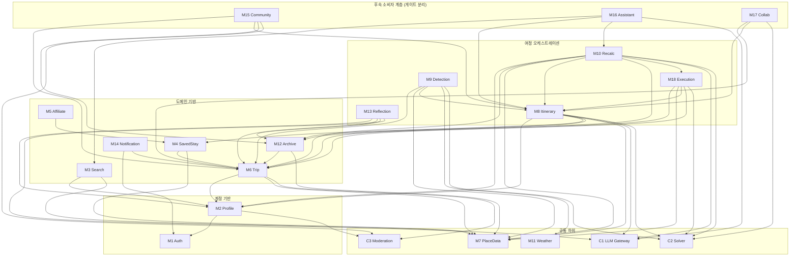
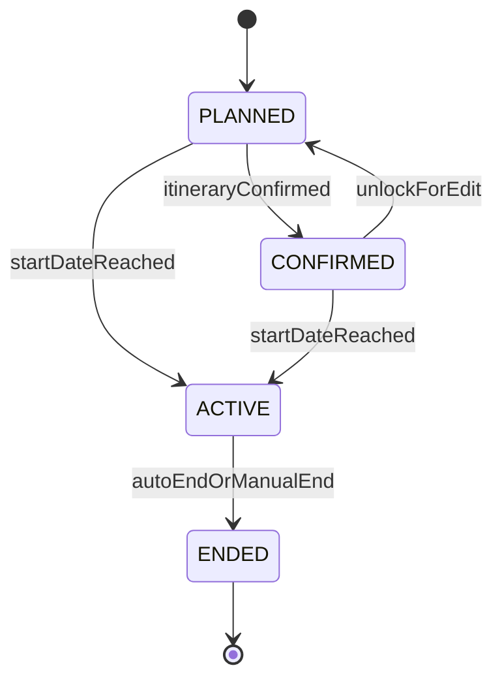
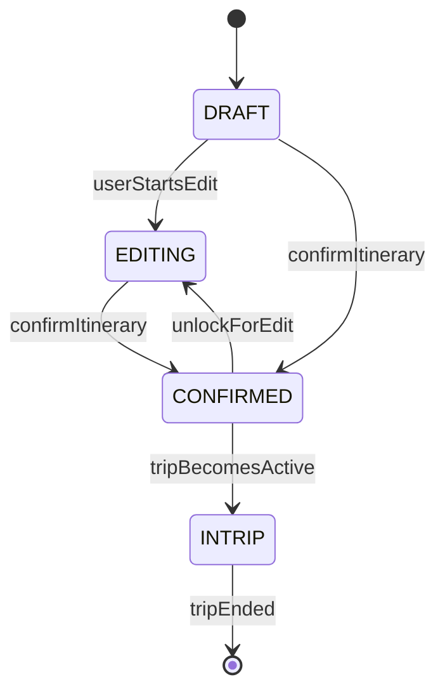
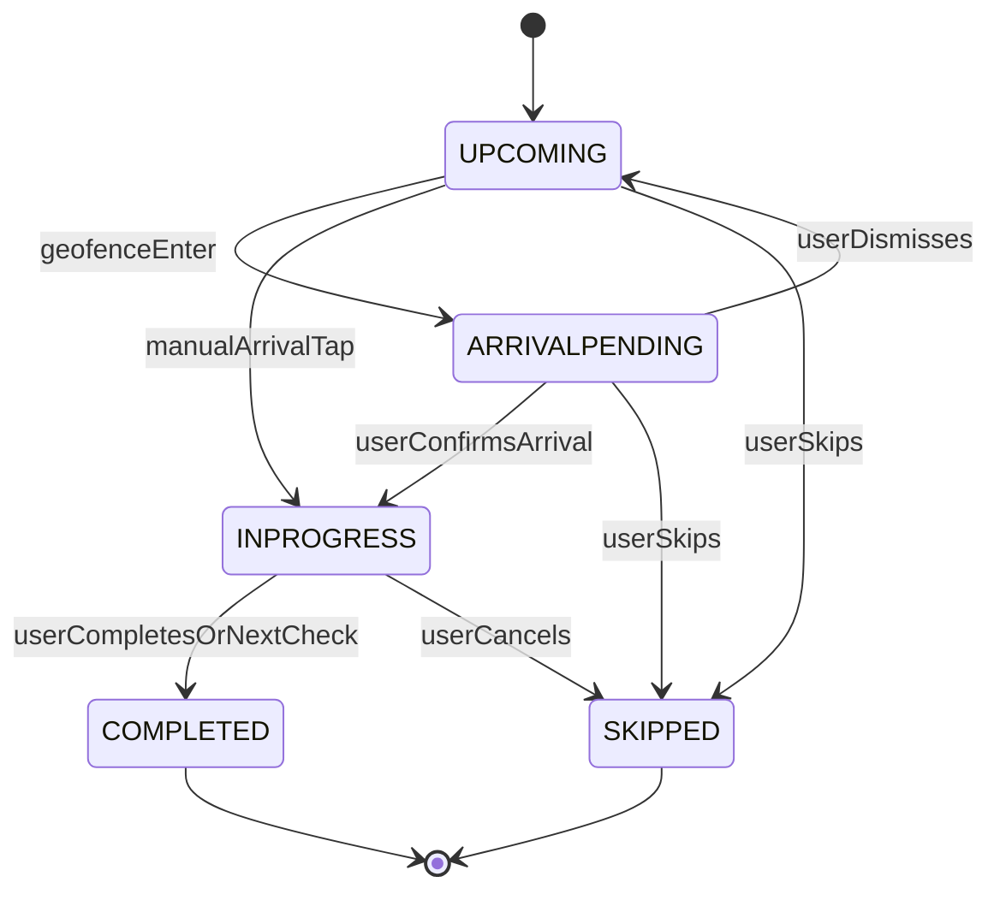

# TripPilot 아키텍처

> 출처: aidlc/aidlc-docs/inception/application-design/{application-design.md, components.md, component-dependency.md, component-methods.md} · aidlc/aidlc-docs/construction/u1-foundation/nfr-requirements/tech-stack-decisions.md · aidlc-docs에서 2026-07-05 추출 · 이후 본 문서가 정본이다.

이 문서는 TripPilot 시스템의 컴포넌트 경계·내부 구조·통신 방식·기술 스택을 정의한다. 도메인 상태 머신의 전이 규칙 상세는 [도메인 모델](./domain.md), 오케스트레이션 흐름과 데이터 생명주기 상세는 [주요 흐름](./flows.md), 결정 ID(D/Δ/N/P·ADR)의 근거는 [핵심 결정](./decisions.md), 비기능 기준은 [NFR 기준](./nfr.md)이 각각 소유한다. 개별 컴포넌트의 메서드 시그니처·유닛별 구현 범위는 [개발 순서](./units.md)와 units/ 하위 문서를 참조한다.

---

## 1. 시스템 개요

TripPilot은 B2C 여행자 슈퍼앱이다. 클라이언트는 React Native(Expo), 서버는 Spring Boot(Kotlin) 기반 **모듈러 모놀리스**, 데이터 저장소는 PostgreSQL이며 **단일 배포 단위**로 운영한다.

| 계층 | 구성 | 원칙 |
|---|---|---|
| 클라이언트 | React Native + Expo(development build + prebuild), TypeScript strict | 서버 모듈의 공개 REST API만 소비. 비즈니스 규칙 정본은 항상 서버(클라이언트 경량 검증은 UX용 사본, D28) |
| 서버 | Spring Boot 3.4(Kotlin 2.1, JDK 21). 모듈러 모놀리스 — 기능 모듈 15개(1차)+공통 3개를 단일 애플리케이션으로 조립 | 각 모듈은 자기 소유 테이블에만 쓰기. 타 모듈 데이터는 공개 퍼사드(동기) 또는 도메인 이벤트(비동기)로만 접근(D04) |
| 저장소 | PostgreSQL 단일. 오브젝트 스토리지(S3 호환)+CDN은 사진 미디어 | 법정 로그·동의 증적은 append-only + DB 권한 분리(N2, SECURITY-14) |
| 외부 API | 카카오·TMap·기상청·TourAPI·LLM(단일 벤더)·FCM 6종 | 소유 모듈 내부 포트 인터페이스 뒤에 격리(AD-2). 벤더 교체가 모듈 경계에 무영향 |

**모듈러 모놀리스를 택한 이유**: 스케줄러·워커도 동일 배포 내 스레드로 시작하되 모듈 경계를 지켜, 추후 특정 모듈(M9 폴링 등)을 분리 워커로 전환할 수 있게 인터페이스를 platform 계층에 둔다. 즉 배포 단위는 하나이나 내부 경계는 마이크로서비스 분리가 가능한 형태로 유지한다.

### 1.1 핵심 아키텍처 결정 (AD-1 ~ AD-5)

| ID | 결정 | 요지 |
|---|---|---|
| AD-1 | 컴포넌트 경계 | PRD 기능 모듈 17개 + M18 Trip Execution(Δ7 신설) + 공통 C1 LLM Gateway·C2 Solver Engine·C3 Moderation. 요구사항 결정과 1:1 추적 |
| AD-2 | 모듈 내부 구조 | api/application/domain/infra 레이어드 통일. 외부 API 6종은 `{Capability}Port` 인터페이스 뒤에 `{Vendor}Adapter`로 격리. "외부 API 1종 = 소유 모듈 1곳 = 어댑터 포트 1벌" |
| AD-3 | 모듈 간 통신 | 공개 퍼사드 동기 호출 + 도메인 이벤트(트랜잭셔널 아웃박스, at-least-once, 구독자 멱등). 동기 상호 참조 0건(위상 정렬로 순환 부재 증명) |
| AD-4 | 상태 머신 정본 3종 | 여행(M6)·일정(M8)·방문(M18) 상태 머신을 소유 모듈이 강제, 타 모듈은 이벤트로만 관찰([도메인 모델](./domain.md) 정본) |
| AD-5 | 상세 계약 소유 | 상세 비즈니스 규칙·전이도·전체 REST 스펙·예외 계약은 유닛별 Functional Design이 소유. 본 아키텍처 문서는 경계·통신·인터페이스 요지까지 |

### 1.2 5계층 컴포넌트 지도

```text
+------------------------------------------------------------------+
| [후속 소비자 계층]  M15 Community | M16 Assistant | M17 Collab    |  ← 1차 코드 생성 제외(게이트 분리)
+------------------------------------------------------------------+
| [여정 오케스트레이션]                                             |
|   M8 Itinerary <-> M10 Recalc <- M9 Detection <- M18 Execution   |
|                                        |              |          |
|                                        v              v          |
|                                   M11 Weather    M13 Reflection  |
+------------------------------------------------------------------+
| [도메인 기반]                                                     |
|   M6 Trip - M4 SavedStay - M3 Search - M5 Affiliate              |
|   M12 Archive - M14 Notification                                 |
+------------------------------------------------------------------+
| [계정 기반]   M1 Auth - M2 Profile                                |
+------------------------------------------------------------------+
| [공통 하위]   C1 LLM | C2 Solver | C3 Moderation | M7 PlaceData   |  ← 어떤 기능 모듈에도 의존하지 않음
+------------------------------------------------------------------+
```

후속 모듈 M15~M17은 1차 모듈의 공개 퍼사드만 소비하는 최상위 계층이다. 여정 오케스트레이션 계층(M8·M9·M10·M11·M13·M18)이 도메인 기반 계층(M3~M6·M12·M14)과 계정 계층(M1·M2)에 의존하며, 공통 하위 계층(C1~C3·M7)은 어떤 기능 모듈에도 의존하지 않는 최하위다.

---

## 2. 컴포넌트 지도 (M1~M18 · C1~C3)

### 2.1 기능 모듈 개요

| ID | 컴포넌트 | 한 줄 책임 | 관련 에픽 | Gradle 모듈 | 태그 |
|---|---|---|---|---|---|
| M1 | Auth | 가입·로그인·토큰·동의 증적·계정 생명주기 | E1 | `server/modules/auth` | 1차 |
| M2 | User Profile | 닉네임·취향 7종·중립 기본값·개인화 입력 공급 | E1, E9 | `server/modules/profile` | 1차 |
| M3 | Accommodation Search | 숙소 탐색·필터·상세·위시리스트 | E3 | `server/modules/stay-search` | 1차 |
| M4 | Saved Accommodation | 등록 숙소(계정 풀)·여행 거점 연결·숙소 ID 통합 | E3, E4 | `server/modules/stay-registry` | 1차 |
| M5 | Affiliate Link | OTA 딥링크 생성·고지·아웃바운드 클릭 기록 | E3 | `server/modules/affiliate` | 1차 |
| M6 | Trip Creation | 여행 CRUD·예산·시간창·필수 방문지·여행 상태 머신 | E4 | `server/modules/trip` | 1차 |
| M7 | Place Data | POI 정본·canonical ID·하이브리드 캐싱·후보 풀 | E2~E8 횡단 | `server/modules/place` | 1차 |
| M8 | Itinerary Generation | 일정 생성 오케스트레이션·편집 재검증·일정 상태 머신 | E5 | `server/modules/itinerary` | 1차 |
| M9 | Plan-B Detection | 자동 트리거 4종 감지·억제·민감도 | E7 | `server/modules/planb-detection` | 1차 |
| M10 | Itinerary Recalculation | 재계획 세션·후보 생성·전/후 비교·확정 | E7 | `server/modules/planb-recalc` | 1차 |
| M11 | Weather & Context | 기상청 예보·특보 수집·격자 변환·캐시 | E7 | `server/modules/weather` | 1차 |
| M12 | Travel Archive | actual 기록·사진·changelog·오프라인 동기화 | E8 | `server/modules/archive` | 1차 |
| M13 | AI Reflection | 회고·전체 요약·스타일 분석·공유 카드 | E8 | `server/modules/reflection` | 1차 |
| M14 | Notification | 서버 스케줄링 발송·FCM·알림함·토글·방해금지 | E9 | `server/modules/notification` | 1차 |
| M15 | Community | 공개 스냅샷·피드·좋아요·댓글·신고·차단 | E11 | (미생성) | `[후속]` |
| M16 | Assistant | 대화 오케스트레이션·모듈 호출 위임·가드레일 | E10 | (미생성) | `[후속]` |
| M17 | Collaborative Editing | 초대·권한·항목 잠금·충돌 해소·프레즌스 | E12 | (미생성) | `[후속]` |
| M18 | Trip Execution | 활성 허브·도착 확인·방문 상태 머신·여행 종료 전이 | E6, E2 | `server/modules/execution` | 1차 |

### 2.2 공통(횡단) 컴포넌트 개요

| ID | 컴포넌트 | 한 줄 책임 | Gradle 모듈 |
|---|---|---|---|
| C1 | LLM Gateway | 단일 벤더 서버 경유 호출·티어 라우팅·서버 재조회 주입·스키마 검증 | `server/common/llm-gateway` |
| C2 | Solver Engine | OPTW/TOPTW 최적화·하드 제약 검증·이동시간 추정·결정론적 폴백 | `server/common/solver` |
| C3 | Content Moderation | 금칙어 사전 검증(닉네임·여행 제목 1차, UGC 확장 여지) | `server/common/moderation` |

`server/platform/*`은 컴포넌트가 아니라 이벤트 버스·아웃박스·웹 공통·관측성 등 전 모듈이 의존 가능한 기술 기반이다. `app` 모듈만 Spring Boot 애플리케이션으로, 각 모듈을 스프링 컨텍스트에 조립한다(나머지 `modules/*`·`common/*`은 일반 Gradle 모듈).

---

## 3. 모듈 내부 구조와 외부 API 격리 (AD-2)

### 3.1 레이어드 구조

모든 기능 모듈은 `api / application / domain / infra` 4계층으로 통일한다. Gradle에서는 각 모듈을 `api`(퍼사드 인터페이스·DTO·이벤트 정의)와 `internal`(구현·영속성) 소스셋/서브모듈로 분리하고, **다른 모듈에 대한 Gradle 의존 선언은 대상 모듈의 `api`에만 허용**한다.

| 레이어 | 책임 | 노출 |
|---|---|---|
| `api` | 공개 퍼사드 인터페이스, 요청/응답 DTO, 발행 이벤트 정의 | 타 모듈이 유일하게 볼 수 있는 표면 |
| `application` | 오케스트레이션·트랜잭션 경계·이벤트 발행/구독 | 모듈 내부 |
| `domain` | 엔티티·상태 머신·비즈니스 규칙 | 모듈 내부 |
| `infra` | 영속성 어댑터, 외부 API 어댑터(Port 구현), 스케줄러 잡 | 모듈 내부 |

**빌드 규칙의 정본은 의존 매트릭스(§4.3)다.** 허용 의존 목록은 매트릭스의 동기(S) 셀과 1:1로 일치해야 하며, 위반은 Konsist/ArchUnit 아키텍처 테스트 + Gradle 의존 제약으로 빌드 실패 처리한다. "인증 가드 없는 핸들러" 같은 컨벤션 위반도 아키텍처 테스트로 검출한다.

### 3.2 외부 API 6종 포트 격리

모든 외부 호출은 소유 모듈 내부의 포트(인터페이스) 뒤에 격리한다. 명시적 **타임아웃 + 서킷 브레이커 + 우아한 저하**(RESILIENCY-10)를 어댑터 계층에서 일괄 적용하고, 실패율은 대시보드 계측·쿼터 80% 알람(RESILIENCY-09) 대상이다. PR CI에서는 전 포트를 fake로 대체한다(D37).

**외부 어댑터 소유 맵**:

| Port(계약 인터페이스) | 대표 Adapter | 소유 컴포넌트 |
|---|---|---|
| `SocialOAuthPort` | Google/Apple/Kakao/Naver OAuthAdapter | M1 |
| `MailDeliveryPort` | (관리형 메일 발송 — 클라우드 결정 대기) | M1 |
| `PlaceSearchPort` / `GeocodingPort` | `KakaoLocalAdapter`(1차), `NaverLocalAdapter`(2차 폴백) | M7 |
| `TourContentPort` | `TourApiAdapter` | M7 (M3 계약 공유) |
| `RoadDistancePort` | `TmapDistanceAdapter`(1차), `NaverDistanceAdapter`(2차), 직선거리 추정(최종) | C2 |
| `WeatherPort` | `KmaOpenApiAdapter`(단기예보·특보) | M11 |
| `LlmPort` | `ManagedLlmVendorAdapter`(단일 벤더, 티어 2종) | C1 |
| `PushPort` | `FcmAdapter`(iOS 포함 FCM 단일) | M14 |
| `OtaDeeplinkPort` | 파트너별 `OtaPartnerAdapter`(URL 템플릿) | M5 |
| `MediaStoragePort` | S3 호환 오브젝트 스토리지 + CDN | M12 |

**외부 API별 폴백·약관 제약**:

| 외부 API | 소유 | 폴백 계단 | 약관·정책 제약 |
|---|---|---|---|
| 카카오 로컬(장소 검색·지오코딩) | M7 | 네이버 2차(D08) → TTL 캐시 잔존분 → '확인 불가' 안내(G8) | 영구 캐싱 금지·실시간 호출·출처 표기(D13) — 캐시는 약관 허용 TTL 한정 |
| 카카오 지도 SDK(클라이언트) | 클라 `shared/map` | 지도 로드 실패 시 목록/시간표 뷰 폴백 | 출처 표기, SDK 약관 |
| TMap(도로 거리) | C2 | 직선거리×우회계수 1.3 + 안전계수(G106) → 네이버 2차(D08) | 소요시간 미표시 — 거리만(D25/Δ1) |
| 기상청 공공데이터포털(단기예보·특보) | M11 | 마지막 성공 캐시(신선도 표기) → 초과 시 날씨 트리거 판정 skip + 계측 | 활용 신청 선결(P3), 좌표→격자 변환은 어댑터 은닉 |
| TourAPI(POI·숙소 정적 콘텐츠) | M7(M3 공유) | 카카오 검색 대체 → 정본 테이블 잔존분 → '확인 불가' 배지 | 활용 신청·캐싱 조건 확인 선결(P4). 정적 콘텐츠 갱신 일 1회(G196) |
| LLM 벤더(단일 관리형) | C1 | M8=결정론적 솔버 폴백+품질 고지 / M10=수동 수정 제안 / M13=기본 카드 | 서버 경유 단일 경로(D11), 사용자별 rate-limit(SECURITY-11), 국외 이전 고지(G181, P6), 컨텍스트 서버 재조회 최소화(D31) |
| FCM(푸시) | M14 | 발송 실패와 무관하게 인앱 알림함 적재(단일 파이프라인, D12) | iOS 포함 FCM 단일(D12) |
| OTA(딥링크) | M5 | 링크 생성 불가 시 숙소명 복사/다른 OTA 안내 | 크롤링 금지·리뷰/평점 미표시·제휴 수수료 고지, 파트너별 정책(P5), URL 파싱 화이트리스트(G31) |

> 카카오 로컬·카카오 지도 SDK는 소스가 겹치나 소유가 다르다(서버 데이터=M7, 클라이언트 렌더=`shared/map`). LLM·TMap·기상·FCM·TourAPI·OTA를 합쳐 "외부 API 6종"으로 표현하며, 지도는 서버(카카오 로컬)·클라이언트(카카오 지도 SDK) 양면이다.

**격리 원칙**: 외부 API 1종 = 소유 모듈 1곳(어댑터 포트 1벌). 다른 모듈은 외부 API의 존재를 모르고 소유 모듈의 퍼사드 DTO만 본다. 따라서 벤더 교체(지도 폴백 순서 변경, LLM 벤더 전환 등)는 해당 어댑터 구현 교체로 한정되며 의존 매트릭스에 영향이 없다.

### 3.3 공통 설계 규약

전 컴포넌트에 공통 적용되는 경계 규칙이다. 개별 컴포넌트 절에서는 이 규약과의 차이만 기술한다.

1. **모듈러 모놀리스 경계(D04)** — 자기 소유 테이블에만 쓰기. 타 모듈 데이터는 공개 퍼사드 또는 도메인 이벤트로만.
2. **어댑터 계약(Port/Adapter, D37·RESILIENCY-10)** — 모든 외부 API는 Port 뒤 Adapter로 격리. CI는 fake로 테스트, 실 어댑터는 타임아웃+서킷 브레이커+실패율 계측.
3. **침묵 실패 금지(ADR-0011)** — 각 컴포넌트가 자기 외부 의존·AI 산출의 폴백 경로를 소유하고, "실패 시 어떤 사용자 관찰 가능한 대체 경로를 제공하는가"를 명시.
4. **plan/current/actual/changelog 구분(ADR-0013·D14)** — plan(불변 스냅샷)·current(가변 현재본)는 M8, actual·changelog는 M12 소유. changelog는 통합 스키마(G132: 행위자·출처 유형·사유·전/후 값) 하나로 Plan-B·공동편집·어시스턴트 변경을 모두 수용.
5. **권한 검증(SECURITY-08)** — 모든 퍼사드 deny-by-default. 리소스 ID 참조 시 소유권 검증(IDOR 방지)은 소유 모듈 책임. 모든 퍼사드 메서드는 인증된 호출자 `caller: Principal`을 암묵 첫 인자로 받는다(D22).
6. **금칙어 검증(C3)** — 사용자 노출 텍스트(닉네임·여행 제목, 후속: 캡션·댓글)는 저장 전 C3 경유.
7. **소요시간 비노출(D25/Δ1)** — 이동시간 값은 C2 내부 계산 전용. 어떤 퍼사드도 표시용 소요시간 필드를 반환하지 않으며, 표시 DTO는 `DistanceRange`(거리·수단·추정 표기)까지만.
8. **여행 겹침 차단(D21/Δ3)** — 여행 날짜 구간을 생성·변경하는 모든 메서드가 계정 내 날짜 비중첩을 하드 가드로 검증. "진행 중 여행"은 시스템 전역에서 항상 최대 1개.
9. **상태 머신 PBT(전체 강제)** — 상태 머신 3종과 솔버 하드 제약은 속성 기반 테스트 1급 대상(Kotest/fast-check, 시드 로깅·수축 필수).

---

## 4. 모듈 간 통신 (AD-3)

### 4.1 두 가지 통신 수단

| 수단 | 표기 | 성격 | 순환 판정 |
|---|---|---|---|
| 공개 퍼사드 동기 호출 | `S[n]` | 인프로세스 퍼사드 호출(읽기/쓰기). 호출자→피호출자 컴파일 의존 | 순환 판정 대상 |
| 도메인 이벤트 구독 | `E[n]` | Spring `ApplicationEventPublisher` 계열 + 트랜잭셔널 아웃박스. 발행자는 구독자를 모름 | 순환 판정 제외(발행자→구독자 컴파일 의존 없음) |

모든 이벤트는 모듈러 모놀리스 내 인프로세스 이벤트 버스로 전달하며, **at-least-once** 배달 + **구독자 멱등** 처리를 전제로 한다. 추후 분리 워커 전환(D04) 시 브로커 교체가 가능하도록 발행/구독 인터페이스를 platform 계층에 둔다.

### 4.2 도메인 이벤트 카탈로그

| 발행자 | 이벤트 | 구독자 | 페이로드 원칙 |
|---|---|---|---|
| M1 | 가입 완료 / 계정 삭제 개시(30일 유예) / 유예 만료 | M2(연쇄 대상 확장 가능) | user_id + 발생 시각만 — 상세는 구독자가 재조회 |
| M6 | 여행 삭제 / 여행 날짜 변경 | M4 | trip_id + 변경 유형 |
| M8 | 일정 확정 / current 변경 | M14 | trip_id + itinerary_version — 알림 스케줄 재계산 트리거(D32) |
| M12 | changelog 기록 / 오프라인 병합 완료(G74) | M8 | trip_id + changelog_seq — current 버전·변경 배지 동기화 |
| M18 | 방문 시작·완료 전이 / 여행 시작·종료(D19) / 휴식 모드 전환(G54) / 체류 초과·이동 지연 신호(D27) | M9, M12, M13, M14 | trip_id + slot_id + 전이 유형 + 시각 — actual 상세는 M12가 소유 데이터로 생성 |

**멱등·아웃박스 요지**: 쓰기 트랜잭션과 이벤트 발행을 아웃박스 테이블로 원자화해 유실 없이 전달하고, 구독자는 상태 갱신 멱등성으로 중복 수신을 흡수한다. 실행 시 되먹임 루프(M8 변경→M14, M12 기록→M8 배지)는 상태 갱신 멱등성과 M9의 빈도 상한(G58)으로 발산을 차단한다.

### 4.3 의존 매트릭스 (1차 범위)

행(사용 모듈) → 열(의존 대상). `S`=동기 퍼사드 호출, `E`=이벤트 구독(열 모듈이 발행한 이벤트를 행 모듈이 구독), `·`=의존 없음.

| ↓사용 \ 대상→ | M1 | M2 | M4 | M6 | M7 | M8 | M11 | M12 | M14 | M18 | C1 | C2 | C3 |
|---|---|---|---|---|---|---|---|---|---|---|---|---|---|
| M1 Auth | — | · | · | · | · | · | · | · | · | · | · | · | · |
| M2 Profile | S E | — | · | · | · | · | · | · | · | · | · | · | S |
| M3 Search | · | S | · | · | S | · | · | · | · | · | · | · | · |
| M4 SavedStay | · | · | — | S E | S | · | · | · | · | · | · | · | · |
| M5 Affiliate | · | · | S | · | · | · | · | · | · | · | · | · | · |
| M6 Trip | · | S | · | — | S | · | · | · | · | · | · | · | S |
| M7 PlaceData | · | · | · | · | — | · | · | · | · | · | · | · | · |
| M8 Itinerary | · | S | S | S | S | — | · | E | · | · | S | S | · |
| M9 Detection | · | · | · | S | S | S | S | · | · | E | · | S | · |
| M10 Recalc | · | S | · | S | S | S | · | S | · | S | S | S | · |
| M11 Weather | · | · | · | · | · | · | — | · | · | · | · | · | · |
| M12 Archive | · | · | · | S | S | · | · | — | · | E | · | · | · |
| M13 Reflection | · | S | · | S | · | · | · | S | · | E | S | · | · |
| M14 Notification | S | · | · | S | · | E | · | · | — | E | · | · | · |
| M18 Execution | · | · | · | S | S | S | · | S | · | — | · | S | · |

- **M1은 어떤 모듈에도 의존하지 않는 최하위 계정 기반**이다. `가입 완료`·`계정 삭제 개시`·`유예 만료` 이벤트의 발행자이며, M2 등이 구독해 연쇄 처리한다.
- **공통 C1·C2·C3은 기능 모듈에 의존하지 않는다.** C1의 서버 재조회(D31)는 호출자가 전달한 조회 콜백/참조 해석기로 수행해 역의존을 방지한다.
- M3·M5는 상호 독립(카드 UI에서 클라이언트가 조합). M5→M4는 숙소 식별 참조(읽기 전용)만.
- M7·M11은 공급 전용 최하위 모듈로 어떤 기능 모듈에도 의존하지 않는다.

**초안 대비 보정 2건** — 압축 초안의 동기 상호 참조 2건을 이벤트로 전환해 순환을 해소했다:

| # | 초안 문제 | 보정 | 근거 |
|---|---|---|---|
| 보정1 | M1↔M2 동기 상호 참조 | M1→M2 동기 호출 제거. 가입 완료 시 프로필 초기 생성은 M1 `가입 완료` 이벤트를 M2가 구독. M2→M1(계정 상태 조회)만 유지 | Auth는 최하위 기반 — 상위 도메인을 알면 안 됨 |
| 보정2 | M6↔M4 동기 상호 참조 | M6→M4 동기 호출 제거. 여행-거점 연결 조인은 M4 소유로 단일화. 여행 삭제 시 거점 정리는 M6 `여행 삭제` 이벤트를 M4가 구독 | D15 조인 소유권을 M4로 통일 |

### 4.4 순환 부재 증명 (위상 정렬)

보정 2건 적용 후 동기(S) 간선만의 그래프는 다음 위상 정렬 순서를 가진다(왼쪽이 하위 — 각 모듈의 모든 S 의존 대상은 자신보다 왼쪽에만 존재):

```text
C1 → C2 → C3 → M7 → M11 → M1 → M2 → M3 → M6 → M4 → M12 → M14
   → M5 → M8 → M13 → M9 → M18 → M10 → [후속] M17 → M15 → M16
```

| 모듈 | S 의존 대상 | 선행? |
|---|---|---|
| C1·C2·C3·M7·M11·M1 | (없음) | ✓ 최하위 |
| M2 | M1, C3 | ✓ |
| M3 | M2, M7 | ✓ |
| M6 | M2, M7, C3 | ✓ |
| M4 | M6, M7 | ✓ |
| M12 | M6, M7 | ✓ |
| M14 | M1, M6 | ✓ |
| M5 | M4 | ✓ |
| M8 | M2, M4, M6, M7, C1, C2 | ✓ |
| M13 | M2, M6, M12, C1 | ✓ |
| M9 | M6, M7, M8, M11, C2 | ✓ |
| M18 | M6, M7, M8, M12, C2 | ✓ |
| M10 | M2, M6, M7, M8, M12, M18, C1, C2 | ✓ |
| M17 | M6, M8, C2 | ✓ |
| M15 | M6, M8, M12, C3 | ✓ |
| M16 | M3, M8, M10, C1 | ✓ |

유효한 위상 정렬이 존재하므로 동기 의존 그래프는 **DAG(순환 없음)**이다. 이벤트(E) 간선은 발행자→구독자 방향의 컴파일 의존이 없어 순환 판정 대상이 아니다.

### 4.5 주요 동기 의존 통신 계약과 서킷 브레이커 지점

모듈러 모놀리스이므로 모든 S 의존은 인프로세스 퍼사드 호출이다. "피호출 모듈 다운"의 실체는 (a) 감싼 외부 API 장애, (b) 공유 PostgreSQL 장애, (c) 논리 실패(해 없음·검증 실패) 세 가지다. **서킷 브레이커는 프로세스 간이 아니라 외부 어댑터 경계(§3.2)에 둔다.** 모듈 간에는 타임아웃·폴백·우아한 저하 계약으로 대응한다.

| # | 호출 | 결합도 | 장애 전파·서킷/폴백 |
|---|---|---|---|
| M8→M7 | `getCandidatePool` / `getPoiSnapshots` (closed-set 후보 풀) | 중간 | M7 외부 소스 장애 시 서킷은 **M7 어댑터 단에서 오픈** → 캐시 정본(TTL 잔존분). 후보 부족 시 M8은 부분 생성 대신 '후보 부족' 오류 + 안내 |
| M8→C1 | `scoreCandidates` / `explainPlacement` (LLM 점수·설명) | 낮음 | LLM 벤더 다운·스키마 검증 실패 → **C1 서킷 오픈** → M8은 결정론적 솔버 폴백 + 품질 고지. 생성은 절대 LLM에 인질 안 잡힘 |
| M8→C2 | `solve` / `validate` (솔버 배치·확정 검증) | 강함(값 객체 명세로 완화) | C2는 인프로세스 결정론 코드 — 외부 다운 없음. '해 없음/시간 초과' → 부분 초안 저장 + '이어서 생성'(G161). TMap 실패는 C2 내부 직선거리 폴백으로 흡수 |
| M8→M6·M4·M2 | 여행 제약·거점·취향 읽기 묶음 | 낮음 | 세 모듈 모두 공유 DB Critical. 생성 시작 시 1회 로드 후 불변 입력 취급(부분 장애 창 최소화). DB 장애 시 생성 불가(폴백 없음, Multi-AZ 1차 방어) |
| M10→M8 | `getCurrent` / `applyRecalcProposal` (current 읽기·재계획 반영) | 강함 | current **쓰기는 이 단일 경로만**. 변경 diff 제안으로 전달, M8이 하드 제약 재검증 후 반영. 반영 실패 시 세션 보존 + 후보 재산출(G56). current는 절대 반쯤 반영 안 됨(트랜잭션 원자성) |
| M10→C2 | 대안 검증·확정 재검증 | 강함 | Plan-B 10초 초과 시 **수동 수정 폴백 제안** — High 중요도이나 수동 폴백으로 우아한 저하 |
| M9→M11 | `getForecast` / `getAlerts` (날씨 폴링 1시간) | 낮음 | 기상청 장애 → **M11 어댑터 서킷 오픈** + 마지막 성공 캐시. 신선도 초과 시 M9는 날씨 트리거 판정 **skip**(오탐 방지) + 실패율 계측 |
| M9→M8 | `getCurrent` (감지 대상 일정) | 낮음 | 조회 실패 시 해당 폴링 사이클 skip 후 재시도 — 트리거 지연만, 오동작 없음 |
| M18→M8 | `getCurrent` (활성 허브 일정) | 낮음 | Critical 경로(현장 피해 최대). 오프라인 조회 미보장(D24) — 클라이언트 오류·재시도, 서버는 Multi-AZ·헬스체크. 별도 기능 폴백 없음(의도된 결정) |
| M18→M12 | `getVisitSummary` (진행률) | 낮음 | actual 생성은 **이벤트로 역전(E)** — M12 지연이 방문 체크 UX를 차단하지 않음. 조회 실패 시 진행률 배지만 생략(우아한 저하) |
| M12→M7 | `searchPoi` (즉석 방문 POI) | 낮음 | 외부 검색 실패 시 자유 텍스트 입력 폴백(좌표·카테고리 없음, 분석 '기타') |
| M14→M6 | `getTripDates` (리마인드 스케줄) | 낮음 | 재계산 실패 시 기존 스케줄 유지 + 재시도 큐. 미발송분은 인앱 재평가로 보완 |
| M13→C1 | `generate` (회고·분석) | 낮음 | LLM 실패 → 기본 카드 폴백 + 수동 '다시 생성'. 비동기 생성이라 사용자 대기 차단 없음 |
| M4→M6 | `getTripDates` (날짜 비중첩 검증) | 낮음 | 조회 실패 시 거점 연결 **거부(fail-closed)** — 데이터 정합성 우선. 등록 CRUD 자체는 M6 무관하게 동작 |
| M6→M7 | `resolveAndSnapshot` (필수 방문지 검증·스냅샷) | 중간 | 외부 소스 실패 시 캐시 정본으로 검증 지속. 미확인 POI는 '확인 불가' 상태로 보류 + 안내(G8) — 검증 없는 통과 없음 |

### 4.6 후속 게이트 분리 성립

- **1차 모듈(M1~M14, M18, C1~C3) → 후속 모듈(M15·M16·M17) 의존: S·E 합계 0건.** 매트릭스에 M15~M17 열 자체가 없는 것이 증명이다.
- 후속 3개 모듈은 전부 기존 공개 퍼사드·이벤트만 소비하는 상위 소비자다. 따라서 후속 미구현 상태로 1차 범위가 완결 빌드·배포 가능하다(D03·ADR-0016 별도 출시 게이트).
- 후속 대비 선반영은 의존이 아니라 **데이터 모델 여지**로만 존재: 공개 스냅샷 스키마(D16·G84), changelog 공용 스키마(G132), 계정 제재 상태 필드(G179), 항목 버전 컬럼(D30), C1 컨텍스트 권한 경계(D31). 전부 1차 모듈 소유 데이터의 스키마 확장이며 코드 의존을 만들지 않는다.

### 4.7 의존·계층 그래프



(텍스트 대안: 후속 소비자(M15→M6·M8·M12·C3 / M16→M3·M8·M10·C1 / M17→M6·M8·C2)는 전부 하향 의존이며 역방향 0건. 여정 오케스트레이션은 M10이 최상위 오케스트레이터(M8·M18·M12·M6·M7·M2·C1·C2 소비), M9·M18·M13·M8은 도메인 기반·공통 하위를 소비. 계정 기반 M2→M1·C3, M1은 이벤트 발행만. 공통 하위 M7·M11·C1·C2·C3은 무의존.)

---

## 5. 기능 모듈 상세 (M1~M18)

각 모듈의 목적·핵심 책임·소유 엔티티·주요 인터페이스 그룹·외부 의존·실패 폴백·관련 결정을 정의한다. 메서드 시그니처 상세와 스토리 매핑은 [주요 흐름](./flows.md)·units/ 문서를 참조한다.

### M1 Auth (인증)

**목적** — 여행자 단일 사용자 유형의 가입·로그인·세션·법정 동의 증적·계정 생명주기를 소유한다. 전 기능의 Critical 의존 지점이자 앱 부트스트랩 계약(세션·약관 버전·최소 지원 버전) 제공자다.

**핵심 책임**
- 소셜 4종(Google·Apple·카카오·네이버) OAuth 가입/로그인 — 제공자 `sub` 기준 식별, 동일 이메일 충돌 시 기존 수단 유도, Apple 비공개 릴레이는 별도 계정 허용(G20)
- 이메일 가입: 인증 링크(유효 24h, 재발송 분당 1회·일 5회), 미인증 7일 후 정리, 비밀번호 8자+영문/숫자+유출 목록 검증, argon2/bcrypt 해시(G22, SECURITY-12)
- 비밀번호 재설정, 브루트포스 방어(점진 지연/잠금)
- 토큰 발급·회전: 액세스 1시간 + 리프레시 90일 회전, 다기기 동시 로그인, 세션별 무효화(D36)
- 연령 확인: 생년월일 또는 '만 14세 이상' 확인 필수, 미만 차단(N1)
- 약관 동의 증적: 항목·일시·버전 append-only 저장, 재동의 필요 플래그, 중대 변경 시 스플래시 분기 재동의 강제(N3)
- 위치기반서비스 약관 별도 필수 동의 + GPS 기록 옵트인 동의의 서버측 증적(N2)
- 마케팅 수신 동의 수집·철회(N8)
- 계정 삭제 30일 유예: 즉시 비노출 → 유예 만료 배치가 연쇄 삭제 오케스트레이션, 유예 중 동일 식별자 재가입 제한(D18, C4)
- 부트스트랩 응답 계약: 세션 유효성·재동의 필요·서버 최소 지원 버전(강제 업데이트 게이트 입력) 제공(N4)

**소유 엔티티**

| 엔티티 | 핵심 속성 | 상태 |
|---|---|---|
| Account | email, passwordHash?, birthDateOrAgeConfirm, marketingOptIn | `UNVERIFIED → ACTIVE → DELETION_PENDING → DELETED` + (후속 예약) 제재 필드(G179) |
| SocialIdentity | provider, providerSub, linkedAccountId (N:1) | — |
| ConsentRecord | consentType, termsVersion, agreedAt, revokedAt? | append-only |
| TermsVersion | version, effectiveAt, reconsentRequired(중대/경미) | — |
| RefreshSession | tokenHash, deviceId, issuedAt, rotatedAt, revokedAt? | 회전 체인 |
| DeletionSchedule | requestedAt, purgeAt(+30일) | 유예 관리 |

**주요 인터페이스** — 가입·로그인(소셜/이메일 가입·인증·로그인·재설정) / 세션(토큰 회전·로그아웃·부트스트랩 확인 `getBootstrapStatus`) / 동의(기록·재동의 판정·마케팅/GPS/위치 3층 토글) / 생명주기(삭제 요청·철회·배치 정리)

**외부 의존** — `SocialOAuthPort`(4종), `MailDeliveryPort`

**실패·폴백** — 소셜 제공자 오류는 계정 미생성 보장 + 재시도. 인증 메일 실패는 미인증 유지 + 재발송. 부트스트랩 지연 시 클라이언트가 마지막 로컬 세션으로 분기(G5), 서버는 멱등 재검증 API 보장.

**관련 결정** — D18, D22, D36, N1, N2, N3, N4, N8, G5, G20, G22, C4 / SECURITY-08·12·14

### M2 User Profile (사용자 프로필)

**목적** — 닉네임과 여행 취향 7종(스타일·페이스·예산·동행·선호 활동·이동 방식·음식)을 저장·수정하고, AI 일정 생성·재계획·숙소 탐색의 개인화 입력값을 **미설정 시 중립 기본값 포함**으로 공급한다.

**핵심 책임**
- 닉네임 자동 생성('형용사+여행명사+2자리 숫자', 충돌 시 재추첨, G23) — 자동값만으로 온보딩 통과 허용
- 닉네임 수정 검증: 2~20자·금칙어(C3 위임)·중복, 위반 시 인라인 오류 + 대체 추천
- 취향 7종 CRUD: 온보딩·설정 동일 선택지, 건너뛰기=미설정 저장, 즉시 반영
- 동행 유형=기본 유형 단일 선택 + '반려동물 동반' 보조 불리언 분리(G19)
- 러프 예산: 4구간 + 직접 입력 시 총액 원값+매핑 구간 동시 저장, **전체 여행 총액 기준**(Δ2, G26), 1박 환산은 여행 생성 시점 위임
- 중립 기본값 공급: 미설정 축 무가중치, 이동 방식 미설정=대중교통 보수 추정 — 전 취향 미설정에도 일정 생성 무실패 보장
- 미설정 취향 목록 → 점진 설정 카드 데이터 소스(G24/G157)
- 개인화 입력 우선순위: 사용자 직접 설정 > M13 자동 스타일 분석
- 여행 기록 개인화 활용 동의(옵트아웃 시 과거 기록 제외)
- 온보딩 완료 판정: '약관 동의 + 닉네임 통과'=완료, 취향 이탈도 완료 처리(G24)

**소유 엔티티**

| 엔티티 | 핵심 속성 | 상태 |
|---|---|---|
| Profile | accountId, nickname, onboardingCompletedAt | — |
| PreferenceSet | style[], pace, budgetTier+rawAmount?, companionType+petFlag, activities[], transportModes[], foodTastes[] | 각 축 nullable(미설정=중립) |
| PersonalizationConsent | historyBasedRecommendation: on/off | — |

**주요 인터페이스** — 닉네임(생성·검증·수정) / 취향(조회 — 중립 기본값 채움, 수정) / 개인화(입력 벡터 공급, 미설정 축 목록, 데이터 내보내기)

**외부 의존** — 없음(내부 C3만)

**실패·폴백** — 취향 미설정·부분 설정은 실패가 아니라 정상 경로(중립 기본값). 근거 부족 시 "취향을 설정하면 더 맞춤화" 안내 데이터를 소비자(M8)에 제공.

**관련 결정** — D26(Δ2), G19, G23, G24/G157, G26, C3

### M3 Accommodation Search (숙소 탐색)

**목적** — TourAPI+지도 기반 숙소 탐색·필터·정적 상세·위시리스트. D09(OTA 계약 확정 전 MVP)에 따라 가격·재고·리뷰는 보유하지 않고 외부 위임 경계를 지킨다.

**핵심 책임**
- 여행지(또는 '내 주변') 단일 입력 탐색 — 날짜·인원은 탐색 단계에서 받지 않음
- 데이터 소스: TourAPI + 지도 장소 데이터(M7 경유), 국내 OTA 크롤링 금지 — 딥링크 위임만(D09)
- 필터·정렬: 대표 가격대(구간)·숙소 유형(TourAPI cat3 정본)·편의시설(채움률 검증 후 노출, 미확보 시 핵심 3종 폴백)·거리(검색 여행지 중심 좌표 기준 직선거리, G34) — 정확 가격 정렬 미제공, '대표 가격대순' 대체
- 상세: 위치·사진·가격대·편의시설·체크인/아웃 등 정적 콘텐츠만, 리뷰·평점 미표시, 누락 필드 "미확인"
- 위시리스트: 계정 귀속 저장·삭제·메모, 가격 변동 고지, stale 표시
- 필터 0건 시 원인 필터 표기 + 완화 제안, 결과 0건 시 수동 등록 우회 안내
- 정적 콘텐츠 캐시 일 1회 갱신, 라이브 가격은 파트너 계약 후 확대(G196)

**소유 엔티티**

| 엔티티 | 핵심 속성 | 상태 |
|---|---|---|
| WishlistItem | accountId, stayRef(M4 StayIdentity 참조), memo, savedAt, snapshotAtSave | staleFlag(외부 소스 소실 시) |
| StayStaticCache | stayRef, name, coord, type, amenities[], priceBand, photos[], checkInOut | fetchedAt + TTL(약관 허용, D13) |

**주요 인터페이스** — 탐색(검색·필터·페이지네이션 `searchStays`, 라이브 가격 `getLivePrice`) / 상세(`getStayDetail`) / 위시리스트(저장·삭제·메모·목록)

**외부 의존** — M7 경유 `TourContentPort`·`PlaceSearchPort`(자체 어댑터 없음 — 소스 표준화는 M7 소유, ADR-0009)

**실패·폴백** — 일부 소스 실패 시 가용 결과로 목록 구성 + `degraded` 표기. 전체 실패 시 재시도 + 수동 등록 우회. 누락 필드는 "미확인".

**관련 결정** — D09, D13, G8, G33, G34, G103, G123, G196

### M4 Saved Accommodation (등록 숙소)

**목적** — 사용자가 외부 예약했거나 앱에서 저장한 숙소를 '등록'해 관리하는 **계정 레벨 풀**을 소유하고, 여행과의 거점 연결(조인)·날짜 비중첩 검증·숙소 식별 통합을 담당한다. 등록 숙소 = AI 일정 생성의 출발점(ADR-0002·0004).

**핵심 책임**
- 등록 CRUD: 숙소(장소)·체크인/아웃·인원 필수, OTA명·예약번호·금액 선택 — 예약 상태 추적 없음
- 직접 등록 3경로: (a) 지도/장소 검색 자동 채움(M7), (b) OTA URL 붙여넣기 파싱(URL 패턴만, fetch 없음, 지원 도메인 화이트리스트 G31), (c) 지도 핀 직접 지정
- 계정 레벨 풀 + 여행 거점 연결: 여행 없이 등록 가능, 날짜 비중첩 검증은 **같은 여행 내 거점끼리만**(D15)
- 겹침·공백 구간 스마트 기본 거점(공백일=직전 숙소, 겹침=체크인 우선) + 비차단 사후 수정 안내
- 다박 등록: 체크인~아웃 연속 기간 단일 등록, 'N박 체류' 묶음 표기
- 숙소 식별 통합: 내부 canonical 숙소 ID + 소스별 외부 ID N:1 매핑, 좌표+이름 유사도 자동 매칭 + 운영자 보정(D17)
- 등록 시점 스냅샷 영구 저장 — '사용자 입력 데이터'로 취급(D13)
- 거점 지정/해제 전환: 해제 시 기존 일정 유지 + 리마인드 중단·재생성 유도 배지 이벤트(G97)
- 저장(M3 위시리스트)/등록 통합 목록 + 출처 라벨(G103)

**소유 엔티티**

| 엔티티 | 핵심 속성 | 상태 |
|---|---|---|
| SavedStay | accountId, stayIdentityRef, placeSnapshot(등록 시점 동결 D13), checkIn, checkOut, party, otaName?, reservationNo?, amount? | coordConfirmed |
| StayIdentity | canonicalStayId, externalIds[{source, externalId}] (N:1), matchConfidence | 운영자 보정 플래그 |
| BaseAssignment | savedStayId, tripId, dateRange, isSmartDefault | 거점 활성 여부 |

**주요 인터페이스** — 등록(3경로 등록·URL 파싱·수정·취소) / 거점(여행 연결 `linkToTrip`·해제·비중첩 검증·기준 거점 타임라인 `getBaseTimeline`) / 식별(외부 ID 해석) / 목록(통합 목록)

**외부 의존** — M7 경유 장소 검색·지오코딩. URL 파싱은 자체(fetch 없음).

**실패·폴백** — 지오코딩 실패·좌표 미확정 시 "지도에서 위치 확인" 강제(확정 전 일정 생성 보류). URL 추출 실패 시 수동 핀. 날짜 불완전·역전 시 저장 차단 + 인라인 표시.

**관련 결정** — D13, D15, D17, G30, G31, G97, G103, G128, G150

### M5 Affiliate Link (제휴 링크)

**목적** — 숙소 예약·결제로 나가는 외부 경로(OTA 딥링크)의 생성·고지·클릭 기록을 소유한다. 앱은 실거래를 보유하지 않으며(ADR-0003·0012), 1차는 **숙소명 검색 딥링크만** 제공한다(D09).

**핵심 책임**
- OTA 숙소명 검색 딥링크 생성: 파트너별 URL 템플릿, 동일 숙소 복수 OTA 시 선택 목록
- 제휴 고지 트리거: 외부 이동 직전 "예약·결제는 외부 OTA에서 + 제휴 수수료" 고지 판정, '다시 보지 않기' 연동
- 아웃바운드 클릭 기록: 내부 집계 전용, 사용자·LLM 컨텍스트 비노출(SECURITY-11)
- 복귀 핸드오프: 딥링크 이탈 후 24시간 내 첫 복귀 시 1회 노출·최근 이탈 숙소 1건, 무시 시 재노출 없음(G32)
- 포스트백(예약 확인→1탭 자동 등록) 인터페이스 설계 여지만 확보 — 1차 미구현(G29/G108)

**소유 엔티티**

| 엔티티 | 핵심 속성 | 상태 |
|---|---|---|
| OutboundClick | accountId, stayRef, otaPartner, clickedAt | handoffShownAt? |
| OtaPartner | partnerCode, deeplinkTemplate, policyNote | 활성 여부 |
| (예약) PostbackRecord | 스키마만 — 1차 미사용 | — |

**주요 인터페이스** — 딥링크(옵션 조회 `getOtaLinkOptions`·생성+고지 `buildDeeplink`) / 추적(클릭 기록·복귀 핸드오프 카드) / (여지) 포스트백 수신

**외부 의존** — `OtaDeeplinkPort`(외부 호출 없는 URL 조립 중심, 유효성 검사 시에만 경량 확인)

**실패·폴백** — 링크 열기 실패 시 이동 미진행 + 안내. 클릭 기록 실패는 사용자 흐름 비차단(비동기 best-effort, 지표 손실만 계측).

**관련 결정** — D09, Δ10, G28, G29/G108, G32, G188, G189

### M6 Trip Creation (여행 생성)

**목적** — 여행 단위(목적지·기간·인원·예산·제목)의 생성·편집과 필수 방문지 관리를 소유하고, **여행 상태 머신(§7.1)의 정본**을 보관한다.

**핵심 책임**
- 여행 CRUD: 여행지·날짜 필수, 인원(기본 1명)·예산 선택
- 여행 제목: 선택 입력, 미입력 시 '{여행지} N박M일' 자동 생성, 수시 수정, C3 금칙어(N6)
- 날짜 검증: 종료일≥시작일, **기존 여행과 날짜 구간 겹침 차단**(활성 여행 최대 1개, D21·Δ3), 시작일 오늘 이후·최대 30일(G42)
- 국내 한정 강제: 여행지 좌표 국내 범위 검증(G120)
- 예산: **여행 전체 총액(항공 제외)** 입력·저장, 1인·1일 값은 파생, v1 카테고리 분배 없음, 솔버 소프트 가중치 전달(D26·Δ2, G37/G47)
- 시간창: 기본 09:00~21:00 + 여행별 조정(D29), 날짜별 이용 가능 시각 선택(첫날·마지막날, G119), 자정 초과 활동은 해당 일자 귀속
- 여행별 속성: 동행 유형·이동 수단·예산대를 여행 속성으로 저장, 계정 취향(M2) 기본값 제안(G134)
- 필수 방문지: 포함 고정형(기본)/시각 고정형 2유형, 일수 비례 한도(하루 3곳×일수, G40), 저장 POI는 **사본 복제** 투입(원본 삭제와 독립, G129), 권역 밖 경고 배지(G158)
- 파괴적 변경(기간 축소·숙소 삭제): 영향 블록 나열 후 차단형 확인(G39)
- 소프트 삭제(D18): 연쇄 영향 미리보기 후 확정

**소유 엔티티**

| 엔티티 | 핵심 속성 | 상태 |
|---|---|---|
| Trip | title, destination(+중심 좌표), startDate, endDate, party, budgetTotal?, attributes{companion, transport, budgetTier}, perDayWindows[] | `PLANNED → CONFIRMED → ACTIVE → ENDED`(§7.1) + deletedAt? |
| MustVisit | tripId, poiSnapshotRef(사본, D13·G129), type: `ANYTIME`\|`FIXED`, fixedDate?, fixedStart?, stayDuration? | 배치 불가 시 '확인 필요' 플래그 |

**주요 인터페이스** — 여행(생성·수정·삭제·상태 조회·목록 `listTrips`) / 시간창(기본+날짜별) / 필수 방문지(추가·삭제·유형 전환·한도 검증·변경 미리보기 `previewMustVisitChange`) / 검증(날짜 겹침·국내 범위·파괴적 변경 미리보기)

**외부 의존** — M7 경유 POI 검색·지오코딩, C3(제목 금칙어)

**실패·폴백** — 필수 방문지 좌표 확인 불가 시 지도 핀 요구. 필수 방문지·고정 블록 충돌은 자동 변경 없이 충돌 강조 + 사용자 선택. 겹침 검증은 명확한 사유와 함께 차단(Δ3).

**관련 결정** — D18, D21(Δ3), D26(Δ2), D29, N6, G37/G47, G39, G40, G41, G42, G119, G120, G129, G134, G158

### M7 Place Data (장소 데이터)

**목적** — 관광지·식당·카페 등 POI를 외부 소스에서 수집·정규화해 **단일 표준 스키마**(ADR-0009)로 전 모듈에 공급한다. canonical POI ID와 하이브리드 캐싱 정책(D13)의 정본 소유자이며, LLM 그라운딩을 구조적으로 보장하는 closed-set 후보 풀(G115)을 만든다.

**핵심 책임**
- POI 수집·정규화: 카카오 장소 검색·지오코딩 + TourAPI를 표준 스키마로 변환, 소스별 카테고리 코드 표준화
- canonical POI ID: 내부 ID + 소스별 place_id N:1 매핑, 좌표 근접(50m)+명칭 유사도 매칭, 한국어명 정본+영문 alias(G133/G148)
- 하이브리드 캐싱(D13): 탐색·추천 풀은 실시간 호출+약관 허용 TTL 캐시, 사용자 확정 데이터(필수 방문지·방문 체크·등록 숙소)는 확정 시점 스냅샷 영구 저장 — 영구 캐싱 금지 약관을 데이터 모델에 반영(ADR-0017)
- 영업시간·카테고리 공급 + 체류 시간 기본값(카테고리 20~30종 정적 테이블, 최소·권장·최대, G51)
- closed-set 후보 풀: 여행 컨텍스트 기준 후보 집합 구성 — **LLM은 이 목록의 ID에서만 선택하므로 그라운딩 실패가 구조적으로 불가능**(G115)
- 인기 장소 배치 집계: 최근 7일 저장+방문 가중합 일 1회(G2)
- 휴무·정기 영업시간 변경 감지: TourAPI·지도 재조회(당일 아침 1회 배치, M9 트리거 입력, G192)
- 소실 POI '확인 불가' 배지 유지, 시드 투입 시 제외 안내(G8)
- 데이터 품질 게이트: 좌표 확보율 95%·영업시간 채움률 70%(출시 게이트, G192)

**소유 엔티티**

| 엔티티 | 핵심 속성 | 상태 |
|---|---|---|
| Poi | canonicalPoiId, nameKo(정본)+aliasEn, coord, category(표준), openingHours?, stayRange{min,rec,max}, sourceRefs[{source, placeId}] | `dataStatus: ACTIVE / UNVERIFIED / LOST / CLOSED` |
| PoiSnapshot | 사용자 확정 시점 사본(이름·좌표·카테고리·영업시간), snapshotAt, sourceAttribution | 불변 |
| TrendingAggregate | region, poiId, weightedScore, computedAt | 일 1회 갱신 |
| StayTimeTable | category, min/rec/max 기본값 | remote config 보정 |

**주요 인터페이스** — 조회(검색 `searchPoi`·단건·지오코딩) / 후보 풀(`getCandidatePool` closed-set) / 스냅샷(`snapshotUserConfirmed`) / 집계(인기 장소) / 배치(정본 동기화·휴무 재조회 `refreshOpeningHours`)

**외부 의존** — `PlaceSearchPort`+`GeocodingPort`(카카오 1차, 네이버 2차 폴백 — D08), `TourContentPort`(TourApiAdapter)

**실패·폴백** — 1차(카카오) 실패 → 2차(네이버) → 캐시 잔존분 + "일부 정보 미확인". 영업시간·좌표 누락은 오류가 아니라 `UNVERIFIED` 상태로 명시 전파. TTL 만료+재조회 실패 시 stale에 갱신 실패 표기(허위 최신성 금지).

**관련 결정** — D08, D13, G1, G2, G8, G51, G70, G105, G115, G123, G124, G133/G148, G169, G192, G193 / ADR-0009·0017

### M8 Itinerary Generation (AI 일정 생성)

**목적** — 등록 숙소·취향·필수 방문지를 입력으로 LLM 점수(C1)→솔버 배치(C2) 파이프라인을 오케스트레이션해 날짜별 일정을 생성하고, **일정 상태 머신(§7.2)과 plan/current 이원 구조(D14)의 정본**을 소유한다.

**핵심 책임**
- 생성 오케스트레이션: M6(여행·시간창·필수 방문지)+M2(취향)+M4(거점)+M7(closed-set 후보 풀)→C1(LLM 선호 점수·설명)→C2(OPTW/TOPTW 배치) — LLM=취향 해석·점수·설명 / 알고리즘=선택·순서·시간 보장(ADR-0008)
- 다중 숙소 날짜별 기준점 자동 전환, 숙소 전환일은 출발점=A·복귀점=B 편도(open-ended) 모델링(G50)
- 3방식 분기: 완전 AI 자동 / 같이 고르기(기준점=직전 확정 슬롯, 첫 슬롯=등록 숙소 G48) / 직접 만들기 — 도중 방식 전환 시 진행분 보존
- 점진 노출: 첫 1일 5초 내 우선 노출, 전체 20초 한계, 취소 시 부분 초안 보존+'이어서 생성'(D38, G161)
- 체류 시간 범위(최소·권장·최대), 사용자 고정 시 고정 제약 전환
- 편집 재검증: 클라이언트 경량 검증(D28 규칙 명세 공유)+저장 시 서버 확정 검증, 위반은 차단 없이 경고 배지·사유 보존, 저장 시 'AI 자동 보정(시각·순서만, POI 추가/삭제 없음 G49) / 그대로 저장' 분기
- 확정/해제 상태 머신(D20) + plan 스냅샷 동결·current 관리(D14)
- LOCK·고정 블록: 사후 고정·재생성 시 warm-start 보존(LOCK·체류 고정·수동 추가 POI), 여행당 활성 일정 1개(G46/G136)
- 추천·배치 이유: LLM 설명(표시용)+솔버 실제 제약 근거 병기, 불일치 시 검증값 우선
- 이동 구간 표시: 거리·이동 수단만(범위·추정 표기), **소요시간 삭제**(D25·Δ1), 외부 지도 길찾기 위임 좌표 제공
- 숙소 나중 등록 온램프(`recommendStayZone`): 동선 무게중심 기반 권역 추천 + before/after 추정 이동 거리

**소유 엔티티**

| 엔티티 | 핵심 속성 | 상태 |
|---|---|---|
| Itinerary | tripId, mode, version | `DRAFT → EDITING → CONFIRMED → INTRIP`(§7.2) |
| PlanSnapshot | 확정 시점 전체 일정 동결본(D14) | 불변 |
| CurrentItinerary | 여행 중 가변 현재본 — Plan-B·편집 반영 대상 | 가변(변경은 changelog 경유) |
| DaySchedule / Slot | poiSnapshotRef, start, end, stayRange/fixedStay, sourceType, locked, violations[], llmReason?, solverReason | 위반 배지 보존 |
| GenerationSession | mode, progress, partialDraft, cancelState | 이어서 생성 지원 |

**주요 인터페이스** — 생성(3방식 세션 `generateItinerary`·진행 스트림·취소/이어서 생성·방식 전환) / 편집(검증 `validateEdit`·적용 `applyEdit`·자동 보정) / 확정(확정 `confirmItinerary`·해제 `unlockForEdit`·조회) / 슬롯(LOCK·교체·같이 고르기 후보) / 온램프(권역 추천)

**외부 의존** — C1(LLM 점수·설명), C2(배치·검증·이동시간) — 자체 외부 어댑터 없음

**실패·폴백** — 시스템에서 폴백 계단이 가장 깊다: (1) LLM 실패 → 결정론적 솔버 모드 + "기본 모드" 고지, (2) LLM 설명만 실패 → 일정 정상 + "이유 못 불러옴", (3) 외부 POI·거리 API 실패 → 캐시·직선거리 추정으로 지속, (4) 20초 초과 → 솔버 폴백 고지(D38), (5) 전 경로 실패 → 등록 숙소+시각 고정 필수 방문지만 배치한 최소 일정 + 재시도, (6) 저장 중 네트워크 오류 → 클라이언트 임시 보관·재연결 동기화("저장 대기 중").

**관련 결정** — D14, D20, D25(Δ1), D28, D29, D38, G43, G45, G46/G136, G48, G49, G50, G115, G119, G152, G161 / ADR-0008·0009

### M9 Plan-B Detection (재계획 트리거 감지)

**목적** — 여행 중 재계획이 필요한 상황 4종(날씨·휴무·이동 지연·체류 초과)을 하이브리드(서버 폴링+클라이언트 신호, D27)로 감지하고, 빈도 상한·억제·민감도를 적용해 **제안만** 발화한다(자동 일정 변경 없음).

**핵심 책임**
- 서버 배치 폴링: (a) 날씨 — 도착 시간대 강수확률 60%↑ 또는 기상특보(M11, 1시간 주기), (b) 휴무·영업시간 변경(M7, 당일 아침 1회)
- 클라이언트 신호 수신: (c) 이동 지연(계획 대비 기본 15분 초과), (d) 체류 초과(계획 대비 기본 20분 초과로 다음 고정 일정 위협) — 둘 다 **포그라운드 한정**(D27, G62 백그라운드 권한 미요청), M18 이벤트 입력
- 판정 로직을 clock·외부 데이터 주입 가능한 **순수 함수**로 분리(결정적 테스트, G116)
- 빈도 상한·묶음: 전역 상한 시간당 2회/하루 8회(초과 시 1회 묶음), 동일 사유·동일 방문지 1회, 무시 2회 연속 시 당일 억제, 민감도 3단계 ±50% — 전부 remote config(G58/G195)
- 심각도 분류: 푸시는 기상특보·고정 일정 도착 위협만, 경미 건은 인앱 칩
- 위치 동의 철회 시 위치 의존 트리거(c·d) 미평가, 위치 비의존(a·b)만 지속(D34)
- 휴식 모드 중 경미 트리거 억제, 심각만 유지(G54)
- 발화 시 M14·M10 공급(`TriggerFired`)

**소유 엔티티**

| 엔티티 | 핵심 속성 | 상태 |
|---|---|---|
| TriggerEvent | tripId, type(weather/closure/delay/overstay), severity, affectedSlots[], source, detectedAt | `DETECTED → FIRED → SHOWN → ACCEPTED/DISMISSED → SUPPRESSED` |
| SuppressionState | 시간당/일 카운터, 사유별 무시 누적, 당일 억제 목록 | remote config 참조 |
| SensitivitySetting | accountId, level(적게/보통/많이) | — |
| PollingSchedule | 대상 활성 여행·다음 평가 시각 | — |

**주요 인터페이스** — 서버 평가(`evaluateServerTriggers` 배치) / 클라이언트 신호(`reportClientSignal` 지연·체류 판정) / 설정(민감도) / 억제(상한·학습 상태 조회 `getSuppressionState`)

**외부 의존** — 없음(M11·M7 경유, 판정 함수는 외부 데이터를 파라미터 주입).

**실패·폴백** — 외부 API(날씨·휴무) 무응답 시 **자동 알림을 띄우지 않고 침묵**(허위 알림 금지), 수동 재계획 경로만 유지, 정상 응답 시 재평가. 실패 자체는 관측 지표로 계측.

**관련 결정** — D27, G52, G54, G58/G195, G62, G100, G116, G137, G167, G190, G192

### M10 Itinerary Recalculation (일정 재계산)

**목적** — 수동·자동 트리거로 시작된 재계획 세션을 소유한다: 사유 해석→후보 2~3개 생성→솔버 검증→전/후 비교→확정(current 반영). 등록 숙소는 항상 불변 고정 제약(ADR-0006 — Plan-B는 예약 변경이 아니라 실행 보조).

**핵심 책임**
- 재계획 세션 시작: 수동(사유 5종+사유 없음) / 자동 트리거 '대안 보기' 진입 — 진행 중 여행에서만(날짜 구간 기준, 숙소 0개여도 가능)
- 영향 분석 입력: 현재 위치(GPS/수동)·현재 시각·남은 방문지·고정 제약·당일 영업시간·이동시간 추정 — **현재 시각 이후 잔여 일정만**, 완료 방문 불변
- 후보 생성: C1(사유 부합 — 날씨→실내 우선, 체력→축소) + M7(사용자 저장 장소 우선, 부족 시 주변 확장 G53) + C2(하드 제약 검증) → 후보 2~3개, 10초 목표
- 후보 표시: 추천 이유·이동 거리·수단·체류·고정 제약까지 여유 시간 — 소요시간 미표시(D25), 추정 명시
- 분기: 'AI에게 맡기기' / '직접 수정' — 양쪽 모두 숙소 고정 제약 위반 불가
- 재정렬 범위: **당일 잔여만**, 이월 방문지는 미배치 목록 보관(사용자가 날짜 선택 시 재계산, C10), warm-start(완료·시각 고정 보존)
- 전/후 비교: 추가/삭제/시간이동 구분, 지표 요약(총 이동 거리 증감·방문지 수·숙소 복귀 시각)
- 확정: **확정 버튼 시점 솔버 재검증 1회**(무효화 시 재산출 안내, G56) → current 갱신(D14) + changelog(M12, 사유·전후·트리거 유형)
- 휴식 모드 재개 시 남은 일정 재계산 제안(G54)

**소유 엔티티**

| 엔티티 | 핵심 속성 | 상태 |
|---|---|---|
| ReplanSession | tripId, reason?, triggerRef?, basePosition(GPS/수동/최후 완료/숙소 — 가정 표기), candidates[] | `STARTED → CANDIDATES → COMPARING → CONFIRMED/CANCELLED` |
| Alternative | 후보 diff, 사유 부합 근거, 검증 결과 | 솔버 통과분만 |
| UnplacedList | tripId, 이월 방문지[], 사유 | 날짜 재배치 대기 |

**주요 인터페이스** — 세션(시작 `startReplan`·수동 위치 입력·취소) / 후보(대안 조회 `getAlternatives`·수동 수정 `applyManualEdit`) / 확정(비교 `previewAlternative`·확정 `confirmAlternative`·재검증) / 휴식(진입·재개) / 미배치(이월 목록·재배치)

**외부 의존** — C1·C2·M7 경유(자체 어댑터 없음)

**실패·폴백** — 대안 0개: 빈 화면 대신 (a) 방문지 건너뛰기 (b) 휴식 모드 (c) 수동 수정 + 사유 한 줄. 외부 API 오류: 수동 수정 화면(숙소 제약은 수동에서도 차단, API 복구 시 자동 검증 재활성화). 위치 불가: 수동 위치 입력 또는 최후 완료 방문지/숙소 기준 + 가정 명시. 10초 초과: 수동 수정 폴백.

**관련 결정** — D14, D25, D38, C10, G43, G53, G54, G56, G64, G106

### M11 Weather & Context (날씨·맥락)

**목적** — 기상청 공공데이터포털에서 단기예보(강수확률)와 기상특보를 수집·캐싱해 M9(트리거 판정)와 M8(생성 시 맥락)에 공급한다(D10).

**핵심 책임**
- 단기예보 수집: 방문 예정지 좌표→기상청 격자 변환→도착 시간대 강수확률
- 기상특보 수집: 지역 특보 발효 여부 — Plan-B 심각 사유·푸시 대상 입력
- 폴링 주기 정합 캐시: 1시간 폴링(G195)과 정합하는 TTL 캐시, 동일 격자 중복 호출 억제(쿼터 보호)
- 좌표→격자 변환 유틸 정본 소유(기상청 격자계)
- 실패 상태 명시적 전파: 소비자(M9)가 '데이터 없음'과 '맑음'을 구분하게 함

**소유 엔티티**

| 엔티티 | 핵심 속성 | 상태 |
|---|---|---|
| ForecastCache | gridXY, timeSlot, pop(강수확률), sky, announcedAt | fetchedAt+TTL |
| WeatherAlert | region, alertType, effectiveAt, source | 활성 여부 |

**주요 인터페이스** — 예보(`getForecast`·`getPrecipitationRisk`) / 특보(`getActiveAlerts`) / 변환(`convertToGrid`)

**외부 의존** — `WeatherPort`(KmaOpenApiAdapter) — 타임아웃·서킷 브레이커·쿼터 80% 알람

**실패·폴백** — API 실패 시 `DataUnavailable` 명시 반환(추정치 조작 금지). M9는 자동 알림 침묵, M8은 날씨 무반영 생성 지속.

**관련 결정** — D10, G191, G195, P3(활용 신청 선결)

### M12 Travel Archive (여행 기록)

**목적** — 실제(actual) 방문 기록·사진·메모·GPS 발자취와 **changelog 통합 스키마(G132)**를 소유하고, 오프라인 입력의 동기화·충돌 해소를 담당한다. plan(M8)·actual·changelog 3종 구분(ADR-0013)에서 actual·changelog 정본.

**핵심 책임**
- 방문 기록 영속: M18 전이 이벤트를 받아 actual 기록(방문 시각 자동 기록·수정 허용, 실제 체류를 계획 체류와 함께 보관)
- 즉석 방문: POI 검색 + 자유 텍스트(좌표·카테고리 없음 → 분석 '기타', G77)
- 사진: 장소당 최대 20장, 클라이언트 압축(장당 5MB·긴 변 2048px) + 서버 썸네일, S3 호환+CDN(G75/G145/G168)
- 메모·방문 체크는 사진 실패와 독립 저장(부분 실패 격리)
- changelog 통합 스키마: 항목 단위 diff(행위자·출처 유형(PlanB/수동/공동편집/어시스턴트)·사유·전후 값), 스냅샷은 diff 누적 재구성, POI 내부 ID 참조, (후속) 유발 대화 메시지 ID 단방향 참조(G13)
- GPS 발자취: 포그라운드 저빈도(1~5분) 단순화 폴리라인만 서버 보존(원시 좌표 가공 후 파기), **GPS 옵트인(N2) 전제**, 철회·탈퇴 시 즉시 파기(G55/G73)
- 이동 거리: GPS 동의 구간=실측 + 미동의 구간=추정 혼합 합산, 걸음 수 환산 추정 명시(G72, G59)
- 오프라인 입력 동기화: 방문 체크·사진·메모·수동 체크인 로컬 큐, 레코드 단위 버전 비교 충돌 → 항목별 사용자 선택, 사진·메모는 합집합 병합(G74, Δ6)
- plan/actual 대조 데이터, 여행 캘린더·기록 목록
- 종료 후 기록 편집 허용 — 회고·분석 갱신은 수동 재생성만(M13, C11)

**소유 엔티티**

| 엔티티 | 핵심 속성 | 상태 |
|---|---|---|
| VisitRecord | tripId, slotRef?, poiSnapshotRef 또는 freeText, visitStatus, arrivedAt, departedAt(추정 플래그), actualStay, coord? | `syncState: LOCAL → PENDING → SYNCED / CONFLICT` · recordVersion |
| Photo | visitId, storageKey, thumbnailKey, takenAt, sizeMeta | `uploadState: LOCAL → QUEUED → RETRYING(≤3) → FAILED / DONE` |
| Memo | visitId, text, editedAt | syncState 동일 |
| ChangeLogEntry | tripId, actor, sourceType, reason, beforeValue, afterValue, at, causeMessageRef?(후속) | append 전용 |
| GpsTrack | tripId, date, simplifiedPolyline, consentRef | 옵트인 철회 시 파기 |

**주요 인터페이스** — 기록(방문 체크 `checkVisit`·즉석 방문·시각 수정) / 미디어(사진 `attachMedia`·메모) / 동기화(오프라인 배치 `syncOfflineRecords`·충돌 해소) / 이력(changelog 기록 `appendChangeLog`·조회) / 대조(타임라인·plan/actual 비교·캘린더) / GPS(발자취 `appendGpsTrack`·경로 비교·즉시 파기 `purgeLocationData`)

**외부 의존** — `MediaStoragePort`(S3 호환+CDN)

**실패·폴백** — 사진 업로드 실패 시 로컬 보관+자동 재시도 3회→수동 버튼. 오프라인: 입력은 로컬 큐 보존, **조회 오프라인 보장은 하지 않음**(D24·Δ6). 동기화 충돌은 두 버전 제시+사용자 선택(임의 폐기 금지). GPS 불가·미동의 시 좌표 없는 기록 정상 생성.

**관련 결정** — D13, D24(Δ6), N2, C11, G13, G55/G73, G57/G132, G59, G72, G74, G75/G145, G77, G168 / ADR-0007·0013

### M13 AI Reflection (AI 회고·요약)

**목적** — 방문 기록·사진·메모·changelog를 근거로 당일 회고·전체 여행 요약·여행 스타일 분석을 생성하고(C1 상위 티어), 실패 시 기본 카드로 폴백하며, SNS 공유 카드를 구성한다.

**핵심 책임**
- 당일 회고 초안 자동 생성: 일자 경계(M18 `DayClosed`) 트리거, 방문 수·이동 거리·사진 수·주요 변경 포함, 완료 시 M14 알림
- 부분 데이터: 가용분만 생성, 누락 항목(사진 0장·위치 없음)은 제외하되 명시
- 사용자 수정: 수정본을 원본 초안과 **별도 저장**, 수정본이 최종 표시본
- 재생성: 수정본 존재 시 덮어쓰기 경고 후 확인 시에만 교체(G78), 종료 후 갱신은 수동만(C11)
- 전체 여행 요약: `TripEnded` 트리거, 지도 히어로(방문 핀·날짜별 동선·거점 마커)+총계+하이라이트, GPS 동의 구간=실측/미동의=체크인 연결(D19·Δ4)
- 여행 스타일 분석: **누적 방문 ≥ 10곳 단일 게이트**, 수치·카테고리 근거, 미달 시 취향 기반 '임시 미리보기'+진행 게이지
- 분석 분류는 온보딩 취향 7종 축 매핑 자체 택소노미(G76)
- 공유 카드: 대표 사진·제목·기간·통계·동선·워터마크, 3포맷(9:16/1:1/4:5), 캡션·해시태그 편집, 사진 0장 시 지도·통계 레이아웃
- 개인화 피드백 루프: 분석 결과를 M2 경유 다음 여행 추천 입력으로(직접 설정 우선 하위)

**소유 엔티티**

| 엔티티 | 핵심 속성 | 상태 |
|---|---|---|
| Reflection | tripId, date, draftContent(AI 원본), editedContent?, basis(입력 요약·누락 명시) | `GENERATED / FALLBACK_CARD / EDITED` |
| TripSummary | tripId, stats, dailyHighlights, mapHeroSpec | 생성/폴백 구분 |
| StyleAnalysis | accountId, metrics(카테고리 분포·평균 체류·이동 반경·밀도), basedOnVisitCount, updatedAt | 정식/임시 미리보기 구분 |
| ShareCardSpec | tripId, format, caption, hashtags, layoutVariant | — |

**주요 인터페이스** — 회고(당일 생성 `generateDailyReflection`·수정·재생성) / 요약(전체 요약 `generateTripSummary`·조회) / 분석(스타일 분석 `analyzeTravelStyle`·게이트 진행도) / 공유(카드 구성 `buildShareCard`)

**외부 의존** — C1(상위 티어 모델 — D11)

**실패·폴백** — 회고 생성 실패·타임아웃 시 '방문 N곳·이동 Nkm·사진 N장' 기본 카드(사용자 직접 작성 가능). 전체 요약 실패 시 날짜별 기본 카드 모음. 데이터 전무 시 '기록 없음' + 수동 추가. 지도 경로 전무 시 방문 목록 대체.

**관련 결정** — D11, D19(Δ4), C11, G76, G78 / ADR-0007

### M14 Notification (알림)

**목적** — 모든 알림의 **서버 스케줄링 발송(D32)**과 FCM 단일 파이프라인(D12), 인앱 알림함(90일), 종류×채널 토글, 방해금지 창을 소유한다.

**핵심 책임**
- 알림 종류 정본(Δ10): 숙소 등록/저장 완료, 여행 시작 D-1, 당일 일정 요약(기본 8시·설정 가능), 개별 일정 시작 전(0/15/30/60분), Plan-B 재계획, 회고 완료, (후속) 커뮤니티·공동편집 — '체크인 임박'·'예약 링크 리마인드'는 제외
- 서버 스케줄링 통일: 일정 확정·변경 이벤트 수신 시 리마인드 재계산(D32)
- 발송 전 3중 필터: 종류별 토글 → 방해금지(기본 22~08시, **진행 중 여행 Plan-B만 예외**, 억제분도 알림함 적재 G100) → 중복 억제(동일 일정 10분 1회) + 계정 상태 확인(삭제 유예 차단)
- FCM 단일 발송(iOS 포함), 토큰 등록·갱신(D12)
- 인앱 알림함: 90일 보존·읽음 관리, 푸시 OFF여도 알림함 적재 지속(채널 독립)
- 종류×채널(푸시/인앱) 독립 토글, OS 권한 거부 시 토글 비활성+설정 이동 안내
- 보안·계정 시스템 알림은 전 채널 OFF에도 인앱 표시
- 알림 본문 규칙: 장소명·시작 시각·**이동 거리(소요시간 미표시 D25)**, Plan-B는 트리거 유형·영향 일정+'대안 보기'
- 알림 탭 딥링크: 대상 탭 활성화+스택 푸시(G7)의 서버측 라우팅 정보 제공

**소유 엔티티**

| 엔티티 | 핵심 속성 | 상태 |
|---|---|---|
| NotificationSchedule | type, targetAccountId, fireAt, payload(딥링크), sourceRef | `SCHEDULED → FIRED / SUPPRESSED(사유) / CANCELLED(재계산)` |
| InboxNotice | accountId, type, body, deeplink, createdAt | readAt?, expiresAt(+90일) |
| NotificationToggle | accountId, perType{push, inApp}, reminderOffset | — |
| DndSetting | window(기본 22~08), 예외 규칙 | — |
| PushToken | accountId, deviceId, fcmToken | 갱신·무효화 |

**주요 인터페이스** — 스케줄(여행 알림 일괄 `scheduleTripNotifications`·재계산·취소) / 발송(이벤트성 즉시 `sendEvent` — 파이프라인 경유) / 알림함(목록 `getInbox`·읽음) / 설정(토글·방해금지·리마인드 오프셋·기기 토큰 등록)

**외부 의존** — `PushPort`(FcmAdapter)

**실패·폴백** — FCM 발송 실패 시 인앱 알림함 적재 보장(단일 파이프라인 인앱 경로 독립), 재시도 후 실패 계측. OS 권한 거부는 오류가 아니라 안내 상태.

**관련 결정** — D12, D32(Δ10), D25, G7, G96, G97, G99, G100

### M18 Trip Execution (여행 중 실행) `Δ7 신설`

**목적** — 여행 중 정상 실행의 허브: 활성 일정 상태, 도착 확인 프롬프트, **방문 상태 머신(§7.3)**, 실제 체류 측정, 휴식 모드, 여행 ACTIVE/ENDED 전이 트리거를 소유한다. M9에 체류·이동 이벤트를, M12에 actual 기록을 공급한다(Δ7·N7).

**핵심 책임**
- 활성 허브 상태: 진행 중 여행(항상 최대 1개, D21)의 오늘 일정·진행 상태(완료/진행 중/다음)·다음 예정지 — 홈 활성 카드와 일정 탭이 이 허브로 수렴(단일 허브)
- 도착 확인 프롬프트: 지오펜스 진입 감지 시 '도착하셨나요?' — 확정·완료는 항상 사용자 탭, 자동 기록 없음, 스킵·취소 지원(D23)
- 방문 상태 전이(§7.3) 소유 + `VisitChecked` 발행 → M12(actual 영속)·M9(체류 초과·지연 신호)
- 실제 체류 측정: 방문 시작~종료(다음 장소 체크 시각으로 추정), Plan-B 트리거 (d) 입력
- 다음 예정지 거리 인라인: 화면 진입/포커스 시 1회 산출+수동 새로고침(G65), **소요시간 미표시**(D25), 외부 지도앱 위임·복귀 시 도착 프롬프트 핸드오프(G66)
- 여유 시간: 다음 계획 시작 시각까지 단순 차이(이동시간 미반영, G67)
- 현장 장소 상세: 영업시간·예상 체류·혼잡도('미확인' 통일 G199)·주변 추천(탭 시 Plan-B 수동 재계획 연결 G64)
- 휴식 모드(ACTIVE 하위 상태, G54): 경미 트리거·일정 알림 억제, 재개 시각 도달 시 알림+재계산 제안(M10 위임)
- 여행 종료 전이: 종료일 다음날 00:00 자동 배치(`autoEndTrips`) + 수동 '여행 종료' 버튼 → M6 상태 전이 + `TripEnded`(D19·Δ4)
- 일자 경계 배치(`DayClosed`): 당일 회고 트리거(M13)

**소유 엔티티**

| 엔티티 | 핵심 속성 | 상태 |
|---|---|---|
| ExecutionState | tripId, currentDate, currentSlotRef, nextSlotRef | ACTIVE 하위: `NORMAL / REST{resumeAt?}` |
| VisitState | slotRef, §7.3 상태, arrivedAt?, promptSuppressed | `UPCOMING → ARRIVALPENDING → INPROGRESS → COMPLETED/SKIPPED` |
| ArrivalPromptLog | slotRef, shownAt, outcome | 재프롬프트 억제 근거 |

**주요 인터페이스** — 허브(활성 상태 `getActiveHub`·다음 예정지 거리·여유 시간) / 방문(지오펜스 이벤트 `onGeofenceEnter`·도착 확인·완료·스킵·되돌리기) / 휴식(진입·재개) / 종료(수동 종료 `endTripManually` + 배치 자동 종료·일자 경계·진행률)

**외부 의존** — 없음(지오펜스 감지는 클라이언트 `shared/location`, 서버는 이벤트 수신) — M6·M7·M8·M12·C2 소비

**실패·폴백** — 위치 권한 없음·저정확도 시 자동 감지 보류, **수동 체크인이 기본 수단**(ADR-0010). 외부 지도앱 없음 시 웹 지도 → 거리 요약 최종. 활성 일정 조회는 온라인 전제(D24) — 실패 시 오류·재시도. 장소 상세 누락 시 '미확인'.

**관련 결정** — D19(Δ4), D21, D23, D24, D25, Δ7(N7), G54/G159, G64, G65, G66, G67, G199

### 후속 모듈 M15·M16·M17 (1차 코드 생성 제외)

세 모듈은 1차 범위에서 코드를 생성하지 않으나, 데이터 모델·아키텍처 여지는 선반영한다(§4.6). 상세 인터페이스는 해당 유닛 Functional Design 소유.

| 모듈 | 목적·소유 | 1차 선반영 | 주요 결정 |
|---|---|---|---|
| **M15 Community** | 명시 공개(옵트인)한 일정을 마스킹 노출, 둘러보기·읽기전용 상세·프로필·복제·좋아요·댓글·신고·차단 | 공개 스냅샷 모델(D16), 기본 비공개, 상대 시기 스키마(G84), EXIF GPS 제거(G185), 계정 제재 필드(G179), 모더레이션 인프라(D35). 상태 `PRIVATE → PUBLISHED → UNDER_REVIEW → RESTORED/REMOVED` | D03, D16, D18, D35, G81~G86, G156, G178, G179, C13 / ADR-0014 |
| **M16 Assistant** | 자연어 요청을 해석해 기존 모듈(M3·M8·M10)을 호출·조립·설명. **실현가능성·확정은 항상 솔버 위임**(통역·중개자, 결정권자 아님) | LLM 호출 아키텍처(D11)·서버 재조회 권한 경계(D31)는 C1에 선반영. dead-end 금지(다음 행동 상시 동봉), 여행 단위 스레드 1개(G135) | D03, D11, D22(Δ5), D31, Δ9, G13, G16~G18 / ADR-0015 |
| **M17 Collaborative Editing** | 소유자가 동행자를 초대해 **항목 단위 잠금(soft lock) 교대 편집**(최대 10명). CRDT·여행 중 멀티유저 실행은 후속 | 서버 권위+낙관적 잠금 아키텍처(D30 — 항목별 버전 필드·잠금 테이블 여지), WebSocket·3초 수렴. 공유 뷰 범위 plan+숙소 위치·날짜만 | D03, D30, D38, G89~G95, G160 / ADR-0016 |

---

## 6. 공통(횡단) 컴포넌트 상세 (C1~C3)

### C1 LLM Gateway

**목적** — 모든 LLM 호출의 단일 관문. 단일 벤더 관리형 API를 서버 경유로만 호출하고(D11), 기능별 모델 티어 라우팅·서버 재조회 컨텍스트 주입(D31)·rate-limit·출력 스키마 검증을 강제한다. **어떤 기능 모듈도 LLM을 직접 호출할 수 없다.**

**핵심 책임**
- 단일 벤더 API 서버 경유 호출 — 클라이언트 직접 호출 금지
- 기능별 티어 라우팅: 취향 해석·재질의=경량 티어 / 회고·설명·요약=상위 티어
- **서버 재조회 컨텍스트 주입(D31)**: 호출자는 참조 ID만 전달, C1이 요청자 권한으로 재조회해 주입 — 타 사용자 비공개 데이터·내부 지표(제휴 수수료 등)가 **구조적으로 LLM 입력에 미포함**(프롬프트 주입으로 우회 불가, SECURITY-11). 재조회는 호출자가 전달한 조회 콜백/참조 해석기로 수행해 기능 모듈로의 역의존 방지
- 사용자별 rate-limit
- 출력 스키마 검증: 타입드 응답 강제, closed-set 선택(POI는 후보 ID 목록에서만) 검증 포함(G115)
- 국외 이전 최소화: 전송 필드 목적 최소화(직접 식별자 미전송), 국외 이전·처리위탁 고지 근거(G181)
- 프롬프트·응답 로깅(PII 마스킹)·비용/지연 계측, 릴리스 파이프라인 실 LLM 회귀 평가 훅, fake 제공(PR CI 모킹 지점, D37)

**소유 엔티티** — LlmCallLog{feature, tier, tokenUsage, latency, outcome}(PII 제외), RateLimitState, PromptTemplate{feature별 버전}

**주요 인터페이스** — 호출(`call<T>` 기능 태그·컨텍스트 참조·프롬프트→타입드 결과, `resolveContext` 권한 검증 재조회) / 정책(rate-limit 조회·벤더 상태·쿼터 소진율) — 소비자: M8·M10·M13·(후속) M16

**외부 의존** — `LlmPort`(ManagedLlmVendorAdapter) — 타임아웃·서킷 브레이커 필수

**실패·폴백** — C1 자체는 실패를 명시적 타입으로 반환(침묵 성공 위장 금지)하고 대체 산출의 소유자는 호출자다: M8=결정론적 솔버 모드, M13=기본 카드, M10=수동 수정. 타임아웃·스키마 검증 실패·rate-limit 초과를 구분 반환하며 전 건 계측.

**관련 결정** — D11, D31, D37, G110, G115, G171, G181, G194 / SECURITY-11

### C2 Solver Engine

**목적** — OPTW/TOPTW 최적화와 하드 제약 검증의 단일 소유자. **사용자에게 보이는 모든 시각·순서는 이 엔진이 소유·검증한 값**이어야 한다(ADR-0008). M8·M10 공용이며, 클라이언트 경량 검증기(D28)와 규칙 명세를 공유한다.

**핵심 책임**
- OPTW/TOPTW 최적화: LLM 선호 점수를 목적함수 보상으로, 필수 방문지를 필수 노드로, 체류 범위(최소·권장·최대)를 유연 변수로 배치
- 하드 제약 검증 4종: (a) 영업시간 내 배치, (b) 이동시간 부등식(직전 종료+이동시간(마진 포함) ≤ 다음 시작), (c) 고정 블록(숙소 체크인/아웃·시각 고정형 필수 방문지) 불가침, (d) 시간창(D29·G119) — 위반 배치는 결과에서 구조적 제외
- 이동시간 추정: 도로 거리(TMap) 우선, 직선거리+우회계수 1.3, 수단별 안전계수(대중교통 ×1.5·도보 ×1.4)+버퍼 15분(remote config, G106). **시간값은 내부 제약 계산 전용, UI 비노출(D25)**, 거리만 외부 제공
- warm-start 재최적화: LOCK·고정 블록·완료 방문 보존 부분 재계산(G46)
- 결정론적 폴백 모드: LLM 점수 없이 규칙 점수만으로 제약 만족 일정 생성 — M8·M10 폴백의 실체
- 편도(open-ended) 동선 모델링: 숙소 전환일 출발점≠복귀점(G50)
- 예산 소프트 가중치: 하드 제약 아님, LLM 추천 가중치 보조(G37/G47)
- **검증 규칙 명세 공유(D28)**: 클라이언트 경량 검증기(shared/validation)가 소비하는 규칙 명세(영업시간·이동시간 부등식·고정 블록)를 버전 있는 계약으로 발행 — 편집 중 즉시 검사=클라이언트, 저장 확정 검증=서버(C2)
- PBT 1급 대상: 하드 제약 4종 불변식 속성 테스트, 시드 로깅·수축(PR CI 실코드 테스트, 모킹 금지)

**소유 데이터** — 상태 비보유(순수 계산 엔진). ConstraintSpec{버전 있는 규칙 명세 — D28 공유 계약}, TravelTimeParams{안전계수·우회계수·버퍼 — remote config}

**주요 인터페이스** — 최적화(`solve` 전체/부분/warm-start·결정론 모드) / 검증(`validate` 위반 목록) / 보정(`repair` 시각·순서만 최소 조정) / 추정(`estimateTravel` — `internalDuration`은 내부 전용, 표시엔 `distance`만) / 명세(`exportClientValidationSpec`)

**외부 의존** — `RoadDistancePort`(TmapDistanceAdapter 1차 → NaverDistanceAdapter 2차 → 직선거리 추정 최종 — D08)

**실패·폴백** — 거리 API 실패 시 직선거리+우회계수 추정으로 지속(추정 플래그 전파). 해 없음 시 빈 결과 대신 불가 사유(어느 제약이 지배적인지) 구조화 반환. 최적화 시간 초과 시 현재까지 최선해+미배치 목록.

**관련 결정** — D08, D25, D28, D29, G37/G47, G46, G50, G106, G119 / ADR-0008·0009

### C3 Content Moderation

**목적** — 사용자 노출 텍스트의 금칙어 사전 검증 단일 지점. 1차는 닉네임·여행 제목, 후속 커뮤니티에서 캡션·해시태그·댓글·공개 메모로 확장(G86).

**핵심 책임**
- 금칙어 사전 매칭 검증: 1차 대상 = 닉네임(M2)·여행 제목(M6), 가입 검증부터 적용(G23)
- 위반 시 구조화 결과 반환(어느 항목·어느 규칙) — 매칭 원문은 응답 미포함(우회 학습 방지)
- 사전 관리: 기본 사전(P8 선결)·버전 관리·운영 갱신 여지
- 확장 여지: 커뮤니티 캡션·댓글 자동 필터(텍스트 매칭만, 이미지·스팸은 신고 기반 — G86)

**소유 데이터** — BannedWordDictionary{version, entries, category}, (후속) FilterHit 로그

**주요 인터페이스** — 검증(`checkText` 대상 유형 태그·`checkTextBatch` 다필드 일괄) / 사전(버전 조회 `getDictionaryVersion`·갱신)

**외부 의존** — 없음

**실패·폴백** — 사전 로딩 실패 시 fail-closed(저장 보류) — 금칙어 우회 게시 방지 우선. 닉네임 자동 생성은 사전 검증된 어휘풀이라 영향 없음.

**관련 결정** — G23, G86, P8, N6

---

## 7. 핵심 상태 머신 (개요)

여행·일정·방문 3종은 시스템 전체 흐름을 결정하는 정본 상태 머신이다. 소유 컴포넌트가 전이 규칙을 강제하며 타 모듈은 이벤트로만 관찰한다. **전이 트리거·가드·효과의 전체 표는 [도메인 모델](./domain.md)·[주요 흐름](./flows.md)이 정본**이며, 여기서는 아키텍처 이해에 필요한 골격만 싣는다.

### 7.1 여행(Trip) — 소유 M6 (ACTIVE/ENDED 전이 트리거는 M18)



계획중(PLANNED)에서 일정 확정 시 확정(CONFIRMED, plan 스냅샷 동결 D14), 확정 해제(D20) 시 계획중 복귀. 계획중·확정 어느 쪽이든 시작일 도달 시 진행중(ACTIVE, D21로 동시 활성 최대 1개), 진행중에서 자동(종료일 익일 00시)/수동 종료 시 종료(ENDED — `TripEnded` 발행 → M13 회고·M14 알림·M12 마감). ACTIVE 하위 상태 `NORMAL/REST`(휴식 모드, G54)는 M18 소유. 직교 플래그 `deletedAt`(소프트 삭제 30일 유예, D18).

### 7.2 일정(Itinerary) — 소유 M8



초안(DRAFT)→편집중(EDITING)→확정(CONFIRMED, plan 스냅샷 동결). 확정 해제 시 편집중 복귀(재확정 필요). 여행이 진행중이 되면 여행 중(INTRIP) 모드로 전환되어 **plan 불변 + current 가변** 이원 구조로 동작하고(모든 변경은 M12 changelog에 diff 기록), 여행 종료 시 종결. 재생성 시 LOCK·체류 고정·수동 POI는 고정 블록으로 warm-start 보존(G46/G136).

### 7.3 방문(Visit) — 소유 M18 (기록 영속은 M12)



다음(UPCOMING)에서 지오펜스 진입 시 도착확인대기(ARRIVALPENDING), 사용자 확인 탭 시 진행중(INPROGRESS), 무시 시 복귀. **확정은 항상 사용자 탭 — 자동 기록 없음**(D23). 수동 도착 탭으로 지오펜스 없이 바로 진행중 진입 가능. 진행중→완료(COMPLETED, 실제 체류 산출 → M12 보관, 체류 초과 시 M9 신호). 어느 상태에서든 스킵(SKIPPED).

### 7.4 보조 상태 머신

| 상태 머신 | 소유 | 상태 개요 |
|---|---|---|
| 계정(Account) | M1 | UNVERIFIED → ACTIVE → DELETION_PENDING(30일) → DELETED |
| Plan-B 트리거 수명 | M9 | DETECTED → FIRED → SHOWN → ACCEPTED/DISMISSED → SUPPRESSED |
| 재계획 세션 | M10 | STARTED → CANDIDATES → COMPARING → CONFIRMED/CANCELLED |
| 사진 업로드 | M12 | LOCAL → QUEUED → RETRYING(≤3) → FAILED/DONE |
| 오프라인 기록 동기화 | M12 | LOCAL → PENDING → SYNCED/CONFLICT |
| 알림 수명 | M14 | SCHEDULED → FIRED/SUPPRESSED → 알림함 적재 → 읽음 → 만료(90일) |
| 게시물 `[후속]` | M15 | PRIVATE → PUBLISHED → UNDER_REVIEW → RESTORED/REMOVED |
| 항목 잠금 `[후속]` | M17 | FREE → LOCKED(TTL) → 하트비트 연장 → EXPIRED/FORCE_RELEASED |

---

## 8. 클라이언트 구조 (RN Expo)

클라이언트는 서버 모듈의 공개 API만 소비하며, 비즈니스 규칙의 정본은 항상 서버다(경량 검증 D28은 UX용 사본). 구조는 기능별 `features/` 10개 + 횡단 `shared/` 6개로 나뉜다.

### 8.1 features/ — 기능 10개

| feature | 담당 에픽 | 주요 화면 | 서버 의존 |
|---|---|---|---|
| `onboarding` | E1 | 스플래시(세션·약관 버전·최소 지원 버전 N4 확인, 타임아웃 3초 로컬 폴백 G5)·강제 업데이트 게이트(N4)·로그인/회원가입(소셜 4종+이메일)·이메일 인증·약관 동의(위치기반서비스 별도 필수 N2·마케팅 N8)·연령 확인(N1)·재동의(N3)·닉네임·취향 7단계(각 건너뛰기+일괄 탈출구) | M1, M2 |
| `home` | E2 | 홈 대시보드(여행 카드 D-day·진행률 G3, 활성 여행 카드→execution 허브, '지금 인기 장소' G2, 점진 취향 카드 G24)·탐색 랜딩('무엇을 찾을까요?' — 숙소/장소/여행자 일정 3진입)·장소 검색·저장(Case A 온램프) | M2, M7, (후속 M15) |
| `stay` | E3 | 숙소 검색·결과(필터·0건 안내)·상세(정적·'미확인')·위시리스트·OTA 선택·제휴 고지 시트·숙소 등록 폼(3경로)·복귀 핸드오프 카드(G32) | M3, M4, M5 |
| `trip` | E4 | 여행 생성 폼(제목 N6·날짜 겹침 오류 Δ3·예산 총액 Δ2·날짜 가져오기)·여행 목록/상세·거점 관리(스마트 기본 거점 비차단 안내)·필수 방문지 지정('아무 때나 꼭 가기'/'시간 정해두기')·저장 POI 투입 체크박스(권역 밖 경고 G158)·파괴적 변경 확인(G39) | M6, M4, M7 |
| `itinerary` | E5 | 생성 방식 선택·생성 진행(단계 텍스트·첫 1일 우선·취소/백그라운드)·시간표/지도 토글(이동 구간=거리·수단만 Δ1)·일정 편집(경량 검증 배지 D28·'AI 자동 보정/그대로 저장')·같이 고르기 슬롯·확정 화면·확정 해제 재진입(D20)·숙소 권역 추천 | M8, C2(규칙 명세), M7 |
| `execution` | E6 | 여행 중 활성 일정 허브(홈 카드·일정 탭 수렴 단일 허브)·도착 확인 프롬프트(D23)·방문 완료/스킵/시각 수정·현장 장소 상세('미확인'·주변 추천→planb 연결)·다음 예정지 거리 인라인+외부 지도 시트(G66)·계획/실제 경로 토글·휴식 모드(G54) | M18, M12, M7 |
| `planb` | E7 | 트리거 배너/인앱 칩(출처·감지 시각)·재계획 사유 선택('사유 없음' 포함)·AI 맡기기/직접 수정 분기·대안 후보 카드(2~3개·구체 근거)·대안 0개 폴백(건너뛰기/휴식/수동)·전/후 비교·확정·수동 일정 수정·수동 위치 입력 | M9, M10, M11 |
| `archive` | E8 | 기록 타임라인(plan/actual/changelog 3종 구분)·방문 기록 편집·즉석 방문·사진 첨부(업로드 대기/실패 상태)·당일 회고(초안·수정·재생성 경고 G78)·전체 요약(지도 히어로)·스타일 분석(10곳 게이트·임시 미리보기)·공유 카드 편집(3포맷)·여행 캘린더 | M12, M13 |
| `notification` | E9 | 인앱 알림함(90일·읽음)·알림 딥링크 라우팅(대상 탭 활성화+스택 푸시 G7)·푸시 권한 프리프롬프트 | M14 |
| `settings` | E9 | 마이페이지(여행 예정/진행/종료 분류·숙소 통합 목록 G103·스타일 요약 카드)·프로필·취향 수정·알림 종류×채널 토글·방해금지·민감도·위치 동의 3층 관리(용도·철회 영향 고지)·정책 문서 재열람·오픈소스 라이선스·데이터 내보내기(JSON·사진 제외 G101)·계정 삭제(연쇄 고지·30일 유예)·제휴 고지 다시 보기 토글 | M1, M2, M14, M12 |

### 8.2 shared/ — 공통 6개

| 모듈 | 책임 |
|---|---|
| `api` | 서버 클라이언트 단일 계층. 액세스 토큰 첨부·만료 시 리프레시 회전(D36, 동시 갱신 직렬화). 부트스트랩 계약 소비(세션·재동의 N3·최소 지원 버전 N4 — 미달 시 강제 업데이트 게이트). 모든 API 실패를 표준 오류 타입으로 정규화(ADR-0011 클라이언트측 표면). 스플래시 타임아웃 시 마지막 로컬 세션 분기(G5) |
| `ui` | 디자인 시스템·내비게이션 골격. 공용 바텀 탭바 단일 컴포넌트(5탭 고정) + 탭바 숨김 규칙(온보딩·입력 폼·일정 생성/편집·여행 중 실행·Plan-B·바텀시트). 빈 상태·로딩(스켈레톤)·오류·'미확인' 표준 패턴. 핵심 여정 KWCAG 준수(G143) |
| `map` | 카카오 지도 SDK 브리지(config plugin 네이티브 모듈, D02). 지도 렌더·순서 핀·**핀 간 직선 경로**(실제 도로 미표시, ADR-0009)·계획/실제 경로 레이어 토글. 외부 지도앱 연동 시트(설치 앱 목록→좌표 전달, 미설치 시 웹 지도 폴백 G66). 타일 실패 시 시간표형 폴백 |
| `location` | 위치 권한·수집 단일 소유. **3층 동의 상태 관리(G182)**: OS 권한 × 앱 내 법정 동의(위치약관 N2) × GPS 기록 옵트인 — 조합별 기능 동작 매트릭스 런타임 판정기. just-in-time 프리프롬프트. 포그라운드 한정 수집(D27·G62), 여행 중 저빈도(1~5분 G55) 폴링, 지오펜스 진입→M18 프롬프트, 이동 지연·체류 초과→M9. 철회 즉시 중단, 서버 증적 동기화(M1) |
| `validation` | 경량 제약 검증기(D28). C2가 발행하는 **검증 규칙 명세(버전 있는 계약)** 소비 — 영업시간·이동시간 부등식·고정 블록 충돌을 편집 조작 즉시 로컬 검사 → 위반 경고 배지(차단 아님). 정본은 항상 서버, 명세 버전 불일치 시 로컬 검사 보수적 비활성화. 폼 수준 검증(날짜 역전·필수 입력) 공통 유틸 |
| `storage` | 로컬 영속 단일 소유. **오프라인 입력 큐(Δ6)**: 방문 체크·사진·메모·수동 체크인 로컬 저장('동기화 대기')→복구 시 M12 배치 동기화, 충돌 시 사용자 선택 UI. **일정 조회 오프라인 캐시는 미제공**(D24). 사진 업로드 대기 큐. 토큰 OS 보안 저장소(Keychain/Keystore). 탭 상태 세션 내 메모리 보존(G6) |

---

## 9. 기술 스택

스택 대분류는 D02로 기확정(RN Expo + Spring Boot Kotlin + PostgreSQL 모듈러 모놀리스, PBT는 서버 Kotest·클라이언트 fast-check). 아래는 U1(기반·계정) 구현 수준의 라이브러리·버전대 확정이다. 버전은 minor 라인까지 고정하고 정확한 패치는 코드 생성 시점 최신 안정 패치로 잠금(SECURITY-10). 근거 상세는 [핵심 결정](./decisions.md)·[NFR 기준](./nfr.md) 참조.

### 9.1 서버 (Spring Boot + Kotlin)

| 영역 | 결정 | 근거·비고 |
|---|---|---|
| 언어·런타임 | Kotlin 2.1.x + JDK 21 LTS | K2 컴파일러 안정 라인, 가상 스레드, Spring Boot 3.x 공식 지원(D02) |
| 프레임워크 | Spring Boot 3.4.x (Spring Framework 6.2, Jakarta EE 10) | 멀티모듈 부트 조립(`app` 모듈 소유)·오토컨피그 생태계 |
| 인증 프레임워크 | Spring Security 6.4.x — 커스텀 JWT 필터 체인, deny-by-default | 필터 체인: 상관 ID → 요청 가드 → JWT 인증(STATELESS) → 브루트포스/rate-limit → `anyRequest().authenticated()`+공개 화이트리스트 → 보안 헤더 → 전역 예외 변환(SECURITY-08·12) |
| 소셜 OAuth | Spring Security OAuth2 Client, `SocialOAuthPort` 어댑터 4종 | Google/Apple=OIDC, 카카오=OIDC 커스텀, 네이버=순수 OAuth 2.0. 토큰 교환·검증은 전부 서버. Apple은 p8 키 ES256 client_secret |
| JWT | Nimbus JOSE+JWT (spring-security-oauth2-jose) | 키 교체 가능한 JWK 셋 구조(D36) |
| 비밀번호 해시 | **argon2id 권고**(`Argon2PasswordEncoder`+`DelegatingPasswordEncoder`) | 메모리 하드·OWASP 1순위, 초기 파라미터 m=19MiB/t=2/p=1, 로그인 시 투명 재해시 업그레이드. bcrypt는 72바이트 절단·GPU 내성 열위로 비채택(SECURITY-12, G22) |
| 입력 검증 | Jakarta Validation (Hibernate Validator) | 전 DTO 선언적 제약+`@Valid`, 컨벤션 테스트로 누락 검출(SECURITY-05) |
| DB 접근 | **Spring Data JPA(Hibernate) 권고** + append-only 로그는 JDBC 직삽입/@Immutable | U1은 CRUD·상태 머신 중심, 복잡 질의 없음. 법정 로그·동의 증적은 UPDATE 경로 원천 배제 + DB 권한 분리 이중 강제. 후속 복잡 질의 모듈은 jOOQ 병용 재평가(D02, N2) |
| 마이그레이션 | Flyway (SQL-first, versioned) | 마이그레이션에 DB 역할·권한 분리 DDL 포함(법정 로그 테이블 앱 역할 DELETE/UPDATE 회수, N2·SECURITY-14) |
| 서버 PBT | Kotest Property Testing 5.9.x | 커스텀 Arb·자동 수축·시드 재현·JUnit Platform 통합(PBT-08·09). jqwik은 스택 일관성 이유로 비채택 |
| 테스트 보조 | Kotest(러너)+MockK+Testcontainers(PostgreSQL)+Konsist/ArchUnit(모듈 경계) | H2 비채택(권한·DDL 방언 차이로 법정 로그 검증 불가). 모듈 경계·인증 가드 누락 검출(D37) |
| 빌드 | Gradle 8.x Kotlin DSL 멀티모듈 + version catalog + 의존성 잠금 | 멀티모듈 = 컴포넌트 경계(D04·SECURITY-10) |
| 로깅 | SLF4J + Logback + logstash-logback-encoder(stdout JSON)·MDC 상관 ID | 마스킹 컨버터로 PII·토큰 구조적 차단. 중앙 수집은 클라우드 결정 대기 |

### 9.2 클라이언트 (React Native + Expo)

| 영역 | 결정 | 근거·비고 |
|---|---|---|
| 프레임워크 | Expo SDK 54 버전대 (RN 0.81, development build + prebuild) + TypeScript strict | 국내 지도 SDK config plugin 대비. New Architecture 기본(D02) |
| 소셜 인증 UI | expo-auth-session(+expo-web-browser) 4종 공통 + iOS Apple은 expo-apple-authentication 병용 | authorization code + PKCE → 코드를 서버 전달, 교환은 서버. 네이티브 SDK 전환은 어댑터 뒤 후속(D22, 스토어 심사) |
| 토큰 저장 | expo-secure-store (iOS Keychain / Android Keystore) | 액세스·리프레시 2건 최소화, 기동 시 1회 읽기. AsyncStorage/MMKV는 평문이라 부적합(SECURITY-12) |
| 상태 관리 | Zustand(클라이언트 상태) + TanStack Query v5(서버 상태) | 서버 상태=Query(캐싱·재검증·낙관적 업데이트), UI 상태=경량 스토어. 화면 전환 300ms(D38) 하 낙관적 UI·백그라운드 재검증(G5)과 합치 |
| 폼·스키마 | React Hook Form + Zod | 다단계 폼 리렌더 최소화, Zod 스키마는 API 응답 런타임 검증에도 재사용. 서버 검증이 정본(SECURITY-05) |
| HTTP 클라이언트 | axios + 토큰 회전 인터셉터(갱신 단일 비행 큐) | 401 시 리프레시 회전을 single-flight로 직렬화(회전 체인 재사용 오탐 방지, D36) |
| 클라이언트 PBT | fast-check 3.x + Jest(jest-expo) | 커스텀 Arbitrary·자동 shrinking·시드 재현(PBT-08·09) |
| 내비게이션·품질 | Expo Router(파일 기반), ESLint + Prettier + TypeScript strict | 셸·탭 구조는 U2, 스캐폴드 골격(`features/onboarding`·`shared/*`)은 U1 확정 |

### 9.3 클라우드 결정 대기 항목

아래는 U1에서 Port/설정 외부화로 격리만 하고 Infrastructure Design에서 확정한다. 상세는 [인프라](./infrastructure.md) 참조.

| 항목 | U1 처리 | 결정 위치 |
|---|---|---|
| 트랜잭션 메일 발송(인증 링크·재설정) | `MailDeliveryPort` + 로컬/CI는 fake | Infrastructure(PD-1) |
| 시크릿 매니저 | 외부화 설정 주입 인터페이스만 확정 | Infrastructure(PD-2) |
| KMS·JWT 서명 키 보관(kid 롤오버) | 키 교체 가능한 JWK 셋 구조만 확정 | Infrastructure(PD-3) |
| 중앙 로그·APM·알림 | stdout JSON까지 U1 보장 | Infrastructure(PD-4) |
| 유출 비밀번호 온라인 조회 | 2단 검증 구조·타임박스만 확정 | Infrastructure(PD-6) |

---

## 10. 관련 문서

| 문서 | 이 아키텍처 문서와의 관계 |
|---|---|
| [제품 개요](./overview.md) | 제품 비전·범위 |
| [도메인 모델](./domain.md) | 여행·일정·방문 등 상태 머신 전이 규칙 정본, 엔티티 상세 |
| [주요 흐름](./flows.md) | 오케스트레이션 플로우(일정 생성·Plan-B·기록 등), 데이터 생명주기(POI·일정·위치·알림), 메서드 계약 상세 |
| [핵심 결정](./decisions.md) | D01~D38·Δ1~Δ10·N1~N8·P1~P9·ADR-0001~0017 근거 |
| [NFR 기준](./nfr.md) | 성능 예산·보안·회복탄력성·관측성 기준 |
| [인프라](./infrastructure.md) | 배포·백업·RTO/RPO·클라우드 결정 대기 항목 확정 |
| [개발 순서](./units.md) · units/ 하위 | U1~U8 유닛 범위·의존·계약 포인트, 유닛별 상세 설계 |
| [용어집](./glossary.md) | canonical ID·closed-set·plan/current/actual 등 용어 정의 |
