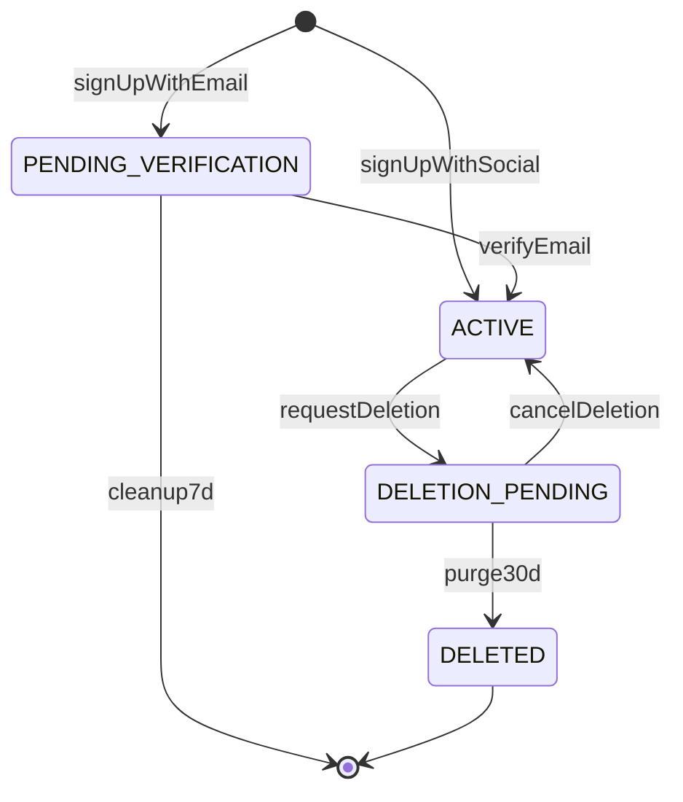
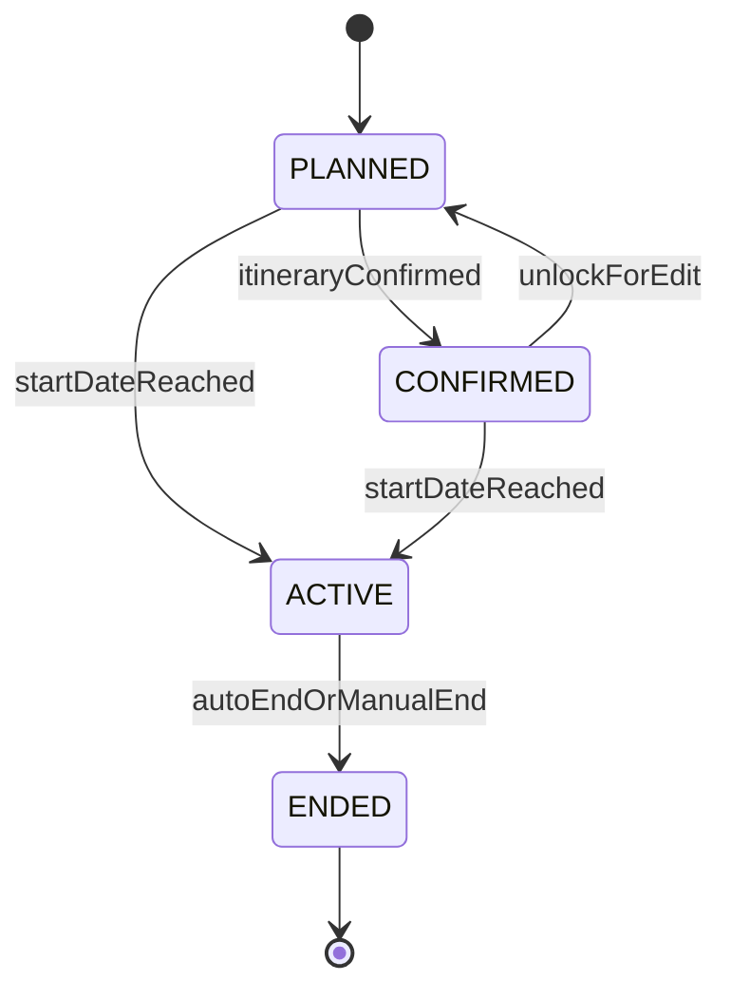
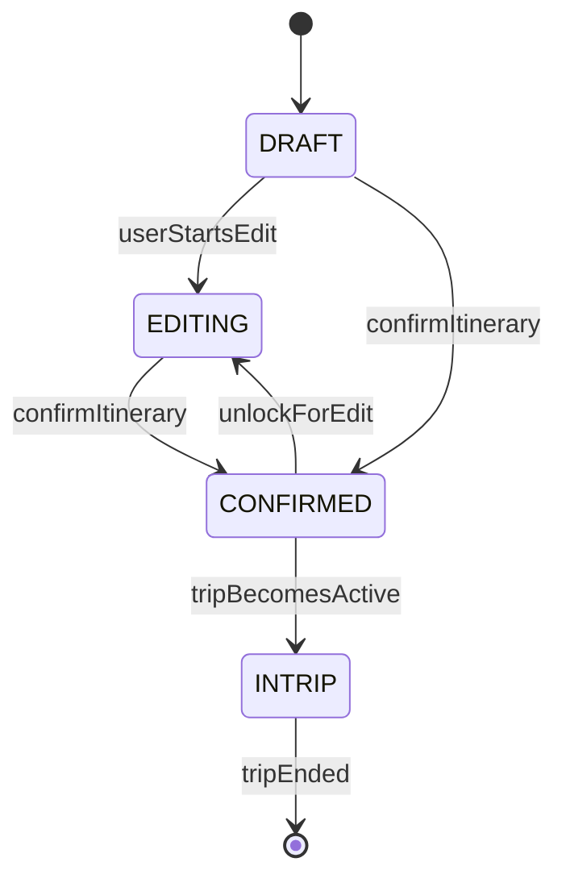
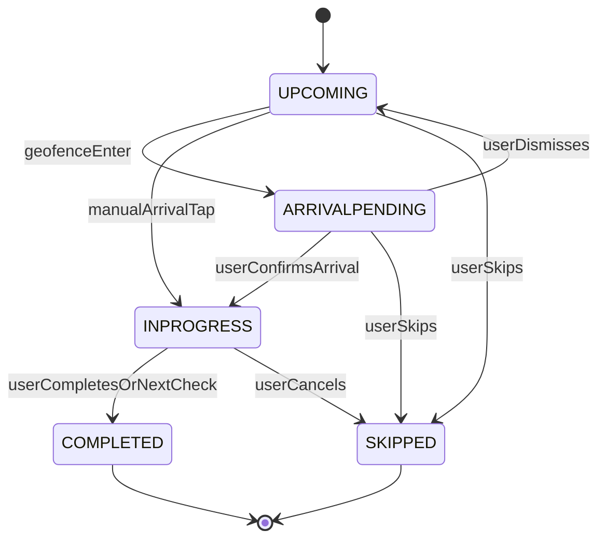

# 도메인 모델 (Domain Model)

> 출처: aidlc-docs/inception/application-design/components.md, aidlc-docs/construction/u1-foundation/functional-design/domain-entities.md, aidlc-docs/construction/u2-appshell/functional-design/domain-entities.md · aidlc-docs에서 2026-07-05 추출 · 이후 본 문서가 정본이다.

## 1. 이 문서의 위상과 읽는 법

TripPilot의 도메인 모델을 **크로스커팅(횡단) 관점**에서 정리한 정본이다. 여기서 다루는 핵심 개념은 계정/사용자, POI(장소), 숙소·거점, 여행, 필수 방문지, 일정의 4계층(plan/current/actual/changelog), 방문이며, 이 개념들을 관통하는 3종의 핵심 상태 머신(여행·일정·방문)을 그대로 옮긴다.

- **이 문서**는 개념의 의미·관계·상태 전이를 정의한다. 개별 엔티티의 전체 필드 목록·불변식(INV) 상세는 각 유닛의 Functional Design(units/uN-*.md)이 정본이며, 본 문서 §12의 안내 표로 어느 유닛에서 상세를 보는지 연결한다.
- 추적성 ID(M/C 모듈, ADR, D/Δ/N/G 결정, US 스토리, BR 규칙)는 팀 공용 어휘이므로 원문 그대로 보존한다.
- 관련 문서: [개발 순서](./units.md) · [아키텍처](./architecture.md) · [핵심 결정/ADR](./decisions.md) · [주요 흐름](./flows.md) · [NFR 기준](./nfr.md) · [용어집](./glossary.md)

**소유 규약(공통)** — 각 개념은 단일 모듈이 소유한다. 모듈러 모놀리스 경계(D04)상 각 모듈은 자기 소유 테이블에만 쓰고, 타 모듈 데이터는 공개 퍼사드(동기) 또는 도메인 이벤트(비동기)로만 접근한다. 상태 머신은 소유 컴포넌트가 전이 규칙을 강제하며, 타 모듈은 이벤트로만 관찰한다.

---

## 2. 도메인 개념 지도 (한눈에)

| 도메인 개념 | 핵심 엔티티(대표) | 소유 모듈 | 상세 유닛 |
|---|---|---|---|
| 계정·인증·동의 | Account, SocialIdentity, EmailVerification, TermsVersion, ConsentRecord, 위치 3층 동의, RefreshSession, DeletionSchedule | M1 Auth | [U1](./units/u1-foundation.md) |
| 사용자 프로필·취향 | Profile, PreferenceSet(취향 7축) | M2 User Profile | [U1](./units/u1-foundation.md) |
| 금칙어 검증 | BannedWordDictionary | C3 Content Moderation | [U1](./units/u1-foundation.md) |
| 앱 구성·부트스트랩·홈 조립 | AppConfig, BootstrapInfo, HomeDashboardModel, TabNavigationState | server/app · M1 공급 | [U2](./units/u2-appshell.md) |
| POI(장소 데이터) | Poi, PoiSnapshot, TrendingAggregate, StayTimeTable | M7 Place Data | [U3](./units/u3-place-stay.md) |
| 숙소 탐색·위시리스트 | WishlistItem, StayStaticCache | M3 Accommodation Search | [U3](./units/u3-place-stay.md) |
| 등록 숙소·거점 | SavedStay, StayIdentity, BaseAssignment | M4 Saved Accommodation | [U3](./units/u3-place-stay.md) |
| 제휴 링크 | OutboundClick, OtaPartner | M5 Affiliate Link | [U3](./units/u3-place-stay.md) |
| 여행·필수 방문지 | Trip, MustVisit | M6 Trip Creation | [U4](./units/u4-trip.md) |
| 일정(plan/current) | Itinerary, PlanSnapshot, CurrentItinerary, DaySchedule/Slot, GenerationSession | M8 Itinerary Generation | [U5](./units/u5-itinerary.md) |
| 재계획·트리거·날씨 | ReplanSession, TriggerEvent, ForecastCache | M10, M9, M11 | [U6](./units/u6-execution.md) |
| 여행 중 실행·방문 상태 | ExecutionState, VisitState, ArrivalPromptLog | M18 Trip Execution | [U6](./units/u6-execution.md) |
| 실제 기록·변경 이력(actual/changelog) | VisitRecord, Photo, Memo, ChangeLogEntry, GpsTrack | M12 Travel Archive | [U7](./units/u7-archive.md) |
| 회고·요약·분석 | Reflection, TripSummary, StyleAnalysis, ShareCardSpec | M13 AI Reflection | [U7](./units/u7-archive.md) |
| 알림 | NotificationSchedule, InboxNotice, NotificationToggle | M14 Notification | [U8](./units/u8-notification.md) |
| 커뮤니티 `[후속]` | PublishedItinerary, Like, Comment, Report | M15 Community | (1차 스키마만 선반영) |
| 어시스턴트 `[후속]` | ConversationThread, Message | M16 Assistant | (1차 C1 선반영) |
| 공동편집 `[후속]` | Participant, ItemLock, ItemVersion | M17 Collaborative Editing | (1차 스키마 여지) |

---

## 3. 계정과 사용자 (Account · Profile · Preference)

### 3.1 계정(Account) — M1

모든 계정은 '여행자' 단일 사용자 유형이다 [US-E1-01]. 계정 식별의 기준은 이메일이 아니라 **소셜 제공자 고유 ID(sub)** 또는 이메일 계정이며, 계정 생명주기·인증 수단·연령 확인의 정본이다.

| 속성 | 제약 | 의미·근거 |
|---|---|---|
| accountId | 필수·유니크·불변 | 시스템 전역 식별자. 외부 노출 식별자는 추측 불가 형식(순차 노출 금지 — SECURITY-08 IDOR 방어 보조) |
| email | 선택·활성 계정 간 유니크 | 이메일 가입=필수, 소셜=제공 시 저장. NULL=소셜 제공자 미제공. Apple 비공개 릴레이는 릴레이 주소 그대로 저장 [G20] |
| passwordHash | 선택 | 이메일 계정만 보유. 적응형 해시 결과만 저장(평문·가역 암호화 금지) [G22] |
| ageConfirmation | 필수 {method: BIRTH_DATE\|SELF_DECLARED, birthDate?, confirmedAt} | 생년월일 또는 '만 14세 이상' 자기확인. 가입 경로 무관 필수 [N1/D33, US-E1-16] |
| status | 필수 | `PENDING_VERIFICATION → ACTIVE → DELETION_PENDING → DELETED` (§3.2) [D18, G22] |
| sanctionStatus | 필수·기본 NONE | 후속 제재 예약 필드(경고→커뮤니티 정지→전체 정지). 1차 NONE 고정 [G179] |
| verifiedAt | 선택 | 이메일 인증 완료 시각. 소셜=생성 시각. NULL=미인증 |
| deletedAt | 선택 | 소프트 삭제 마킹(DELETION_PENDING 진입 시각). NULL=삭제 아님 [D18] |

**핵심 불변식** — ① 상태는 §3.2 전이로만 변경(임의 점프 불가). ② 연령 게이트: ageConfirmation 없이 또는 만 14세 미만으로 계정 행이 존재할 수 없다(차단은 생성 **이전**). ③ 이메일 유일성: `{PENDING_VERIFICATION, ACTIVE, DELETION_PENDING}` 집합 안에서만 email 유일 — DELETED/정리된 이메일은 재사용 가능 [C4]. ④ 인증 수단 존재: ACTIVE 계정은 passwordHash 또는 SocialIdentity 중 최소 하나 보유. ⑤ 삭제 마킹 정합: `status=DELETION_PENDING ⇔ deletedAt≠NULL ∧ DeletionSchedule 존재`.

**연결 엔티티**

| 엔티티 | 관계 | 요지 |
|---|---|---|
| SocialIdentity | Account 1—N | provider {GOOGLE, APPLE, KAKAO, NAVER} + providerSub. `(provider, providerSub)` 전역 유니크 — 동일 소셜 신원이 두 계정에 매핑 불가. 1차는 수동 계정 연결 미제공(실제 N>1 미발생, CS 처리) [G20] |
| EmailVerification | Account 1—N | 인증 링크 발급/소비 이력. tokenHash만 저장(원문 미저장). expiresAt=발급+24h, 재발송 분당 1회·일 5회, 재발송 시 구 토큰 무효화 [G22] |
| RefreshSession | Account 1—N | 기기별 회전 체인(§3.6) |
| DeletionSchedule | Account 1—0..1 | 삭제 30일 유예(§3.6) |

### 3.2 계정 상태 머신 (소유: M1)

> components.md §3.4의 `UNVERIFIED`는 U1의 `PENDING_VERIFICATION`과 동일 상태(FD-U1-01).

| 전이 | 트리거 | 가드 조건 | 효과 |
|---|---|---|---|
| (없음) → PENDING_VERIFICATION | `signUpWithEmail` | 연령 확인 통과(N1)·이메일 활성 중복 없음·유예 중 동일 식별자 아님(C4) | EmailVerification 발급·메일 발송, 온보딩 진행 차단 |
| (없음) → ACTIVE | `signUpWithSocial`(신규) | 연령 확인 통과·동일 이메일 충돌 처리 통과·유예 중 재가입 아님(C4) | 소셜은 제공자가 신원 보증 → 인증 단계 생략, 즉시 활성 |
| PENDING_VERIFICATION → ACTIVE | `verifyEmail`(링크 토큰 소비) | 토큰 유효(24h·미소비·최신 발급분) | verifiedAt 기록·자동 로그인·약관 동의 단계로 진행 |
| PENDING_VERIFICATION → (정리 파기) | 미인증 정리 배치(일 1회) | 생성 후 7일 경과·미인증 유지 | 계정·인증 토큰 물리 정리, 동일 이메일 재가입 즉시 허용 |
| ACTIVE → DELETION_PENDING | `requestAccountDeletion` | 재확인 완료·연쇄 삭제 범위 사전 고지 | deletedAt 기록·**즉시 비노출**·DeletionSchedule(purgeAt=+30일)·전 세션 무효화·GPS 발자취 즉시 파기 [D18, D34] |
| DELETION_PENDING → ACTIVE | 유예 중 로그인 → `cancelAccountDeletion` | purgeAt 도래 전 | 노출 복원(GPS 발자취는 기파기로 미복원) |
| DELETION_PENDING → DELETED | 유예 만료 배치(일 1회) | purgeAt 경과 | 연쇄 삭제 오케스트레이션. 법정 보존(위치 법정 로그·동의 증적)만 분리 보관 [D18, D34, N2] |
| DELETED (최종) | — | 재개 없음 | 동일 식별자 재가입은 신규 계정으로 허용(유예 경과로 C4 해제) |

### 3.3 동의·약관 모델 — M1

법정 동의 증적은 **행 단위 불변·추가 전용(append-only)** 이 핵심이다. 현재 동의 상태는 최신 증적 행의 폴드(fold)로 유도되며 별도 가변 필드는 파생 캐시일 뿐이다.

| 엔티티 | 요지 |
|---|---|
| TermsVersion | 약관 6종 termsType {TERMS_OF_SERVICE, PRIVACY_POLICY, LOCATION_TERMS, MARKETING, GPS_RECORDING, PERSONALIZATION}. 필수 3종=이용약관·개인정보·**위치기반서비스 이용약관(분리 항목 N2)**. `reconsentRequired` 플래그: true=중대 변경(스플래시 재동의 강제), false=경미(인앱 공지). 시행 버전은 불변, 변경은 항상 새 버전 발행 [N3] |
| ConsentRecord | append-only 증적. 속성: termsType·termsVersion·action{GRANT, REVOKE}·occurredAt·channel{ONBOARDING, RECONSENT, SETTINGS}. 철회도 새 행 추가(과거 행 수정 없음). 온보딩 완료 계정은 필수 3종 각각 현행 계보의 GRANT 증적 보유. 계정 DELETED 시에도 법정 보존 대상으로 분리 보관 [N2, N3, SECURITY-14] |
| MarketingConsent | 증적의 파생 현재 상태 뷰(optIn). 1차는 **발송 없이 수집·철회만** [N8] |

### 3.4 위치 동의 3층 모델 (G182) — M1

위치 관련 능력은 3개 독립 층의 조합으로 결정된다. 판정 함수 `effectiveCapabilities(L1, L2, L3)`는 8조합 전부를 정의하는 총함수이며, 클라이언트 shared/location 런타임 판정기와 서버 M1이 동일 명세를 공유한다.

| 층 | 이름 | 정본 위치 | 의미 |
|---|---|---|---|
| L1 | OS 위치 권한 | 클라이언트(단말) — 서버는 미러만 보관 | OS 다이얼로그 허용 여부 |
| L2 | 앱 내 법정 동의 | 서버(ConsentRecord LOCATION_TERMS) | 위치기반서비스 이용약관 **필수** 동의(온보딩 게이트) |
| L3 | GPS 기록 옵트인 | 서버(ConsentRecord GPS_RECORDING) | GPS 발자취 보관 **선택** 동의 |

**조합별 기능 동작 매트릭스** (정본, G182)

| # | L1 | L2 | L3 | 단말 로컬 위치 | 서버 위치 서비스 | GPS 발자취 보존 | 대표 상황·폴백 |
|---|---|---|---|---|---|---|---|
| 1 | ✕ | ✕ | ✕ | 불가 | 불가 | 불가 | 온보딩 전/재동의 대기+권한 거부. 등록 숙소·여행지 중심 좌표 폴백 |
| 2 | ✕ | ✕ | ○ | 불가 | 불가 | 불가 | 과도 상태. L3은 L2 없이 무효 — 수집 0 |
| 3 | ✕ | ○ | ✕ | 불가 | 불가 | 불가 | 법정 동의 있으나 OS 거부. 수동 입력·등록 숙소 기준 폴백 |
| 4 | ✕ | ○ | ○ | 불가 | 불가 | 불가 | 옵트인 유지되나 실입력 0. OS 허용 시 즉시 8행 동작 |
| 5 | ○ | ✕ | ✕ | 가능 | **금지** | 금지 | 위치는 단말 내 편의(현위치 표시)까지만, 서버 전송·처리 금지 |
| 6 | ○ | ✕ | ○ | 가능 | **금지** | 금지 | 5와 동일 — L3 단독 무효 |
| 7 | ○ | ○ | ✕ | 가능 | 가능 | **불가** | 표준 상태(옵트인 안 함). 내 주변·도착 프롬프트 동작, 발자취 미수집 |
| 8 | ○ | ○ | ○ | 가능 | 가능 | 가능 | 전체 활성 — GPS 발자취 수집·보존 |

핵심 불변식 — 서버 전송 게이트 `serverLocationService = L1 ∧ L2`(L2 없는 서버 전송 불가), 보존 게이트 `gpsTrackRetention = L1 ∧ L2 ∧ L3`, 단조성(층 추가로 기존 능력 축소 없음), 철회 즉시성(L3 REVOKE 시 수집 중단+기보존 발자취 즉시 파기, 단 법정 로그는 보존), 온보딩 독립(L1·L3의 어떤 값도 온보딩 완료를 막지 않음 — L2만 필수 게이트).

**LocationLegalLog(위치정보 수집·이용·제공 사실 확인자료)** — M1이 동의 증적과 **별도의 법정 로그 저장소**로 소유한다. eventType {CONSENT_GRANTED, CONSENT_REVOKED, COLLECTION, USE, PROVISION, PURGE}, 원시 좌표 미포함. **애플리케이션 역할은 갱신·삭제 권한 없음(추가만)** — DB 레벨 권한 분리로 강제, 최소 6개월 보존(계정 삭제·GPS 파기와 독립) [N2, SECURITY-14].

### 3.5 프로필과 취향 — M2

Profile은 닉네임(자동 생성 기본값 '형용사+여행명사+2자리 숫자', 항상 값 존재, 2~20자·금칙어·유니크 3검증)과 온보딩 완료 판정을 소유한다. **온보딩 완료 = 약관 동의 + 닉네임 통과**이며 취향 설정 여부와 무관하다 [G24/G157].

취향은 7축이며 **축별 NULL=미설정**이다. 핵심 원칙: `미설정(NULL) ≠ 중립 기본값`. 중립 기본값은 저장하지 않고 조회 시점에 파생 주입되며 `isNeutralDefault=true`로 표시된다 — 직렬화 왕복에서도 미설정과 명시 선택(예: 이동=대중교통을 직접 고름)이 항상 구분되어야 한다 [US-E1-14, INV-PR2].

| 축 | 값 도메인 | 선택 | 미설정 의미 | 중립 기본값(파생·저장 안 함) |
|---|---|---|---|---|
| 1 스타일 | {휴양, 관광, 액티비티, 미식, 쇼핑, 자연, 문화예술} | 복수 | 스타일 축 무가중 | 무가중치 |
| 2 예산 | {저가, 중간, 고급, 럭셔리} 또는 직접 총액(원값+구간 동시 저장) | 4구간 또는 직접 | 가격 필터 미적용·전체 가격대 노출 | 필터 미적용 |
| 3 동행 | {혼자, 커플, 친구, 가족(아동), 부모님} + 반려동물 분리 불리언 | 기본 단일+petFlag | 동행 축 무가중 | 무가중치·petFlag 기본 false |
| 4 활동 | {자연, 역사문화, 테마파크, 맛집투어, 카페, 전시, 야경, 쇼핑, 스포츠} | 복수 | 활동 축 무가중 | 무가중치 |
| 5 이동 | {도보, 대중교통, 렌터카, 택시, 자전거} | 복수 | 동선 기본 수단 미지정 | **대중교통** + 안전계수 보수 추정(내부 계산 한정, 화면은 거리만) |
| 6 음식 | {한식, 양식, 일식, 중식, 아시안, 기타} | 복수 | 음식 축 무가중 | 무가중치 |
| 7 페이스 | {느긋(1~2곳), 균형(3~4곳), 빡빡(5곳+)} | 단일 | 밀도 지정 없음 | '균형있게' 상당 |

핵심 불변식 — 예산 쌍 정합 `budgetRawAmount≠NULL ⇒ budgetTier=매핑함수(budgetRawAmount)`(1박 가격대 환산은 저장 안 함, 여행 생성 시점 파생 — U4 소관), 동행 구조(companionType 단일·petFlag 독립, petFlag만 true+companionType=NULL 허용), **무실패 보장**(7축 전부 NULL이어도 getPreferences는 모든 축이 값 또는 중립 기본값으로 채워진 완전 응답 반환 — 미설정만으로 일정 생성이 실패하지 않음). 개인화 입력 우선순위: 사용자 직접 설정 > M13 자동 스타일 분석.

### 3.6 세션과 삭제 유예 — M1

| 엔티티 | 요지 |
|---|---|
| RefreshSession | 기기별 세션의 정본. 리프레시 90일 회전, tokenHash만 저장(원문은 단말 보안 저장소). deviceId+chainId로 다기기 동시 로그인 허용. 액세스 토큰(1시간)은 자기 서명 검증형 값 객체이며 엔티티가 아님. **재사용 감지 = 탈취 신호**: 이미 회전 소비된 토큰 재사용 시 해당 체인 전체 즉시 무효화+보안 알림. 비밀번호 재설정은 전 기기 무효화 [D36] |
| DeletionSchedule | 계정당 최대 1개. purgeAt=요청+30일, cascadeSummary(연쇄 삭제 대상 스냅샷: 숙소·여행·일정·기록·회고·사진, 후속 커뮤니티 익명화, 법정 보존 분리 항목 명시). 만료 후 철회 불가(`ResourceNotFound`) [D18, D34] |

### 3.7 금칙어 사전 (C3)

BannedWordDictionary는 버전 관리 사전(active=true 정확히 1개)으로, 닉네임(M2)·여행 제목(M6)·후속 UGC에 **동일 사전·동일 기준**을 일관 적용한다. **fail-closed**: 활성 사전을 로드할 수 없으면 검증 요청은 통과 처리되지 않고 저장 보류+재시도 안내(금칙어 우회 게시 방지 우선). 매칭 원문은 검증 응답에 미포함(우회 학습 방지) [G23, N6].

---

## 4. 앱 셸·부트스트랩·홈 조립 데이터 (U2)

U2(앱 셸·홈·내비게이션)는 **거의 데이터를 소유하지 않는다** — 대부분 클라이언트 세션 상태이거나 타 모듈 데이터의 읽기 전용 집계다. 유일한 서버 영속 엔티티는 AppConfig 1종이다. 상세는 [U2](./units/u2-appshell.md).

| 데이터 | 소유/성격 | 요지 |
|---|---|---|
| AppConfig | U2 서버 영속(유일) | 강제 업데이트 게이트·스토어 이동의 서버 정본. `minSupportedVersion`(SemVer, 전순서 비교) — 클라이언트 `appVersion < minSupportedVersion`이면 강제 업데이트. 오구성 시 전 사용자 차단 리스크 → 변경 이력 보존 [N4/C6] |
| BootstrapInfo | U1 M1 공급·U2 소비(DTO) | 스플래시 분기 판정의 단일 입력. sessionState {VALID, EXPIRED, NONE}·onboardingComplete·reconsentRequired·minSupportedVersion·forceUpdate. **우선순위 forceUpdate > reconsentRequired > sessionState/onboardingComplete**로 고정, 어떤 조합에도 목적지 정확히 1개. 부작용 없는 멱등 조회(타임아웃 후 재검증 수렴) [G5, N3, N4] |
| HomeDashboardModel | 읽기 전용 집계 BFF | 홈 카드 슬롯 스키마. **부분 응답**(일부 슬롯 실패해도 가용 카드만 반환 — 침묵 실패 금지). 슬롯: activeTripCard(U6)·upcomingTripCard(U4)·quickAction(자체)·trendingPlaces(U3)·memoryCard(U7)·preferencePromptCard(U1)·communityRecordCard(U10 후속·출시 전 미노출)·topBar(알림 배지). 활성 여행 카드는 최대 1개(D21) [US-E2-02] |
| TabNavigationState | 클라이언트 세션 상태 | 5탭 {HOME, EXPLORE, ITINERARY, RECORD, MY} 셸의 탭별 스택·스크롤. **세션 메모리 한정**(앱 재시작 시 초기화). 탭 격리(한 탭 변경이 타 탭 무영향), 재탭 시 해당 탭만 루트 복귀 [G6] |
| TrendingPlace | 참조(소유 M7/U3) | 홈 인기 장소 슬롯의 읽기 전용 표시 계약. canonical POI ID 참조, 최근 7일 저장+방문 가중합 일 1회 배치 결과(집계 정본 U3) [G2] |

---

## 5. POI (장소 데이터) — M7

관광지·식당·카페 등 POI를 외부 소스에서 수집·정규화해 **단일 표준 스키마**(ADR-0009)로 전 모듈에 공급한다. canonical POI ID와 하이브리드 캐싱(D13)의 정본 소유자다.

### 5.1 canonical POI ID

내부 canonical POI ID를 정본으로, 소스별 place_id를 **N:1로 매핑**한다. 좌표 근접(50m)+명칭 유사도로 중복 소스를 하나의 canonical ID에 통합하고, 한국어명을 정본으로 영문 alias를 함께 보관한다 [G133/G148]. LLM·홈 인기 장소·필수 방문지 등 시스템 전역이 이 canonical ID를 참조한다.

### 5.2 하이브리드 캐싱 (D13 · ADR-0017)

POI 데이터는 성격에 따라 두 갈래로 저장한다.

| 종류 | 대상 | 저장 정책 |
|---|---|---|
| 탐색·추천 풀 | 검색 결과·후보 풀 | 실시간 호출 + **약관 허용 TTL 캐시**(영구 캐싱 금지 약관 준수). TTL 만료+재조회 실패 시 stale 표기(허위 최신성 금지) |
| 사용자 확정 데이터 | 필수 방문지·방문 체크·등록 숙소 | 확정 시점 **스냅샷 영구 저장**(PoiSnapshot, 불변). 출처 표기(sourceAttribution) 포함 |

이 이원 구조가 뒤의 여행·일정·기록에서 반복되는 "확정 시점 사본" 패턴의 근거다.

### 5.3 closed-set 후보 풀 (G115)

여행 컨텍스트(권역·시간창·취향 축) 기준으로 후보 집합을 구성하고, **LLM은 이 목록의 canonical ID에서만 선택**한다. 따라서 그라운딩 실패(존재하지 않는 장소 생성)가 구조적으로 불가능하다. 이 후보 풀은 M8(일정 생성)·M10(재계획)의 소싱 기반이다.

### 5.4 핵심 엔티티

| 엔티티 | 핵심 속성 | 상태 |
|---|---|---|
| Poi | canonicalPoiId, nameKo(정본)+aliasEn, coord, category(표준), openingHours?, stayRange{min,rec,max}, sourceRefs[{source, placeId}] | `dataStatus: ACTIVE / UNVERIFIED(영업시간 미확인) / LOST(확인 불가) / CLOSED` |
| PoiSnapshot | 사용자 확정 시점 사본(이름·좌표·카테고리·영업시간), snapshotAt, sourceAttribution | 불변 |
| TrendingAggregate | region, poiId, weightedScore(7일 저장+방문), computedAt | 일 1회 갱신 |
| StayTimeTable | category, min/rec/max 기본값(카테고리 20~30종 정적 테이블) | 운영 정의·remote config 보정 |

영업시간·좌표 누락은 오류가 아니라 `UNVERIFIED` 상태로 명시 전파해 소비자(M8·M9)가 분리 처리한다. 데이터 품질 게이트: 좌표 확보율 95%·영업시간 채움률 70%(출시 게이트) [G192].

---

## 6. 숙소와 거점 (M3 · M4 · M5)

### 6.1 저장(위시리스트) vs 등록(SavedStay)

- **저장(M3 WishlistItem)** — 탐색 중 관심 숙소를 계정에 담아두는 위시리스트. 가격 변동 가능 고지, 외부 소스 소실 시 stale 표시.
- **등록(M4 SavedStay)** — 실제 예약했거나 앱에서 저장한 숙소를 '등록'해 관리하는 **계정 레벨 풀**. 등록 숙소 = AI 일정 생성의 출발점(ADR-0002·0004).

두 목록은 통합 목록으로 제공하되 출처 라벨('외부 OTA 예약 등록'/'앱 내 저장')로 구분한다(G103). D09(OTA 계약 확정 전 MVP)에 따라 앱은 가격·재고·리뷰를 보유하지 않고 딥링크로 외부 위임한다.

### 6.2 등록 3경로와 거점 연결

등록 3경로: (a) 지도/장소 검색 자동 채움(M7), (b) OTA URL 붙여넣기 파싱(URL 패턴만·페이지 fetch 없음·지원 도메인 화이트리스트 G31), (c) 지도 핀 직접 지정.

**계정 레벨 풀 + 여행 거점 연결**이 핵심 구조다. 여행 없이도 등록 가능하며, 여행과의 거점 연결(BaseAssignment)은 별도 조인이다. **날짜 비중첩 검증은 같은 여행 내 거점끼리만**(D15) 수행한다. 겹침·공백 구간은 스마트 기본 거점(공백일=직전 숙소, 겹침=체크인 우선)으로 비차단 채움하고 사후 수정을 안내한다.

### 6.3 숙소 식별 통합 (StayIdentity)

POI와 동형으로, 내부 canonical 숙소 ID + 소스별 외부 ID를 **N:1 매핑**하고 좌표+이름 유사도로 자동 매칭한다(운영자 보정 여지) [D17]. 등록 시점 스냅샷을 영구 저장하며 '사용자 입력 데이터'로 취급한다(D13).

### 6.4 핵심 엔티티

| 엔티티 | 소유 | 핵심 속성 |
|---|---|---|
| WishlistItem | M3 | accountId, stayRef, memo, savedAt, snapshotAtSave / staleFlag |
| StayStaticCache | M3 | stayRef, name, coord, type, amenities[], priceBand, photos[], checkInOut / fetchedAt+TTL |
| SavedStay | M4 | accountId, stayIdentityRef, placeSnapshot(등록 시점 동결), checkIn, checkOut, party, otaName?, reservationNo?, amount? / coordConfirmed |
| StayIdentity | M4 | canonicalStayId, externalIds[{source, externalId}](N:1), matchConfidence / 운영자 보정 플래그 |
| BaseAssignment | M4 | savedStayId, tripId, dateRange, isSmartDefault / 거점 활성 여부 |
| OutboundClick | M5 | accountId, stayRef, otaPartner, clickedAt / handoffShownAt?(복귀 카드 1회 노출) |
| OtaPartner | M5 | partnerCode, deeplinkTemplate, policyNote / 활성 여부 |

M5(제휴 링크)는 OTA 숙소명 검색 딥링크 생성·제휴 고지·아웃바운드 클릭 기록을 소유한다. 앱은 실거래를 보유하지 않으며(ADR-0003·0012), 클릭 기록은 내부 집계 전용으로 사용자·LLM 컨텍스트에 비노출한다.

---

## 7. 여행과 필수 방문지 (M6)

### 7.1 여행(Trip)

여행 단위(목적지·기간·인원·예산·제목)의 생성·편집을 소유하고 **여행 상태 머신(§10.1)의 정본**을 보관한다.

| 속성 | 요지 |
|---|---|
| title | 선택 입력, 미입력 시 '{여행지} N박M일' 자동 생성, C3 금칙어 검증 [N6] |
| destination(+중심 좌표) | **국내 한정 강제** — 좌표 국내 범위 검증, 벗어나면 차단+사유 [G120] |
| startDate/endDate | 종료일≥시작일, **기존 여행과 날짜 구간 겹침 차단**(활성 여행 항상 최대 1개, D21·Δ3), 시작일 오늘 이후·최대 30일 |
| budgetTotal? | **여행 전체 총액(항공 제외)** 입력·저장, 1인·1일 값은 인원·일수 나눔 파생(D26·Δ2). v1 카테고리 분배 없음, 솔버 소프트 가중치 전달 |
| attributes{companion, transport, budgetTier} | 여행별 속성으로 저장, 계정 취향(M2)을 기본값 제안 [G134] |
| perDayWindows[] | 시간창 기본 09:00~21:00 + 여행별 조정(D29), 날짜별 이용 가능 시각 선택(첫날·마지막날 대응) |
| status / deletedAt? | `PLANNED → CONFIRMED → ACTIVE → ENDED`(§10.1) + 소프트 삭제 30일 유예(D18) |

### 7.2 필수 방문지(MustVisit)

여행에 반드시 포함할 장소. **두 유형**으로 나뉜다.

| 유형 | 의미 |
|---|---|
| `ANYTIME`(포함 고정형, 기본) | '아무 때나 꼭 가기' — 일정 어딘가에 반드시 배치 |
| `FIXED`(시각 고정형) | '시간 정해두기' — fixedDate/fixedStart 고정, 솔버 불가침 블록 |

한도는 일수 비례(하루 3곳×일수, 초과 차단 G40)다. 저장 POI를 필수 방문지로 투입할 때는 **사본 복제**로 투입되어 원본 삭제와 독립적으로 유지된다(poiSnapshotRef, G129). 좌표 미확인 시 핀 지정을 요구하고, 배치 불가 시 빈 일정 대신 불가 사유+3선택지(다른 날짜/고정 해제/인접 조정)를 제안한다.

---

## 8. 일정의 4계층: plan / current / actual / changelog (핵심)

TripPilot 일정 모델의 중심은 **계획·실제·변경이력을 물리적으로 분리**하는 4계층 구조다(ADR-0013, D14). 이 분리가 "계획한 여행"과 "실제 다녀온 여행"을 나란히 대조하고, 모든 변경을 감사 가능하게 만든다.

### 8.1 네 계층의 의미

| 계층 | 의미 | 가변성 | 소유 | 생성/전환 시점 |
|---|---|---|---|---|
| **plan** | 확정 시점에 동결된 계획 스냅샷 | **불변** | M8 | 일정 확정(CONFIRMED) 시 PlanSnapshot 동결 |
| **current** | 여행 중 편집·Plan-B가 반영되는 현재본 | 가변(변경은 changelog 경유) | M8 (변경 주체 M8·M10) | 여행 ACTIVE 진입 시 plan에서 분리 |
| **actual** | 실제로 방문한 기록(시각·체류·순서) | 추가·수정 | M12 | 방문 체크(M18 VisitChecked 이벤트) 시 적재 |
| **changelog** | 모든 변경의 통합 이력 | append 전용 | M12 | plan→current 변경·Plan-B·공동편집·어시스턴트 변경 발생 시 |

### 8.2 관계와 흐름

- **계획 vs 실제**: plan은 "무엇을 하려 했는가"(불변 기준), actual은 "무엇을 했는가"(실측). 회고·요약(M13)과 기록 타임라인(M12)이 plan/actual/changelog 3종을 라벨로 구분해 대조 뷰를 제공한다.
- **plan 동결 → current 분리**: 일정 확정 시 plan 스냅샷이 동결되고, 여행이 진행중(ACTIVE)이 되면 plan은 회고 대조용으로 **불변 유지**한 채 이후 모든 편집·Plan-B 결과는 **current에만** 반영된다. 즉 여행 중 변경은 계획 원본을 훼손하지 않는다.
- **changelog 통합 스키마(G132)**: 하나의 스키마로 Plan-B·공동편집·어시스턴트 변경을 모두 수용한다. 항목 단위 diff로 **행위자(actor)·출처 유형(sourceType: PlanB/수동/공동편집/어시스턴트)·사유(reason)·전/후 값(before/after)** 을 기록하며, 스냅샷은 diff 누적으로 재구성한다. POI는 내부 canonical ID로 참조한다.

### 8.3 일정 핵심 엔티티 (plan/current) — M8

| 엔티티 | 계층 | 핵심 속성 |
|---|---|---|
| Itinerary | — | tripId, mode(생성 방식), version / `status: DRAFT → EDITING → CONFIRMED → INTRIP`(§10.2) |
| PlanSnapshot | plan | 확정 시점 전체 일정 동결본(day·slot·시각·이유 포함) / 불변 |
| CurrentItinerary | current | 여행 중 가변 현재본(Plan-B·편집 반영 대상) / 변경은 changelog 경유 |
| DaySchedule / Slot | plan·current 공용 형태 | poiSnapshotRef, start, end, stayRange/fixedStay, sourceType(AI추천/사용자/필수방문지/숙소), locked, violations[], llmReason?, solverReason |
| GenerationSession | — | mode, progress(단계), partialDraft, cancelState — 취소 시 부분 일정 초안 보존+'이어서 생성' 지원 |

DaySchedule/Slot은 plan과 current가 공유하는 슬롯 형태다. `violations[]`는 편집 중 위반을 차단하지 않고 배지로 보존하며, `llmReason`(표시용 LLM 설명)과 `solverReason`(솔버 실제 제약 근거)을 병기하되 불일치 시 검증값을 우선한다. **사용자에게 보이는 모든 시각·순서는 솔버(C2)가 소유·검증한 값**이어야 한다(ADR-0008).

### 8.4 실제·변경 핵심 엔티티 (actual/changelog) — M12

| 엔티티 | 계층 | 핵심 속성 |
|---|---|---|
| VisitRecord | actual | tripId, slotRef?(즉석 방문은 null), poiSnapshotRef 또는 freeText, visitStatus(done/skipped), arrivedAt, departedAt(추정 플래그), actualStay, coord? / `syncState: LOCAL → PENDING → SYNCED / CONFLICT` · recordVersion |
| ChangeLogEntry | changelog | tripId, actor, sourceType, reason, beforeValue, afterValue, at, causeMessageRef?(후속) / append 전용 |
| Photo | actual 첨부 | visitId, storageKey, thumbnailKey / `uploadState: LOCAL → QUEUED → RETRYING(≤3) → FAILED / DONE` |
| Memo | actual 첨부 | visitId, text, editedAt |
| GpsTrack | actual | tripId, date, simplifiedPolyline, consentRef — GPS 옵트인(L3) 전제, 철회·탈퇴 시 즉시 파기 |

오프라인 입력(방문 체크·사진·메모·수동 체크인)은 로컬 큐에 보존('동기화 대기')했다가 복구 시 배치 동기화하며, 레코드 단위 버전 비교로 충돌 시 항목별 사용자 선택으로 해소한다(침묵 덮어쓰기 금지, G74). 단 **조회 오프라인 캐시는 제공하지 않는다**(D24·Δ6 — 입력/조회 구분).

---

## 9. 방문 (Visit) — M18 · M12

방문은 두 관점으로 나뉜다: 여행 중 실시간 **상태(VisitState, M18 소유)** 와 영속되는 **기록(VisitRecord, M12 소유·actual 계층)**.

핵심 원칙: **도착 확인·완료는 항상 사용자 탭이며 자동 기록이 없다**(D23, ADR-0010). 지오펜스 진입은 '도착하셨나요?' 프롬프트를 띄울 뿐이고, 위치 권한이 없거나 GPS 정확도가 낮아도 **수동 도착/체크인이 기본 수단**으로 항상 동작한다.

| 엔티티 | 소유 | 요지 |
|---|---|---|
| ExecutionState | M18 | tripId, currentDate, currentSlotRef, nextSlotRef / ACTIVE 하위 `NORMAL / REST{resumeAt?}`(휴식 모드, G54) |
| VisitState | M18 | slotRef, arrivedAt?, promptSuppressed / §10.3 방문 상태 |
| ArrivalPromptLog | M18 | slotRef, shownAt, outcome — 재프롬프트 억제 근거 |

**즉석 방문**: 계획에 없던 방문은 POI 검색 또는 자유 텍스트로 기록한다(자유 입력은 좌표·카테고리 없음 → 분석 시 '기타' 분류, G77). VisitRecord에서 slotRef가 null이면 즉석 방문이다.

---

## 10. 핵심 상태 머신 3종 (정본)

여행·일정·방문 3종은 시스템 전체 흐름을 결정하는 정본 상태 머신이다. 소유 컴포넌트가 전이 규칙을 강제하며 타 모듈은 이벤트로만 관찰한다. 세 머신은 PBT(속성 기반 테스트) 1급 대상이다(시드 로깅·수축 필수).

### 10.1 여행(Trip) 상태 머신 — 소유: M6 (ACTIVE/ENDED 전이 트리거는 M18)

| 전이 | 트리거 | 가드 조건 | 효과 |
|---|---|---|---|
| PLANNED → CONFIRMED | M8 `ItineraryConfirmed`(일정 확정) | 여행 시작 전·활성 일정 존재 | plan 스냅샷 동결(D14) 참조, M14 리마인드 스케줄 |
| CONFIRMED → PLANNED | M8 `unlockForEdit`(확정 해제, D20) | 여행 시작 전(여행 중 편집은 current에만 반영되므로 이 전이 불가) | 재확정 전 신규 커뮤니티 공개 불가(D20) |
| PLANNED/CONFIRMED → ACTIVE | 시작일 00:00 도달(M18 일자 경계 배치) | D21로 동시 활성 여행은 구조적으로 최대 1개(생성 시 날짜 겹침 차단)·일정 미확정이라도 날짜 구간 진입이면 ACTIVE | 홈 활성 카드·일정 탭이 M18 허브로 수렴, plan/current 분리 시작(D14) |
| ACTIVE → ENDED | (a) 종료일 다음날 00:00 자동 배치(M18 `autoEndTrips`) (b) 사용자 '여행 종료' 수동 버튼 | ACTIVE 상태·숙소 유무 무관 단일 규칙(D19, Δ4) | `TripEnded` 발행 → M13 회고 자동 생성, M14 완료 알림, M12 기록 귀속 마감 |
| ENDED (최종) | — | 재개 없음·종료 후 기록 편집은 허용, 회고 갱신은 수동 재생성만(C11) | — |

- 하위 상태(ACTIVE 내): `NORMAL` / `REST`(휴식 모드, G54) — 소유 M18.
- 직교 플래그: `deletedAt`(소프트 삭제 30일 유예, D18) — 상태와 독립으로 즉시 비노출.

### 10.2 일정(Itinerary) 상태 머신 — 소유: M8

| 전이 | 트리거 | 가드 조건 | 효과 |
|---|---|---|---|
| (없음) → DRAFT | `generateItinerary` 시작(3방식 공통) | 등록 숙소 존재 또는 숙소 나중 등록 온램프 | 생성 취소 시 부분 일정을 초안 보존 + '이어서 생성' 진입점(G161) |
| DRAFT → EDITING | 사용자 편집 진입(추가·삭제·재정렬·시간 조정) | — | 매 수정마다 클라이언트 경량 검증(D28) + 위반 배지 표시(차단 아님) |
| DRAFT/EDITING → CONFIRMED | 사용자 '일정 확정' | 서버 확정 검증(C2 `validate`) 통과·위반 잔존 시 'AI 자동 보정 / 그대로 저장' 선택 완료 | **plan 스냅샷 동결(D14)**·`ItineraryConfirmed` → M6 여행 CONFIRMED 전이, M14 리마인드 재계산 |
| CONFIRMED → EDITING | `unlockForEdit`(D20) | 여행 시작 전 | '편집 중' 표시·저장 후 재확정 필요·기존 공개본(D16 스냅샷) 유지, 재확정 전 신규 공개 불가 |
| CONFIRMED → INTRIP | 여행 ACTIVE 전이(M18) | — | 이후 모든 편집·Plan-B 결과는 **current에만** 반영(D14)·plan은 회고 대조용 불변 유지 |
| any → DRAFT(재생성) | 사용자 '다시 생성' | LOCK 슬롯·체류 고정값·수동 추가 POI는 고정 블록으로 보존(warm-start, G46/G136) | 여행당 활성 일정 1개, 이전 상태는 changelog로 추적 |

### 10.3 방문(Visit) 상태 머신 — 소유: M18 (기록 영속은 M12)

| 전이 | 트리거 | 가드 조건 | 효과 |
|---|---|---|---|
| UPCOMING → ARRIVALPENDING | 지오펜스 진입 감지(포그라운드) 또는 외부 지도앱 복귀 시 다음 예정지 근접(G66) | 위치 3층 동의 충족(G182)·GPS 정확도 충분(미달 시 이 전이 생략, 수동 경로만)·동일 방문지 재프롬프트 억제 | '도착하셨나요?' 프롬프트 노출 — **자동 기록 없음, 확정은 항상 사용자 탭**(D23) |
| ARRIVALPENDING → INPROGRESS | 사용자 '도착했어요' 탭 | — | `arrivedAt` 기록(기기 시각, 수정 가능) → M12 actual·`VisitChecked(start)` 발행 |
| UPCOMING → INPROGRESS | 사용자 수동 '도착' 탭 | 위치 동의·감지와 무관하게 항상 가능(ADR-0010·D23) | 동일 |
| ARRIVALPENDING → UPCOMING | 프롬프트 닫기/무시 | — | 해당 방문지 재프롬프트 억제 |
| INPROGRESS → COMPLETED | (a) 사용자 '방문 완료' 탭 (b) 다음 장소 도착 체크 | (b)의 경우 `departedAt`은 다음 장소 체크 시각으로 추정(D23) | 실제 체류 시간 산출 → M12 보관(plan 체류와 대조)·체류 초과 시 M9에 신호(`VisitChecked(complete)`) |
| any → SKIPPED | 사용자 '방문 안 함/스킵/취소' | — | M12에 스킵 기록·잔여 일정 영향 시 Plan-B 제안 연결 |
| COMPLETED/SKIPPED 이후 | 사용자 시각·상태 수정 | 기록 편집으로 처리(상태 재전이 아님, C11) | changelog 기록 |

---

## 11. 보조 상태 머신 목록

핵심 3종 외에 각 모듈이 소유하는 보조 상태 머신이다. 상세는 각 소유 유닛 문서를 참조한다.

| 상태 머신 | 소유 | 상태 개요 | 상세 유닛 |
|---|---|---|---|
| 계정(Account) | M1 | PENDING_VERIFICATION → ACTIVE → DELETION_PENDING(30일) → DELETED (§3.2) | [U1](./units/u1-foundation.md) |
| Plan-B 트리거 수명 | M9 | DETECTED → FIRED → SHOWN → ACCEPTED/DISMISSED → SUPPRESSED | [U6](./units/u6-execution.md) |
| 재계획 세션 | M10 | STARTED → CANDIDATES → COMPARING → CONFIRMED/CANCELLED | [U6](./units/u6-execution.md) |
| 사진 업로드 | M12 | LOCAL → QUEUED → RETRYING(≤3) → FAILED/DONE | [U7](./units/u7-archive.md) |
| 오프라인 기록 동기화 | M12 | LOCAL → PENDING → SYNCED/CONFLICT(사용자 선택 해소) | [U7](./units/u7-archive.md) |
| 알림 수명 | M14 | SCHEDULED → FIRED/SUPPRESSED → 알림함 적재 → 읽음 → 만료(90일) | [U8](./units/u8-notification.md) |
| 게시물(공개 콘텐츠) `[후속]` | M15 | PRIVATE → PUBLISHED → UNDER_REVIEW → RESTORED/REMOVED | (후속) |
| 항목 잠금 `[후속]` | M17 | FREE → LOCKED(TTL) → 하트비트 연장 → EXPIRED/FORCE_RELEASED | (후속) |

---

## 12. 엔티티 상세는 어느 유닛에서 보나

본 문서는 개념·관계·상태 전이의 정본이다. 각 엔티티의 **전체 필드·타입·불변식(INV)·비즈니스 규칙(BR)** 은 아래 유닛의 Functional Design이 정본이다. 개발 순서는 [개발 순서](./units.md) 참조.

| 도메인 개념 / 엔티티 | 소유 모듈 | 상세 문서 |
|---|---|---|
| Account, SocialIdentity, EmailVerification, RefreshSession, DeletionSchedule | M1 | [units/u1-foundation.md](./units/u1-foundation.md) |
| TermsVersion, ConsentRecord, MarketingConsent, 위치 3층 동의, LocationLegalLog | M1 | [units/u1-foundation.md](./units/u1-foundation.md) |
| Profile, PreferenceSet(취향 7축) | M2 | [units/u1-foundation.md](./units/u1-foundation.md) |
| BannedWordDictionary | C3 | [units/u1-foundation.md](./units/u1-foundation.md) |
| AppConfig, BootstrapInfo, HomeDashboardModel, TabNavigationState, TrendingPlace(참조) | server/app · M1 | [units/u2-appshell.md](./units/u2-appshell.md) |
| Poi, PoiSnapshot, TrendingAggregate, StayTimeTable | M7 | [units/u3-place-stay.md](./units/u3-place-stay.md) |
| WishlistItem, StayStaticCache | M3 | [units/u3-place-stay.md](./units/u3-place-stay.md) |
| SavedStay, StayIdentity, BaseAssignment | M4 | [units/u3-place-stay.md](./units/u3-place-stay.md) |
| OutboundClick, OtaPartner | M5 | [units/u3-place-stay.md](./units/u3-place-stay.md) |
| Trip, MustVisit | M6 | [units/u4-trip.md](./units/u4-trip.md) |
| Itinerary, PlanSnapshot, CurrentItinerary, DaySchedule/Slot, GenerationSession | M8 | [units/u5-itinerary.md](./units/u5-itinerary.md) |
| TriggerEvent, SuppressionState, ReplanSession, Alternative, UnplacedList, ForecastCache, WeatherAlert, ExecutionState, VisitState, ArrivalPromptLog | M9, M10, M11, M18 | [units/u6-execution.md](./units/u6-execution.md) |
| VisitRecord, Photo, Memo, ChangeLogEntry, GpsTrack, Reflection, TripSummary, StyleAnalysis, ShareCardSpec | M12, M13 | [units/u7-archive.md](./units/u7-archive.md) |
| NotificationSchedule, InboxNotice, NotificationToggle, DndSetting, PushToken | M14 | [units/u8-notification.md](./units/u8-notification.md) |
| PublishedItinerary, ConversationThread, Participant/ItemLock 등 `[후속]` | M15, M16, M17 | (1차 스키마·아키텍처 여지만 선반영) |
