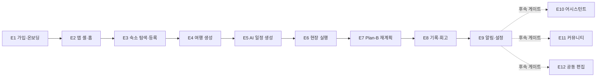

# TripPilot 에픽 (Epics)

이 문서는 TripPilot의 12개 에픽(E1~E12)을 팀이 한 번에 읽을 수 있도록 재구성한 정본이다. 각 에픽의 목적, 포함 범위, 스토리 수, 대응 유닛(U#), 대응 모듈(M#)을 정리하고, 에픽에 속한 유저스토리 목록과 그 추적 코드(관련 결정 D/Δ/N/G/C·ADR)를 함께 제공한다. 개별 스토리의 수용 기준 전문은 [유저스토리](./user-stories.md)에, 유닛 단위 개발 순서·의존은 [개발 순서](./units.md)에 있다.

- 전체 스토리: 128개 — 1차 출시 범위 102개(E1~E9) + 후속 26개(E10~E12).
- 에픽 순서는 사용자 여정 순이다. 1차 9개 에픽이 "가입 → 앱 진입 → 숙소 → 여행 생성 → 일정 생성 → 현장 실행 → Plan-B → 기록·회고 → 알림·설정"으로 이어지고, 후속 3개 에픽(어시스턴트·커뮤니티·공동편집)은 각자의 출시 게이트를 거쳐 붙는다.
- 제품 개요는 [제품 개요](./overview.md), 페르소나는 [페르소나](./personas.md), 여정·시나리오는 [시나리오](./scenarios.md), 범위 경계는 [범위](./scope.md)를 참조한다.

## 태그 범례

| 태그 | 의미 |
|---|---|
| `[1차]` | 1차 출시 범위 (핵심 여정, D03) |
| `[후속: 어시스턴트]` | AI 어시스턴트 출시 게이트와 함께 (E10) |
| `[후속: 커뮤니티]` | 커뮤니티 출시 게이트와 함께 — 모더레이션 4종 인프라 선결 (E11) |
| `[후속: 공동편집]` | 동행 공동 편집 출시 게이트와 함께 — ADR-0016 (E12) |

## 페르소나 약어

에픽·스토리 전반에서 아래 페르소나를 화자로 참조한다. 상세는 [페르소나](./personas.md).

| 약어 | 페르소나 | 성향 |
|---|---|---|
| P1 | 지유 | 꼼꼼 계획형 |
| P2 | 민준 | 균형 실속형 |
| P3 | 하람 | 즉흥 유연형 |
| — | 운영자 | 커뮤니티 모더레이션 담당(E11-10) |

---

## 에픽 총괄표

| 에픽 | 이름 | 목적(한 줄) | 스토리 수 | 범위 | 원 PRD | 대응 유닛 | 대응 모듈 |
|---|---|---|---|---|---|---|---|
| E1 | 가입·온보딩 | 계정 생성·약관 동의·취향 7종으로 첫 가치까지 도달 | 18 (신규 3) | 1차 | 03 | U1 | M1, M2, C3 |
| E2 | 앱 셸·홈·내비게이션 | 스플래시 분기·홈·5탭·장소 우선 진입으로 앱 뼈대 구축 | 6 (신규 1) | 1차 | 01 | U2 | 클라이언트 셸 + 부트스트랩 API (홈 카드는 M7·M18 소비) |
| E3 | 숙소 탐색·저장·등록 | 숙소 탐색·저장·등록으로 일정 생성 거점 확보 | 11 | 1차 | 04 | U3 | M3, M4, M5, M7 |
| E4 | 여행 생성·거점·필수 방문지 | 여행·거점·필수 방문지로 일정 생성 입력 준비 | 11 (신규 1) | 1차 | 05 | U4 | M6 (거점=M4·POI=M7 재사용) |
| E5 | AI 일정 생성·확정 | LLM+솔버로 실행 가능한 일정 생성·확정 | 12 | 1차 | 06 | U5 | M8, C1, C2, M7 |
| E6 | 여행 중 현장 실행 | 확정 일정의 현장 실행(도착·방문·이동) | 3 | 1차 | 08 | U6 | M18 |
| E7 | Plan-B 재계획 | 현장 변수에 고정 제약 지키며 남은 일정 재구성 | 13 | 1차 | 07 | U6 | M9, M10, M11, C1, C2 |
| E8 | 여행 기록·회고 | plan/actual 대조·AI 회고·스타일 분석·공유 카드 | 14 | 1차 | 09 | U7 | M12, M13, C1 |
| E9 | 알림·마이페이지·설정 | 리마인드/Plan-B 알림·마이페이지·설정 | 14 (신규 2) | 1차 | 12 | U8 | M14, M2 |
| E10 | AI 어시스턴트 | 대화형 오케스트레이션(통역·중개, 확정은 솔버 소유) | 8 | 후속 | 02 | U9 | M16, C1 |
| E11 | 여행자 커뮤니티 | 공개 일정 둘러보기·게시·복제·좋아요·댓글·신고 | 10 (신규 1) | 후속 | 10 | U10 | M15 |
| E12 | 동행 공동 편집 | 동행 초대·항목 잠금 공동 편집·충돌 해소 | 8 | 후속 | 11 | U11 | M17 |

- 1차 스토리 합계 102개(E1~E9), 후속 26개(E10~E12), 총 128개.
- 유닛과 에픽은 1:1이 아니다 — **U6은 E6(실행 3개)과 E7(Plan-B 13개)을 함께 담는다**. 나머지 1차 에픽은 유닛과 1:1이다.
- "신규"는 원 PRD에 없던 요구사항(N1~N8·D35)에서 파생된 추가 스토리 수다.

### 1차 에픽 여정 순서

---

## 모듈 참조 (에픽의 공용 어휘)

에픽·스토리가 참조하는 모듈은 기능 모듈 18개(M1~M18)와 공통 컴포넌트 3개(C1~C3)다. 아래는 팀이 본 문서만으로 M#·C#를 해석할 수 있게 한 축약 정본이다(경계 근거: components.md).

| 모듈 | 이름 | 책임 | 소속 에픽 | 범위 |
|---|---|---|---|---|
| M1 | Auth | 가입·로그인·토큰·동의 증적·계정 생명주기 | E1 | 1차 |
| M2 | User Profile | 닉네임·취향 7종·중립 기본값·개인화 입력 공급 | E1, E9 | 1차 |
| M3 | Accommodation Search | 숙소 탐색·필터·상세·위시리스트 | E3 | 1차 |
| M4 | Saved Accommodation | 등록 숙소(계정 풀)·여행 거점 연결·숙소 ID 통합 | E3, E4 | 1차 |
| M5 | Affiliate Link | OTA 딥링크 생성·고지·아웃바운드 클릭 기록 | E3 | 1차 |
| M6 | Trip Creation | 여행 CRUD·예산·시간창·필수 방문지·여행 상태 머신 | E4 | 1차 |
| M7 | Place Data | POI 정본·canonical ID·하이브리드 캐싱·후보 풀 | E2~E8 횡단 | 1차 |
| M8 | Itinerary Generation | 일정 생성 오케스트레이션·편집 재검증·일정 상태 머신 | E5 | 1차 |
| M9 | Plan-B Detection | 자동 트리거 4종 감지·억제·민감도 | E7 | 1차 |
| M10 | Itinerary Recalculation | 재계획 세션·후보 생성·전/후 비교·확정 | E7 | 1차 |
| M11 | Weather & Context | 기상청 예보·특보 수집·격자 변환·캐시 | E7 | 1차 |
| M12 | Travel Archive | actual 기록·사진·changelog·오프라인 동기화 | E8 | 1차 |
| M13 | AI Reflection | 회고·전체 요약·스타일 분석·공유 카드 | E8 | 1차 |
| M14 | Notification | 서버 스케줄링 발송·FCM·알림함·토글·방해금지 | E9 | 1차 |
| M15 | Community | 공개 스냅샷·피드·좋아요·댓글·신고·차단 | E11 | 후속 |
| M16 | Assistant | 대화 오케스트레이션·모듈 호출 위임·가드레일 | E10 | 후속 |
| M17 | Collaborative Editing | 초대·권한·항목 잠금·충돌 해소·프레즌스 | E12 | 후속 |
| M18 | Trip Execution | 활성 허브·도착 확인·방문 상태 머신·여행 종료 전이 | E6, E2 | 1차 |
| C1 | LLM Gateway | 단일 벤더 서버 경유 호출·티어 라우팅·서버 재조회 주입·스키마 검증 | 공통 | 1차 |
| C2 | Solver Engine | OPTW/TOPTW 최적화·하드 제약 검증·이동시간 추정·결정론적 폴백 | 공통 | 1차 |
| C3 | Content Moderation | 금칙어 사전 검증(닉네임·여행 제목 1차, UGC 확장 여지) | 공통 | 1차 |

> **추적 코드 읽는 법**: 각 스토리 표의 "관련 결정"에 나오는 코드는 요구사항 정본(requirements.md)의 확정 결정이다 — `D01~D38`(확정 결정), `Δ1~Δ10`(PRD 대비 변경), `N1~N8`(신규 요구사항), `G###`(세부 게이트/규칙), `C##`(요구사항 확정 코드), `ADR-####`(아키텍처 결정). 관련 결정의 `C1~C13`은 요구사항 확정 코드이며, **위 모듈 표의 공통 컴포넌트 C1~C3(LLM Gateway/Solver/Moderation)와는 별개**의 코드 계열이다(명칭 충돌 주의).

---

## E1. 가입·온보딩 — [PRD 03 · 1차 · U1]

**목적**: 여행자가 계정을 만들고 약관에 동의하며 취향 7종을 (선택적으로) 설정해, 첫 가치(홈·맞춤 일정)까지 막힘없이 도달하게 한다. "가입 → 약관 동의 → (선택) 취향 설정 → 온보딩 완료"까지의 여정이 끝에서 끝까지 동작해야 한다.

**포함 범위**:
- 소셜 4종(Google·Apple·카카오·네이버)+이메일 가입/로그인, 이메일 인증 링크, 토큰 발급·회전, 브루트포스 방어.
- 최초 1회 필수 약관 동의(이용약관·개인정보 처리방침·위치기반서비스 약관 3종 분리 체크 + 마케팅 선택) 및 동의 증적·약관 버전·재동의 플래그.
- 연령 확인(만 14세), 위치 동의 3층 모델(OS 권한 × 법정 동의 × GPS 옵트인)과 위치정보 법정 로그.
- 닉네임 자동 생성·수정과 금칙어 검증(C3), 취향 7종(스타일·예산·동행·활동·이동·음식·페이스) 설정·중립 기본값, 온보딩 완료 판정(약관+닉네임).
- 위치 권한 just-in-time 원칙(온보딩에서는 OS 다이얼로그 미호출) — 실제 발화 지점은 E3('내 주변')·E6(여행 중).

**명시적 제외**: 소셜↔이메일 수동 계정 연결(1차 미제공, CS 처리·G20), 마케팅 알림 **발송**(동의 수집·철회만 1차·N8).

**스토리 수**: 18개 (신규 3 — US-E1-16/17/18).

| 스토리 | 제목 | 태그 | 관련 결정 |
|---|---|---|---|
| US-E1-01 | 소셜·이메일 회원가입 및 로그인 | 1차 | D22, G22 |
| US-E1-02 | 최초 1회 필수 약관 동의 | 1차 | N8 |
| US-E1-03 | 닉네임 자동 생성과 수정 | 1차 | G23 |
| US-E1-04 | 위치 권한 just-in-time 고지·요청 | 1차 | N2 |
| US-E1-05 | 여행 스타일 설정 | 1차 | — |
| US-E1-06 | 예산 수준 설정 (여행 전체 총액 기준) | 1차 | D26, Δ2, G26 |
| US-E1-07 | 동행 유형 설정 | 1차 | G19 |
| US-E1-08 | 선호 활동 설정 | 1차 | — |
| US-E1-09 | 이동 방식 설정 | 1차 | D25, Δ1 |
| US-E1-10 | 음식 취향 설정 | 1차 | — |
| US-E1-11 | 단계 건너뛰기·이전 이동·일괄 탈출구 | 1차 | G24, G157 |
| US-E1-12 | 설정에서 닉네임·취향 상시 수정 | 1차 | — |
| US-E1-13 | 취향 정보의 추천·생성 반영 | 1차 | D26 |
| US-E1-14 | 미설정 취향의 중립 기본값 동작 | 1차 | D25, Δ1 |
| US-E1-15 | 여행 페이스(일정 밀도) 설정 | 1차 | — |
| US-E1-16 | 만 14세 이상 연령 확인 | 1차 | N1, D33 |
| US-E1-17 | 위치기반서비스 약관 필수 동의와 GPS 기록 옵트인 | 1차 | N2, D34 |
| US-E1-18 | 약관 개정 시 재동의 | 1차 | N3 |

**대응 유닛**: U1 기반·계정·온보딩 — 모노레포 스캐폴드·전역 보안 설정을 함께 담는 1차 최선행 유닛.
**대응 모듈**: M1 Auth, M2 User Profile, C3 Content Moderation(금칙어) + server/app 전역 설정·common/core.

---

## E2. 앱 셸·홈·내비게이션 — [PRD 01 · 1차 · U2]

**목적**: 스플래시 분기·홈 대시보드·하단 5탭·탭바 노출 규칙·장소 우선 진입으로, 여행자가 앱 어디서든 자신의 여행 상태와 다음 행동에 한 번에 도달하게 한다. 이후 모든 유닛의 화면이 꽂힐 자리를 세운다.

**포함 범위**:
- 스플래시 분기: 세션 검증(3초 타임아웃·백그라운드 재검증) × 약관 재동의 필요(N3) × 최소 지원 버전(N4) → 로그인/재동의/강제 업데이트/온보딩 잔여/홈 5분기.
- 강제 업데이트 게이트: 서버 부트스트랩 API에 최소 버전 필드, 미달 시 전면 차단+스토어 이동.
- 하단 5탭(홈·탐색·일정·기록·마이) 공용 컴포넌트, 탭 상태 세션 보존·재탭 스크롤 탑, 알림·딥링크 탭 스택 푸시, 몰입 화면 탭바 숨김.
- 홈 대시보드 프레임: 여행 카드(D-day·진행률)·빠른 액션·인기 장소·추억 카드의 레이아웃과 빈 상태 — 데이터는 후행 유닛이 점진 공급(인기 장소=U3, 여행 카드=U4, 활성 일정 카드=U6, 추억=U7, 최종 통합=U8).
- 장소 우선 진입(Case A 온램프): 탐색 랜딩 '장소' 카드·저장 목록 셸·'이 장소들로 여행 만들기' 진입.

**명시적 제외**: 각 탭 루트의 실제 콘텐츠(탐색=U3, 일정=U5, 기록=U7, 마이=U8), '지금 뜨는 여행 기록' 카드(커뮤니티·U10), 오프라인 일정 조회(미보장·D24/Δ6).

**스토리 수**: 6개 (신규 1 — US-E2-06).

| 스토리 | 제목 | 태그 | 관련 결정 |
|---|---|---|---|
| US-E2-01 | 스플래시 진입 분기 | 1차 | D22, G5, N3 |
| US-E2-02 | 홈 대시보드 | 1차 | D21, G2, G3 |
| US-E2-03 | 하단 5탭 글로벌 내비게이션 | 1차 | D21, D24, G6, G7 |
| US-E2-04 | 몰입 화면의 탭바 숨김 | 1차 | — |
| US-E2-05 | 장소 우선 저장과 여행 시드 연결 (Case A 온램프) | 1차 | G8 |
| US-E2-06 | 강제 업데이트 게이트 | 1차 | N4, C6 |

**대응 유닛**: U2 앱 셸·홈·내비게이션.
**대응 모듈**: 클라이언트 셸 중심(내비게이션 컨테이너·홈 features) + 서버 부트스트랩 API(server/app). 홈 카드는 M7(인기 장소)·M18(활성 일정 카드) 등 후행 모듈 데이터를 점진 소비한다.

---

## E3. 숙소 탐색·저장·등록 — [PRD 04 · 1차 · U3]

**목적**: 여행자가 숙소를 탐색·저장하고, 외부에서 예약한 숙소를 앱에 등록해 AI 일정 생성의 거점(출발점)으로 삼는다. 탐색·저장은 앱, 상세·예약·결제는 외부 OTA 딥링크로 위임한다.

**포함 범위**:
- 여행지 기반 탐색(날짜·인원 없이), 필터·정렬(유형·편의시설·대표 가격대·직선거리 — 소요시간 미표시), 상세(정적 콘텐츠·리뷰는 OTA 위임), '가격 보기' 라이브 조회, 부분 실패·0건·데이터 부족 지역 처리.
- 위시리스트 저장·메모(로그인 계정 귀속), 등록 숙소(계정 레벨 풀)·수동 등록 단일 경로+직접 등록 3경로(지도 검색·링크 파싱·핀 지정), 내부 숙소 ID ↔ 소스별 외부 ID N:1 매핑.
- OTA 딥링크(숙소명 검색), 제휴 고지, 다중 OTA 선택, 복귀 핸드오프 카드, 아웃바운드 클릭 로그.
- 일자별 다중 거점 등록·구간 비중첩 검증(같은 여행 연결 거점끼리), 등록·저장 통합 목록.

**명시적 제외**: 포스트백 1탭 자동 등록(후속·G29/G108), 정확 가격 일괄 조회·캐싱(하지 않음), OTA 크롤링(금지), 리뷰·평점 표시(OTA 위임), 혼잡도(1차 제외·'미확인' 표기).

**스토리 수**: 11개.

| 스토리 | 제목 | 태그 | 관련 결정 |
|---|---|---|---|
| US-E3-01 | 여행지 기반 숙소 탐색 | 1차 | D09, G33 |
| US-E3-02 | 검색 결과 필터·정렬 | 1차 | D09, D25, G34 |
| US-E3-03 | 숙소 상세 확인 | 1차 | — |
| US-E3-04 | 숙소 위시리스트 저장 | 1차 | D22 |
| US-E3-05 | 외부 OTA 딥링크 예약 이동 | 1차 | D09, D17, G32 |
| US-E3-06 | 예약한 숙소 등록 (포스트백 자동 등록은 후속) | 1차 | D09, D15 |
| US-E3-07 | 일자별 다중 거점 등록 | 1차 | D15 |
| US-E3-08 | 숙소 직접 등록 3경로 | 1차 | G31 |
| US-E3-09 | 등록·저장 숙소 목록 확인 | 1차 | D15 |
| US-E3-10 | 검색 결과 없음 안내 | 1차 | D09 |
| US-E3-11 | 탐색 로딩·부분 실패 처리 | 1차 | D09 |

**대응 유닛**: U3 숙소·장소 데이터 — POI 정본 파이프라인(M7)까지 함께 세우는 데이터 척추 유닛.
**대응 모듈**: M3 Accommodation Search, M4 Saved Accommodation, M5 Affiliate Link, M7 Place Data(기반).

---

## E4. 여행 생성·거점·필수 방문지 — [PRD 05 · 1차 · U4]

**목적**: 여행자가 여행지·날짜·인원·예산으로 여행을 만들고, 숙소를 거점으로 연결하며, 필수 방문지를 지정해 AI 일정 생성의 기준점(앵커)을 준비한다. U5 솔버의 문제 정의가 이 에픽의 산출 스키마로 결정된다.

**포함 범위**:
- 여행 CRUD: 제목(선택 입력·자동 생성·금칙어), 날짜 검증(오늘 이후·최대 30일), **기존 여행 날짜 겹침 차단(활성 여행 항상 최대 1개)**, 인원·예산 선택 입력.
- 예산: 여행 전체 총액(항공 제외) 기준, 온보딩 러프 예산 기본값 제시, 1인·1일 파생 표기.
- 시간창: 날짜별 이용 가능 시작/종료 시각(기본 09:00~21:00), 첫날 도착·마지막날 출발 반영.
- 거점: 등록 숙소(U3 풀)의 여행 연결, 일자별 다중 거점·구간 비중첩 검증, 다박 연속 숙박, 숙소 날짜→여행 기간 자동 반영, 첫날 거점 공백 시 여행지 중심 좌표 기본 거점.
- 필수 방문지: 저장 POI 체크박스 투입(권역 밖 경고)·**사본 복제**(원본 삭제 독립), 하루 3곳×일수 한도, 시각 고정, 변경 시 재계산 미리보기, 고정/필수 블록 규칙.

**명시적 제외**: 일정 생성 자체(U5), 숙소 권역 역추천(하지 않음)·숙소 나중 등록 시 권역 추천(U5의 M8 소유), 공동 편집·초대(U11).

**스토리 수**: 11개 (신규 1 — US-E4-11).

| 스토리 | 제목 | 태그 | 관련 결정 |
|---|---|---|---|
| US-E4-01 | 새 여행 생성 | 1차 | D21, D26, D29, G42, G119 |
| US-E4-02 | 숙소 없이 여행 먼저 생성 | 1차 | — |
| US-E4-03 | 숙소를 여행에 등록(거점 지정) | 1차 | D15 |
| US-E4-04 | 저장 숙소에서 여행 등록 | 1차 | — |
| US-E4-05 | 숙소 날짜를 여행 기간으로 자동 반영 | 1차 | D21, G42 |
| US-E4-06 | 다중 숙소 구간별 거점 | 1차 | D15, G41 |
| US-E4-07 | 다박 연속 숙박 | 1차 | — |
| US-E4-08 | 필수 방문지 지정 | 1차 | G40, G43, G158, G129 |
| US-E4-09 | 고정/필수 블록 유지 | 1차 | — |
| US-E4-10 | 외부 OTA 예약 이동·등록 연결 | 1차 | D09 |
| US-E4-11 | 여행 제목 | 1차 | N6, C2 |

**대응 유닛**: U4 여행 생성·필수 방문지.
**대응 모듈**: M6 Trip Creation(주). 거점 연결은 M4 Saved Accommodation, 장소 검색은 M7 Place Data를 재사용한다.

---

## E5. AI 일정 생성·확정 — [PRD 06 · 1차 · U5]

**목적**: 제품의 심장 — 등록 숙소를 출발점으로 LLM(취향 해석·설명)과 솔버(선택·순서·시간 보장)가 협업해 실행 가능한 날짜별 일정을 생성하고, 편집·저장을 거쳐 여행 전 최종본으로 확정한다. C1·C2는 이후 E7(재계획)·E8(회고)·E10(어시스턴트)가 재사용하는 공통 자산이므로 여기서 프로덕션 품질로 완성한다.

**포함 범위**:
- 숙소 위경도·체크인/아웃을 고정 입력으로 날짜별 일정 1개씩 생성(생성·재계획 연산은 서버).
- 취향 기반 POI 선별: LLM이 자유 입력을 해석해 후보 POI에 선호 점수를 매기고 솔버 목적함수 보상값으로 사용, closed-set 강제(후보 ID 밖 선택 구조적 불가), 예산은 소프트 가중치.
- 시간 하드 제약: 영업시간 내 배치·이동시간 부등식·고정 블록 불변, 사용자에게 보이는 시각은 솔버 검증값만, 체류 시간 정적 테이블 기반.
- 숙소·시각 고정 필수 방문지를 고정 블록으로 놓고 나머지 추천 POI 배치, 추천·배치 이유 설명(표시용).
- 시간표/지도 2보기, 이동 구간 거리·수단만 표시(소요시간 미표시).
- 편집·재검증: 클라이언트 경량 검증기 + 저장 시 서버 확정 검증, 'AI 자동 보정'은 최소 변경.
- 생성 3방식(완전 AI/같이 고르기/직접 만들기), 점진 노출(첫 1일 5초·전체 20초), 취소 시 부분 초안+이어서 생성, 생성 실패 시 결정론적 솔버 폴백.
- 숙소 나중 등록 시 동선 기반 숙소 권역 추천, 확정(plan 스냅샷 동결·불변)·확정 해제→재확정 상태 머신.

**명시적 제외**: 여행 중 실행 허브·재계획(U6), 예산의 솔버 하드 제약화(소프트 가중치+숙소 필터 상한).

**스토리 수**: 12개.

| 스토리 | 제목 | 태그 | 관련 결정 |
|---|---|---|---|
| US-E5-01 | 숙소 기준 날짜별 일정 생성 | 1차 | D28, G50 |
| US-E5-02 | 취향 기반 POI 선별·추천 | 1차 | G47, G115 |
| US-E5-03 | 시간 하드 제약 기반 시간표 구성 | 1차 | D29, G51 |
| US-E5-04 | 숙소·필수 방문지 고정 반영 | 1차 | — |
| US-E5-05 | 추천·배치 이유 설명 | 1차 | — |
| US-E5-06 | 시간표/지도 2보기·이동 구간 정보 | 1차 | D25, Δ1 |
| US-E5-07 | 일정 편집과 제약 재검증 | 1차 | D28, G49 |
| US-E5-08 | 일정 저장과 여행 중 실행 연계 | 1차 | D25 |
| US-E5-09 | 생성 실패·지연 폴백 | 1차 | G161, D38 |
| US-E5-10 | 생성 방식 선택(완전 AI/같이 고르기/직접 만들기) | 1차 | D25, G46, G48, G136 |
| US-E5-11 | 숙소 나중 등록(동선 기반 숙소 권역 추천) | 1차 | D25 |
| US-E5-12 | 일정 확정과 확정본 열람 | 1차 | D14, D20 |

**대응 유닛**: U5 AI 일정 생성·확정 — 알고리즘 복잡도 1차 최대.
**대응 모듈**: M8 Itinerary Generation(오케스트레이션), C1 LLM Gateway, C2 Solver Engine. 후보 풀은 M7 Place Data.

---

## E6. 여행 중 현장 실행 — [PRD 08 · 1차 · U6]

**목적**: 여행 중 사용자가 확정된 일정을 현장에서 정상 실행하는 흐름(도착 확인·방문 상태 전이·장소 상세·다음 예정지 이동)을 다룬다. 활성 일정 상태 머신·도착 확인 프롬프트·실제 체류 시간 측정을 소유하는 **신설 M18 Trip Execution 모듈**(Δ7)이 담당한다. Plan-B 재계획(E7)과 구분되는 실행 흐름이며, 기록 저장 규칙은 E8 여행 기록·회고를, 거리 산출 기준은 E5 AI 일정 생성·확정을 정본으로 따른다.

**포함 범위**:
- 도착 확인: 포그라운드 지오펜스 진입 시 '도착하셨나요?' 프롬프트(확정·방문 완료는 항상 사용자 탭, 자동 확정 없음), 백그라운드 위치 권한 미요청.
- 방문 시작/완료/스킵 전이와 실제 체류 시간 측정(방문 종료 시각=다음 장소 체크 시각 추정), 체류 초과 시 Plan-B 자동 트리거로 연결.
- 현장 장소 상세(영업시간·예상 체류·주변 추천·다음 일정까지 여유 시간), 혼잡도 1차 제외('미확인').
- 다음 예정지 직선거리 인라인 표시(소요시간 미표시)·수동 새로고침, 외부 지도 앱 시트로 길찾기 위임, 복귀 시 근접하면 도착 확인 프롬프트.

**스토리 수**: 3개.

| 스토리 | 제목 | 태그 | 관련 결정 |
|---|---|---|---|
| US-E6-01 | 도착 확인과 방문 시작·완료 처리 | 1차 | D23, D27, G62 |
| US-E6-02 | 현장 장소 상세 확인 | 1차 | G67, G199, D25 |
| US-E6-03 | 다음 예정지 거리 확인과 외부 길찾기 | 1차 | D25, G65, G66, D23 |

**대응 유닛**: U6 여행 중 실행·Plan-B — E6(3개)과 E7(13개)을 함께 담는다.
**대응 모듈**: M18 Trip Execution(활성 허브·도착·방문 상태 머신·여행 종료 전이).

---

## E7. Plan-B 재계획 — [PRD 07 · 1차 · U6]

**목적**: 여행 중 날씨·휴무·이동 지연·체력 저하 같은 변수가 발생했을 때, 고정 제약(등록 숙소·시각 고정 일정)을 지키면서 남은 일정을 안전하게 재구성한다. 최종 후보는 항상 솔버(OPTW/TOPTW) 검증을 통과한 결과만 노출한다.

**포함 범위**:
- 수동 재계획 요청(5가지 사유 또는 '사유 없음'), '여행 중' 상태 판정(여행 날짜 구간 진입·종료일 익일 자동/수동 종료 병행).
- 자동 트리거 4종 감지: (a) 강수확률 60%↑·기상특보(기상청 공공데이터), (b) 당일 임시 휴무/영업시간 변경, (c) 예상 이동시간 임계 초과, (d) 체류 초과로 고정 일정 위협. 하이브리드 감지(날씨·휴무=서버 폴링+푸시, 위치 의존=클라이언트 포그라운드). 비차단 배너·제안 방식(자동 변경 없음), 빈도 상한·민감도 3단계·무시 억제.
- 영향 분석 기준 입력(현재 위치·시각·고정 제약·영업시간·이동시간), 대안 후보 2~3개(솔버 검증·RAG 그라운딩·저장 장소 우선), 후보별 정보(추천 이유·거리·체류·여유 — 소요시간 미표시).
- 대안 선택 / 기존 유지 / 휴식 모드 전환, 대안 선택 후 당일 잔여 자동 재정렬(warm-start·이월 미배치 목록), 변경 전/후 비교·확정 시 재검증.
- 변경 이력 저장(사유·전/후·시각·트리거 유형, 통일 diff 스키마, current만 갱신·plan 불변), 위치 수동 입력 폴백, 외부 API 오류 시 수동 수정 폴백, 대안 획득 2방식(AI에 맡기기/직접 수정), 계획 동선 vs 실제 GPS 경로 지도 비교.

**스토리 수**: 13개.

| 스토리 | 제목 | 태그 | 관련 결정 |
|---|---|---|---|
| US-E7-01 | 수동 재계획 요청 | 1차 | D19, D21, D22 |
| US-E7-02 | 자동 트리거 감지와 재계획 제안 알림 | 1차 | D27, D10, G58, G195 |
| US-E7-03 | 재계획 영향 분석 기준 입력 | 1차 | D25 |
| US-E7-04 | 대안 후보 2~3개 추천 | 1차 | G53 |
| US-E7-05 | 대안 후보별 정보 표시 | 1차 | D25, Δ1 |
| US-E7-06 | 대안 선택·기존 유지·휴식 모드 전환 | 1차 | G54, G159 |
| US-E7-07 | 대안 선택 후 남은 일정 자동 재정렬 | 1차 | C10 |
| US-E7-08 | 변경 전/후 비교와 확정 | 1차 | G56, D25 |
| US-E7-09 | 변경 이력 저장과 여행 기록 반영 | 1차 | G57, G132, D14 |
| US-E7-10 | 위치 수동 입력 폴백 | 1차 | — |
| US-E7-11 | 외부 API 오류 시 수동 일정 수정 폴백 | 1차 | — |
| US-E7-12 | 대안 획득 방식 선택 — AI에게 맡기기 / 직접 수정 | 1차 | — |
| US-E7-13 | 계획 동선 vs 실제 이동 경로 지도 비교 | 1차 | G55, G73, D34, G59 |

**대응 유닛**: U6 여행 중 실행·Plan-B(E6과 공동).
**대응 모듈**: M9 Plan-B Detection, M10 Itinerary Recalculation, M11 Weather & Context. 재계획 검증·후보 배치는 C2 Solver Engine, 사유 해석은 C1 LLM Gateway 재사용.

---

## E8. 여행 기록·회고 — [PRD 09 · 1차 · U7]

**목적**: 여행 중 방문·사진·메모를 기록하고, 계획(plan)과 실제(actual)를 대조해 AI 회고·여행 스타일 분석·공유 카드로 이어지는 기록 여정을 제공한다. "여행이 끝나도 남는 것"을 만든다.

**포함 범위**:
- 방문 완료/취소 체크와 실제 방문 시각·체류 시간 기록(plan/actual 구분), 즉석 방문(POI 검색+자유 텍스트) 추가.
- 방문 장소 사진(장소당 20장·클라 압축)·메모 첨부, 업로드 실패 시 로컬 큐·재시도(메모·체크는 사진과 독립 저장).
- GPS 방문 기록 옵트인(위치기반서비스 약관과 별개 동의, 철회·탈퇴 시 즉시 파기), 미동의 시 좌표 없는 기록·수동 체크인.
- 계획(plan 불변)·현재본(current)·실제(actual)·변경 이력(changelog) 4계열 구분 저장, 숙소·날짜 기준 방문 기록 귀속.
- 당일 회고 초안 자동 생성·수정·재생성(덮어쓰기 경고), 여행 종료 후 전체 요약(지도 히어로·통계), 여행 스타일 분석(방문 10곳 게이트·취향 7종 축 택소노미).
- 여행 기록 기반 다음 여행 개인화, 마이페이지 지난 여행 열람(종료 후 편집 허용·회고는 수동 재생성), 오프라인 기록 입력·동기화·충돌 해소(입력만 오프라인 보장), SNS 공유 카드, 캘린더 탐색.

**명시적 제외**: 커뮤니티 게시(U10 — 공유 카드는 이미지 내보내기까지), 회고 알림 발송(U8), 사진 전체 아카이브 내보내기(텍스트 JSON만 1차).

**스토리 수**: 14개.

| 스토리 | 제목 | 태그 | 관련 결정 |
|---|---|---|---|
| US-E8-01 | 방문 완료/취소 체크와 실제 체류 시간 기록 | 1차 | D23, D14, G77 |
| US-E8-02 | 방문 장소 사진·메모 첨부 | 1차 | G75, G145 |
| US-E8-03 | GPS 기반 방문 기록 옵트인 | 1차 | D34, D23 |
| US-E8-04 | 계획·실제·변경 이력 구분 저장 | 1차 | D14, G57 |
| US-E8-05 | 숙소·날짜 기준 방문 기록 귀속 | 1차 | — |
| US-E8-06 | 당일 회고 초안 자동 생성 | 1차 | — |
| US-E8-07 | 회고 초안 수정·재생성 | 1차 | G78 |
| US-E8-08 | 여행 종료 후 전체 여행 요약 생성 | 1차 | D19, Δ4, G72, D34 |
| US-E8-09 | 여행 스타일 분석 | 1차 | G76 |
| US-E8-10 | 여행 기록 기반 다음 여행 개인화 | 1차 | — |
| US-E8-11 | 마이페이지 지난 여행 기록 열람 | 1차 | C11, D14 |
| US-E8-12 | 오프라인 기록 입력과 동기화 | 1차 | D24, Δ6, G74 |
| US-E8-13 | SNS 공유 카드 만들기 | 1차 | — |
| US-E8-14 | 캘린더로 지난 여행 탐색 | 1차 | D21 |

**대응 유닛**: U7 기록·회고.
**대응 모듈**: M12 Travel Archive(actual·사진·changelog·오프라인 동기화), M13 AI Reflection(회고·요약·스타일 분석·공유 카드). 회고 생성은 C1 LLM Gateway 재사용.

---

## E9. 알림·마이페이지·설정 — [PRD 12 · 1차 · U8]

**목적**: 여행 생명주기와 연동된 리마인드·Plan-B 알림, 마이페이지(숙소·여행·스타일 분석), 설정(알림·취향·위치 동의·계정·정책 문서)을 제공하는 1차 마무리 에픽. 모든 알림은 서버 스케줄링으로 발송하고(D32) 푸시는 FCM 단일 채널을 쓴다(D12). 알림 종류의 정본은 PRD 12 목록이며 '체크인 임박'·'예약 링크 리마인드'는 제외한다(Δ10).

**포함 범위**:
- 알림: 숙소 등록·저장 완료, 여행 단계별 리마인드(D-1·당일 요약·개별 일정 전), Plan-B 재계획, 회고 완료. 서버 스케줄링·일정 변경 시 발송 시각 재계산, 방해금지 시간(기본 22~08시, Plan-B '진행 중'만 예외).
- 알림 채널·종류별 토글(푸시/인앱 독립), 인앱 알림함(90일 보존·읽음 관리), OS 푸시 권한 거부 처리.
- 마이페이지: 숙소·예약 기록 관리·출발점 전환, 여행 목록 구분 조회(예정/진행 중/종료), 여행 스타일 분석 카드.
- 설정: 개인정보·계정 관리(데이터 JSON 내보내기·계정 소프트 삭제+30일 유예 연쇄), 여행 취향 직접 설정, 위치정보 수집 동의 3층 관리, 외부 OTA 제휴 링크 고지, 고객 지원·정책 문서 재열람, 마케팅 수신 동의 관리(1차는 수집·관리만, 발송 없음).
- 홈 대시보드 카드 최종 통합 검증(E2 셸에 각 유닛 데이터 결합 완료).

**스토리 수**: 14개 (신규 2 — US-E09-13/14). 스토리 ID는 `US-E09-##` 표기를 사용한다.

| 스토리 | 제목 | 태그 | 관련 결정 |
|---|---|---|---|
| US-E09-01 | 숙소 등록·저장 완료 알림 | 1차 | D32, D12 |
| US-E09-02 | 여행 단계별 리마인드 알림 | 1차 | D32, D25, G97, G100 |
| US-E09-03 | Plan-B 재계획 알림 | 1차 | D32, D34, G100 |
| US-E09-04 | 회고 생성 완료 알림 | 1차 | D19, D32 |
| US-E09-05 | 알림 채널·종류별 설정과 인앱 알림함 | 1차 | D32, Δ10 |
| US-E09-06 | 마이페이지 숙소·예약 기록 관리 | 1차 | G103, G97, D15 |
| US-E09-07 | 여행 목록 구분 조회 | 1차 | D19, D21 |
| US-E09-08 | 여행 스타일 분석 확인 | 1차 | — |
| US-E09-09 | 개인정보·계정 관리 | 1차 | D18, G101, G186 |
| US-E09-10 | 여행 취향 직접 설정·수정 | 1차 | D26 |
| US-E09-11 | 위치정보 수집 동의 관리 | 1차 | D34, G182 |
| US-E09-12 | 외부 OTA 제휴 링크 고지 | 1차 | — |
| US-E09-13 | 고객 지원·정책 문서 재열람 | 1차 | N5, C7 |
| US-E09-14 | 마케팅 수신 동의 관리 | 1차 | N8, G184 |

**대응 유닛**: U8 알림·마이페이지·설정 — 홈 카드 최종 통합을 포함하는 1차 마감 유닛.
**대응 모듈**: M14 Notification(주). 취향·스타일 카드는 M2 User Profile, 각 모듈의 설정 화면을 통합한다. 계정 삭제 연쇄(D18)는 전 모듈에 걸친다.

---

## E10. AI 어시스턴트 — [PRD 02 · 후속 · U9]

**목적**: 앱 전반에서 호출되는 대화형 오케스트레이션 계층(통역·중개자 — 실현가능성 판단과 확정은 항상 솔버 소유). 1차 출시 이후 별도 출시 게이트로 다루며, LLM 호출 아키텍처(D11)와 컨텍스트 권한 경계(D31)만 1차 설계에 아키텍처 여지로 반영한다. 로그인 필수(D22/Δ5)에 따라 PRD의 비로그인 어시스턴트 조항은 삭제한다.

**포함 범위**:
- 주요 화면 FAB(✦) 호출·현재 화면 컨텍스트 자동 전달, 모든 응답에 다음 행동 1개 동봉(dead-end 금지).
- 대화형 재질의(티키타카)로 탐색·추천 조건 변환·누적(대화 ↔ 화면 상태 일관, 경량 모델 티어).
- 진행 검토 요청(솔버 검증값만 인용·미검증 수치 생성 금지), 액션 위임(제안 수락 시 기존 모듈/솔버가 재검증·실행, 어시스턴트 단독 확정 금지).
- 대화 이력·세션 유지(여행 단위 스레드·계정 귀속), 가드레일(주입·유출·유해 요청 방어 — 권한 밖 데이터는 서버 재조회 경계로 구조적 미포함), 범위 한계 안내·외부 위임(예약·결제·평점은 외부 OTA), 폴백(LLM·솔버·외부 데이터 실패 시 비대화형 흐름으로 지속).

**스토리 수**: 8개 (전량 후속: 어시스턴트).

| 스토리 | 제목 | 태그 | 관련 결정 |
|---|---|---|---|
| US-E10-01 | 어시스턴트 호출·컨텍스트 전달 | 후속: 어시스턴트 | D22/Δ5 |
| US-E10-02 | 대화형 재질의(티키타카) | 후속: 어시스턴트 | Δ9, D11 |
| US-E10-03 | 진행 검토 요청 | 후속: 어시스턴트 | D25 |
| US-E10-04 | 액션 위임(어시스턴트 단독 확정 금지) | 후속: 어시스턴트 | D20, G18 |
| US-E10-05 | 대화 이력·세션 유지 | 후속: 어시스턴트 | G135, G197, D22 |
| US-E10-06 | 가드레일(오·남용 방지) | 후속: 어시스턴트 | D31, D11 |
| US-E10-07 | 범위 한계 안내·외부 위임 | 후속: 어시스턴트 | Δ9 |
| US-E10-08 | 어시스턴트 폴백 | 후속: 어시스턴트 | D38 |

**대응 유닛**: U9 AI 어시스턴트(후속 게이트) — 선결: U5(C1)·U6 완료, LLM 비용 정책.
**대응 모듈**: M16 Assistant. LLM 호출은 C1 LLM Gateway를 통한다.

---

## E11. 여행자 커뮤니티 — [PRD 10 · 후속 · U10]

**목적**: 다른 여행자의 공개 일정을 둘러보고(읽기전용), 내 일정을 명시적으로 공개하며, 가져오기(복제)·프로필 조회·좋아요·댓글로 반응한다. 1차 출시 이후 별도 출시 게이트로 다루며, 공개 스냅샷 모델(D16)·기본 비공개 원칙·모더레이션 인프라 요건(D35)만 1차 데이터 모델에 선반영한다. 소셜 그래프(팔로우 등)·독립 게시판은 범위 제외 유지.

**포함 범위**:
- 공개 일정 둘러보기(피드형 카드·필터/정렬만·키워드 검색 없음·상대 시기 스키마), 상세 읽기전용 보기(시간표/지도 2뷰 재사용·게시 시점 스냅샷).
- 작성자 공개 프로필 보기(공개 정보만·소셜 그래프 없음), 신고·숨기기(양방향 차단·금칙어 자동 필터·신고 N회 누적 검토 보류).
- 내 일정 공개(기본 비공개·확정/종료 일정 단위·닉네임·권역 마스킹·상대 날짜·EXIF GPS 제거), 내 여행으로 가져오기(스냅샷 독립 복제·출처 표시 보존), 내가 공유한 일정 관리(즉시 해제).
- 좋아요(토글·집계만·묶음 알림), 댓글(단일 레벨 평면·금칙어·묶음 알림), 신고 큐 운영(최소 내부 도구·단계적 제재·처리 이력 — 커뮤니티 출시 선결 조건).

**스토리 수**: 10개 (신규 1 — US-E11-10, 운영자 페르소나).

| 스토리 | 제목 | 태그 | 관련 결정 |
|---|---|---|---|
| US-E11-01 | 공개 일정 둘러보기 | 후속: 커뮤니티 | G84, C13, D22 |
| US-E11-02 | 공개 일정 상세 읽기전용 보기 | 후속: 커뮤니티 | D16 |
| US-E11-03 | 작성자 공개 프로필 보기 | 후속: 커뮤니티 | — |
| US-E11-04 | 신고·숨기기(안전 통제) | 후속: 커뮤니티 | G86, G178 |
| US-E11-05 | 내 일정 공개(게시) | 후속: 커뮤니티 | D16, G84, G85, G185 |
| US-E11-06 | 내 여행으로 가져오기(복제) | 후속: 커뮤니티 | G156, D22/Δ5 |
| US-E11-07 | 내가 공유한 일정 관리 | 후속: 커뮤니티 | D16 |
| US-E11-08 | 좋아요 | 후속: 커뮤니티 | D18 |
| US-E11-09 | 댓글 | 후속: 커뮤니티 | G85, D18 |
| US-E11-10 | 신고 큐 운영(최소 내부 도구) | 후속: 커뮤니티 | D35, G178, G179 |

**대응 유닛**: U10 여행자 커뮤니티(후속 게이트) — 선결: 모더레이션 4종 인프라 + 어드민 도구(D35), U7 완료.
**대응 모듈**: M15 Community.

---

## E12. 동행 공동 편집 — [PRD 11 · 후속 · U11]

**목적**: 여행 소유자가 동행자를 초대해 하나의 일정을 항목 단위 잠금(soft lock)으로 함께 편집하는 비공개 협업 에픽(커뮤니티 복제와 구분). 1차 출시 이후 별도 출시 게이트(ADR-0016)로 다루며, 동기화·잠금 아키텍처(D30 — 서버 권위+낙관적 잠금, WebSocket, 최대 10명, 수렴 목표 3초)만 1차 설계에 확장 여지로 반영한다.

**포함 범위**:
- 동행자 초대(초대 링크 다회용·만료 7일·권한 지정, 최대 10명), 권한별 동작 제어(소유자/편집자/뷰어·서버 강제·공유 데이터 범위 제한).
- 항목 단위 잠금 동시 편집·동기화(항목 잠금·프레즌스·TTL 하트비트·광역 편집은 일자 전체 잠금 승격), 편집 충돌 해소(침묵 덮어쓰기 금지·두 버전 선택·직렬화 선착순).
- 공동 편집 솔버 재검증(모든 변경 즉시 재검증·편집자는 AI 자동 보정만·재생성은 소유자 전용), 오프라인 편집·재연결 동기화, 공동 편집 변경 이력(통합 changelog·되돌리기+재검증).
- 공유 종료·이탈과 소유권(원본은 항상 소유자 귀속·동행 사본 자동 생성 없음·현장 실행 액션은 소유자 기준·소유자 계정 삭제 시 연쇄 정리).

**스토리 수**: 8개 (전량 후속: 공동편집).

| 스토리 | 제목 | 태그 | 관련 결정 |
|---|---|---|---|
| US-E12-01 | 동행자 초대 | 후속: 공동편집 | G91, D30, D22/Δ5 |
| US-E12-02 | 권한별 동작 제어 | 후속: 공동편집 | C1 |
| US-E12-03 | 항목 단위 잠금 동시 편집·동기화 | 후속: 공동편집 | D30, G89 |
| US-E12-04 | 편집 충돌 해소 | 후속: 공동편집 | G93 |
| US-E12-05 | 공동 편집 솔버 재검증 | 후속: 공동편집 | G90, D25 |
| US-E12-06 | 오프라인 편집·재연결 동기화 | 후속: 공동편집 | — |
| US-E12-07 | 공동 편집 변경 이력 | 후속: 공동편집 | — |
| US-E12-08 | 공유 종료·이탈과 소유권 | 후속: 공동편집 | G94, G160, G95, C8, D18 |

> US-E12-02의 관련 결정 `C1`은 요구사항 확정 코드이며, 모듈 C1 LLM Gateway가 아니다.

**대응 유닛**: U11 동행 공동 편집(후속 게이트) — 선결: WebSocket 인프라(D30), U5·U6 완료, ADR-0016 게이트.
**대응 모듈**: M17 Collaborative Editing.

---

## 참조 문서

- 개별 스토리의 수용 기준 전문 — [유저스토리](./user-stories.md)
- 유닛 단위 개발 순서·의존·완료 기준 — [개발 순서](./units.md)
- 페르소나 상세 — [페르소나](./personas.md)
- 시나리오·사용자 여정 — [시나리오](./scenarios.md)
- 1차/후속 범위 경계 — [범위](./scope.md)
- 아키텍처·모듈 경계 — [아키텍처](./architecture.md)
- 핵심 결정·ADR 상세 — [핵심 결정](./decisions.md)
- 용어 정의 — [용어집](./glossary.md)
