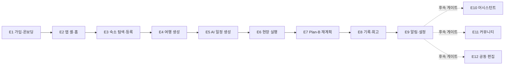

# TripPilot 에픽 (Epics)

이 문서는 TripPilot의 12개 에픽(E1~E12)을 팀이 한 번에 읽을 수 있도록 재구성한 정본이다. 각 에픽의 목적, 포함 범위, 스토리 수와 스토리 ID 범위를 정리한다. 스토리 제목과 수용 기준 전문은 [유저스토리](./user-stories.md)가 정본이다.

- 전체 스토리: 128개 — 1차 출시 범위 102개(E1~E9) + 후속 26개(E10~E12).
- 에픽 순서는 사용자 여정 순이다. 1차 9개 에픽이 "가입 → 앱 진입 → 숙소 → 여행 생성 → 일정 생성 → 현장 실행 → Plan-B → 기록·회고 → 알림·설정"으로 이어지고, 후속 3개 에픽(어시스턴트·커뮤니티·공동편집)은 각자의 출시 게이트를 거쳐 붙는다.
- 제품 개요는 [제품 개요](./overview.md), 페르소나는 [페르소나](./personas.md), 여정·시나리오는 [시나리오](./scenarios.md), 범위 경계는 [범위](./scope.md)를 참조한다.

에픽·스토리 전반에서 페르소나 P1 지유·P2 민준·P3 하람과 보조 액터 운영자를 화자로 참조한다. 정의는 [personas.md](./personas.md)를 정본으로 한다.

---

## 에픽 총괄표

| 에픽 | 이름 | 목적(한 줄) | 스토리 수 | 범위 |
|---|---|---|---|---|
| E1 | 가입·온보딩 | 계정 생성·약관 동의·취향 7종으로 첫 가치까지 도달 | 18 (신규 3) | 1차 |
| E2 | 앱 셸·홈·내비게이션 | 스플래시 분기·홈·5탭·장소 우선 진입으로 앱 뼈대 구축 | 6 (신규 1) | 1차 |
| E3 | 숙소 탐색·저장·등록 | 숙소 탐색·저장·등록으로 일정 생성 거점 확보 | 11 | 1차 |
| E4 | 여행 생성·거점·필수 방문지 | 여행·거점·필수 방문지로 일정 생성 입력 준비 | 11 (신규 1) | 1차 |
| E5 | AI 일정 생성·확정 | LLM+솔버로 실행 가능한 일정 생성·확정 | 12 | 1차 |
| E6 | 여행 중 현장 실행 | 확정 일정의 현장 실행(도착·방문·이동) | 3 | 1차 |
| E7 | Plan-B 재계획 | 현장 변수에 고정 제약 지키며 남은 일정 재구성 | 13 | 1차 |
| E8 | 여행 기록·회고 | plan/actual 대조·AI 회고·스타일 분석·공유 카드 | 14 | 1차 |
| E9 | 알림·마이페이지·설정 | 리마인드/Plan-B 알림·마이페이지·설정 | 14 (신규 2) | 1차 |
| E10 | AI 어시스턴트 | 대화형 오케스트레이션(통역·중개, 확정은 솔버 소유) | 8 | 후속 |
| E11 | 여행자 커뮤니티 | 공개 일정 둘러보기·게시·복제·좋아요·댓글·신고 | 10 (신규 1) | 후속 |
| E12 | 동행 공동 편집 | 동행 초대·항목 잠금 공동 편집·충돌 해소 | 8 | 후속 |

- 1차 스토리 합계 102개(E1~E9), 후속 26개(E10~E12), 총 128개.
- "신규"는 원 PRD에 없던 요구사항(→ [scope.md](./scope.md) §6.2)에서 파생된 추가 스토리 수다.

### 1차 에픽 여정 순서

---

## E1. 가입·온보딩 — [1차]

**목적**: 여행자가 계정을 만들고 약관에 동의하며 취향 7종을 (선택적으로) 설정해, 첫 가치(홈·맞춤 일정)까지 막힘없이 도달하게 한다. "가입 → 약관 동의 → (선택) 취향 설정 → 온보딩 완료"까지의 여정이 끝에서 끝까지 동작해야 한다.

**포함 범위**:
- 소셜 4종(Google·Apple·카카오·네이버)+이메일 가입/로그인, 이메일 인증 링크, 토큰 발급·회전, 브루트포스 방어.
- 최초 1회 필수 약관 동의(이용약관·개인정보 처리방침·위치기반서비스 약관 3종 분리 체크 + 마케팅 선택) 및 동의 증적·약관 버전·재동의 플래그.
- 연령 확인(만 14세), 위치 동의 3층 모델(OS 권한 × 법정 동의 × GPS 옵트인)과 위치정보 법정 로그.
- 닉네임 자동 생성·수정과 금칙어 검증, 취향 7종(스타일·예산·동행·활동·이동·음식·페이스) 설정·중립 기본값, 온보딩 완료 판정(약관+닉네임).
- 위치 권한 just-in-time 원칙(온보딩에서는 OS 다이얼로그 미호출) — 실제 발화 지점은 E3('내 주변')·E6(여행 중).

**명시적 제외**: 소셜↔이메일 수동 계정 연결(1차 미제공, CS 처리), 마케팅 알림 **발송**(동의 수집·철회만 1차).

**스토리**: 18개 (신규 3 — US-E1-16/17/18) — US-E1-01 ~ US-E1-18. 제목·수용 기준은 [user-stories.md](./user-stories.md)가 정본이다.

---

## E2. 앱 셸·홈·내비게이션 — [1차]

**목적**: 스플래시 분기·홈 대시보드·하단 5탭·탭바 노출 규칙·장소 우선 진입으로, 여행자가 앱 어디서든 자신의 여행 상태와 다음 행동에 한 번에 도달하게 한다.

**포함 범위**:
- 스플래시 분기: 세션 검증(3초 타임아웃·백그라운드 재검증) × 약관 재동의 필요 × 최소 지원 버전 → 로그인/재동의/강제 업데이트/온보딩 잔여/홈 5분기.
- 강제 업데이트 게이트: 서버가 알려 주는 최소 지원 버전에 미달하면 전면 차단+스토어 이동.
- 하단 5탭(홈·탐색·일정·기록·마이) 공용 컴포넌트, 탭 상태 세션 보존·재탭 스크롤 탑, 알림·딥링크 탭 스택 푸시, 몰입 화면 탭바 숨김.
- 홈 대시보드 프레임: 여행 카드(D-day·진행률)·빠른 액션·인기 장소·추억 카드의 레이아웃과 빈 상태.
- 장소 우선 진입(Case A 온램프): 탐색 랜딩 '장소' 카드·저장 목록·'이 장소들로 여행 만들기' 진입.

**명시적 제외**: 각 탭 루트의 실제 콘텐츠(탐색·일정·기록·마이의 본문), '지금 뜨는 여행 기록' 카드(커뮤니티 후속), 오프라인 일정 조회(미보장).

**스토리**: 6개 (신규 1 — US-E2-06) — US-E2-01 ~ US-E2-06. 제목·수용 기준은 [user-stories.md](./user-stories.md)가 정본이다.

---

## E3. 숙소 탐색·저장·등록 — [1차]

**목적**: 여행자가 숙소를 탐색·저장하고, 외부에서 예약한 숙소를 앱에 등록해 AI 일정 생성의 거점(출발점)으로 삼는다. 탐색·저장은 앱, 상세·예약·결제는 외부 OTA 딥링크로 위임한다.

**포함 범위**:
- 여행지 기반 탐색(날짜·인원 없이), 필터·정렬(유형·편의시설·대표 가격대·직선거리 — 소요시간 미표시), 상세(정적 콘텐츠·리뷰는 OTA 위임), '가격 보기' 라이브 조회, 부분 실패·0건·데이터 부족 지역 처리.
- 위시리스트 저장·메모(로그인 계정 귀속), 등록 숙소(계정 레벨 풀)·수동 등록 단일 경로+직접 등록 3경로(지도 검색·링크 파싱·핀 지정), 내부 숙소 식별자와 소스별 외부 식별자의 N:1 매핑.
- OTA 딥링크(숙소명 검색), 제휴 고지, 다중 OTA 선택, 복귀 핸드오프 카드, 아웃바운드 클릭 로그.
- 일자별 다중 거점 등록·구간 비중첩 검증(같은 여행 연결 거점끼리), 등록·저장 통합 목록.

**명시적 제외**: 포스트백 기반 1탭 자동 등록(후속), 정확 가격 일괄 조회·캐싱(하지 않음), OTA 크롤링(금지), 리뷰·평점 표시(OTA 위임), 혼잡도(1차 제외·'미확인' 표기).

**스토리**: 11개 — US-E3-01 ~ US-E3-11. 제목·수용 기준은 [user-stories.md](./user-stories.md)가 정본이다.

---

## E4. 여행 생성·거점·필수 방문지 — [1차]

**목적**: 여행자가 여행지·날짜·인원·예산으로 여행을 만들고, 숙소를 거점으로 연결하며, 필수 방문지를 지정해 AI 일정 생성의 기준점(앵커)을 준비한다.

**포함 범위**:
- 여행 CRUD: 제목(선택 입력·자동 생성·금칙어), 날짜 검증(오늘 이후·최대 30일), **기존 여행 날짜 겹침 차단(활성 여행 항상 최대 1개)**, 인원·예산 선택 입력.
- 예산: 여행 전체 총액(항공 제외) 기준, 온보딩 러프 예산 기본값 제시, 1인·1일 파생 표기.
- 시간창: 날짜별 이용 가능 시작/종료 시각(기본 09:00~21:00), 첫날 도착·마지막날 출발 반영.
- 거점: 등록 숙소의 여행 연결, 일자별 다중 거점·구간 비중첩 검증, 다박 연속 숙박, 숙소 날짜→여행 기간 자동 반영, 첫날 거점 공백 시 여행지 중심 좌표 기본 거점.
- 필수 방문지: 저장 POI 체크박스 투입(권역 밖 경고)·**사본 복제**(원본 삭제 독립), 하루 3곳×일수 한도, 시각 고정, 변경 시 재계산 미리보기, 고정/필수 블록 규칙.

**명시적 제외**: 일정 생성 자체(E5), 저장 POI 집합에서 숙소 권역을 직접 역추천하는 것(하지 않음 — 무숙소 초안 일정을 거쳐 E5가 제공), 공동 편집·초대(E12).

**스토리**: 11개 (신규 1 — US-E4-11) — US-E4-01 ~ US-E4-11. 제목·수용 기준은 [user-stories.md](./user-stories.md)가 정본이다.

---

## E5. AI 일정 생성·확정 — [1차]

**목적**: 제품의 심장 — 등록 숙소를 출발점으로 LLM(취향 해석·설명)과 솔버(선택·순서·시간 보장)가 협업해 실행 가능한 날짜별 일정을 생성하고, 편집·저장을 거쳐 여행 전 최종본으로 확정한다.

**포함 범위**:
- 숙소 위경도·체크인/아웃을 고정 입력으로 날짜별 일정 1개씩 생성.
- 취향 기반 POI 선별: LLM이 자유 입력을 해석해 후보 POI에 선호 점수를 매기고, 그 점수를 최적화의 보상값으로 사용. 후보 목록 밖 장소는 구조적으로 선택 불가(closed-set). 예산은 하드 제약이 아닌 소프트 가중치.
- 시간 하드 제약: 영업시간 내 배치·이동시간 부등식·고정 블록 불변, 사용자에게 보이는 시각은 검증된 값만, 체류 시간 기본값 테이블 기반.
- 숙소·시각 고정 필수 방문지를 고정 블록으로 놓고 나머지 추천 POI 배치, 추천·배치 이유 설명(표시용).
- 시간표/지도 2보기, 이동 구간 거리·수단만 표시(소요시간 미표시).
- 편집·재검증: 편집 즉시 경량 검증 + 저장 시 확정 검증, 'AI 자동 보정'은 최소 변경.
- 생성 3방식(완전 AI/같이 고르기/직접 만들기), 점진 노출(첫 1일 5초·전체 20초), 취소 시 부분 초안+이어서 생성, 생성 실패 시 결정론적 폴백.
- 숙소 나중 등록 시 동선 기반 숙소 권역 추천, 확정(plan 스냅샷 동결·불변)·확정 해제→재확정 상태 전이.

**명시적 제외**: 여행 중 실행 허브·재계획(E6·E7), 예산을 하드 제약으로 취급하는 것.

**스토리**: 12개 — US-E5-01 ~ US-E5-12. 제목·수용 기준은 [user-stories.md](./user-stories.md)가 정본이다.

---

## E6. 여행 중 현장 실행 — [1차]

**목적**: 여행 중 사용자가 확정된 일정을 현장에서 정상 실행하는 흐름(도착 확인·방문 상태 전이·장소 상세·다음 예정지 이동)을 다룬다. Plan-B 재계획(E7)과 구분되는 실행 흐름이며, 기록 저장 규칙은 E8을, 거리 산출 기준은 E5를 정본으로 따른다.

**포함 범위**:
- 도착 확인: 포그라운드 지오펜스 진입 시 '도착하셨나요?' 프롬프트(확정·방문 완료는 항상 사용자 탭, 자동 확정 없음), 백그라운드 위치 권한 미요청.
- 방문 시작/완료/스킵 전이와 실제 체류 시간 측정(방문 종료 시각=다음 장소 체크 시각 추정), 체류 초과 시 Plan-B 자동 트리거로 연결.
- 현장 장소 상세(영업시간·예상 체류·주변 추천·다음 일정까지 여유 시간), 혼잡도 1차 제외('미확인').
- 다음 예정지 직선거리 인라인 표시(소요시간 미표시)·수동 새로고침, 외부 지도 앱 시트로 길찾기 위임, 복귀 시 근접하면 도착 확인 프롬프트.

**스토리**: 3개 — US-E6-01 ~ US-E6-03. 제목·수용 기준은 [user-stories.md](./user-stories.md)가 정본이다.

---

## E7. Plan-B 재계획 — [1차]

**목적**: 여행 중 날씨·휴무·이동 지연·체력 저하 같은 변수가 발생했을 때, 고정 제약(등록 숙소·시각 고정 일정)을 지키면서 남은 일정을 안전하게 재구성한다. 최종 후보는 항상 솔버 검증을 통과한 결과만 노출한다.

**포함 범위**:
- 수동 재계획 요청(5가지 사유 또는 '사유 없음'), '여행 중' 상태 판정(여행 날짜 구간 진입·종료일 익일 자동/수동 종료 병행).
- 자동 트리거 4종 감지: (a) 강수확률 60%↑·기상특보, (b) 당일 임시 휴무/영업시간 변경, (c) 예상 이동시간 임계 초과, (d) 체류 초과로 고정 일정 위협. 날씨·휴무는 서버 폴링+푸시, 위치 의존은 클라이언트 포그라운드 감지. 비차단 배너·제안 방식(자동 변경 없음), 빈도 상한·민감도 3단계·무시 억제.
- 영향 분석 기준 입력(현재 위치·시각·고정 제약·영업시간·이동시간), 대안 후보 2~3개(검증 통과·실재 장소만·저장 장소 우선), 후보별 정보(추천 이유·거리·체류·여유 — 소요시간 미표시).
- 대안 선택 / 기존 유지 / 휴식 모드 전환, 대안 선택 후 당일 잔여 자동 재정렬(이월 미배치 목록), 변경 전/후 비교·확정 시 재검증.
- 변경 이력 저장(사유·전/후·시각·트리거 유형, current만 갱신·plan 불변), 위치 수동 입력 폴백, 외부 API 오류 시 수동 수정 폴백, 대안 획득 2방식(AI에 맡기기/직접 수정), 계획 동선 vs 실제 GPS 경로 지도 비교.

**스토리**: 13개 — US-E7-01 ~ US-E7-13. 제목·수용 기준은 [user-stories.md](./user-stories.md)가 정본이다.

---

## E8. 여행 기록·회고 — [1차]

**목적**: 여행 중 방문·사진·메모를 기록하고, 계획(plan)과 실제(actual)를 대조해 AI 회고·여행 스타일 분석·공유 카드로 이어지는 기록 여정을 제공한다. "여행이 끝나도 남는 것"을 만든다.

**포함 범위**:
- 방문 완료/취소 체크와 실제 방문 시각·체류 시간 기록(plan/actual 구분), 즉석 방문(POI 검색+자유 텍스트) 추가.
- 방문 장소 사진(장소당 20장·클라이언트 압축)·메모 첨부, 업로드 실패 시 로컬 큐·재시도(메모·체크는 사진과 독립 저장).
- GPS 방문 기록 옵트인(위치기반서비스 약관과 별개 동의, 철회·탈퇴 시 즉시 파기), 미동의 시 좌표 없는 기록·수동 체크인.
- 계획(plan 불변)·현재본(current)·실제(actual)·변경 이력(changelog) 4계열 구분 저장, 숙소·날짜 기준 방문 기록 귀속.
- 당일 회고 초안 자동 생성·수정·재생성(덮어쓰기 경고), 여행 종료 후 전체 요약(지도 히어로·통계), 여행 스타일 분석(방문 10곳 게이트·취향 7종 축 택소노미).
- 여행 기록 기반 다음 여행 개인화, 마이페이지 지난 여행 열람(종료 후 편집 허용·회고는 수동 재생성), 오프라인 기록 입력·동기화·충돌 해소(입력만 오프라인 보장), SNS 공유 카드, 캘린더 탐색.

**명시적 제외**: 커뮤니티 게시(E11 — 공유 카드는 이미지 내보내기까지), 회고 알림 발송(E9), 사진 전체 아카이브 내보내기(텍스트 JSON만 1차).

**스토리**: 14개 — US-E8-01 ~ US-E8-14. 제목·수용 기준은 [user-stories.md](./user-stories.md)가 정본이다.

---

## E9. 알림·마이페이지·설정 — [1차]

**목적**: 여행 생명주기와 연동된 리마인드·Plan-B 알림, 마이페이지(숙소·여행·스타일 분석), 설정(알림·취향·위치 동의·계정·정책 문서)을 제공하는 1차 마무리 에픽. 모든 알림은 서버가 스케줄링해 발송한다. '체크인 임박'·'예약 링크 리마인드'는 알림 종류에서 제외한다.

**포함 범위**:
- 알림: 숙소 등록·저장 완료, 여행 단계별 리마인드(D-1·당일 요약·개별 일정 전), Plan-B 재계획, 회고 완료. 서버 스케줄링·일정 변경 시 발송 시각 재계산, 방해금지 시간(기본 22~08시, Plan-B '진행 중'만 예외).
- 알림 채널·종류별 토글(푸시/인앱 독립), 인앱 알림함(90일 보존·읽음 관리), OS 푸시 권한 거부 처리.
- 마이페이지: 숙소·예약 기록 관리·출발점 전환, 여행 목록 구분 조회(예정/진행 중/종료), 여행 스타일 분석 카드.
- 설정: 개인정보·계정 관리(데이터 JSON 내보내기·계정 소프트 삭제+30일 유예 연쇄), 여행 취향 직접 설정, 위치정보 수집 동의 3층 관리, 외부 OTA 제휴 링크 고지, 고객 지원·정책 문서 재열람, 마케팅 수신 동의 관리(1차는 수집·관리만, 발송 없음).
- 홈 대시보드 카드 최종 통합 검증.

**스토리**: 14개 (신규 2 — US-E09-13/14) — US-E09-01 ~ US-E09-14. 제목·수용 기준은 [user-stories.md](./user-stories.md)가 정본이다. 스토리 ID는 `US-E09-##` 표기를 사용한다.

---

## E10. AI 어시스턴트 — [후속]

**목적**: 앱 전반에서 호출되는 대화형 오케스트레이션 계층(통역·중개자 — 실현가능성 판단과 확정은 항상 솔버가 소유). 1차 출시 이후 별도 출시 게이트로 다룬다. 로그인 필수 원칙에 따라 비로그인 어시스턴트 조항은 두지 않는다.

**포함 범위**:
- 주요 화면 FAB(✦) 호출·현재 화면 컨텍스트 자동 전달, 모든 응답에 다음 행동 1개 동봉(dead-end 금지).
- 대화형 재질의(티키타카)로 탐색·추천 조건 변환·누적(대화 ↔ 화면 상태 일관).
- 진행 검토 요청(검증된 값만 인용·미검증 수치 생성 금지), 액션 위임(제안 수락 시 기존 기능이 재검증·실행, 어시스턴트 단독 확정 금지).
- 대화 이력·세션 유지(여행 단위 스레드·계정 귀속), 가드레일(주입·유출·유해 요청 방어 — 권한 밖 데이터는 서버 재조회 경계로 구조적 미포함), 범위 한계 안내·외부 위임(예약·결제·평점은 외부 OTA), 폴백(실패 시 비대화형 흐름으로 지속).

**스토리**: 8개 (전량 후속: 어시스턴트) — US-E10-01 ~ US-E10-08. 제목·수용 기준은 [user-stories.md](./user-stories.md)가 정본이다.

**출시 선결**: E5·E6 완료, LLM 비용 정책 확정.

---

## E11. 여행자 커뮤니티 — [후속]

**목적**: 다른 여행자의 공개 일정을 둘러보고(읽기전용), 내 일정을 명시적으로 공개하며, 가져오기(복제)·프로필 조회·좋아요·댓글로 반응한다. 1차 출시 이후 별도 출시 게이트로 다루며, 공개 스냅샷 모델·기본 비공개 원칙·모더레이션 인프라 요건만 1차 데이터 모델에 선반영한다. 소셜 그래프(팔로우 등)·독립 게시판은 범위 제외 유지.

**포함 범위**:
- 공개 일정 둘러보기(피드형 카드·필터/정렬만·키워드 검색 없음·상대 시기 표현), 상세 읽기전용 보기(시간표/지도 2뷰 재사용·게시 시점 스냅샷).
- 작성자 공개 프로필 보기(공개 정보만·소셜 그래프 없음), 신고·숨기기(양방향 차단·금칙어 자동 필터·신고 누적 시 검토 보류).
- 내 일정 공개(기본 비공개·확정/종료 일정 단위·닉네임·권역 마스킹·상대 날짜·EXIF GPS 제거), 내 여행으로 가져오기(스냅샷 독립 복제·출처 표시 보존), 내가 공유한 일정 관리(즉시 해제).
- 좋아요(토글·집계만·묶음 알림), 댓글(단일 레벨 평면·금칙어·묶음 알림), 신고 큐 운영(최소 내부 도구·단계적 제재·처리 이력).

**스토리**: 10개 (신규 1 — US-E11-10, 운영자 페르소나) — US-E11-01 ~ US-E11-10. 제목·수용 기준은 [user-stories.md](./user-stories.md)가 정본이다.

**출시 선결**: 모더레이션 4종 인프라(신고 큐·검토 중 보류·금칙어 사전·양방향 차단) + 최소 어드민 도구, E8 완료.

---

## E12. 동행 공동 편집 — [후속]

**목적**: 여행 소유자가 동행자를 초대해 하나의 일정을 항목 단위 잠금으로 함께 편집하는 비공개 협업 에픽(커뮤니티 복제와 구분). 1차 출시 이후 별도 출시 게이트로 다루며, 동기화·잠금 방식만 1차 설계에 확장 여지로 반영한다.

**포함 범위**:
- 동행자 초대(초대 링크 다회용·만료 7일·권한 지정, 최대 10명), 권한별 동작 제어(소유자/편집자/뷰어·서버 강제·공유 데이터 범위 제한).
- 항목 단위 잠금 동시 편집·동기화(항목 잠금·프레즌스·광역 편집은 일자 전체 잠금 승격), 편집 충돌 해소(침묵 덮어쓰기 금지·두 버전 선택·선착순 적용).
- 공동 편집 재검증(모든 변경 즉시 재검증·편집자는 AI 자동 보정만·재생성은 소유자 전용), 오프라인 편집·재연결 동기화, 공동 편집 변경 이력(통합 changelog·되돌리기+재검증).
- 공유 종료·이탈과 소유권(원본은 항상 소유자 귀속·동행 사본 자동 생성 없음·현장 실행 액션은 소유자 기준·소유자 계정 삭제 시 연쇄 정리).

**스토리**: 8개 (전량 후속: 공동편집) — US-E12-01 ~ US-E12-08. 제목·수용 기준은 [user-stories.md](./user-stories.md)가 정본이다.

**출시 선결**: 실시간 동기화 인프라, E5·E6 완료.

---

## 참조 문서

- 개별 스토리의 수용 기준 전문 — [유저스토리](./user-stories.md)
- 페르소나 상세 — [페르소나](./personas.md)
- 시나리오·사용자 여정 — [시나리오](./scenarios.md)
- 1차/후속 범위 경계 — [범위](./scope.md)
- 제품 개요 — [제품 개요](./overview.md)
