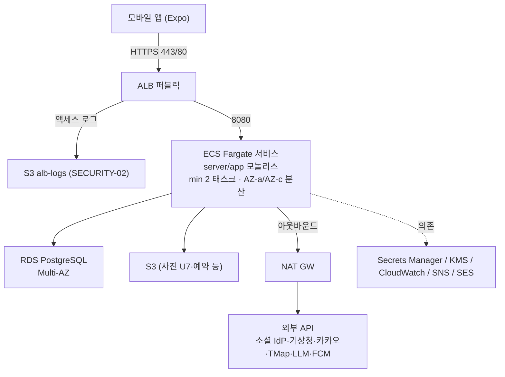
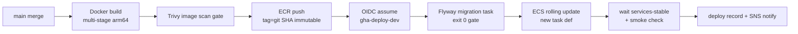

# TripPilot 인프라 & 배포

> 출처: aidlc/aidlc-docs/construction/shared-infrastructure.md · aidlc/aidlc-docs/construction/u1-foundation/infrastructure-design/infrastructure-design.md · aidlc/aidlc-docs/construction/u1-foundation/infrastructure-design/deployment-architecture.md · aidlc-docs에서 2026-07-05 추출 · 이후 본 문서가 정본이다.

이 문서는 TripPilot 서버·데이터·배포 인프라의 정본이다. 클라우드 토폴로지(AWS), 컴퓨트·네트워크·데이터베이스·스토리지·시크릿·관측성 구성, 환경 분리, 비용, IaC, 그리고 GitHub Actions CI/CD 파이프라인(빌드 게이트·롤링 배포·롤백)을 한 곳에 담는다. 공유 인프라는 U1(foundation) 유닛에서 확정됐고 U2~U8(및 후속 U9~U11)이 이를 재사용한다. 개별 유닛이 추가로 소유하는 인프라 결정은 해당 유닛 문서에서 다룬다(→ [19. 유닛별 인프라 추가분](#19-유닛별-인프라-추가분-안내)). 아키텍처 전반은 [architecture.md](architecture.md), NFR 기준은 [nfr.md](nfr.md), 핵심 결정·ADR은 [decisions.md](decisions.md)를 함께 본다.

---

## 1. 전역 확정 결정과 설계 원칙

인프라의 골격을 결정한 전역 선택은 아래 6가지다. 사용자 답변(2026-07-04)으로 확정됐고 모든 유닛에 공통 적용된다.

| 항목 | 확정 |
|---|---|
| 클라우드 | **AWS 서울 리전(ap-northeast-2)** |
| CI/CD | **GitHub Actions** |
| 롤백 | **버전 고정 재배포(ECR 이미지 태그)** + DB **forward-only**(되돌리지 않음) |
| 배포 | **롤링 배포** (Multi-AZ 2+ 인스턴스) |
| 변경 관리·인시던트 대응 | **경량 프로세스** (NFR Design 문서가 소유, 인프라는 SNS 알림 라우팅까지 제공) |
| 복원력 테스트 | **Operations 이연**(계획된 지연 — 시나리오 문서는 롤백 runbook이 겸함) |

**설계 지배 원칙 — 규모 정합(G142)**: MVP 규모는 DAU 1천·동시 일정 생성 10·정상 피크 약 0.5 RPS(헤드룸 10 RPS)다. 과설계를 금지하고, 모든 선택에 규모 근거를 병기하며, **확장 트리거**(언제 상향하는가)를 함께 기록한다. 이 문서 전반에서 "전환 트리거"로 표기된 항목이 그 상향 조건이다.

근거 정본: requirements.md §6.2·6.3·6.8, nfr-requirements.md §8(PD-1~9), tech-stack-decisions.md, Security Baseline(SECURITY-01~15), Resiliency Baseline(RESILIENCY-01~15).

---

## 2. 전체 아키텍처 개요 (토폴로지)

단일 배포 모놀리스(D04 — Spring Boot Kotlin) + 모바일 앱(Expo) 구조이므로 서버 런타임은 **컨테이너 서비스 1개**다. 모바일 앱이 퍼블릭 ALB(443/80)로 접속하고, ALB는 프라이빗 서브넷의 ECS Fargate 태스크(최소 2개, 2개 AZ 분산)로 라우팅한다. 태스크는 RDS PostgreSQL Multi-AZ·S3·Secrets Manager에 접근하며, 외부 API(소셜 IdP·기상청·카카오·TMap·LLM·FCM)는 NAT Gateway를 경유해 아웃바운드 호출한다. ALB 액세스 로그는 S3에, 앱 로그는 CloudWatch Logs에 적재되고 알람은 SNS로 라우팅된다.



**유닛별 소비 요소** — 어떤 유닛이 이 인프라의 어느 부분을 소비하는지:

| 유닛 | 소비하는 인프라 요소 |
|---|---|
| U1 | 전부(기준 정의 유닛) — 매핑은 본 문서 전반 |
| U2 | ALB 라우팅·remote config성 설정(부트스트랩 API) |
| U3 | NAT 아웃바운드(TourAPI·카카오·네이버), 외부 쿼터 알람 프레임(§10) |
| U4 | 추가 없음(기존 컴퓨트·DB 재사용) |
| U5 | NAT 아웃바운드(LLM·TMap), LLM 비용 계측 메트릭(§10) |
| U6 | NAT 아웃바운드(기상청), 스케줄 잡 프레임(§3), 위치 법정 로그 기록 개시(§7.3) |
| U7 | **사진 S3 버킷 + CloudFront**(§7.4 예약분 활성화) |
| U8 | FCM 아웃바운드, SNS/알림 스케줄링(서버 소유 D32 — DB 기반 잡, §3) |
| U9~U11 | WebSocket(U11 — ALB 지원·스티키니스 검토), 어드민 웹(U10 — CloudFront+별도 오리진 검토) |

---

## 3. 인프라 결정 종결표 (PD-1~9)

nfr-requirements.md §8이 '대기'로 남겨 둔 인프라 미결 항목(PD-1~9)은 U1 Infrastructure Design에서 전부 종결됐다. 이 표가 인프라 결정의 색인이다.

| # | 항목 | 결정 | 상세 위치 |
|---|---|---|---|
| PD-1 | 트랜잭션 메일 | **Amazon SES**(서울 리전) — 샌드박스 해제 절차 포함 | §6.2, §15 |
| PD-2 | 시크릿 매니저 | **AWS Secrets Manager** — ECS 태스크 정의 주입 | §8 |
| PD-3 | KMS·JWT 서명 키 | AWS 관리형 KMS 키 + JWK 셋은 Secrets Manager(kid 롤오버 runbook) | §8 |
| PD-4 | 중앙 로그·모니터링·알림 | **CloudWatch Logs/Metrics/Alarms + SNS**, APM·크래시=Sentry | §10 |
| PD-5 | 관리형 PostgreSQL 세부 | RDS PostgreSQL 16 Multi-AZ·PITR·보존 7일·복원 검증은 Operations 이연 | §5 |
| PD-6 | 유출 비밀번호 온라인 조회 | **HIBP Pwned Passwords k-익명 API**(해시 프리픽스 5자만 전송) — 1초 타임박스·fail-open, NAT 아웃바운드 허용 목록 문서화 | §16 |
| PD-7 | CI/CD·롤백·배포 | GitHub Actions / 버전 고정 재배포 / 롤링(전역 확정) | §14 |
| PD-8 | 변경 관리·인시던트 | 경량 프로세스 — NFR Design 문서 소유. 인프라는 SNS 알림 라우팅(§10)까지 제공 | §10 |
| PD-9 | 세션·rate-limit 공유 캐시 | **미도입 — PostgreSQL 기반으로 확정** | §17 |

---

## 4. 컴퓨트 — ECS Fargate

### 4.1 선택 비교: ECS Fargate vs ECS on EC2 vs EKS

| 기준 (MVP 규모: 정상 피크 ~0.5 RPS, 헤드룸 10 RPS) | **ECS Fargate** | ECS on EC2 | EKS |
|---|---|---|---|
| 운영 부담(패치·용량 관리) | **없음** — OS·호스트 관리 제로(SECURITY-09 하드닝 표면 최소) | AMI 패치·ASG 관리 필요 | 컨트롤플레인+노드+애드온 운영, 전담 역량 필요 |
| 고정 비용 | 태스크 사용량만 | EC2 예약 대비 저렴 가능하나 관리 인건비 상회 | **컨트롤플레인 $73/월 고정** — 서비스 1개에 순수 낭비 |
| Multi-AZ 롤링 배포 | 서비스 정의로 즉시 충족 | 동일하나 호스트 계층 추가 | Deployment로 충족하나 과잉 계층 |
| 규모 정합(G142) | **적합** — 서비스 1개·태스크 2~4개 | 태스크 밀도 이점이 나올 규모 아님 | K8s 생태계가 필요한 마이크로서비스 아님(D04 모놀리스) |
| 후속 확장(U11 WebSocket 등) | 서비스 추가로 대응 가능 | 동일 | 이 시점 재평가 가능 |

**확정: ECS Fargate.** 서버가 단일 모놀리스 컨테이너 1종(D04)이고 팀에 전담 인프라 인력이 없는 MVP에서, 호스트 운영이 없는 Fargate가 총비용(인프라+인건)이 최소다. EKS는 컨트롤플레인 고정비·운영 복잡도가 규모 대비 과설계(G142), ECS on EC2는 태스크 밀도 이점이 발생할 규모가 아니다. **전환 트리거**: 상시 태스크 8개 이상 또는 GPU/특수 런타임 필요 시 EC2 용량 공급자 병용 재평가.

### 4.2 서비스 구성

| 항목 | 값 | 근거 |
|---|---|---|
| 클러스터 | `trippilot-{env}` 1개 | 단일 서비스 |
| 서비스 | `trippilot-api` (server/app 모놀리스) | D04 |
| 태스크 사이즈 | **1 vCPU / 2GB**(prod) · 0.5 vCPU / 1GB(dev) | JVM 상주 + argon2id 검증(건당 ~19MiB·100–200ms CPU, NFR-U1-SC-01) 동시 처리 헤드룸. 10 RPS 설계 목표를 태스크 2개로 소화 |
| **태스크 수** | **min 2**(AZ-a·AZ-c 강제 분산, spread 배치 전략) / max 4 | RESILIENCY-08 Multi-AZ, 배포 스타일=롤링 |
| 오토스케일 | Target Tracking: ①평균 CPU 60% ②ALB RequestCountPerTarget 300/분 — 스케일아웃 쿨다운 60초·인 300초 | RESILIENCY-09 min/max 한도. max 4는 비용 상한 겸용(초과 필요 = 용량 재설계 신호) |
| **배포(롤링)** | `minimumHealthyPercent=100`, `maximumPercent=200` — 신 태스크 헬시 확인 후 구 태스크 종료. **Deployment Circuit Breaker + 자동 롤백 활성화**(헬스 실패 시 직전 태스크 정의로 복귀) | 전역 결정(롤링), NFR-U1-AV-05 무중단 내성 |
| 헬스체크 | ALB 대상 그룹은 **shallow**(`/actuator/health/liveness`)만 사용. deep(DB 포함)은 관측 전용 — LB 판단에서 배제해 DB 순단의 태스크 대량 축출 증폭 차단 | NFR-U1-AV-06 |
| 헬스체크 유예 | `healthCheckGracePeriodSeconds=90`(JVM 기동) | — |
| 이미지 | ECR `trippilot-api:{git-sha}` — **불변 태그**(ECR tag immutability ON), base 이미지 digest 고정 | SECURITY-10, 롤백=태그 재배포 |
| 컨테이너 하드닝 | non-root USER, read-only root filesystem, 최소 베이스(distroless 또는 ECR Public temurin-jre 21 digest 고정) | SECURITY-09 |
| 런타임 | Fargate Platform 1.4+, **ARM64**(Graviton — 동급 대비 ~20% 저렴) | 비용(G142) |

### 4.3 스케줄 잡 실행 모델 — 별도 워커 없음

U1~U8의 스케줄러 잡(삭제 유예 만료·미인증 정리·POI 동기화·날씨 폴링·알림 스케줄링 등)은 **별도 워커 서비스를 두지 않고** 앱 프로세스 내 스케줄러(Spring `@Scheduled`) + **PostgreSQL 기반 분산 락(ShedLock 테이블)** 으로 실행한다. 근거: 잡 전부가 분 단위 주기·저부하(G142)이며, 태스크 2개 중복 실행은 DB 락으로 배제. **전환 트리거**: 잡 실행 시간이 API 지연에 간섭(p95 열화 상관 관측)하면 EventBridge Scheduler + ECS RunTask로 분리.

### 4.4 규모 매핑 — U1 트래픽과 태스크 사이징 정합

- **NFR-U1-SC-01(단일 인스턴스 10 RPS 헤드룸)**: argon2id(m=19MiB·t=2 — 검증 100–200ms CPU) 동시 실행이 상한 결정 요인이다. 태스크 1vCPU에서 로그인·가입 동시 ~5건/초 + 일반 API 병행이 가능하며, 피크 로그인 0.003 RPS 대비 3자릿수 여유다. §4.2의 1vCPU/2GB × 2태스크로 충족 — 추가 산정 불요(G142).
- **JVM 메모리**: 힙 1GB(`-Xmx1g`) + argon2 오프힙(19MiB × 동시 해시 ≤ 8 ≈ 152MiB) + 메타스페이스 — 2GB 태스크 내 안전.

---

## 5. 네트워크 — VPC (SECURITY-07 deny-by-default)

### 5.1 VPC·서브넷 (2 AZ)

| 항목 | 값 |
|---|---|
| VPC | `10.20.0.0/16`(prod) / `10.10.0.0/16`(dev) — DNS hostnames/support ON |
| AZ | ap-northeast-2a, ap-northeast-2c (2개 — RESILIENCY-08 충족 최소) |
| 퍼블릭 서브넷 ×2 | `10.20.0.0/24`, `10.20.1.0/24` — ALB·NAT GW만 배치 |
| 프라이빗 앱 서브넷 ×2 | `10.20.10.0/24`, `10.20.11.0/24` — ECS 태스크. **IGW 직결 라우트 금지, 아웃바운드는 NAT 경유**(SECURITY-07) |
| 프라이빗 DB 서브넷 ×2 | `10.20.20.0/24`, `10.20.21.0/24` — RDS 전용. **아웃바운드 라우트 자체 없음**(NAT 미연결 — DB는 외부 호출 불요) |

- **NAT Gateway: 1개(AZ-a)로 시작.** 근거: NAT 장애 영향은 아웃바운드 한정(소셜 신규 로그인·외부 API — 전부 폴백 보유, NFR-U1-AV-04·RESILIENCY-10)이고 RTO 목표가 시간 단위(CQ4)이므로, AZ 장애 시 IaC로 타 AZ NAT 재생성(runbook, ~15분)이 목표 내 복구다. AZ당 NAT 2개(월 +$45)는 MVP 과설계(G142). **전환 트리거**: 아웃바운드 의존 기능이 Critical로 승격되거나 유료 사용자 SLA 도입 시 AZ당 NAT.
- **VPC 엔드포인트**: S3 **Gateway 엔드포인트(무료) 필수 적용**(사진 업로드·ALB 로그 경로가 NAT 요금 우회 + 프라이빗 접근 — SECURITY-07). ECR·CloudWatch Logs·Secrets Manager **Interface 엔드포인트는 미도입(문서화된 예외)** — 근거: 트래픽 소량(로그 <1GB/일 추정)으로 엔드포인트 고정비(개당·AZ당 ~$7/월)가 NAT 데이터 요금을 상회. **전환 트리거**: NAT 데이터 처리량 월 100GB 초과.

### 5.2 보안 그룹 (deny-by-default — SECURITY-07)

| SG | 인바운드 | 아웃바운드 |
|---|---|---|
| `sg-alb` | **443, 80 from 0.0.0.0/0**(공개 LB 허용 예외 — SECURITY-07 명시 허용 범위) | 8080 → `sg-app`만 |
| `sg-app`(ECS) | 8080 from `sg-alb`만 | 443 → 0.0.0.0/0(외부 API·AWS API — NAT 경유), 5432 → `sg-db` |
| `sg-db`(RDS) | **5432 from `sg-app`, `sg-migrate`만**(CIDR 아닌 SG 참조) | 없음 |
| `sg-migrate`(Flyway 마이그레이션 태스크) | 없음 | 5432 → `sg-db`, 443(ECR·로그) |

- `sg-app`의 443 아웃바운드 0.0.0.0/0 **정당화**: 소셜 IdP 4종·기상청·카카오·TMap·LLM·FCM·OTA 등 목적지 IP가 가변인 SaaS 다수로 IP 고정이 불가능하다. 도메인 수준 통제(egress 프록시)는 Operations에서 검토한다.
- NACL은 서브넷 기본값 유지(SG로 통제 일원화 — 이중 관리 비용 회피, G142). 0.0.0.0/0 인바운드는 ALB 80/443이 유일하다.

### 5.3 ALB

| 항목 | 값 | 근거 |
|---|---|---|
| 리스너 | 443(HTTPS, ACM 인증서·TLS 정책 `ELBSecurityPolicy-TLS13-1-2-2021-06` — TLS 1.2+) / 80은 443 리다이렉트 전용 | SECURITY-01 전송 암호화 |
| **액세스 로그** | **S3 `trippilot-{env}-alb-logs` 활성화**(SSE-S3 — ALB 로그는 SSE-S3만 지원), 보존 90일+ 수명주기(§7.2) | **SECURITY-02** |
| 대상 그룹 | ECS `trippilot-api`, 헬스체크 §4.2·§5.4 | — |
| 보호 | 삭제 보호 ON, 유휴 타임아웃 60초 | — |
| WAF | 1차 미도입 — 근거: 앱 레벨 rate-limit·브루트포스 방어(NFR-U1-SEC-07·08)가 선행 구현되고 공개 표면이 JSON API 한정. **전환 트리거**: 자동화 공격 관측(CAPTCHA 도입 트리거와 동일 지표) 시 AWS WAF 관리 규칙 도입 | G142 |
| 도메인 | Route 53 `api.trippilot.app`(가칭 — P9 도메인 확정 연계) → ALB alias | — |

### 5.4 인증 API의 ALB 라우팅·헬스체크 (U1)

- **라우팅**: 단일 모놀리스(D04)이므로 ALB 규칙은 기본 1개 — 443 리스너 → 대상 그룹 `trippilot-api`(전 경로 `/api/*` 및 `/actuator/health/liveness`). 경로 분기 없음(모듈 경계는 앱 내부 Gradle 경계 — NFR-U1-MT-01). U1 공개 엔드포인트 화이트리스트(NFR-U1-SEC-16)는 **Spring Security가 정본**이며 ALB에서 중복 관리하지 않는다(이중 관리 드리프트 방지).
- **헬스체크 경로(NFR-U1-AV-06)**:

| 용도 | 경로 | 판정 | 소비자 |
|---|---|---|---|
| shallow(프로세스 생존) | `/actuator/health/liveness` | 프로세스·스프링 컨텍스트만 — **DB 미포함** | ALB 대상 그룹 + ECS 컨테이너 헬스체크 |
| deep(의존 포함) | `/actuator/health/readiness` | DB 연결(HikariCP)·필수 시크릿 로드 포함 | **관측 전용** — 앱 자체 주기 계측 메트릭으로 발행. LB 판단 배제(DB 순단 → 태스크 대량 축출 증폭 차단) |

- ALB 헬스체크 파라미터: interval 15s, timeout 5s, healthy 2회, unhealthy 3회, 성공 코드 200. ECS `healthCheckGracePeriodSeconds=90`(JVM 기동).
- 두 경로 모두 인증 예외(공개 화이트리스트)이나 **응답 본문은 상태 코드만**(버전·의존 상세 비노출 — SECURITY-09).

---

## 6. 데이터베이스 — RDS PostgreSQL Multi-AZ

### 6.1 인스턴스·백업 구성

| 항목 | 값 | 근거 |
|---|---|---|
| 엔진 | RDS PostgreSQL 16.x(관리형) | requirements §2.3, PD-5 |
| 인스턴스 | **db.t4g.small, Multi-AZ 인스턴스 배포**(prod) / db.t4g.micro Single-AZ(dev) | 첫해 계정 ~2만·피크 0.5 RPS(NFR-U1-SC-03)에 충분. Aurora는 최소 비용 구조가 규모 대비 과잉(G142). **전환 트리거**: 연결 수 상시 60% 초과 또는 CPU 상시 50% 초과 시 small→medium |
| 스토리지 | gp3 20GB, 오토스케일 상한 100GB, **저장 암호화 KMS**(§8) | **SECURITY-01 at-rest** |
| **TLS 강제** | 파라미터 그룹 `rds.force_ssl=1` — 비TLS 연결 거부, 앱 JDBC `sslmode=verify-full` | **SECURITY-01 in-transit** |
| **백업** | 자동 백업 보존 **7일 + PITR(5분 단위)** — RPO 시간 단위 목표(CQ4) 대비 상회 충족. 백업 암호화(스냅샷 KMS 상속). 월 1회 수동 스냅샷(분기 보존) | RESILIENCY-02·11·12, requirements §6.2 G147 |
| 복원 검증 | 복원 리허설 절차는 **Operations 이연**(전역 결정) — 시나리오 문서는 롤백 runbook(§14.5)에 병기 | RESILIENCY-12·14 |
| Multi-AZ 페일오버 | 관리형 자동(통상 60~120초) — 앱은 JDBC 재연결(HikariCP `maxLifetime` < DNS TTL 고려) | RESILIENCY-08 |
| 파라미터 원칙 | `rds.force_ssl=1`, `log_min_duration_statement=1000ms`(느린 쿼리 관측), `max_connections` 기본(t4g.small ~170 — 태스크 4×풀 20=80 여유), 타임존 UTC 고정 | §10 관측 |
| 삭제 보호 | ON + 최종 스냅샷 필수 | — |
| Performance Insights | ON(7일 무료 구간) | RESILIENCY-05 |

### 6.2 DB 계정·권한 분리 (SECURITY-06 + N2)

스키마 정본은 U1 마이그레이션이 소유한다. 3개 롤로 권한을 분리한다.

| DB 롤 | 권한 | 사용처 |
|---|---|---|
| 마스터 | 전체(비상용 — Secrets Manager 보관, 평시 미사용) | 운영자 breakglass |
| `app_migrate` | DDL + 권한 부여 | Flyway 마이그레이션 태스크 전용 |
| `app_user` | 테이블별 DML — **법정 로그·동의 증적 테이블은 INSERT/SELECT만**(UPDATE/DELETE REVOKE) | 앱 런타임(append-only의 DB 레벨 강제 — NFR-U1-SEC-23·24) |

### 6.3 스키마·마이그레이션 실행 방식 (Flyway 잡)

- **DB·롤 모델**: §6.2의 3롤. 데이터베이스 `trippilot`, 스키마 `public` 단일(모듈 경계는 Gradle — 스키마 분리는 과설계, G142).
- **마이그레이션 실행 방식 — 배포 전 일회성 ECS 태스크(확정)**:
  - GitHub Actions 배포 잡이 `ecs run-task`로 **Flyway 마이그레이션 태스크**(동일 이미지, 엔트리포인트 `flyway migrate` 프로파일, `sg-migrate`·`app_migrate` 자격 증명)를 실행하고 **종료 코드 0 확인 후에만** 서비스 롤링 업데이트를 개시한다(순서 보장 — forward-only 전제, §14.4).
  - **앱 기동 시 자동 마이그레이션 비활성**(`flyway.enabled=false` 런타임) — 근거: 롤링 중 신구 태스크 동시 기동 시 경합·부분 적용 위험 제거, `app_user`에 DDL 권한을 주지 않기 위함(SECURITY-06).
  - 로컬·CI(Testcontainers)는 Flyway 자동 적용 유지 — 마이그레이션·권한 검증(append-only REVOKE 포함)이 PR CI에서 실 PostgreSQL로 실행된다(NFR-U1-MT-02).
- **권한 DDL이 마이그레이션에 포함**: U1 마이그레이션 시퀀스 말미에 `REVOKE UPDATE, DELETE ON location_legal_log, consent_record FROM app_user` 및 테이블별 GRANT 명세 — 마이그레이션 리뷰로 append-only 검증(U1 DoD, NFR-U1-SEC-23·24).
- U1 테이블(~10~11개: 계정·소셜 연결·이메일 인증 토큰·리프레시 세션·약관 버전·동의 증적·프로필·취향·위치 동의 상태·위치 법정 로그·금칙어 사전 + ShedLock·브루트포스 카운터)은 전부 단일 RDS다(볼륨 근거 NFR-U1-SC-03). 위치 법정 로그는 월 파티션 선언만 U1에서 하고 기록 개시는 U6이다.

---

## 7. 스토리지 — S3 · CloudFront · 법정 로그

### 7.1 S3 공통 기준선 (전 버킷)

- **퍼블릭 액세스 전면 차단**(계정 레벨 Block Public Access ON — SECURITY-09)
- **버저닝 ON**
- **기본 암호화 SSE-KMS**(ALB 로그 버킷만 SSE-S3 — 서비스 제약)
- **TLS-only 버킷 정책**(`aws:SecureTransport=false` Deny — SECURITY-01)
- 수명주기 규칙 필수

### 7.2 버킷 목록

| 버킷 | 용도 | 소비 유닛 | 수명주기 |
|---|---|---|---|
| `trippilot-{env}-alb-logs` | ALB 액세스 로그(SECURITY-02) | 전 유닛 | 90일 후 Glacier IR, 400일 파기 |
| `trippilot-{env}-photos` | **사진 원본·썸네일 — U7 예약**(버킷·정책만 선생성, 파이프라인은 U7) | U7 | 버저닝 + 이전 버전 30일 파기 |
| `trippilot-{env}-log-archive` | CloudWatch Logs 장기 아카이브 내보내기(90일 초과 보존분) | 전 유닛 | 1년 후 Glacier, 3년 파기(운영 정책) |
| `trippilot-{env}-artifacts` | SBOM·릴리스 부속물(SECURITY-10) | CI | 1년 |

### 7.3 위치정보 법정 로그 저장 방식 — 비교 후 확정 (N2·NFR-U1-SEC-24)

위치 법정 로그(6개월+ 보존·법적 제출 가능성·기록 누락 0 요구)의 저장소를 두 방식으로 비교했다.

| 기준 | **A. PostgreSQL append-only 테이블 + DB 권한 분리 (확정)** | B. S3 Object Lock(Compliance 모드) |
|---|---|---|
| 삭제·변조 방지 | `app_user`에서 UPDATE/DELETE REVOKE — DB 레벨 강제. 마이그레이션 리뷰로 검증(U1 DoD) | 보존 기간 내 누구도 삭제 불가(최강) |
| 법정 대응(6개월+ 조회·제출) | **SQL 조회·계정별 추출 즉시 가능** — 사실확인자료 제출 요건에 직합 | Athena/수집 파이프라인 별도 구축 필요 |
| 기록 정합성 | GPS 이벤트와 **동일 트랜잭션 기록** 가능(유실 0) | 비동기 적재 — 유실·중복 처리 계층 추가 필요 |
| 규모(G142) | U6 활성 후에도 일 수만 행 수준 — 단일 DB로 충분(파티셔닝 여지 확보) | 과잉 구성 요소 추가 |
| 백업·내구성 | RDS 자동 백업+PITR에 포함(백업이 곧 2차 사본) | S3 자체 내구성 |
| 잔여 리스크 | DB 마스터 권한 보유자는 이론상 변조 가능 | — |

**확정: A(PostgreSQL append-only 테이블 + 권한 분리).** NFR-U1-SEC-24가 이미 요구한 구조이며, 법정 로그의 본질 요구(보존·제출·누락 0)에 트랜잭션 정합·조회성이 직접 부합한다. B의 잔여 리스크 보완으로 **월 1회 스냅샷 잡이 전월분을 `log-archive` 버킷에 내보내기(SSE-KMS·별도 프리픽스)** 를 U6 기능 활성 시점부터 가동한다(Object Lock 없이 IAM으로 충분). Object Lock Compliance 모드 전면 도입은 운영 실수 시 복구 불능 비용 대비 이득이 없어 비채택(G142).

**앱 역할 삭제 불가 — 2중 강제**:
1. **DB 레벨**: `app_user` REVOKE(§6.2)
2. **IAM 레벨**: ECS 태스크 역할에 `s3:DeleteObject`(log-archive·alb-logs 버킷)·`logs:DeleteLogGroup`·`logs:DeleteLogStream`·`logs:PutRetentionPolicy` **명시적 Deny** 문 부착(SECURITY-14 "앱이 자기 감사 로그를 삭제·수정 불가").

**U1 구현 체크리스트(N2·N3·SECURITY-14)**:
1. `consent_record`(동의 증적 — NFR-U1-SEC-23)·`location_legal_log`(위치 법정 로그 — NFR-U1-SEC-24): INSERT 전용 리포지토리(JdbcTemplate 직삽입, JPA UPDATE 경로 구조 배제) + `app_user` REVOKE UPDATE/DELETE(§6.3 마이그레이션 DDL).
2. 위치 법정 로그 보존 6개월+(N2): 파기 잡도 `app_user`로는 **불가능한 구조** — 보존 만료 파기는 별도 운영 절차(월 파티션 DROP을 `app_migrate` 권한의 수동 승인 잡으로, U6 활성 후 가동). 6개월 미만 데이터 삭제는 어떤 경로로도 불가.
3. IAM 이중 강제: 태스크 역할에 로그 파괴 계열 명시 Deny.
4. 백업 포함: RDS 자동 백업+PITR이 증적의 2차 사본(RPO 시간 단위 — CQ4). 월 1회 S3 `log-archive` 내보내기는 U6 기록 개시 시점부터.
5. 검증: PR CI Testcontainers에서 `app_user`로 UPDATE/DELETE 시도 → 권한 오류 단언 테스트(NFR-U1-MT-02 — append-only 회귀 방지).

### 7.4 CloudFront — U7 예약

- 사진 서빙 CDN: **CloudFront + S3 OAC(Origin Access Control)** — 버킷 직접 접근 차단. 서명 URL 정책·캐시 정책은 **U7 Infrastructure Design에서 확정**(사진 파이프라인 소유 유닛). 공유 정본에는 배포 자리와 원칙만 예약: 표준 로깅 활성(SECURITY-02), TLS 1.2+ viewer 정책, 기본 루트 객체 없음(디렉터리 리스팅 불가 — SECURITY-09).
- U10 어드민 웹 정적 호스팅도 동일 패턴 재사용 예정(후속).

---

## 8. 시크릿·키 관리 — Secrets Manager + KMS (PD-2·PD-3)

| 시크릿 | 보관 | 로테이션 |
|---|---|---|
| DB 자격 증명(app_user·app_migrate·마스터) | Secrets Manager — RDS 연동 시크릿 | 마스터는 관리형 로테이션 후속 검토, 앱 계정은 반기 수동(경량 프로세스) |
| JWT 서명 키(JWK 셋 — kid 롤오버 구조, PD-3) | Secrets Manager(JSON JWK 셋) | 신 kid 추가 → 배포 → 구 kid 검증 유예(액세스 1h) 후 제거 — runbook화 |
| 소셜 IdP 시크릿 4종(Google·카카오·네이버 client_secret, **Apple p8 서명 키**) | Secrets Manager | IdP 콘솔 갱신 주기 준수(Apple client_secret JWT는 앱이 p8로 동적 서명 — 6개월 미만 수명) |
| SES | SDK+IAM 역할 사용 — **SMTP 자격 증명 미발급** | — |
| FCM 서비스 계정 키(U8) | Secrets Manager(예약) | U8에서 확정 |
| LLM API 키(U5) | Secrets Manager(예약) | U5에서 확정 |

- **주입 방식**: ECS 태스크 정의 `secrets`(Secrets Manager ARN 참조) → 환경 변수. 코드·이미지·IaC에 평문 0(SECURITY-12 하드코딩 금지, NFR-U1-SEC-11). Terraform state에도 시크릿 값 미기록(참조만).
- **KMS**: **AWS 관리형 키**(`aws/rds`·`aws/s3`·`aws/secretsmanager`)로 시작 — SECURITY-01의 "관리형 키 서비스" 요건 충족. CMK(고객 관리형)는 키 정책 분리·크로스 계정 공유 요구 발생 시 도입(월 $1/키 + 운영 — G142 판단). 예외: 사진 버킷은 U7에서 CMK 필요성(서명 URL·다운스트림 통제) 재평가.

---

## 9. IAM — 최소 권한 (SECURITY-06) · GitHub Actions OIDC

### 9.1 역할 설계 원칙

- **와일드카드 금지**: 액션·리소스 전부 명시(SECURITY-06). 예외는 리소스 수준 권한 미지원 API뿐이며 문서화 필수.
- **태스크 실행 역할(execution role) ≠ 태스크 역할(task role) 분리**: 실행 역할은 ECR pull·로그 생성·시크릿 읽기만, 태스크 역할은 앱이 실제 호출하는 API만.

| 역할 | 허용(명시 리소스 한정) | 명시 Deny |
|---|---|---|
| `trippilot-{env}-task-exec` | `ecr:GetDownloadUrlForLayer/BatchGetImage`(해당 리포), `logs:CreateLogStream/PutLogEvents`(해당 로그 그룹), `secretsmanager:GetSecretValue`(명시 ARN 목록) | — |
| `trippilot-{env}-task-app` | `s3:PutObject/GetObject`(photos·log-archive 특정 프리픽스), `ses:SendEmail`(검증 identity 한정 + `ses:FromAddress` 조건), `sns:Publish`(U8 예약), `cloudwatch:PutMetricData`(네임스페이스 조건) | **`s3:DeleteObject`(로그 버킷), `logs:DeleteLogGroup/DeleteLogStream/PutRetentionPolicy`, `rds:*`, `secretsmanager:*`(쓰기)** — §7.3 로그 무결성 |
| `trippilot-{env}-migrate` | 로그 기록 + Secrets(마이그레이션 자격 증명 ARN) | — |
| `gha-deploy-{env}`(§9.2) | ECR push, ECS 서비스 업데이트·태스크 정의 등록·RunTask(마이그레이션), `iam:PassRole`(위 역할 ARN 한정 조건) | 그 외 전부(기본 거부) |

### 9.2 GitHub Actions OIDC 연동 — 장기 키 금지

- IAM OIDC Identity Provider: `token.actions.githubusercontent.com` 등록. **IAM 사용자 액세스 키(장기 자격 증명) 발급 금지**(SECURITY-10 CI/CD 무결성·SECURITY-12).
- 신뢰 정책 조건: `sub`를 `repo:{org}/TripPilot:ref:refs/heads/main`(dev 배포)·`repo:{org}/TripPilot:environment:prod`(prod 배포 — GitHub Environment 보호 규칙 결합)으로 한정, `aud=sts.amazonaws.com`.
- 워크플로는 `aws-actions/configure-aws-credentials`로 15분 단기 토큰 취득 — 상세 파이프라인은 §14.

---

## 10. 관측성 — CloudWatch (PD-4)

### 10.1 로그

- **CloudWatch Logs** 확정: ECS awslogs 드라이버 → 로그 그룹 `/trippilot/{env}/api`. 앱은 stdout **구조화 JSON**(logstash-logback-encoder — 타임스탬프·상관 ID·레벨·모듈 태그, PII·토큰 마스킹 컨버터, SECURITY-03·NFR-U1-SEC-21·22)만 책임지고 수집은 인프라가 소유.
- **보존**: 로그 그룹 보존 **90일**(SECURITY-14 최소 충족) + 90일 초과 보존 필요분은 S3 `log-archive` 내보내기(§7.2). 위치 법정 로그는 DB 소유(§7.3 — CloudWatch 비의존).
- 로그 그룹 삭제·보존 변경 권한은 앱 역할에서 명시 Deny(§9.1).

### 10.2 메트릭·알람 목록 (RESILIENCY-05·07·09 + SECURITY-14)

라우팅: **전 알람 → SNS 토픽 `trippilot-{env}-alerts` → 운영자 이메일(+Slack 웹훅은 Chatbot으로 후속)**. 심각(P1)/주의(P2) 2단으로, 경량 인시던트 프로세스의 입력이 된다.

| # | 알람 | 임계(초기값 — 조정 대상) | 단계 | 근거 |
|---|---|---|---|---|
| A1 | ALB 5xx 비율 | > 5%(5분) | P1 | RESILIENCY-05 |
| A2 | ALB 대상 p95 지연 | > 1초(5분 지속 — U1 API 예산 초과) | P2 | D38, RESILIENCY-05 |
| A3 | ALB 헬시 호스트 수 | < 2(Multi-AZ 최소 붕괴) | P1 | RESILIENCY-08 |
| A4 | ECS CPU / 메모리 | 평균 > 80%(10분) | P2 | RESILIENCY-09 |
| A5 | ECS 실행 태스크 수 | < desired(5분) | P1 | — |
| A6 | RDS CPU | > 70%(10분) | P2 | RESILIENCY-05 |
| A7 | RDS 연결 수 | > 120(max_connections의 ~70%) | P2 | §6 |
| A8 | RDS 여유 스토리지 | < 4GB | P1 | — |
| A9 | RDS 페일오버·가용성 이벤트 | RDS 이벤트 구독(failover·failure 카테고리) | P1 | RESILIENCY-08 |
| A10 | **잡·큐 적체** — 아웃박스/스케줄 잡 지연(커스텀 메트릭: 최고 대기 항목 age) | > 15분 | P2 | RESILIENCY-07 (U8 알림 스케줄링 포함) |
| A11 | **외부 API 쿼터 80%** — 어댑터별 호출량 커스텀 메트릭(카카오·TMap·TourAPI·기상청·LLM·SES) 대비 문서화된 쿼터 | 80% | P2 | RESILIENCY-09, NFR-U1-SC-04 |
| A12 | 외부 어댑터 실패율·서킷 오픈 | 실패율 > 20%(5분) 또는 서킷 오픈 이벤트 | P2 | RESILIENCY-10, ADR-0011 |
| A13 | SES 바운스율 / 발송 실패율 | 바운스 > 5%·실패율 임계(§15) | P2 | PD-1, NFR-U1-SEC-27(e) |
| A14 | 보안 이벤트(인증 실패 급증·리프레시 재사용·403 급증·잠금 급증) | 로그 메트릭 필터 — 상세 §10.3 | P1/P2 | SECURITY-14, NFR-U1-SEC-27 |
| A15 | **월 비용 예산** — AWS Budgets | 예산(§12) 80%·100% | P2 | RESILIENCY-09 비용 상한 |

- **대시보드**: CloudWatch 대시보드 1장(`trippilot-{env}-ops`) — A1~A13 위젯 + LLM 비용 계측(U5 확장 슬롯).
- **APM·크래시 리포팅(클라이언트)**: **Sentry(무료 티어) 권고** — RN·Spring 양쪽 커버, MVP 규모 무과금 구간. X-Ray는 분산 추적 대상이 모놀리스 1개라 미도입(G142).

### 10.3 U1 보안 알람 셋 (A14 구체화 — NFR-U1-SEC-27)

전부 CloudWatch Logs **메트릭 필터**(구조화 JSON 보안 이벤트 — NFR-U1-SEC-26 감사 이벤트가 소스) → 알람 → SNS `trippilot-{env}-alerts`.

| 알람 | 필터 대상 이벤트 | 임계(초기) | 단계 |
|---|---|---|---|
| U1-S1 인증 실패 급증 | `auth.login.failed` | > 50건/5분(정상 피크 로그인 0.003 RPS 대비 이상치) | P2 |
| U1-S2 **리프레시 재사용 감지** | `auth.token.reuse_detected` | **≥ 1건 즉시**(탈취 신호 — NFR-U1-SEC-05) | P1 |
| U1-S3 권한 위반(403) 급증 | `authz.denied` | > 30건/5분 | P2 |
| U1-S4 브루트포스 잠금 급증 | `auth.lockout` | > 10건/15분 | P2 |
| U1-S5 메일 발송 실패율 | `mail.delivery.failed` / 시도 | > 10%/15분(+ A13 SES 바운스와 이중) | P2 |
| U1-S6 가입 스파이크 | `account.created` | > 500건/시간(NFR-U1-SC-01 헤드룸 소진 경보 — 축하할 일이어도 알림) | P2 |
| U1-S7 C3 사전 로딩 실패 | `moderation.dictionary.load_failed` | ≥ 1건 | P2(fail-closed 상태 — 가입 흐름 보류 중 신호) |

U1은 공통 알람 A1~A9·A13·A15의 **첫 소비자**이며 임계 초기값의 실측 보정 책임을 가진다(운영 2주 후 재조정 — 경량 변경 관리 기록).

---

## 11. 환경 — dev / prod 2환경

- **계정 분리: AWS 계정 2개(dev·prod)** — 근거: ①폭발 반경 분리(dev 실수·키 유출이 prod 데이터에 도달 불가 — SECURITY-06을 계정 경계로 상위 강제) ②비용 계정 단위 가시화 ③GitHub OIDC 역할을 계정별로 신뢰 분리(§9.2). 오버헤드는 IAM Identity Center + Terraform 변수화로 흡수 — Organizations 2계정은 Control Tower 없이도 경량 운영 가능(G142 내). 단일 계정+태그 분리는 차선(수용 가능하나 권고하지 않음 — IAM 경계 실수 여지).
- **환경별 차등**:

| 구분 | dev | prod |
|---|---|---|
| Fargate | 1태스크(0.5vCPU/1GB) | §4.2 전 사양(1vCPU/2GB ×2, min2/max4) |
| RDS | t4g.micro Single-AZ | t4g.small Multi-AZ |
| 야간 정지 | 허용(비용 절감) | 없음 |
| 보안 기준선(SECURITY-01·07·태그 불변·시크릿 관리) | **양 환경 동일** | **양 환경 동일** |

- **dev에서만 완화되는 보안 설정 금지** — 보안 기준선은 dev/prod가 동일하다.
- 승격 흐름(main→dev 자동, prod 수동 승인)은 §14.6.

---

## 12. 비용 개요 — 월 추정 (prod, 서울 리전, 온디맨드, USD)

| 항목 | 구성 | 월 추정 |
|---|---|---|
| ECS Fargate | 1vCPU/2GB ×2 태스크 ×730h(ARM64) | ~$83 |
| ALB | 고정 + LCU 소량 | ~$22 |
| NAT Gateway | 1개 + 데이터 ~30GB | ~$47 |
| RDS PostgreSQL | db.t4g.small Multi-AZ + gp3 20GB×2 | ~$66 |
| S3 + CloudWatch(로그·알람·대시보드) | 로그 ~20GB/월·보존 90일 | ~$12 |
| Secrets Manager | 시크릿 ~7개 | ~$3 |
| Route 53 + ACM + ECR + SES | 존 1 + 인증서 무료 + 이미지 ~5GB + 메일 소량 | ~$3 |
| **합계 (prod)** | | **~$236/월** |
| dev(축소 사양·야간 정지 시) | | ~$60–90/월 |

- 전제: DAU 1천(G142) 트래픽.
- 상한 통제: AWS Budgets 알람(A15) + 오토스케일 max 4(§4.2).
- 최대 절감 여지: dev 야간 정지(−40%), Fargate 태스크 0.5vCPU 하향(−$40, 부하 실측 후), Compute Savings Plan(안정화 후).

---

## 13. IaC — Terraform

### 13.1 Terraform vs AWS CDK

| 기준 | **Terraform (확정)** | AWS CDK (TypeScript) |
|---|---|---|
| 변경 안전성 | **`plan` diff가 PR 리뷰 산출물** — 경량 변경 관리 프로세스(PR 승인 게이트+변경 기록)와 직결 | `cdk diff` 가능하나 CloudFormation 중간층 해석 필요 |
| 상태·드리프트 | S3 backend + 상태 잠금, drift 감지 단순 | CloudFormation 스택 드리프트·롤백 상태 꼬임 대응 비용 |
| 선언성·리뷰 가독성 | HCL 선언 — 리소스=코드 1:1, 비인프라 직군도 리뷰 가능 | 추상화 이점이 있으나 합성 결과 검증 부담 |
| 팀 스택 정합 | 별도 언어(HCL)이나 학습 곡선 낮음 | TS는 앱과 공유되나 서버 팀은 Kotlin — 이점 반감 |
| 생태계 | AWS 프로바이더·모듈 사실상 표준, 멀티 클라우드 이식성 | AWS 한정 |
| 규모 정합(G142) | 리소스 ~60개 수준 — 모듈 몇 개로 충분 | L2/L3 컨스트럭트 이점이 나올 규모 아님 |

**확정: Terraform**(HCL, S3 원격 상태 + 상태 잠금, 계정·환경별 분리). CDK 비채택 사유: CloudFormation 중간층의 운영 비용 대비, 이 규모에서 컨스트럭트 추상화 이득이 없다.

### 13.2 스택(루트 모듈) 구성 계획

```text
infra/                          # 워크스페이스 루트(코드 — aidlc-docs 밖)
  modules/
    network/       # VPC·서브넷·NAT·엔드포인트·SG (§5)
    compute/       # ECS 클러스터·서비스·태스크 정의·오토스케일·ALB (§4·§5.3)
    database/      # RDS·파라미터 그룹·서브넷 그룹 (§6)
    storage/       # S3 버킷 4종·수명주기·(U7) CloudFront 예약 (§7)
    security/      # KMS 참조·Secrets Manager·IAM 역할·OIDC (§8·§9)
    observability/ # 로그 그룹·메트릭 필터·알람 A1~A15·SNS·대시보드 (§10)
    mail/          # SES 도메인 identity·DKIM·configuration set (§15)
  envs/
    dev/  { main.tf, terraform.tfvars, backend.tf }   # dev 계정
    prod/ { main.tf, terraform.tfvars, backend.tf }   # prod 계정
```

- **원칙**: 환경 차이는 tfvars 변수만(모듈 코드 동일), 프로바이더 버전·모듈 버전 고정(SECURITY-10 공급망 원칙의 IaC 적용), `terraform plan`을 CI에서 실행해 PR에 diff 첨부(변경 관리), apply는 수동 승인 잡.
- **적용 순서(U1 시점)**: network → security → database → mail → compute → observability. storage의 photos/CloudFront는 자리만 생성(U7 활성화).

---

## 14. CI/CD 파이프라인 — GitHub Actions (배포 아키텍처)

U1 스캐폴드가 생성하는 **프로젝트 공통 파이프라인 정본**이며 U2~U8이 재사용한다. AWS 인증은 **OIDC 단기 토큰만**(§9.2 — 장기 키 금지).

### 14.1 모노레포 경로 필터 (워크플로 트리거)

| 워크플로 | 트리거 | 경로 필터 |
|---|---|---|
| `server-ci.yml` | PR·main push | `server/**`, `.github/workflows/server-*.yml` |
| `mobile-ci.yml` | PR·main push | `apps/mobile/**`, `.github/workflows/mobile-*.yml` |
| `infra-ci.yml` | PR·main push | `infra/**`(`terraform plan` diff를 PR 코멘트로 — 경량 변경 관리 게이트) |
| `server-deploy.yml` | main 머지(dev 자동) / 릴리스 태그+환경 승인(prod) | `server-ci` 성공 후속 |

경로 무관 공통(예: 루트 설정) 변경은 양쪽 CI 모두 실행한다. 필터는 `paths` 기준 — 유닛별 모듈 추가(U2~U8)는 `server/**` 안이므로 워크플로 수정이 불필요하다(U1이 파이프라인을 완성하는 근거).

### 14.2 PR 워크플로 (머지 게이트)

PR이 열리면 서버·모바일·인프라 잡이 병렬 실행되고, 전부 성공 + 리뷰 승인이 머지 조건이다.

- **[server]** 빌드(Gradle, JDK21) → ktlint/detekt → 단위·통합 테스트(Testcontainers PostgreSQL) →
  - **하드 제약 게이트**: 태그 `hard-constraint` 테스트 100% 통과 = 머지 차단(D37/G114)
  - **PBT 실행**: Kotest property — 시드 로깅 활성·실패 시 시드 아티팩트 업로드(PBT-08)
  - **마이그레이션·append-only 권한 검증**(실 PostgreSQL — NFR-U1-MT-02)
  - **아키텍처 테스트**(Konsist — 모듈 경계·비인증 핸들러 검출, NFR-U1-SEC-20)
- **[server] 공급망(SECURITY-10)**: Gradle 의존성 검증 메타데이터 + OWASP Dependency-Check(또는 Trivy fs). 취약점 Critical/High = 차단, SBOM(CycloneDX) 생성·아티팩트 보존
- **[mobile]** tsc(strict) → ESLint → Jest(+fast-check — 시드 로깅, PBT-08) → pnpm audit(Critical/High 차단)
- **[infra]** terraform fmt/validate/plan → PR diff 코멘트
- **머지 조건**: 전 잡 성공 + 리뷰 승인(브랜치 보호 규칙 — SECURITY-13 파이프라인 접근 통제)

세부 원칙:

- **하드 제약 게이트(D37)**: 하드 제약 계열 테스트(U1=계정 무결성)를 별도 Gradle 태스크(`hardConstraintTest`)로 분리 — **100% 통과가 머지 차단 조건**, 그 외 품질 리포트는 비차단으로 시작(G114). 외부 의존(IdP·메일)은 전부 Port fake — 실 API 호출 0(D37 계층 분리).
- **PBT 시드 로깅(PBT-08)**: Kotest `PropertyTesting` 전역 설정으로 시드를 테스트 리포트에 출력, 실패 시 시드·수축 결과를 GitHub Actions 아티팩트로 업로드 — 재현은 `PropTestConfig(seed=...)` 고정. fast-check도 실패 리포트의 seed/path를 동일 방식 보존.
- **공급망(SECURITY-10)**: 잠금 파일(gradle verification-metadata·pnpm-lock) 커밋 필수, 액션 자체도 **커밋 SHA 고정**(`uses: actions/checkout@<sha>`), 러너 도구 버전 고정. SBOM은 릴리스 아티팩트로 S3 `artifacts` 버킷 보존(§7.2).

### 14.3 main 머지 → 빌드·배포 (dev 자동)



**흐름**: main 머지 시 멀티스테이지 Docker 빌드(ARM64) → Trivy 이미지 스캔 게이트 → ECR에 git SHA 불변 태그로 푸시 → OIDC로 배포 역할 수임 → Flyway 마이그레이션 일회성 태스크 실행·종료 코드 0 확인 → 신규 태스크 정의로 ECS 롤링 업데이트 → 안정화 대기·스모크 체크(`/actuator/health/liveness` + 로그인 무해 시나리오 1건) → 배포 기록·SNS 알림 순서로 진행된다.

- **이미지(SECURITY-10)**: 멀티스테이지 Dockerfile — 빌드 스테이지(temurin-jdk21 digest 고정) / 런타임(temurin-jre21 또는 distroless-java21 digest 고정, non-root, `latest` 태그 금지). 태그 = `{git-sha}`(불변 — ECR immutability ON). Trivy 이미지 스캔 Critical = 배포 차단.
- **롤링 배포(전역 결정)**: `minimumHealthyPercent=100 / maximumPercent=200` — 신 태스크 2개 기동·헬시 후 구 태스크 드레인(무중단 — NFR-U1-AV-05는 토큰 무상태 검증으로 세션 무손실). **Deployment Circuit Breaker + 자동 롤백 ON** — 헬스 실패 시 직전 태스크 정의로 자동 복귀.
- **배포 기록(경량 변경 관리 — RESILIENCY-03)**: 배포 잡이 태그·수행자·마이그레이션 버전을 릴리스 노트(GitHub Release/Deployments API)에 자동 기록 — 롤백 노트의 입력.

### 14.4 DB 마이그레이션 순서 — forward-only·호환 규칙

**순서**: ①마이그레이션 태스크 실행(신 스키마 적용) → ②종료 코드 0 게이트 → ③앱 롤링 배포. **롤백 시 DB는 되돌리지 않는다**(forward-only). 따라서 아래 N-1 호환 규칙이 머지 리뷰 체크 항목이다(구버전 앱이 신 스키마 위에서 동작해야 롤백 가능).

| # | 규칙 |
|---|---|
| 1 | 컬럼·테이블 추가는 자유(구버전은 무시) — 단 신규 NOT NULL은 DEFAULT 필수 |
| 2 | 컬럼·테이블 삭제/개명은 **expand-contract 2단계**: 릴리스 N에서 신규 추가·이중 기록, N+1(구버전 롤백 대상 소멸 후)에서 제거 |
| 3 | 제약 강화(NOT NULL화·타입 축소·유니크 추가)는 구버전 쓰기 경로가 위반하지 않음을 확인 후 별도 릴리스 |
| 4 | 파괴적 데이터 이관은 마이그레이션이 아닌 배치 잡으로 분리(마이그레이션은 초 단위 완료 유지 — 롤링 지연 방지) |
| 5 | append-only 테이블(동의 증적·법정 로그)은 스키마 변경도 추가만 — REVOKE 상태 회귀 검증 테스트 동반(NFR-U1-SEC-24) |

### 14.5 롤백 절차 — 이전 태그 재배포 runbook (버전 고정 재배포)

1. **판단**(경량 인시던트 프로세스 입력): 배포 후 A1(5xx)·A2(p95)·U1-S1~S7 알람 또는 스모크 실패 — Deployment Circuit Breaker가 잡는 경우 자동 복귀로 종결(사후 기록만).
2. **수동 롤백**: `server-deploy.yml`의 `workflow_dispatch` 입력에 **직전 안정 태그(git SHA)** 지정 → 마이그레이션 단계 스킵(신 스키마는 유지 — forward-only) → 해당 태그 이미지의 태스크 정의로 롤링 재배포. 불변 태그이므로 "그때 그 바이너리" 보장(SECURITY-10).
3. **DB**: 되돌리지 않음. 데이터 오염 시나리오만 PITR 복원(RPO 시간 단위 내 — CQ4·RESILIENCY-11) — 복원은 신 인스턴스 복원 후 엔드포인트 전환(runbook, Backup & Restore 전략). **복원 리허설은 Operations 이연** — 본 절차서가 그 시나리오 문서를 겸한다(RESILIENCY-14).
4. **기록**: 롤백 사유·구간·후속 조치를 릴리스 노트에 기록(경량 변경 관리) + 사후 회고 템플릿(NFR Design 소유).

### 14.6 환경 승격 흐름 (dev → prod)

```text
PR 머지(main) --> dev 자동 배포(§14.3) --> dev 검증(스모크+수동 확인)
  --> 릴리스 태그(vX.Y.Z) 생성 --> prod 배포 워크플로
       +-> GitHub Environment "prod": 승인자 승인 필수(보호 규칙) + OIDC sub 조건 environment:prod
       +-> 동일 이미지 태그 재사용(재빌드 금지 — dev에서 검증된 그 아티팩트) --> 마이그레이션 --> 롤링
```

**흐름**: main 머지는 dev에 자동 배포되고, dev 검증 후 릴리스 태그를 만들면 prod 워크플로가 GitHub Environment 승인 게이트(승인자 필수, OIDC 신뢰 조건도 environment 한정)를 거쳐 **dev에서 검증된 동일 이미지 태그를 재빌드 없이** prod에 마이그레이션→롤링 순으로 배포한다.

- 코드 작성자 ≠ prod 배포 승인자 분리(SECURITY-13 직무 분리 — 1인 팀인 경우 승인 단계 자체를 기록 게이트로 유지). 워크플로 정의 변경은 CODEOWNERS 리뷰 필수(파이프라인 접근 통제).

### 14.7 모바일 — EAS Build 개요 (스토어 제출은 Operations)

- **EAS Build**(Expo 관리형 클라우드 빌드): development build(내부 배포·시뮬레이터)·preview(내부 테스터)·production 프로파일 3종(`eas.json`). U1은 development/preview까지 파이프라인화 — `mobile-ci.yml` 성공 후 수동 트리거(`workflow_dispatch`)로 EAS 빌드 제출(EAS 토큰은 GitHub Secrets — 장기 키 예외로 문서화, Expo가 OIDC 미지원).
- prebuild(config plugin — U3 지도 SDK 대비)는 EAS 원격 빌드에서 재현 — 네이티브 프로젝트 커밋 안 함. 앱 시크릿 없음(PKCE — 소셜 교환은 서버).
- **스토어 제출(EAS Submit)·심사·OTA 업데이트 정책은 Operations 단계 소관** — P9(개발자 계정) 개설만 U1 기간 중 병행.

---

## 15. SES 인증 메일 — 도메인 검증·SPF/DKIM (PD-1)

트랜잭션 메일(인증 링크·비밀번호 재설정) 발송은 **Amazon SES**로 처리한다. `MailDeliveryPort` 어댑터로 격리하며 도달 SLO는 5분/95%다.

| 항목 | 구성 |
|---|---|
| Identity | 도메인 identity `trippilot.app`(가칭 — **P9 스토어·도메인 확정과 연계**: 도메인 확정 즉시 Route 53 존과 함께 등록. 확정 전 dev는 개별 이메일 identity로 개발 진행) |
| DKIM | **Easy DKIM(2048비트)** — Route 53 CNAME 3종 자동 등록 |
| SPF | 커스텀 MAIL FROM 서브도메인 `mail.trippilot.app` + MX/TXT(`v=spf1 include:amazonses.com ~all`) — 발신 도메인 정렬(DMARC 통과 요건) |
| DMARC | `_dmarc` TXT `v=DMARC1; p=quarantine; rua=mailto:...` — 도달률·위조 방어(인증 링크 메일의 스팸함 회피가 곧 도달 SLO 5분/95%의 전제) |
| Configuration Set | `trippilot-{env}-transactional` — 바운스·컴플레인·딜리버리 이벤트 → CloudWatch 메트릭(알람 A13 입력) |
| 샌드박스 해제 | **U1 개발 기간 중 prod 계정에서 신청**(승인 리드타임 선반영). dev는 샌드박스+검증 수신자 유지 |
| 발송 경로 | `MailDeliveryPort` → SES SDK v2 어댑터(비동기 잡 — 접수/발송 분리). IAM `ses:SendEmail` + `ses:FromAddress` 조건(§9.1) — SMTP 자격 증명 미발급 |
| 재발송 상한 | 분당 1회·일 5회(G22)는 **서버 강제**(§17 카운터) — SES 쿼터 보호 겸용(NFR-U1-SC-04) |

**샌드박스 해제 절차**: 신규 SES 계정은 샌드박스(검증된 수신자만·일 200통 제한) 상태다. **프로덕션 승격 요청**(AWS 콘솔 → SES → Account dashboard → Request production access: 사용 사례=트랜잭션, 발송량 추정 일 1천 미만, 바운스·컴플레인 처리 방식 기술)을 U1 개발 기간 중 착수한다(승인 1~2영업일). dev 환경은 샌드박스 유지 + 검증된 테스트 수신자로 충분.

---

## 16. 소셜 IdP 아웃바운드·시크릿 · HIBP (PD-6)

- **경로**: ECS(프라이빗) → NAT → IdP 토큰 엔드포인트 4종(Google·Apple·카카오·네이버) + JWKS 조회 + HIBP. `sg-app` 아웃바운드 443(§5.2 — 목적지 IP 가변 SaaS 예외 문서화). 어댑터별 타임아웃 3초 + 서킷(NFR-U1-AV-04 — 앱 소관, 인프라는 A12 실패율 알람 제공).
- **시크릿(§8)**: `social/google`(client_secret), `social/kakao`, `social/naver`, `social/apple-p8`(서명 키 원문 — Apple client_secret JWT는 앱이 p8로 ES256 동적 서명, 수명 6개월 미만 재생성 runbook). 전부 Secrets Manager ARN 참조로 태스크 주입 — 코드·이미지·Terraform state 평문 0(NFR-U1-SEC-11).
- JWKS·discovery 응답은 앱 인메모리 캐시(TTL) — 인프라 캐시 불요(G142).
- **HIBP(PD-6 종결)**: 유출 비밀번호 온라인 조회는 **k-익명 API**로, 해시 프리픽스 5자만 아웃바운드(평문·전체 해시 미전송 — NFR-U1-SEC-04). 타임아웃 1초·fail-open·실패 계측. 별도 계약 불요(무료 공개 API — 쿼터 정책 문서화, A11 대상 외 저빈도).

---

## 17. 레이트리미터·브루트포스 카운터 저장 (PD-9)

세션·rate-limit 공유 캐시를 세 방식으로 비교했다.

| 기준 | 인스턴스 인메모리 | **PostgreSQL 기반 (확정)** | ElastiCache Redis |
|---|---|---|---|
| 정본 적합성 | **금지** — NFR-U1-AV-02(인스턴스 로컬 정본 금지·2태스크 라우팅 불일치) | 충족 — 어느 태스크든 동일 판정 | 충족 |
| 규모 정합(G142) | — | 인증 계열 피크 0.5 RPS — 카운터 UPDATE는 무부하 | **월 ~$25 + 운영 표면 추가가 이득 0** |
| 장애 결합 | — | DB 다운 시 로그인 자체가 불가(Critical 본질)라 추가 결합 없음 | 캐시 장애 시 폴백 설계 별도 필요(NFR-U1-AV-03) |

**확정: PostgreSQL 단일.** 브루트포스 카운터(계정·출처 단위, NFR-U1-SEC-07·08)·메일 재발송 상한(G22)을 DB 테이블(원자적 UPSERT)로 구현한다. 보조로 **인스턴스 로컬 토큰버킷을 1차 방어(coarse limit)로 허용**하되 정본 판정은 DB(허용 오차 = 태스크 수 × 상한 — 문서화). **ElastiCache 도입 트리거**: 인증 계열 실측 50 RPS 초과 또는 U11 WebSocket 팬아웃 요구 시(브로커 재평가 트리거와 통합).

---

## 18. 메시징·비동기 — 브로커 없음 (DB 기반 확정)

- **도메인 이벤트**: 모듈러 모놀리스 내 인프로세스 이벤트 버스(`common/core` — U1 산출)가 정본이다. **크로스-인스턴스 브로커(SQS·Kafka 등) 미도입** — 근거: 발행·구독이 전부 단일 프로세스 내 모듈 간 계약(D04)이고, 유일한 지속 요구(알림 스케줄링 D32·아웃박스성 재시도)는 **PostgreSQL 테이블 기반 아웃박스 + ShedLock 폴링 잡**으로 충족된다. 피크 0.5 RPS·DAU 1천(G142)에서 브로커는 운영 표면만 늘린다.
- **전환 트리거**: U11(WebSocket 다중 인스턴스 팬아웃) 착수 시점에 경량 pub/sub(ElastiCache Redis 또는 SNS) 재평가 — 그 전까지 예약만.
- **이메일 = Amazon SES(PD-1)**: §15 참조.
- **푸시 = FCM(U8)**: 서버 아웃바운드(NAT 경유) — 인프라 신규 요소 없음, 서비스 계정 키는 Secrets Manager(§8).

---

## 19. 유닛별 인프라 추가분 안내

공유 인프라는 U1이 완성했고 대부분의 유닛은 컴퓨트·DB·NAT를 그대로 재사용한다. 유닛이 추가로 소유·활성화하는 인프라 요소는 아래와 같으며, 상세는 각 유닛 문서에서 다룬다.

| 유닛 | 인프라 추가·활성 | 유닛 문서 |
|---|---|---|
| U1 foundation | 기준 정의(전 인프라) — SES·OIDC·IAM·알람 셋 확정 | [units/u1-foundation.md](units/u1-foundation.md) |
| U2 appshell | ALB 라우팅·부트스트랩(remote config성) 설정 | [units/u2-appshell.md](units/u2-appshell.md) |
| U3 place-stay | NAT 아웃바운드(TourAPI·카카오·네이버), 외부 쿼터 알람(A11) | [units/u3-place-stay.md](units/u3-place-stay.md) |
| U4 trip | 추가 없음(기존 컴퓨트·DB) | [units/u4-trip.md](units/u4-trip.md) |
| U5 itinerary | NAT 아웃바운드(LLM·TMap), LLM 비용 계측 메트릭, 실 LLM 회귀 파이프라인 활성 | [units/u5-itinerary.md](units/u5-itinerary.md) |
| U6 execution | NAT 아웃바운드(기상청), 스케줄 잡, **위치 법정 로그 기록 개시**·월 파티션 파기 잡 | [units/u6-execution.md](units/u6-execution.md) |
| U7 archive | **사진 S3 버킷 + CloudFront/OAC** 활성(서명 URL·캐시 정책 확정, CMK 재평가) | [units/u7-archive.md](units/u7-archive.md) |
| U8 notification | FCM 아웃바운드, SNS/알림 스케줄링(DB 기반 잡 — D32) | [units/u8-notification.md](units/u8-notification.md) |

후속 유닛: U9~U11에서 WebSocket(U11 — ALB 스티키니스·경량 pub/sub 재평가)·어드민 웹(U10 — CloudFront + 별도 오리진)이 추가된다.

---

## 20. 확장 규칙 컴플라이언스

인프라 설계 시점의 보안·복원력 기준선 준수 판정이다.

| 규칙 | 판정 | 근거 |
|---|---|---|
| SECURITY-01 | 준수 | §6(RDS KMS·force_ssl)·§7.1(S3 SSE·TLS-only)·§5.3(ALB TLS1.2+) |
| SECURITY-02 | 준수 | §5.3 ALB 액세스 로그 S3, §7.4 CloudFront 로깅(U7 예약분 원칙 고정) |
| SECURITY-03 | 준수 | §10.1 구조화 JSON·PII 마스킹, §7.3 append-only 증적 |
| SECURITY-06 | 준수 | §9.1 와일드카드 금지·역할 분리·명시 Deny, §11 계정 경계 |
| SECURITY-07 | 준수 | §5 deny-by-default SG·프라이빗 서브넷 IGW 직결 금지·NAT 경유·S3 게이트웨이 엔드포인트(인터페이스 엔드포인트 미도입은 문서화 예외) |
| SECURITY-09 | 준수 | §4.2 컨테이너 하드닝·§7.1 퍼블릭 차단·§5.3 WAF 이연 근거 명기 |
| SECURITY-10 | 준수 | §4.2 불변 태그·digest 고정, §9.2 OIDC(장기 키 금지), §13 IaC 버전 고정, §14 스캔·SBOM·태그 재배포 |
| SECURITY-12 | 준수 | §8 시크릿 평문 0, §9.2 OIDC 단기 토큰(EAS 토큰 예외 문서화 §14.7) |
| SECURITY-13 | 준수 | §14.2 브랜치 보호·§14.6 CODEOWNERS·승인 분리·배포 감사 기록 |
| SECURITY-14 | 준수 | §10 보존 90일+·로그 삭제 Deny·알람 A14·§7.3 append-only |
| RESILIENCY-02·08·11·12 | 준수 | §6 Multi-AZ·백업 7일+PITR(RPO 시간 단위 상회)·§4.2 Multi-AZ 태스크. 복원 리허설은 Operations 이연(계획된 지연) |
| RESILIENCY-03·15 | 준수(연동) | §14.3·§14.5 기록 게이트가 경량 변경 관리·인시던트 프로세스의 입력 |
| RESILIENCY-04 | 준수 | §14 GitHub Actions·롤링·버전 고정 롤백 + Circuit Breaker 자동 복귀 |
| RESILIENCY-05·07·09 | 준수 | §10 알람 A1~A15(5xx·p95·DB·큐 적체·쿼터 80%·비용) |
| RESILIENCY-10 | 준수(인프라분) | 앱 어댑터 타임아웃·서킷은 각 유닛 소관 — 인프라는 A12 관측 제공 |
| RESILIENCY-14 | 준수(이연 확정) | 복원력 테스트 Operations 이연 — 시나리오 문서는 §14.5 롤백 runbook |
| PBT-08 | 준수 | §14.2 시드 로깅·아티팩트 보존·고정 재현 |
| D37/G114 | 준수 | §14.2 하드 제약 100% 머지 차단·외부 fake·실 LLM 회귀는 릴리스 파이프라인 전용(U5부터 활성) |

일부 규칙(SECURITY-04·05·08·11·15 / RESILIENCY-01 등)은 유닛·프로세스 문서 소관이며, 코드 증빙은 Code Generation 단계에서 확인한다. 인프라 관점의 차단 소견은 없다.
