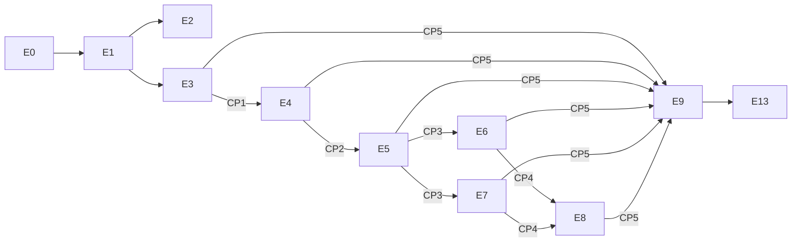

# TripPilot Jira 실행 백로그

> 작성 기준일: 2026-07-11  
> 목표: 2026-11-30 개발 완료 및 데모  
> 상태: Jira 생성 전 Markdown 기준선

이 디렉터리는 TripPilot 기획 정본을 Jira의 `Epic -> Story/Task -> Sub-task` 계층으로 옮긴 실행 백로그다. 제품 요구사항 128개는 원 ID를 1:1로 보존하고, 문서에 흩어진 플랫폼·보안·법무·출시·데모 작업은 별도 Enabler Epic으로 보강한다.

현재 저장소에는 설계 문서만 있고 Code Generation 및 Build/Test는 시작되지 않았다. 따라서 이 문서의 제품 Story와 기술 Story는 모두 최초 Jira 생성 시 `To Do`로 시작한다.

## 1. 문서 구성

| 문서 | Jira 범위 | 항목 수 |
|---|---|---:|
| [E0 플랫폼·품질 기반](./epic-e0-platform.md) | 공통 인프라, CI/CD, 보안, 관측성, 테스트 기반, 후속 확장점 | Enabler Story 10개 + Spike 4개 + Refinement Task 1개 |
| [E1~E4 제품 백로그](./epics-e1-e4.md) | 가입·온보딩, 앱 셸, 숙소·장소, 여행 생성 | Product Story 46개 |
| [E5~E8 제품 백로그](./epics-e5-e8.md) | AI 일정, 현장 실행, Plan-B, 기록·회고 | Product Story 42개 |
| [E9~E12 제품 백로그](./epics-e9-e12.md) | 알림·설정 및 후속 어시스턴트·커뮤니티·공동 편집 | Product Story 40개 |
| [E13 출시·데모 준비](./epic-e13-release-demo.md) | PR1~PR9, 통합 검증, 스토어, 운영, 데모 | Release Task 16개 |

제품 Story 합계는 128개다. E1~E9의 102개만 2026년 11월 MVP 대상이며 E10~E12의 26개는 `Future/Icebox`다.

## 2. 정본과 우선순위

충돌 시 아래 순서로 해석한다.

1. [범위](../scope.md): 1차·후속·제외 경계, PRD 델타, 비개발 선결 과제
2. [유저스토리](../user-stories.md): Story 제목·요지·수용 기준
3. [개발 순서](../units.md): U1~U11 순서, CP1~CP5 계약, 완료 기준
4. [NFR](../nfr.md), [인프라](../infrastructure.md), [아키텍처](../architecture.md): 품질·배포·기술 기준
5. `aidlc/docs/PRD/`: 원 PRD. 위 정본과 충돌하면 위 문서가 우선

Jira Description에는 관련 문서 링크와 `D##`, `Delta(Δ)##`, `N#`, `PR#`, `CP#` 추적 ID를 함께 남긴다. 실제 Jira 이슈 키는 Jira가 발급하며, 이 문서의 `US-*`, `EN-*`, `SPK-*`, `REF-*`, `PR*`, `REL-*`, `ST-*`는 `Requirement ID` 또는 `External ID`에 넣는 추적 ID다.

## 3. Jira 계층과 필드

### 3.1 이슈 유형

| 유형 | 사용 기준 |
|---|---|
| Epic | 사용자 가치 흐름 또는 독립적으로 관리할 플랫폼·출시 결과 |
| Story | 사용자 가치가 있거나 완료 조건을 독립 검증할 수 있는 기술 결과. `Enabler Story`는 Jira의 Story + `enabler` label로 생성 |
| Task | 법무·계약·운영·스토어·데모처럼 사용자 Story 형식이 부적절한 결과. `Release Task`는 Jira의 Task + `release` label로 생성 |
| Sub-task | 한 명이 1~2일 안에 완료하고 증빙할 수 있는 구현·테스트·검토 단위 |
| Spike | 미확정 기술·약관을 타임박스로 조사하며 산출물과 종료 조건이 있는 작업 |
| Bug | 수용 기준 또는 회귀 기준에서 벗어난 동작. 원 Story와 링크 필수 |

### 3.2 필수 필드

| 필드 | 규칙 |
|---|---|
| Summary | `[E5][US-E5-01] 숙소 기준 날짜별 일정 생성` 형식 |
| Parent/Epic | E0~E13 중 하나 |
| Requirement ID | 원 `US-*`, `EN-*`, `SPK-*`, `REF-*`, `PR*`, `REL-*` ID |
| Unit | U1~U11 또는 Cross-cutting/Release |
| Release Scope | `MVP`, `Future`, `Out of Scope` |
| Fix Version | `MVP-2026.11` 또는 `Future` |
| Priority | P0/P1/P2/P3 기준 적용 |
| Story Points | 초기 상대 추정. 13 SP는 아직 Sprint Ready가 아니라는 신호이며 refinement에서 8 SP 이하 Delivery Story로 분할 |
| Target Sprint | S0~S9 또는 `Unscheduled` |
| Component | `mobile`, `server`, `data`, `ai`, `infra`, `security`, `legal`, `qa`, `architecture`, `operations`, `partnerships`, `privacy`, `finance`, `trust-safety`, `analytics`, `demo`, `customer-support`, `release` 중 복수 |
| Dependencies | `blocks`/`is blocked by`와 CP1~CP5, PR1~PR9 게이트 |
| Source | 정본 파일과 관련 결정 ID |
| Test Evidence | Unit/Integration/PBT/E2E/보안/성능 증빙 링크 |
| Demo Scenario | A/B/C 또는 N/A |

문서에 필드를 반복해 늘리지 않도록 Jira 생성 시 다음 상속 규칙을 적용한다. Story heading의 `US-*`가 Requirement ID이고, Unit·Release Scope·Fix Version은 상위 Epic 값을 상속한다. Component는 Epic과 Subtask 역할의 합집합으로 채운다. Test Evidence는 이슈 생성 시 빈 값으로 두되 Done 전 필수이며, Demo Scenario가 명시되지 않은 Story는 `N/A`다.

| Subtask 역할 태그 | Jira Component 변환 |
|---|---|
| `BE` | server |
| `APP`, `Mobile` | mobile |
| `DATA` | data |
| `AI` | ai |
| `INFRA` | infra |
| `OPS`, `RESILIENCE`, `Resilience`, `Observability` | operations, infra |
| `SEC`, `Security` | security |
| `LEGAL` | legal |
| `PRIVACY`, `Privacy` | privacy |
| `QA`, `E2E`, `PBT`, `PERF`, `Load` | qa |
| `ARCH`, `REFINE` | architecture |
| `PARTNER` | partnerships |
| `FINANCE` | finance |
| `T&S` | trust-safety |
| `ANALYTICS` | analytics |
| `DEMO` | demo |
| `CS` | customer-support |
| `RM` | release |
| `Content` | legal |
| `Compliance` | legal, qa |
| `Audit` | security, operations |
| `Realtime` | server |
| `PO` | Component 계산에서 제외하고 상위 Epic 기본값 상속 |

`BE/QA`, `QA/PBT` 같은 복합 역할 태그는 `/`로 분리한 뒤 Component 합집합을 적용한다.

| Epic | 기본 Component |
|---|---|
| E0 | architecture, infra, security, qa |
| E1 | server, mobile, data, security |
| E2 | mobile, server |
| E3 | server, mobile, data, partnerships |
| E4 | server, mobile, data |
| E5 | server, mobile, data, ai |
| E6 | server, mobile, data |
| E7 | server, mobile, data, ai |
| E8 | server, mobile, data, ai |
| E9 | server, mobile, operations |
| E10 | server, mobile, ai |
| E11 | server, mobile, security, trust-safety |
| E12 | server, mobile, security |
| E13 | legal, partnerships, qa, operations, release |

### 3.3 우선순위

| 우선순위 | 의미 |
|---|---|
| P0 | 11월 출시·데모 또는 법적/보안 게이트를 직접 차단 |
| P1 | MVP 필수. 제거하려면 PO의 명시적 범위 변경 승인 필요 |
| P2 | 후속 게이트 또는 MVP 품질에 영향을 주지 않는 개선 |
| P3 | Icebox 아이디어. 일정·추정 약속 없음 |

## 4. 릴리스 범위

| Fix Version | 포함 | 제외 |
|---|---|---|
| `MVP-2026.11` | E0, E1~E9 102 Story, E13, 후속 기능을 막지 않는 최소 확장점 | E10~E12 실제 기능, 영구 Out of Scope |
| `Future` | E10 AI 어시스턴트, E11 커뮤니티, E12 공동 편집 | 11월 일정 약속 없음 |

후속 기능은 구현하지 않지만 다음 확장점은 MVP 설계·코드에 남긴다: D31 LLM 서버 재조회 권한 경계, D16 공개 스냅샷 확장 가능 모델, D30 항목 버전·잠금 확장 가능성, 단계적 제재용 계정 상태, 통합 changelog 스키마.

## 5. Epic 로드맵

| Epic | 범위 | Unit | 초기 SP | Fix Version | 목표 Sprint | 선행 |
|---|---|---|---:|---|---|---|
| E0 플랫폼·품질 기반 | 기술 Enabler | Cross-cutting | 74 | MVP-2026.11 | S0~S9 | 없음 |
| E1 가입·온보딩 | 18 Story | U1 | 90 | MVP-2026.11 | S0~S2 | E0 기반, PR7·PR8 |
| E2 앱 셸·홈·내비게이션 | 6 Story | U2 | 40 | MVP-2026.11 | S1~S3 | E1 세션·온보딩 계약 |
| E3 숙소 탐색·저장·등록 | 11 Story | U3 | 89 | MVP-2026.11 | S2~S4 | E1, PR2·PR4; PR5는 출시 차단 |
| E4 여행 생성·거점·필수 방문지 | 11 Story | U4 | 66 | MVP-2026.11 | S4~S5 | E3 CP1 |
| E5 AI 일정 생성·확정 | 12 Story | U5 | 113 | MVP-2026.11 | S5~S6 | E4 CP2, PR2·PR6 |
| E6 여행 중 현장 실행 | 3 Story | U6 | 21 | MVP-2026.11 | S6~S7 | E5 CP3, PR1·PR7 |
| E7 Plan-B 재계획 | 13 Story | U6 | 110 | MVP-2026.11 | S6~S7 | E5 CP3, PR1·PR3 |
| E8 여행 기록·회고 | 14 Story | U7 | 115 | MVP-2026.11 | S7~S8 | E6/E7 CP4, PR6 |
| E9 알림·마이·설정 | 14 Story | U8 | 80 | MVP-2026.11 | S7~S8 | CP5 전체, PR5·PR7·PR9 |
| E10 AI 어시스턴트 | 8 Story | U9 | 55 | Future | Unscheduled | E5·E6, LLM 비용 게이트 |
| E11 여행자 커뮤니티 | 10 Story | U10 | 68 | Future | Unscheduled | E8, 모더레이션·어드민 게이트 |
| E12 동행 공동 편집 | 8 Story | U11 | 61 | Future | Unscheduled | E5·E6, WebSocket·ADR-0016 게이트 |
| E13 출시·데모 준비 | 16 Task | Release | N/A | MVP-2026.11 | S0~S9 | 전 Epic 및 PR1~PR9 |

## 6. Sprint 역산안

팀 규모와 실측 velocity가 없으므로 아래는 약속이 아니라 역산 기준선이다. MVP 제품 Story는 초기 724 SP, E0 Enabler를 합치면 798 SP다. 여기에 timebox Spike 4개와 Release Task가 추가된다. 11-13 Feature Complete까지 9개 Sprint 평균 약 89 SP가 필요하다. Mobile, Server/AI, Platform/QA의 최소 3개 스트림이 병행한다는 전제이며, S1 종료 시 실측 velocity로 인력·범위·목표일을 다시 결정해야 한다.

| Sprint | 기간 | 목표 | 종료 게이트 |
|---|---|---|---|
| S0 | 07-13~07-24 | E0 기반·REF-01·SPK-04, U1 인증·동의 시작, PR1~PR9 착수 | 개발환경·CI·관측 호스팅·대형 Story Slice 확정 |
| S1 | 07-27~08-07 | U1 핵심 완료, U2 앱 셸, SPK-01 지도 SDK | 인증·세션·동의 계약 동결, PR2·PR4 완료 |
| S2 | 08-10~08-21 | U1 종료, U2 완료 후보, U3 POI·숙소 코어 | 가입→홈→탐색 데모 |
| S3 | 08-24~09-04 | U2 종료, U3 탐색·등록 | E3 기능 완료 후보 |
| S4 | 09-07~09-18 | U3 CP1 동결, U4 여행·거점, SPK-02 일정 성능 | 등록→여행 생성 데모, U5 성능 Go/No-Go |
| S5 | 09-21~10-02 | U4 CP2 동결, U5 C1/C2·솔버, SPK-03 Plan-B | TripContext 계약·하드 제약, U6 성능 Go/No-Go |
| S6 | 10-05~10-16 | 10-09 U5·CP3 동결, 이후 U6 계약·실행 기반 착수 | Case A/B 일정 E2E, U6 착수 승인 |
| S7 | 10-19~10-30 | U6 실행·Plan-B 완료, U7 클라이언트 기반, U8는 CP5 fake 기반 골격만 선행 | 10-30 CP4 동결·현장 실행/재계획 E2E |
| S8 | 11-02~11-13 | 11-06 U7·ReflectionReady 완료, 11-10 U8 CP5 통합 완료, 결함 버퍼 | 11-13 Feature Complete |
| S9 | 11-16~11-27 | 회귀·보안·성능·복원력·UAT·스토어·데모 | 11-20 Code Freeze, 11-24 RC, 11-27 Go/No-Go |
| Demo | 11-30 | 프로덕션 후보 빌드로 시나리오 A/B/C 시연 | 데모 및 결과 기록 |

허용 병행은 U1 이후 U2와 U3, CP4 스키마 동결 후 U6 후반과 U7 클라이언트다. U8의 골격은 일찍 만들 수 있지만 CP5 통합 완료 전 Epic을 Done으로 닫을 수 없다.

## 7. 의존성과 계약

| 계약 | 공급 -> 소비 | Jira 완료 조건 |
|---|---|---|
| CP1 | E3 -> E4 | 등록 숙소·저장 POI 스키마, 공급자 계약 테스트, 거점 왕복 통합 테스트 |
| CP2 | E4 -> E5 | TripContext·시간창·거점·필수 방문지 스키마, 방어적 재검증 테스트 |
| CP3 | E5 -> E6/E7 | plan/current·slot·고정 블록·확정 상태 계약, 불변성 테스트 |
| CP4 | E6/E7 -> E8 | actual·changelog·GPS·종료 이벤트, diff 재생·중복 이벤트 테스트 |
| CP5 | E3/E4/E5/E6/E7/E8 -> E9 | 알림 이벤트 카탈로그, 발송·억제·재계산 통합 테스트 |

### CP5 생산자 티켓

| 이벤트 | 발행 Story | 공급자 완료 조건 |
|---|---|---|
| `StaySaved` | US-E3-04 | 단순 위시리스트 저장 이벤트와 등록 이벤트를 구분하고 outbox·계약 테스트 통과 |
| `StayRegistered` | US-E3-06 | 숙소 ID·명칭·날짜 상태를 원자적으로 발행하고 중복 발행 멱등 검증 |
| `StayLinkedToTrip` | US-E4-03 | 여행·거점 연결 commit과 같은 트랜잭션에서 outbox 기록 |
| `ItineraryConfirmed` | US-E5-12 | 확정 plan version·여행 기간을 발행하고 리마인드 생성 계약 검증 |
| `ItineraryChanged` | US-E5-07 | current version 변경을 발행하고 동일 version 재수신 시 재계산 중복 없음 |
| `TriggerFired` | US-E7-02 | 트리거 사유·심각도·slot·재계획 deep link를 발행하고 억제된 트리거는 미발행 |
| `ReflectionReady` | US-E8-06 | 회고 유형·여행·일자를 발행하고 중복 회고 알림 방지 계약 검증 |

## 8. Definition of Ready

Story는 다음 조건을 모두 만족해야 Sprint에 들어간다.

- [ ] 사용자 가치 또는 기술 결과와 범위 제외가 한 문장으로 명확하다.
- [ ] 원 Requirement ID와 정본 Source가 연결되어 있다.
- [ ] 수용 기준이 테스트 가능한 문장이고 실패·빈 상태·권한 경계가 포함된다.
- [ ] API·이벤트·스키마 변경은 공급자/소비자와 버전 호환 규칙이 합의됐다.
- [ ] 외부 API·법무·계약 게이트와 mock/fallback 방식이 식별됐다.
- [ ] Story가 8 SP를 넘으면 독립 배포 가능한 Delivery Story로 분리한다. 원 Requirement ID는 동일하게 유지하고 suffix로 slice를 구분한다.
- [ ] UX가 필요한 Story는 화면 상태(loading/empty/error/offline/permission)가 준비됐다.
- [ ] 테스트 데이터, 보안·개인정보 영향, 관측 지표가 정의됐다.

## 9. 공통 Definition of Done

- [ ] 모든 수용 기준과 범위 제외를 충족하고 PO가 증빙을 확인했다.
- [ ] 테스트 Subtask에서 실패 테스트(RED)를 먼저 증빙한 뒤 최소 구현(GREEN)과 리팩터링을 수행했다. 문서의 Subtask 나열 순서는 실행 순서가 아니다.
- [ ] Unit, Integration, E2E 테스트가 추가됐고 전체 및 변경 모듈 coverage가 80% 이상이다.
- [ ] 하드 제약은 대상 조합 100%가 통과한다. 이는 코드 coverage 100%를 뜻하지 않는다.
- [ ] Kotlin은 Kotest Property Testing, TypeScript는 fast-check로 해당 속성을 검증하고 실패 seed/shrink를 보존한다.
- [ ] 각 U1~U8 종료 시 SECURITY-01~15, RESILIENCY-01~15, PBT-01~10의 Pass/Fail/N/A와 N/A 근거를 기록한 컴플라이언스 매트릭스를 첨부한다. Fail은 Epic 종료를 차단한다.
- [ ] 입력 스키마 검증, 객체 소유권, rate limit, PII/토큰 비로깅, 시크릿 외부화가 확인됐다.
- [ ] 도메인·상태 변경은 기존 객체를 직접 변경하지 않고 새 불변 객체/사본을 반환하며 회귀 테스트로 확인됐다.
- [ ] Critical/High 보안 이슈가 없고 의존성 스캔·SBOM·라이선스 검사가 통과했다.
- [ ] 외부 호출은 timeout, 멱등 재시도, circuit breaker, fallback, 사용자 고지를 갖춘다.
- [ ] 로그·메트릭·알람 및 상관 ID로 운영에서 결과와 실패를 관측할 수 있다. 단일 모놀리스 MVP의 분산 tracing은 N/A다.
- [ ] 접근성, 로딩·빈 상태·오류·권한 거부·재시도 상태를 검증했다.
- [ ] 관련 CP 계약 테스트와 소비자 통합 테스트가 통과했다.
- [ ] PR 제목·브랜치에 실제 Jira 키가 있고 리뷰·CI가 완료됐다.
- [ ] 정본 문서 또는 ADR 변경이 필요한 경우 같은 PR에서 갱신했다.

## 10. 출시 게이트

| 게이트 | 완료 조건 |
|---|---|
| Feature Complete | E1~E9 Story와 필수 Enabler가 Done, 알려진 P0/P1 Bug 없음 |
| Code Freeze | 회귀·보안·성능·복원력 결과 승인, 이후 변경은 릴리스 오너 승인 |
| RC | 스토어 후보 빌드 서명, DB 마이그레이션·롤백, 백업 설정·복원 runbook과 실행 증빙 또는 승인된 이연 사유, 데모 데이터 고정 |
| Go/No-Go | PR1~PR9 완료, 운영 온콜·대시보드·runbook, 개인정보·스토어 체크 승인 |
| Demo Done | 시나리오 A/B/C 성공, 실패 폴백 시연, 결과와 후속 Bug 기록 |

## 11. 추적성 해석 주의사항

- `US-E09-*` 표기는 정본 ID이므로 `US-E9-*`로 바꾸지 않는다.
- 장소 우선은 Case A, 숙소 우선은 Case B다. `units.md` 일부 오기보다 `overview.md`와 `scenarios.md`를 우선한다.
- 일반 숙소 우선 생성 버튼은 숙소 미등록 시 비활성이다. 다만 장소 우선 전용 온램프는 무숙소 초안 생성을 허용하고 완성 동선으로 숙소 권역을 추천한다.
- `US-E3-06`은 1차 수동 등록이 포함되고 OTA 포스트백 1탭 자동 등록만 Future다.
- `US-E8-13`은 1차 정적 SNS 이미지 내보내기가 포함되고 커뮤니티 게시·EXIF 처리는 Future다.
- `scope.md`의 PR1~PR9와 다른 문서의 P1~P9는 같은 비개발 과제다. Jira에서는 PR1~PR9로 통일한다.
- 지도 정본은 카카오 장소 검색·지오코딩 + 카카오모빌리티 도로 거리 + 네이버 2차 폴백이다. 과거 문서의 TMap 표기는 사용하지 않는다.

## 12. 계획 리스크

11월 일정의 가장 큰 위험은 현재 코드가 없는 상태에서 102개 Product Story와 프로덕션 품질 게이트를 20주 안에 완료해야 한다는 점이다. 다음 조건 중 하나라도 충족되지 않으면 S1 종료 시 범위·인력·날짜를 재협상한다.

- Mobile, Server/AI, Platform/QA의 최소 3개 독립 스트림을 운영할 수 없다.
- PR2·PR4·PR6 같은 외부 계약이 해당 Unit 착수 전에 끝나지 않는다.
- S0~S1 실측 velocity로 남은 MVP 총량을 11-13까지 완료할 수 없다.
- U5 솔버/LLM 5초·20초 목표 또는 U6 Plan-B 10초 목표가 기술 Spike에서 성립하지 않는다.
- CP1~CP5 변경이 동결 후 파괴적으로 발생한다.

일정을 맞추기 위해 보안·테스트·법무·복원력 작업을 삭제해서는 안 된다. 조정이 필요하면 먼저 P1 제품 범위와 데모 범위를 PO가 명시적으로 변경하고, 정본과 Jira를 함께 갱신한다.

## 13. Jira 생성 순서

1. `MVP-2026.11`과 `Future` Fix Version, Component, Requirement ID custom field를 만든다.
2. E0~E13 Epic을 먼저 생성하고 외부 Epic ID와 실제 Jira Key 매핑을 기록한다.
3. EN/SPK/REF, US, PR/REL 항목을 생성해 상위 Epic Key를 연결한다. 문서 상속 규칙으로 Unit·Scope·Fix Version·Component를 채운다.
4. `ST-*`를 생성하고 `ST-<parent external ID>-*` 규칙으로 실제 Parent Key를 연결한다.
5. CP1~CP5와 PR1~PR9를 `blocks`/`is blocked by` 링크로 연결하고 S0~S9 Sprint를 배정한다.
6. 모든 항목은 `To Do`에서 시작한다. 설계 문서는 Source 증빙이지 구현 완료 증빙이 아니다.
7. 생성 후 Epic 14개, 하위 외부 ID 159개(Product Story 128개 포함), Subtask 667개, 중복 0건을 JQL/내보내기로 대조한다.
