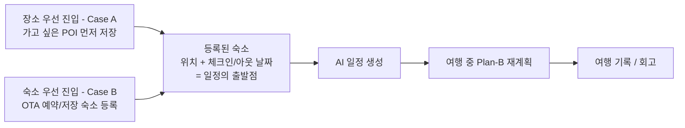

# TripPilot 제품 개요

> 출처: aidlc/docs/PRD/README.md · aidlc/aidlc-docs/inception/requirements/requirements.md · aidlc-docs에서 2026-07-05 추출 · 이후 본 문서가 정본이다.

TripPilot은 자유여행객이 직접 쓰는 **B2C 여행자 슈퍼앱**이다. 여행지·날짜로 숙소를 탐색·저장하되 실제 예약과 결제는 외부 OTA 제휴 링크로 위임하고, 앱 자신은 **'예약 다음'을 잇는다** — AI 일정 생성, 여행 중 Plan-B 재계획, 여행 기록/회고가 중심축이다. 이 문서는 제품이 푸는 문제, 해결 방식, 핵심 가치, 타깃 사용자, 제품 방향(1차 목표·범위), 그리고 실서비스 출시를 위한 운영·법적 선결 과제를 한 곳에 정리한다. 개별 기능의 상세 동작은 각 유닛/기능 문서에서 다룬다(→ [더 읽을 문서](#12-더-읽을-문서)).

---

## 1. 문제 정의 (Problem Statement)

자유여행객은 여행의 나머지 전 과정을 직접 떠안는다. 기존 OTA는 숙소·항공·액티비티를 '예약'하는 데서 멈추고, 일정 앱은 '계획을 한 번 만드는' 데서 멈춘다. 그 사이의 연결과 여행 중·후의 운영은 모두 사용자 몫이다. 묵을 곳을 정하고 나면, 그 숙소를 기준으로 며칠을 어떻게 움직일지, 도중에 틀어지면 어떻게 복구할지, 끝나고 무엇을 남길지를 이어 주는 도구가 없다.

이 공백은 여행 여정에서 4대 단절로 드러난다.

| # | 단절 | 사용자가 겪는 문제 |
|---|---|---|
| 1 | **탐색과 일정의 단절** | 여러 OTA를 오가며 숙소를 비교하지만, 어느 숙소를 고르느냐가 매일의 동선·이동시간·방문 가능한 장소를 어떻게 바꾸는지는 보여주지 않는다. 사용자는 숙소 위치와 체크인/아웃 날짜를 머릿속에 넣고 일정을 수작업으로 짠다. |
| 2 | **계획 생성에서 멈춤** | 일정 앱은 장소 목록을 나열할 뿐, 영업시간·이동시간·하루 시간 예산 같은 제약을 함께 풀어 '실행 가능한 순서'로 정렬해 주지 않는다. |
| 3 | **여행 중 변수에 무방비** | 비·휴무·교통 지연·예약 취소가 생기면, 사용자가 직접 대안을 검색하고 남은 일정을 다시 짜야 한다. 변수 하나에 그날 동선 전체가 무너진다. |
| 4 | **여행 후 기록이 흩어짐** | 사진은 갤러리에, 메모는 메모앱에, 방문한 장소와 이동 경로는 어디에도 남지 않는다. 여행이 끝나면 무엇을 어떤 순서로 다녔는지 재구성하기 어렵다. |

---

## 2. 솔루션 (Solution)

TripPilot은 여행자가 직접 쓰는 앱이다. 여행지·날짜로 숙소를 **탐색·저장**하되, 실제 예약과 결제는 외부 OTA 제휴 링크로 연결한다. 공급은 외부 OTA 제휴 링크로 두고, 앱은 **일정을 짜고, 지키고, 남기는** 데 집중한다.

### 2.1 두 진입 경로 — 어느 쪽으로 들어와도 같은 출발점으로 수렴

여행자가 계획을 시작하는 방식은 둘로 갈린다. TripPilot은 **두 진입 경로를 모두 지원**하되, 어느 쪽으로 들어와도 같은 지점 — **등록된 숙소(위치 + 체크인/아웃 날짜)를 일정의 출발점으로 삼는 상태** — 으로 수렴시킨다. 즉 숙소 탐색과 장소 발굴은 한쪽이 다른 쪽의 일방적 입력값이 아니라 **서로의 입력값**이 된다.

| 진입 경로 | 정의 | 동작 |
|---|---|---|
| **숙소 우선(Case B)** | 숙소를 먼저 정하고 그 위치에 맞춰 갈 곳을 짠다 | 외부 OTA에서 예약했거나 앱에서 저장한 숙소를 '등록'하면, 그 숙소의 **위치와 체크인/아웃 날짜**가 AI 일정 생성의 기준점이 된다. 아직 예약을 확정하지 않은 사용자에게는 숙소 *후보*별로 "이 숙소에 묵으면 당신 취향의 장소까지 평균 이동 N분" 식의 **일정 미리보기**를 제시해, 위치를 잘못 골라 동선이 묶이는 후회를 예약 전에 줄인다. (ADR-0002의 '예약=출발점' 원칙을 '등록된 숙소=출발점'으로 계승) |
| **장소 우선(Case A)** | 가고 싶은 곳을 먼저 모으고 그 동선에 맞는 숙소를 잡는다 | 가고 싶은 장소(POI)를 먼저 저장하면, 그 저장 목록은 여행을 만들 때 **'꼭 갈 곳'(필수 방문지)으로 투입되어 AI 일정 생성의 시드**가 된다. 숙소는 사용자가 직접 탐색·등록하며, 등록 시점부터 숙소 우선 진입과 동일하게 '등록된 숙소=출발점'으로 수렴한다. (숙소 우선만 가정하던 ADR-0002/0004의 사각지대를 메우는 온램프) |

- **역추천은 두지 않는다.** 저장 POI 집합으로부터 숙소 '권역'을 무게중심으로 역추천하는 기능은 두지 않는다(숙소 선택은 사용자가 직접 한다). **단, 일정을 먼저 완성한 뒤 숙소를 나중에 등록**하는 경우에는 완성 동선을 기준으로 한 숙소 추천을 제공한다('AI 일정 생성' 섹션).

### 2.2 '예약 다음'을 잇는 다섯 축

| 축 | 무엇을 하는가 | 근거 |
|---|---|---|
| **AI가 실행 가능한 일정을 짠다** | 등록된 숙소 위치와 체류 기간을 기준으로 취향을 반영해 방문지를 고르고, 영업시간·이동시간·하루 시간 예산 제약을 함께 풀어 날짜별 동선으로 정렬한다. LLM이 취향 해석·선택·설명을, 알고리즘이 순서·시간창·이동시간의 하드 제약 충족과 검증을 맡는 하이브리드 | ADR-0009 |
| **여행 중 변수에 Plan-B를 제시한다** | 날씨·휴무·지연·취소가 발생하면 영향받는 일정을 감지해 대안 후보를 제시하고 남은 동선을 다시 정렬한다. 사용자가 직접 검색·재계획하지 않아도 된다 | — |
| **여행 중 기록을 모은다** | 방문 체크, 사진, 메모를 일정 위에 남길 수 있다 | — |
| **여행 후 회고를 자동 생성한다** | 종료 후 날짜별 기록·지도 경로·회고를 자동으로 정리한다 | — |
| **막힐 때 AI 어시스턴트가 돕는다** | 숙소 탐색·일정·여행 중 전반에서 모달/바텀시트로 대화형 어시스턴트를 열어 "지금 추천 말고 ~조건이면"·"지금까지 한 거 검토해줘"처럼 자연어로 도움받는다. 어시스턴트는 기존 모듈(숙소 탐색·AI 일정 생성·솔버)을 대화로 호출·설명·재질의할 뿐, 실현가능성(영업시간·이동시간·시각) 결정은 솔버가 소유·검증하며 예약·결제는 외부로 위임 | ADR-0008·0015·0012 |

### 2.3 함께·나누는 축 (후속 단계)

- **검증된 동선을 발견하고 공유한다(여행자 커뮤니티).** 다른 여행자가 공개한 일정을 탐색 랜딩에서 둘러보고 읽기전용으로 살펴보며, 마음에 들면 '내 여행으로 가져오기'(원본과 분리된 사본 복제)로 자기 날짜·숙소에 맞춰 편집한다. 자기 일정·기록은 **기본 비공개**이며 명시적으로 공개(캡션·해시태그를 단 게시물형)할 수 있다. 공개 일정에는 좋아요·댓글을 달 수 있는 게시물형 피드이며, **팔로우·구독·스크랩 컬렉션·평판 점수 같은 소셜 그래프는 두지 않는다.**
- **동행자와 함께 일정을 짠다(공동 편집).** 한 여행의 동행자를 초대해 하나의 일정을 함께 실시간으로 편집한다. 변경은 동기화되고, 모든 편집은 솔버 재검증과 변경 이력을 거친다.

---

## 3. 핵심 가치

TripPilot이 사용자에게 주는 가치는 4대 단절을 하나씩 이어 붙이는 데서 나온다.

| 가치 | 어떤 단절을 잇는가 |
|---|---|
| **위치 후회를 예약 전에 줄인다** | 숙소 후보별 일정 미리보기로 "이 숙소면 취향 장소까지 평균 N분"을 보여줘 탐색-일정 단절을 잇는다 |
| **계획을 '실행 가능한 순서'로 만든다** | 영업시간·이동시간·시간 예산을 솔버가 하드 제약으로 풀어, 나열이 아닌 정렬된 동선을 제공한다 |
| **변수에 혼자 무너지지 않는다** | Plan-B가 영향 감지→대안 제시→재정렬을 대신해, 변수 하나에 그날이 무너지는 상황을 막는다 |
| **여행이 기록으로 남는다** | plan/actual/changelog·지도 경로·회고를 자동 정리해, 흩어지던 기억을 한곳에 모은다 |
| **막히면 대화로 푼다** | AI 어시스턴트가 기존 기능을 자연어로 호출·설명·재질의해 학습 부담을 낮춘다 |

---

## 4. 타깃 사용자

- **1차 타깃**: 숙소는 스스로 정하지만 그다음의 일정 설계·현장 대응·기록을 부담스러워하는 **자유여행객(개인 여행자)**. 앱을 직접 사용하는 B2C 사용자다.
- **두 유형을 모두 포용**: 숙소를 먼저 잡는 사람(Case B)과 갈 곳을 먼저 모으는 사람(Case A) 모두 1급 지원한다(→ [2.1](#21-두-진입-경로--어느-쪽으로-들어와도-같은-출발점으로-수렴)).
- **동행 여행자**: 후속 단계의 공동 편집으로 한 여행을 여러 명이 함께 짠다(최대 10명).
- **가입 요건**: 만 14세 이상만 가입(개인정보보호법 정합). 소셜 가입 경로에도 동일 적용한다.
- **비대상(B2B)**: 호스트·PMS·채널매니저 등 공급자 측은 대상이 아니다. TripPilot은 순수 B2C 여행자 앱이다.

세부 페르소나·여정은 [personas.md](./personas.md)·[scenarios.md](./scenarios.md) 참조.

---

## 5. 제품 최종 방향

- **한 문장 정의**: TripPilot은 **'등록된 숙소를 출발점으로 AI가 실행 가능한 일정을 만들고, 여행 중 변수에 Plan-B로 대응하며, 기록·회고로 이어지는' B2C 여행자 슈퍼앱(외부 OTA 예약 연동)**이다.
- **중심축**: AI 일정 생성 + 여행 중 Plan-B 재계획 + 여행 기록/회고. 숙소 탐색은 이 중심축의 **입력값**(등록된 숙소 = 일정의 출발점, ADR-0002 계승)으로 위치한다.
- **1차 출시 지역**: 초기 출시는 **국내(대한민국) 한정·한국어 단일**이며, 이후 단계적으로 확장한다.

---

## 6. 1차 목표: 실서비스 출시 (D01)

| 항목 | 판정 |
|---|---|
| 요청 유형 | New Project (그린필드) |
| 범위 추정 | System-wide — 17개 모듈, 120 유저스토리 전체 |
| 복잡도 | Complex — LLM+솔버 하이브리드, 실시간 협업, 법규 준수, 다수 외부 API |
| 적용 깊이 | Comprehensive |

**1차 목표는 '실서비스 출시'(D01)다.** 프로토타입·데모가 아니라 실제 사용자에게 서비스하는 것을 전제한다. 여기서 두 가지 원칙이 파생된다.

1. **비개발 선결 과제도 요구사항으로 추적한다.** 위치정보법 신고, OTA 제휴 계약 같은 **코드가 아닌 과제**도 '나중에 알아서'가 아니라 정식 요구사항 추적 대상이다(→ [8](#8-비개발-선결-과제--실서비스-출시-요건-p1p9)).
2. **프로덕션 품질 기준을 적용한다.** 코드·아키텍처·보안·복원력을 프로덕션 품질로 만든다. 보안 기준선(SECURITY-01~15) 전체 강제·복원력 기준선(RESILIENCY) 적용·속성 기반 테스트(PBT-01~10) 전체 강제가 전 단계의 차단(blocking) 제약으로 걸린다(상세 → [nfr.md](./nfr.md)).

---

## 7. 1차 범위와 후속 단계 (D03)

1차 출시는 **혼자 계획하는 핵심 여정**(온보딩 → 숙소 → 여행 생성 → AI 일정 → 여행 중 실행 → Plan-B → 기록/회고 → 알림/마이)에 집중한다. 커뮤니티·공동편집·AI 어시스턴트는 **데이터 모델 여지만 확보**한 채 별도 출시 게이트로 분리한다.

### 7.1 1차 범위 — 핵심 여정

| 영역 | 담당 모듈 |
|---|---|
| 앱 셸(스플래시·홈·5탭·장소 우선 진입) | (횡단) |
| 계정·온보딩(가입·약관·취향 7종) | M1 Auth, M2 User Profile |
| 숙소 탐색·저장·등록·OTA 딥링크 | M3, M4, M5 |
| 여행 생성·거점·필수 방문지 | M6 Trip Creation |
| AI 일정 생성(LLM+솔버) | M7 Place Data, M8 Itinerary Generation |
| Plan-B 재계획(수동·자동 트리거) | M9, M10, M11 |
| 여행 중 현장 이용 | **M18 Trip Execution (신규)** |
| 여행 기록·회고 | M12 Travel Archive, M13 AI Reflection |
| 알림·마이페이지·설정 | M14 Notification |

### 7.2 후속 단계 (1차 출시 이후, 별도 출시 게이트)

| 후속 기능 | 모듈 | 1차에 선반영하는 아키텍처 여지 |
|---|---|---|
| AI 어시스턴트 | M16 | LLM 호출 아키텍처(D11)·컨텍스트 권한 경계(D31)를 1차 설계에 반영 |
| 여행자 커뮤니티 | M15 | 공개 스냅샷 모델(D16)·기본 비공개 원칙·모더레이션 인프라 요건을 데이터 모델에 선반영 |
| 동행 공동 편집 | M17 (ADR-0016) | 동기화·잠금 아키텍처(D30)를 확장 가능하게 결정 |

### 7.3 범위 제외 (Out of Scope)

자체 예약·인앱 결제·객실 재고·호스트(B2B)·항공·액티비티·PMS/채널매니저·환불 분쟁·소셜 그래프(팔로우 등)·독립 게시판·항공 지연 자동 반영·AI 자동 예약 변경·여행 영상 생성. **Plan-B는 일정 실행 보조 범위로 한정**하며, 예약 자체의 자동 변경은 포함하지 않는다.

범위의 상세·경계는 [scope.md](./scope.md), 기능별 유닛 나눔은 [units.md](./units.md) 참조.

---

## 8. 비개발 선결 과제 — 실서비스 출시 요건 (P1~P9)

D01(실서비스 출시)에 따라, 출시 전 완료가 필요한 **코드 외 과제**도 요구사항 추적 체계에 포함한다.

| # | 과제 | 관련 |
|---|---|---|
| P1 | **위치기반서비스사업 신고**(위치정보법 제9조) + 위치정보 전문 법무 자문 | ADR-0017, N2 |
| P2 | 국내 지도 API(카카오·TMap·네이버) **약관 검토·계약** — 특히 '사용자 확정 데이터 스냅샷 영구 저장'(D13)의 약관 적합성 법무 확인 | D08, D13 |
| P3 | 기상청 공공데이터포털 **API 활용 신청** | D10 |
| P4 | TourAPI **활용 신청·캐싱 조건 확인** | D09, D13 |
| P5 | OTA **어필리에이트 제휴 계약**(후속 — 1차는 검색 딥링크만이나, 파트너별 딥링크 정책 확인 필요) | D09 |
| P6 | LLM 벤더 **계약·비용 산정** + 개인정보 국외 이전·처리위탁 고지 문안 | D11 |
| P7 | 약관 3종(이용약관·개인정보처리방침·위치기반서비스 약관) **법무 작성** | N2, N3 |
| P8 | 금칙어 기본 사전 확보 | — |
| P9 | 앱스토어·플레이스토어 개발자 계정 및 심사 요건(지원 연락처 등) 준비 | N5 |

---

## 9. 기술 스택 개요 (D02·D04)

1차 목표(실서비스)에 맞춰 확정한 스택은 다음과 같다. 아키텍처의 배경·근거는 [architecture.md](./architecture.md)에서 상세히 다룬다.

| 계층 | 결정 | ID |
|---|---|---|
| 클라이언트 | React Native + Expo (development build + prebuild, 국내 지도 SDK는 config plugin으로 네이티브 모듈 관리) | D02 |
| 백엔드 | Spring Boot + Kotlin | D02 |
| 데이터베이스 | PostgreSQL (관리형 서비스 전제) | D02 |
| 백엔드 아키텍처 | **모듈러 모놀리스** — 17(+1)개 모듈을 단일 배포 단위 내 모듈 경계로 유지. 솔버·알림 스케줄러·Plan-B 폴링 등 비동기 작업도 초기에는 동일 배포 단위 내 워커로 수행하되, 모듈 경계를 지켜 추후 분리 워커 전환이 가능하게 한다 | D04 |
| 지도·장소 | 카카오(장소 검색·지오코딩) + TMap(도로 거리) + 네이버(2차 폴백) | D08 |
| POI 정본 저장 | TourAPI 등 캐싱 허용 공공 소스 + 하이브리드 저장 정책 | D13 |
| 날씨 | 기상청 공공데이터포털(단기예보 + 기상특보) | D10 |
| 푸시 | FCM 단일(iOS 포함 FCM 경유) | D12 |
| LLM | 단일 벤더 관리형 API, 서버 경유, 기능별 모델 티어 분리(취향 해석·재질의=경량, 회고·설명=상위) | D11 |

---

## 10. 운영·선결 참고사항 (Further Notes)

PRD가 '운영 결정' 또는 '선결 과제'로 남긴 항목들이다. 이들은 제품 방향을 이해하는 데 필요한 전제이므로 개요에 함께 싣는다.

### 10.1 외부 연동·데이터 방향

- **외부 OTA 제휴 파트너 선정**: 어떤 OTA(예: Booking.com / Agoda / 야놀자 / 여기어때 등)와 제휴할지는 **운영 결정**으로 남긴다.
- **딥링크 / 수수료 트래킹 방식**: OTA 딥링크 연결 방식과 제휴 수수료(어필리에이트) 트래킹·정산 구조는 **운영 결정**으로 남긴다.
- **외부 예약 등록 방식(확정)**: 사용자가 숙소를 '등록'하는 방식은 두 경로다 — (a) **앱의 외부 OTA 제휴 링크를 통한 예약이 확인되면**(제휴 전환/포스트백으로 확인 가능한 경우) 해당 숙소를 자동으로 등록 후보로 제시해 1탭 등록, (b) 그 외(앱을 거치지 않은 예약·기존 예약·직접 입력)는 **위치·체크인/아웃 수동 입력**으로 등록. **예약번호·메일 연동을 통한 자동 인식은 두지 않는다.**
- **지도·장소 API 선택**: **초기 국내 출시에서는 국내 지도 API(카카오맵·네이버 지도·TMap)를 우선** 채택해 구글 지도 국외반출 규제(공간정보관리법)를 회피하고 국내 도보·거리 산출 품질을 확보한다. 국내 지도 API는 약관상 **응답 데이터 영구 캐싱 금지·실시간 호출·출처 표기** 제약이 있으므로 데이터 모델에 반영한다.
- **날씨 API 선택**: 공공데이터포털 / OpenWeather 중 선택 — 기상청 공공데이터포털로 확정(D10).

### 10.2 법적·규제 선결 과제 (위치정보법 · 국내 지도 API) 🔴 출시 선결

TripPilot은 이용자 본인의 GPS(개인위치정보)를 받아 근처 추천·여행 중 안내·거점 추천을 제공하므로 **「위치정보의 보호 및 이용 등에 관한 법률」상 위치기반서비스사업 신고(제9조) 의무가 있다.** 상세 ADR = ADR-0017. 본 항목은 출시 전 위치정보 전문 법무 자문·방송미디어통신위 사전상담으로 최종 확인한다.

| 항목 | 내용 |
|---|---|
| (a) 신고 주체·전제 | 신고는 방송미디어통신위원회(emsit.go.kr)에 제출하며 **사업자등록(개인사업자 가능)이 사실상 전제**다. 미신고 영업은 형사처벌(제40조) 대상 |
| (b) 면제되지 않는 이유 | **'내 위치만 쓴다' 또는 '위치 처리를 외부 API에 위임한다'는 이유로 신고가 면제되지 않는다.** 의무 귀속 기준은 '누가 이용자에게 위치기반서비스를 제공하느냐'이지 '누가 위치를 연산하느냐'가 아니다. 외부 지도 API를 쓰더라도 TripPilot이 위치기반서비스사업자다. 외부 API는 *측위 인프라 직접 구축*(제5조 허가·등록 — 자체 측위 인프라 사업자 대상)을 면하게 해 줄 뿐, '신고' 부담은 그대로다 |
| (c) 처리 의무 | 개인위치정보 처리에 따른 **이용약관 명시·동의·동의 철회/일시중지·목적달성 후 즉시 파기·수집이용 로그 보존**(제16·18·19·23·24조)을 온보딩 위치 권한·설정 화면에 반영한다(ADR-0010 계승) |
| (d) 지도 API 약관 | 지도는 국내 API(카카오·네이버·TMap)를 우선 채택해 구글 국외반출 규제를 회피하되, **응답 데이터 영구 캐싱 금지·실시간 호출·출처 표기** 약관을 데이터 모델에 반영한다 |
| (e) 이동시간 계산 | 거리 기반 이동시간 계산 방식 자체는 별도 규제가 없으나, 라우팅/장소 좌표를 외부 API에서 받으면 그 API의 캐싱 약관이 적용된다 |

### 10.3 데이터·비용 선결 과제

- **Plan-B 범위**: Plan-B 재계획은 일정 실행을 보조하는 범위로 한정한다(여행 중 POI 휴무·이동 지연 등 대응 보조이며, 예약 자체의 자동 변경은 미포함).
- **외부 데이터 정확도·신선도**: 일정 생성·재계획의 신뢰도는 외부 데이터 품질에 구조적으로 종속된다.
  - (a) **POI 영업시간·당일 임시휴무** — 중소 POI 신선도가 낮고 임시휴무는 지도에 반영되지 않는 구조적 공백
  - (b) **이동시간·이동거리** — 대중교통 노선·환승 같은 실시간 경로 안내는 제공하지 않고, **도로 거리 우선·이동 수단별 안전계수(대기·환승·신호 흡수)를 적용한 거리 기반 추정**으로 산출한다(ADR-0009). 추정은 본질적으로 부정확하므로 단일값이 아닌 범위/추정으로 고지하고, 솔버 시간창에 안전 마진을 두며 자동 트리거 임계를 오차 위로 설정한다. 실제 길안내가 필요하면 외부 지도 앱으로 위임한다(ADR-0012). 거리·좌표 산출용 외부 지도 API 응답 실패 시 직선거리 추정·수동 입력으로 폴백한다(ADR-0011)
  - (c) **OTA 검색·가격·전환** — 어필리에이트 파트너의 API·포스트백 제공 여부에 종속
  - 모두 '미확인 분리·수동 폴백·침묵 실패 금지'(ADR-0011)로 감싸되, **초기 지역의 실제 데이터 커버리지를 정량 게이트(예: 대상 지역 POI 영업시간 필드 채움률·장소 좌표 확보율 임계)로 확인한 뒤 출시**한다. 자동 휴무·영업시간 트리거의 감지 범위는 데이터 커버리지에 비례하며, 미커버 POI는 자동 감지 대신 수동 트리거·미확인 분리로만 대응한다
- **외부 API 호출 비용·빈도·캐싱**: 일정 생성·재계획·자동 트리거는 LLM(취향 해석·설명)과 외부 API(지도·장소·날씨·OTA·경로)를 반복 호출하므로, 출시 전 **호출 비용·rate-limit, 응답 캐싱 정책(가격은 캐싱 금지·정적 콘텐츠는 갱신주기 내 캐싱), 자동 트리거 폴링 빈도**를 설계·산정해야 한다. 특히 Plan-B 자동 트리거(날씨·휴무·이동지연 감지)의 폴링 주기와 LLM 호출 빈도는 비용·배터리·rate-limit과 직결되므로 상한을 둔다.

### 10.4 후속 기능 운영 선결 과제

- **AI 어시스턴트 운영**: 앱 전반 AI 어시스턴트(M16)는 LLM 대화 계층이므로 — (a) LLM 호출 비용·rate-limit(사용자별 빈도 상한·과도 연속 호출 차단), (b) 가드레일 임계(프롬프트 주입·역할 변경·유해 요청 거절, 타 사용자 비공개 데이터·내부 운영 지표 비노출은 컨텍스트 주입 단계의 권한 경계로 강제 — ADR-0015), (c) 대화 이력 보관·정리 정책을 운영 기준으로 정해야 한다.
- **여행자 커뮤니티 운영 정책** (출시 선결 + 운영 결정): 여행자 커뮤니티는 TripPilot을 처음으로 사용자 생성 콘텐츠(UGC)를 다른 사용자에게 노출하는 제품으로 만든다.
  - **UGC를 켜기 위한 모더레이션 최소 인프라는 출시 선결(구현)로 다룬다** — (i) 신고 접수·큐, (ii) '검토 중' 노출 보류 상태(침묵 삭제 금지·작성자 사유 고지, ADR-0011), (iii) 금칙어 기본 사전(닉네임·일정 제목·캡션·댓글 공통), (iv) 차단(양방향 숨김). 이 네 가지가 없으면 부적절 콘텐츠에 무방비이므로 커뮤니티 기능 출시 전에 구현되어 있어야 한다
  - **운영 결정으로 남기는 것은 그 위에서 조정하는 값·도구다** — 신고 처리 SLA, 자동 필터 민감도 임계값, 스팸/도배 빈도 임계값, 좋아요·댓글 알림 묶기(rate-limit) 기준, 운영 검토 콘솔의 도구 수준. (공개 기본값 = 기본 비공개·옵트인, 민감 필드 마스킹 = 정확 숙소 위치 권역화·절대 여행 날짜 상대화·실시간 소재지 비공개)
  - **개인정보 자동 통제의 한계(고지 선결)**: 사진 EXIF GPS는 자동 제거하나, 자유 텍스트(캡션·메모·댓글) 속 PII·사진 픽셀에 찍힌 얼굴·핀 분포로부터의 위치 역추론은 자동 완전 제거가 불가능하므로 best-effort로 처리하고 게시 전 제3자 동의·노출 책임을 사용자에게 고지한다

---

## 11. 제품 요약 (One-liner)

TripPilot은 **'등록된 숙소를 출발점으로 AI가 실행 가능한 일정을 만들고, 여행 중 변수에 Plan-B로 대응하며, 기록·회고로 이어지는' B2C 여행자 슈퍼앱**이다. 1차 출시는 핵심 여정(온보딩→숙소→여행 생성→AI 일정→여행 중 실행→Plan-B→기록/회고→알림/마이) + 국내 한정 + 실서비스 품질이며, 커뮤니티·공동편집·AI 어시스턴트는 데이터 모델 여지만 확보한 채 후속 게이트로 분리한다. 아키텍처는 RN(Expo) + Spring Boot(Kotlin) + PostgreSQL 모듈러 모놀리스이고, 보안·복원력·속성 기반 테스트 기준선이 전 단계 차단 제약으로 적용된다.

---

## 12. 더 읽을 문서

| 문서 | 내용 |
|---|---|
| [personas.md](./personas.md) | 타깃 사용자 페르소나 상세 |
| [epics.md](./epics.md) | 제품을 구성하는 에픽(E1~E12) |
| [scope.md](./scope.md) | 1차 범위·후속 단계·범위 제외의 상세 경계 |
| [architecture.md](./architecture.md) | 모듈러 모놀리스·기술 스택·모듈(M1~M18) 아키텍처 |
| [decisions.md](./decisions.md) | 핵심 결정(D01~D38)·ADR(ADR-0001~0017) 상세 |
| [nfr.md](./nfr.md) | 성능·보안·복원력·테스트 기준(Security/Resiliency/PBT) |
| [units.md](./units.md) | 개발 순서(유닛 U1~U11) |
