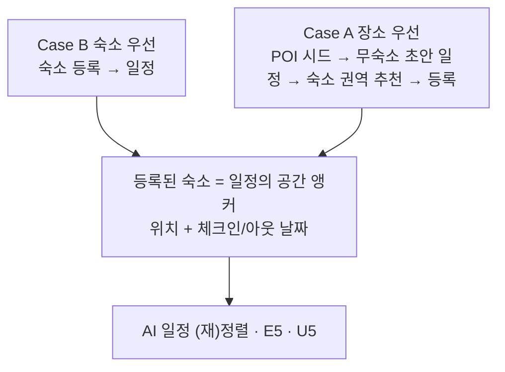

# 시나리오 / 유저 여정

이 문서는 TripPilot을 "누가, 언제, 어떤 순서로, 어떻게 쓰는가"의 관점에서 전체 사용자 여정을 재구성한 것이다. 개별 유저스토리의 수용 기준 전문은 [user-stories.md](./user-stories.md)를, 에픽 정의는 [epics.md](./epics.md)를, 페르소나 정의는 [personas.md](./personas.md)를 정본으로 한다. 본 문서는 그 조각들을 **끝에서 끝까지 이어지는 하나의 흐름**으로 꿰어, 각 단계에서 어떤 페르소나가 어떤 결정을 내리고 시스템이 무엇으로 응답하는지를 서술한다.

---

## 1. 제품이 잇는 것 — 여정의 배경

TripPilot은 여행자가 직접 쓰는 B2C 슈퍼앱이다. 문제의 핵심은 **'예약 다음'이 비어 있다**는 것이다. 어디서 묵을지는 정했지만, 그 숙소를 기준으로 며칠을 어떻게 움직일지, 도중에 틀어지면 어떻게 복구할지, 끝나고 무엇을 남길지를 이어 주는 도구가 없다. 기존 서비스는 네 지점에서 끊긴다.

| 단절 지점 | 기존 한계 | TripPilot이 잇는 방식 |
|---|---|---|
| 탐색 ↔ 일정 | OTA는 숙소·항공·액티비티 '예약'에서 멈춘다. 어느 숙소가 매일의 동선을 어떻게 바꾸는지 안 보여준다 | 등록된 숙소(위치+체크인/아웃)를 일정의 출발점으로 삼아 탐색과 일정을 연결 |
| 계획 생성 | 일정 앱은 장소 목록을 나열할 뿐, 영업시간·이동시간·시간 예산을 함께 풀어 '실행 가능한 순서'로 주지 않는다 | LLM(취향 해석·설명)+솔버(순서·시간창·이동 하드 제약)의 하이브리드 생성 |
| 여행 중 변수 | 비·휴무·지연·취소가 생기면 사용자가 직접 대안을 검색·재계획 | Plan-B — 영향받는 일정 감지 → 대안 후보 제시 → 남은 동선 재정렬 |
| 여행 후 기록 | 사진은 갤러리, 메모는 메모앱, 동선은 어디에도 없다 | 방문 체크·사진·메모를 일정 위에 남기고 종료 후 회고 자동 생성 |

앱은 자체 예약 시스템·인앱 결제·내부 객실 재고를 두지 않는다. 공급은 외부 OTA 제휴 링크로 위임하고, 앱은 **일정을 짜고, 지키고, 남기는** 데 집중한다. 초기 출시는 국내(대한민국)에 한정하며 지도는 국내 API(카카오·네이버·카카오모빌리티)를 우선 채택한다.

---

## 2. 여정의 두 진입 경로 — Case A와 Case B

여행자가 계획을 시작하는 방식은 둘로 갈린다 — **숙소를 먼저 정하느냐(Case B), 갈 곳을 먼저 정하느냐(Case A)**. 두 경로를 **거울처럼 대칭으로 1급(first-class) 지원**하며, 차이는 **숙소를 정하는 시점**(일정보다 먼저냐 나중이냐)뿐이다. 어느 쪽이든 **등록된 숙소를 공간 앵커로 삼은 일정**으로 수렴한다(ADR-0002/0004 — 숙소는 최종 공간 앵커, 확정 시점만 경로마다 다름).

| | Case B — 숙소 우선 | Case A — 장소 우선 |
|---|---|---|
| 성향 | 숙소를 먼저 정하고 그 위치에 맞춰 갈 곳을 짠다 | 갈 곳을 먼저 모아 일정을 짜고, 그 동선에 맞는 숙소를 잡는다 |
| 시작 행동 | 외부 OTA 예약/앱 저장 → 숙소 '등록' | 가고 싶은 POI 저장 → '꼭 갈 곳' 시드 |
| 숙소 시점 | 일정보다 **먼저** | 일정보다 **나중** |
| 시스템 처리 | 숙소의 위치·체크인/아웃 날짜가 일정의 공간 앵커(US-E3-06) | 여행지 중심을 임시 앵커로 **무숙소 초안 일정** 생성, 저장 POI는 필수 방문지 시드(US-E2-05) → 완성 동선(무게중심)으로 **숙소 권역 추천**(US-E5-11) |
| 수렴점 | 등록 숙소 앵커 일정 | 추천 권역에서 숙소 등록 → 그 숙소 앵커로 **재정렬** → 같은 수렴점 |

동선→숙소 방향의 권역 추천은 **장소 우선(Case A)에서만** 열린다 — 숙소 우선(Case B)은 숙소가 이미 앵커이므로 역추천이 불필요하다.

---

## 3. 여정 5단계 개관과 유닛·에픽 매핑

stories.md는 에픽을 **사용자 여정 순(E1→E12)**으로 배열한다. 이를 실제 여행 흐름의 큰 단계로 묶으면 아래와 같다. '가입·온보딩'은 여정의 관문(0단계), '알림·마이·설정'은 여정 전반을 관통하는 횡단 단계다.

| 단계 | 에픽 | 유닛 | 대표 스토리 | 이 단계에서 일어나는 일 | 핵심 결정 |
|---|---|---|---|---|---|
| 0. 가입·온보딩 | E1 | U1 | US-E1-01~18 | 소셜4+이메일 가입, 연령 확인, 약관 3종 동의, 닉네임, 취향 7종(건너뛰기 가능) | D22·N1·N2·N8·D26 |
| 0'. 앱 셸·홈 | E2 | U2 | US-E2-01~06 | 스플래시 분기, 5탭 셸, 홈 대시보드, 장소 우선 온램프, 강제 업데이트 | D21·D22·G5·N3·N4 |
| 1. 숙소·장소 탐색 | E3 | U3 | US-E3-01~11 | 숙소 탐색·필터·상세·위시리스트, OTA 딥링크, 숙소 등록(3경로), 장소 저장 | D09·D15·D17·D25 |
| 2. 여행 생성·거점·필수 방문지 | E4 | U4 | US-E4-01~11 | 여행 생성(날짜·인원·예산·제목), 거점 연결, 다중/다박 거점, 필수 방문지 지정 | D21·D26·D29·G40·N6 |
| 3. AI 일정 생성·확정 | E5 | U5 | US-E5-01~12 | LLM+솔버 하이브리드 생성, 3방식, 시간표/지도 2보기, 편집 재검증, 확정 | D14·D20·D25·D28·D38 |
| 4. 여행 중 실행·Plan-B | E6·E7 | U6 | US-E6-01~03 · US-E7-01~13 | 활성 허브, 도착 체크·체류 측정, 트리거 감지, 대안 재계획, 휴식 모드, GPS 발자취 | D19·D23·D25·D27·D34·D38·D10 |
| 5. 기록·회고 | E8 | U7 | US-E8-01~14 | 방문·사진·메모 기록, plan/actual 대조, 당일 회고·전체 요약·스타일 분석, 공유 카드 | D14·D19·D34·G72·G76 |
| 횡단. 알림·마이·설정 | E9 | U8 | US-E09-01~14 | 단계별 리마인드, Plan-B 알림, 마이페이지, 위치 동의 3층, 계정 관리, 취향 수정 | D12·D18·D32·D34·G100 |
| 후속. 어시스턴트 | E10 | U9 | US-E10-01~08 | 대화형 도우미(호출·재질의·검토·위임·가드레일) — 출시 게이트 별도 | D11·D31·D22 |
| 후속. 커뮤니티 | E11 | U10 | US-E11-01~10 | 공개 일정 둘러보기·가져오기·좋아요·댓글·신고 — 모더레이션 4종 선결 | D16·D18·D35 |
| 후속. 공동 편집 | E12 | U11 | US-E12-01~08 | 동행 초대·권한·실시간 공동 편집·충돌 해소 — WebSocket 선결 | D30·ADR-0016 |

여정을 지탱하는 전역 규칙(모든 단계에 적용):

- **로그인 필수**(D22/Δ5) — 비로그인 진입은 초대·공유 딥링크 수신에만 한정.
- **활성 여행 항상 최대 1개**(D21/Δ3) — 여행 날짜 구간 겹침을 생성 단계에서 차단하므로, 재계획·기록의 대상 여행에 모호성이 없다.
- **소요시간 미표시·거리만**(D25/Δ1) — 어떤 화면·알림에도 차량/도보 예상 소요시간을 표시하지 않고 거리만 표시한다. 실제 길안내는 외부 지도앱에 위임한다.
- **plan/current/actual/changelog 4계열**(D14) — 확정 시점 plan은 불변 스냅샷, 여행 중 변경은 current에만 반영, 실제 방문은 actual, 변경은 changelog. 회고는 plan과 actual을 대조한다.
- **침묵 실패 금지**(ADR-0011) — 외부 데이터 실패 시 미확인 분리·수동 폴백을 제시하고 조용히 실패하지 않는다.

---

## 4. 페르소나 요약 — 세 원형과 보조 액터

TripPilot의 계정 유형은 '여행자' 단일이다. 아래 3원형은 계정 유형이 아니라 **온보딩 취향 7종(스타일·페이스·예산·동행·활동·이동·음식)의 대표 조합**으로, 개인화·Plan-B·기록 기능이 사용자에 따라 어떻게 달리 동작해야 하는지의 설계·테스트 기준점이다. 스토리의 "As a 여행자"는 3원형 모두에 적용되며, 특정 원형 관점이 중요한 스토리만 페르소나 이름을 쓴다. (정의 정본은 [personas.md](./personas.md).)

| | P1 지유 — 꼼꼼 계획형 | P2 민준 — 균형 실속형 | P3 하람 — 즉흥 유연형 |
|---|---|---|---|
| 프로필 | 29세 직장인, 연 3~4회 국내, 2~3주 전 준비 | 35세, 가족(아동 동반), 연 1~2회, 준비 시간 부족 | 24세 대학원생, 혼자/친구 즉흥 주말, 당일 변경 잦음 |
| 취향 축 | 빡빡(5곳+)·관광+미식·대중교통·예산 중간(총액 직접 입력) | 균형(3~4곳)·휴양+자연·렌터카·가족·예산 구간(중간) | 느긋(1~2곳)·카페+야경·도보+대중교통·저가 |
| 목표 | 시간 낭비 없는 검증된 동선 | 최소 입력으로 실패 없는 일정 | 현장에서의 유연함 — 계획은 뼈대만 |
| 불편점 | 직접 검증하는 피로, 계획 어긋날 때 연쇄 붕괴 | 가족 조건 반영 부재, 예산 초과 | 갑작스런 비·휴무 대응 스트레스, 기록 정리 귀찮음 |
| 사용 방식 | 숙소 먼저 등록+필수 방문지 다수 지정, '같이 고르기', 시각 고정 | 취향 일부 건너뛰기, '완전 AI 자동'+LOCK 교체, 숙소 미등록 온램프 | Plan-B 주 사용자, 휴식 모드·즉석 방문, GPS 옵트인, AI 회고 의존 |
| 대표 검증 관점 | 하드 제약 무위반, 확정 해제→재확정(D20), 필수 방문지 한도(G40), 시각 고정 충돌 | 중립 기본값 무실패, 재생성 LOCK 보존(G46), 총액 예산 파생(D26) | Plan-B 10초(D38)·당일 재정렬(C10), 알림 피로 억제(G58), 오프라인 큐(Δ6), 방문 확인(D23) |

**보조 액터 — 운영자(Admin)**: UGC 신고 큐 처리(보류/복원/삭제), 계정 제재, 금칙어 사전 관리를 최소 내부 웹 도구(D35)로 수행한다. 커뮤니티([후속: 커뮤니티]) 출시의 선결 인프라이며, 여정은 §9에서 다룬다.

### 페르소나 ↔ 에픽 관점 매핑

`●` 주 관점 페르소나 / `◐` 부 관점. 이 매트릭스는 각 단계에서 어느 페르소나의 여정이 그 기능을 대표하는지를 나타낸다.

| 에픽 | P1 지유 | P2 민준 | P3 하람 | 운영자 |
|---|---|---|---|---|
| E1 가입·온보딩 | ● 취향 전체 입력 | ◐ 건너뛰기·점진 카드 | ◐ 일괄 탈출구 | — |
| E2 앱 셸·홈 | ● D-day·진행률 | ● 빈 홈 온램프 | ◐ | — |
| E3 숙소 탐색·등록 | ● 탐색→비교→등록 | ● 저장→등록 | ◐ 수동 핀 등록 | — |
| E4 여행 생성·필수 방문지 | ● 필수 방문지·시각 고정 | ● 미등록 온램프 | ◐ 최소 입력 생성 | — |
| E5 AI 일정 생성·확정 | ● 같이 고르기·재확정 | ● 완전 AI+LOCK | ◐ 직접 만들기 | — |
| E6 여행 중 현장 실행 | ◐ | ◐ | ● 도착 체크·여유 시간 | — |
| E7 Plan-B 재계획 | ◐ 고정 제약 보존 | ◐ | ● 수동·자동 트리거 전반 | — |
| E8 기록·회고 | ◐ plan/actual 대조 | ◐ 가족 앨범 | ● GPS 기록·즉석 방문·AI 회고 | — |
| E9 알림·마이·설정 | ● 리마인드 | ◐ 토글 관리 | ◐ 방해금지 | — |
| E10 어시스턴트 [후속] | ● 진행 검토 | ● 재질의 | ◐ | — |
| E11 커뮤니티 [후속] | ◐ 일정 공개 | ◐ 가져오기 | ● 기록 공유 | ● 신고 처리 |
| E12 공동 편집 [후속] | ● 소유자 | ◐ 편집자 | ◐ 뷰어 | — |

---

## 5. 페르소나별 End-to-End 여정

각 페르소나가 5단계를 관통하며 내리는 선택과 시스템 응답을 압축한 여정 지도다. 상세한 '언제/무엇을/시스템 반응'은 §6 대표 시나리오에서 전개한다.

### 5.1 P1 지유 — 꼼꼼 계획형 (Case A 장소 저장 + 숙소 등록 + 시각 고정)

| 단계 | 지유의 선택 | 시스템 응답 |
|---|---|---|
| 온보딩 | 취향 7종 전부 성실히 입력(빡빡·관광+미식·대중교통·예산 총액 직접 입력) | 입력값이 탐색 필터·일정 생성·장소 추천에 반영(US-E1-13). 총액 예산은 여행 생성 시 1박 가격대로 환산(G26) |
| 탐색 | 평소 가고 싶은 명소·맛집을 '장소' 탐색에서 저장(Case A), 이후 마음에 든 숙소를 OTA에서 예약하고 등록 | 저장 POI는 '꼭 갈 곳' 시드로 보관(US-E2-05), 등록 숙소는 위치+체크인/아웃 날짜로 거점화(US-E3-06) |
| 여행 생성 | 등록 숙소에서 날짜 자동 가져오기, 저장 POI를 필수 방문지로 투입, 일부는 '시간 정해두기'로 시각 고정 | 필수 방문지 사본 복제(원본과 독립, G129), 하루 3곳×일수 한도 검사(G40), 시각 고정 블록 등록(US-E4-08) |
| 일정 생성·확정 | '같이 고르기'로 슬롯마다 반경 안 후보를 직접 선택 → 시간표/지도 확인 → 편집 → 확정 | 반경 기준점=직전 확정 슬롯(첫 슬롯=숙소, G48), 편집마다 영업시간·이동·충돌 재검증(D28), 확정 시 plan 동결(D14) |
| 여행 중 | 계획 동선 vs 실제 GPS 발자취를 지도에서 토글 비교하며 계획대로 다니는지 확인 | GPS 옵트인 전제 저빈도 발자취(D34), 고정 제약(숙소·시각 고정 방문지)은 Plan-B에도 불변(US-E7-03) |
| 기록·회고 | plan과 actual을 대조해 계획과 실제 차이를 확인, 리마인드로 일정 관리 | 미방문·추가 방문·순서 변경을 시각 구분(US-E8-04), D-1·당일·개별 일정 리마인드 발송(US-E09-02) |

지유의 여정에서 시스템이 지켜야 할 불변식: **하드 제약(영업시간·이동시간·고정 블록) 무위반**, **확정 해제→재확정 흐름**(D20), **시각 고정 충돌 시 자동 변경 금지·사용자 선택 요구**(US-E5-04).

### 5.2 P2 민준 — 균형 실속형 (숙소 미등록 온램프 + 완전 AI 자동 + 가족 필터)

| 단계 | 민준의 선택 | 시스템 응답 |
|---|---|---|
| 온보딩 | 준비 시간이 부족해 취향 일부만 입력하고 나머지는 '나중에 설정하고 시작' 일괄 탈출(가족·렌터카·예산 구간만) | 온보딩 완료=약관+닉네임(G24), 미설정 취향은 중립 기본값(US-E1-14), 홈·첫 여행 생성 시 점진 설정 카드로 회수(G157) |
| 탐색 | 예산·동행 필터로 숙소를 좁혀 저장했다가 등록 | 예산(총액 파생 가격 필터)·동행 유형을 기본 정렬·필터로 반영(US-E1-13), 편의시설은 채움률 검증 항목만 노출 |
| 여행 생성 | 예약 부담을 미뤄 '숙소 없이 여행 먼저' 생성 후 나중에 등록 | "숙소 미등록" 상태 표시·1급 온램프로 안내(US-E4-02), 숙소는 언제든 추가 등록 가능 |
| 일정 생성·확정 | '완전 AI 자동'으로 초안을 통째로 받고 마음에 안 드는 슬롯만 교체, 나머지는 LOCK | closed-set 그라운딩된 실재 POI만 배치(G115), 예산은 솔버 하드 제약이 아닌 LLM 소프트 가중치(G47), 재생성 시 LOCK·수동 추가 보존(warm-start, G46) |
| 숙소 나중 등록 | 완성 동선에 맞는 숙소 권역을 추천받아 등록 | 동선 무게중심 기반 권역 추천, 특정 숙소 기준 이동 거리 개선 before/after 표시(US-E5-11) |
| 기록·회고 | 가족 앨범처럼 방문 사진을 모으고, 여행 스타일 분석으로 자기 여행 성향 확인 | 방문 10곳 게이트 후 카테고리 분포·이동 반경 분석(US-E8-09), 미달 시 임시 미리보기+진행 게이지 |

민준의 여정에서 시스템이 지켜야 할 불변식: **취향 미설정만으로 일정 생성이 실패하지 않음**, **전체 총액 예산의 파생 계산**(D26), **다중 숙소·가족 동행 필터** 정상 동작.

### 5.3 P3 하람 — 즉흥 유연형 (최소 입력 + Plan-B 주 사용자 + AI 회고)

| 단계 | 하람의 선택 | 시스템 응답 |
|---|---|---|
| 온보딩 | 취향 질문을 대부분 건너뛰고 바로 시작 | 미설정 항목은 중립 기본값(이동 방식 미설정 시 기본 '대중교통', 내부 계산에만 보수적 추정 — D25), 빈 홈에서 첫 행동 강조(US-E1-14) |
| 탐색·생성 | 숙소 없이 여행지·날짜만으로 여행을 만들고 '직접 만들기' 또는 '완전 AI'로 뼈대만 잡음 | 최소 입력 생성 허용. 숙소 우선 생성은 등록 숙소 없으면 비활성+등록 유도하되, **장소 우선(숙소 나중) 온램프는 1급 경로로 무숙소 생성 허용**(US-E5-01·US-E5-11) |
| 여행 중 (핵심) | 비·휴무·체력 저하 같은 변수에 Plan-B를 수동/자동으로 사용, 컨디션에 따라 휴식 모드 전환 | 자동 트리거 감지 → 비차단 배너 제안 → '대안 보기' 명시 탭 후에만 재계획, 10초 내 대안 2~3개(D38), 휴식 모드는 경미 알림 억제·심각 사유만 유지(G54) |
| 기록 | GPS 옵트인으로 자동 발자취를 남기고, 계획에 없던 곳은 '즉석 방문'으로 추가, 오프라인에서도 기록 | 발자취 저빈도 수집·단순화 폴리라인 보존(D34), 즉석 방문은 자유 텍스트 허용(G77), 오프라인 입력 로컬 큐→복구 시 동기화(Δ6) |
| 회고 | 정리가 귀찮아 AI 당일 회고 초안에 의존하고 필요 시 자기 말로 수정 | 방문·사진·메모·변경 이력에서 초안 자동 생성, 생성 실패 시 '방문 N곳·이동 Nkm·사진 N장' 기본 카드 폴백(US-E8-06) |

하람의 여정에서 시스템이 지켜야 할 불변식: **Plan-B 10초 응답·당일 잔여 재정렬**(C10), **트리거 알림 피로 억제**(2회 무시 후 당일 억제, G58), **오프라인 기록 입력 큐**(Δ6), **방문 확정은 항상 사용자 탭**(자동 확정 없음, D23).

---

## 6. 대표 시나리오 (언제 / 무엇을 / 시스템 반응)

각 시나리오는 한 페르소나의 주 관점 흐름을 시간 순서로 구체화한다.

### 시나리오 A — 지유의 계획 여정: Case A 저장 → 시각 고정 → 같이 고르기 → 확정

전제: 지유는 2주 뒤 부산 2박 3일을 준비 중이다. 취향 7종을 이미 입력했고, 평소 저장해 둔 부산 POI(감천문화마을·광안리 카페·자갈치시장 등)가 있다.

| 언제 | 지유가 하는 것 | 시스템 반응 | 근거 |
|---|---|---|---|
| D-14 저녁 | 탐색 랜딩 '장소'에서 부산 POI 추가 저장 | 저장 POI를 이름·카테고리·지역과 함께 목록화, "저장한 장소는 여행 만들 때 '꼭 갈 곳'으로 담겨요" 안내 | US-E2-05 |
| D-14 | 마음에 든 호텔을 상세에서 확인 → [외부 OTA에서 예약하기] | 리뷰·평점은 앱 내부 미표시·OTA 딥링크 위임, 제휴 수수료 고지 후 외부 이동 | US-E3-03·US-E3-05 |
| D-13 (복귀) | OTA에서 예약 완료 후 앱 복귀 | 24시간 내 첫 복귀 시 "방금 본 [숙소명], 예약하셨나요? → 거점으로 등록하기" 핸드오프 카드 1회 노출 | G32 |
| D-13 | 카드에서 숙소 등록(날짜·인원만 입력) | 계정 레벨 풀에 등록, 체크인/아웃 날짜를 거점·기간 기준점으로 확정, [AI 일정 생성하기] 진입점 즉시 노출 | US-E3-06·D15 |
| D-13 | 새 여행 생성, "이 숙소 날짜를 여행 기간으로?" 수락 | 여행 시작/종료일을 숙소 체크인/아웃으로 설정, 날짜 겹침·오늘 이후·최대 30일 검증 통과 | US-E4-05·D21·G42 |
| D-13 | 저장 POI를 체크박스로 필수 방문지 투입, 감천문화마을은 '시간 정해두기'로 첫날 14:00 고정 | 사본 복제(원본 독립), 하루 3곳×일수 한도 검사, 시각 고정 블록 등록 | US-E4-08·G40·G129 |
| D-13 | 생성 방식에서 '같이 고르기' 선택 | 슬롯마다 컨셉/테마+반경 내 후보 제시. 첫 슬롯 기준점=등록 숙소, 이후=직전 확정 슬롯. 반경 밖 후보는 회색 비활성 | US-E5-10·G48 |
| D-13 | 슬롯을 하나씩 선택해 하루를 채움 | 각 배치는 영업시간 내·이동 부등식 충족만 통과, 시각은 솔버 검증값만 표시(LLM 임의 시각 미노출) | US-E5-03 |
| D-13 | 시간표↔지도 보기 전환, 이동 구간 확인 | 동일 데이터 2보기, 구간마다 "약 850m · 도보, 추정"처럼 수단·거리만(소요시간 미표시) | US-E5-06·D25 |
| D-13 | 한 슬롯을 뒤로 옮겨봄 | 클라이언트 경량 검증기가 즉시 재검증, 위반 시 "이동시간 부족" 경고 배지+사유. 차단하지 않되 표시 | US-E5-07·D28 |
| D-13 | '일정 확정' | plan 스냅샷 동결(불변), 확정 일정 화면(읽기 전용·D-day 표시)으로 진입 | US-E5-12·D14 |
| D-1 저녁 | (수동 조작 없음) | "여행 시작 전" 리마인드 자동 발송(서버 스케줄링) | US-E09-02·D32 |

결과: 지유는 자신이 정한 필수 장소와 시각 고정을 지킨 채, 실행 가능성이 검증된 확정 일정을 손에 넣는다.

### 시나리오 B — 민준의 실속 여정: 숙소 미등록 시작 → 완전 AI → 숙소 권역 추천

전제: 민준은 가족(아동 동반)과 강릉 여행을 계획하지만 아직 숙소를 안 정했다. 온보딩에서 가족·렌터카·예산 구간만 설정하고 나머지는 건너뛰었다.

| 언제 | 민준이 하는 것 | 시스템 반응 | 근거 |
|---|---|---|---|
| 시작 | 빈 홈에서 '예약 없이 AI로 먼저 일정 받아보기' 진입 | 장소 우선/숙소 우선과 동등한 1급 온램프로 노출, '결제부터 해야 일정 나온다' 인상 배제 | US-E4-02 |
| 생성 준비 | 여행지(강릉)·날짜만으로 여행 생성, 인원·예산은 온보딩 기본값 제안 수락 | "숙소 미등록" 상태 표시+"숙소를 등록하면 그 위치 기준으로 일정" 안내 | US-E4-02 |
| — | 숙소 없이 AI 일정 생성 시도 | 숙소 우선 생성은 등록 숙소 0개면 비활성. **장소 우선(숙소 나중 등록) 온램프는 1급 경로로 무숙소 생성 허용** | US-E5-01·US-E5-11 |
| 생성 | '완전 AI 자동' 선택 | 취향(가족·렌터카)+미설정 항목 중립 기본값으로 전체 일정 생성. closed-set 실재 POI만, 첫 1일 5초 내 노출·나머지 백그라운드 | US-E5-10·G115·D38 |
| 검토 | 아이에게 안 맞는 슬롯 1개 교체, 마음에 든 3곳 LOCK | 교체는 현재 동선 기준 삽입 가능 시간대만 후보 제시, LOCK 슬롯은 재생성 시 고정 블록으로 보존 | US-E5-07·G46 |
| 숙소 정하기 | '이 동선에 맞는 숙소' 권역 추천 요청 | 방문지 무게중심·평균 이동 거리 기준 권역을 지도로 추천, 후보별 이동 거리 개선 before/after(거리만) | US-E5-11·D25 |
| 등록 | 추천 권역에서 숙소 하나를 OTA 예약 후 등록 | 그 숙소를 출발·복귀 기준점으로 스토리1 생성·재정렬 정상 수행 | US-E5-11·US-E3-06 |
| 재정렬 | 등록 반영 | 등록 숙소 기준으로 날짜별 동선 재정렬, 예산으로 못 채우면 무료/저비용 대안 우선 제시 | US-E5-02·G47 |
| 확정 | 일정 확정 | plan 동결, 가족 동행 필터·예산 파생값이 최종본에 반영 | US-E5-12·D26 |

결과: 민준은 최소 입력으로 무난한 초안을 받고, 동선이 정해진 뒤 숙소를 골라 후회를 줄인다.

### 시나리오 C — 하람의 실행 여정: 비 예보로 Plan-B 자동 트리거되는 하루 (핵심 시나리오)

전제: 하람은 여행 2일차, 오전 카페 → 오후 야외 벽화마을 → 저녁 야경 순서의 확정 일정을 실행 중이다. GPS 기록 옵트인 동의 상태이며, 알림 민감도는 '보통'이다. 활성 여행은 항상 최대 1개(D21)라 대상 일정에 모호성이 없다.

| 언제 | 상황 / 하람이 하는 것 | 시스템 반응 | 근거 |
|---|---|---|---|
| 08:10 | (자동) 서버가 다음 방문지 도착 시간대 날씨 폴링 | 기상청 단기예보에서 오후 방문지 시간대 강수확률 60% 이상 감지 → 자동 트리거 (a) 발화 | US-E7-02·D10·D27 |
| 08:11 | (자동) 트리거 알림 | **비차단 배너/인앱 칩**으로 "비 예보 — 오후 벽화마을 일정 영향" 제안. 자동으로 일정을 바꾸지 않음. 출처(기상청)·감지 시각 표기 | US-E7-02·US-E09-03 |
| 08:11 | 하람은 아직 카페라 무시 | 동일 사유·동일 방문지 알림은 1회만, 닫으면 재노출 안 함. 전역 상한 시간당 2회/하루 8회, 민감도 '보통' | G58·G195 |
| 13:30 | 오후가 되어 배너의 '대안 보기' 명시 탭 | 이때부터 재계획 흐름 시작. 현재 위치(GPS)·현재 시각·남은 예정지·고정 제약(숙소 체크인/아웃·시각 고정 방문지)을 영향 분석 입력으로 수집 | US-E7-01·US-E7-03 |
| 13:30 | '사유=날씨 악화' 확인, 'AI에게 맡기기' 선택 | LLM이 사유 해석 → M7 후보 소싱(저장 장소 우선) → 솔버 검증 통과 후보만. 이미 완료된 방문지는 불변 | US-E7-12·G53 |
| 13:31 | (자동, 10초 내) 대안 후보 제시 | 솔버 검증 통과 대안 2~3개. 날씨 사유이므로 실내 우선. 예: "비 예보가 있어 도보권(약 350m)의 실내 미술관을 제안합니다. 17:30 숙소 체크인까지 90분 여유" | US-E7-04·US-E7-05·D38 |
| 13:31 | 후보별 정보 확인 | 각 후보에 추천 이유·현재 위치로부터 이동 거리·이동 수단·예상 체류·다음 고정 제약까지 여유 시간(거리만, 소요시간 미표시) | US-E7-05·D25 |
| 13:32 | 컨디션이 떨어져 '휴식 모드 전환' 선택, 재개 16:00 입력 | 휴식은 '여행 중' 하위 상태 — 경미 트리거·일정 알림 억제, 심각 사유(기상특보·고정 일정 위협)만 유지 | US-E7-06·G54 |
| 16:00 | 재개 시각 도달 | 알림과 함께 남은 일정 재계산 제안 | US-E7-06·G159 |
| 16:01 | 실내 미술관 대안 선택 | 당일 잔여만 자동 재정렬(warm-start), 넣을 수 없게 된 방문지는 미배치 목록에 보관 | US-E7-07·C10 |
| 16:02 | 변경 전/후 비교 화면 확인 후 '확정' | 총 이동 거리 증감·방문지 수·숙소 복귀 예정 시각 변화 요약(거리만). 확정 시점 솔버 재검증 1회 | US-E7-08·G56 |
| 16:02 | (자동) 확정 반영 | current에만 반영, plan 스냅샷은 불변. changelog에 사유·전/후·시각·트리거 유형(자동) 저장 | US-E7-09·D14·G132 |
| 16:30 | 미술관 도착, 지오펜스 진입 | '도착하셨나요?' 확인 프롬프트. **확정은 항상 사용자 탭**(자동 확정 없음), 포그라운드 한정 감지 | US-E6-01·D23·D27 |
| 이동 중 | 계획 동선 vs 실제 경로 지도 토글 | GPS 발자취(옵트인 전제 저빈도·단순화 폴리라인) 위에 계획 동선 겹쳐 표시, 누적 이동 거리·걸음 수(추정) | US-E7-13·D34·G59 |
| 22:30 | (진행 중 Plan-B 알림 예외) | 방해금지 기본 22~08시라도 여행 '진행 중' Plan-B 알림만 예외 발송 | US-E09-03·G100 |
| 익일 00:00 이후 | (자동) 당일 종료 | DayClosed 이벤트 → 방문·사진·메모·변경 이력으로 당일 회고 초안 자동 생성, 완료 시 알림 | US-E8-06·US-E09-04 |

폴백 경로(같은 하루에 겹칠 수 있는 예외):
- 솔버가 대안 0개 → 빈 화면 대신 **폴백 3종**: "남은 방문지 1개 건너뛰기 / 휴식 모드 전환 / 수동 일정 수정", 사유 한 줄 설명(US-E7-04).
- 외부 API(날씨·영업시간·길찾기) 오류 → 허위 알림 대신 침묵하고 수동 재계획 경로만 유지, 필요 시 수동 일정 수정 화면 폴백(US-E7-02·US-E7-11).
- GPS 사용 불가 → 재계획 차단하지 않고 수동 위치 입력(지도 핀·장소 검색)으로 기준점 대체, 추정 출발지 표기(US-E7-10).

---

## 7. 여정 단계별 상세 흐름

각 단계에서 벌어지는 화면 흐름과 규칙을 유닛·에픽·주요 결정과 함께 정리한다. 스토리 수용 기준 전문은 [user-stories.md](./user-stories.md)를 따른다.

### 7.0 가입·온보딩 (E1 · U1)

여행자가 계정을 만들고 첫 가치(홈·맞춤 일정)까지 막힘없이 도달하게 하는 관문 단계다.

- **진입**: 소셜 4종(Google·Apple·카카오·네이버) 또는 이메일 가입/로그인. 이메일은 인증 링크 방식(유효 24시간, 재발송 분당 1회/일 5회, G22). 앱은 로그인 필수(D22/Δ5).
- **연령 확인**: 만 14세 이상 확인을 필수 단계로, 미만은 가입 차단(N1/D33). 소셜 경로에도 동일 적용.
- **약관 동의(최초 1회)**: 이용약관·개인정보 처리방침·**위치기반서비스 이용약관(분리 필수)** 3종 동의 후 진행(N2/D34). 마케팅 수신은 선택(N8). GPS 여행 기록은 별도 옵트인. 동의 항목·일시·버전 증적 저장. 위치 동의는 3층(OS 권한 × 법정 동의 × GPS 옵트인)으로 독립 관리.
- **닉네임**: '형용사+여행명사+2자리 숫자' 자동 생성(G23), 자동값만으로 통과 가능, 2~20자·금칙어·중복 검증.
- **위치 권한 just-in-time**: 온보딩에서 OS 다이얼로그를 호출하지 않고, 위치가 실제 쓰이는 첫 맥락('내 주변 숙소 탐색'·'여행 중 실행' 첫 진입) 직전에 프리프롬프트 후 요청(N2).
- **취향 7종**: 스타일·페이스·예산·동행·활동·이동·음식. 각 단계 건너뛰기·이전 이동 제공, '나중에 설정하고 시작' 일괄 탈출구(G24). 예산은 **여행 전체 총액(항공 제외)** 기준, 4구간 또는 직접 입력(D26/Δ2). 이동시간은 거리만 표시(D25/Δ1).
- **완료 판정**: 약관 동의+닉네임 통과이면 취향 전량 건너뛰어도 완료(G157). 완료·탈출 즉시 홈으로 진입, 빈 홈에서 첫 행동 강조.
- **약관 개정**: '재동의 필요' 플래그로 중대 변경은 스플래시에서 재동의 강제, 경미 변경은 인앱 공지(N3).

### 7.0' 앱 셸·홈·내비게이션 (E2 · U2)

- **스플래시 분기**: 세션 토큰·약관 버전 확인 → 로그인 / 재동의 / 강제 업데이트(N4) / 온보딩 잔여 / 홈 5분기. 세션 검증 타임아웃 3초, 초과 시 로컬 토큰 미만료면 홈 진입+백그라운드 재검증(G5).
- **홈 대시보드**: 진행 중/예정 여행 카드(D-day·진행률 — 여행 중=방문 체크 비율, 여행 전=D-day만, G3), 빠른 액션('여행 만들기'), '지금 인기 있는 장소'(최근 7일 저장+방문 가중합 일 1회 배치, G2), '여행 추억 다시 보기'. 진행 중 여행은 항상 최대 1개(D21). 빈 홈에는 '예약 없이 AI로 먼저 일정 받아보기'·'가고 싶은 곳 먼저 저장' 온램프 노출.
- **하단 5탭**: 홈·탐색·일정·기록·마이. 탐색 랜딩은 숙소·장소·여행자 일정 3카드(전용 커뮤니티 탭 없음). 탭 상태 세션 보존(G6), 딥링크는 대상 탭 스택에 푸시(G7).
- **몰입 화면 탭바 숨김**: 온보딩·입력 폼·일정 생성/편집·여행 중 실행·Plan-B에서는 탭바 숨김+전체 폭 단일 CTA(US-E2-04).
- **장소 우선 온램프(Case A)**: 탐색 랜딩 '장소'에서 POI 저장 → '이 장소들로 여행 만들기'(US-E2-05).

### 7.1 숙소·장소 탐색 (E3 · U3)

탐색·저장은 앱, 상세·예약·결제는 외부 OTA 딥링크로 위임한다.

- **탐색**: 여행지(또는 '내 주변')만 입력, 날짜·인원은 탐색 단계에서 안 받음. 결과는 TourAPI+지도 장소 검색, OTA는 숙소명 딥링크로만 연결(크롤링 없음, D09). '가격 보기' 탭 시에만 날짜·인원 바텀시트로 라이브 조회(G33).
- **필터·정렬**: 유형·편의시설(채움률 검증 항목만)·대표 가격대·**직선거리**(소요시간 미표시, G34/D25). 정확 가격 의존 가격순 정렬은 없고 '대표 가격대순'으로 대체.
- **상세**: 위치·사진·가격대·시설. 리뷰·평점은 외부 OTA 위임, 누락 필드는 "미확인".
- **위시리스트**: 로그인 계정 귀속(기기 변경에도 유지, D22), 메모 추가.
- **OTA 딥링크**: 숙소명 검색 딥링크+제휴 수수료 고지, 다중 OTA는 내부 숙소 ID로 묶어 선택(D17), 24시간 내 복귀 핸드오프 카드(G32).
- **등록**: 수동 입력 단일 경로가 1차(예약번호·메일 자동 인식 없음, D09). 직접 등록 3경로 — 지도/장소 검색·링크 붙여넣기(화이트리스트 URL 파싱, G31)·지도 핀. 계정 레벨 풀에 저장(D15), 체크아웃<체크인·날짜 누락 시 저장 차단.
- **다중/다박 거점**: 일자별 다른 거점, 같은 여행 거점끼리 날짜 비중첩 검증(D15).

### 7.2 여행 생성·거점·필수 방문지 (E4 · U4)

- **여행 생성**: 여행지·날짜 필수(둘 중 하나 비면 버튼 비활성), 인원·예산 선택. 시작일 오늘 이후·최대 30일·기존 여행 겹침 차단(G42/D21). 날짜별 이용 가능 시각(기본 09:00~21:00) 입력, 첫날 도착·마지막날 출발을 시간 예산에 반영(G119/D29).
- **제목**: 선택 입력·미입력 시 '{여행지} N박M일' 자동 생성, 금칙어 검증(N6).
- **숙소 없이 먼저 생성**: "숙소 미등록" 상태로 생성, 1급 온램프(US-E4-02).
- **거점 연결**: 등록 숙소를 여행에 연결(거점 지정), 숙소 날짜→여행 기간 자동 반영(US-E4-05), 다중 거점 겹침 시 스마트 기본 거점(공백일=직전 숙소)으로 일단 생성 후 비차단 안내(G41).
- **필수 방문지**: 기본은 '아무 때나 꼭 가기'(포함만 보장), '시간 정해두기'로 시각 고정. 저장 POI 체크박스 투입은 사본 복제(원본 독립, G129), 권역 밖은 경고 배지+기본 해제(G158). 하루 3곳×일수 한도(G40). 확정 일정에서 변경 시 전/후 미리보기+승인(G43).
- **고정/필수 블록 유지**: 시각 고정 블록은 재생성 후에도 불변, 포함 고정형은 시각·순서 재계산 가능하나 누락 없음(US-E4-09).

### 7.3 AI 일정 생성·확정 (E5 · U5)

등록 숙소를 출발점으로 LLM(취향 해석·설명)+솔버(선택·순서·시간 보장)가 협업한다.

- **생성 기준**: 등록 숙소 위경도·체크인/아웃을 고정 입력값으로 날짜별 일정 1개씩. 생성·재계획은 서버 연산(D28). 숙소 우선 생성은 숙소 없으면 버튼 비활성, **장소 우선(숙소 나중) 온램프는 1급 경로로 여행지 중심 무숙소 생성 허용**.
- **POI 선별**: LLM이 자유 입력 해석 → 후보 POI에 선호 점수 → OPTW/TOPTW 목적함수 보상. closed-set(후보 ID 밖 선택 불가, G115). 예산은 솔버 하드 제약 아닌 소프트 가중치(G47).
- **시간 하드 제약**: 영업시간 밖 배치 금지, 직전 종료+이동(안전 마진)≤다음 시작 항상 충족. 사용자에게 보이는 시각은 솔버 검증값만. 하루 09:00~21:00 기본, 자정 넘는 활동은 시작한 날 귀속(D29). 체류 시간 정적 테이블(카테고리 20~30종, G51).
- **고정 반영**: 숙소 체크인/아웃·시각 고정 방문지는 변경 불가 블록, 나머지 충돌 없이 배치. 두 고정이 충돌하면 자동 변경 없이 사용자 선택 요구(US-E5-04).
- **설명·2보기**: 추천/배치 이유 LLM 문구(표시용, 시각 불변경). 시간표/지도 2보기, 이동 구간은 수단·거리만(D25).
- **편집 재검증**: 클라이언트 경량 검증기 즉시 검증+저장 시 서버 확정(D28). 위반 시 차단 없이 경고 배지, 저장 시 'AI 자동 보정(시각·순서만, G49)' 또는 '그대로 저장'.
- **생성 3방식**: 완전 AI 자동(LOCK/교체) · 같이 고르기(반경 후보, 기준점=직전 확정 슬롯, G48) · 직접 만들기. 방식 전환 가능, 기존 슬롯 보존.
- **폴백**: 외부 API 실패 시 결정론적 솔버(규칙 점수+TOPTW)로 생성, LLM 설명만 생략. 첫 1일 5초·전체 20초, 취소 시 부분 초안+'이어서 생성'(D38/G161).
- **숙소 나중 등록**: 완성 동선 무게중심 기준 숙소 권역 추천(US-E5-11).
- **확정**: plan 스냅샷 동결(D14), 확정 후 편집은 '편집 중'→저장 후 재확정(D20). 확정본이 여행 중 실행·Plan-B 기준선.

### 7.4 여행 중 실행·Plan-B (E6·E7 · U6)

실행 흐름(M18)과 Plan-B 재계획은 구분된다.

- **활성 허브**: 홈 활성 카드와 수렴하는 단일 허브. 현재/다음 슬롯·진행률.
- **도착·방문**: 지오펜스 진입 시 '도착하셨나요?' 프롬프트, **확정·완료는 항상 사용자 탭**(자동 확정 없음, D23). 포그라운드 한정, 백그라운드 위치 권한 미요청(D27/G62). 방문 완료 시각·실제 체류 측정이 Plan-B 트리거 입력. 스킵·완료 취소 지원.
- **현장 상세·다음 이동**: 현재 장소 영업시간·체류·여유 시간(다음 계획 시작까지 단순 차이, G67), 다음 예정지 거리(추정, 거리만)+외부 지도앱 위임 시트(G66). 혼잡도 1차 제외('미확인', G199).
- **수동/자동 트리거**: 수동은 5사유(날씨·휴무·이동 지연·취소/마감·체력 저하)+'사유 없음'. 자동 4종 — 강수확률 60%+/특보(기상청, D10), 당일 임시 휴무/영업 변경, 이동시간 임계 초과, 체류 초과로 고정 일정 도착 위협. 날씨·휴무는 서버 배치 폴링+푸시, 위치 의존은 클라이언트 포그라운드(D27).
- **알림 억제**: 동일 사유·방문지 1회, 전역 상한 시간당 2/하루 8, 민감도 3단계 ±50%, 2회 무시 시 당일 억제(G58/G195). 제안일 뿐 — '대안 보기' 명시 탭 후에만 재계획.
- **영향 분석·대안**: 현재 위치·시각·남은 예정지·고정 제약 입력, 완료 방문지 불변(US-E7-03). 대안 2~3개 솔버 검증 통과(저장 장소 우선 소싱, G53), 날씨 사유면 실내 우선. 0개면 폴백 3종.
- **선택·재정렬·확정**: 대안 선택/기존 유지/휴식 전환. 당일 잔여만 재정렬(warm-start), 이월 방문지는 미배치 목록(C10). 전/후 비교+확정 시점 재검증(G56), current만 갱신·plan 불변, changelog 저장(D14/G132).
- **폴백**: 위치 수동 입력(US-E7-10), 외부 API 오류 시 수동 일정 수정(US-E7-11).
- **GPS 발자취**: 옵트인 전제 포그라운드 저빈도(1~5분), 단순화 폴리라인만 보존·원시 좌표 파기(D34/G73). 계획 vs 실제 경로 지도 비교(US-E7-13).

### 7.5 기록·회고 (E8 · U7)

- **방문 기록**: 방문 완료/취소 체크, 실제 방문 시각 자동 기록·수정 가능, 실제 체류=완료 체크~다음 체크(plan/actual 구분, D14). 즉석 방문 추가(자유 텍스트 허용, '기타' 처리, G77).
- **사진·메모**: 장소당 최대 20장(클라 압축 5MB/2048px, G75), 업로드 실패 시 로컬 큐→자동 재시도. 메모·체크는 사진 실패와 무관하게 저장.
- **3계열 구분**: plan(불변)·current·actual·changelog 구분 저장·시각 구분 표시(US-E8-04). 그날 기록은 그날 기준 숙소·날짜에 귀속(US-E8-05).
- **회고**: 당일 회고 초안 자동 생성(DayClosed 트리거), 수정·재생성(덮어쓰기 경고 G78). 생성 실패 시 '방문 N곳·이동 Nkm·사진 N장' 기본 카드 폴백.
- **여행 종료·요약**: 종료 트리거=종료일 익일 00:00 자동+수동 버튼(D19/Δ4). 전체 요약은 지도 히어로(방문 순서 핀·날짜별 동선). 총 이동 거리=GPS 실측+미동의 구간 추정 혼합(G72).
- **스타일 분석**: 방문 10곳 게이트, 취향 7종 축 택소노미(G76), 카테고리 분포 막대·이동 반경 지도. 미달 시 임시 미리보기+게이지.
- **다음 여행 개인화**: 누적 기록을 다음 일정 생성·추천 입력으로(동의 시), 미동의 시 제외(US-E8-10).
- **열람·공유**: 마이페이지·기록 탭 열람, 캘린더 탐색(US-E8-14), SNS 공유 카드(정적 이미지, 커뮤니티와 별개, US-E8-13). 오프라인 입력 큐·복구 시 동기화·충돌 해소(Δ6/G74).

### 7.6 알림·마이페이지·설정 (E9 · U8) — 여정 횡단

- **알림**: 숙소 등록/저장 완료, 여행 시작 전(D-1)·당일(기본 8시)·개별 일정 전(기본 30분, 0/15/30/60 선택), Plan-B 재계획, 회고 완료. 서버 스케줄링(D32)·FCM 단일 채널(D12), 일정 변경 시 발송 시각 재계산. 방해금지 기본 22~08시(진행 중 Plan-B만 예외, G100). 종류별 푸시/인앱 독립 토글, 인앱 알림함 90일 보존.
- **마이페이지**: 등록 숙소·예약 기록 관리+출발점 전환(G103), 여행 목록(예정/진행 중/종료, D19), 스타일 요약 카드.
- **설정**: 취향 상시 수정(즉시 반영), 위치 동의 3층 관리(용도 고지·철회 시 영향 고지, D34/G182), 개인정보·계정 관리(데이터 내보내기 JSON·사진 제외, 계정 삭제=소프트+30일 유예 D18), 제휴 고지 토글, 고객지원·정책 문서 재열람(N5), 마케팅 수신 관리(발송은 후속, N8).

---

## 8. 예외·폴백 여정 (침묵 실패 금지)

TripPilot의 신뢰도는 외부 데이터 품질에 구조적으로 종속되므로(POI 영업시간·이동 추정·OTA 전환), 모든 여정은 '미확인 분리·수동 폴백·침묵 실패 금지'(ADR-0011)로 감싼다. 대표 폴백 경로:

| 실패 지점 | 여정 폴백 | 근거 |
|---|---|---|
| 숙소 탐색 데이터 일부 실패 | 가용 결과로 목록 구성+"일부 정보가 빠졌을 수 있어요", 전량 실패 시 재시도+직접 등록 우회 | US-E3-11 |
| 탐색 지역 데이터 부족 | "이 지역은 아직 숙소 정보가 부족해요 — 직접 등록하면 일정을 만들어 드려요" | US-E3-10·D09 |
| 일정 생성 지연·LLM 실패 | 결정론적 솔버 폴백+"기본 모드로 생성", 첫 1일 우선 노출, 취소 시 부분 초안+이어서 생성 | US-E5-09·D38 |
| 모든 생성 경로 실패 | 등록 숙소+시각 고정 필수 방문지만 배치된 최소 일정+"다시 시도" | US-E5-09 |
| 지도·경로 API 실패 | 지도형→시간표형 폴백, 라우팅 실패 시 직선거리 추정/수동 입력 표기 | US-E5-06 |
| Plan-B 대안 0개 | 폴백 3종(1개 건너뛰기/휴식 전환/수동 수정)+사유 설명 | US-E7-04 |
| 외부 API 오류(재계획 중) | 허위 알림 대신 침묵+수동 일정 수정 폴백, 복구 시 자동 검증 재활성 | US-E7-02·US-E7-11 |
| GPS 사용 불가 | 재계획 차단 없이 수동 위치 입력, 없으면 마지막 완료 방문지/등록 숙소 기준 | US-E7-10 |
| 오프라인(여행 중) | 기록 '입력'은 로컬 큐 보장, 일정 '조회'는 온라인 전제(실패 시 오류·재시도만) | US-E8-12·D24/Δ6 |
| 사진 업로드 실패 | 로컬 보관+'업로드 대기'→자동 재시도, 3회 실패 시 수동 재시도 버튼 | US-E8-02 |
| 회고 생성 실패 | 기본 카드(방문 N곳·이동 Nkm·사진 N장), 부분 데이터로 가용 항목만+누락 명시 | US-E8-06 |
| 강제 업데이트 확인 불가 | 스플래시 타임아웃 정책 준용(G5 페일오픈) | US-E2-06 |

---

## 9. 보조·후속 여정

### 9.1 운영자(어드민) 여정 — 커뮤니티 출시 선결

운영자는 커뮤니티([후속: 커뮤니티]) 출시에 앞서 UGC를 다른 사용자에게 노출하기 위한 최소 모더레이션 인프라를 다룬다(D35). 신고 큐 조회 → 보류/복원/삭제 처리, 신고 N회 누적 시 자동 '검토 중' 노출 보류→운영자 확정(G178), 처리 시 작성자에게 사유 고지(침묵 삭제 금지). 계정 제재는 단계적(경고→커뮤니티 정지→전체 정지, G179), 처리 이력 추적 가능(US-E11-10). 이 4종 인프라 — 신고 큐·검토 중 보류·금칙어 사전·차단(양방향 숨김) — 이 커뮤니티 기능 출시의 선결 조건이다.

### 9.2 후속 여정 개요 (출시 게이트 별도)

1차 출시 이후 별도 게이트로 다루는 세 여정. 1차 설계에는 아키텍처 여지만 반영한다.

- **AI 어시스턴트 (E10 · U9)**: 주요 화면 FAB(✦)로 대화형 도우미 호출 → 현재 컨텍스트 자동 전달·표기 → 대화형 재질의(티키타카) → "지금까지 한 거 검토해줘" 진행 검토 → 액션 위임(어시스턴트 단독 확정 금지 — 실현가능성 판단·확정은 항상 솔버 소유). 가드레일: 타 사용자 비공개 데이터는 프롬프트 거절이 아닌 **서버 재조회 권한 경계**로 구조적 차단(D31), LLM 실패해도 비대화형 흐름으로 완결(ADR-0011). 로그인 필수(D22/Δ5).
- **여행자 커뮤니티 (E11 · U10)**: 공개 일정 둘러보기(피드형·읽기전용) → 상세 보기(게시 시점 스냅샷, D16) → 작성자 프로필 → '내 여행으로 가져오기'(원본과 분리된 사본 복제, 내 날짜 입력 필수) → 좋아요·댓글 → 신고·숨기기(양방향 차단). 자기 일정은 기본 비공개·명시적 옵트인 공개, 숙소 위치 권역 마스킹·날짜 상대화. 소셜 그래프(팔로우 등)는 두지 않는다.
- **동행 공동 편집 (E12 · U11)**: 동행자 초대(링크/계정, 최대 10명) → 권한(소유자/편집자/뷰어, 서버 강제) → 항목 단위 잠금 동시 편집·동기화(서버 권위+낙관적 잠금, WebSocket, 수렴 목표 3초, D30) → 충돌 해소(침묵 덮어쓰기 금지) → 솔버 재검증 → 변경 이력. 커뮤니티 복제와 구분되는 비공개 협업이며 ADR-0016 게이트를 거친다.

---

## 10. 관련 문서

- 제품 개요: [overview.md](./overview.md)
- 페르소나: [personas.md](./personas.md)
- 에픽: [epics.md](./epics.md)
- 유저스토리(수용 기준 정본): [user-stories.md](./user-stories.md)
- 범위: [scope.md](./scope.md)
- 아키텍처: [architecture.md](./architecture.md) · 도메인 모델: [domain.md](./domain.md) · 주요 흐름: [flows.md](./flows.md)
- 핵심 결정/ADR: [decisions.md](./decisions.md) · NFR 기준: [nfr.md](./nfr.md) · 인프라: [infrastructure.md](./infrastructure.md)
- 개발 순서: [units.md](./units.md) · 용어집: [glossary.md](./glossary.md)
- 유닛 상세: [units/u1-foundation.md](./units/u1-foundation.md) · [units/u2-appshell.md](./units/u2-appshell.md) · [units/u3-place-stay.md](./units/u3-place-stay.md) · [units/u4-trip.md](./units/u4-trip.md) · [units/u5-itinerary.md](./units/u5-itinerary.md) · [units/u6-execution.md](./units/u6-execution.md) · [units/u7-archive.md](./units/u7-archive.md) · [units/u8-notification.md](./units/u8-notification.md)
