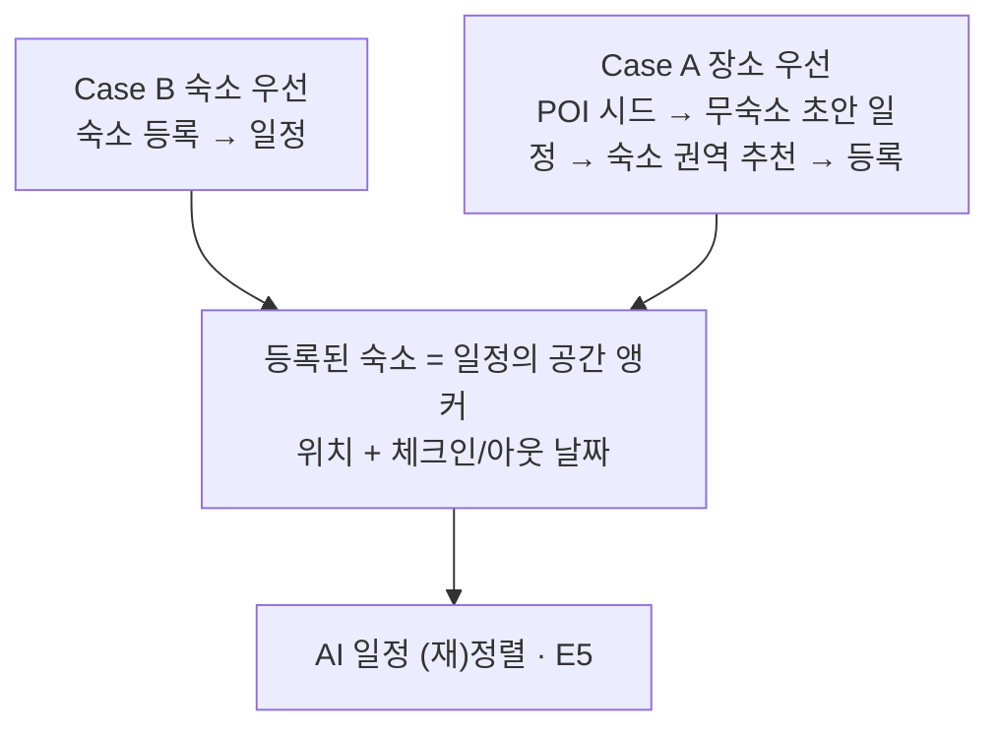
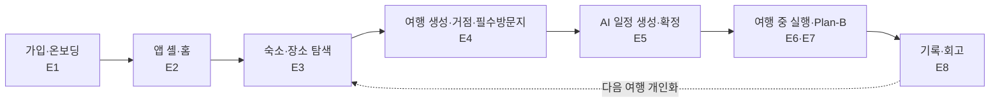

# 시나리오 / 유저 여정

이 문서는 TripPilot을 "누가, 언제, 어떤 순서로, 어떻게 쓰는가"의 관점에서 사용자 여정을 **끝에서 끝까지 이어지는 하나의 흐름**으로 꿴다. 각 단계에서 어떤 페르소나가 어떤 결정을 내리고 시스템이 무엇으로 응답하는지를 시간 순서로 서술하는 것이 이 문서의 고유한 역할이다.

배경 정의는 다른 문서를 정본으로 한다 — 제품이 푸는 문제와 두 진입 경로는 [overview.md](./overview.md), 페르소나는 [personas.md](./personas.md), 에픽별 포함 범위는 [epics.md](./epics.md), 스토리 수용 기준은 [user-stories.md](./user-stories.md)를 따른다.

---

## 1. 여정을 지탱하는 전제

TripPilot은 '예약 다음'이 비어 있다는 문제를 푼다. 탐색과 일정, 계획과 실행, 실행과 기록 사이의 네 단절을 잇는 것이 제품의 골자다(→ [overview.md](./overview.md) §1~2).

여행자가 계획을 시작하는 방식은 둘로 갈린다. **숙소를 먼저 정하는 Case B**와 **갈 곳을 먼저 정하는 Case A**이며, 둘은 대칭으로 1급 지원된다. 차이는 숙소를 정하는 시점뿐이고, 어느 쪽이든 **등록된 숙소를 공간 앵커로 삼은 일정**으로 수렴한다. 동선에서 숙소를 역추천하는 권역 추천은 Case A에서만 열린다 — Case B는 숙소가 이미 앵커이므로 불필요하다.

여정 전반에 걸리는 전역 규칙은 다섯 가지다.

- **로그인 필수** — 비로그인 진입은 초대·공유 딥링크 수신에만 한정.
- **활성 여행 항상 최대 1개** — 여행 날짜 구간 겹침을 생성 단계에서 차단하므로, 재계획·기록의 대상 여행에 모호성이 없다.
- **소요시간 미표시·거리만** — 어떤 화면·알림에도 차량/도보 예상 소요시간을 표시하지 않는다. 실제 길안내는 외부 지도앱에 위임한다.
- **plan/current/actual/changelog 4계열** — 확정 시점 plan은 불변 스냅샷, 여행 중 변경은 current에만 반영, 실제 방문은 actual, 변경은 changelog. 회고는 plan과 actual을 대조한다.
- **침묵 실패 금지** — 외부 데이터 실패 시 미확인 분리·수동 폴백을 제시하고 조용히 실패하지 않는다.

---

## 2. 여정 5단계 개관

에픽은 사용자 여정 순(E1→E12)으로 배열된다. 이를 실제 여행 흐름의 큰 단계로 묶으면 아래와 같다. '가입·온보딩'은 여정의 관문(0단계), '알림·마이·설정'은 여정 전반을 관통하는 횡단 단계다.

| 단계 | 에픽 | 스토리 | 이 단계에서 일어나는 일 |
|---|---|---|---|
| 0. 가입·온보딩 | E1 | US-E1-01~18 | 소셜4+이메일 가입, 연령 확인, 약관 3종 동의, 닉네임, 취향 7종(건너뛰기 가능) |
| 0'. 앱 셸·홈 | E2 | US-E2-01~06 | 스플래시 분기, 5탭 셸, 홈 대시보드, 장소 우선 온램프, 강제 업데이트 |
| 1. 숙소·장소 탐색 | E3 | US-E3-01~11 | 숙소 탐색·필터·상세·위시리스트, OTA 딥링크, 숙소 등록(3경로), 장소 저장 |
| 2. 여행 생성·거점·필수 방문지 | E4 | US-E4-01~11 | 여행 생성(날짜·인원·예산·제목), 거점 연결, 다중/다박 거점, 필수 방문지 지정 |
| 3. AI 일정 생성·확정 | E5 | US-E5-01~12 | LLM+솔버 하이브리드 생성, 3방식, 시간표/지도 2보기, 편집 재검증, 확정 |
| 4. 여행 중 실행·Plan-B | E6·E7 | US-E6-01~03 · US-E7-01~13 | 활성 허브, 도착 체크·체류 측정, 트리거 감지, 대안 재계획, 휴식 모드, GPS 발자취 |
| 5. 기록·회고 | E8 | US-E8-01~14 | 방문·사진·메모 기록, plan/actual 대조, 당일 회고·전체 요약·스타일 분석, 공유 카드 |
| 횡단. 알림·마이·설정 | E9 | US-E09-01~14 | 단계별 리마인드, Plan-B 알림, 마이페이지, 위치 동의 3층, 계정 관리, 취향 수정 |
| 후속. 어시스턴트 | E10 | US-E10-01~08 | 대화형 도우미 — 출시 게이트 별도 |
| 후속. 커뮤니티 | E11 | US-E11-01~10 | 공개 일정 둘러보기·가져오기·좋아요·댓글·신고 |
| 후속. 공동 편집 | E12 | US-E12-01~08 | 동행 초대·권한·실시간 공동 편집·충돌 해소 |

각 단계에서 무엇을 만들고 무엇을 제외하는지는 [epics.md](./epics.md)의 에픽별 '포함 범위'가 정본이다.

---

## 3. 페르소나별 End-to-End 여정

3원형(P1 지유 꼼꼼 계획형 · P2 민준 균형 실속형 · P3 하람 즉흥 유연형)과 보조 액터 운영자의 정의·취향 축·에픽 관점 매트릭스는 [personas.md](./personas.md)가 정본이다. 여기서는 각 페르소나가 5단계를 관통하며 내리는 선택과 시스템 응답만 압축한다.

### 3.1 P1 지유 — 꼼꼼 계획형 (Case A 장소 저장 + 숙소 등록 + 시각 고정)

| 단계 | 지유의 선택 | 시스템 응답 |
|---|---|---|
| 온보딩 | 취향 7종 전부 성실히 입력(빡빡·관광+미식·대중교통·예산 총액 직접 입력) | 입력값이 탐색 필터·일정 생성·장소 추천에 반영. 총액 예산은 여행 생성 시 1박 가격대로 환산 |
| 탐색 | 평소 가고 싶은 명소·맛집을 '장소' 탐색에서 저장(Case A), 이후 마음에 든 숙소를 OTA에서 예약하고 등록 | 저장 POI는 '꼭 갈 곳' 시드로 보관, 등록 숙소는 위치+체크인/아웃 날짜로 거점화 |
| 여행 생성 | 등록 숙소에서 날짜 자동 가져오기, 저장 POI를 필수 방문지로 투입, 일부는 '시간 정해두기'로 시각 고정 | 필수 방문지 사본 복제(원본과 독립), 하루 3곳×일수 한도 검사, 시각 고정 블록 등록 |
| 일정 생성·확정 | '같이 고르기'로 슬롯마다 반경 안 후보를 직접 선택 → 시간표/지도 확인 → 편집 → 확정 | 반경 기준점=직전 확정 슬롯(첫 슬롯=숙소), 편집마다 영업시간·이동·충돌 재검증, 확정 시 plan 동결 |
| 여행 중 | 계획 동선 vs 실제 GPS 발자취를 지도에서 토글 비교하며 계획대로 다니는지 확인 | GPS 옵트인 전제 저빈도 발자취, 고정 제약(숙소·시각 고정 방문지)은 Plan-B에도 불변 |
| 기록·회고 | plan과 actual을 대조해 계획과 실제 차이를 확인, 리마인드로 일정 관리 | 미방문·추가 방문·순서 변경을 시각 구분, D-1·당일·개별 일정 리마인드 발송 |

지유의 여정에서 시스템이 지켜야 할 불변식: **하드 제약(영업시간·이동시간·고정 블록) 무위반**, **확정 해제 후 재확정 흐름**, **시각 고정 충돌 시 자동 변경 금지·사용자 선택 요구**(US-E5-04).

### 3.2 P2 민준 — 균형 실속형 (숙소 미등록 온램프 + 완전 AI 자동 + 가족 필터)

| 단계 | 민준의 선택 | 시스템 응답 |
|---|---|---|
| 온보딩 | 준비 시간이 부족해 취향 일부만 입력하고 나머지는 '나중에 설정하고 시작' 일괄 탈출(가족·렌터카·예산 구간만) | 온보딩 완료=약관+닉네임, 미설정 취향은 중립 기본값, 홈·첫 여행 생성 시 점진 설정 카드로 회수 |
| 탐색 | 예산·동행 필터로 숙소를 좁혀 저장했다가 등록 | 예산(총액 파생 가격 필터)·동행 유형을 기본 정렬·필터로 반영, 편의시설은 채움률 검증 항목만 노출 |
| 여행 생성 | 예약 부담을 미뤄 '숙소 없이 여행 먼저' 생성 후 나중에 등록 | "숙소 미등록" 상태 표시·1급 온램프로 안내, 숙소는 언제든 추가 등록 가능 |
| 일정 생성·확정 | '완전 AI 자동'으로 초안을 통째로 받고 마음에 안 드는 슬롯만 교체, 나머지는 LOCK | 후보 목록 안의 실재 POI만 배치, 예산은 솔버 하드 제약이 아닌 추천 소프트 가중치, 재생성 시 LOCK·수동 추가 보존 |
| 숙소 나중 등록 | 완성 동선에 맞는 숙소 권역을 추천받아 등록 | 동선 무게중심 기반 권역 추천, 특정 숙소 기준 이동 거리 개선 before/after 표시(US-E5-11) |
| 기록·회고 | 가족 앨범처럼 방문 사진을 모으고, 여행 스타일 분석으로 자기 여행 성향 확인 | 방문 10곳 게이트 후 카테고리 분포·이동 반경 분석, 미달 시 임시 미리보기+진행 게이지 |

민준의 여정에서 시스템이 지켜야 할 불변식: **취향 미설정만으로 일정 생성이 실패하지 않음**, **전체 총액 예산의 파생 계산**, **다중 숙소·가족 동행 필터** 정상 동작.

### 3.3 P3 하람 — 즉흥 유연형 (최소 입력 + Plan-B 주 사용자 + AI 회고)

| 단계 | 하람의 선택 | 시스템 응답 |
|---|---|---|
| 온보딩 | 취향 질문을 대부분 건너뛰고 바로 시작 | 미설정 항목은 중립 기본값(이동 방식 미설정 시 기본 '대중교통', 내부 계산에만 보수적 추정), 빈 홈에서 첫 행동 강조 |
| 탐색·생성 | 숙소 없이 여행지·날짜만으로 여행을 만들고 '직접 만들기' 또는 '완전 AI'로 뼈대만 잡음 | 최소 입력 생성 허용. 숙소 우선 생성은 등록 숙소 없으면 비활성+등록 유도하되, **장소 우선(숙소 나중) 온램프는 1급 경로로 무숙소 생성 허용**(US-E5-01·US-E5-11) |
| 여행 중 (핵심) | 비·휴무·체력 저하 같은 변수에 Plan-B를 수동/자동으로 사용, 컨디션에 따라 휴식 모드 전환 | 자동 트리거 감지 → 비차단 배너 제안 → '대안 보기' 명시 탭 후에만 재계획, 10초 내 대안 2~3개, 휴식 모드는 경미 알림 억제·심각 사유만 유지 |
| 기록 | GPS 옵트인으로 자동 발자취를 남기고, 계획에 없던 곳은 '즉석 방문'으로 추가, 오프라인에서도 기록 | 발자취 저빈도 수집·단순화 경로만 보존, 즉석 방문은 자유 텍스트 허용, 오프라인 입력 로컬 큐→복구 시 동기화 |
| 회고 | 정리가 귀찮아 AI 당일 회고 초안에 의존하고 필요 시 자기 말로 수정 | 방문·사진·메모·변경 이력에서 초안 자동 생성, 생성 실패 시 '방문 N곳·이동 Nkm·사진 N장' 기본 카드 폴백 |

하람의 여정에서 시스템이 지켜야 할 불변식: **Plan-B 10초 응답·당일 잔여 재정렬**, **트리거 알림 피로 억제**(2회 무시 후 당일 억제), **오프라인 기록 입력 큐**, **방문 확정은 항상 사용자 탭**(자동 확정 없음).

---

## 4. 대표 시나리오 (언제 / 무엇을 / 시스템 반응)

각 시나리오는 한 페르소나의 주 관점 흐름을 시간 순서로 구체화한다.

### 시나리오 A — 지유의 계획 여정: Case A 저장 → 시각 고정 → 같이 고르기 → 확정

전제: 지유는 2주 뒤 부산 2박 3일을 준비 중이다. 취향 7종을 이미 입력했고, 평소 저장해 둔 부산 POI(감천문화마을·광안리 카페·자갈치시장 등)가 있다.

| 언제 | 지유가 하는 것 | 시스템 반응 | 근거 |
|---|---|---|---|
| D-14 저녁 | 탐색 랜딩 '장소'에서 부산 POI 추가 저장 | 저장 POI를 이름·카테고리·지역과 함께 목록화, "저장한 장소는 여행 만들 때 '꼭 갈 곳'으로 담겨요" 안내 | US-E2-05 |
| D-14 | 마음에 든 호텔을 상세에서 확인 → [외부 OTA에서 예약하기] | 리뷰·평점은 앱 내부 미표시·OTA 딥링크 위임, 제휴 수수료 고지 후 외부 이동 | US-E3-03·US-E3-05 |
| D-13 (복귀) | OTA에서 예약 완료 후 앱 복귀 | 24시간 내 첫 복귀 시 "방금 본 [숙소명], 예약하셨나요? → 거점으로 등록하기" 핸드오프 카드 1회 노출 | US-E3-05 |
| D-13 | 카드에서 숙소 등록(날짜·인원만 입력) | 계정 레벨 풀에 등록, 체크인/아웃 날짜를 거점·기간 기준점으로 확정, [AI 일정 생성하기] 진입점 즉시 노출 | US-E3-06 |
| D-13 | 새 여행 생성, "이 숙소 날짜를 여행 기간으로?" 수락 | 여행 시작/종료일을 숙소 체크인/아웃으로 설정, 날짜 겹침·오늘 이후·최대 30일 검증 통과 | US-E4-05 |
| D-13 | 저장 POI를 체크박스로 필수 방문지 투입, 감천문화마을은 '시간 정해두기'로 첫날 14:00 고정 | 사본 복제(원본 독립), 하루 3곳×일수 한도 검사, 시각 고정 블록 등록 | US-E4-08 |
| D-13 | 생성 방식에서 '같이 고르기' 선택 | 슬롯마다 컨셉/테마+반경 내 후보 제시. 첫 슬롯 기준점=등록 숙소, 이후=직전 확정 슬롯. 반경 밖 후보는 회색 비활성 | US-E5-10 |
| D-13 | 슬롯을 하나씩 선택해 하루를 채움 | 각 배치는 영업시간 내·이동 부등식 충족만 통과, 시각은 솔버 검증값만 표시(LLM 임의 시각 미노출) | US-E5-03 |
| D-13 | 시간표↔지도 보기 전환, 이동 구간 확인 | 동일 데이터 2보기, 구간마다 "약 850m · 도보, 추정"처럼 수단·거리만(소요시간 미표시) | US-E5-06 |
| D-13 | 한 슬롯을 뒤로 옮겨봄 | 즉시 재검증, 위반 시 "이동시간 부족" 경고 배지+사유. 차단하지 않되 표시 | US-E5-07 |
| D-13 | '일정 확정' | plan 스냅샷 동결(불변), 확정 일정 화면(읽기 전용·D-day 표시)으로 진입 | US-E5-12 |
| D-1 저녁 | (수동 조작 없음) | "여행 시작 전" 리마인드 자동 발송(서버 스케줄링) | US-E09-02 |

결과: 지유는 자신이 정한 필수 장소와 시각 고정을 지킨 채, 실행 가능성이 검증된 확정 일정을 손에 넣는다.

### 시나리오 B — 민준의 실속 여정: 숙소 미등록 시작 → 완전 AI → 숙소 권역 추천

전제: 민준은 가족(아동 동반)과 강릉 여행을 계획하지만 아직 숙소를 안 정했다. 온보딩에서 가족·렌터카·예산 구간만 설정하고 나머지는 건너뛰었다.

| 언제 | 민준이 하는 것 | 시스템 반응 | 근거 |
|---|---|---|---|
| 시작 | 빈 홈에서 '예약 없이 AI로 먼저 일정 받아보기' 진입 | 장소 우선/숙소 우선과 동등한 1급 온램프로 노출, '결제부터 해야 일정 나온다' 인상 배제 | US-E4-02 |
| 생성 준비 | 여행지(강릉)·날짜만으로 여행 생성, 인원·예산은 온보딩 기본값 제안 수락 | "숙소 미등록" 상태 표시+"숙소를 등록하면 그 위치 기준으로 일정" 안내 | US-E4-02 |
| — | 숙소 없이 AI 일정 생성 시도 | 숙소 우선 생성은 등록 숙소 0개면 비활성. **장소 우선(숙소 나중 등록) 온램프는 1급 경로로 무숙소 생성 허용** | US-E5-01·US-E5-11 |
| 생성 | '완전 AI 자동' 선택 | 취향(가족·렌터카)+미설정 항목 중립 기본값으로 전체 일정 생성. 후보 목록 안의 실재 POI만, 첫 1일 5초 내 노출·나머지 백그라운드 | US-E5-10 |
| 검토 | 아이에게 안 맞는 슬롯 1개 교체, 마음에 든 3곳 LOCK | 교체는 현재 동선 기준 삽입 가능 시간대만 후보 제시, LOCK 슬롯은 재생성 시 고정 블록으로 보존 | US-E5-07 |
| 숙소 정하기 | '이 동선에 맞는 숙소' 권역 추천 요청 | 방문지 무게중심·평균 이동 거리 기준 권역을 지도로 추천, 후보별 이동 거리 개선 before/after(거리만) | US-E5-11 |
| 등록 | 추천 권역에서 숙소 하나를 OTA 예약 후 등록 | 그 숙소를 출발·복귀 기준점으로 일정 생성·재정렬 정상 수행 | US-E5-11·US-E3-06 |
| 재정렬 | 등록 반영 | 등록 숙소 기준으로 날짜별 동선 재정렬, 예산으로 못 채우면 무료/저비용 대안 우선 제시 | US-E5-02 |
| 확정 | 일정 확정 | plan 동결, 가족 동행 필터·예산 파생값이 최종본에 반영 | US-E5-12 |

결과: 민준은 최소 입력으로 무난한 초안을 받고, 동선이 정해진 뒤 숙소를 골라 후회를 줄인다.

### 시나리오 C — 하람의 실행 여정: 비 예보로 Plan-B 자동 트리거되는 하루 (핵심 시나리오)

전제: 하람은 여행 2일차, 오전 카페 → 오후 야외 벽화마을 → 저녁 야경 순서의 확정 일정을 실행 중이다. GPS 기록 옵트인 동의 상태이며, 알림 민감도는 '보통'이다. 활성 여행은 항상 최대 1개라 대상 일정에 모호성이 없다.

| 언제 | 상황 / 하람이 하는 것 | 시스템 반응 | 근거 |
|---|---|---|---|
| 08:10 | (자동) 서버가 다음 방문지 도착 시간대 날씨 폴링 | 기상청 단기예보에서 오후 방문지 시간대 강수확률 60% 이상 감지 → 날씨 자동 트리거 발화 | US-E7-02 |
| 08:11 | (자동) 트리거 알림 | **비차단 배너/인앱 칩**으로 "비 예보 — 오후 벽화마을 일정 영향" 제안. 자동으로 일정을 바꾸지 않음. 출처(기상청)·감지 시각 표기 | US-E7-02·US-E09-03 |
| 08:11 | 하람은 아직 카페라 무시 | 동일 사유·동일 방문지 알림은 1회만, 닫으면 재노출 안 함. 전역 상한 시간당 2회/하루 8회, 민감도 '보통' | US-E7-02 |
| 13:30 | 오후가 되어 배너의 '대안 보기' 명시 탭 | 이때부터 재계획 흐름 시작. 현재 위치(GPS)·현재 시각·남은 예정지·고정 제약(숙소 체크인/아웃·시각 고정 방문지)을 영향 분석 입력으로 수집 | US-E7-01·US-E7-03 |
| 13:30 | '사유=날씨 악화' 확인, 'AI에게 맡기기' 선택 | LLM이 사유 해석 → 후보 소싱(저장 장소 우선) → 솔버 검증 통과 후보만. 이미 완료된 방문지는 불변 | US-E7-12 |
| 13:31 | (자동, 10초 내) 대안 후보 제시 | 솔버 검증 통과 대안 2~3개. 날씨 사유이므로 실내 우선. 예: "비 예보가 있어 도보권(약 350m)의 실내 미술관을 제안합니다. 17:30 숙소 체크인까지 90분 여유" | US-E7-04·US-E7-05 |
| 13:31 | 후보별 정보 확인 | 각 후보에 추천 이유·현재 위치로부터 이동 거리·이동 수단·예상 체류·다음 고정 제약까지 여유 시간(거리만, 소요시간 미표시) | US-E7-05 |
| 13:32 | 컨디션이 떨어져 '휴식 모드 전환' 선택, 재개 16:00 입력 | 휴식은 '여행 중' 하위 상태 — 경미 트리거·일정 알림 억제, 심각 사유(기상특보·고정 일정 위협)만 유지 | US-E7-06 |
| 16:00 | 재개 시각 도달 | 알림과 함께 남은 일정 재계산 제안 | US-E7-06 |
| 16:01 | 실내 미술관 대안 선택 | 당일 잔여만 자동 재정렬, 넣을 수 없게 된 방문지는 미배치 목록에 보관 | US-E7-07 |
| 16:02 | 변경 전/후 비교 화면 확인 후 '확정' | 총 이동 거리 증감·방문지 수·숙소 복귀 예정 시각 변화 요약(거리만). 확정 시점 솔버 재검증 1회 | US-E7-08 |
| 16:02 | (자동) 확정 반영 | current에만 반영, plan 스냅샷은 불변. changelog에 사유·전/후·시각·트리거 유형(자동) 저장 | US-E7-09 |
| 16:30 | 미술관 도착, 지오펜스 진입 | '도착하셨나요?' 확인 프롬프트. **확정은 항상 사용자 탭**(자동 확정 없음), 포그라운드 한정 감지 | US-E6-01 |
| 이동 중 | 계획 동선 vs 실제 경로 지도 토글 | GPS 발자취(옵트인 전제 저빈도·단순화 경로) 위에 계획 동선 겹쳐 표시, 누적 이동 거리·걸음 수(추정) | US-E7-13 |
| 22:30 | (진행 중 Plan-B 알림 예외) | 방해금지 기본 22~08시라도 여행 '진행 중' Plan-B 알림만 예외 발송 | US-E09-03 |
| 익일 00:00 이후 | (자동) 당일 종료 | 당일 종료 시점에 방문·사진·메모·변경 이력으로 당일 회고 초안 자동 생성, 완료 시 알림 | US-E8-06·US-E09-04 |

폴백 경로(같은 하루에 겹칠 수 있는 예외):
- 솔버가 대안 0개 → 빈 화면 대신 **폴백 3종**: "남은 방문지 1개 건너뛰기 / 휴식 모드 전환 / 수동 일정 수정", 사유 한 줄 설명(US-E7-04).
- 외부 API(날씨·영업시간·길찾기) 오류 → 허위 알림 대신 침묵하고 수동 재계획 경로만 유지, 필요 시 수동 일정 수정 화면 폴백(US-E7-02·US-E7-11).
- GPS 사용 불가 → 재계획 차단하지 않고 수동 위치 입력(지도 핀·장소 검색)으로 기준점 대체, 추정 출발지 표기(US-E7-10).

---

## 5. 예외·폴백 여정 (침묵 실패 금지)

TripPilot의 신뢰도는 외부 데이터 품질에 구조적으로 종속되므로(POI 영업시간·이동 추정·OTA 전환), 모든 여정은 '미확인 분리·수동 폴백·침묵 실패 금지'로 감싼다. 대표 폴백 경로:

| 실패 지점 | 여정 폴백 | 근거 |
|---|---|---|
| 숙소 탐색 데이터 일부 실패 | 가용 결과로 목록 구성+"일부 정보가 빠졌을 수 있어요", 전량 실패 시 재시도+직접 등록 우회 | US-E3-11 |
| 탐색 지역 데이터 부족 | "이 지역은 아직 숙소 정보가 부족해요 — 직접 등록하면 일정을 만들어 드려요" | US-E3-10 |
| 일정 생성 지연·LLM 실패 | 결정론적 솔버 폴백+"기본 모드로 생성", 첫 1일 우선 노출, 취소 시 부분 초안+이어서 생성 | US-E5-09 |
| 모든 생성 경로 실패 | 등록 숙소+시각 고정 필수 방문지만 배치된 최소 일정+"다시 시도" | US-E5-09 |
| 지도·경로 API 실패 | 지도형→시간표형 폴백, 라우팅 실패 시 직선거리 추정/수동 입력 표기 | US-E5-06 |
| Plan-B 대안 0개 | 폴백 3종(1개 건너뛰기/휴식 전환/수동 수정)+사유 설명 | US-E7-04 |
| 외부 API 오류(재계획 중) | 허위 알림 대신 침묵+수동 일정 수정 폴백, 복구 시 자동 검증 재활성 | US-E7-02·US-E7-11 |
| GPS 사용 불가 | 재계획 차단 없이 수동 위치 입력, 없으면 마지막 완료 방문지/등록 숙소 기준 | US-E7-10 |
| 오프라인(여행 중) | 기록 '입력'은 로컬 큐 보장, 일정 '조회'는 온라인 전제(실패 시 오류·재시도만) | US-E8-12 |
| 사진 업로드 실패 | 로컬 보관+'업로드 대기'→자동 재시도, 3회 실패 시 수동 재시도 버튼 | US-E8-02 |
| 회고 생성 실패 | 기본 카드(방문 N곳·이동 Nkm·사진 N장), 부분 데이터로 가용 항목만+누락 명시 | US-E8-06 |
| 강제 업데이트 확인 불가 | 스플래시 타임아웃 정책 준용(페일오픈) | US-E2-06 |

---

## 6. 보조·후속 여정

### 6.1 운영자(어드민) 여정 — 커뮤니티 출시 선결

운영자는 커뮤니티 출시에 앞서 UGC를 다른 사용자에게 노출하기 위한 최소 모더레이션 인프라를 다룬다. 신고 큐 조회 → 보류/복원/삭제 처리로 이어지며, 신고 누적 시 자동 '검토 중' 보류 후 운영자가 확정하고, 처리 시 작성자에게 사유를 고지한다(침묵 삭제 금지). 역할·규칙 정의는 [personas.md](./personas.md)를, 스토리는 US-E11-10을 따른다.

신고 큐 · '검토 중' 보류 · 금칙어 사전 · 양방향 차단 — 이 네 가지 인프라가 커뮤니티 기능 출시의 선결 조건이다.

### 6.2 후속 여정 개요 (출시 게이트 별도)

1차 출시 이후 별도 게이트로 다루는 세 여정이다. 포함 범위는 [epics.md](./epics.md)의 E10~E12가 정본이며, 여기서는 사용자가 겪는 흐름만 적는다.

- **AI 어시스턴트 (E10)**: 주요 화면 FAB(✦)로 대화형 도우미 호출 → 현재 컨텍스트 자동 전달·표기 → 대화형 재질의(티키타카) → "지금까지 한 거 검토해줘" 진행 검토 → 액션 위임. 어시스턴트 단독 확정은 금지되며 실현가능성 판단·확정은 항상 솔버가 소유한다.
- **여행자 커뮤니티 (E11)**: 공개 일정 둘러보기(피드형·읽기전용) → 상세 보기(게시 시점 스냅샷) → 작성자 프로필 → '내 여행으로 가져오기'(원본과 분리된 사본 복제, 내 날짜 입력 필수) → 좋아요·댓글 → 신고·숨기기(양방향 차단). 자기 일정은 기본 비공개다.
- **동행 공동 편집 (E12)**: 동행자 초대(링크/계정, 최대 10명) → 권한(소유자/편집자/뷰어) → 항목 단위 잠금 동시 편집·동기화 → 충돌 해소(침묵 덮어쓰기 금지) → 솔버 재검증 → 변경 이력. 커뮤니티 복제와 구분되는 비공개 협업이다.

---

## 7. 관련 문서

- 제품 개요·문제 정의·두 진입 경로: [overview.md](./overview.md)
- 페르소나 정의·에픽 관점 매트릭스: [personas.md](./personas.md)
- 에픽별 포함 범위·명시적 제외: [epics.md](./epics.md)
- 스토리 수용 기준(정본): [user-stories.md](./user-stories.md)
- 범위·선결 과제: [scope.md](./scope.md)
