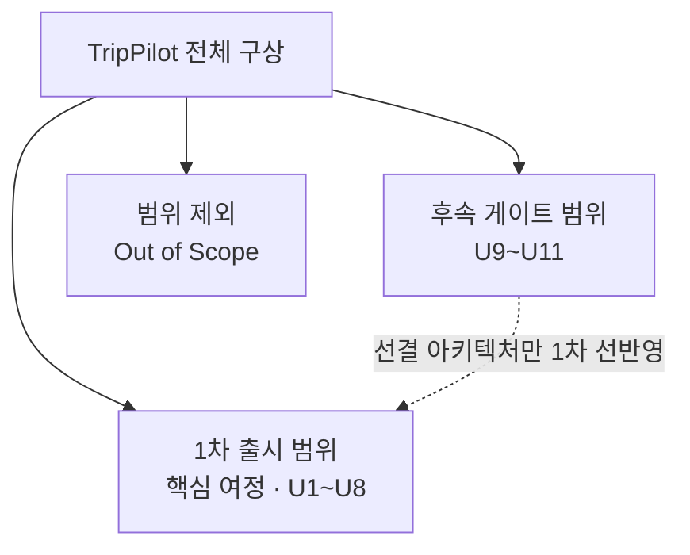

# TripPilot 범위 & 제외

> 출처: aidlc/docs/PRD/15-범위제외.md · aidlc/aidlc-docs/inception/requirements/requirements.md · aidlc-docs에서 2026-07-05 추출 · 이후 본 문서가 정본이다.

이 문서는 TripPilot이 **무엇을 만들고, 무엇을 뒤로 미루며, 무엇을 아예 만들지 않는지**를 한 장에 규정한다. 세 개의 동심원으로 범위를 나눈다. (1) 1차 출시에서 구현하는 **핵심 여정**, (2) 데이터 모델·아키텍처만 1차에 선반영하고 별도 출시 게이트로 미루는 **후속 단계**, (3) 제품 정체성상 다루지 않는 **범위 제외(Out of Scope)**. 여기에 결정에 따른 **PRD 수정 델타(Δ1~Δ10)**, **신규 요구(N1~N8)**, 출시 전 반드시 끝내야 하는 **비개발 선결 과제(P1~P9)**를 함께 싣는다.

관련 문서: 제품 전반은 [overview.md](./overview.md), 개발 순서·유닛 구성은 [units.md](./units.md), 에픽은 [epics.md](./epics.md), 유저스토리는 [user-stories.md](./user-stories.md), 핵심 결정·ADR은 [decisions.md](./decisions.md), 비기능 기준은 [nfr.md](./nfr.md)를 참조한다.

---

## 1. 범위를 규정하는 최상위 원칙

- **실서비스 출시가 1차 목표다(D01).** 데모·프로토타입이 아니라 실제 서비스이므로, 위치정보법 신고·OTA 제휴 계약 같은 **비개발 선결 과제도 요구사항으로 추적**하고(§7), 코드·아키텍처·보안·복원력은 프로덕션 품질을 기준으로 한다.
- **1차 범위는 핵심 여정만이다(D03).** '혼자 계획 → 일정 → Plan-B → 기록'으로 이어지는 개인 여정을 완결한다. AI 어시스턴트·여행자 커뮤니티·동행 공동 편집은 후속 게이트로 분리한다.
- **초기 출시는 국내(대한민국) 한정 · 한국어 단일이다.** 해외 도시 커버리지와 다국어 UI/콘텐츠는 이후 단계적 확장이다.
- **정본 원칙**: 기능의 상세 동작·수용 기준·예외 흐름은 PRD 원문(docs/PRD/)이 정본이고, 요구사항 정의서는 (1) 미정 결정의 확정, (2) PRD 수정 델타, (3) PRD 미기재 신규 요구, (4) 비기능 요구를 소유한다. 충돌 시 요구사항 정의서의 결정이 우선하며 해당 PRD 조항은 델타(§4)로 개정 대상이 된다.

PRD는 총 **120 유저스토리 + 17 ADR**로 구성되며, 이 중 1차 출시(핵심 여정 9개 영역)가 대부분을 차지하고 어시스턴트·커뮤니티·공동편집 3개 영역이 후속으로 빠진다. 1차는 유닛 **U1~U8**로, 후속은 유닛 **U9~U11**로 구현한다. 유닛별 상세는 [units.md](./units.md)를 따른다.

---

## 2. 1차 구현 범위 — 핵심 여정 (D03)

1차 출시는 아래 9개 영역을 완결한다. 각 영역의 PRD 정본 문서와 담당 모듈(M#)을 함께 표기한다.

| 영역 | PRD 정본 | 담당 모듈 |
|---|---|---|
| 앱 셸(스플래시·홈·탭·장소 우선 진입) | 01-앱셸 | (횡단 관심사) |
| 계정·온보딩(가입·약관·취향 7종) | 03-온보딩 | M1 Auth · M2 User Profile |
| 숙소 탐색·저장·등록·OTA 딥링크 | 04-숙소탐색 | M3 · M4 · M5 |
| 여행 생성·거점·필수 방문지 | 05-여행생성 | M6 Trip Creation |
| AI 일정 생성(LLM + 솔버) | 06-AI일정생성 | M7 Place Data · M8 Itinerary Generation |
| Plan-B 재계획(수동·자동 트리거) | 07-PlanB재계획 | M9 · M10 · M11 |
| 여행 중 현장 이용 | 08-여행중현장이용 | **M18 Trip Execution (신규, N7)** |
| 여행 기록·회고 | 09-여행기록회고 | M12 Travel Archive · M13 AI Reflection |
| 알림·마이페이지·설정 | 12-알림마이설정 | M14 Notification |

**핵심 여정의 본질**: '등록된 숙소를 출발점으로 AI가 실행 가능한 일정을 만들고, 여행 중 변수에 Plan-B로 대응하며, 기록·회고로 이어지는' 개인 여정의 한 바퀴다. 이 바퀴가 1차 출시에서 처음부터 끝까지 끊김 없이 돌아가는 것이 1차의 완성 기준이다.

**신규 모듈 M18(Trip Execution)**: 08-여행중현장이용의 기능(활성 일정 허브 상태, 도착 확인 프롬프트, 방문 시작/완료 상태 전이, 실제 체류 시간 측정)을 소유하는 모듈로, PRD에 없던 신규 요구(N7)로 신설했다. M9 Plan-B Detection에 체류·이동 이벤트를, M12 Travel Archive에 actual 기록을 공급한다. 상세는 [units/u6-execution.md](./units/u6-execution.md) 참조.

### 2.1 범위를 좁히는 핵심 결정

핵심 여정 안에서도 아래 결정이 1차 범위의 경계를 명확히 좁힌다.

| ID | 결정 | 범위에 대한 함의 |
|---|---|---|
| D21 | 여행 날짜 구간 겹침을 **생성 단계에서 차단** | 활성 여행은 항상 최대 1개 — '복수 진행 중 여행' 전환 UI 불요 |
| D22 | **로그인 필수** (게스트 이용 없음) | 비로그인 진입은 초대 링크·공유 딥링크 수신 시나리오에 한정, 진입 즉시 로그인 게이트 |
| D24 | 여행 중 **오프라인 일정 조회 미보장** | 활성 일정 화면은 온라인 전제. 단, 기록 '입력'(방문 체크·사진·메모)의 오프라인 로컬 저장은 유지(조회와 입력을 구분) |
| D25 | 이동 **소요시간 미표시** (거리만 표시) | 모든 화면·알림에서 차량/도보 예상 소요시간을 표시하지 않음(ADR-0009 유지) |
| D26 | 예산은 **여행 전체 총액 기준**(항공 제외)으로 통일 | 1인·1일 값은 인원·일수 나눔 파생값 |

---

## 3. 후속 단계 범위 — 별도 출시 게이트 (U9~U11)

아래 3개 영역은 1차 출시 이후 **별도 출시 게이트**로 분리한다. 다만 1차 데이터 모델·아키텍처가 이후 확장을 막지 않도록 **선결 아키텍처만 1차 설계에 선반영**한다. 즉 "만들지는 않되, 나중에 만들 수 있게 자리는 비워 둔다."

| 영역 | PRD 문서 | 유닛 / 모듈 / ADR | 1차 제외 사유 | 1차 선반영(선결 아키텍처) |
|---|---|---|---|---|
| AI 어시스턴트 | 02-AI어시스턴트 | U9 / M16 | 핵심 여정 완결이 우선 — 대화형 보조는 여정이 돌아간 뒤 얹는다 | LLM 호출 아키텍처(D11)·컨텍스트 권한 경계(D31, 서버 재조회)를 아키텍처 여지로 반영 |
| 여행자 커뮤니티 | 10-여행자커뮤니티 | U10 / M15 | 신고·모더레이션·어드민 등 운영 인프라와 법무 준비가 선행돼야 함 | 공개 스냅샷 모델(D16)·기본 비공개 원칙·모더레이션 인프라 요건을 데이터 모델에 선반영 |
| 동행 공동 편집 | 11-동행공동편집 | U11 / M17 / ADR-0016 | 실시간 협업 동기화는 핵심 여정 안정화 이후 도입 | 동기화·잠금 아키텍처(D30, 서버 권위 + 낙관적 잠금)를 확장 가능하게 결정 |

### 3.1 후속 출시의 선결 조건

- **어시스턴트**: LLM 벤더 계약·비용 산정 및 개인정보 국외 이전·처리위탁 고지(P6). 어시스턴트 변환 대상 필터는 04 필터 축(가격대·유형·편의시설·거리)이 정본이며, 평점 필터 요청은 외부 OTA 위임 안내로 처리한다(Δ9).
- **커뮤니티**: 최소 내부 어드민 도구(D35 — 신고 큐 조회 + 보류/복원/삭제 API·웹 화면, 운영자 인증 수동 관리)와 금칙어 기본 사전(P8)이 출시 선결분이다. 계정 상태 필드·단계적 제재(경고→커뮤니티 정지→전체 정지)는 1차 스키마에 예약만 해 둔다.
- **공동 편집**: 서버 권위 + 항목별 버전 낙관적 잠금, WebSocket, 잠금 TTL 60~120초 + 하트비트 + 소유자 강제 해제, 최대 10명, 동기화 지연 목표 3초(D30). 확정 후에도 편집자 편집은 가능하되 현장 실행 액션은 소유자 전용이다.

### 3.2 1차 데이터 모델에 미리 반영하는 후속 항목(★)

후속 기능의 세부 기본값은 해당 기능 착수 시점에 재검토하되, **1차 데이터 모델에 영향을 주는 항목만 지금 반영**한다.

| 항목 | 내용 |
|---|---|
| 공개 스냅샷 상대 시기 스키마(G84 ★) | 계절 + 주중/주말 + N박M일 3필드를 공개 스냅샷 스키마에 반영 |
| 어시스턴트 세션(G135/G197 ★) | 여행 단위 스레드 1개, 여행 생명주기와 연동 보관 |
| 계정 정지(G179 ★) | 단계적 제재를 위한 계정 상태 필드만 1차 스키마에 예약 |
| 공유 뷰 범위(C1 ★) | 일정(plan) + 숙소 위치·날짜만 공유, 예약번호·금액·기록·사진·회고는 소유자 전용 |

---

## 4. Out of Scope — 아예 만들지 않는 것 (PRD 15)

제품 정체성상 **1차·후속을 불문하고 다루지 않는** 항목이다. TripPilot은 숙소를 **탐색·저장**하고 일정을 만들어 **실행·기록**하는 앱이며, 예약·결제·재고·정산·호스트(B2B) 영역은 외부 OTA의 책임으로 둔다.

### 4.1 예약·결제·재고 (앱 내 거래 없음)

| 제외 항목 | 내용 |
|---|---|
| 자체 숙소 예약 / 인앱 예약 확정 | 앱은 숙소를 탐색·저장만 하며, 실제 예약·확정은 외부 OTA 링크(딥링크)로 이동해 처리한다. 앱 내에서 객실을 점유·확정하지 않는다 |
| 인앱 결제 / 자체 PG 정산 | 숙소 결제는 전부 외부 OTA에서 이뤄진다. 어떤 형태의 인앱 결제 흐름·결제 수단 등록·정산도 제공하지 않는다 |
| 내부 객실 재고 관리 / 중복 예약 방지 | 앱은 객실 재고를 보유·동기화하지 않으며, 잔여 객실 수·가격은 외부 OTA 표기를 따른다(재고 정합성은 OTA 책임) |
| 환불·취소·분쟁 자동화 | 예약 환불·취소·분쟁 처리는 외부 OTA에서 처리하며, 앱은 이를 중개·대행하지 않는다 |

### 4.2 호스트(B2B) 영역 전체

| 제외 항목 | 내용 |
|---|---|
| 숙박업주(호스트) 입점 / 숙소·객실 등록 / AI 리스팅 빌더 | 호스트 온보딩, 숙소 등록, 객실 타입·요금 설정, AI 리스팅 생성 기능을 제공하지 않는다 |
| 호스트 예약 관리 / 재무 대시보드 / AI 경영(재무) 에이전트 | 호스트용 예약 인박스, 매출·정산·수익 대시보드, AI 경영·재무 분석 에이전트를 제공하지 않는다 |
| 숙소 평가 에이전트 심사 자동화 | 숙소 품질을 AI가 심사·승인하는 자동화 프로세스를 제공하지 않는다 |

### 4.3 상품군 확장 (항공·액티비티)

| 제외 항목 | 내용 |
|---|---|
| 항공권 검색·예약·발권 | 항공 상품의 검색·예약·발권·요금 비교를 제공하지 않는다 |
| 액티비티(투어·체험) 탐색·예약 일체 | 액티비티 탐색·상세·외부 예약 연동·일정 고정 입력 등 액티비티 전용 기능을 제공하지 않는다. 여행 일정의 **고정 블록은 등록 숙소 + 사용자 지정 필수 방문지로만** 구성한다(ADR-0005) |

### 4.4 OTA 운영 연동 (백엔드 통합)

| 제외 항목 | 내용 |
|---|---|
| OTA 실시간 재고 동기화 / 정산 자동화 | OTA와의 실시간 객실 재고 동기화, 정산·수수료 자동 정산 파이프라인을 구축하지 않는다 |
| PMS 완전 연동 / 채널매니저 | 숙박 관리 시스템(PMS) 연동, 채널매니저 기능을 제공하지 않는다 |

### 4.5 소셜·커뮤니티의 제외 경계

커뮤니티는 후속 범위이나, 후속에서도 **포함되는 것과 제외되는 것**의 경계가 명확하다.

| 구분 | 내용 |
|---|---|
| **제외** — 소셜 그래프 | 팔로우·구독·스크랩(컬렉션 저장)·평판 점수 등 소셜 그래프 기능은 제공하지 않는다 |
| **제외** — 독립 게시판/포럼 | 일정과 무관한 스레드형 글쓰기·답글 게시(독립 게시판/포럼)는 제공하지 않는다 |
| **제외** — 타인 공개 일정 원본 직접 편집 | 커뮤니티에서 타인이 공개한 일정을 원본 그대로 직접 편집하는 것은 제공하지 않는다. **'내 여행으로 가져오기'(원본과 분리된 사본 복제)로만** 활용한다 |
| **포함**(커뮤니티에 한정 포함) | 공개 일정에 대한 **좋아요(토글·집계)·댓글**은 커뮤니티에 포함한다. 댓글은 공개 일정에 달리는 평면 반응(대댓글·수정 없음)으로 한정하고 신고·숨김·운영 검토 인프라를 공유한다. 댓글은 일정에 종속된 반응이며 독립 게시판 글이 아니다 |

> 참고: 내 여행에 동행자를 초대해 함께 실시간 편집하는 기능은 '동행 공동 편집'(후속 범위, §3)에서 지원하며 범위에 포함된다. 타인 공개 일정 원본 편집 제외와 혼동하지 않는다.

### 4.6 AI 자동화·미디어 생성

| 제외 항목 | 내용 |
|---|---|
| 항공 지연 자동 반영 | 항공 지연을 일정에 자동 반영하지 않는다 |
| AI 자동 예약 변경·취소 | AI가 사용자 대신 예약을 자동 변경·취소하지 않는다(사용자 탭 확정 원칙) |
| 여행 영상 자동 생성 | 여행 기록·회고를 영상으로 자동 편집·생성하는 기능을 제공하지 않는다 |

### 4.7 지역·언어

| 제외 항목 | 내용 |
|---|---|
| 다국어 지원 | 초기에는 한국어 단일 언어로 제공하며, 다국어 UI·콘텐츠를 제공하지 않는다 |
| 해외(국외) 커버리지 | 초기 출시는 국내(대한민국)에 한정하며, 해외 도시는 커버하지 않는다(이후 단계적 확장). 국내 좌표 범위 검증에서 국외 좌표는 차단하고 사유를 안내한다 |

> **Problem Statement과의 정합성**: Problem Statement의 "기존 OTA들은 숙소·항공·액티비티를 예약한다"는 서술은 *기존 OTA 일반*의 범위를 설명하는 맥락이며 TripPilot 자체의 범위가 아니다. TripPilot은 위 Out of Scope에 따라 항공 상품을 다루지 않는다.

---

## 5. 1차 미제공·이연 세부 항목

Out of Scope처럼 영구 제외는 아니지만, **1차 출시에서는 의도적으로 제공하지 않고 후속으로 미루는** 세부 결정들이다(빈틈 분석 기본값). 범위 경계를 흐리지 않기 위해 여기에 모아 둔다.

| 항목 | 1차 처리 | 후속 계획 |
|---|---|---|
| OTA 포스트백 1탭 자동 등록(G29/G108) | 1차 제외 — 복귀 핸드오프 카드 + 수동 빠른 등록만 제공, 포스트백은 집계용 설계만 | OTA 제휴 확정 후 도입 |
| 계정 수동 연결/병합(G20) | 1차 미제공 — 별도 계정 유지, CS 문의 처리 | 후속 검토 |
| 백그라운드 위치 수집(G62) | 포그라운드 한정 — 백그라운드 위치 권한 미요청(D27 정합) | OS 지오펜스 저전력 도착 감지 후속 검토 |
| 혼잡도 표시(G199) | 1차 제외 — '미확인' 표기로 통일 | 후속 |
| 데이터 내보내기(G101/G186) | 텍스트 데이터(여행·일정·기록·설정) JSON 즉시 다운로드, **사진 제외** | 사진 포함 전체 아카이브 후속 |
| '취향 여행 기록' 홈 카드(G2/G174) | 커뮤니티 후속 전까지 미노출 | 커뮤니티 출시와 함께 |
| 커뮤니티 검색(C13) | 1차 검색 없음 — PRD 예외 문구의 '검색'은 필터·정렬 지칭으로 정리 | 후속 |
| 마케팅 알림 발송(N8) | 온보딩에서 동의 수집 + 설정 철회 토글만, **발송은 하지 않음** | 발송 기능 후속 |
| 어드민 도구(D35) | 설계 여지만 기록 | 커뮤니티 출시 선결로 구현 |
| 걸음 수(G59) | GPS 이동 거리 기반 환산 추정만(추가 권한 없음), 추정치 명시 | — |

---

## 6. PRD 수정 델타 (Δ1\~Δ10) 및 신규 요구 (N1\~N8)

요구사항 정의서가 확정한 결정에 따라, 설계·구현 시 아래 델타를 **PRD 원문보다 우선 적용**한다. PRD 원문 개정은 별도 작업으로 추적한다.

### 6.1 PRD 수정 델타 (Δ1~Δ10)

| # | 대상 PRD 조항 | 델타 내용 | 근거 |
|---|---|---|---|
| Δ1 | 06-AI일정생성 스토리 6 "(a) 예상 소요 시간" | 이동 구간 표시에서 **소요시간 삭제** — 거리·이동 수단만 범위·추정으로 표시(07·08·12의 거리 표시 원칙과 통일) | D25 |
| Δ2 | README·03-온보딩 예산 '1인 기준 총액' | **여행 전체 총액(항공 제외) 기준으로 통일** — 러프 예산도 전체 총액 구간으로 재정의, 1인·1일 값은 파생 표기 | D26 |
| Δ3 | 05-여행생성 스토리 1 | 여행 생성 시 기존 여행과 **날짜 구간 겹침 검증 추가** — 겹치면 오류 차단. 01-앱셸의 '복수 진행 중 여행' 전환 UI 불요 | D21 |
| Δ4 | ADR-0007 '마지막 체크아웃' 회고 트리거 | **여행 종료일 다음날 00:00 + 수동 종료 버튼**으로 개정(12번 스토리 7과 단일 정본화) | D19 |
| Δ5 | 02·10·11 문서의 비로그인 예외 조항 | **로그인 필수** 원칙으로 해석 통일 — 비로그인 진입은 초대 링크·공유 딥링크 수신 시나리오에 한정, 진입 즉시 로그인 게이트 | D22 |
| Δ6 | 09-여행기록회고 스토리 12 vs D24 | 오프라인 **기록 입력**(방문 체크·사진·메모)의 로컬 저장·동기화는 유지. 일정 **조회**의 오프라인 보장은 하지 않음(활성 일정 화면 온라인 전제, 실패 시 오류·재시도 안내) | D24 |
| Δ7 | 13-구현결정 모듈 목록 | **M18 Trip Execution 모듈 신설** — 활성 일정 상태 머신·도착 확인 프롬프트·실제 체류 시간 측정을 소유하고 M9(트리거 입력)·M12(actual 기록)에 이벤트 공급 | N7 |
| Δ8 | 14-테스트 테스트 대상 11개 모듈 | 1차 출시 범위 기준 유지 + M18 추가. 커뮤니티·공동편집·어시스턴트는 해당 기능 출시 시점에 테스트 문서 증보 | D03 |
| Δ9 | 02-AI어시스턴트 스토리 2 '평점 필터' | 어시스턴트 변환 대상 필터는 04 필터 축(가격대·유형·편의시설·거리)이 정본 — 평점 요청은 외부 OTA 위임 안내(후속 단계 적용) | D03 |
| Δ10 | 13-구현결정 모듈 14 알림 종류 | 12번 문서의 알림 종류 목록이 정본 — '체크인 임박'·'예약 링크 리마인드'는 목록에서 제외(후속 검토) | D32 |

### 6.2 신규 기능 요구사항 (N1~N8, PRD 미기재)

PRD에 없던, 요구사항 정의서가 새로 규정한 기능이다. 상당수가 법정 의무·앱스토어 심사 요건이라 1차 범위의 필수 구성으로 들어간다.

| # | 요구 | 내용 요약 |
|---|---|---|
| N1 | 연령 확인(D33) | 회원가입 흐름에 생년월일 입력 또는 '만 14세 이상입니다' 확인을 필수 단계로 추가. 만 14세 미만은 가입 차단·사유 안내. 소셜 가입 경로에도 동일 적용 |
| N2 | 위치정보법 법정 의무(D34) | 아래 4개 항목(§6.3)으로 전면 반영 |
| N3 | 약관 개정 재동의(G21/G183) | 약관 버전에 '재동의 필요' 플래그. 중대 변경(불리한 변경·수집 항목 확대)은 스플래시 분기에서 재동의 화면 강제, 경미 변경은 인앱 공지 |
| N4 | 강제 업데이트 게이트(C6) | 스플래시에서 서버 최소 지원 버전 확인, 미달 시 강제 업데이트 화면 분기. 서버 응답 계약에 최소 버전 필드 포함 |
| N5 | 고객 지원·정책 문서 재열람(C7) | 설정에 이용약관·개인정보처리방침·위치기반서비스 약관·오픈소스 라이선스 재열람과 이메일 문의 링크 제공(앱스토어 심사·위치정보법 상시 열람 요건) |
| N6 | 여행 제목(C2) | 여행 생성 시 제목 선택 입력, 미입력 시 '{여행지} N박M일' 자동 생성. 언제든 수정 가능, 금칙어 검증 적용 |
| N7 | Trip Execution 모듈 M18(G173) | 08-여행중현장이용 기능(활성 일정 허브 상태·도착 확인 프롬프트·방문 시작/완료 전이·실제 체류 시간 측정) 소유 모듈 신설. M9에 체류·이동 이벤트, M12에 actual 기록 공급 |
| N8 | 마케팅 수신 동의 관리(G184) | 온보딩에서 마케팅 수신 동의(선택) 수집 + 설정 철회 토글. **1차 출시에서 마케팅 알림 발송은 하지 않음**(발송은 후속) |

### 6.3 N2 위치정보법 세부 (법정 의무)

- 약관 동의 화면에 **'위치기반서비스 이용약관' 별도 필수 동의** 항목 추가(이용약관·개인정보 처리방침과 분리 체크)
- GPS 여행 기록 보관(09 스토리 3)은 **별도 옵트인 동의** — 철회·탈퇴 시 해당 위치 데이터 즉시 파기
- **위치정보 수집·이용·제공 사실 확인자료(로그) 테이블**을 데이터 모델에 포함 — append-only, 최소 6개월 보존, 애플리케이션 역할은 자기 로그 삭제 권한 없음(SECURITY-14 정합)
- 위치 동의 상태는 3층(OS 권한 × 앱 내 법정 동의 × GPS 기록 옵트인)으로 관리, 조합별 기능 동작 매트릭스를 Functional Design에서 명문화(G182)

---

## 7. 비개발 선결 과제 (P1~P9)

실서비스 출시(D01)를 위해 **출시 전 완료가 필요한 비개발 항목**이다. 코드가 아니라 계약·신고·법무·심사 준비물이며, 이 중 하나라도 미완이면 출시 게이트를 통과하지 못한다. Workflow Planning에서 추적 체계에 포함한다.

| # | 과제 | 관련 결정/요구 |
|---|---|---|
| P1 | **위치기반서비스사업 신고**(위치정보법 제9조) + 위치정보 전문 법무 자문 | ADR-0017 · N2 |
| P2 | 국내 지도 API(카카오·카카오모빌리티·네이버) **약관 검토·계약** — 특히 '사용자 확정 데이터 스냅샷 영구 저장'(D13)의 약관 적합성 법무 확인 | D08 · D13 |
| P3 | 기상청 공공데이터포털 **API 활용 신청** | D10 |
| P4 | TourAPI **활용 신청·캐싱 조건 확인** | D09 · D13 |
| P5 | OTA **어필리에이트 제휴 계약** — 1차는 검색 딥링크만이나 파트너별 딥링크 정책 확인 필요 | D09 |
| P6 | LLM 벤더 **계약·비용 산정** + 개인정보 국외 이전·처리위탁 고지 문안 | D11 · G181 |
| P7 | 약관 3종(이용약관·개인정보처리방침·위치기반서비스 약관) **법무 작성** | N2 · N3 |
| P8 | **금칙어 기본 사전 확보** | G23 |
| P9 | **앱스토어·플레이스토어 개발자 계정** 및 심사 요건(지원 연락처 등) 준비 | N5 |

### 7.1 범위 관련 법률·정책 준수 (참고)

선결 과제와 맞물리는 법률·정책 제약이다. 범위 경계를 강제하는 조건이므로 함께 정리한다.

- **위치정보법**: N2 전면 반영 + 위치기반서비스사업 신고(P1)가 출시 선결
- **개인정보보호법**: 만 14세 미만 차단(N1), 계정 삭제 30일 유예 + 연쇄 삭제·익명화(D18), 데이터 내보내기 기본 제공, 약관 동의 증적 보존
- **국외 이전**: 국외 LLM 사용 시 개인정보처리방침에 국외 이전·처리위탁 고지, LLM 전송 필드는 목적 최소화(G181)
- **지도 API 약관**: 영구 캐싱 금지·실시간 호출·출처 표기를 데이터 모델 차원 반영(D13). 사용자 확정 데이터 스냅샷의 법무 확인은 선결 과제(P2)
- **OTA**: 국내 OTA 크롤링 금지, 리뷰·평점 미표시, 제휴 수수료 고지(광고·제휴 표시 규제)

---

## 8. 범위 요약

TripPilot 1차 출시는 **핵심 여정**(온보딩 → 숙소 탐색·등록 → 여행 생성 → AI 일정 생성 → 여행 중 실행 → Plan-B → 기록/회고 → 알림/마이)을 국내 한정·한국어 단일·실서비스 품질로 완결한다(유닛 U1\~U8). **AI 어시스턴트·여행자 커뮤니티·동행 공동 편집**은 데이터 모델·아키텍처 여지만 확보한 채 별도 출시 게이트로 분리한다(유닛 U9\~U11). **예약·결제·객실 재고·호스트(B2B)·항공·액티비티·PMS/채널매니저·환불 분쟁·소셜 그래프·독립 게시판·항공 지연 자동 반영·AI 자동 예약 변경·여행 영상 생성**은 제품 정체성상 다루지 않는다(Out of Scope). 출시 전에는 위치기반서비스사업 신고·지도/날씨/TourAPI/LLM 계약·약관 3종 법무 작성 등 비개발 선결 과제(P1~P9)가 반드시 완료돼야 한다.
