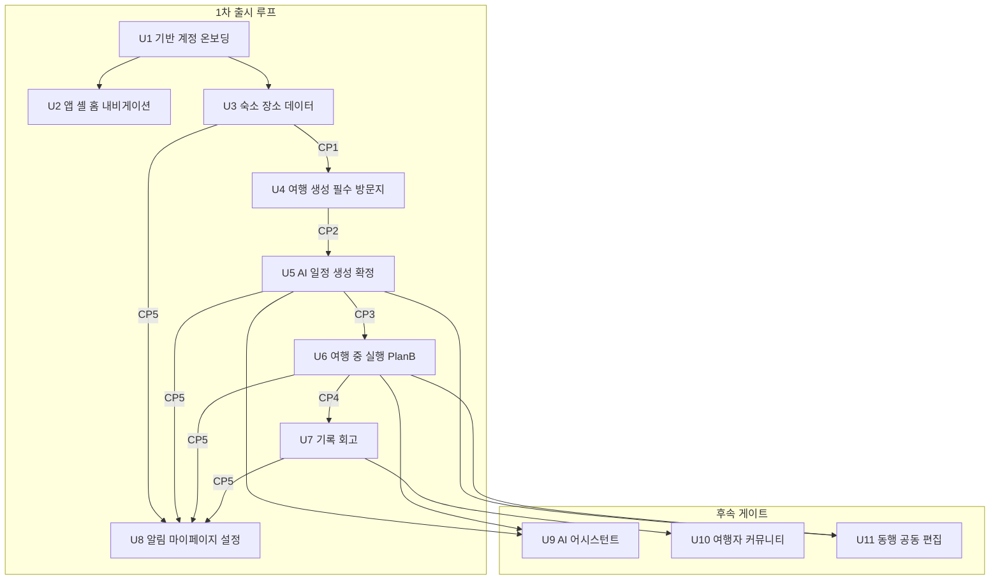

# 개발 순서 (작업 유닛 로드맵)

> 출처: aidlc-docs/inception/application-design/unit-of-work.md · unit-of-work-dependency.md · unit-of-work-story-map.md · inception/plans/execution-plan.md · aidlc-docs에서 2026-07-05 추출 · 이후 본 문서가 정본이다.

TripPilot의 1차 출시 범위(스토리 102개)는 단일 유닛으로 구현할 수 없다. 이 문서는 전체 시스템을 **의존 순서를 반영한 작업 유닛 8개(U1~U8)** 로 분해하고, 후속 게이트로 예약한 유닛 3개(U9~U11)를 함께 정의한다. 유닛은 **개발 순서 단위**이며 배포 단위는 아니다 — 배포는 단일 서버 + 앱으로 통합한다(UW-2). 각 유닛은 컨스트럭션 루프(Functional Design → NFR Requirements → NFR Design → Infrastructure Design → Code Generation)를 완주한 뒤 다음 유닛으로 넘어간다.

각 유닛의 상세 설계 문서는 units/ 하위에 별도로 있다: [U1](./units/u1-foundation.md) · [U2](./units/u2-appshell.md) · [U3](./units/u3-place-stay.md) · [U4](./units/u4-trip.md) · [U5](./units/u5-itinerary.md) · [U6](./units/u6-execution.md) · [U7](./units/u7-archive.md) · [U8](./units/u8-notification.md). 유닛이 다루는 스토리·에픽·범위의 배경은 [에픽](./epics.md)·[유저스토리](./user-stories.md)·[범위](./scope.md), 모듈·계약·결정의 근거는 [아키텍처](./architecture.md)·[도메인 모델](./domain.md)·[핵심 결정](./decisions.md)·[NFR 기준](./nfr.md)을 참조한다. 용어·추적성 ID는 [용어집](./glossary.md)에 정리돼 있다.

**현재 산출물 범위 (execution-plan.md 2026-07-04 개정)**: 산출물 범위는 **설계 문서화로 한정**되며 각 유닛의 설계 4단계(Functional Design → NFR Requirements → NFR Design → Infrastructure Design)까지만 생성한다 — **Code Generation·Build and Test 단계는 미실행**이다(옵션 B). 아래 로드맵의 Code Generation·CI 게이트·E2E 편입 등은 향후 코드 생성 시의 실행 계획으로 기술한 것이다.

---

## 1. 유닛 총괄표

### 1차 출시 루프 (U1~U8)

| 유닛 | 이름 | 범위(에픽·스토리) | 핵심 모듈 | 핵심 산출물 |
|---|---|---|---|---|
| U1 | 기반·계정·온보딩 | E1 18개 | M1, M2, C3 + 스캐폴드 | 모노레포 스캐폴드(server/app·common, apps/mobile), 인증(소셜4+이메일)·토큰(D36), 약관·동의 증적(N2·N3), 연령(N1), 취향 7종, 금칙어 검증, 전역 보안 설정(헤더·에러 핸들러·구조화 로깅) |
| U2 | 앱 셸·홈·내비게이션 | E2 6개 | (클라이언트 중심) + 서버 부트스트랩 API | 스플래시 분기(3초·강제 업데이트 N4), 5탭 셸, 홈 대시보드(후행 유닛 카드가 점진 채움 — 미구현 영역은 빈 상태), 장소 우선 진입(저장 POI) |
| U3 | 숙소·장소 데이터 | E3 11개 | M3, M4, M5, M7(기반) | POI 정본 파이프라인(canonical ID·하이브리드 캐싱 D13), 숙소 탐색·필터·상세, 위시리스트, 등록(계정 레벨 D15)·거점 검증, OTA 딥링크·고지 |
| U4 | 여행 생성·필수 방문지 | E4 11개 | M6 | 여행 CRUD(제목 N6·겹침 차단 D21·시간창 G119), 예산(전체 총액 D26), 다중 숙소 거점 규칙, 필수 방문지(한도·사본·시각 고정) |
| U5 | AI 일정 생성·확정 | E5 12개 | M8, C1, C2 | LLM Gateway(D11·D31), Solver Engine(하드 제약·추정 파라미터 G106·결정론 폴백), 생성 3방식·점진 노출(5초/20초), 편집 재검증(D28), 확정 상태 머신(D14·D20), 숙소 권역 추천 |
| U6 | 여행 중 실행·Plan-B | E6 3개 + E7 13개 | M18, M9, M10, M11 | 활성 허브·도착 프롬프트(D23)·체류 측정, 여행 종료 전이(D19), 날씨(기상청 D10)·휴무 폴링, 트리거 판정·억제(순수 함수 분리 G116), 재계획 세션·후보·확정(10초 D38), 휴식 모드, GPS 발자취(D34) |
| U7 | 기록·회고 | E8 14개 | M12, M13 | actual·changelog(통합 diff 스키마 G132), 사진 파이프라인(압축·큐·재시도), 오프라인 입력 동기화(G74), 당일 회고·전체 요약·스타일 분석(C1 경유·폴백), 공유 카드 |
| U8 | 알림·마이페이지·설정 | E9 14개 | M14 (+각 모듈 설정 화면) | FCM·서버 스케줄링(D32)·종류별 토글·방해금지(G100)·알림함(90일), 마이페이지(숙소·여행·스타일 카드), 계정 삭제 연쇄(D18)·내보내기, 위치 동의 3층(G182), 고객지원(N5)·마케팅 토글(N8), 홈 카드 최종 통합 |

### 후속 게이트 (유닛 예약 — 1차 루프 제외)

| 유닛 | 이름 | 범위 | 선결 |
|---|---|---|---|
| U9 | AI 어시스턴트 | E10 8개 (M16) | U5(C1)·U6 완료, LLM 비용 정책 |
| U10 | 여행자 커뮤니티 | E11 10개 (M15) | 모더레이션 4종 인프라 + 어드민 도구(D35), U7 완료 |
| U11 | 동행 공동 편집 | E12 8개 (M17) | WebSocket 인프라(D30), U5·U6 완료, ADR-0016 게이트 |

근거 정본: 모듈·컴포넌트(M1~M18·C1~C3)는 [아키텍처](./architecture.md), 결정 ID(D01~D38·Δ1~Δ10·N1~N8·P1~P9)는 [핵심 결정](./decisions.md), 128 스토리는 [유저스토리](./user-stories.md).

---

## 2. 개발 순서와 유닛 의존 그래프

개발 순서는 **U1 → U2 → U3 → U4 → U5 → U6 → U7 → U8** 기본 순차(UW-4)이며 순환이 없다. 후속 게이트 U9~U11은 1차 루프 완료 후 게이트 승인을 거쳐 진행한다.



**텍스트 대안** (화살표는 "선행 → 후행"):

- 1차 출시 루프
  - U1 기반·계정·온보딩 → U2 앱 셸·홈·내비게이션
  - U1 기반·계정·온보딩 → U3 숙소·장소 데이터
  - U3 숙소·장소 데이터 → U4 여행 생성·필수 방문지 (계약 포인트 CP1)
  - U4 여행 생성·필수 방문지 → U5 AI 일정 생성·확정 (계약 포인트 CP2)
  - U5 AI 일정 생성·확정 → U6 여행 중 실행·Plan-B (계약 포인트 CP3)
  - U6 여행 중 실행·Plan-B → U7 기록·회고 (계약 포인트 CP4)
  - U3, U5, U6, U7 → U8 알림·마이페이지·설정 (계약 포인트 CP5 — 알림 이벤트 4계열 + 전 모듈 설정·홈 카드 통합)
- 후속 게이트
  - U5, U6 → U9 AI 어시스턴트 (C1 LLM Gateway·퍼사드 재사용)
  - U7 → U10 여행자 커뮤니티 (확정 일정 스냅샷·기록 소비)
  - U5, U6 → U11 동행 공동 편집 (편집 재검증·C2 솔버 재사용 + WebSocket 신규)

### 2.1 착수 차단 조건 (계약 수준 의존 표)

각 행은 "이 유닛을 시작하려면 무엇이 어느 수준까지 완성되어 있어야 하는가"를 계약 수준으로 기술한다. **선행 필수**는 착수 차단 조건, **소비/공급 계약**은 주고받는 산출물의 형태다.

| 유닛 | 선행 필수 | 소비하는 계약(입력) | 공급하는 계약(출력) |
|---|---|---|---|
| U1 | — (최초 유닛) | 없음 | 세션 검증·온보딩 완료 판정·재동의 필요 플래그 API(U2 소비), 계정·동의·취향 데이터 모델, `common/core` 이벤트 버스 계약, 위치 동의 3층 모델(G182 — U3·U6·U7 소비), 삭제 유예 상태 모델(U8이 S6로 완결) |
| U2 | U1 | U1 세션 검증(3초 타임아웃 G5)·온보딩 완료 판정(약관+닉네임 G24)·재동의 플래그(N3) — 스플래시 5분기 판정 입력 | 부트스트랩 API(최소 지원 버전 N4·세션 상태·재동의 플래그), 5탭 셸·탭 규칙(G6·G7)·탭바 숨김 단일 컴포넌트, 홈 대시보드 카드 슬롯 스키마 |
| U3 | U1 (+선결 P2·P4 — 설계 차단) | U1 계정 귀속(위시리스트·등록 숙소·저장 POI 소유자), 취향 7종(탐색 가격 필터 기본값 US-E1-13), 위치 동의 3층 상태('내 주변' just-in-time 발화 1번째 지점) | **CP1 공급**: 등록 숙소·저장 POI 스키마. M7 canonical POI·하이브리드 캐싱(D13), `StayRegistered` 이벤트(CP5 일부), U2 온램프 셸 백엔드 활성화 |
| U4 | U3 | **CP1 소비**: 등록 숙소(거점 입력)·저장 POI(필수 방문지 시드)·M7 장소 검색 재사용 | **CP2 공급**: 여행 컨텍스트(시간창·거점 목록·필수 방문지·속성). 날짜 겹침 차단(D21)·거점 비중첩(D15)·한도(G40) 입력 무결성 |
| U5 | U4 (+선결 P6 — C1 설계 입력) | **CP2 소비**: 여행 컨텍스트 전체. M7 후보 풀, U1 취향(C1 가중치), 카카오모빌리티 도로 거리(P2 기완료 전제) | **CP3 공급**: 일정 기준선(plan/current·고정 블록·확정 상태). `ItineraryConfirmed/Changed`(CP5 일부). C1·C2 재사용 자산 |
| U6 | U5 (+선결 P3·P1) | **CP3 소비**: 확정/현재본 일정, C2·C1 재사용(재계획 검증·사유 해석), M7 후보 소싱(G53), U1 위치 동의 3층(GPS 옵트인 G182) | **CP4 공급**: `VisitChecked`·`DayClosed`·`TripEnded`·changelog diff. `TriggerFired`(CP5 일부). GPS 폴리라인(U7 입력) |
| U7 | U6 | **CP4 소비**: VisitChecked(actual)·DayClosed(회고 트리거)·TripEnded(요약 트리거 S4)·changelog diff, C1 재사용(회고·스타일), U1 GPS 옵트인 철회 파기(N2) | **CP5 공급**: `ReflectionReady`. plan/actual/changelog 3계열 대조, changelog 통합 스키마(G132) 보관 정본(U10·U11 공용) |
| U8 | U5~U7 (+U3 이벤트) | **CP5 소비**: `StayRegistered/LinkedToTrip`(U3/U4)·`ItineraryConfirmed/Changed`(U5)·`TriggerFired`(U6)·`ReflectionReady`(U7) 전체. 전 모듈 설정 대상, U1 삭제 유예 골격(S6 완결), U2 홈 카드 슬롯 | 1차 출시 완제품 — 발송 파이프라인, 계정 삭제 연쇄(D18), 전 유닛 컴플라이언스 누적 요약 |
| U9 `[후속]` | U5·U6 완료 + LLM 비용 정책(P6 재검토) | C1 LLM Gateway(경량 티어), M3·M8·M10 퍼사드, D31 서버 재조회 경계 | 신규 도메인 로직 없음 — 대화 스레드·메시지만 신설(퍼사드 상위 소비자) |
| U10 `[후속]` | U7 완료 + 모더레이션 4종·어드민 도구(D35) | U5 확정 일정 스냅샷(D16)·U7 기록(공유 카드), C3 금칙어 확장(G86), changelog·복제(G156) | 게시물 스냅샷·반응·댓글·신고·제재 모델 + 웹 어드민 신고 큐 |
| U11 `[후속]` | U5·U6 완료 + WebSocket 인프라(D30) + ADR-0016 게이트 | U5 편집 재검증(C2)·확정 상태 머신(D20), U7 changelog 스키마(G132), U1 권한 모델(SECURITY-08) | 참여자·권한·초대 링크·항목 잠금 모델 + WebSocket 채널(신규 인프라) |

### 2.2 병행 가능 구간 (계약이 먼저 고정되는 경우에 한함)

- **U2 ∥ U3** (U1 완료 후): U2의 서버 의존은 U1 세션·재동의 API와 부트스트랩 API뿐 — U3의 외부 어댑터 작업과 자원 충돌이 없다. 단, U2가 고정하는 홈 카드 슬롯 스키마·온램프 셸 계약은 U3 착수 전 확정 권장(U3이 온램프 백엔드를 연결하므로).
- **U7 클라이언트 ∥ U6 후반**: CP4 이벤트·changelog 스키마가 U6 Functional Design에서 확정되면, U7의 기록 UI·오프라인 큐(클라이언트 중심 작업)는 U6 서버 구현과 병행 가능. U7 서버(M12·M13)의 통합 검증은 U6 완료 후.
- **선결 과제 병행**: P1~P9는 유닛 루프와 병행 진행 — 특히 P2·P4(U3 설계 차단), P6(U5 설계 입력), P3·P1(U6 전제)은 해당 유닛 착수 전 완료가 임계 경로다.

### 2.3 그 외 구간을 순차로 유지하는 근거

1. **계약 포인트가 직렬 체인**: CP1→CP2→CP3→CP4가 데이터 파이프라인으로 이어져 있어, 선행 계약이 코드로 검증되기 전에 후행 유닛을 열면 스키마 재협상 비용이 병행 이득을 상회한다(특히 CP2 — U4 산출 스키마가 U5 솔버 문제 정의를 결정).
2. **재사용 자산의 완성 선행**: C1·C2는 U5에서 프로덕션 품질로 완성한 뒤 U6(재계획)·U7(회고)이 소비하는 구조 — U5 이전에 U6·U7을 열면 자산이 이중 개발된다.
3. **하드 제약의 입력 무결성 누적**: D37 하드 제약 4계열은 U3(canonical ID)·U4(겹침·비중첩·한도)·U5(본체)·U6(재계획 재검증)으로 누적 구축된다 — 순서를 흩으면 머지 차단 게이트의 전제가 무너진다.
4. **U8은 통합 마감 유닛**: CP5 소비·전 모듈 설정·삭제 연쇄·홈 카드 최종 통합 모두 "발행·공급 측 완료"가 전제 — 구조적으로 병행 불가.
5. **단일 배포 단위(UW-2)**: 모듈러 모놀리스에서 유닛 병행은 `common/core`·스캐폴드 충돌 위험을 키운다 — U1이 모듈 골격을 전부 선생성해 충돌을 최소화했지만, 공유 계약(이벤트·스키마) 변경 창구는 한 번에 하나의 유닛으로 유지한다.

---

## 3. 유닛 간 계약 포인트 (CP1~CP5)

계약 포인트는 유닛 간 통합 검증 체크포인트다. 각 CP는 (a) 교환 데이터 스키마 개요(필드 수준 — 확정 스키마는 해당 유닛 Functional Design 산출), (b) 검증 방법(공급자·소비자 계약 테스트 + 통합 시나리오), (c) 계약 변경 시 영향 범위로 구성한다. 공급자 유닛의 Code Generation 완료 시 공급자 측 계약 테스트가 통과해야 하고, 소비자 유닛 완료 시 통합 시나리오가 CI에 편입된다.

### CP1. U3 → U4: 등록 숙소·저장 POI 계약

거점 배정·필수 방문지 시드 투입의 입력. U3(M4·M7)이 공급하고 U4(M6)가 소비한다.

| 객체 | 필드(개요) | 근거 |
|---|---|---|
| 등록 숙소(SavedStay) | 내부 숙소 ID(정본 키), 소유 계정 ID, 숙소명, 좌표(위도·경도 — 미확정이면 "지도에서 위치 확인" 강제 후에만 거점 자격), 주소, 체크인/체크아웃 날짜(체크아웃>체크인 검증 완료 상태), 소스별 외부 ID 매핑(N:1), 등록 경로(OTA 복귀/지도 검색/링크 파싱/핀 지정), 숙소 유형·대표 가격대(선택), 등록 일시 | D15·D17·G31 |
| 저장 POI(SavedPlace) | canonical POI ID, 소유 계정 ID, 확정 시점 스냅샷(명칭·좌표·카테고리·영업시간·출처 — D13 영구 보존분), 저장 일시, 소실 상태 플래그(원본 확인 불가 시 '확인 불가' 배지·시드 투입 제외, G8) | D13·G133/G148·G8 |
| 위시리스트 항목 | 숙소 참조(내부 ID 또는 외부 ID 매핑), 메모, 저장 일시 — 등록 숙소와 별도 목록(G129 원칙과 동형) | D15 |

**통합 테스트 시나리오**: (1) **거점 배정 왕복** — U3에서 OTA 복귀 카드로 등록한 숙소가 U4 거점 지정 목록에 나타나고 체크인/아웃 날짜가 여행 기간 자동 반영(US-E4-05)으로 무손실 전달(날짜·좌표·명칭 동등성 단언). (2) **좌표 미확정 차단** — 링크 파싱 실패로 좌표 미확정인 등록 숙소는 거점 지정 시 차단되고 "지도에서 위치 확인" 경로로 유도. (3) **소실 POI 시드 제외** — 정본 동기화에서 소실 확인된 저장 POI는 필수 방문지 체크박스 화면에서 '확인 불가' 배지와 함께 투입 제외 안내(G8).

**계약 변경 영향 범위**: U4(거점 배정·시드 투입·자동 반영), U5(거점 좌표=솔버 숙소 기준점 하드 제약 입력 — CP2로 전파), U8(마이페이지 통합 목록 G103·`StayRegistered` 페이로드), E2E 1구간. 필드 추가는 하위 호환, **키 체계(내부 숙소 ID·canonical POI ID) 변경은 전 후속 유닛 재작업급 — 금지 수준 통제**.

### CP2. U4 → U5: 여행 컨텍스트 계약

솔버 문제 정의의 입력 전체. U4(M6)가 공급하고 U5(M8·C2)가 소비한다. **1차 유닛 체인에서 정밀도 요구가 가장 높은 계약** — U4 DoD가 "CP2 계약의 정밀도가 U5 성패를 좌우"로 명시.

| 객체 | 필드(개요) | 근거 |
|---|---|---|
| 여행(Trip) | 여행 ID, 소유 계정 ID, 여행지(명칭+중심 좌표 — 국내 좌표 범위 검증 완료 G120), 시작/종료일(오늘 이후·최대 30일 G42·기존 여행과 겹침 없음 D21), 인원, 예산(총액 원값+매핑 구간, 항공 제외 D26 — 1인·1일은 파생), 제목(N6), 상태 | D21·D26·G42·G120 |
| 일자별 시간창 | 일자, 이용 가능 시작/종료 시각(기본 09:00~21:00 D29, 첫날 도착·마지막날 출발 반영 G119) — 솔버 시간 예산 | D29·G119 |
| 거점 목록 | 구간(날짜 range — 구간 간 비중첩 D15), 숙소 참조(내부 ID+스냅샷 좌표), 다박 연속 숙박, 첫날 공백 시 여행지 중심 좌표 기본 거점(G41), 전환일 식별(편도 동선 모델링 입력 G50) | D15·G41·G50 |
| 필수 방문지 | POI **사본**(원본 삭제 독립 G129 — canonical ID 참조+스냅샷), 방문 시각 고정(선택), 한도 내 보장(하루 3곳×일수 G40), 권역 밖 경고 이력(G158) | G129·G40·G158 |
| 여행 속성 | 동행 유형·이동 수단·예산대(계정 취향을 기본값으로 한 여행별 오버라이드 G134) — C1 점수화 가중치 입력 | G134 |

**통합 테스트 시나리오**: (1) **다중 거점 무손실 변환** — 거점 2개+전환일 여행이 솔버 문제 정의로 변환될 때 전환일이 "출발점=A 숙소, 복귀점=B 숙소" 편도 동선(G50)으로 모델링되고, 각 일자 동선이 해당 구간 거점 기준(하드 제약 1계열)을 만족. (2) **해 없음 구조화 응답** — 시각 고정 필수 방문지가 시간창과 충돌(예: 21시 이후 고정)하면 U5가 침묵 실패 없이 위반 제약 완화 제안(시간창 확대·필수 방문지 축소)을 구조화 응답으로 반환. (3) **경계 방어 재검증** — D21·D15·G40을 위반하도록 조작된 컨텍스트가 CP2 경계에서 거부(U4 검증을 신뢰하되 U5도 방어적 재검증). 엣지 케이스(전환일·첫날 공백 거점·시각 고정 충돌)는 계약 테스트에 고정.

**계약 변경 영향 범위**: U5(솔버 문제 정의·C1 컨텍스트 주입 전체), U6(재계획이 동일 컨텍스트 재사용), U9(어시스턴트 컨텍스트 전달), U11(공동 편집 재검증 입력), E2E 2구간. **시간창·거점 구간 표현 변경은 C2 제약 모델 재작성을 유발 — U5 착수 후에는 추가만 허용(파괴적 변경 금지)**.

### CP3. U5 → U6: 일정 기준선 계약

실행 허브·재계획의 입력 기준선. U5(M8)가 공급하고 U6(M18·M9·M10)이 소비한다.

| 객체 | 필드(개요) | 근거 |
|---|---|---|
| 일정(Itinerary) | 일정 ID, 여행 참조, 상태(초안→편집중→확정→해제 상태 머신 D20), **plan 불변 스냅샷**(확정 시 동결)+**current 가변본**(D14), 확정 일시, 생성 방식(완전 AI/같이 고르기/직접) | D14·D20 |
| 일자(ItineraryDay) | 일자, 적용 거점 참조(구간 거점), 시간창 스냅샷 | D15·D29 |
| 슬롯(Slot) | 슬롯 ID(항목 단위 식별 — U11 항목 잠금의 키), canonical POI ID 참조(closed-set 보장분 G115), 시작/종료 시각, LOCK 플래그(사용자 잠금), 고정 블록 플래그(필수 방문지 시각 고정·숙소 — warm-start 보존 대상 G46), 추천·배치 이유 메타, 이동 구간 정보(거리·수단만 — 소요시간 없음 D25) | G46·G115·D25 |

**통합 테스트 시나리오**: (1) **기준선 로드 불변성** — 확정 일정을 U6 실행 허브가 로드하면 current가 실행 기준선이 되고, 임의 재계획·현장 편집 후에도 plan 스냅샷이 바이트 동일하게 유지(D14 — 회고 대조 전제). (2) **warm-start 고정 블록 보존** — LOCK 슬롯·시각 고정 필수 방문지·거점 블록이 포함된 일정에 재계획을 실행하면 고정 블록이 전후 동일하고 나머지만 재배치되며 하드 제약 4계열(C2 재사용) 통과. (3) **확정 해제 경합** — 소유자가 확정 해제·편집 중으로 전환한 일정에 대해 U6 트리거 발화·재계획 진입이 상태 머신 규칙(D20)에 따라 차단 또는 안내 처리.

**계약 변경 영향 범위**: U6(허브·트리거·재계획 전체), U7(plan/actual/changelog 3계열 대조 — plan 스냅샷 구조 의존), U8(리마인드 재계산이 확정 상태·시각 필드 의존 D32), U10(공개 스냅샷=plan 파생 D16), U11(슬롯 ID 기반 항목 잠금 D30). **plan/current 이중 구조와 슬롯 식별 체계는 5개 유닛이 공유하는 척추 — 변경은 ADR급 결정으로 통제**.

### CP4. U6 → U7: 이벤트 계약 (actual·changelog)

기록·회고 생산의 트리거와 원천 데이터. U6(M18·M10)이 발행하고 U7(M12·M13)이 구독한다. `common/core` 이벤트 버스(U1 계약) 위에서 동작한다.

| 이벤트/객체 | 필드(개요) | 근거 |
|---|---|---|
| `VisitChecked` | 여행·일정·슬롯 참조, canonical POI ID, 도착 확인 시각(사용자 탭 D23), 전이 유형(완료/스킵/취소), 실제 체류 시간(방문 종료=다음 장소 체크 시각 추정 D23) | D23 |
| `DayClosed` | 여행 참조, 일자, 당일 방문 요약(완료·스킵 카운트) — 당일 회고 초안 자동 생성 트리거 | D19·S4 |
| `TripEnded` | 여행 참조, 종료 방식(자동 익일 00:00/수동 버튼 D19/Δ4), 종료 시각 — 전체 요약·스타일 분석 트리거 | D19 |
| changelog diff(G132 통합 스키마) | 항목 단위: 대상(일정·슬롯 참조), 행위자, 출처 유형(Plan-B/공동편집/어시스턴트/수동 — 후속 공용 enum 예약), 사유, 전/후 값(POI는 내부 ID 참조), 발생 시각, 스키마 버전 필드 | G57/G132 |
| GPS 폴리라인 | 여행·일자 참조, 단순화 폴리라인(원시 좌표 파기 후 G55/G73), 수집 구간 메타 — 기록 귀속·경로 비교 입력 | G55/G73·D34 |

**통합 테스트 시나리오**: (1) **actual 생산 파이프라인** — 방문 완료 체크(U6) → `VisitChecked` 발행 → U7 actual 방문 기록 생성 → plan 대비 대조 화면에서 계획/실제/변경 3계열 구분(US-E8-04)이 정확히 표시. (2) **회고 트리거 연쇄** — `TripEnded`(자동/수동 각각) 수신 시 전체 요약 생성이 기동되고 LLM 실패 시 기본 카드 폴백까지 도달(침묵 실패 금지). (3) **changelog 재생 동등성** — U6 재계획이 생산한 changelog diff 시퀀스를 U7이 순서대로 재생한 결과가 current 스냅샷과 일치(U7 PBT 1급 속성 "diff 누적 재구성=스냅샷 동등성"을 U6 실생산 데이터로 통합 검증).

**계약 변경 영향 범위**: U7(actual·회고·열람 전체), U8(`ReflectionReady` 후속 연쇄), **후속 3유닛 전체**(changelog 통합 스키마는 U9 어시스턴트 변경·U10 공개 이력·U11 공동편집 이력이 공용 — 파급 최대). 스키마 버전 필드로 전방 호환 확보, diff 재생 PBT를 변경 시 회귀 안전망으로 사용.

### CP5. U3·U5·U6·U7 → U8: 알림 이벤트 계약

발송 파이프라인의 입력 전체. 4개 유닛이 발행하고 U8(M14·S5)이 단일 구독·스케줄링(D32)한다.

| 항목 | 필드(개요) | 발행 유닛 |
|---|---|---|
| 공통 envelope | 이벤트 ID(중복 억제 키), 이벤트 유형, 대상 계정 ID, 발생 시각, 딥링크 대상(탭 스택 푸시 규칙 G7 입력), 유형별 페이로드 | `common/core`(U1 계약) |
| `StayRegistered` / `StayLinkedToTrip` | 숙소 내부 ID·명칭, (연결 시) 여행 참조 — 등록·저장 완료 알림 | U3 / U4 |
| `ItineraryConfirmed` / `ItineraryChanged` | 일정 참조, 확정/변경 시각, 여행 일자 범위 — 여행 단계 리마인드 스케줄 산출·**변경 시 재계산**(D32) | U5 |
| `TriggerFired` | 트리거 사유(날씨/휴무/지연/체류초과), 심각도(심각/경미 — 방해금지 예외 G100·휴식 모드 억제 판정 입력), 대상 슬롯 참조, 재계획 세션 딥링크 | U6 |
| `ReflectionReady` | 회고 유형(당일/전체 요약/스타일 분석), 여행·일자 참조 — 회고 완료 알림 | U7 |

**통합 테스트 시나리오**: (1) **유형별 파이프라인 전수** — 5계열 이벤트 각각에 대해 종류별 토글→방해금지(22~08시)→중복 억제(10분 창)→FCM 발송+인앱 알림함 적재의 전 단계를 통과·차단 조합으로 검증(꺼진 종류 발송 0, 억제분 알림함 적재). (2) **리마인드 재계산 멱등성** — `ItineraryChanged` 수신 시 기존 리마인드 스케줄이 재계산되고(D32), 동일 이벤트 중복 수신에도 스케줄 중복 생성 없음(이벤트 ID 멱등 처리). (3) **방해금지 예외 분기** — 방해금지 창 내 `TriggerFired`(심각)은 진행 중 여행의 Plan-B 알림만 즉시 발송(G100 예외), 경미 사유·비진행 여행은 억제 후 인앱 적재.

**계약 변경 영향 범위**: 직접 소비자는 U8뿐이나 envelope는 `common/core`(U1) 소유 — **envelope 변경은 발행 4유닛(U3·U5·U6·U7) 전체 회귀를 유발**. 유형 추가(예: U10 커뮤니티 알림, U11 공동편집 알림)는 하위 호환 확장으로 설계 — U8 발송 파이프라인은 미지 유형을 무시가 아닌 계측 대상으로 처리(침묵 실패 금지).

---

## 4. E2E 종단 관통 경로 (D37 · G118)

CI 필수 E2E 시나리오 **"숙소 저장 → 등록 → 일정 생성 → 재계획"** 은 유닛 경로 **U3 → U4 → U5 → U6** 을 관통하며 CP1→CP2→CP3을 순서대로 검증한다. D37 계층 분리에 따라 LLM·외부 API(TourAPI·카카오·기상청)는 어댑터 fake, 솔버·하드 제약 검증은 실코드로 실행한다.

| 단계 | 유닛(모듈) | 관통 계약 | 검증 요점 |
|---|---|---|---|
| 1. 숙소 저장·등록 | U3 (M3·M4·M7) | CP1 생산 | 탐색→위시리스트→등록(계정 레벨 풀 D15), canonical POI 확보 |
| 2. 여행 생성·거점·필수 방문지 | U4 (M6) | CP1 소비 → CP2 생산 | 등록 숙소 거점 배정·날짜 자동 반영, 저장 POI 시드 투입, 겹침·비중첩·한도 무결성 |
| 3. AI 일정 생성·확정 | U5 (M8·C1·C2) | CP2 소비 → CP3 생산 | 하드 제약 4계열 통과 일정 생성(fake LLM+실코드 솔버), 확정 시 plan 동결 |
| 4. Plan-B 재계획 | U6 (M9·M10) | CP3 소비 | 트리거→후보→확정 시점 재검증(G56)→current만 갱신·plan 불변 |

**CI 편입 누적 일정** (공통 DoD 5축 — "관련 유닛의 완료 누적 시점마다 확장 실행"):

- **U5 완료 시**: 1~3단계(숙소 저장→등록→일정 생성)를 CI에 편입.
- **U6 완료 시**: 4단계까지 전체 흐름을 **CI 필수로 완성**(G118).
- **U8 완료 시**: 각 단계의 알림 검증(CP5 — StayRegistered·Confirmed·TriggerFired 발송/억제)을 흐름에 확장.
- Build and Test 단계: 위 API 레벨 E2E에 UI E2E 핵심 해피패스 1~2개 추가.

---

## 5. 공통 완료 기준(DoD) 프레임

모든 유닛의 완료 기준은 아래 5축을 공통 골격으로 하며, 유닛별 섹션은 각 축의 유닛 특화 항목만 추가로 기술한다. 5축 중 하나라도 미충족이면 해당 유닛의 Code Generation 완료를 선언할 수 없다(차단).

1. **기능 수용 기준 충족** — 배정된 스토리의 수용 기준(체크리스트)을 자동 테스트 또는 검증 가능한 수동 QA 시나리오로 전수 커버하고 전부 통과.
2. **하드 제약 테스트 100% (D37 CI 게이트)** — 하드 제약 4계열(숙소 기준점·충돌 무배치·POI 그라운딩·계정 무결성) 중 해당 유닛 소관 테스트는 100% 통과가 머지 차단 조건. LLM·외부 API는 어댑터 계약 인터페이스 + fake로 모킹, 솔버·제약 검증은 실코드(D37).
3. **PBT 속성 테스트 존재 (PBT-01~10 전체 강제)** — 유닛 Functional Design에서 식별한 속성(PBT-01)에 대해 Kotest(서버)·fast-check(클라이언트) 속성 테스트가 존재·통과. 시드 로깅·수축(shrinking) 필수(PBT-08).
4. **확장 규칙 컴플라이언스** — Security Baseline(01~15)·Resiliency Baseline(01~15)·PBT(01~10) 중 해당 스테이지 적용 규칙의 컴플라이언스 요약(준수/비준수/N/A + N/A 근거)을 스테이지 완료 시 포함. 비준수는 차단.
5. **계약 포인트 통합 테스트** — 해당 유닛이 공급자 또는 소비자로 참여하는 계약 포인트(CP1~CP5)의 통합 테스트 시나리오 통과. E2E 종단 흐름(§4)은 관련 유닛의 완료 누적 시점마다 확장 실행.

---

## 6. 스토리 배정 요약 (128 스토리)

[유저스토리](./user-stories.md) 128개 전수를 유닛(U1~U11)에 개별 배정한다. **배정 규칙**: 에픽↔유닛 1:1 정렬 — E1→U1, E2→U2, E3→U3, E4→U4, E5→U5, **E6+E7→U6**(여행 중 실행과 Plan-B는 단일 유닛, UW-1), E8→U7, E9→U8, E10→U9, E11→U10, E12→U11.

### 6.1 에픽별 소계표

| 유닛 | 에픽 | 스토리 수 | 신규 스토리(출처) |
|---|---|---|---|
| U1 기반·계정·온보딩 | E1 | 18 | US-E1-16(N1), US-E1-17(N2), US-E1-18(N3) |
| U2 앱 셸·홈·내비게이션 | E2 | 6 | US-E2-06(N4) |
| U3 숙소·장소 데이터 | E3 | 11 | — |
| U4 여행 생성·필수 방문지 | E4 | 11 | US-E4-11(N6) |
| U5 AI 일정 생성·확정 | E5 | 12 | — |
| U6 여행 중 실행·Plan-B | E6+E7 | 16 (3+13) | — |
| U7 기록·회고 | E8 | 14 | — |
| U8 알림·마이페이지·설정 | E9 | 14 | US-E09-13(N5), US-E09-14(N8) |
| **1차 소계 (U1~U8)** | E1~E9 | **102** | 신규 7 |
| U9 AI 어시스턴트 `[후속]` | E10 | 8 | — |
| U10 여행자 커뮤니티 `[후속]` | E11 | 10 | US-E11-10(D35 — 운영자) |
| U11 동행 공동 편집 `[후속]` | E12 | 8 | — |
| **후속 소계 (U9~U11)** | E10~E12 | **26** | 신규 1 |
| **총계** | E1~E12 | **128** | 신규 8 |

배정 검증: 전수 128/128(18+6+11+11+12+16+14+14+8+10+8), 누락 0, 중복 0(에픽↔유닛 1:1 정렬로 구조적 배제, E6+E7→U6 통합만 예외이며 두 에픽 간 ID 충돌 없음). 신규 스토리 8개(N1·N2·N3·N4·N6·N5·N8·D35)는 전부 추적. 부분 이연 2건 명시: US-E3-06(포스트백 자동 등록 후속 G29/G108), US-E8-13(커뮤니티 게시·EXIF는 U10). US-E09-14(마케팅 발송 후속)는 스토리 범위가 동의 관리까지이므로 이연 아님.

**비고 열 규약**: `연계` = 타 유닛이 활성화·완결하는 후행 의존, `이연` = 스토리 일부 경로의 후속 이연, `신규` = PRD에 없던 신규 요구사항 출처(N1~N8·D35).

### 6.2 U1. 기반·계정·온보딩 — E1 (18)

| 스토리 ID | 제목 | 비고 |
|---|---|---|
| US-E1-01 | 소셜·이메일 회원가입 및 로그인 | 소셜 4종 어댑터+이메일 인증(G22). 계정 수동 연결은 1차 미제공(G20 — CS 처리) |
| US-E1-02 | 최초 1회 필수 약관 동의 | 동의 증적(항목·일시·버전) 저장. 마케팅 선택 동의는 US-E09-14(U8 철회 토글)와 연계 |
| US-E1-03 | 닉네임 자동 생성과 수정 | 금칙어 검증 C3(U1 소유) — P8 사전 확보 전 임시 최소 사전 |
| US-E1-04 | 위치 권한 just-in-time 고지·요청 | 연계: U1은 프리프롬프트 프레임·권한 상태 관리까지. OS 다이얼로그 실제 발화 지점은 U3('내 주변')·U6(여행 중 첫 진입) |
| US-E1-05 | 여행 스타일 설정 | 취향 7종 중 1축(M2) |
| US-E1-06 | 예산 수준 설정 (여행 전체 총액 기준) | D26/Δ2 전체 총액 기준. 1박 가격대 환산은 여행 생성 시점(U4, G26) |
| US-E1-07 | 동행 유형 설정 | 단일 선택+반려동물 보조 불리언(G19) |
| US-E1-08 | 선호 활동 설정 | |
| US-E1-09 | 이동 방식 설정 | D25/Δ1(소요시간 미표시 원칙)과 정합 |
| US-E1-10 | 음식 취향 설정 | |
| US-E1-11 | 단계 건너뛰기·이전 이동·일괄 탈출구 | 온보딩 완료 판정=약관+닉네임(G24/G157) — U2 스플래시 분기 판정 입력 |
| US-E1-12 | 설정에서 닉네임·취향 상시 수정 | 연계: 수정 API·검증은 U1, 마이페이지 설정 화면 통합은 U8 |
| US-E1-13 | 취향 정보의 추천·생성 반영 | 연계: 저장·공급 계약은 U1, 소비처는 U3(탐색 필터 기본값)·U5(C1 점수화 가중치) |
| US-E1-14 | 미설정 취향의 중립 기본값 동작 | 중립 기본값 정책(M2) — U3·U5 소비 시 검증 재확인 |
| US-E1-15 | 여행 페이스(일정 밀도) 설정 | |
| US-E1-16 | 만 14세 이상 연령 확인 | 신규: N1/D33 — 하드 제약(계정 무결성), 미만 가입 차단 |
| US-E1-17 | 위치기반서비스 약관 필수 동의와 GPS 기록 옵트인 | 신규: N2/D34 — 위치 동의 3층 모델·법정 로그(append-only). 연계: GPS 수집은 U6, 철회 시 파기는 U7·U8 |
| US-E1-18 | 약관 개정 시 재동의 | 신규: N3 — 재동의 플래그·화면은 U1, 스플래시 분기 연결은 U2(US-E2-01) |

### 6.3 U2. 앱 셸·홈·내비게이션 — E2 (6)

| 스토리 ID | 제목 | 비고 |
|---|---|---|
| US-E2-01 | 스플래시 진입 분기 | U1 세션 검증·재동의 플래그 API 소비(5분기×3초 타임아웃 G5) — U1 공급 계약의 첫 소비자 |
| US-E2-02 | 홈 대시보드 | 연계: U2는 레이아웃·빈 상태까지. 카드 데이터는 후행 유닛 점진 공급(인기 장소=U3, 여행 카드=U4, 활성 일정=U6, 추억=U7), 최종 통합 검증=U8. 커뮤니티 카드는 U10 출시 전 미노출 |
| US-E2-03 | 하단 5탭 글로벌 내비게이션 | 탭 상태 보존(G6)·딥링크 탭 스택 푸시(G7) — U3~U8 전 화면 진입 틀. 딥링크 라우팅 마감은 U8(shared/api) |
| US-E2-04 | 몰입 화면의 탭바 숨김 | shared/ui 단일 컴포넌트로 강제 — 후행 유닛 파편화 방지 |
| US-E2-05 | 장소 우선 저장과 여행 시드 연결 (Case A 온램프) | 연계: 온램프 UI 셸은 U2, POI 검색·저장 백엔드(M7) 연결·활성화는 U3. 시드 투입(사본·G8 소실 배지)은 U4 |
| US-E2-06 | 강제 업데이트 게이트 | 신규: N4/C6 — 부트스트랩 API 최소 버전 필드, 미달 시 전면 차단 |

### 6.4 U3. 숙소·장소 데이터 — E3 (11)

| 스토리 ID | 제목 | 비고 |
|---|---|---|
| US-E3-01 | 여행지 기반 숙소 탐색 | 날짜·인원 없이 탐색(D09), '가격 보기' 라이브 조회(G33) |
| US-E3-02 | 검색 결과 필터·정렬 | 취향 예산이 가격 필터 기본값(U1 연계). 직선거리 기준(G34)·소요시간 미표시(D25) |
| US-E3-03 | 숙소 상세 확인 | 리뷰·평점은 OTA 위임(범위 제외 정본) |
| US-E3-04 | 숙소 위시리스트 저장 | 계정 귀속(U1)·소유권 검증(SECURITY-08) |
| US-E3-05 | 외부 OTA 딥링크 예약 이동 | 제휴 고지·다중 OTA 선택(D17)·복귀 핸드오프 카드(G32). P5 제휴 계약은 출시 전 |
| US-E3-06 | 예약한 숙소 등록 | 이연: 포스트백 1탭 자동 등록은 후속(G29/G108). 1차는 복귀 카드+수동 빠른 등록 경로 |
| US-E3-07 | 일자별 다중 거점 등록 | 연계: 등록 데이터·API는 U3(M4·D15), 여행 연결·날짜 비중첩 검증·UI 완성은 U4(US-E4-06) — CP1 경계 |
| US-E3-08 | 숙소 직접 등록 3경로 | 지도 검색·링크 파싱(G31 화이트리스트)·핀 지정. 좌표 미확정 시 지도 확인 강제(CP1 시나리오 2) |
| US-E3-09 | 등록·저장 숙소 목록 확인 | 연계: 마이페이지 통합 목록(출처 라벨 G103)의 최종 화면은 U8(US-E09-06) |
| US-E3-10 | 검색 결과 없음 안내 | 데이터 부족 지역 흐름 포함 |
| US-E3-11 | 탐색 로딩·부분 실패 처리 | RESILIENCY-10(카카오→네이버 폴백, 전체 실패 시 수동 등록 우회) — 침묵 실패 금지 |

### 6.5 U4. 여행 생성·필수 방문지 — E4 (11)

| 스토리 ID | 제목 | 비고 |
|---|---|---|
| US-E4-01 | 새 여행 생성 | 날짜 겹침 차단(D21/Δ3)·예산 총액(D26)·시간창(D29/G119)·최대 30일(G42) — CP2 무결성 본체 |
| US-E4-02 | 숙소 없이 여행 먼저 생성 | Case B 온램프 — 숙소 나중 등록 시 권역 추천은 U5(US-E5-11) |
| US-E4-03 | 숙소를 여행에 등록(거점 지정) | CP1 소비자 — U3 등록 숙소 풀(D15)에서 거점 배정 |
| US-E4-04 | 저장 숙소에서 여행 등록 | 위시리스트(U3)→등록→거점 경로 |
| US-E4-05 | 숙소 날짜를 여행 기간으로 자동 반영 | CP1 체크인/아웃 필드 직결(통합 시나리오 1). 기간 축소 시 차단형 확인(G39) |
| US-E4-06 | 다중 숙소 구간별 거점 | 구간 비중첩 검증(D15)·첫날 공백 기본 거점(G41) — U5 편도 전환 모델링(G50) 입력 |
| US-E4-07 | 다박 연속 숙박 | |
| US-E4-08 | 필수 방문지 지정 | 저장 POI 사본 복제(G129)·한도(G40)·권역 밖 경고(G158)·변경 미리보기(G43) |
| US-E4-09 | 고정/필수 블록 유지 | 연계: 고정 블록 정의는 U4, warm-start 보존(G46)의 실행 검증은 U5·U6(CP3 시나리오 2) |
| US-E4-10 | 외부 OTA 예약 이동·등록 연결 | U3 M5 딥링크 재사용 — 여행 맥락 연결이 U4 몫 |
| US-E4-11 | 여행 제목 | 신규: N6/C2 — 자동 생성('{여행지} N박M일')·금칙어(C3 재사용) |

### 6.6 U5. AI 일정 생성·확정 — E5 (12)

| 스토리 ID | 제목 | 비고 |
|---|---|---|
| US-E5-01 | 숙소 기준 날짜별 일정 생성 | 하드 제약 1계열(숙소 기준점) 본체. 거점 전환 편도 모델링(G50) |
| US-E5-02 | 취향 기반 POI 선별·추천 | C1 closed-set 강제(G115 — POI 그라운딩)·U1 취향 소비. 예산은 소프트 가중치(G47) |
| US-E5-03 | 시간 하드 제약 기반 시간표 구성 | 충돌 무배치 계열 — 영업시간·이동 부등식·시간창(D29). 체류 정적 테이블(G51)·이동 추정 파라미터(G106) |
| US-E5-04 | 숙소·필수 방문지 고정 반영 | CP2 소비자 — 고정 블록 불변(PBT 1급) |
| US-E5-05 | 추천·배치 이유 설명 | 추천 이유 메타 — CP3 슬롯 필드 |
| US-E5-06 | 시간표/지도 2보기·이동 구간 정보 | 거리·수단만 표시(D25/Δ1 — 소요시간 삭제 델타 반영) |
| US-E5-07 | 일정 편집과 제약 재검증 | 클라 경량 검증기+서버 확정 검증(D28), AI 보정 최소 변경(G49) — U11 공동편집이 재사용 |
| US-E5-08 | 일정 저장과 여행 중 실행 연계 | 연계: U5는 확정본·current 기준선 공급(CP3 공급자)까지 — 실행 허브 수신은 U6 |
| US-E5-09 | 생성 실패·지연 폴백 | 5초/20초(D38)·취소 시 부분 초안+이어서 생성(G161)·결정론 폴백 |
| US-E5-10 | 생성 방식 선택(완전 AI/같이 고르기/직접 만들기) | 같이 고르기 기준점(G48)·재생성 보존(G46/G136) |
| US-E5-11 | 숙소 나중 등록(동선 기반 숙소 권역 추천) | M8 `recommendStayZone` 소유 — U4 Case B 온램프의 완결 |
| US-E5-12 | 일정 확정과 확정본 열람 | plan 동결(D14)·확정 해제→재확정(D20). `ItineraryConfirmed` 발행(CP5 — U8 리마인드 소스) |

### 6.7 U6. 여행 중 실행·Plan-B — E6 (3) + E7 (13)

| 스토리 ID | 제목 | 비고 |
|---|---|---|
| US-E6-01 | 도착 확인과 방문 시작·완료 처리 | 확인 프롬프트 방식(D23 — 확정은 항상 사용자 탭)·실제 체류 측정. `VisitChecked` 발행(CP4 — U7 actual 소스) |
| US-E6-02 | 현장 장소 상세 확인 | 여유 시간(G67)·혼잡도 '미확인'(G199)·소요시간 미표시(D25) |
| US-E6-03 | 다음 예정지 거리 확인과 외부 길찾기 | 직선거리(G65)·외부 지도 앱 시트(G66)·복귀 시 도착 프롬프트 |
| US-E7-01 | 수동 재계획 요청 | CP3 소비자 — 확정/current 기준선(D14) 위에서 동작 |
| US-E7-02 | 자동 트리거 감지와 재계획 제안 알림 | 하이브리드 감지(D27)·기상청(D10, P3 선결)·상한/민감도/억제(G58). `TriggerFired` 발행(CP5). 푸시 발송 자체는 U8(US-E09-03) |
| US-E7-03 | 재계획 영향 분석 기준 입력 | |
| US-E7-04 | 대안 후보 2~3개 추천 | 저장 장소 우선 소싱(G53 — U3 M7 재사용), 10초 예산(D38) |
| US-E7-05 | 대안 후보별 정보 표시 | 거리·수단만(D25/Δ1) |
| US-E7-06 | 대안 선택·기존 유지·휴식 모드 전환 | 휴식 모드(G54/G159 — 경미 억제·심각 유지) |
| US-E7-07 | 대안 선택 후 남은 일정 자동 재정렬 | 당일 잔여만 재정렬·이월은 미배치 목록(C10). C2 warm-start 재사용 |
| US-E7-08 | 변경 전/후 비교와 확정 | 확정 시점 재검증 1회(G56) — 통과 없이 반영 불가(하드 제약 재검증) |
| US-E7-09 | 변경 이력 저장과 여행 기록 반영 | 연계: changelog diff **생산**(G57/G132)은 U6, 보관·열람·기록 귀속은 U7(M12 — CP4 시나리오 3) |
| US-E7-10 | 위치 수동 입력 폴백 | 위치 권한 3층(G182) 전 조합 폴백의 일부 |
| US-E7-11 | 외부 API 오류 시 수동 일정 수정 폴백 | RESILIENCY-01(M9·M10 High — 수동 폴백 존재)의 수용 기준화 |
| US-E7-12 | 대안 획득 방식 선택 — AI에게 맡기기 / 직접 수정 | |
| US-E7-13 | 계획 동선 vs 실제 이동 경로 지도 비교 | GPS 발자취 수집·폴리라인(G55/G73·D34) — 옵트인은 U1(US-E1-17), 기록 귀속은 U7. 걸음 수 추정(G59) |

### 6.8 U7. 기록·회고 — E8 (14)

| 스토리 ID | 제목 | 비고 |
|---|---|---|
| US-E8-01 | 방문 완료/취소 체크와 실제 체류 시간 기록 | CP4 소비자 — U6 `VisitChecked`로 actual 생산 + 수동 체크·즉석 입력(G77) |
| US-E8-02 | 방문 장소 사진·메모 첨부 | 장소당 20장·클라 압축·서버 썸네일(G75/G145), S3 호환 스토리지+CDN(G168) |
| US-E8-03 | GPS 기반 방문 기록 옵트인 | 연계: 옵트인 동의 모델은 U1(N2/D34), 수집은 U6 — U7은 기록 귀속·철회 시 파기 연동 |
| US-E8-04 | 계획·실제·변경 이력 구분 저장 | plan/actual/changelog 3계열(D14·G57) — CP3 plan 불변성과 CP4 diff의 수렴점 |
| US-E8-05 | 숙소·날짜 기준 방문 기록 귀속 | |
| US-E8-06 | 당일 회고 초안 자동 생성 | U6 `DayClosed` 트리거(CP4)·C1 상위 티어 경유·실패 시 기본 카드 폴백 |
| US-E8-07 | 회고 초안 수정·재생성 | 덮어쓰기 경고(G78) |
| US-E8-08 | 여행 종료 후 전체 여행 요약 생성 | U6 `TripEnded` 트리거(D19/Δ4 — CP4 시나리오 2)·이동 거리 혼합 합산(G72) |
| US-E8-09 | 여행 스타일 분석 | 방문 10곳 게이트·취향 7종 축 택소노미(G76) — U1 취향 스키마 공유 |
| US-E8-10 | 여행 기록 기반 다음 여행 개인화 | 개인화 신호 산출 — 소비는 U5 생성(차기 여행) |
| US-E8-11 | 마이페이지 지난 여행 기록 열람 | 연계: 기록 탭 열람은 U7, 마이페이지 통합 최종은 U8. 종료 후 편집·수동 재생성(C11) |
| US-E8-12 | 오프라인 기록 입력과 동기화 | 입력만 오프라인(D24/Δ6 — 조회 미보장), 레코드 버전+항목 선택·합집합 병합(G74) |
| US-E8-13 | SNS 공유 카드 만들기 | 이연: 이미지 내보내기까지 U7 — 커뮤니티 게시·EXIF 처리(G185)는 U10 |
| US-E8-14 | 캘린더로 지난 여행 탐색 | |

### 6.9 U8. 알림·마이페이지·설정 — E9 (14)

| 스토리 ID | 제목 | 비고 |
|---|---|---|
| US-E09-01 | 숙소 등록·저장 완료 알림 | CP5 소비자 — 소스는 U3 `StayRegistered`/U4 `StayLinkedToTrip` 이벤트 |
| US-E09-02 | 여행 단계별 리마인드 알림 | 소스는 U5 `ItineraryConfirmed/Changed`(D32 변경 시 재계산). 출발점 해제 시 중단·재생성 배지(G97) |
| US-E09-03 | Plan-B 재계획 알림 | 소스는 U6 `TriggerFired`. 방해금지 예외(진행 중 여행만, G100 — CP5 시나리오 3) |
| US-E09-04 | 회고 생성 완료 알림 | 소스는 U7 `ReflectionReady` |
| US-E09-05 | 알림 채널·종류별 설정과 인앱 알림함 | 90일 보존·읽음 관리(D32). '체크인 임박' 등은 종류 목록 제외(Δ10). 커뮤니티 알림 종류는 U10 출시와 함께 활성화 |
| US-E09-06 | 마이페이지 숙소·예약 기록 관리 | U3 데이터 소비 — 저장/등록 통합+출처 라벨(G103), '등록하기' 액션 |
| US-E09-07 | 여행 목록 구분 조회 | U4 여행·U6 종료 전이(D19) 데이터 소비(예정/진행/완료) |
| US-E09-08 | 여행 스타일 분석 확인 | U7 스타일 분석 결과 소비 |
| US-E09-09 | 개인정보·계정 관리 | 삭제 30일 유예 **전 모듈 연쇄 완결**(D18/S6 — U1 골격의 완성), 내보내기 JSON(G101/G186) |
| US-E09-10 | 여행 취향 직접 설정·수정 | U1 취향 API 재사용(온보딩 동일 선택지) — US-E1-12의 설정 화면 완결 |
| US-E09-11 | 위치정보 수집 동의 관리 | 위치 동의 3층 관리 UI(G182 — U1 모델), 철회 시 파기 연동(N2 — U6·U7 데이터) |
| US-E09-12 | 외부 OTA 제휴 링크 고지 | P5 계약 문안 확정 연계(출시 전) |
| US-E09-13 | 고객 지원·정책 문서 재열람 | 신규: N5/C7 — 스토어 심사·위치정보법 상시 열람 요건(P9 연계) |
| US-E09-14 | 마케팅 수신 동의 관리 | 신규: N8/G184 — 이연: 철회 토글까지 1차, 마케팅 알림 발송은 후속 |

### 6.10 U9~U11 후속 게이트 스토리

**U9. AI 어시스턴트 — E10 (8)** `[후속: 어시스턴트]`

| 스토리 ID | 제목 | 비고 |
|---|---|---|
| US-E10-01 | 어시스턴트 호출·컨텍스트 전달 | U5 C1 재사용·D31 서버 재조회 — 신규 도메인 로직 없음(퍼사드 소비) |
| US-E10-02 | 대화형 재질의(티키타카) | 경량 티어(D11). 평점 필터 요청은 OTA 위임(Δ9) |
| US-E10-03 | 진행 검토 요청 | M6·M8 퍼사드 조회 |
| US-E10-04 | 액션 위임(어시스턴트 단독 확정 금지) | 확정은 항상 사용자 UI 액션(D20 상태 머신 준수 — PBT 대상) |
| US-E10-05 | 대화 이력·세션 유지 | 여행 단위 스레드 1개(G135/G197) |
| US-E10-06 | 가드레일(오·남용 방지) | C1 출구 스키마 검증 재사용·사용자별 rate-limit(SECURITY-11) |
| US-E10-07 | 범위 한계 안내·외부 위임 | Δ9 |
| US-E10-08 | 어시스턴트 폴백 | 첫 응답 3초·전체 15초(D38) |

**U10. 여행자 커뮤니티 — E11 (10)** `[후속: 커뮤니티]`

| 스토리 ID | 제목 | 비고 |
|---|---|---|
| US-E11-01 | 공개 일정 둘러보기 | 상대 시기 3필드(G84), 검색 없음 — 필터·정렬만(C13) |
| US-E11-02 | 공개 일정 상세 읽기전용 보기 | U5 확정 스냅샷 소비(D16 게시 시점 고정) |
| US-E11-03 | 작성자 공개 프로필 보기 | 닉네임 라이브 참조(C3 기본값) |
| US-E11-04 | 신고·숨기기(안전 통제) | 자동 금칙어 필터(G86 — U1 C3 확장)·신고 누적 자동 보류(G178) |
| US-E11-05 | 내 일정 공개(게시) | 마스킹 화이트리스트(C1 공유 뷰 범위)·EXIF 기본 제거(G185 — US-E8-13 이연분 완결) |
| US-E11-06 | 내 여행으로 가져오기(복제) | 날짜 입력 필수(G156) — U4 여행 생성 검증(D21 등) 경유 |
| US-E11-07 | 내가 공유한 일정 관리 | 공개본 업데이트는 명시적 액션(D16) |
| US-E11-08 | 좋아요 | 삭제 사용자 익명화(D18) 정합 |
| US-E11-09 | 댓글 | 한도(G85)·익명화(D18) |
| US-E11-10 | 신고 큐 운영(최소 내부 도구) | 신규: D35(커뮤니티 출시 선결) — 운영자 페르소나, 웹 어드민(보류/복원/삭제)·제재 상태(G179) |

**U11. 동행 공동 편집 — E12 (8)** `[후속: 공동편집]`

| 스토리 ID | 제목 | 비고 |
|---|---|---|
| US-E12-01 | 동행자 초대 | 다회용 링크·만료 7일·권한 지정(G91). 비로그인 진입은 딥링크 수신 한정(D22/Δ5) |
| US-E12-02 | 권한별 동작 제어 | 소유자/편집자/뷰어 서버 강제(SECURITY-08 — 권한 매트릭스 PBT 전수) |
| US-E12-03 | 항목 단위 잠금 동시 편집·동기화 | WebSocket 신규 인프라(D30)·잠금 TTL+하트비트(G89) — U5 슬롯 ID 식별 체계 의존(CP3) |
| US-E12-04 | 편집 충돌 해소 | 감지 당사자 선택+서버 직렬화(G93) |
| US-E12-05 | 공동 편집 솔버 재검증 | U5 C2·편집 재검증(D28) 재사용 — 위반 시 AI 최소 보정, 재생성은 소유자 전용(G90) |
| US-E12-06 | 오프라인 편집·재연결 동기화 | 항목별 버전(낙관적 잠금 D30) |
| US-E12-07 | 공동 편집 변경 이력 | U7 changelog 통합 스키마 재사용(G132 — 출처 유형 '공동편집' 기예약) |
| US-E12-08 | 공유 종료·이탈과 소유권 | 현장 액션 소유자만(G94)·탈퇴 연쇄(D18) 정합 |

---

## 7. 유닛 상세

각 유닛의 심화 설계(데이터 모델·API·상태 머신·PBT 속성 등)는 units/ 하위 문서에 있다. 아래는 범위·산출물·DoD·리스크·선결의 요지다.

### U1. 기반·계정·온보딩 · [상세](./units/u1-foundation.md)

**목적**: 이후 모든 유닛이 딛고 설 기술 기반(모노레포 스캐폴드·전역 보안·공통 인프라)과 계정 체계(인증·동의·취향)를 프로덕션 품질로 완성한다. "가입 → 약관 동의 → (선택) 취향 설정 → 온보딩 완료"까지의 사용자 여정이 끝에서 끝까지 동작한다.

**포함**:
- 모노레포 스캐폴드 전체 생성(UW-3): server 멀티모듈 골격, apps/mobile Expo 프로젝트(development build + prebuild), CI 파이프라인(빌드·테스트·취약점 스캔 SECURITY-10)
- 소셜 4종(Google·Apple·카카오·네이버)+이메일 가입/로그인, 이메일 인증 링크(G22), 토큰 발급·회전(액세스 1h+리프레시 90d, D36), 다기기 허용, 브루트포스 방어(SECURITY-12)
- 연령 확인(만 14세, N1/D33), 약관 동의(필수 3종 분리 체크 + 마케팅 선택 N8)·동의 증적·버전·재동의 플래그(N2·N3), 위치 동의 3층 데이터 모델(OS 권한 × 법정 동의 × GPS 옵트인, G182)과 위치정보 법정 로그 테이블(append-only, N2)
- 닉네임 자동 생성·수정(G23), 금칙어 검증(C3 — 1차 사전 P8), 취향 7종 CRUD·중립 기본값(M2), 온보딩 완료 판정(약관+닉네임, G24/G157)
- 계정 삭제의 **데이터 모델**(소프트 삭제+30일 유예 상태, D18)과 유예 만료 배치 골격 — 전 모듈 연쇄 삭제의 완성은 U8(S6)
- 전역 보안 설정: deny-by-default 인증(SECURITY-08), 보안 헤더(SECURITY-04), 전역 에러 핸들러(침묵 실패 금지 SECURITY-15), 구조화 로깅·상관 ID·PII 마스킹(SECURITY-03·14), 요청 크기·스키마 검증 프레임(SECURITY-05)

**명시적 제외**: 계정 수동 연결(소셜↔이메일 통합 — 1차 미제공, CS 처리 G20), 마케팅 알림 **발송**(동의 수집·철회만 1차 N8), 위치 권한 OS 다이얼로그 실제 발화(발화 지점은 U3·U6 — U1은 프리프롬프트 프레임·권한 상태 관리만), 취향 설정 UI의 마이페이지 재진입(설정 화면 통합은 U8).

**담당**: 서버 M1 Auth·M2 User Profile·C3 Content Moderation(금칙어)·server/app(전역 설정)·server/common/core. 클라이언트 `features/onboarding` + `shared/` 전체 골격.

**산출물**:
- 서버 모듈: `modules/auth`(소셜 4종 어댑터·이메일 인증·토큰·동의·연령·삭제 유예), `modules/profile`(닉네임·취향 7종), `common/moderation`(금칙어 사전·검증기), `common/core`(도메인 이벤트 버스·공통 타입·에러 모델), `app`(부트 조립·전역 보안 구성)
- 앱 화면: 로그인/회원가입, 이메일 인증 안내·재발송, 연령 확인, 약관 동의(필수 3종+마케팅 선택), 약관 재동의(N3 — 분기 연결은 U2), 닉네임, 취향 7단계(스타일·예산·동행·활동·이동·음식·페이스) + 진행률·이전·건너뛰기·일괄 탈출구
- DB 마이그레이션(약 10~11개): 계정, 소셜 연결(sub 매핑), 이메일 인증 토큰, 리프레시 토큰(회전·기기별), 약관 버전(재동의 플래그), 동의 증적, 프로필, 취향, 위치 동의 상태(법정 동의·GPS 옵트인), 위치정보 수집·이용 법정 로그(append-only·앱 역할 삭제 권한 없음), 금칙어 사전
- 외부 연동: Google·Apple·카카오·네이버 OAuth/OIDC(어댑터 4종), 트랜잭션 메일 발송(인증 링크·비밀번호 재설정)
- 스케줄러 잡: 삭제 유예 만료 처리(일 1회 — 골격, 연쇄 완성은 U8), 미인증 계정 정리(7일, G22)

**완료 기준(DoD)**:
- 기능: E1 18개 수용 기준 전수. 소셜 4종 각각 신규 생성/기존 로그인/취소/오류 4분기 시나리오 통과. 온보딩 완료 판정=약관+닉네임(취향 전량 건너뛰어도 완료).
- 하드 제약(D37): 계정 무결성 계열 100% — 중복 계정 미생성(이메일·sub 기준), 미인증 상태 온보딩 진행 차단, 만 14세 미만 가입 차단, 동의 증적 무결성(항목·일시·버전).
- PBT: 계정 상태 머신(미인증→활성→삭제 유예→파기) 불변식, 리프레시 토큰 회전(재사용 토큰 무효) 속성, 닉네임 생성기(패턴 준수·충돌 시 재추첨 수렴), 동의 증적·프로필 직렬화 왕복.
- 확장 규칙: SECURITY-01~15 중 U1 적용분(특히 03·04·05·08·12·14·15) 전 항목 준수. 위치 법정 로그 append-only는 마이그레이션 리뷰로 검증(N2·SECURITY-14).
- 계약 포인트: U2가 소비할 세션 검증·온보딩 완료 판정·재동의 필요 플래그 API의 계약 테스트(선행 공급자 측).

**핵심 리스크와 완화**:

| 리스크 | 영향 | 완화 |
|---|---|---|
| 소셜 4종 콘솔 심사·키 발급 지연(Apple·카카오·네이버 검수) | U1 완료 지연 | 어댑터 계약 인터페이스+fake로 개발·테스트 선행, 실키는 병렬 발급. CI는 전면 모킹(D37) |
| 동일 이메일 소셜/이메일 교차 가입 엣지(Apple 비공개 릴레이) | 중복 계정·CS 부담 | 이메일 대조 가능 시 기존 수단 유도, 불가 시 별도 계정 허용을 명시 정책화(G20) |
| 위치 법정 로그·동의 증적 설계 실수(법적 리스크) | 출시 차단급 | 스키마를 Functional Design에서 P1 법무 자문 결과와 대조, append-only 제약을 DB 레벨(권한 분리)로 강제 |
| 금칙어 사전 미확보(P8) | 닉네임·제목 검증 공백 | 임시 최소 사전으로 진행, 사전 교체 가능한 데이터 주도 구조(C3)로 설계 |
| 스캐폴드 과소 설계(이벤트 버스·모듈 경계) | 후속 전 유닛 재작업 | Gradle 모듈 경계=컴포넌트 경계 컴파일 타임 강제, `common/core` 이벤트 계약을 U1에서 확정하고 ArchUnit류 아키텍처 테스트 추가 |

**선결 과제 연결**: P7 약관 3종 법무 작성(출시 전 필수 — 개발은 플레이스홀더 문안으로 진행, 약관 버전 체계는 U1 완성), P1 위치기반서비스사업 신고·법무 자문(U6 출시 전 필수, U1 설계 시 자문 반영 권장 — 위치 동의 3층·법정 로그 정합), P8 금칙어 기본 사전(U1 출시 전 — C3 사전 적재), (참고) P9 스토어 개발자 계정(심사 리드타임 고려해 U1 기간 중 개설 착수).

**예상 규모**: 스토리 18 · 신규 엔티티 약 10~11 · 외부 연동 5(소셜 4 + 메일 1). 스캐폴드 포함으로 1차 유닛 중 비기능 작업 비중 최대.

### U2. 앱 셸·홈·내비게이션 · [상세](./units/u2-appshell.md)

**목적**: 앱의 뼈대 — 스플래시 진입 분기, 하단 5탭 셸, 홈 대시보드, 탭바 노출 규칙, 장소 우선 진입 온램프 — 를 세워 이후 모든 유닛의 화면이 꽂힐 자리를 만든다.

**포함**:
- 스플래시 분기: 세션 검증(3초 타임아웃·백그라운드 재검증 G5) × 약관 재동의 필요(N3) × 최소 지원 버전(N4) → 로그인/재동의/강제 업데이트/온보딩 잔여/홈 5분기
- 강제 업데이트 게이트(N4): 서버 부트스트랩 API에 최소 버전 필드 포함, 미달 시 전면 차단+스토어 이동
- 하단 5탭(홈·탐색·일정·기록·마이) 공용 컴포넌트, 탭 상태 세션 보존·재탭 스크롤 탑(G6), 알림·딥링크 탭 스택 푸시 규칙(G7), 몰입 화면 탭바 숨김 규칙
- 홈 대시보드 프레임: 여행 카드(D-day·진행률 G3)·빠른 액션·인기 장소·추억 카드의 **레이아웃과 빈 상태** — 데이터는 후행 유닛이 점진 공급(인기 장소=U3, 여행 카드=U4, 활성 일정 카드=U6, 추억=U7, 최종 통합 검증=U8)
- 장소 우선 진입(US-E2-05) 온램프 UI: 탐색 랜딩 '장소' 카드·저장 목록 셸·'이 장소들로 여행 만들기' 진입 — POI 검색·저장 백엔드(M7)는 U3에서 완성

**명시적 제외**: 각 탭 루트의 실제 콘텐츠(탐색 결과=U3, 일정=U5, 기록=U7, 마이=U8 — U2는 루트·빈 상태·진입 규칙까지), '지금 뜨는·내 취향 여행 기록' 카드(커뮤니티 — U10 출시와 함께, 그 전 미노출), 오프라인 일정 조회(미보장 확정 D24/Δ6 — 오류·재시도 안내만).

**담당**: 서버 부트스트랩 API(server/app 소유 — 최소 지원 버전·세션 상태·재동의 플래그 집약)·홈 대시보드 집약(BFF성) 조회. 클라이언트 `features/home`·내비게이션 컨테이너(5탭 셸)·`shared/ui`(탭바·디자인 시스템 확장).

**산출물**:
- 서버: 부트스트랩 엔드포인트(버전·세션·재동의), 홈 대시보드 조회 API(가용 카드만 부분 응답 — 침묵 실패 금지)
- 앱 화면: 스플래시, 강제 업데이트 게이트, 홈 대시보드(빈 상태 포함), 5탭 루트 셸(탐색 랜딩 3카드·일정/기록/마이 빈 상태), 장소 검색·저장 온램프 셸
- DB 마이그레이션: 앱 구성(최소 지원 버전 등 remote config성 설정) 1개 내외
- 외부 연동: 신규 없음(스토어 이동은 아웃바운드 링크) / 스케줄러 잡: 없음

**완료 기준(DoD)**:
- 기능: E2 6개 수용 기준 충족. 스플래시 5분기 × 타임아웃(3초) 조합 전수. 홈은 데이터 0건 상태에서 빈 대시보드 대신 첫 행동 유도 노출.
- 하드 제약(D37): 강제 업데이트 미달 버전의 서비스 진입 차단(로그인 포함), 비로그인 진입이 딥링크 수신 한정임을 검증(D22)하는 라우팅 가드 테스트 100%.
- PBT: 스플래시 분기 결정 함수(세션 상태 × 약관 버전 × 앱 버전 → 목적지)를 순수 함수로 분리해 속성 테스트(어떤 입력 조합에도 정확히 1개 목적지·우선순위 불변: 버전 게이트 > 재동의 > 세션), 탭 상태 보존·복원 왕복.
- 확장 규칙: RESILIENCY-10(부트스트랩 호출 타임아웃·확인 불가 시 G5 정책), SECURITY-08(홈 집약 API 소유권 검증). 서버 로직이 얕아 다수 규칙 N/A — 근거 명기.
- 계약 포인트: U1 세션·재동의 API 소비자 측 계약 테스트. 홈 카드 슬롯별 공급 계약(후행 유닛이 채울 응답 필드)을 스키마로 고정.

**핵심 리스크와 완화**:

| 리스크 | 영향 | 완화 |
|---|---|---|
| 강제 업데이트 게이트 오구성 시 전 사용자 차단 | 서비스 전면 장애급 | 최소 버전은 remote config로 관리+변경 이력, 확인 불가 시 페일오픈(G5 타임아웃 정책 준용), 게이트 로직 결정 함수 PBT |
| 후행 유닛 데이터 부재로 홈이 '공사 중' 인상 | 첫인상 훼손 | 카드별 빈 상태·유도 문구를 U2에서 완성, 미구현 카드는 미노출 원칙 |
| 탭·딥링크 내비게이션 규칙이 후행 유닛에서 파편화 | UX 일관성 붕괴 | 내비게이션 규칙(G6·G7·탭바 숨김)을 shared/ui 단일 컴포넌트+린트 규칙으로 강제 |

**선결 과제 연결**: 직접 선결 없음. P9(스토어 계정)는 강제 업데이트 화면의 스토어 링크 확정에 필요하나 개발 차단 요소 아님.

**예상 규모**: 스토리 6 · 신규 엔티티 약 1 · 외부 연동 0. 서버 의존이 얕아 U1 완료 후 U3과 부분 병행 가능.

### U3. 숙소·장소 데이터 · [상세](./units/u3-place-stay.md)

**목적**: TripPilot의 데이터 척추 — POI 정본 파이프라인(M7)과 숙소 도메인(M3·M4·M5) — 를 세운다. "숙소 탐색 → 위시리스트 → OTA 딥링크 예약 → 등록(거점 후보화)"와 "장소 검색 → 저장 POI"가 완성되어, U4 이후의 모든 유닛이 이 데이터 위에서 동작한다.

**포함**:
- M7 Place Data 기반: TourAPI·카카오 장소 검색 수집·정규화, canonical POI ID(좌표 50m 근접+명칭 유사도 매칭, G133/G148), 하이브리드 캐싱(사용자 확정 데이터 스냅샷 영구 + 탐색 풀 TTL 캐시, D13), 영업시간·카테고리·체류 기본값 공급, 인기 장소 일 1회 배치 집계(G2)
- M3 숙소 탐색: 여행지 기반 탐색(날짜·인원 없이, D09), 필터·정렬(유형·편의시설·대표 가격대·직선거리 G34 — 소요시간 미표시 D25), 상세(정적 콘텐츠·리뷰는 OTA 위임), '가격 보기' 라이브 조회(G33), 부분 실패 처리
- M4 등록 숙소: 계정 레벨 풀(D15), 수동 등록 단일 경로+직접 등록 3경로(지도 검색·링크 파싱 G31·핀 지정), 내부 숙소 ID·소스별 외부 ID N:1 매핑(D17), 등록·저장 목록
- M5 OTA 딥링크: 숙소명 검색 딥링크, 제휴 고지, 다중 OTA 선택(D17), 복귀 핸드오프 카드(G32), 아웃바운드 클릭 로그
- U2 온램프 셸에 장소 검색·저장 POI 백엔드 연결(US-E2-05 전 기능 활성화)

**명시적 제외**: 포스트백 1탭 자동 등록(후속 D09/G29·G108 — 집계용 설계 여지만), 거점의 여행 연결·날짜 비중첩 검증(데이터·API는 U3(M4) 소유하되 여행 컨텍스트 검증·UI는 U4에서 완성), 정확 가격 일괄 조회·캐싱(하지 않음)·OTA 크롤링(금지)·리뷰/평점 표시(OTA 위임), 혼잡도(1차 제외 — '미확인' 표기 G199).

**담당**: 서버 M3 Accommodation Search·M4 Saved Accommodation·M5 Affiliate Link·M7 Place Data(기반). 클라이언트 `features/stay`(탐색·상세·위시리스트·등록)·`shared/map`(카카오 SDK 브리지 — config plugin 네이티브 모듈).

**산출물**:
- 서버 모듈: `modules/stay-search`, `modules/saved-stay`, `modules/affiliate`, `modules/place-data`
- 앱 화면: 숙소 탐색(검색·결과 목록·페이지네이션), 필터·정렬 시트, 숙소 상세(지도 핀), 가격 보기 바텀시트, 위시리스트 목록·메모, OTA 선택 시트·이탈 고지, 복귀 핸드오프 카드, 숙소 등록 폼(자동 채움), 직접 등록 3경로(검색 후보 선택·링크 붙여넣기·지도 핀), 등록·저장 통합 목록, 장소(POI) 검색·저장 목록
- DB 마이그레이션(약 8~9개): POI 정본, POI 소스 매핑, POI 스냅샷(사용자 확정), 탐색 TTL 캐시, 위시리스트, 등록 숙소, 숙소 ID 소스 매핑, 클릭 로그, 인기 장소 집계
- 외부 연동: TourAPI(숙소·POI), 카카오 장소 검색·지오코딩, 네이버 장소(2차 폴백), OTA 검색 딥링크(아웃바운드) + 클라이언트 카카오 지도 SDK
- 스케줄러 잡: POI 정본 동기화(일 1회), 인기 장소 집계(일 1회), OTA 정적 콘텐츠 갱신(일 1회, G196)

**완료 기준(DoD)**:
- 기능: E3 11개 수용 기준 충족(부분 실패·0건·데이터 부족 지역 흐름 포함). 좌표 미확정 등록의 "지도에서 위치 확인" 강제.
- 하드 제약(D37): POI 그라운딩 전제인 canonical ID 무결성(동일 실세계 장소 1 canonical), 등록 숙소 필수 필드·날짜 순서(체크아웃>체크인) 검증 100%.
- PBT: POI 매칭 멱등성·대칭성(같은 입력 재수집 시 canonical 불변), 숙소 ID N:1 매핑 불변식(외부 ID는 정확히 1개 내부 ID), TTL 캐시 만료 속성, OTA 링크 파서(화이트리스트 밖 URL 전부 거부·파싱 실패 시 폴백 경로), 등록 폼 검증 함수.
- 확장 규칙: RESILIENCY-10(TourAPI·카카오·네이버 전 어댑터 타임아웃+서킷+폴백 — 카카오 실패 시 네이버, 전체 실패 시 수동 등록 우회), SECURITY-05(외부 응답 스키마 검증·링크 파싱 입력 방어), SECURITY-08(위시리스트·등록 숙소 소유권).
- 계약 포인트: **CP1(U3→U4) 공급자 측** — 등록 숙소·저장 POI 스키마 계약 테스트. StayRegistered 이벤트 발행 검증(U8 소비 대비).

**핵심 리스크와 완화**:

| 리스크 | 영향 | 완화 |
|---|---|---|
| 지도 API 약관 — 사용자 확정 스냅샷 영구 저장(D13)의 적법성 미확인 | 데이터 모델 재설계급 | **P2 법무 확인을 U3 Functional Design 착수 전 완료**. 스냅샷 필드 최소화, 소스별 보존 정책 컬럼으로 정책 변경 대응 |
| TourAPI 데이터 품질(좌표 확보율·영업시간 채움률) | 탐색·일정 품질 저하 | 출시 게이트 지표(좌표 95%·영업시간 70%, G192)를 측정 파이프라인으로 구현, 미달 필드는 "미확인" 표기 |
| OTA 딥링크 정책·URL 패턴 변경 | 등록 온램프 단절 | 딥링크 템플릿·화이트리스트를 remote config화, 링크 실패 시 타 OTA·장소 검색 우회(US-E3-05) |
| POI 오매칭(동명·근접 장소 병합 오류) | 일정 생성 그라운딩 오염 | 매칭 임계값 보수 설정+운영자 보정 여지(D17), 매칭 PBT·골든 데이터셋 회귀 |
| 카카오 지도 SDK 네이티브 모듈(Expo prebuild) 불안정 | 클라이언트 일정 지연 | config plugin 검증을 U3 초기 스파이크로 선행, 실패 시 지도 표시 범위 축소 폴백 설계 |

**선결 과제 연결**: **P2 지도 API 약관 검토·계약**(U3 착수 전 설계 차단 — 카카오·카카오모빌리티·네이버, 특히 D13 스냅샷 적법성 법무 확인), **P4 TourAPI 활용 신청·캐싱 조건 확인**(U3 착수 전 설계 차단 — 캐싱 허용 범위가 M7 저장 정책을 좌우), P5 OTA 제휴 계약(U3 출시 전 — 개발은 검색 딥링크로 무차단, 파트너별 딥링크 정책·수수료 고지 문안).

**예상 규모**: 스토리 11 · 신규 엔티티 약 8~9 · 외부 연동 4(TourAPI·카카오·네이버 폴백·OTA 아웃바운드) + 지도 SDK. 외부 의존이 1차 유닛 중 최다 — 어댑터·폴백 설계가 공수의 중심.

### U4. 여행 생성·필수 방문지 · [상세](./units/u4-trip.md)

**목적**: 일정 생성의 입력이 되는 여행 컨텍스트 — 여행(날짜·인원·예산·시간창), 거점 연결, 필수 방문지 — 를 완성한다. U5 솔버의 문제 정의가 이 유닛의 산출 스키마로 결정된다.

**포함**:
- 여행 CRUD: 제목(선택 입력·자동 생성·금칙어 N6), 날짜 검증(오늘 이후·최대 30일 G42), **기존 여행 날짜 겹침 차단(D21/Δ3 — 활성 여행 항상 최대 1개)**, 인원·예산 선택 입력
- 예산: 여행 전체 총액 기준(항공 제외 D26/Δ2), 온보딩 러프 예산 기본값 제시, 1인·1일 파생 표기, 1박 가격대 환산(G26)
- 시간창: 날짜별 이용 가능 시작/종료 시각(기본 09:00~21:00 D29/G119), 첫날 도착·마지막날 출발 반영
- 거점: 등록 숙소(U3 풀)의 여행 연결, 일자별 다중 거점·구간 비중첩 검증(D15), 다박 연속 숙박, 숙소 날짜→여행 기간 자동 반영, 기간 축소·숙소 삭제 시 차단형 확인(G39), 첫날 거점 공백 시 여행지 중심 좌표 기본 거점(G41)
- 필수 방문지: 저장 POI 체크박스 투입(권역 밖 경고 G158)·**사본 복제**(원본 삭제 독립 G129), 일수 비례 한도(하루 3곳×일수 G40), 방문 시각 고정, 변경 시 재계산 미리보기(G43), 고정/필수 블록 규칙(US-E4-09)
- 여행별 속성 저장(동행·이동 수단·예산대 — 계정 취향을 기본값 제안 G134), 국내 좌표 범위 검증(G120)

**명시적 제외**: 일정 생성 자체(U5 — U4는 "일정을 생성할 준비가 끝난 여행"까지), 숙소 권역 역추천(하지 않음 — US-E2-05 원칙) 및 숙소 나중 등록 시 권역 추천(U5의 M8 소유), 공동 편집·초대(U11).

**담당**: 서버 M6 Trip Creation. 클라이언트 `features/trip`(생성·상세·거점·필수 방문지).

**산출물**:
- 서버 모듈: `modules/trip`
- 앱 화면: 여행 생성 폼(제목·날짜·인원·예산·시간창·점진 취향 카드), 여행 목록·상세, 거점 지정·구간 편집(겹침 오류 UI), 필수 방문지 선택(체크박스·권역 경고)·시각 고정 편집, 기간 변경 영향 확인 다이얼로그
- DB 마이그레이션(약 5개): 여행, 여행-거점 연결(조인·날짜 구간), 필수 방문지(POI 사본·시각 고정), 일자별 시간창, 여행 속성
- 외부 연동: 신규 없음(장소 검색은 M7 재사용) / 스케줄러 잡: 없음

**완료 기준(DoD)**:
- 기능: E4 11개 수용 기준 충족. 숙소 없이 여행 먼저 생성(Case B 온램프)과 숙소 선등록 경로 모두 동작.
- 하드 제약(D37): 날짜 겹침 차단(D21)·거점 구간 비중첩(D15)·필수 방문지 한도(G40) 100% — 이 셋은 U5 솔버의 "숙소 기준점·충돌 무배치" 하드 제약의 입력 무결성이다.
- PBT: 임의 여행 집합에서 겹침 차단 후 활성 여행 ≤1 불변식, 거점 구간 집합의 비중첩·기간 커버리지, 예산 총액↔1인·1일 파생값 왕복(반올림 손실 한계), 필수 방문지 한도(임의 일수·추가 순서에 대해 초과 불가), 제목 자동 생성('{여행지} N박M일') 결정성.
- 확장 규칙: SECURITY-05(전 입력 스키마 검증·금칙어), SECURITY-08(여행 소유권 — IDOR 방지), PBT-01 속성 식별 문서화.
- 계약 포인트: **CP1 소비자 측**(등록 숙소·저장 POI 스키마) + **CP2(U4→U5) 공급자 측** — 여행 컨텍스트 계약(시간창·거점 목록·필수 방문지·속성) 계약 테스트.

**핵심 리스크와 완화**:

| 리스크 | 영향 | 완화 |
|---|---|---|
| 날짜 겹침 차단(D21)의 UX 마찰(사용자 반발) | 여행 생성 이탈 | 오류에 겹치는 기존 여행을 명시하고 해당 여행 편집·삭제 바로가기 제공, 정책 근거(활성 1개)를 카피에 반영 |
| 시간창×다중 거점×필수 방문지 조합 복잡도 | U5 솔버 입력 오염 | 조합 전수를 PBT로 커버, CP2 계약 테스트에 엣지 케이스(전환일·첫날 공백 거점·시각 고정 충돌) 고정 |
| 필수 방문지 사본 규칙(G129) 오해 — 원본 동기화 기대 | 데이터 정합 혼란 | "사본" 의미를 UI 카피·설계 문서 양쪽에 명시, 원본 소실 시 '확인 불가' 배지 시나리오(G8) 테스트 |
| 기간 축소·거점 삭제의 파괴적 변경 | 일정·기록 손상 | 차단형 확인(G39) — 영향 블록 나열을 서버가 산출, 확인 없이 반영 불가 |

**선결 과제 연결**: 직접 선결 없음(U3의 P2/P4 완료를 전제). 여행 생성은 전부 자체 데이터 위에서 동작.

**예상 규모**: 스토리 11 · 신규 엔티티 약 5 · 외부 연동 0. 규모는 중간이나 CP2 계약의 정밀도가 U5 성패를 좌우 — 설계 비중을 높게 배정.

### U5. AI 일정 생성·확정 · [상세](./units/u5-itinerary.md)

**목적**: 제품의 심장 — LLM 점수화(C1)+솔버 배치(C2) 하이브리드 일정 생성 — 을 완성한다. "생성 3방식 → 점진 노출(첫 1일 5초/전체 20초) → 편집·재검증 → 확정(plan 동결)"까지. C1·C2는 이후 U6(재계획)·U7(회고)·U9(어시스턴트)가 재사용하는 공통 자산이므로 여기서 프로덕션 품질로 만든다.

**포함**:
- C1 LLM Gateway: 단일 벤더 서버 경유(D11), 기능별 모델 티어 라우팅(경량/상위), 서버 재조회 컨텍스트 주입(D31 — 클라이언트는 ID만), rate-limit·로깅·비용 계측, 출력 스키마 검증, closed-set 강제(후보 ID 밖 선택 구조적 불가 G115)
- C2 Solver Engine: OPTW/TOPTW 하드 제약(영업시간 내 배치·이동시간 부등식·고정 블록 불변) 최적화·검증, 거리 기반 이동시간 추정(안전계수 G106 — remote config), 결정론적 폴백 모드, warm-start(고정 블록 보존 G46), 편도 거점 전환 모델링(G50), 체류 시간 정적 테이블(G51)
- M8 오케스트레이션(S1): 컨텍스트 로드(M6·M2·M4)→M7 후보 풀→C1 점수(실패 시 규칙 점수 폴백)→C2 배치→첫 1일 우선 반환·나머지 백그라운드, 생성 3방식(완전 AI/같이 고르기 G48/직접 만들기), 생성 취소 시 부분 초안+이어서 생성(G161)
- 일정 모델: plan 불변 스냅샷+current 가변(D14), 확정 해제→재확정 상태 머신(D20), LOCK·고정 블록
- 편집·재검증: 클라이언트 경량 검증기(shared/validation — 서버와 규칙 명세 공유)+저장 시 서버 확정 검증(D28), AI 자동 보정은 최소 변경(G49)
- 표시: 시간표/지도 2보기, 이동 구간 거리·수단만(소요시간 미표시 D25/Δ1), 추천·배치 이유 설명, 숙소 나중 등록 시 동선 기반 숙소 권역 추천(M8 `recommendStayZone`)
- `ItineraryGenerated/Confirmed` 이벤트 발행(U8 리마인드의 소스)

**명시적 제외**: 여행 중 실행 허브·재계획(U6 — U5는 확정본·current 기준선(CP3)을 공급하는 데까지), 예산의 솔버 하드 제약화(예산은 LLM 소프트 가중치+숙소 필터 상한 G37/G47), 실 LLM 회귀 평가의 PR CI 편입(릴리스 파이프라인 전용 D37).

**담당**: 서버 M8 Itinerary Generation·C1 LLM Gateway·C2 Solver Engine. 클라이언트 `features/itinerary`(생성·편집·확정)·`shared/validation`(경량 제약 검증기).

**산출물**:
- 서버 모듈: `modules/itinerary`, `common/llm-gateway`, `common/solver`
- 앱 화면: 생성 방식 선택, 생성 진행(점진 노출·1일 우선·취소→초안), 같이 고르기 플로우, 일정 시간표/지도 2보기, 슬롯 상세·추천 이유, 편집(이동·삭제·LOCK·재검증 인라인 오류), 전체 재검증·저장, 확정·확정본 열람, 숙소 권역 추천, 생성 실패·폴백 고지
- DB 마이그레이션(약 6개): 일정(plan 스냅샷/current·상태), 일정 일자, 슬롯(POI 참조·시각·LOCK·고정), 생성 세션·초안, 추천 이유 메타, LLM 호출 로그(비용·티어)
- 외부 연동: LLM 벤더 API(C1), 카카오모빌리티 도로 거리(C2 이동시간 추정 입력 D08)
- 스케줄러 잡: 없음(백그라운드 생성은 요청 단위 비동기 작업 — 워커 스레드, 모듈 경계 유지)

**완료 기준(DoD)**:
- 기능: E5 12개 수용 기준 충족. 성능 목표(D38): 첫 1일 5초·전체 20초(초과 시 결정론 폴백 고지), 편집 재검증 인라인 즉시.
- 하드 제약(D37) — **본 유닛이 4계열의 본체**: 숙소 기준점(모든 일자 동선이 해당 구간 거점 기준), 충돌 무배치(시간 중복·영업시간 밖·이동 부등식 위반 배치 0), POI 그라운딩(출력 POI ⊆ 후보 풀 — closed-set), 계정 무결성(타 계정 데이터 미혼입 D31) 100% 머지 차단.
- PBT — **1급 대상**: 임의 후보 풀·시간창·고정 블록 입력에 대해 (a) 영업시간 내 배치, (b) 인접 슬롯 이동시간 부등식, (c) 고정 블록 불변(warm-start 전후 동일), (d) 폴백 모드 결정성(동일 입력→동일 출력), (e) 일정 상태 머신(초안→편집중→확정→해제) 전이 불변식, (f) plan/current 직렬화 왕복.
- 확장 규칙: SECURITY-11(LLM 경계 — 서버 재조회·rate-limit·내부 지표 미주입), RESILIENCY-10(LLM 타임아웃·서킷·규칙 점수 폴백), RESILIENCY-01(LLM 경로 Medium — 폴백으로 지속) 정합.
- 계약 포인트: **CP2 소비자 측** + **CP3(U5→U6) 공급자 측**(plan/current·고정 블록·확정 상태) + **CP5 공급자 일부**(ItineraryConfirmed/Changed 이벤트 스키마). E2E(숙소 저장→등록→일정 생성)를 U5 완료 시점에 CI 편입.

**핵심 리스크와 완화**:

| 리스크 | 영향 | 완화 |
|---|---|---|
| **솔버 실행 불가 케이스** — 제약 과잉(시간창 협소·필수 방문지 과다·영업시간 충돌)·후보 부족 지역에서 해 없음 | 핵심 가치 미제공 | (1) 해 없음 감지 → **위반 제약 완화 제안**(필수 방문지 축소·시간창 확대) 구조화 응답, (2) 부분해 초안 저장+이어서 생성(G161), (3) 결정론 폴백은 "덜 최적이어도 유효한 해" 보장 — 전 경로 침묵 실패 금지 |
| LLM 지연·비용 폭증 | 5초/20초 예산 초과·운영비 | 티어 분리(D11)·후보 풀 크기 상한(지역당 5천 내 프루닝)·점수화 배치 호출, 20초 하드 타임아웃 후 규칙 점수+솔버 폴백, 사용자별 rate-limit(SECURITY-11), 비용 계측 대시보드 |
| 이동시간 추정 파라미터(G106) 부정확 → 현장 실행 불가 일정 | 신뢰 훼손·U6 트리거 소음 | 안전계수·버퍼를 remote config로 운영 보정, U6 실측(체류·지연) 데이터를 보정 루프 입력으로 설계 |
| 클라이언트 경량 검증기와 서버 검증 규칙 불일치(D28) | 편집 통과→저장 거부 UX | 규칙 명세를 단일 소스(공유 스키마)에서 양쪽 코드 생성/파생, 동일 케이스 이중 실행 계약 테스트 |
| closed-set 우회(프롬프트 인젝션 등) | 그라운딩 오염 | 출력 스키마 검증+ID 화이트리스트 교차 검증을 C1 출구에서 구조적으로 강제(G115) — LLM 신뢰 불요 설계 |

**선결 과제 연결**: **P6 LLM 벤더 계약·비용 산정 + 국외 이전 고지 문안**(U5 착수 전 — 벤더·티어 확정이 C1 설계 입력, 비용 상한이 후보 풀 크기·호출 전략 결정, 국외 이전 고지는 P7 개인정보처리방침에 반영), P2 지도 API 약관(카카오모빌리티 도로 거리 — U5 착수 전, U3에서 기완료 전제).

**예상 규모**: 스토리 12 · 신규 엔티티 약 6 · 외부 연동 2(LLM·카카오모빌리티). 알고리즘 복잡도 1차 최대 — C2 솔버·PBT에 공수 최우선. C1·C2는 3개 후속 유닛의 재사용 자산.

### U6. 여행 중 실행·Plan-B · [상세](./units/u6-execution.md)

**목적**: "계획을 세우는 앱"을 "여행 중에 쓰는 앱"으로 만든다. 활성 일정 허브(M18)와 Plan-B 감지·재계획(M9·M10·M11)을 완성해, 확정 일정이 현장 변수(날씨·휴무·지연·체류초과)에 10초 내 대안으로 대응한다.

**포함**:
- M18 실행 허브: 활성 일정 화면(홈 카드와 수렴하는 단일 허브), 도착 확인 프롬프트(지오펜스 진입→'도착하셨나요?', 확정은 항상 사용자 탭 D23), 방문 시작/완료/스킵 전이·실제 체류 측정, 현장 장소 상세, 다음 예정지 직선거리(G65)·외부 길찾기 앱 시트(G66)·여유 시간(G67), 여행 종료 전이(종료일 익일 00:00 자동+수동 버튼 D19/Δ4), 일자 경계 이벤트(DayClosed), 휴식 모드(경미 억제·심각 유지·재개 재계산 제안 G54)
- M9 트리거: 서버 폴링(날씨 1시간·휴무 당일 아침 D27) + 클라이언트 포그라운드 신호(이동 지연·체류 초과), 판정 로직 clock·외부 데이터 주입 순수 함수 분리(G116), 빈도 상한·민감도 3단계·무시 억제(시간당 2/일 8 remote config G58), `TriggerFired` 발행
- M11 날씨: 기상청 단기예보·특보 수집(D10), 좌표→격자 변환, 캐시
- M10 재계획(S2): 수동·자동 진입, 기준 입력(현재 위치 또는 수동 입력 폴백 G64/US-E7-10), C1 사유 해석+M7 후보 소싱(저장 장소 우선 G53)+C2 검증 → 후보 2~3개(10초 D38), 대안 획득 2방식(AI에 맡기기/직접 수정), 전/후 비교→확정 시점 재검증(G56)→current만 갱신(D14), 당일 잔여 재정렬·이월 미배치 목록(C10), changelog diff 생산(G132 — 보관·열람은 U7), 외부 API 오류 시 수동 수정 폴백(US-E7-11)
- GPS 발자취: 포그라운드 저빈도 수집(1~5분)·단순화 폴리라인 보존·원시 좌표 파기(G55/G73), GPS 옵트인(U1 동의 모델) 전제, 계획 vs 실제 경로 지도 비교(US-E7-13)
- 위치 권한 just-in-time 발화 2번째 지점(여행 중 첫 진입 — US-E1-04 연동)

**명시적 제외**: 백그라운드 위치 수집(포그라운드 한정 D27/G62 — OS 지오펜스 저전력 감지는 후속 검토), changelog 보관·열람 UI·기록 귀속(U7(M12) 소유 — U6은 diff 이벤트 생산까지), 오프라인 일정 조회(미보장 D24/Δ6 — 오류·재시도 안내만), 당일 임시휴무 자동 감지(정기 영업시간 변경만 자동, 임시휴무는 수동 트리거 G192).

**담당**: 서버 M18 Trip Execution·M9 Plan-B Detection·M10 Itinerary Recalculation·M11 Weather & Context. 클라이언트 `features/execution`(허브·도착·체류)·`features/planb`(트리거·재계획)·`shared/location`(권한 3층 상태 G182·포그라운드 수집).

**산출물**:
- 서버 모듈: `modules/execution`, `modules/planb-detection`, `modules/recalculation`, `modules/weather`
- 앱 화면: 활성 일정 허브(진행률·현재/다음 슬롯), 도착 확인 프롬프트, 방문 완료/스킵 액션, 현장 장소 상세, 외부 길찾기 시트, Plan-B 제안 칩·알림 랜딩, 재계획 기준 입력(위치 수동 입력 폴백 포함), 대안 후보 2~3개 비교 카드, 전/후 비교·확정, 휴식 모드 진입·재개, 여행 종료 확인, 계획 vs 실제 경로 지도 비교
- DB 마이그레이션(약 8~9개): 실행 상태(방문 전이·체류), 여행 실행 상태(활성·휴식·종료), 트리거 이력·억제 상태, 민감도 설정, 재계획 세션, 대안 후보, 미배치 목록, 날씨 캐시(격자), GPS 폴리라인
- 외부 연동: 기상청 공공데이터포털(단기예보+특보), 외부 지도 앱 딥링크(아웃바운드)
- 스케줄러 잡: 날씨·특보 폴링(1시간 remote config), 휴무·영업시간 재조회(당일 아침 1회), 여행 자동 종료·일자 경계(일 1회 자정)

**완료 기준(DoD)**:
- 기능: E6 3개+E7 13개 수용 기준 충족. Plan-B 대안 제시 10초(초과 시 수동 수정 폴백 제안 D38). 재계획 결과가 current에만 반영되고 plan 불변(D14).
- 하드 제약(D37): 재계획 결과도 생성과 동일한 하드 제약 4계열 검증 100%(C2 재사용) — 특히 고정 블록·확정 시각 필수 방문지 불변, 확정 시점 재검증(G56) 통과 없이 반영 불가.
- PBT: 트리거 판정 순수 함수(임의 clock·날씨·체류 입력에 대해 상한 초과 발화 0·무시 2회 후 당일 동일 사유 억제·민감도 단조성), 방문 상태 머신(예정→도착→시작→완료/스킵) 전이 불변식, warm-start 재계획의 고정 블록 보존, 휴식 모드 억제 규칙(심각 사유는 억제 불가), 폴리라인 단순화(원시 파기 후 재구성 불가·경로 위상 보존).
- 확장 규칙: SECURITY-14+N2(위치 데이터 처리 로그·옵트인 전제 수집), RESILIENCY-10(기상청·지도 어댑터 타임아웃·폴백 — 날씨 불가 시 트리거 (a) 계열만 비활성·나머지 정상), RESILIENCY-01(M9·M10 High — 수동 수정 폴백 존재) 정합.
- 계약 포인트: **CP3 소비자 측**(일정 기준선) + **CP4(U6→U7) 공급자 측**(VisitChecked·TripEnded·DayClosed·changelog diff) + **CP5 공급자 일부**(TriggerFired). **E2E 종단 흐름(숙소 저장→등록→일정 생성→재계획, G118)을 U6 완료 시점에 CI 필수로 완성** — D37 계층 분리 준수(외부는 fake).

**핵심 리스크와 완화**:

| 리스크 | 영향 | 완화 |
|---|---|---|
| **위치 권한 시나리오 복잡도** — OS 권한 × 법정 동의 × GPS 옵트인 3층(G182) 8조합 × 여행 중 상태 | 기능 오동작·법적 리스크 | Functional Design에서 **조합별 동작 매트릭스 명문화** 후 테이블 주도 테스트로 구현. 전 조합에 폴백: 권한 거부→수동 도착 확인·위치 수동 입력(US-E7-10), 옵트인 거부→발자취 미수집(비교 화면은 추정 표시) |
| 트리거 소음(과잉 알림)으로 인한 알림 끄기 이탈 | Plan-B 가치 붕괴 | 상한·민감도·무시 억제 전부 remote config(G58), 판정 순수 함수 분리로 시뮬레이션 테스트(G116), 심각/경미 2단 구분(휴식 모드·방해금지 예외는 심각만) |
| 기상청 API 품질(지연·격자 변환 오차·특보 파싱) | 오탐·미탐 | 어댑터 격리+캐시, 특보는 보수적으로 심각 분류, 폴링 실패 시 마지막 성공 데이터 TTL 내 사용 후 트리거 (a) 계열 일시 중지(침묵 실패 금지 — 관측 계측) |
| 포그라운드 한정 감지의 커버리지 한계 | 지연·체류 트리거 미발화 | 한계를 제품 동작으로 수용(D27) — 앱 재진입 시 일괄 재평가, 서버 폴링 계열(날씨·휴무)은 독립 동작 |
| 재계획 10초 예산 초과 | UX 신뢰 하락 | 후보 소싱을 저장 장소 우선(G53)으로 축소, C1 경량 티어, 타임박스 초과 시 부분 후보+수동 수정 폴백 제안(US-E7-11) |

**선결 과제 연결**: **P3 기상청 공공데이터포털 API 활용 신청**(U6 착수 전 — M11 개발·트리거 (a) 계열의 전제), **P1 위치기반서비스사업 신고**(U6 기능 출시 전 필수 — GPS 발자취·위치 기반 트리거의 법정 전제, 신고 완료 전 해당 기능 비활성 플래그 운영), P7 약관(위치기반서비스 약관 — U6 출시 전, U1 동의 체계에 실문안 탑재).

**예상 규모**: 스토리 16(E6 3+E7 13) · 신규 엔티티 약 8~9 · 외부 연동 1(기상청) + 외부 지도 앱 아웃바운드. 1차 유닛 중 스토리 최다·상태 머신 최다 — 시나리오 테스트 공수가 중심.

### U7. 기록·회고 · [상세](./units/u7-archive.md)

**목적**: 여행의 산출을 자산으로 바꾼다. plan/actual/changelog 3계열 데이터 대조(D14), 사진 파이프라인, 오프라인 입력 동기화, LLM 회고·스타일 분석을 완성해 "여행이 끝나도 남는 것"을 만든다.

**포함**:
- M12 아카이브: 방문 기록(actual — U6 VisitChecked 소비)·수동 체크·실제 체류, 사진·메모 첨부(장소당 20장·클라 압축 5MB/2048px·서버 썸네일 G75/G145), 즉석 방문 입력(POI 검색+자유 텍스트 G77), changelog 통합 diff 스키마 **보관·열람**(행위자·출처·사유·전/후 값 — Plan-B·공동편집·어시스턴트 공용 G57/G132), 계획·실제·변경 3계열 구분 저장(US-E8-04), 숙소·날짜 기준 귀속, 오프라인 입력 로컬 큐·동기화·충돌 해소(레코드 버전+항목별 선택·사진 메모 합집합 G74/Δ6), 이동 거리 혼합 합산(G72)·걸음 수 추정(G59)
- M13 회고: 당일 회고 초안 자동 생성(DayClosed 트리거)·수정·재생성(덮어쓰기 경고 G78), 여행 종료 후 전체 요약(TripEnded 트리거 S4), 스타일 분석(방문 10곳 게이트·취향 7종 축 택소노미 G76), 실패 시 기본 카드 폴백, 다음 여행 개인화 신호(US-E8-10), 종료 후 편집·수동 재생성(C11)
- 공유 카드: SNS 공유 이미지 구성·내보내기(US-E8-13), 캘린더 탐색(US-E8-14), 기록 탭·마이페이지 열람(US-E8-11 — 마이페이지 통합 최종은 U8)
- GPS 발자취의 기록 귀속·옵트인 철회 시 파기 연동(수집은 U6, 동의 모델은 U1)

**명시적 제외**: 커뮤니티 게시(U10 — 공유 카드는 이미지 내보내기까지, EXIF 처리 G185는 U10 게시 시), 회고 알림 발송(U8 — `ReflectionReady` 이벤트 발행까지가 U7), 사진 전체 아카이브 내보내기(텍스트 JSON만 1차 G101, U8 소관).

**담당**: 서버 M12 Travel Archive·M13 AI Reflection. 클라이언트 `features/archive`(기록·회고·공유 카드)·`shared/storage`(오프라인 로컬 큐 — 기록 입력 Δ6).

**산출물**:
- 서버 모듈: `modules/archive`, `modules/reflection`
- 앱 화면: 기록 탭(여행별 목록), 여행 기록 상세(일자·plan/actual 대조·변경 이력), 방문 기록 편집(사진·메모), 즉석 방문 입력, 당일 회고 카드·수정·재생성, 전체 여행 요약, 스타일 분석, 캘린더 탐색, 공유 카드 편집·내보내기, 오프라인 동기화 충돌 해소 UI
- DB 마이그레이션(약 7개): actual 방문 기록, 사진 메타(스토리지 키·썸네일), changelog(통합 diff), 회고(초안/수정본·유형), 스타일 분석 결과, 동기화 버전(레코드 단위), 이동 거리 집계
- 외부 연동: S3 호환 오브젝트 스토리지+CDN(사진 G168) — LLM은 C1 재사용
- 스케줄러 잡: 없음(당일 회고·전체 요약은 U6의 DayClosed·TripEnded 이벤트 구동)

**완료 기준(DoD)**:
- 기능: E8 14개 수용 기준 충족. 사진 업로드 실패 시 큐·재시도(침묵 실패 금지), 회고 LLM 실패 시 기본 카드 폴백.
- 하드 제약(D37): 계정 무결성(기록·사진·회고의 소유권 격리, 회고 LLM 입력의 서버 재조회 D31) 100%. changelog 스키마 무결성(전/후 값·행위자 필수) 검증.
- PBT: **changelog diff 누적 재구성 = 스냅샷 동등성**(임의 변경 시퀀스에 대해 재생 결과가 current와 일치 — G132 스키마의 핵심 속성), 오프라인 병합(임의 순서 동기화의 수렴·사진/메모 합집합·충돌 시 데이터 무손실), plan/actual 대조 함수, 직렬화 왕복(오프라인 큐 페이로드), 이동 거리 혼합 합산(구간 분할 불변).
- 확장 규칙: SECURITY-05(업로드 파일 검증·크기 제한), SECURITY-01(사진 스토리지 암호화 — Infrastructure Design 연계), RESILIENCY-01(M12 입력 로컬 큐 보존 High 등급) 정합, N2(GPS 데이터 파기 연동).
- 계약 포인트: **CP4 소비자 측**(VisitChecked·TripEnded·DayClosed·changelog diff) + **CP5 공급자 일부**(ReflectionReady). U6 changelog 생산분의 재생 테스트를 CP4 통합 시나리오에 포함.

**핵심 리스크와 완화**:

| 리스크 | 영향 | 완화 |
|---|---|---|
| changelog 스키마가 후속 3유닛(U9~U11) 공용 — 초기 설계 실수 시 파급 최대 | 후속 유닛 재작업 | Functional Design에서 U10·U11 사용 시나리오(공개 스냅샷·공동편집 이력)까지 검토 범위 포함, 스키마 버전 필드 예약, diff 재생 PBT를 회귀 안전망으로 |
| 오프라인 충돌 해소 UX 복잡도(G74) | 데이터 유실 인상 | 자동 병합 가능(합집합) 범위를 최대화하고 사용자 선택은 레코드 단위 최소화, 어떤 경로도 무손실(양쪽 보존) 원칙을 PBT로 강제 |
| 사진 파이프라인 비용·실패(대용량·불안정 네트워크) | 업로드 이탈 | 클라 압축 선행(5MB/2048px)·백그라운드 큐·지수 백오프 재시도, 원본은 기기 보관 원칙으로 서버 부담 축소 |
| LLM 회고 품질 편차·비용 | 회고 가치 하락 | 상위 티어 라우팅(D11)+구조화 프롬프트, 10곳 게이트로 빈약 입력 차단, 실패·저품질 시 기본 카드 폴백(수용 기준화) |

**선결 과제 연결**: 직접 신규 선결 없음 — P6(LLM, U5에서 기완료)·P1/P7(위치·약관, U6에서 기완료) 전제 위에서 동작. 오브젝트 스토리지·CDN 선정은 Infrastructure Design 결정 사항.

**예상 규모**: 스토리 14 · 신규 엔티티 약 7 · 외부 연동 1(오브젝트 스토리지+CDN). 동기화·diff 재생 등 데이터 정합성 로직이 공수 중심 — PBT 효용 최대 영역.

### U8. 알림·마이페이지·설정 · [상세](./units/u8-notification.md)

**목적**: 1차 출시의 마감 유닛. 알림 체계(M14)로 U5~U7의 이벤트를 사용자에게 닿게 하고, 마이페이지·설정으로 전 모듈의 관리 화면을 통합하며, 계정 삭제 연쇄·법정 요건을 완결해 **스토어 심사 가능한 완제품**을 만든다.

**포함**:
- M14 알림: 서버 스케줄링 통일(D32 — 일정 변경 시 재계산), FCM 단일(D12)·디바이스 토큰 관리, 이벤트 구독(ItineraryConfirmed/Changed·TriggerFired·ReflectionReady·StayRegistered/LinkedToTrip S5), 발송 파이프라인(종류별 토글→방해금지 22~08시·진행 중 Plan-B 예외 G100→중복 억제 10분 창→FCM+인앱 적재), 인앱 알림함(90일 보존·읽음 관리), 알림 종류: 숙소 등록/저장·여행 단계 리마인드·Plan-B·회고 완료(Δ10 — '체크인 임박' 등 제외)
- 마이페이지: 숙소·예약 기록 관리(저장/등록 통합+출처 라벨 G103), 여행 목록 구분 조회, 스타일 분석 확인, 지난 여행 기록 진입(U7 연결)
- 설정: 취향 직접 설정·수정(온보딩 동일 선택지), 알림 채널·종류별 설정, 위치 동의 3층 관리 UI(G182 — 철회 시 파기 연동 N2), 개인정보·계정 관리(계정 삭제 30일 유예 **전 모듈 연쇄 완결** D18/S6, 데이터 내보내기 JSON 즉시 다운로드 G101), 고객 지원·정책 문서 재열람(N5), 외부 OTA 제휴 고지(US-E09-12), 마케팅 수신 동의 관리(N8), 출발점 해제 시 리마인드 중단·재생성 배지(G97)
- 홈 카드 최종 통합 검증(U2 프레임 × U3~U7 데이터 전체)

**명시적 제외**: 마케팅 알림 발송(후속 — 동의 관리만)·커뮤니티 알림 종류(U10 출시와 함께 활성화), 공동편집 알림(U11)·어시스턴트(U9), 사진 포함 전체 아카이브 내보내기(후속 — 텍스트 JSON만).

**담당**: 서버 M14 Notification (+M1·M2·M4·M6·M12·M13에 설정·삭제 연쇄 보완). 클라이언트 `features/notification`(알림함)·`features/settings`(마이페이지·설정 전체).

**산출물**:
- 서버 모듈: `modules/notification` + 각 모듈 삭제 연쇄 핸들러(AccountDeletionExpired 구독)
- 앱 화면: 인앱 알림함, 알림 설정(종류별 토글·방해금지), 마이페이지 홈, 숙소·예약 관리, 여행 목록(예정/진행/완료), 스타일 분석 카드, 개인정보·계정(삭제 확인·유예 안내·내보내기), 취향 설정, 위치 동의 관리, 정책 문서 재열람·오픈소스 라이선스, 고객 지원(이메일 문의), 마케팅 동의 토글
- DB 마이그레이션(약 5~6개): 알림 스케줄, 인앱 알림함(90일), 알림 토글·방해금지 설정, 디바이스 토큰, 내보내기 잡 기록
- 외부 연동: FCM(iOS 포함 FCM 경유 D12)
- 스케줄러 잡: 리마인드 발송 큐(분 단위), 알림함 90일 정리(일 1회), 삭제 유예 만료 연쇄(U1 골격의 완결)

**완료 기준(DoD)**:
- 기능: E9 14개 수용 기준 충족. 방해금지 억제 알림의 인앱 알림함 적재. 일정 변경 시 리마인드 재계산(D32).
- 하드 제약(D37): 계정 무결성 — 삭제 연쇄 완전성(30일 만료 후 여행·기록·회고 파기, 위치 데이터 즉시 파기, 법정 보존 로그만 잔존) 100%. 타 사용자 알림 미수신(토큰·대상 격리).
- PBT: 발송 파이프라인 결정 함수(임의 토글×방해금지 창×중복 이력 입력에 대해 — 꺼진 종류 발송 0·창 내 비예외 발송 0·10분 창 중복 0·억제분은 알림함 적재), 리마인드 재계산 멱등성(동일 일정 상태→동일 스케줄), 삭제 연쇄 후 잔존 데이터 = 법정 보존 집합과 정확히 일치, 알림함 보존 경계(90일).
- 확장 규칙: SECURITY-08(설정·알림함 소유권), D18+N2(삭제·파기 — 개인정보보호법·위치정보법 정합), RESILIENCY-01(M14 Medium — 인앱 재평가 보완) 증빙. **1차 출시 전 전 유닛 컴플라이언스 누적 요약 산출**.
- 계약 포인트: **CP5 소비자 측**(U5~U7 + U3 이벤트 전체) 통합 테스트 — 각 이벤트 유형별 발송·억제·재계산 시나리오. E2E 종단 흐름에 알림 검증 단계 확장.

**핵심 리스크와 완화**:

| 리스크 | 영향 | 완화 |
|---|---|---|
| 계정 삭제 연쇄 누락(모듈 추가 시마다 대상 증가) | 법적 리스크 | 삭제 연쇄를 이벤트 구독 계약(AccountDeletionExpired)으로 강제 — 각 모듈이 자기 데이터 파기 핸들러를 소유, "잔존 데이터=법정 보존 집합" PBT를 릴리스 게이트로 |
| FCM 전달 불확실성(토큰 만료·OS 제한) | 알림 미도달 | 인앱 알림함 이중화(단일 파이프라인 D12), 토큰 갱신·무효 토큰 정리, 발송 실패 계측 |
| 알림 소음 → 시스템 설정에서 전체 차단 | 재계획·리마인드 가치 상실 | 종류별 토글·방해금지·중복 억제를 기본 보수 설정, 억제 정책 remote config |
| 스토어 심사 반려(권한 고지·지원 연락처·정책 문서) | 출시 지연 | N5 요건(정책 재열람·문의)을 수용 기준으로 완결, P9 심사 요건 체크리스트를 Build and Test 단계 입력으로 |

**선결 과제 연결**: **P9 스토어 개발자 계정·심사 요건**(1차 출시 제출 전 — 지원 연락처 N5·권한 사용 고지·개인정보 URL 등), P7 약관 3종 실문안(출시 전 — 설정 재열람 화면 탑재분 최종본), P5 OTA 제휴 계약(출시 전 — 제휴 고지 US-E09-12 문안).

**예상 규모**: 스토리 14 · 신규 엔티티 약 5~6 · 외부 연동 1(FCM). 신규 로직보다 **전 유닛 통합·법정 요건 완결**이 중심 — CP5 통합 테스트와 삭제 연쇄 검증에 공수 배정.

---

## 8. 후속 게이트 유닛 (U9~U11)

1차 출시 루프 완료 후, 각 유닛의 선결(게이트)이 승인되면 진행한다. 신규 인프라·정책 의사결정이 걸려 있어 별도 게이트로 분리했다.

### U9. AI 어시스턴트 `[후속 게이트]`

**목적**: 대화형 인터페이스(M16)로 기존 기능(탐색·일정·재계획)을 위임 호출한다. 어시스턴트는 **기존 모듈 퍼사드의 상위 소비자**일 뿐 — 신규 도메인 로직 없음(게이트 분리 성립 조건).

**포함**: 호출·컨텍스트 전달(여행 단위 스레드 1개 G135), 대화형 재질의, 진행 검토, 액션 위임(**단독 확정 금지** — 확정은 항상 사용자 UI 액션), 이력·세션, 가드레일(오남용·범위 한계 고지·평점 요청은 OTA 위임 Δ9), 폴백(첫 응답 3초·전체 15초 D38).
**명시적 제외**: 어시스턴트의 직접 데이터 변경(전부 기존 퍼사드 경유), 비로그인 대화(D22로 해당 없음).

**담당·산출물·규모**: 모듈 M16 Assistant(`modules/assistant` 신설) — M3·M8·M10 퍼사드 + C1 소비. 앱: 대화 UI·컨텍스트 칩·액션 카드. DB: 대화 스레드·메시지 약 2개. 외부 연동: 신규 0(C1 재사용). 잡: 세션 보관 정리. 규모: 스토리 8 · 신규 엔티티 약 2 · 외부 연동 0.

**DoD 특기**: 하드 제약 — 계정 무결성(컨텍스트 주입은 서버 재조회 D31로 요청자 권한 밖 데이터 구조적 미포함 100%). PBT — 권한 경계(임의 대화 컨텍스트에 대해 응답 참조 데이터 ⊆ 요청자 가시 집합), 위임 액션이 단독 확정을 유발하지 않는 상태 머신 속성. 계약 — 소비하는 전 퍼사드의 기존 계약 테스트 회귀 무손상.

**리스크·선결**: 리스크 — LLM 비용 폭증(대화형 다회 호출) → 사용자별 rate-limit·경량 티어(재질의)·비용 상한 알람. 가드레일 우회 → C1 출구 스키마 검증 재사용. 선결 — **U5(C1)·U6 완료 + LLM 비용 정책 수립(P6 재검토)** — 출시 게이트 의사결정 별도.

### U10. 여행자 커뮤니티 `[후속 게이트]`

**목적**: 확정 일정·기록의 공개 스냅샷(D16) 기반 커뮤니티(M15). 기본 비공개 원칙 위에 게시·둘러보기·복제·반응을 제공한다.

**포함**: 공개 일정 둘러보기·상세(읽기전용·상대 시기 G84)·작성자 프로필, 게시(스냅샷 고정·마스킹 C1 공유 뷰 범위·EXIF 기본 제거 G185), 내 여행으로 복제(날짜 입력 필수 G156), 좋아요·댓글(한도 G85), 신고·숨기기, 신고 큐 운영 도구(D35 — 웹 어드민 최소), 자동 금칙어 필터(C3 확장 G86).
**명시적 제외**: 소셜 그래프(팔로우)·독립 게시판(범위 제외 정본), 검색(1차 없음 — 필터·정렬만 C13), 관련도 추천(후속 G81).

**담당·산출물·규모**: 모듈 M15 Community(`modules/community` 신설) — M6·M8·M12·C3 소비. 앱: 피드·상세·게시 플로우·신고. 웹: 어드민 신고 큐(D35). DB: 게시물 스냅샷·반응·댓글·신고·숨김·제재 상태 약 6개. 외부 연동: 0(스토리지 재사용). 잡: 신고 누적 자동 보류(G178). 규모: 스토리 10(운영자 1 포함) · 신규 엔티티 약 6 · 외부 연동 0.

**DoD 특기**: 하드 제약 — 계정 무결성(마스킹 속성 — 공개 스냅샷에 예약번호·금액·기록·사진·회고 미포함, C1 범위 100%). PBT — 스냅샷 고정(게시 후 원본 임의 변경이 공개본 불변), 익명화(삭제 사용자 콘텐츠의 PII 0). 계약 — U7 기록·U5 확정 스냅샷 소비 계약.

**리스크·선결**: 리스크 — 모더레이션 공백(불법·유해 콘텐츠) → 출시 게이트에 모더레이션 4종+어드민 도구 선결 고정(D35), 신고 SLA 운영 체계. 개인정보 노출(스냅샷 마스킹 누락) → 마스킹 화이트리스트 방식(포함 필드 명시). 선결 — **모더레이션 4종 인프라+어드민 도구(D35), U7 완료.** 커뮤니티 운영 정책·약관 증보(P7 연계).

### U11. 동행 공동 편집 `[후속 게이트]`

**목적**: 일정의 실시간 공동 편집(M17) — 서버 권위+낙관적 잠금(D30). ADR-0016 출시 게이트 승인 전제.

**포함**: 초대(다회용 링크·만료 7일·권한 지정 G91), 권한별 제어(소유자/편집자/뷰어 — 서버 강제 SECURITY-08, 현장 액션 소유자만 G94), 항목 잠금(TTL 60~120초+하트비트+강제 해제, 광역 잠금 승격 G89), 충돌 해소(감지 당사자 선택+서버 직렬화 G93), 공동 편집 솔버 재검증(위반 시 AI 최소 보정 — 재생성은 소유자 전용 G90), 오프라인 편집·재연결 동기화, 변경 이력(changelog G132 재사용), 공유 종료·소유권.
**명시적 제외**: 최대 10명 초과(D30), 동시 여행 공동 소유(소유권 단일).

**담당·산출물·규모**: 모듈 M17 Collaborative Editing(`modules/collab` 신설) — M6·M8·C2 소비 + **WebSocket 채널 신규 인프라(D30)**. 앱: 초대·참여자·프레즌스·충돌 UI. DB: 참여자·권한, 초대 링크, 잠금, 항목 버전 약 4개. 외부 연동: 0(자체 WebSocket — 인프라 증설). 잡: 잠금 TTL 정리·만료 초대 정리. 규모: 스토리 8 · 신규 엔티티 약 4 · 외부 연동 0(+WebSocket 인프라).

**DoD 특기**: 하드 제약 — 편집 결과의 솔버 재검증(U5와 동일 4계열)+권한 밖 조작 0. PBT — **동시 편집 수렴**(임의 편집 순서 직렬화 후 전 참여자 동일 상태 — 3초 목표 D38), 잠금 상태 머신(TTL·하트비트·강제 해제 조합에서 이중 획득 0), 권한 매트릭스 전수. 계약 — U5 편집 재검증·U7 changelog 소비 회귀 무손상.

**리스크·선결**: 리스크 — 실시간 동기화 복잡도(모놀리스 내 WebSocket 상태) → 채널 계층을 모듈 경계로 격리해 후속 워커/게이트웨이 분리 여지(D04), 수렴 PBT·카오스 시나리오. 충돌 UX 난해 → 항목 단위 잠금으로 충돌 자체를 희소화(D30). 선결 — **WebSocket 인프라(D30), U5·U6 완료, ADR-0016 게이트 승인**.

---

## 9. 코드 조직 전략 (그린필드, UW-3)

배포는 단일 서버 + 앱이며(UW-2), 코드는 모노레포로 조직한다. **U1에서 스캐폴드 전체(빈 모듈 골격 포함)를 선생성**하고, 이후 유닛은 해당 `modules/`·`features/`만 채워 유닛 간 파일 충돌을 최소화한다.

```text
<WORKSPACE-ROOT>/
  apps/mobile/            # React Native Expo (TypeScript) — features/ + shared/ (AD-4)
    features/{onboarding, home, stay, trip, itinerary, execution, planb,
              archive, notification, settings}
    shared/{api, ui, map, location, storage, validation}
  server/                 # Spring Boot Kotlin, Gradle 멀티모듈
    app/                  # 부트 진입점·모듈 조립·전역 설정·부트스트랩 API
    common/{core, llm-gateway, solver, moderation}
    modules/{auth, profile, stay-search, saved-stay, affiliate, trip, place-data,
             itinerary, planb-detection, recalculation, weather, archive,
             reflection, notification, execution}
    # 후속 게이트 시 신설: modules/{assistant, community, collab}
  docs/PRD/               # 기존 정본
  aidlc-docs/             # 문서 전용 (코드 금지)
```

- **Gradle 모듈 경계 = 컴포넌트 경계(M/C)** — 모듈 간 내부 접근을 컴파일 타임에 차단하고, 공개 퍼사드·이벤트만 노출(AD-3). 아키텍처 테스트(의존 방향·순환 금지)를 U1 CI에 편입.
- 각 서버 모듈 내부는 api/application/domain/infra 레이어드 통일, 외부 API는 어댑터 계약 인터페이스로 격리(AD-2 — D37 모킹·벤더 비종속의 구조적 기반).

### 9.1 유닛 → Gradle 모듈 매핑 (server)

| 유닛 | server 신규/주요 작업 모듈 | 비고 |
|---|---|---|
| U1 | `app`, `common/core`, `common/moderation`, `modules/auth`, `modules/profile` | 전체 골격 생성 포함 |
| U2 | `app`(부트스트랩 API·remote config) | 서버 최소 — 클라이언트 중심 |
| U3 | `modules/stay-search`, `modules/saved-stay`, `modules/affiliate`, `modules/place-data` | 외부 어댑터 4종 |
| U4 | `modules/trip` | CP2 계약 소유 |
| U5 | `modules/itinerary`, `common/llm-gateway`, `common/solver` | C1·C2는 재사용 자산 |
| U6 | `modules/execution`, `modules/planb-detection`, `modules/recalculation`, `modules/weather` | C2 재사용 |
| U7 | `modules/archive`, `modules/reflection` | C1 재사용 |
| U8 | `modules/notification` (+전 모듈 삭제 연쇄 핸들러) | FCM 어댑터 |
| U9 | `modules/assistant` `[후속]` | 퍼사드 소비자 |
| U10 | `modules/community` (+웹 어드민) `[후속]` | C3 확장 |
| U11 | `modules/collab` (+WebSocket 채널) `[후속]` | C2 재사용 |

### 9.2 유닛 → 앱 features 매핑 (apps/mobile)

| 유닛 | features | shared 작업 |
|---|---|---|
| U1 | `onboarding` | `api`·`ui`·`storage`·`validation` 골격, 디자인 시스템 시드 |
| U2 | `home` + 내비게이션 컨테이너 | `ui`(탭바·빈 상태 패턴) |
| U3 | `stay` | `map`(카카오 SDK 브리지 — prebuild config plugin) |
| U4 | `trip` | — |
| U5 | `itinerary` | `validation`(경량 제약 검증기 D28 — 서버 규칙 명세 공유) |
| U6 | `execution`, `planb` | `location`(권한 3층 상태 G182·포그라운드 수집) |
| U7 | `archive` | `storage`(오프라인 기록 입력 큐 Δ6) |
| U8 | `notification`, `settings` | `api`(FCM 토큰·딥링크 라우팅 G7 마감) |
| U9~U11 | `assistant`, `community`, `collab` `[후속]` | `api`(WebSocket 클라이언트 — U11) |
