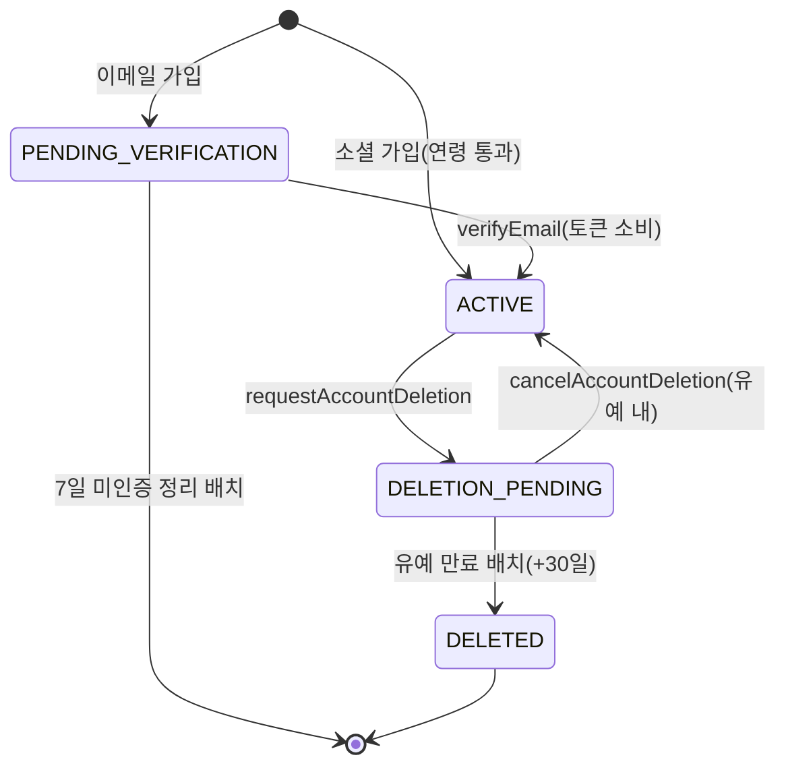

# 유닛 U1 상세 설계 — 기반·계정·온보딩

> 출처: aidlc-docs/construction/u1-foundation/functional-design/{domain-entities,business-rules,business-logic-model,frontend-components}.md · nfr-requirements/{nfr-requirements,tech-stack-decisions}.md · nfr-design/{nfr-design-patterns,logical-components}.md · infrastructure-design/{infrastructure-design,deployment-architecture}.md · construction/plans/u1-foundation-*.md · inception/application-design/unit-of-work.md(U1) · aidlc-docs에서 2026-07-05 추출 · 이후 본 문서가 정본이다.

이 문서는 유닛 **U1(기반·계정·온보딩)**의 상세 설계 정본이다. 도메인 엔티티·비즈니스 규칙·핵심 플로우·프런트엔드 컴포넌트·NFR·인프라를 한 문서로 통합했다. 크로스커팅 문서는 [아키텍처](../architecture.md)·[도메인 모델](../domain.md)·[주요 흐름](../flows.md)·[핵심 결정/ADR](../decisions.md)·[NFR 기준](../nfr.md)·[인프라](../infrastructure.md)·[개발 순서](../units.md)·[용어집](../glossary.md)을 참조한다.

---

## 1. 개요

### 1.1 목적

이후 모든 유닛이 딛고 설 **기술 기반**(모노레포 스캐폴드·전역 보안·공통 인프라)과 **계정 체계**(인증·동의·취향)를 프로덕션 품질로 완성한다. "가입 → 약관 동의 → (선택) 취향 설정 → 온보딩 완료"까지의 사용자 여정이 끝에서 끝까지 동작하는 것이 완주 목표다. U1은 1차 유닛 8개 중 비기능 작업 비중이 가장 크다(스캐폴드 포함).

### 1.2 범위 — 스토리·모듈

| 구분 | 내용 |
|---|---|
| 에픽·스토리 | E1(에픽 1) 18개 스토리 — US-E1-01~18 |
| 서버 모듈 | M1 Auth, M2 User Profile, C3 Content Moderation(금칙어), server/app(전역 설정), server/common/core |
| 클라이언트 features | `features/onboarding` + `shared/` 전체 골격(api·ui 디자인 시스템·storage·validation·location 자리) |
| 신규 엔티티 | 약 10~11종 |
| 외부 연동 | 5종 — 소셜 IdP 4종(Google·Apple·카카오·네이버) + 트랜잭션 메일 1종 |

**포함 범위**
- 모노레포 스캐폴드 전체 생성: server 멀티모듈 골격, apps/mobile Expo 프로젝트(development build + prebuild), CI 파이프라인(빌드·테스트·취약점 스캔 SECURITY-10)
- 소셜 4종+이메일 가입/로그인, 이메일 인증 링크(G22), 토큰 발급·회전(액세스 1h+리프레시 90d, D36), 다기기 허용, 브루트포스 방어(SECURITY-12)
- 연령 확인(만 14세, N1/D33), 약관 동의(필수 3종 분리 체크 + 마케팅 선택 N8)·동의 증적·버전·재동의 플래그(N2·N3), 위치 동의 3층 데이터 모델(OS 권한 × 법정 동의 × GPS 옵트인, G182)과 위치정보 법정 로그 테이블(append-only, N2)
- 닉네임 자동 생성·수정(G23), 금칙어 검증(C3 — 1차 사전 P8), 취향 7종 CRUD·중립 기본값(M2), 온보딩 완료 판정(약관+닉네임, G24/G157)
- 계정 삭제의 **데이터 모델**(소프트 삭제+30일 유예, D18)과 유예 만료 배치 골격 — 전 모듈 연쇄 삭제 완성은 U8(S6)
- 전역 보안 설정: deny-by-default 인증(SECURITY-08), 보안 헤더(SECURITY-04), 전역 에러 핸들러(SECURITY-15), 구조화 로깅·상관 ID·PII 마스킹(SECURITY-03·14), 요청 크기·스키마 검증 프레임(SECURITY-05)

**명시적 제외**
- 계정 수동 연결(소셜↔이메일 통합) — 1차 미제공, CS 처리(G20)
- 마케팅 알림 **발송** — 동의 수집·철회만 1차, 발송은 후속(N8)
- 위치 권한 OS 다이얼로그 **실제 발화** — just-in-time 원칙(US-E1-04)에 따라 발화 지점은 [U3](./u3-place-stay.md)('내 주변')·[U6](./u6-execution.md)(여행 중). U1은 프리프롬프트 프레임·권한 상태 관리만
- 취향 설정 UI의 마이페이지 재진입 — 설정 화면 통합은 [U8](./u8-notification.md)(온보딩 흐름 내 수정은 U1)

### 1.3 선행·후행 유닛

| 관계 | 유닛 | 근거 |
|---|---|---|
| 선행 | 없음 — U1이 1차 루프의 최초 유닛 | [개발 순서](../units.md) |
| 후행(직접 소비) | [U2 앱셸](./u2-appshell.md) — 세션 검증·온보딩 완료 판정·재동의 필요 플래그 API를 스플래시 분기에서 소비(BR-U1-44 부트스트랩 계약) | US-E2-01·06 |
| 후행(연쇄 완성) | [U8 알림·마이페이지](./u8-notification.md) — 계정 삭제 연쇄(S6)·위치 동의 3층 설정 화면·마케팅 토글 | D18, G182, N8 |
| 후행(취향·위치 소비) | [U3](./u3-place-stay.md)(내 주변·필터 기본값)·[U5](./u5-itinerary.md)(일정 생성 입력)·[U6](./u6-execution.md)(GPS 발자취 수집) | US-E1-13·14·17 |

### 1.4 완료 기준(DoD) 요지

U1의 완료 선언은 아래 5축을 전부 충족해야 한다(하나라도 미충족이면 차단).

| 축 | U1 특화 내용 |
|---|---|
| 기능 수용 | E1 18개 스토리 수용 기준 전수 충족. 소셜 4종 각각 신규 생성/기존 로그인/취소/오류 4분기 시나리오 통과. 온보딩 완료 판정=약관+닉네임(취향 전량 건너뛰어도 완료) |
| 하드 제약 100%(D37) | 계정 무결성 계열 100% 통과가 머지 차단 — 중복 계정 미생성(이메일·sub 기준), 미인증 상태 온보딩 진행 차단, 만 14세 미만 가입 차단, 동의 증적 무결성(항목·일시·버전) |
| PBT 존재(PBT-01~10) | 계정 상태 머신 불변식, 리프레시 토큰 회전(재사용 토큰 무효), 닉네임 생성기(패턴·충돌 재추첨 수렴), 동의 증적·프로필 직렬화 왕복. 시드 로깅·수축 필수(PBT-08) |
| 확장 규칙 컴플라이언스 | SECURITY-01~15 중 U1 적용분(특히 03·04·05·08·12·14·15) 전 항목 준수 증빙. 위치 법정 로그 append-only는 마이그레이션 리뷰로 검증 |
| 계약 포인트 | U2가 소비할 세션 검증·온보딩 완료 판정·재동의 필요 플래그 API의 계약 테스트(선행 공급자 측) 작성·통과 |

### 1.5 핵심 리스크와 완화

| 리스크 | 영향 | 완화 |
|---|---|---|
| 소셜 4종 콘솔 심사·키 발급 지연(Apple·카카오·네이버) | U1 완료 지연 | 어댑터 계약 인터페이스+fake로 개발·테스트 선행, 실키 병렬 발급. CI는 전면 모킹(D37) |
| 동일 이메일 소셜/이메일 교차 가입 엣지(Apple 비공개 릴레이) | 중복 계정·CS 부담 | 이메일 대조 가능 시 기존 수단 유도, 불가 시 별도 계정 허용을 명시 정책화(G20) |
| 위치 법정 로그·동의 증적 설계 실수 | 출시 차단급 법적 리스크 | 스키마를 P1 법무 자문 결과와 대조, append-only를 DB 권한 분리로 강제 |
| 금칙어 사전 미확보(P8) | 닉네임·제목 검증 공백 | 임시 최소 사전으로 개발, 사전 교체 가능한 데이터 주도 구조(C3) |
| 스캐폴드 과소 설계(이벤트 버스·모듈 경계) | 후속 전 유닛 재작업 | Gradle 모듈 경계=컴포넌트 경계 컴파일 타임 강제, `common/core` 이벤트 계약 U1 확정, ArchUnit류 아키텍처 테스트 |

### 1.6 선결 과제 연결

| 과제 | 시점 | 내용 |
|---|---|---|
| P7 약관 3종 법무 작성 | 출시 전 필수(개발은 플레이스홀더 문안으로 진행) | 동의 화면·재열람에 실문안 탑재. 버전 체계는 U1 완성, 문안만 교체 |
| P1 위치기반서비스사업 신고·법무 자문 | U6 출시 전 필수, U1 설계 시 자문 반영 권장 | 위치 동의 3층 모델·법정 로그 스키마가 자문 결과와 정합해야 함 |
| P8 금칙어 기본 사전 | U1 출시 전 | C3 사전 데이터 적재 |
| P9 스토어 개발자 계정 | 심사 리드타임 고려해 U1 기간 중 개설 착수 | 소셜 로그인(특히 Apple) 심사 요건과 연동 |

### 1.7 본 유닛에서 확정한 설계 결정(FD-U1-01~10)

| # | 결정 | 내용 | 근거 |
|---|---|---|---|
| FD-U1-01 | 계정 상태 명칭 | `PENDING_VERIFICATION`을 정본 명칭 확정(components.md `UNVERIFIED`와 동일 상태). 소셜 가입은 이 상태를 거치지 않고 즉시 `ACTIVE` | G22 |
| FD-U1-02 | 동의 증적 구조 | ConsentRecord를 GRANT/REVOKE 이벤트 행의 append-only 시퀀스로 확정. `revokedAt?`은 파생 뷰로 재해석 | N2·N3, SECURITY-14 |
| FD-U1-03 | 위치 동의 3층 매트릭스 | 8조합 전수 매트릭스 명문화. 서버 위치 전송=L1∧L2, GPS 발자취 보존=L1∧L2∧L3. L1 정본은 단말, 서버는 미러 | G182, N2/D34 |
| FD-U1-04 | 브루트포스 수치 제안 | 연속 실패 5회부터 점진 지연(2ⁿ⁻⁵초, 상한 60초, 15분 슬라이딩 윈도), 20회 도달 시 30분 잠금 — 운영 조정 가능 값 | SECURITY-12 |
| FD-U1-05 | 닉네임 재추첨 수렴 | 재추첨 최대 10회, 소진 시 숫자 자릿수 확장(2→3자리) 폴백 — 유한 시도 내 유니크 수렴 보장 | G23 |
| FD-U1-06 | 페이스 중립 기본값 | 미설정 페이스의 내부 밀도 파라미터='균형있게' 상당(하루 3~4곳). 저장은 NULL 유지, 파생 시점 주입 | US-E1-14·15 |
| FD-U1-07 | GPS 파기 시점 | 계정 삭제 **요청 시점**에 GPS 발자취 즉시 파기(유예 복구 시에도 미복원 — 법정 요구 우선). 법정 로그는 보존 | D34, N2 |
| FD-U1-08 | 재발송 시 구 토큰 처리 | 인증 메일 재발송 시 기존 미소비 토큰 즉시 무효화(유효 토큰 항상 최대 1개) | G22 |
| FD-U1-09 | 온보딩 완료와 취향의 독립 | 완료 판정=(약관 동의 상태 × 닉네임 통과) 2입력 순수 함수. 취향 상태 미참여, `completeOnboarding` 반복 호출 멱등 | G24/G157 |
| FD-U1-10 | 부트스트랩 판정 우선순위 | 강제 업데이트(N4) > 재동의(N3) > 세션(G5) — U2 스플래시 분기 계약의 공급자측 정본 | N3, N4, G5 |

---

## 2. 도메인 엔티티

소유 모듈: M1 Auth, M2 User Profile, C3 Content Moderation. 표기 규약: `필수`=NULL 불가, `선택`=NULL 허용(NULL 의미 명기), `유니크`=전역 유일 제약. 기술 중립 — 저장 기술·컬럼 타입·인덱스는 NFR/인프라 소유.

### 2.1 엔티티 지도

```text
[M1 Auth]
Account 1 ──── * SocialIdentity          (소셜 연결, provider+sub 복합 유니크)
Account 1 ──── * EmailVerification       (인증 토큰 발급 이력)
Account 1 ──── * ConsentRecord           (append-only 동의 증적)
Account 1 ──── 0..1 MarketingConsent     (현재 상태 뷰)
Account 1 ──── 1 LocationConsentState    (3층 동의 현재 상태)
Account 1 ──── * RefreshSession          (기기별 회전 체인)
Account 1 ──── 0..1 DeletionSchedule     (30일 유예)
TermsVersion * ──── * ConsentRecord      (동의 대상 버전 참조)
(독립) LocationLegalLog                  (append-only 법정 로그 — 앱 역할 삭제 불가)

[M2 User Profile]
Account 1 ──── 1 Profile
Profile 1 ──── 1 PreferenceSet           (7축, 축별 NULL=미설정)

[C3 Content Moderation]
(독립) BannedWordDictionary              (버전 관리 사전)
```

### 2.2 Account — 계정 (M1)

계정 생명주기·인증 수단·연령 확인의 정본. 모든 계정은 '여행자' 단일 유형(US-E1-01).

| 속성 | 타입 | 제약 | 의미·근거 |
|---|---|---|---|
| accountId | 식별자 | 필수·유니크·불변 | 전역 계정 식별자. 외부 노출 식별자는 추측 불가 형식(순차 노출 금지 — SECURITY-08 IDOR 방어 보조선) |
| email | 문자열(이메일) | 선택·**활성 계정 간 유니크**(INV-A3) | 이메일 가입=필수, 소셜=제공자 제공 시 저장. NULL=소셜 제공자 이메일 미제공. Apple 비공개 릴레이 주소는 릴레이 주소 그대로 저장 [G20] |
| passwordHash | 문자열(해시) | 선택 | 이메일 계정만 보유. 적응형 해시 결과만 저장 — 평문·가역 암호화 금지 [G22] |
| ageConfirmation | 구조체 {method: BIRTH_DATE\|SELF_DECLARED, birthDate?, confirmedAt} | 필수 | 생년월일 입력 또는 '만 14세 이상' 자기확인. 가입 경로 무관 필수 [N1/D33, US-E1-16] |
| status | 열거 | 필수 | `PENDING_VERIFICATION → ACTIVE → DELETION_PENDING → DELETED` [D18, G22] |
| sanctionStatus | 열거 | 필수·기본 `NONE` | 후속 예약 필드(경고→커뮤니티 정지→전체 정지). 1차는 `NONE` 고정 [G179] |
| createdAt | 시각(UTC) | 필수·불변 | 계정 생성 시각 |
| verifiedAt | 시각(UTC) | 선택 | 이메일 인증 완료 시각. 소셜은 생성 시각과 동일. NULL=미인증 |
| deletedAt | 시각(UTC) | 선택 | 소프트 삭제 마킹(DELETION_PENDING 진입 시각). NULL=삭제 아님 [D18] |

**계정 상태 머신**(requirements.md §9 이관분 확정 정본):



| 전이 | 트리거 | 가드 조건 | 효과 |
|---|---|---|---|
| (없음)→PENDING_VERIFICATION | `signUpWithEmail` | 연령 통과(N1)·이메일 활성 중복 없음(BR-U1-01)·유예 중 동일 식별자 아님(C4) | EmailVerification 발급·메일 발송. 온보딩 진행 차단 |
| (없음)→ACTIVE | `signUpWithSocial`(신규) | 연령 통과·이메일 충돌 처리 통과(BR-U1-03)·유예 중 재가입 아님(C4) | 소셜은 제공자가 신원 보증 → 인증 단계 생략, 즉시 활성 |
| PENDING_VERIFICATION→ACTIVE | `verifyEmail`(링크 토큰 소비) | 토큰 유효(24h·미소비·최신 발급분) | verifiedAt 기록·자동 로그인·약관 동의 단계 진행 |
| PENDING_VERIFICATION→(정리 파기) | 미인증 정리 배치(일 1회) | 생성 후 7일 경과·미인증 유지 | 계정·인증 토큰 물리 정리. 동일 이메일 재가입 즉시 허용 |
| ACTIVE→DELETION_PENDING | `requestAccountDeletion` | 재확인 완료·연쇄 삭제 범위 사전 고지(BR-U1-37) | deletedAt 기록·즉시 비노출·DeletionSchedule 생성(purgeAt=+30일)·전 세션 무효화·GPS 발자취 즉시 파기(FD-U1-07) |
| DELETION_PENDING→ACTIVE | 유예 중 로그인→복구 확인→`cancelAccountDeletion` | purgeAt 도래 전 | deletedAt 해제·스케줄 폐기·노출 복원(GPS 발자취는 미복원 — 기파기) |
| DELETION_PENDING→DELETED | 유예 만료 배치(일 1회) | purgeAt 경과 | 연쇄 삭제 오케스트레이션(U1은 계정·프로필·취향·세션·소셜 연결 골격, 전 모듈 완성은 U8/S6). 법정 보존 데이터(위치 법정 로그·동의 증적)만 분리 보관 |
| DELETED | — (최종) | 재개 없음 | 동일 식별자 재가입은 신규 계정으로 허용(C4 제한 해제) |

**불변식**
- **INV-A1(상태 전이 폐쇄)**: status는 위 표의 전이로만 변경. 임의 상태 점프(DELETED→ACTIVE 등) 불가 — 하드 제약 '계정 무결성' 테스트 대상.
- **INV-A2(연령 게이트)**: 어떤 경로로도 ageConfirmation 없이 또는 만 14세 미만으로 계정 행 존재 불가 — 차단은 계정 생성 **이전** [N1/D33].
- **INV-A3(이메일 유일성)**: `status ∈ {PENDING_VERIFICATION, ACTIVE, DELETION_PENDING}` 집합 안에서 email(NULL 제외)은 유일. DELETED·정리 파기 계정의 이메일은 재사용 가능 [C4].
- **INV-A4(인증 수단 존재)**: ACTIVE 계정은 passwordHash 또는 1개 이상 SocialIdentity 중 최소 하나 보유.
- **INV-A5(삭제 마킹 정합)**: `status=DELETION_PENDING ⇔ deletedAt≠NULL ∧ DeletionSchedule 존재`. DELETION_PENDING은 모든 조회·기능에서 비노출(로그인 시 복구 안내만 예외).
- **INV-A6(미인증 격리)**: PENDING_VERIFICATION은 약관 동의 이후 온보딩 단계로 진행 불가, 토큰 발급 대상 아님(인증 완료 시점 최초 발급) [G22].

### 2.3 SocialIdentity — 소셜 연결 (M1)

계정 식별 기준은 이메일이 아니라 **제공자 고유 ID(sub)**.

| 속성 | 타입 | 제약 | 의미·근거 |
|---|---|---|---|
| provider | 열거 {GOOGLE, APPLE, KAKAO, NAVER} | 필수 | 소셜 4종 |
| providerSub | 문자열 | 필수 | 제공자 발급 고유 사용자 ID. 토큰 서명·수신자 검증 통과분만 저장 |
| accountId | 식별자(FK) | 필수 | N:1 — 복수 제공자 연결 구조 허용(단 1차 수동 연결 미제공 — 실제 N>1 미발생, CS 처리 [G20]) |
| providerEmail | 문자열 | 선택 | 제공자 이메일(대조용 스냅샷). NULL=미제공/대조 불가(Apple 비공개 릴레이 포함) |
| linkedAt | 시각(UTC) | 필수·불변 | 최초 연결 시각 |

**불변식**: INV-S1(복합 유니크) `(provider, providerSub)`는 전역 유일 — 동일 소셜 신원이 두 계정에 매핑 불가(하드 제약 '중복 계정 미생성' 구조적 강제). INV-S2(댕글링 금지) Account 없이 존재 불가, 계정 DELETED 시 함께 파기.

### 2.4 EmailVerification — 이메일 인증 토큰 (M1)

인증 링크 발급·소비 이력. 재발송 제한 판정 근거 데이터 겸용.

| 속성 | 타입 | 제약 | 의미·근거 |
|---|---|---|---|
| verificationId | 식별자 | 필수·유니크 | — |
| accountId | 식별자(FK) | 필수 | 대상 계정(PENDING_VERIFICATION) |
| tokenHash | 문자열(해시) | 필수·유니크 | 링크 토큰 해시만 저장(원문 미저장 — 로그·DB 유출 시 재사용 방지) |
| issuedAt | 시각(UTC) | 필수·불변 | 발급 시각. 재발송 rate-limit(분당 1·일 5)은 계정별 issuedAt 시퀀스로 판정 |
| expiresAt | 시각(UTC) | 필수 | `= issuedAt + 24시간` |
| consumedAt | 시각(UTC) | 선택 | 소비 시각. NULL=미소비 |
| invalidatedAt | 시각(UTC) | 선택 | 무효화 시각(재발송에 의한 구 토큰 무효 — FD-U1-08). NULL=무효화 안 됨 |

**불변식**: INV-E1(1회성) consumedAt 기록 토큰 재소비 불가(재클릭=이미 인증됨 안내). INV-E2(단일 유효) 계정당 `consumedAt=NULL ∧ invalidatedAt=NULL ∧ expiresAt>now` 토큰은 최대 1개 — 재발송은 기존 유효 토큰 먼저 무효화. INV-E3(만료 불소비) `expiresAt ≤ 소비 시각`인 소비 불가 → `TokenExpired`+재발송 안내.

### 2.5 TermsVersion — 약관 버전 (M1)

약관 3종+선택 동의 문서의 버전 정본. 재동의 판정 입력.

| 속성 | 타입 | 제약 | 의미·근거 |
|---|---|---|---|
| termsType | 열거 {TERMS_OF_SERVICE, PRIVACY_POLICY, LOCATION_TERMS, MARKETING, GPS_RECORDING, PERSONALIZATION} | 필수 | 필수 3종=이용약관·개인정보 처리방침·위치기반서비스 이용약관(분리 항목 N2). MARKETING·GPS_RECORDING은 선택 동의 문안, PERSONALIZATION은 기록 개인화 예약(US-E8-10 대비) |
| version | 문자열(버전) | 필수·(termsType 내) 유니크 | 문안 버전. P7 실문안 탑재 전 플레이스홀더 버전으로 운영 — 버전 체계는 U1 완성 |
| body | 텍스트/문서 참조 | 필수 | 상시 재열람 제공(현행+이력) [N5] |
| effectiveAt | 시각(UTC) | 필수 | 시행 시각 |
| reconsentRequired | 불리언 | 필수 | 재동의 필요 플래그 — true=중대 변경(스플래시 재동의 강제), false=경미 변경(인앱 공지) [N3] |

**불변식**: INV-T1(버전 불변) 시행된 버전의 body·effectiveAt·reconsentRequired 수정 금지 — 변경은 항상 새 버전 발행. INV-T2(현행 유일) termsType별 `effectiveAt ≤ now` 최신 1개가 '현행', 동의·재동의 판정은 항상 현행 기준.

### 2.6 ConsentRecord — 동의 증적 (M1, append-only)

동의·철회의 법정 증적. **행 단위 불변·추가 전용** — 갱신·삭제 연산 부재(FD-U1-02).

| 속성 | 타입 | 제약 | 의미·근거 |
|---|---|---|---|
| recordId | 식별자 | 필수·유니크·단조 증가 | 증적 순서 보장 |
| accountId | 식별자(FK) | 필수 | 동의 주체 |
| termsType | 열거(동일) | 필수 | 동의 항목 |
| termsVersion | 문자열(TermsVersion 참조) | 필수 | 동의한 문안 버전 — 항목·일시·버전 3요소가 증적 최소 구성 |
| action | 열거 {GRANT, REVOKE} | 필수 | 부여/철회. 철회도 새 행으로 추가 |
| occurredAt | 시각(UTC) | 필수·불변 | 동의·철회 일시 |
| channel | 열거 {ONBOARDING, RECONSENT, SETTINGS} | 필수 | 수집 지점(증적 맥락) |

**불변식**: INV-C1(append-only) 기존 행 수정·삭제 불가, 계정 DELETED 시에도 법정 보존 대상 분리 보관(파기 대상 아님) — DB 권한 분리로 강제, 마이그레이션 리뷰 검증. INV-C2(현재 상태=폴드) 항목별 현재 동의 상태는 `(termsType별 occurredAt 최신 행).action = GRANT`로 유도. INV-C3(필수 동의 완비) 온보딩 완료 계정은 필수 3종 각각 현행 계보 GRANT 보유. INV-C4(REVOKE 전제) REVOKE 행은 동일 termsType 선행 GRANT 없이 존재 불가.

### 2.7 MarketingConsent — 마케팅 수신 동의 현재 상태 (M1)

증적의 파생 뷰를 즉시 조회 상태로 유지. 1차는 **발송 없음**, 수집·철회만(N8).

| 속성 | 타입 | 제약 | 의미·근거 |
|---|---|---|---|
| accountId | 식별자(FK) | 필수·유니크 | 1:0..1 |
| optIn | 불리언 | 필수 | 현재 수신 동의 여부. 온보딩 미동의 진행 가능(선택 항목) |
| updatedAt | 시각(UTC) | 필수 | 최종 변경 시각 |

**불변식**: INV-M1(증적 정합) optIn은 ConsentRecord(MARKETING) 최신 action과 항상 일치 — 변경은 증적 추가와 원자적. INV-M2(발송 부재) 1차 범위에 optIn=true 소비 발송 로직 부재.

### 2.8 LocationConsentState + LocationLegalLog — 위치 동의 3층·법정 로그 (M1)

**3층 모델(G182)**:

| 층 | 이름 | 정본 위치 | 의미 |
|---|---|---|---|
| L1 | OS 위치 권한 | **클라이언트(단말)** — 서버는 마지막 보고값 미러만 | OS 다이얼로그 허용 여부. just-in-time 발화(실제 발화는 U3·U6, U1은 프리프롬프트 프레임·상태 관리만) |
| L2 | 앱 내 법정 동의 | 서버(ConsentRecord LOCATION_TERMS) | 위치기반서비스 약관 **필수** 동의 — 온보딩 게이트 대상 |
| L3 | GPS 기록 옵트인 | 서버(ConsentRecord GPS_RECORDING) | GPS 여행 기록 보관 **선택** 동의 — 미동의로도 온보딩·서비스 이용 가능 |

**LocationConsentState 속성**: accountId(FK, 필수·유니크, 1:1), osPermissionMirror(열거 {GRANTED, DENIED, NOT_DETERMINED}, 필수·기본 NOT_DETERMINED — 단말 보고값 미러, 판정 정본은 단말 런타임), legalConsent(불리언 파생 — L2 현재 상태), gpsRecordingOptIn(불리언 파생 — L3 현재 상태), updatedAt(필수).

**조합별 기능 동작 매트릭스(G182 정본)** — 판정 함수 `effectiveCapabilities(L1, L2, L3)`는 총함수(8조합 전부 정의), 클라이언트 shared/location 런타임 판정기와 서버 M1이 동일 명세 공유:

| # | L1 OS | L2 법정 | L3 GPS | 단말 로컬 위치¹ | 서버 위치 서비스² | GPS 발자취 보존³ | 대표 상황·폴백 |
|---|---|---|---|---|---|---|---|
| 1 | ✕ | ✕ | ✕ | 불가 | 불가 | 불가 | 온보딩 전/재동의 대기+권한 거부. 위치 전부 비활성 — 등록 숙소·여행지 중심 좌표 폴백 |
| 2 | ✕ | ✕ | ○ | 불가 | 불가 | 불가 | 과도 상태. L3은 L2 없이 무효 — 수집 0 |
| 3 | ✕ | ○ | ✕ | 불가 | 불가(입력 없음) | 불가 | 법정 동의 있으나 OS 거부. 수동 입력·등록 숙소 기준 폴백, "설정에서 켤 수 있습니다" 안내 |
| 4 | ✕ | ○ | ○ | 불가 | 불가(입력 없음) | 불가(입력 없음) | OS 거부로 단말 위치 없음 — 옵트인 유지되나 실입력 0. OS 허용 시 5→8행 동작 |
| 5 | ○ | ✕ | ✕ | 가능 | **금지** | 금지 | 재동의 대기 등 예외. 단말 내 편의(현위치 표시)까지만 — 서버 전송·처리 금지 |
| 6 | ○ | ✕ | ○ | 가능 | **금지** | 금지 | 5와 동일 — L3 단독 무효 |
| 7 | ○ | ○ | ✕ | 가능 | 가능 | **불가** | 표준 상태(옵트인 안 함). 내 주변·도착 프롬프트 동작, 발자취 미수집 |
| 8 | ○ | ○ | ○ | 가능 | 가능 | 가능 | 전체 활성 — GPS 발자취 수집·보존(수집은 U6, 동의 모델은 U1) |

¹ 단말 로컬 위치: 지도 현위치 표시 등 단말 내 처리·서버 미전송. ² 서버 위치 서비스: 위치 서버 전송·처리(내 주변 기준점·도착 확인·이동 지연 트리거 — 실기능 U3·U6). ³ GPS 발자취 보존: 서버측 폴리라인 영구 보존(U6).

**매트릭스 불변식**: INV-L1(서버 전송 게이트) `serverLocationService = L1 ∧ L2`. INV-L2(보존 게이트) `gpsTrackRetention = L1 ∧ L2 ∧ L3`. INV-L3(단조성) 층 추가로 기존 능력 축소 없음. INV-L4(철회 즉시성) L3 REVOKE 시 수집 즉시 중단+기보존 GPS 발자취 즉시 파기 트리거(M12.purgeLocationData). INV-L5(온보딩 독립) L1·L3의 어떤 값도 온보딩 완료를 막지 않음(L2만 필수 게이트).

**LocationLegalLog — 위치정보 수집·이용·제공 사실 확인자료(법정 로그)**:

| 속성 | 타입 | 제약 | 의미 |
|---|---|---|---|
| logId | 식별자 | 필수·유니크·단조 증가 | — |
| accountId | 식별자 | 필수 | 대상(파기 후에도 로그 잔존 — FK 강제 아닌 값 보존) |
| eventType | 열거 {CONSENT_GRANTED, CONSENT_REVOKED, COLLECTION, USE, PROVISION, PURGE} | 필수 | U1 발생분=동의·철회·파기 트리거, 수집·이용은 U6부터 |
| detail | 구조체(사유·범위 요약) | 필수 | 원시 좌표 미포함(사실 확인자료이지 위치 데이터 아님) |
| occurredAt | 시각(UTC) | 필수·불변 | — |

**불변식**: INV-LL1(append-only·권한 분리) 애플리케이션 역할은 갱신·삭제 권한 없음(추가만) — DB 레벨 권한 분리 강제, 마이그레이션 리뷰 검증. INV-LL2(보존 기간) 최소 6개월 보존 — 계정 삭제·GPS 파기와 독립.

### 2.9 RefreshSession — 리프레시 토큰 회전 체인 (M1)

기기별 세션 정본. 토큰 회전·재사용 감지 데이터 기반(D36).

| 속성 | 타입 | 제약 | 의미·근거 |
|---|---|---|---|
| sessionId | 식별자 | 필수·유니크 | 회전 체인 항목 식별 |
| accountId | 식별자(FK) | 필수 | — |
| deviceId | 문자열 | 필수 | 기기 식별 — 다기기 동시 로그인은 기기별 체인 분리로 허용 |
| tokenHash | 문자열(해시) | 필수·유니크 | 리프레시 토큰 해시(원문 미저장). 토큰 자체는 단말 OS 보안 저장소 보관(SECURITY-12) |
| chainId | 식별자 | 필수 | 동일 기기 로그인 1회가 만드는 회전 체인 묶음 식별자 |
| issuedAt | 시각(UTC) | 필수 | 발급 시각. 리프레시 수명 90일 |
| expiresAt | 시각(UTC) | 필수 | `= issuedAt + 90일` |
| rotatedAt | 시각(UTC) | 선택 | 회전 소비 시각. NULL=체인의 현행 토큰 |
| revokedAt | 시각(UTC) | 선택 | 무효화 시각(로그아웃·재사용 감지·비밀번호 재설정·계정 삭제). NULL=유효 |

> **TokenPair**: 액세스 토큰(수명 1시간)은 자기 서명 검증형 무상태 값 객체 — 엔티티가 아니며, 영속 정본은 RefreshSession뿐(D36).

**불변식**: INV-R1(체인 현행 유일) 체인마다 `rotatedAt=NULL ∧ revokedAt=NULL ∧ expiresAt>now` 토큰 최대 1개. INV-R2(재사용=탈취 신호) `rotatedAt≠NULL` 토큰 재사용 시도는 인증 실패이자 **해당 체인 전체 즉시 무효화+보안 알림** 트리거. INV-R3(기기 격리) 체인 무효화 기본 범위는 해당 deviceId 체인 — 타 기기 유지. 단 비밀번호 재설정은 **전 기기** 무효화. INV-R4(상태 종속) ACTIVE 아닌 계정에 유효 체인 부재 — 삭제 요청 시 전 체인 revoke.

### 2.10 DeletionSchedule — 삭제 유예 (M1)

| 속성 | 타입 | 제약 | 의미·근거 |
|---|---|---|---|
| accountId | 식별자(FK) | 필수·유니크 | 계정당 최대 1개(활성 기준) |
| requestedAt | 시각(UTC) | 필수·불변 | 삭제 요청 시각 |
| purgeAt | 시각(UTC) | 필수 | `= requestedAt + 30일` — 유예 만료 배치 판정 기준 |
| cascadeSummary | 구조체 | 필수 | 요청 시점 고지 스냅샷: 숙소(위시리스트·등록)·여행·일정·기록·회고·사진, (후속) 커뮤니티 게시물 삭제·댓글 '삭제된 사용자' 익명화. 법정 보존 분리 항목(위치 법정 로그·동의 증적) 명시 |
| cancelledAt | 시각(UTC) | 선택 | 철회 시각. NULL=진행 중 |

**불변식**: INV-D1(유예 정합) `cancelledAt=NULL ∧ purgeAt>now` 존재 ⇔ status=DELETION_PENDING. INV-D2(만료 후 철회 불가) purgeAt 경과 후 철회 시도는 `ResourceNotFound`.

### 2.11 Profile — 프로필 (M2)

| 속성 | 타입 | 제약 | 의미·근거 |
|---|---|---|---|
| accountId | 식별자(FK) | 필수·유니크 | 1:1 |
| nickname | 문자열 | 필수·**활성 계정 간 유니크**·2~20자 | 자동 생성 기본값('형용사+여행명사+2자리 숫자')으로 시작 — 항상 값 존재(NULL 불가) [G23] |
| nicknameUpdatedAt | 시각(UTC) | 필수 | 최종 변경 시각(자동 생성 시각 포함) |
| onboardingCompletedAt | 시각(UTC) | 선택 | 온보딩 완료 판정 시각. NULL=미완료. 판정=약관 동의+닉네임 통과(취향 무관) [G24/G157] |

**불변식**: INV-P1(닉네임 검증 통과) 저장 nickname은 길이(2~20)·금칙어(C3)·유니크 3검증 통과값(자동 생성값 포함 — 생성기는 사전 검증 어휘풀 사용). INV-P2(완료 판정 정합) `onboardingCompletedAt≠NULL ⇒ INV-C3 ∧ nickname 존재`, 역방향 기록은 `completeOnboarding` 멱등 호출로만. INV-P3(닉네임 전파 규칙) 표시(추후 댓글·게시물)는 accountId 라이브 참조, 기록·복제 출처는 시점 스냅샷.

### 2.12 PreferenceSet — 취향 7축 (M2)

축별 NULL=**미설정**이며 **중립 기본값과 명확히 구분**한다: 중립 기본값은 저장되지 않고 조회 시점 파생 주입되며 `isNeutralDefault=true` 플래그로 표시(US-E1-14). 값 도메인은 PRD 03 선택지 그대로(stories.md E1 정본).

| 축 | 속성 | 타입·값 도메인 | 선택 방식 | NULL(미설정) 의미 | 중립 기본값(파생·저장 안 함) | 근거 |
|---|---|---|---|---|---|---|
| 1 스타일 | styles | 집합 ⊆ {휴양, 관광, 액티비티, 미식, 쇼핑, 자연, 문화예술} | 복수(1+) | 스타일 축 무가중 | 무가중치 | US-E1-05 |
| 2 예산 | budgetTier / budgetRawAmount | 열거 {저가, 중간, 고급, 럭셔리} / 금액(원, 양수) | 4구간 선택 또는 직접 총액 입력(원값+매핑 구간 동시 저장) | 가격 필터 미적용·전체 가격대 노출 | 필터 미적용 | US-E1-06, D26/Δ2, G26 |
| 3 동행 | companionType + petFlag | 열거 {혼자, 커플, 친구, 가족(아동 동반), 부모님} + 불리언 | 기본 유형 **단일** 선택 + 반려동물 **분리 불리언** | 동행 축 무가중 | 무가중치·petFlag 기본 false | US-E1-07, G19 |
| 4 활동 | activities | 집합 ⊆ {자연, 역사문화, 테마파크, 맛집투어, 카페, 전시, 야경, 쇼핑, 스포츠} | 복수 | 활동 축 무가중 | 무가중치 | US-E1-08 |
| 5 이동 | transportModes | 집합 ⊆ {도보, 대중교통, 렌터카, 택시, 자전거} | 복수 | 동선 기본 수단 미지정 | **대중교통**+안전계수 보수 추정(내부 계산 한정 — 화면은 거리만) | US-E1-09·14, D25/Δ1 |
| 6 음식 | foodTastes | 집합 ⊆ {한식, 양식, 일식, 중식, 아시안, 기타} | 복수 | 음식 축 무가중 | 무가중치 | US-E1-10 |
| 7 페이스 | pace | 열거 {느긋하게(1~2곳), 균형있게(3~4곳), 빡빡하게(5곳+)} | 단일 | 밀도 지정 없음 | 내부 밀도='균형있게' 상당(FD-U1-06) | US-E1-15 |

공통 속성: `accountId`(필수·유니크, Profile 1:1), `updatedAt`(필수 — 저장 즉시 반영 기준 시각).

**불변식**: INV-PR1(값 도메인 폐쇄) 각 축 저장값은 도메인 원소만 허용. INV-PR2(미설정≠중립) 저장 계층에 중립 기본값 부재, NULL과 명시 선택값(예: 이동=대중교통 직접 고름)은 항상 구분 가능·직렬화 왕복 보존. INV-PR3(예산 쌍 정합) `budgetRawAmount≠NULL ⇒ budgetTier=매핑함수(budgetRawAmount)`, 1박 가격대 환산은 저장 안 함(여행 생성 시점 파생 — U4). INV-PR4(동행 구조) companionType 단일값·petFlag 독립 불리언(petFlag만 true+companionType=NULL 허용). INV-PR5(무실패 보장) 7축 전부 NULL이어도 getPreferences는 항상 완전한 응답 반환 — 미설정만으로 일정 생성 실패 없음.

### 2.13 BannedWordDictionary — 금칙어 사전 (C3)

| 속성 | 타입 | 제약 | 의미·근거 |
|---|---|---|---|
| dictVersion | 문자열(버전) | 필수·유니크 | 데이터 주도 교체 구조(P8 확보 전 임시 최소 사전으로 개발) |
| entries | 목록<{word, category: 열거(욕설·차별·성인·사칭·기타)}> | 필수 | 매칭 어휘. 매칭 원문은 검증 응답에 미포함(우회 학습 방지) |
| deployedAt | 시각(UTC) | 필수 | 배포 시각 |
| active | 불리언 | 필수 | 활성 버전 1개 |

**불변식**: INV-B1(활성 유일) active=true 버전은 항상 정확히 1개. INV-B2(fail-closed) 활성 사전 로드 불가 시 검증 요청은 통과 처리하지 않음 — 저장 보류+재시도 안내. INV-B3(일관 적용) 닉네임(M2)·여행 제목(M6 — U4)·후속 UGC 전부 동일 사전·동일 기준.

### 2.14 엔티티-스토리 추적 요약

| 엔티티 | 주 근거 스토리 | 주 결정 |
|---|---|---|
| Account·SocialIdentity | US-E1-01, US-E1-16 | D18, D22, D33/N1, G20, G22, C4 |
| EmailVerification | US-E1-01 | G22 |
| TermsVersion·ConsentRecord | US-E1-02·17·18 | N2/D34, N3, N8 |
| MarketingConsent | US-E1-02 | N8 |
| LocationConsentState·LocationLegalLog | US-E1-04·17 | N2/D34, G182 |
| RefreshSession | US-E1-01(+U2 US-E2-01) | D36, SECURITY-12 |
| DeletionSchedule | US-E09-09 소비 | D18, D34, C4 |
| Profile | US-E1-03·11 | G23, G24/G157 |
| PreferenceSet | US-E1-05~10·12~15 | D26/Δ2, G19, G26, D25/Δ1 |
| BannedWordDictionary | US-E1-03·12 | G23, P8, N6 |

---

## 3. 비즈니스 규칙 (BR-U1-01~44)

규칙 ID `BR-U1-xx`는 본 유닛 전역 유일이며 코드·테스트·리뷰에서 이 ID로 추적한다. 각 규칙은 조건(언제 평가) / 동작(무엇을) / 위반 시 처리(사용자·시스템) / 근거로 기술한다. 기술 중립 — 알고리즘·라이브러리·인프라 명명은 [NFR](#6-nfr)·[인프라](#7-인프라) 소유.

| 그룹 | 규칙 |
|---|---|
| A. 가입·계정 생성 | BR-U1-01 ~ 07 |
| B. 비밀번호 | BR-U1-08 ~ 11 |
| C. 이메일 인증 | BR-U1-12 ~ 15 |
| D. 닉네임 | BR-U1-16 ~ 20 |
| E. 약관·동의 | BR-U1-21 ~ 25 |
| F. 온보딩 진행·완료 | BR-U1-26 ~ 28 |
| G. 취향 | BR-U1-29 ~ 32 |
| H. 토큰·세션 | BR-U1-33 ~ 36 |
| I. 계정 삭제 | BR-U1-37 ~ 40 |
| J. 위치 동의 | BR-U1-41 ~ 43 |
| K. 부트스트랩 게이트 | BR-U1-44 |

### 3.1 A. 가입·계정 생성

**BR-U1-01 이메일 중복 가입 차단**
- 조건: 이메일 가입 요청(`signUpWithEmail`) 시, 입력 이메일이 활성 계정 집합(PENDING_VERIFICATION·ACTIVE·DELETION_PENDING)에 이미 존재.
- 동작: 계정을 생성하지 않는다(INV-A3). 로그인·비밀번호 재설정 경로 안내, 등록 이메일로 재설정 링크 발송 경로 제공.
- 위반 시: `EmailAlreadyRegistered` — 중복 계정 0건이 하드 제약(계정 무결성 계열, 머지 차단 테스트) [D37, U1 DoD].
- 근거: US-E1-01, G22.

**BR-U1-02 소셜 계정 식별은 제공자 sub 기준**
- 조건: 소셜 인증 성공(제공자 토큰 서명·수신자 검증 통과) 시.
- 동작: `(provider, providerSub)`로 SocialIdentity 조회 → **존재하면 기존 로그인, 없으면 신규 생성 분기**. 이메일은 식별 기준이 아니라 충돌 대조(BR-U1-03)의 보조 입력이다.
- 위반 시: 동일 (provider, sub) 이중 매핑은 구조적으로 불가(INV-S1 복합 유니크) — 위반 시도는 저장 계층에서 거부.
- 근거: US-E1-01, component-methods M1.signUpWithSocial.

**BR-U1-03 소셜/이메일 동일 이메일 충돌 처리**
- 조건: 소셜 신규 가입 분기에서 제공자 이메일이 기존 계정(이메일 또는 타 소셜)의 email과 일치.
- 동작: 신규 계정을 생성하지 않고 **기존 로그인 수단으로 유도**(어느 수단인지 안내 — 이메일/Google/카카오 등). 1차에서 계정 수동 연결(소셜↔이메일 통합) 미제공 — CS 문의 처리.
- 위반 시: 사용자가 기존 수단 로그인을 거부해도 동일 이메일로 별도 계정을 만들지 않는다(대조 가능한 경우 한정 — 예외는 BR-U1-04).
- 근거: US-E1-01, G20, unit-of-work U1 리스크 "동일 이메일 교차 가입 엣지".

**BR-U1-04 Apple 비공개 릴레이 등 대조 불가 시 별도 계정 허용**
- 조건: 소셜 신규 가입에서 제공자 이메일 미제공/대조 불가(Apple 비공개 릴레이 주소 등).
- 동작: best-effort 대조 후 불가 판정이면 **별도 계정으로 생성**(명시 정책 — 중복 계정처럼 보여도 정책상 허용, CS 처리 대상). providerEmail에 릴레이 주소(또는 NULL) 기록해 추후 CS 대조 근거로 남긴다.
- 위반 시: 해당 없음(허용 정책) — 단 이 경로 생성 계정도 INV-S1(sub 유일) 동일 적용.
- 근거: US-E1-01, G20, components.md M1.

**BR-U1-05 만 14세 미만 가입 차단 (연령 게이트)**
- 조건: 모든 가입 경로(소셜 4종·이메일)의 계정 생성 직전.
- 동작: 생년월일 입력 또는 '만 14세 이상입니다' 확인을 필수 수집. 만 14세 미만이면 **계정을 생성하지 않고** 차단·사유 안내. 연령 확인 통과 전 계정 활성화·온보딩 진행 불가.
- 위반 시: `AgeRestricted` — 계정 행 미생성(INV-A2). 만 14세 미만 차단은 하드 제약(계정 무결성 계열, 머지 차단 테스트) [D37, U1 DoD].
- 근거: US-E1-16, N1/D33.

**BR-U1-06 삭제 유예 중 동일 식별자 재가입 차단**
- 조건: 가입 요청의 식별자(이메일 또는 provider+sub)가 DELETION_PENDING 계정에 귀속.
- 동작: 신규 가입 차단, 기존 계정의 **삭제 철회(복구) 경로** 안내(BR-U1-39).
- 위반 시: 유예 30일 경과(DELETED) 후에는 동일 식별자 신규 가입 허용.
- 근거: C4(§7.4), D18, component-methods M1.signUpWithSocial 가드.

**BR-U1-07 단일 계정 유형**
- 조건: 계정 생성 시.
- 동작: 모든 계정은 '여행자' 단일 유형 생성 — 유형 선택 UI·필드 분기 없음(운영자는 별도 내부 도구 체계, D35 후속).
- 위반 시: 해당 없음(선택지 자체가 없는 구조적 강제).
- 근거: US-E1-01.

### 3.2 B. 비밀번호

**BR-U1-08 비밀번호 정책**
- 조건: 비밀번호를 설정·변경하는 모든 지점(이메일 가입·재설정).
- 동작: (1) 8자 이상, (2) 영문·숫자 각 1자 이상, (3) 알려진 유출 비밀번호 목록 대조 통과 — 3조건 전부 충족해야 수용.
- 위반 시: `WeakPassword(reasons)` — 미충족 조건 항목별 반환·인라인 안내. 저장하지 않음.
- 근거: US-E1-01, G22, §6.4 SECURITY-12.

**BR-U1-09 비밀번호 저장 방식**
- 조건: 정책 통과 비밀번호 저장 시.
- 동작: 적응형(연산 비용 조정형) 단방향 해시 결과만 저장. 평문·가역 암호화·범용 고속 해시 금지. **구체 알고리즘·비용 파라미터는 NFR Design 소유**(argon2id 권고 — §6).
- 위반 시: 코드 리뷰·보안 컴플라이언스 차단(SECURITY-12 비준수=blocking).
- 근거: US-E1-01, G22, §6.4.

**BR-U1-10 비밀번호 재설정과 전 기기 세션 무효화**
- 조건: 재설정 링크 검증 후 새 비밀번호 저장 성공 시.
- 동작: 해당 계정의 **전 기기** RefreshSession 체인 무효화(INV-R3 예외) — 탈취 의심 상황에서 재설정이 세션 정리를 겸함.
- 위반 시: 무효화 실패 시 재설정 전체 실패 처리(부분 성공 금지 — 침묵 실패 금지).
- 근거: component-methods M1.resetPassword, G22, SECURITY-12.

**BR-U1-11 계정 존재 여부 비노출**
- 조건: 로그인 실패·비밀번호 재설정 요청 응답 작성 시.
- 동작: 응답 문구·응답 시간 특성으로 계정 존재 여부를 구분할 수 없게 한다 — 로그인 실패는 단일 문구(`InvalidCredentials`), 재설정 요청은 존재 여부 무관 동일 성공 응답("등록된 이메일이면 발송됩니다").
- 위반 시: 열거(enumeration) 공격 방어 실패 — 보안 컴플라이언스 차단.
- 근거: component-methods M1.signIn·requestPasswordReset, SECURITY-12. (예외: 가입 시 중복 안내(BR-U1-01)는 UX상 필요한 명시 노출 — 가입 지점은 rate-limit으로 보완.)

### 3.3 C. 이메일 인증

**BR-U1-12 인증 링크 24시간·1회성**
- 조건: 인증 링크 발급·소비 시.
- 동작: 유효기간 24시간(INV-E3), 1회 소비 후 재사용 불가(INV-E1). 소비 성공 시 PENDING_VERIFICATION→ACTIVE 전이+자동 로그인.
- 위반 시: 만료 → `TokenExpired`+재발송 안내. 기소비 재클릭 → "이미 인증되었습니다"(오류 아님, 멱등 UX).
- 근거: US-E1-01, G22.

**BR-U1-13 재발송 제한 — 분당 1회·일 5회**
- 조건: 인증 메일 재발송 요청 시.
- 동작: 계정별 발급 이력(EmailVerification.issuedAt 시퀀스) 기준으로 직전 발급 후 60초 미경과 또는 당일(24시간 롤링) 5회 도달이면 발송하지 않는다. 재발송 성공 시 기존 미소비 토큰 무효화(FD-U1-08, INV-E2).
- 위반 시: `RateLimited(retryAfter)` — 클라이언트는 남은 시간 카운트다운 표시.
- 근거: US-E1-01, G22.

**BR-U1-14 미인증 상태의 온보딩 진행 차단**
- 조건: PENDING_VERIFICATION 계정의 온보딩 단계(약관 동의 이후: 닉네임·취향) 접근 시.
- 동작: 진행 차단, 인증 안내 화면(재발송 가능)으로 유도. 미인증 계정에는 정식 토큰 체인 미발급(INV-A6).
- 위반 시: 미인증 온보딩 진행 차단은 하드 제약(계정 무결성 계열, 머지 차단 테스트) [D37, U1 DoD].
- 근거: US-E1-01, G22.

**BR-U1-15 미인증 계정 7일 정리**
- 조건: 일 1회 정리 배치 실행 시.
- 동작: 생성 후 7일 경과 PENDING_VERIFICATION 계정과 그 인증 토큰 정리(파기). 정리 후 동일 이메일 신규 가입 즉시 허용.
- 위반 시: 배치 실패는 계측·알림 대상(침묵 실패 금지) — 다음 주기 재수행으로 수렴(멱등 설계).
- 근거: G22, unit-of-work U1 스케줄러 잡.

### 3.4 D. 닉네임

**BR-U1-16 자동 생성 패턴 — '형용사+여행명사+2자리 숫자'**
- 조건: 계정 생성 직후(온보딩 닉네임 단계 기본값 채움) 및 '다시 추천' 요청 시.
- 동작: 사전 검증된(금칙어 없는) 형용사 어휘풀 × 여행명사 어휘풀 × 2자리 숫자(00~99)로 후보 생성, 유니크 충돌 시 재추첨. 재추첨 10회 소진 시 숫자 자릿수 3자리로 확장 폴백(FD-U1-05 — 유한 수렴 보장). 생성 결과는 항상 2~20자·금칙어 미포함(INV-P1).
- 위반 시: 생성기 출력이 형식·길이·금칙어를 위반하면 결함(PBT 속성 U1-P5로 방지). 사전 로드 실패는 생성 경로에 영향 없음(어휘풀이 사전 검증분).
- 근거: US-E1-03, G23.

**BR-U1-17 닉네임 길이 2~20자**
- 조건: 닉네임 수정 요청(`updateNickname`) 검증 시(자동 생성값은 구조상 항상 충족).
- 동작: 앞뒤 공백 제거 후 2~20자만 수용.
- 위반 시: `Rejected(LENGTH)` — 인라인 오류, 저장 차단.
- 근거: US-E1-03, US-E1-12.

**BR-U1-18 닉네임 금칙어 검증 (C3 위임, fail-closed)**
- 조건: 닉네임 수정 요청 검증 시 — 가입 시점 검증부터 적용.
- 동작: `C3.checkText(context=Nickname)` 활성 사전 매칭. Blocked면 저장 거부(매칭 원문 미반환 — 우회 학습 방지). 사전 로드 실패 시 **fail-closed**: 통과 처리하지 않고 저장 보류+재시도 안내(INV-B2).
- 위반 시: `Rejected(FORBIDDEN)` — 인라인 오류.
- 근거: US-E1-03, G23, P8, components.md C3.

**BR-U1-19 닉네임 중복 검증과 대체 추천**
- 조건: 닉네임 수정 요청 검증 시.
- 동작: 활성 계정 프로필 내 유니크 검증. 중복이면 "이미 사용 중인 닉네임입니다"와 함께 **사용 가능한 대체 닉네임 추천**을 동봉해 원탭 적용 지원(추천값도 3검증 통과분).
- 위반 시: `Rejected(DUPLICATE, suggestions)` — 저장 안 함. 검증-저장 경합은 저장 시점 유니크 제약이 최종 방어(경합 패배 시 동일 Rejected 응답).
- 근거: US-E1-03, US-E1-12, G23.

**BR-U1-20 자동 생성값만으로 온보딩 통과 허용**
- 조건: 온보딩 닉네임 단계에서 사용자가 수정 없이 '다음' 진행 시.
- 동작: 자동 생성 기본값 그대로 확정·통과. "닉네임은 나중에 설정에서 바꿀 수 있어요" 명시.
- 위반 시: 해당 없음(허용 규칙) — 닉네임 단계는 필수이나 입력 노력은 0이 기본.
- 근거: US-E1-03, G23, G24.

### 3.5 E. 약관·동의

**BR-U1-21 필수 약관 3종 전체 동의 게이트**
- 조건: 최초 로그인 직후 약관 동의 화면(온보딩 진입 전, 1회) 및 `recordConsent` 서버 검증 시.
- 동작: 이용약관·개인정보 처리방침·**위치기반서비스 이용약관(분리 항목)** 3종 전부 동의해야 '다음' 활성화·서버 수용. 마케팅(N8)·GPS 기록 옵트인(N2)은 선택 — 미동의로도 진행 가능. 미동의 시 미동의 항목 명시 안내.
- 위반 시: 서버는 필수 3종 미완비 번들을 `ValidationFailed`로 거부(클라이언트 게이트 불신뢰 — SECURITY-05). 동의 증적 무결성(항목·일시·버전)은 하드 제약(계정 무결성 계열) [D37, U1 DoD].
- 근거: US-E1-02, US-E1-17, N2/D34, N8.

**BR-U1-22 동의 증적 append-only**
- 조건: 모든 동의·철회 발생 시(최초 동의·재동의·설정 토글).
- 동작: ConsentRecord에 항목·문안 버전·일시·GRANT/REVOKE·수집 채널을 **새 행으로만** 추가. 기존 행 수정·삭제 연산 부재(INV-C1). 현재 상태는 최신 행 폴드로 유도(INV-C2).
- 위반 시: append-only는 DB 권한 분리로 강제, 마이그레이션 리뷰로 검증(비준수=차단) — U1 DoD 확장 규칙 항목.
- 근거: US-E1-02, N2, N3, SECURITY-14, FD-U1-02.

**BR-U1-23 약관 버전 비교와 재동의 필요 판정**
- 조건: 부트스트랩(`getBootstrapStatus`)·`getRequiredConsents` 호출 시.
- 동작: 계정의 항목별 최신 GRANT 버전과 현행 TermsVersion 비교. 미동의 현행 버전 중 `reconsentRequired=true`(중대 변경)는 **blocking** 목록으로, false(경미 변경)는 인앱 공지용 nonBlocking 목록으로 분류·반환.
- 위반 시: 판정 함수는 순수 함수 유지(동의 이력×버전 집합→목록) — PBT 속성 U1-P4 대상.
- 근거: US-E1-18, N3.

**BR-U1-24 중대 개정 재동의 강제 게이트**
- 조건: blocking 재동의 항목이 존재하는 계정의 서비스 접근 시.
- 동작: 재동의 완료 전까지 다른 서버 퍼사드 접근을 재동의 게이트로 제한(스플래시 분기 연결은 U2 — U1은 판정·게이트 공급자). `reconsent` 완료 시 새 GRANT 증적 추가·게이트 해제.
- 위반 시: 게이트 상태에서 일반 API 호출은 재동의 필요 응답으로 거부. 경미 변경은 강제 없이 통과.
- 근거: US-E1-18, N3, component-methods M1.getRequiredConsents 가드.

**BR-U1-25 마케팅 수신 동의 — 선택 수집·상시 철회·발송 없음**
- 조건: 온보딩 약관 화면(선택 항목) 및 설정 토글 시.
- 동작: 동의·철회를 즉시 저장·증적(ConsentRecord)을 남긴다(INV-M1). **1차 출시에서 마케팅 알림 발송은 하지 않는다** — 수집·철회 기능만(발송은 후속).
- 위반 시: optIn=false 대상 발송은 1차에 발송 경로 자체가 없어 구조적으로 불가(INV-M2).
- 근거: US-E1-02, N8.

### 3.6 F. 온보딩 진행·완료

**BR-U1-26 온보딩 완료 판정 = 약관 동의 + 닉네임 통과**
- 조건: `completeOnboarding` 호출 및 부트스트랩의 onboardingComplete 판정 시.
- 동작: 완료 = (필수 3종 현행 동의 완비 INV-C3) ∧ (닉네임 통과 — 자동 생성값 포함). **취향 7종의 설정 여부는 판정에 관여하지 않는다**(전량 건너뛰어도 완료). 판정 함수는 2입력 순수 함수·`completeOnboarding` 반복 호출은 멱등(FD-U1-09).
- 위반 시: 조건 미충족 상태의 완료 기록 시도는 거부(미충족 조건 반환). 취향 미설정을 이유로 완료를 거부하는 것은 결함.
- 근거: US-E1-11, G24/G157, U1 DoD.

**BR-U1-27 취향 단계 건너뛰기·이전 이동·일괄 탈출구**
- 조건: 취향 7단계 위저드 진행 중.
- 동작: (1) 모든 취향 단계에 '건너뛰기' — 건너뛴 항목은 **미설정(NULL)으로 저장**(중립 기본값을 저장하지 않음, INV-PR2). (2) 각 단계에 진행률·'이전' — 이전 응답 수정 후 재진행 가능. (3) 어느 단계에서든 '나중에 설정하고 시작' 단일 탈출구로 잔여 취향 단계 일괄 건너뛰기. **필수 단계(약관·닉네임)는 탈출구 대상 아님.** (4) 온보딩 종료(완주·탈출) 즉시 홈 대시보드 진입.
- 위반 시: 탈출구가 약관·닉네임을 우회하는 것은 결함(BR-U1-26 게이트가 방어).
- 근거: US-E1-11, US-E1-05~10·15, G24/G157.

**BR-U1-28 건너뛴 취향의 점진 회수**
- 조건: 미설정 취향 축이 존재하는 계정의 홈 진입·첫 여행 생성 직전(카드 노출 자체는 U2·U4 — U1은 데이터 공급).
- 동작: `getPendingPreferencePrompts`가 미설정 축 중 한두 개씩을 점진 설정 카드용으로 산출. 영구 미설정 방치 없이 회수하되, 사용자는 계속 건너뛸 수 있다.
- 위반 시: 설정 완료 축을 카드로 재권유하는 것은 결함. 강제성 부여(진행 차단) 금지.
- 근거: US-E1-11, US-E2-02, G157.

### 3.7 G. 취향

**BR-U1-29 축별 값 도메인 검증**
- 조건: `updatePreferences` 저장 시.
- 동작: §2.12 값 도메인으로 축별 검증 — 스타일(7종 복수)·예산(4구간 또는 양수 총액)·동행(5유형 단일+반려동물 불리언 분리 [G19])·활동(9종 복수)·이동(5종 복수)·음식(복수)·페이스(3단계 단일). 도메인 밖 값·구조 위반(동행 복수 선택 등)은 저장하지 않는다(INV-PR1·PR4). 설정 해제(값→NULL)도 유효한 갱신이다.
- 위반 시: `ValidationFailed(fieldErrors)` — 축 단위 오류 반환(부분 성공 없음: 요청 단위 원자 반영).
- 근거: US-E1-05~10·15, G19, SECURITY-05.

**BR-U1-30 미설정 축의 중립 기본값 규칙**
- 조건: `getPreferences`·`getPersonalizationInput` 등 취향 소비 조회 시.
- 동작: 미설정(NULL) 축은 저장값을 만들지 않고 조회 시점에 중립 기본값으로 채워 `isNeutralDefault=true`로 반환 — 스타일·동행·활동·음식=무가중치, 이동=대중교통(보수 추정, **내부 계산 한정** — 화면 표시는 거리만 [D25/Δ1]), 예산=가격 필터 미적용, 페이스=균형 상당 밀도(FD-U1-06). 전 축 미설정이어도 응답은 항상 완전(INV-PR5 — 일정 생성 무실패 보장).
- 위반 시: 미설정을 이유로 한 조회 실패·일정 생성 실패는 결함. 미설정 다수 시 "취향을 설정하면 더 맞춤화" 안내 신호를 소비자(M8 — U5)에 동봉.
- 근거: US-E1-14, D25/Δ1, components.md M2.

**BR-U1-31 취향 수정 저장 즉시 반영**
- 조건: 온보딩·설정 어디서든 취향(및 닉네임) 수정 저장 성공 시.
- 동작: 저장 완료 시점부터 이후 모든 소비(숙소 탐색 필터 기본값·일정 생성 입력·장소 추천 — U3/U5 소비)가 변경값을 읽는다. 별도 배포·지연 전파 없음. 설정 화면은 온보딩과 동일 선택지로 설정·해제·신규 설정 모두 지원.
- 위반 시: 저장 성공 응답 후 구값이 소비되는 것은 결함(캐시가 있으면 저장 경로에서 무효화 필수).
- 근거: US-E1-12, US-E1-13.

**BR-U1-32 예산 — 전체 총액 기준·원값+구간 동시 저장·환산 시점**
- 조건: 예산 축 설정 시(온보딩 러프 예산).
- 동작: 예산 의미는 **여행 전체 총액(항공 제외 · 숙소+식비+활동+교통 합산)** [D26/Δ2]. 4구간(저가/중간/고급/럭셔리) 선택 또는 직접 총액 입력. 직접 입력 시 총액 원값과 매핑 구간을 **함께 저장**(INV-PR3). 1인·1일 값은 파생 표기 전용, **1박 가격대 환산은 여행 생성 시점(일수 확보 후 — U4)에 수행**하고 U1은 저장하지 않는다. 화면 카피는 '대략적인 여행 씀씀이', '항공 제외·합산' 정의는 직접 입력 시에만 노출.
- 위반 시: 원값·구간 불일치 저장은 결함(매핑 함수 단일 소스). 0 이하·비수치 총액은 `ValidationFailed`.
- 근거: US-E1-06, D26/Δ2, G26.

### 3.8 H. 토큰·세션

**BR-U1-33 토큰 수명·회전 — 액세스 1시간 + 리프레시 90일**
- 조건: 로그인·`refreshTokens` 성공 시.
- 동작: 액세스 토큰 수명 1시간(서버 상태 없는 값 객체), 리프레시 토큰 수명 90일. 리프레시 사용(갱신) 시마다 **회전** — 신규 리프레시 발급+구 토큰 rotatedAt 마킹, 체인으로 연결. 체인 내 유효 현행 토큰은 항상 최대 1개(INV-R1).
- 위반 시: 만료 리프레시 → `AuthenticationRequired`(재로그인). 회전 미적용 재발급은 결함.
- 근거: US-E1-01, D36, §6.4 SECURITY-12.

**BR-U1-34 회전 토큰 재사용 탐지 시 세션 무효화**
- 조건: `refreshTokens`에 rotatedAt≠NULL(이미 회전 소비된) 토큰이 제시될 때.
- 동작: 탈취 신호로 간주 — 해당 chainId의 **체인 전체(현행 토큰 포함) 즉시 무효화**하고 보안 이벤트 기록·알림(INV-R2). 정상 사용자·공격자 모두 재로그인 필요 상태가 된다.
- 위반 시: 재사용 토큰으로 신규 토큰이 발급되는 것은 하드 결함(PBT 속성 U1-P2, U1 DoD PBT "재사용 토큰 무효").
- 근거: D36, component-methods M1.refreshTokens, SECURITY-03.

**BR-U1-35 다기기 동시 로그인 허용 — 기기별 체인 격리**
- 조건: 동일 계정의 복수 기기 로그인·세션 관리 시.
- 동작: 기기(deviceId)별 독립 회전 체인 유지. 로그아웃·재사용 탐지의 무효화 범위는 해당 기기 체인으로 한정(INV-R3) — 타 기기 유지. 예외: 비밀번호 재설정(BR-U1-10)·계정 삭제 요청(BR-U1-37)은 전 기기 무효화.
- 위반 시: 한 기기 로그아웃이 타 기기를 끊는 것은 결함.
- 근거: US-E1-01, D36.

**BR-U1-36 로그인 브루트포스 방어 — 점진 지연 (수치 제안)**
- 조건: 로그인 연속 실패 누적 시(계정+출처 기준, 15분 슬라이딩 윈도).
- 동작(제안 수치 — 운영 조정 가능): 연속 실패 5회부터 응답 점진 지연 — 5회째 1초, 이후 실패마다 2배(2·4·8·16·32초), **상한 60초**. 연속 실패 **20회 도달 시 30분 잠금**(`AccountLocked(until)`). 성공 로그인 시 카운터 리셋. 잠금·지연 상태는 계정 존재 여부 비노출(BR-U1-11)과 병행. 임계값·배수·상한은 운영 설정으로 조정 가능(수치 확정은 NFR에서 재검증 — §6에서 계정 단위 6회부터 2·4·8·16·32초/10회 초과 15분 잠금으로 정밀화).
- 위반 시: 지연이 실패 횟수에 대해 감소하는 것(단조성 위반)은 결함(PBT 속성 U1-P14). 인증 실패 누적은 보안 알림 계측 대상(SECURITY-03).
- 근거: US-E1-01, G22, §6.4 SECURITY-12, FD-U1-04.

> 주: BR-U1-36의 Functional Design 제안 수치(5회부터·상한 60초·20회 30분)와 NFR 확정 수치(6회부터 2·4·8·16·32초·10회 초과 15분, §6.2)는 동일 원칙(점진 지연·비감소·리셋)의 두 계측치다. 운영 확정치는 NFR 값이며 외부화 설정으로 조정한다.

### 3.9 I. 계정 삭제

**BR-U1-37 삭제 요청 — 재확인·연쇄 삭제 고지**
- 조건: `requestAccountDeletion` 호출 시.
- 동작: (1) 사전 고지+재확인(DeletionConfirmation) 필수. (2) 연쇄 삭제 대상 요약(cascadeSummary)을 응답·고지에 포함: **숙소(위시리스트·등록 숙소)·여행·일정·기록·회고·사진 삭제, (후속) 커뮤니티 게시물 삭제·타인 일정 댓글 '삭제된 사용자' 익명화** — 그리고 **법정 보존 분리 항목**(위치정보 법정 로그·동의 증적) 명시. (3) 승인 시 ACTIVE→DELETION_PENDING 전이+전 기기 세션 무효화+즉시 비노출. (4) **GPS 발자취는 요청 시점 즉시 파기**(FD-U1-07 — 복구해도 미복원임을 고지).
- 위반 시: 재확인 없는 전이 불가. 고지 없는 삭제 진행은 컴플라이언스 결함.
- 근거: US-E09-09(소비 — U1은 데이터 모델·API 골격), D18, D34, components.md M1 상태 머신.

**BR-U1-38 30일 유예 — 소프트 삭제·즉시 비노출**
- 조건: DELETION_PENDING 상태 지속 중.
- 동작: 데이터는 30일간 물리 보존하되 모든 조회·기능에서 즉시 비노출(INV-A5). purgeAt=requestedAt+30일.
- 위반 시: 유예 중 데이터가 타 기능(추천·집계 등)에 노출되면 결함.
- 근거: D18.

**BR-U1-39 유예 중 로그인 시 복구 경로**
- 조건: DELETION_PENDING 계정 식별자로 로그인 시도 시.
- 동작: 일반 로그인 대신 **삭제 예정 안내+복구(삭제 철회) 확인 경로** 제시. 복구 확인 시 `cancelAccountDeletion` — DELETION_PENDING→ACTIVE, DeletionSchedule 폐기, 노출 복원(GPS 발자취 제외 — 기파기).
- 위반 시: purgeAt 경과 후 철회 시도는 `ResourceNotFound`(INV-D2) — 신규 가입 안내.
- 근거: D18, C4, component-methods M1.signIn.

**BR-U1-40 유예 만료 파기 — 연쇄 삭제·법정 보존 분리**
- 조건: 일 1회 유예 만료 배치 실행 시(purgeAt 경과분).
- 동작: DELETION_PENDING→DELETED 확정. U1 소관 데이터(계정·소셜 연결·프로필·취향·세션·인증 토큰·마케팅 상태) 완전 삭제·익명화. **위치정보 법정 로그(INV-LL1·LL2)와 동의 증적(INV-C1)은 파기 대상에서 분리 보관.** 전 모듈 연쇄 삭제 오케스트레이션(S6)의 완성은 U8 — U1은 배치 골격+U1 소관 파기+모듈별 파기 훅 계약 정의.
- 위반 시: 배치는 멱등(재실행 안전) — 부분 실패 시 계정 단위 재시도, 실패 계측·알림(침묵 실패 금지). 법정 보존 데이터 파기는 컴플라이언스 결함.
- 근거: D18, D34, N2, unit-of-work U1 §포함.

### 3.10 J. 위치 동의

**BR-U1-41 위치 동의 3층 독립 관리**
- 조건: 위치 관련 동의·권한 상태의 기록·조회 전반.
- 동작: OS 권한(L1 — 정본은 단말, 서버는 미러) × 앱 내 법정 동의(L2 — 필수) × GPS 기록 옵트인(L3 — 선택)을 각각 독립 층으로 관리. 층 간 자동 연동 없음(예: OS 권한 허용이 법정 동의를 대신하지 않음). 기능 동작은 §2.8 조합 매트릭스(8종)를 정본으로 판정 — 서버 전송=L1∧L2, 발자취 보존=L1∧L2∧L3(INV-L1·L2).
- 위반 시: L2 없는 위치 서버 전송·L3 없는 발자취 보존은 법정 위반급 결함(출시 차단). 매트릭스는 테이블 주도 테스트+PBT(U1-P11)로 검증.
- 근거: US-E1-04·17, N2/D34, G182.

**BR-U1-42 GPS 옵트인 철회 — 즉시 수집 중단·데이터 파기**
- 조건: L3(GPS 기록 옵트인) REVOKE 시(설정 철회·탈퇴).
- 동작: (1) 수집 즉시 중단(클라이언트 shared/location이 철회 상태 즉시 반영 — INV-L4). (2) 기보존 GPS 발자취 데이터의 즉시 파기 트리거(`M12.purgeLocationData` — U1은 트리거 계약 정의, 발자취 실데이터는 U6부터 존재). (3) 철회 직전 영향 기능 고지(발자취 비교 등)는 클라이언트 책무. (4) 파기 사실을 법정 로그에 PURGE로 기록.
- 위반 시: 철회 후 수집·보존 지속은 법정 위반급 결함. 파기 트리거는 정확히 1회·멱등(중복 철회 이벤트에 안전).
- 근거: US-E1-17, N2, D34, component-methods M1.updateLocationConsent.

**BR-U1-43 위치정보 법정 로그 — append-only·최소 6개월 보존**
- 조건: 위치 동의 변경·(U6 이후) 수집·이용·제공·파기 사실 발생 시.
- 동작: LocationLegalLog에 사실 확인자료 추가 기록. **애플리케이션 역할은 삭제·갱신 권한 없음**(DB 권한 분리 — INV-LL1). 최소 6개월 보존, GPS 데이터 파기·계정 삭제와 **무관하게** 보존(INV-LL2). 원시 좌표는 로그에 미포함.
- 위반 시: append-only 제약·권한 분리는 마이그레이션 리뷰 검증 항목(비준수=차단) [U1 DoD, SECURITY-14].
- 근거: US-E1-17, N2/D34, unit-of-work U1 리스크 "위치 법정 로그 설계 실수 — 출시 차단급"(P1 법무 자문 결과와 대조).

### 3.11 K. 부트스트랩 게이트

**BR-U1-44 부트스트랩 판정 우선순위 — 버전 게이트 > 재동의 > 세션**
- 조건: `getBootstrapStatus` 응답 구성 시(스플래시 분기 소비는 U2 — U1은 공급자측 계약 정본).
- 동작: 단일 호출로 (1) 최소 지원 버전·forceUpdate(N4), (2) 재동의 blocking 여부(N3 — BR-U1-23), (3) 세션 유효성·온보딩 완료(G5·BR-U1-26)를 반환. 판정 우선순위는 **강제 업데이트 > 재동의 > 세션/온보딩** — forceUpdate=true면 나머지와 무관하게 서비스 진입(로그인 포함) 차단이 계약(FD-U1-10). 타임아웃(3초) 시 클라이언트 폴백(로컬 토큰 미만료→홈+백그라운드 재검증)은 G5 정책 — 서버는 멱등 재검증 API 보장.
- 위반 시: 우선순위 역전(만료 버전인데 홈 진입 등)은 U2 계약 테스트(CP — U1 공급자측)에서 차단.
- 근거: US-E2-01·06(소비측), N3, N4/C6, G5, U1 DoD.

---

## 4. 비즈니스 로직 / 플로우 + 테스트 속성(PBT)

핵심 프로세스 플로우 7종(FLOW-1~7)과 U1 코드 생성 DoD의 속성 기반 테스트(PBT) 식별표(U1-P1~17)를 담는다. 플로우 표기: 단계 `Sx`, 분기 `Bx`, 예외 `Ex`. 메서드 계약은 component-methods M1·M2·C3. 원본이 ASCII 다이어그램이므로 그대로 유지한다.

### 4.1 FLOW-1 소셜 가입/로그인 통합 (신규/기존/이메일 충돌 3분기)

진입: 로그인/회원가입 화면 소셜 버튼 4종(Google·Apple·카카오·네이버) → 제공자 인증 → `M1.signUpWithSocial(provider, providerToken, ageConfirmation)`. 관련: US-E1-01·16 · BR-U1-02~07 · D22, N1/D33, G20, C4, D36.

```text
S1 제공자 인증 결과 수신
   ├─ E1 사용자 취소/동의 거부 → "로그인이 취소되었습니다" + 로그인 화면 복귀 (계정 미생성)
   └─ E2 제공자 오류(타임아웃·5xx) → ProviderAuthFailed(retryable) → "잠시 후 다시 시도" + 재시도 버튼 (계정 미생성 보장)
S2 제공자 토큰 서명·수신자 검증 (서버) — 실패 시 E2와 동일(비신뢰 토큰 거부)
S3 (provider, sub)로 SocialIdentity 조회 [BR-U1-02]
   ├─ B1 존재 → 【기존 로그인 분기】 S4로
   └─ 부재 → S5로
S4 【기존 로그인】 계정 상태 확인
   ├─ ACTIVE → 토큰 발급(기기 체인 신설, BR-U1-33·35) → nextStep 판정: 재동의 blocking→consent,
   │           온보딩 미완료→onboarding(잔여 단계), 완료→home [BR-U1-23·26]
   ├─ DELETION_PENDING → 복구 안내 경로 (FLOW-6 S4) [BR-U1-39]
   └─ (DELETED는 SocialIdentity가 함께 파기되므로 이 분기 미도달 — 신규 분기로 진행)
S5 【신규 후보】 연령 확인 게이트 [BR-U1-05]
   └─ E3 만 14세 미만 → AgeRestricted, 사유 안내, 계정 미생성 (INV-A2)
S6 유예 중 재가입 차단 확인 — 동일 식별자(sub·이메일) DELETION_PENDING 귀속이면 복구 안내 [BR-U1-06]
S7 이메일 충돌 대조 [BR-U1-03·04]
   ├─ B2 제공자 이메일이 기존 계정과 일치(대조 가능) → 【이메일 충돌 분기】 계정 미생성,
   │      "이미 {기존 수단}으로 가입된 이메일입니다" — 기존 수단 로그인 유도 (수동 연결 미제공, CS 안내 [G20])
   ├─ B3 이메일 미제공/대조 불가(Apple 비공개 릴레이 등) → 별도 계정 생성 허용 [BR-U1-04] → S8
   └─ 충돌 없음 → S8
S8 【신규 생성】 Account 생성(status=ACTIVE — 소셜은 인증 단계 생략) + SocialIdentity 연결(INV-S1)
S9 토큰 발급 → AuthResult{isNewAccount=true, nextStep=consent} → 약관 동의 화면(FLOW-3)으로
```

사후 조건: 어떤 경로로도 (a) 동일 (provider, sub) 이중 계정 없음, (b) 대조 가능한 동일 이메일 이중 계정 없음, (c) 연령 미확인 계정 없음 — 하드 제약 '계정 무결성' [D37].

### 4.2 FLOW-2 이메일 가입 → 인증 → 온보딩 진입

진입: '회원가입'(수단 비종속 라벨) → 이메일 폼 → `M1.signUpWithEmail(email, password, ageConfirmation)`. 관련: US-E1-01·16 · BR-U1-01·05·08~09·12~15 · G22.

```text
S1 입력 검증 — 이메일 형식, 비밀번호 정책(8자+영문/숫자+유출 목록) [BR-U1-08]
   └─ E1 WeakPassword(reasons) → 미충족 조건 인라인 표시
S2 연령 확인 게이트 [BR-U1-05] — E2 미만 차단(계정 미생성)
S3 중복 이메일 확인 [BR-U1-01]
   └─ E3 EmailAlreadyRegistered → 계정 미생성, 로그인/비밀번호 재설정 유도(재설정 링크 발송 경로 제공)
S4 유예 중 재가입 확인 [BR-U1-06] — 해당 시 복구 안내
S5 Account 생성(status=PENDING_VERIFICATION, passwordHash 저장 [BR-U1-09])
S6 EmailVerification 발급(expiresAt=+24h, INV-E2 단일 유효) + 인증 메일 발송
   └─ E4 메일 발송 실패 → 미인증 상태 유지 + 재발송 동작 제공, 온보딩 진행 차단(침묵 실패 금지)
S7 인증 안내 화면 대기 — 재발송 버튼 [BR-U1-13: 분당 1회·일 5회, 재발송 시 구 토큰 무효화(FD-U1-08)]
   ├─ E5 RateLimited(retryAfter) → 카운트다운 표시
   └─ E6 7일 경과 미인증 → 정리 배치가 계정·토큰 파기 [BR-U1-15] (재가입 즉시 허용)
S8 사용자 링크 클릭 → M1.verifyEmail(token)
   ├─ E7 TokenExpired → 재발송 경로 안내
   ├─ E8 기소비 토큰 → "이미 인증되었습니다" (멱등 UX, INV-E1)
   └─ 성공 → PENDING_VERIFICATION→ACTIVE(verifiedAt 기록) + 자동 로그인(토큰 발급) [BR-U1-12]
S9 nextStep=consent → 약관 동의(FLOW-3) → 닉네임(FLOW-7) → 취향(FLOW-4)
```

가드: S8 성공 전에는 약관 동의 이후 온보딩 단계 진행·정식 토큰 체인 발급 불가 [BR-U1-14, INV-A6] — 하드 제약 '미인증 온보딩 진행 차단' [D37].

### 4.3 FLOW-3 약관 동의·재동의

진입: (최초) 최초 로그인 직후 온보딩 진입 전 1회 / (재동의) blocking 판정 시 — 스플래시 분기 연결은 U2. 관련: US-E1-02·17·18 · BR-U1-21~25 · N2/D34, N3, N8.

```text
【최초 동의】
S1 약관 동의 화면 구성 — 필수 3종 분리 체크(이용약관·개인정보 처리방침·위치기반서비스 이용약관 [N2])
   + 선택 2종(마케팅 수신 [N8], GPS 여행 기록 옵트인 [N2]) + 전체 동의 토글 + 항목별 본문 열람
S2 클라이언트 게이트 — 필수 3종 전부 체크 ⇔ '다음' 활성화, 미동의 항목 안내 [BR-U1-21]
S3 M1.recordConsent(ConsentBundle{termsVersion, privacyVersion, locationTermsVersion, marketingOptIn, gpsRecordingOptIn?})
   ├─ E1 서버 검증: 필수 3종 미완비 → ValidationFailed (클라이언트 게이트 불신뢰 — SECURITY-05)
   └─ 성공 → ConsentRecord GRANT 행 append(항목·버전·일시·채널, INV-C1·C2) + MarketingConsent·LocationConsentState 파생 갱신
S4 ConsentReceipt 반환 → 닉네임 단계(FLOW-7)로 진행

【재동의 (약관 개정, N3)】
S5 개정 발행 — 새 TermsVersion(reconsentRequired: 중대=true/경미=false) [INV-T1: 기존 버전 불변]
S6 판정 — M1.getRequiredConsents: 항목별 최신 GRANT 버전 vs 현행 버전 비교 [BR-U1-23]
   ├─ B1 blocking 존재(중대 변경) → 재동의 게이트: 재동의 완료 전 일반 퍼사드 접근 제한 [BR-U1-24]
   │      → 재동의 화면(변경 요약·전문 열람) → M1.reconsent → GRANT 증적 append → 게이트 해제
   ├─ B2 nonBlocking만(경미 변경) → 인앱 공지 처리, 진입 무차단
   └─ B3 없음 → 통과
S7 재동의 거부 지속 → 서비스 진입 불가 상태 유지(강제 없음 — 사용자 선택 존중, 진입만 제한)
```

사후 조건: 온보딩 완료 계정은 항상 필수 3종 현행 계보 GRANT 보유(INV-C3). 증적은 append-only(INV-C1) — 어떤 재동의·철회도 과거 행을 변경하지 않는다.

### 4.4 FLOW-4 온보딩 취향 수집 (건너뛰기·일괄 탈출·재개)

진입: 닉네임 통과 직후 — 취향 7단계 위저드(스타일→예산→동행→활동→이동→음식→페이스). 관련: US-E1-05~11·15 · BR-U1-26~32 · G24/G157, G19, G26, D26/Δ2.

```text
S1 위저드 진입 — M2.getOnboardingState로 진행 위치 조회(재진입 시 남은 단계부터 재개)
S2 각 단계 공통 동작
   ├─ 선택 저장 → M2.updatePreferences(patch — 해당 축만) [BR-U1-29 값 도메인 검증, BR-U1-31 즉시 반영]
   ├─ B1 '건너뛰기' → 해당 축 NULL(미설정) 유지 — 중립 기본값을 저장하지 않음 [BR-U1-27, INV-PR2]
   ├─ B2 '이전' → 직전 단계로 — 이전 응답 수정 후 재진행 가능(진행률 표시 유지)
   └─ B3 '나중에 설정하고 시작'(일괄 탈출구) → 잔여 취향 단계 전부 건너뛰기 → S4
   └─ E1 ValidationFailed(도메인 밖 값) → 축 단위 인라인 오류, 저장 안 함
S3 7단계 완주 → S4
S4 완료 처리 — M2.completeOnboarding [BR-U1-26: 판정=약관+닉네임, 취향 무관·멱등]
   → onboardingCompletedAt 기록 → 홈 대시보드 즉시 진입(빈 홈 첫 행동 유도 — U2 소관)
S5 (사후) 미설정 축 점진 회수 — M2.getPendingPreferencePrompts가 한두 개씩 카드 데이터 공급 [BR-U1-28]
   (노출 지점: 홈 대시보드=U2, 첫 여행 생성 직전=U4)
S6 (사후) 설정 화면 상시 수정 — 온보딩과 동일 선택지·동일 검증, 미설정 축 신규 설정 가능 [US-E1-12]
```

중단·재개 규칙: 취향 단계 중 앱 이탈은 실패가 아니다 — 약관+닉네임을 통과했다면 완료로 처리하고(FD-U1-09), 미완료(약관 또는 닉네임 미통과)면 부트스트랩 onboardingComplete=false → 해당 필수 단계로 재개 [BR-U1-26·44].

### 4.5 FLOW-5 토큰 갱신·회전·탈취 감지

진입: 액세스 토큰 만료(1시간) 시 클라이언트 자동 갱신 — `M1.refreshTokens(refreshToken)`. 관련: US-E1-01(+U2 US-E2-01) · BR-U1-33~36 · D36, SECURITY-03·12.

```text
S1 제시된 리프레시 토큰 해시로 RefreshSession 조회
   └─ E1 미존재/만료(expiresAt≤now)/revoked → AuthenticationRequired → 재로그인
S2 회전 상태 판정
   ├─ B1 정상(rotatedAt=NULL, 체인 현행 토큰) → S3 회전 수행
   └─ B2 재사용 탐지(rotatedAt≠NULL — 이미 회전 소비된 토큰) → 【탈취 신호】
        → 해당 chainId 체인 전체 즉시 무효화(현행 토큰 포함) [BR-U1-34, INV-R2]
        → 보안 이벤트 기록·알림(SECURITY-03) → AuthenticationRequired (해당 기기 재로그인)
        → 타 기기 체인은 유지 [BR-U1-35, INV-R3]
S3 회전 — 구 토큰 rotatedAt 마킹 + 신규 RefreshSession(동일 chainId 연결) + 신규 액세스 토큰(1h) 발급
   → 체인 현행 유일 유지(INV-R1)
S4 TokenPair 반환 — 클라이언트는 OS 보안 저장소에 교체 저장(SECURITY-12), 동시 갱신은 직렬화(shared/api)

【체인 무효화 이벤트 소스】
- 로그아웃(logout): 해당 기기 체인 revoke + FCM 토큰 연결 해제
- 비밀번호 재설정: 전 기기 체인 revoke [BR-U1-10]
- 계정 삭제 요청: 전 기기 체인 revoke [BR-U1-37]
- 재사용 탐지: 해당 체인 revoke [BR-U1-34]
```

상태 머신 요약(기기 체인 단위): `발급됨(현행) → 회전됨(rotatedAt) → …` 체인 연쇄, 종결 이벤트=revoke(4소스) 또는 만료. 임의 이벤트 시퀀스 불변식은 PBT 속성 U1-P2(stateful)로 검증.

### 4.6 FLOW-6 계정 삭제 라이프사이클 (요청 → 유예 → 복구/만료 연쇄)

진입: 설정 > 계정 삭제(화면은 U8 — U1은 API·데이터 모델·배치 골격) — `M1.requestAccountDeletion(confirmation)`. 관련: US-E09-09(소비) · BR-U1-37~40 · D18, D34, N2, C4.

```text
S1 사전 고지 — cascadeSummary 구성·표시 [BR-U1-37]:
   삭제: 숙소(위시리스트·등록)·여행·일정·기록·회고·사진 / (후속) 커뮤니티 게시물 삭제·댓글 '삭제된 사용자' 익명화
   분리 보존: 위치정보 법정 로그(INV-LL1·LL2)·동의 증적(INV-C1)
   즉시 파기: GPS 발자취(복구해도 미복원 — 명시 고지, FD-U1-07)
S2 재확인(DeletionConfirmation) — 미확인 시 전이 불가
S3 전이 실행 — ACTIVE→DELETION_PENDING (INV-A5)
   ├─ deletedAt 기록 + DeletionSchedule{requestedAt, purgeAt=+30일, cascadeSummary 스냅샷} 생성
   ├─ 전 기기 세션 무효화(INV-R4)
   ├─ 즉시 비노출 — 전 조회·기능에서 배제 [BR-U1-38]
   ├─ GPS 발자취 즉시 파기 트리거(M12.purgeLocationData) + 법정 로그 PURGE 기록 [BR-U1-42·43]
   └─ DeletionSchedule 반환(effectiveAt·purgeAt·cascadeSummary)
S4 【유예 기간 30일】
   ├─ B1 유예 중 동일 식별자 로그인 → 일반 로그인 대신 "삭제 예정 계정" 안내 + 복구 확인 [BR-U1-39]
   │     └─ 복구 확인 → M1.cancelAccountDeletion → DELETION_PENDING→ACTIVE, 스케줄 폐기(cancelledAt),
   │        노출 복원(GPS 발자취 제외 — 기파기) → 정상 로그인 재개
   ├─ B2 유예 중 동일 식별자 신규 가입 시도 → 차단 + 복구 경로 안내 [BR-U1-06]
   └─ E1 purgeAt 경과 후 철회 시도 → ResourceNotFound (INV-D2) → 신규 가입 안내
S5 【유예 만료 배치 — 일 1회】 purgeAt 경과분 처리 [BR-U1-40]
   ├─ DELETION_PENDING→DELETED (최종 상태)
   ├─ U1 소관 파기: 계정·소셜 연결·프로필·취향·세션·인증 토큰·마케팅 상태 완전 삭제·익명화
   ├─ 모듈별 파기 훅 호출(U1은 훅 계약 골격 — 전 모듈 연쇄 S6 완성은 U8)
   ├─ 법정 보존 분리: 위치 법정 로그·동의 증적은 파기 제외
   └─ 멱등 처리 — 재실행 안전, 부분 실패 계정 단위 재시도 + 계측(침묵 실패 금지)
S6 DELETED 이후 — 동일 식별자 신규 가입 허용(신규 계정, 과거 데이터 무연결)
```

### 4.7 FLOW-7 닉네임 생성·검증

진입: (생성) 계정 생성 직후 온보딩 닉네임 단계 기본값 / (검증) 온보딩·설정의 수정 저장. 관련: US-E1-03·12 · BR-U1-16~20 · G23, C3, P8.

```text
【자동 생성 — M2.generateNickname】
S1 후보 생성 — 형용사 어휘풀 × 여행명사 어휘풀 × 2자리 숫자(00~99) [BR-U1-16]
   (어휘풀은 사전 검증분 — 금칙어·길이 위반 원소 없음)
S2 유니크 확인 — 충돌 시 재추첨(최대 10회)
   └─ B1 10회 소진 → 숫자 3자리 확장 폴백 → 재추첨 (유한 수렴 — FD-U1-05)
S3 온보딩 화면 기본값으로 채움 — "닉네임은 나중에 설정에서 바꿀 수 있어요" 명시
   └─ B2 사용자 무수정 '다음' → 자동 생성값 그대로 확정·통과 [BR-U1-20]

【수정 검증 — M2.updateNickname】
S4 검증 체인(순서 고정 — 실패 시 즉시 해당 사유 반환):
   ① 길이 2~20자(공백 정리 후) [BR-U1-17] → Rejected(LENGTH)
   ② 금칙어 — C3.checkText(context=Nickname) [BR-U1-18] → Rejected(FORBIDDEN)
      └─ E1 사전 로드 실패 → fail-closed: 저장 보류 + 재시도 안내 (Pass 처리 금지, INV-B2)
   ③ 중복 — 활성 계정 유니크 [BR-U1-19] → Rejected(DUPLICATE, suggestions: 원탭 적용 가능 대체 추천)
S5 저장 — 유니크 제약이 검증-저장 경합의 최종 방어(경합 패배 → 동일 Rejected 응답)
S6 저장 즉시 반영 [BR-U1-31] — 설정 경유 수정도 동일 규칙(US-E1-12 동일 적용)
```

### 4.8 테스트 속성 (PBT-01 — 속성 식별 정본)

PBT 전체 강제(D05~07 확장). 프레임워크: 서버=Kotest Property Testing, 클라이언트=fast-check. 시드 로깅·수축(shrinking) 필수(PBT-08). 아래 속성은 U1 Code Generation의 DoD 항목(속성 테스트 존재·통과)이며, U1 DoD가 명시한 4속성(계정 상태 머신·토큰 회전·닉네임 생성기·동의/프로필 직렬화 왕복)을 전부 포함·확장한다. **속성 합계 17개** (M1: 9 · M2: 6 · C3: 1 · 클라이언트: 1).

**M1 Auth (서버 — Kotest)**

| ID | 카테고리 | 속성 서술 | 제너레이터 요구 |
|---|---|---|---|
| U1-P1 | 상태 머신 불변식(stateful) | 임의 이벤트 시퀀스(가입·인증·삭제 요청·철회·배치 틱)에 대해 Account.status는 정본 전이표 경로만 밟는다: PENDING_VERIFICATION→{ACTIVE, 정리}, ACTIVE→DELETION_PENDING, DELETION_PENDING→{ACTIVE, DELETED}, DELETED=최종(후속 이벤트 무효). 소셜 생성은 PENDING_VERIFICATION 미경유 | 이벤트 열거 시퀀스(길이 0~50, 유효·무효 혼합) + 가입 경로 선택 + 가상 clock(7일·30일 경계 시각 점프) |
| U1-P2 | 상태 머신 불변식(stateful) | **토큰 회전 상태 머신**: 임의 (갱신·재사용·로그아웃·재설정·시각 경과) 시퀀스에 대해 (a) 체인당 유효 현행 토큰 ≤1(INV-R1), (b) 회전 소비 토큰 재사용 시 신규 발급 0+해당 체인 전체 무효(INV-R2), (c) 타 기기 체인 불간섭(INV-R3 — 재설정·삭제 제외), (d) 만료(90일) 후 갱신 불가 | 다기기(1~5)×명령 시퀀스(정상 갱신/구 토큰 재제시/로그아웃/재설정 혼합)+가상 clock |
| U1-P3 | append-only 불변식 | **동의 증적**: 임의 GRANT/REVOKE 시퀀스 적용 후 (a) 기존 행 불변·행 수 단조 증가, (b) 항목별 현재 상태=마지막 이벤트 폴드 일치(INV-C2), (c) REVOKE는 선행 GRANT 없이 미출현(INV-C4) | 동의 이벤트 시퀀스(6개 termsType×GRANT/REVOKE×버전, 길이 0~100) |
| U1-P4 | 순수 함수 판정 | **재동의 판정**: 임의 (동의 이력×TermsVersion 집합)에 대해 (a) blocking ⊆ {현행 reconsentRequired=true이고 그 버전 GRANT 없는 항목}, (b) 전 항목 현행 동의 시 blocking=∅, (c) 동일 입력→동일 출력(결정성) | 동의 이력(U1-P3 재사용)+버전 계보(중대/경미 개정 혼합) |
| U1-P12 | 멱등성·1회성 | **이메일 인증 토큰**: 임의 발급·소비·재발송·시각 경과 시퀀스에 대해 (a) 소비 계정당 최대 1회 성공, (b) 만료(24h) 후 소비 성공 0, (c) 재발송 후 구 토큰 소비 성공 0(INV-E2), (d) 유효 토큰 동시 존재 ≤1 | 토큰 조작 시퀀스+가상 clock(24h 경계) |
| U1-P13 | rate-limit 상한 | **재발송 제한**: 임의 재발송 요청 타임스탬프 시퀀스에 대해 실발송 횟수가 어떤 60초 창에서도 ≤1, 어떤 24시간 롤링 창에서도 ≤5 | 타임스탬프 시퀀스(버스트·균등 혼합, 0~200회) |
| U1-P14 | 단조성 | **브루트포스 지연**: 연속 실패 n에 대해 지연(n)은 비감소·상한(60초) 준수, n<5에서 0, 성공 이벤트 후 리셋(지연(성공 후 첫 실패)=0) | 실패/성공 혼합 시퀀스 |
| U1-P11 | 총함수·논리 게이트 | **위치 동의 매트릭스(G182)**: 8조합 전수에 대해 (a) 판정 함수는 정확히 1개 능력 집합 반환(총함수), (b) serverLocationService=L1∧L2, gpsTrackRetention=L1∧L2∧L3(INV-L1·L2), (c) 층 추가 시 능력 비축소(INV-L3 단조성) | 불리언 3튜플 전수(exhaustive)+층 전이 쌍 |
| U1-P16 | 멱등성·연쇄 정확성 | **GPS 옵트인 철회 연쇄**: 임의 동의 토글 시퀀스에 대해 (a) 최종 L3=REVOKE면 수집 능력 false, (b) 파기 트리거는 GRANT→REVOKE 하강 에지당 정확히 1회(중복 REVOKE 멱등), (c) 법정 로그 행 수는 이벤트 수 이상(누락 없음) | L3 토글 시퀀스(중복 이벤트 포함) |

**M2 User Profile (서버 — Kotest)**

| ID | 카테고리 | 속성 서술 | 제너레이터 요구 |
|---|---|---|---|
| U1-P5 | 형식 불변식+수렴 | **닉네임 생성기**: 임의 기존 닉네임 집합(충돌 밀도 0~높음)에 대해 (a) 항상 '형용사+여행명사+숫자'·2~20자·금칙어 미포함, (b) 기존 집합과 미충돌(유니크), (c) 유한 시도 내 종료(재추첨 10회+자릿수 확장 폴백 — FD-U1-05) | 기존 닉네임 집합(고밀도 점유 포함)+어휘풀 축소 케이스 |
| U1-P6 | 검증 함수 동치 | **닉네임 검증**: 임의 문자열에 대해 통과 ⇔ (길이∧금칙어∧중복) 3조건 전부 충족, Rejected 사유는 첫 위반 조건 일치, DUPLICATE 시 suggestions 전부 3검증 통과분 | 유니코드 문자열(경계 길이 1·2·20·21, 공백 패딩, 금칙어 삽입)+기존 닉네임 집합 |
| U1-P7 | 라운드트립 | **취향 직렬화**: 임의 PreferenceSet(7축, NULL 혼합)에 대해 직렬화→역직렬화 왕복 동일. 특히 NULL(미설정)과 명시값(예: 이동={대중교통} 직접 선택)의 구분 보존(INV-PR2) | 7축 조합 — 축별 {NULL, 도메인 내 임의값}+예산(구간만/원값+구간)+동행(NULL, petFlag=true) |
| U1-P8 | 파생 함수 정확성·멱등 | **중립 기본값 채움**: 임의 PreferenceSet에 대해 getPreferences 결과는 (a) 전 축 값 존재(INV-PR5), (b) isNeutralDefault=true ⇔ 저장값 NULL, (c) 명시값 축은 원값 그대로, (d) 채움 결과 재적용해도 동일(멱등) | U1-P7 재사용 |
| U1-P9 | 매핑 정합·전역성 | **예산 원값↔구간**: 임의 양수 총액에 대해 매핑 구간 정확히 1개(전역·중복 없음), 구간 경계에서 단조(금액↑⇒구간 비하강), 원값+구간 동시 저장 후 재조회 시 INV-PR3 정합 | 금액(0 근방·구간 경계·극대값 로그 스케일) |
| U1-P10 | 멱등성·독립성 | **온보딩 완료 판정**: (a) 판정 함수는 (동의 상태, 닉네임 상태) 2입력 순수 함수 — 취향 7축 임의 변형에 판정 불변(독립성), (b) completeOnboarding 반복 호출 멱등(onboardingCompletedAt 최초값 유지), (c) 완료 ⇒ INV-C3∧닉네임 존재 | (동의 상태×닉네임 상태×취향 7축) 직교 조합+반복 호출 횟수 |

**C3 Content Moderation (서버 — Kotest)**

| ID | 카테고리 | 속성 서술 | 제너레이터 요구 |
|---|---|---|---|
| U1-P15 | 결정성+fail-closed | **금칙어 검증**: (a) 동일 (사전 버전, 입력) 결과 결정적, (b) 사전 원소를 부분 문자열로 포함하는 입력은 Blocked·미포함 정상 입력은 Pass, (c) Blocked 응답에 매칭 원문 미포함, (d) 사전 로드 실패 상태에서 Pass 반환 0(fail-closed — 저장 보류만, INV-B2) | 사전(임의 어휘 5~500)×입력(사전 원소 삽입/비삽입·유니코드 혼합)+로드 실패 주입 |

**클라이언트 features/onboarding + shared (fast-check)**

| ID | 카테고리 | 속성 서술 | 제너레이터 요구 |
|---|---|---|---|
| U1-P17 | 게이트 판정 동치 | **약관 동의 게이트(클라이언트)**: 임의 체크 상태 조합(필수 3×선택 2×전체 토글 조작)에 대해 (a) '다음' 활성 ⇔ 필수 3종 전부 체크, (b) 전체 동의 토글은 5항목 전체 설정/해제와 동치, (c) 서버 규칙(BR-U1-21)과 동일 판정(명세 공유) | 체크박스 조작 시퀀스(토글 순서 임의) |

**속성 없는 컴포넌트**: server/app(부트 조립·전역 보안)=보편 양화 도메인 로직 없음 → 통합·아키텍처 테스트로 검증, 부트스트랩 판정 우선순위(BR-U1-44) PBT는 분기 함수 소유 U2로 이관. server/common/core(이벤트 버스·공통 타입)=U1은 계약 정의 중심, 이벤트 전달 보장 속성은 최초 실소비 유닛 U3에서 식별. 클라이언트 shared/storage(토큰 보안 저장)=OS 위임 어댑터로 계약 테스트로 충분.

**커버리지 대조 (U1 DoD → 속성)**: 계정 상태 머신 불변식→U1-P1 · 리프레시 회전(재사용 무효)→U1-P2 · 닉네임 생성기→U1-P5 · 동의 증적·프로필 직렬화 왕복→U1-P3+U1-P7 · (추가) 온보딩 완료 멱등→U1-P10 · (추가) 위치 동의 매트릭스→U1-P11.

---

## 5. 프런트엔드 컴포넌트

클라이언트 feature `features/onboarding` + `shared/`(api·ui·storage·validation·location) 골격. 서버 능력은 component-methods M1·M2 메서드를 참조하고, 폼 검증 규칙은 §3 BR-U1-xx의 클라이언트측 대응(UX용 사본 — **판정 정본은 항상 서버**, D28)이다. 상태 관리 라이브러리·내비게이션 구현체·스타일 시스템 선정은 §6·Code Generation 소유. 본 절은 컴포넌트 책임·props/state 개요·상호작용·검증·서버 능력 매핑을 규정한다.

### 5.1 온보딩 화면 플로우 (정본)

```text
[스플래시 분기 — U2 소유, U1은 부트스트랩 계약 공급 BR-U1-44]
        │
        ▼
┌─ AuthLandingScreen (로그인/회원가입) ────────────────────────────┐
│   소셜 4종 버튼 · '회원가입'(수단 비종속) · '이미 계정이 있으신가요? 로그인' │
└──────────────────────────────────────────────────────────────┘
   │ 소셜                     │ 이메일 가입                │ 이메일 로그인
   ▼                          ▼                           ▼
AgeConfirmSheet          EmailSignUpScreen           EmailSignInScreen
(소셜 경로 연령 확인)       (이메일·비밀번호·연령)          (+ 비밀번호 재설정 링크)
   │                          │                           │
   │                          ▼                           │
   │                EmailVerificationPendingScreen        │
   │                (인증 안내·재발송, 24h/분당1·일5)         │
   │                          │ 링크 인증 완료               │
   ▼                          ▼                           ▼
┌─ ConsentScreen (약관 동의 — 최초 1회) ──────────────────────────┐
│   필수 3종 분리 체크(이용약관·개인정보·위치기반서비스) + 선택 2종        │
│   (마케팅·GPS 기록 옵트인) + 전체 동의                            │
└──────────────────────────────────────────────────────────────┘
        │ (약관 개정 시 재진입 지점: ReconsentScreen — 분기 연결은 U2)
        ▼
NicknameScreen (자동 생성 기본값 · 수정 선택)
        │  ← 여기까지가 온보딩 완료 필수 구간 (약관+닉네임, G24/G157)
        ▼
┌─ PreferenceWizard (취향 7단계 — 전 단계 선택적) ────────────────┐
│  ① StyleStep → ② BudgetStep → ③ CompanionStep → ④ ActivityStep │
│  → ⑤ TransportStep → ⑥ FoodStep → ⑦ PaceStep                  │
│  각 단계: 진행률 · 이전 · 건너뛰기 / 전 구간: '나중에 설정하고 시작'    │
└──────────────────────────────────────────────────────────────┘
        │ (완주 또는 일괄 탈출)
        ▼
   홈 대시보드 (U2 — 빈 홈 첫 행동 유도)
```

전역 규칙:
- 온보딩 전체(로그인·약관·닉네임·취향)는 **탭바 숨김** 화면군 — 전체 폭 단일 CTA 사용 [US-E2-04].
- 온보딩에서 OS 위치 권한 다이얼로그를 호출하지 않는다 — just-in-time 원칙(§5.6 프리프롬프트 프레임) [US-E1-04].
- 모든 서버 오류는 표준 오류 타입으로 정규화되어 침묵 실패 없이 표면화(shared/api) [ADR-0011 클라이언트측].
- 재개: 앱 재진입 시 부트스트랩 `nextStep`/`M2.getOnboardingState`에 따라 미완료 필수 단계(약관·닉네임)로 복귀. 취향 단계 이탈은 완료 처리 [BR-U1-26, FLOW-4].

### 5.2 컴포넌트 계층

```text
features/onboarding
├─ OnboardingNavigator                    — 온보딩 스택 컨테이너(탭바 숨김 구간)
│  ├─ AuthLandingScreen
│  │  ├─ SocialLoginButtonGroup           — Google·Apple·카카오·네이버 4버튼
│  │  ├─ EmailAuthEntry                   — '회원가입'(수단 비종속 라벨)·로그인 전환 링크
│  │  └─ AuthErrorBanner                  — 취소/제공자 오류/재시도
│  ├─ AgeConfirmSheet                     — 생년월일 또는 '만 14세 이상' 확인 (소셜·이메일 공용)
│  ├─ EmailSignUpScreen
│  │  ├─ EmailField / PasswordField(+PasswordPolicyHint)
│  │  └─ (AgeConfirmSheet 포함 호출)
│  ├─ EmailSignInScreen (+PasswordResetLink)
│  ├─ PasswordResetRequestScreen / PasswordResetScreen
│  ├─ EmailVerificationPendingScreen
│  │  └─ ResendButton(쿨다운 카운트다운)
│  ├─ ConsentScreen
│  │  ├─ AllAgreeToggle
│  │  ├─ RequiredConsentItem ×3           — 이용약관·개인정보·위치기반서비스(분리 필수)
│  │  ├─ OptionalConsentItem ×2           — 마케팅 수신 · GPS 기록 옵트인
│  │  └─ PolicyViewerModal                — 문안 본문 열람(버전 표기)
│  ├─ ReconsentScreen                     — 중대 개정 재동의(변경 요약·blocking 목록)
│  ├─ NicknameScreen
│  │  ├─ NicknameField(인라인 검증)
│  │  ├─ RegenerateButton('다른 닉네임 추천')
│  │  └─ SuggestionChips(중복 시 대체 추천 원탭)
│  └─ PreferenceWizard
│     ├─ WizardHeader                     — ProgressBar(7단계)·BackButton
│     ├─ EscapeHatchButton                — '나중에 설정하고 시작'(일괄 탈출)
│     ├─ StepFooter                       — '다음'/'건너뛰기'
│     ├─ StyleStep / ActivityStep / TransportStep / FoodStep   — 복수 선택 칩 그리드
│     ├─ BudgetStep                       — 4구간 카드 + 직접 총액 입력 전환
│     ├─ CompanionStep                    — 단일 선택 + 반려동물 토글(분리)
│     └─ PaceStep                         — 3단계 단일 선택
└─ shared/location
   └─ LocationPrePromptFrame              — 위치 권한 just-in-time 프리프롬프트 프레임(U1은 프레임만)
```

### 5.3 인증 화면군

**AuthLandingScreen** — props: 없음(라우트 루트) · state: 제출 중 플래그, 마지막 오류(취소/제공자 오류 구분). 상호작용: 소셜 버튼 탭 → 제공자 인증 → `M1.signUpWithSocial` [FLOW-1]. 응답 `nextStep(consent|onboarding|home)`에 따라 라우팅. 취소 시 "로그인이 취소되었습니다" 배너+화면 유지, 제공자 오류 시 재시도 버튼. '회원가입'→EmailSignUpScreen, '로그인' 링크→EmailSignInScreen. 분기: `EmailAlreadyRegistered`성 충돌(기존 수단 유도 — BR-U1-03) 시 "이미 {수단}으로 가입된 이메일" 안내+해당 수단 강조, 삭제 유예 계정 응답 시 복구 확인 다이얼로그(BR-U1-39). 서버 능력: `M1.signUpWithSocial`, `M1.signIn`.

**AgeConfirmSheet** — props: `mode(BIRTH_DATE|SELF_DECLARED)`, `onConfirm(ageConfirmation)` · state: 입력값·검증 오류. 폼 검증(서버 규칙 대응): 생년월일 형식·미래 날짜 불가. 만 14세 미만 판정 시 진행 차단+사유 안내 — 서버 `AgeRestricted`(BR-U1-05)의 UX 선반영(정본은 서버). 상호작용: 가입 요청의 `ageConfirmation` 인자로 동봉 — 소셜·이메일 경로 동일 [US-E1-16]. 서버 능력: 자체 호출 없음(가입 메서드의 인자 공급).

**EmailSignUpScreen** — props: 없음 · state: 이메일·비밀번호 입력, 필드별 인라인 오류, 제출 중. 폼 검증: 이메일 형식 / 비밀번호 8자+영문·숫자(PasswordPolicyHint 실시간 체크 — BR-U1-08 사본, 유출 목록 검증은 서버 전용) / 연령(AgeConfirmSheet). 상호작용: 제출 → `M1.signUpWithEmail` [FLOW-2]. `WeakPassword(reasons)`→조건별 인라인, `EmailAlreadyRegistered`→로그인·재설정 유도(계정 미생성 — BR-U1-01). 성공→EmailVerificationPendingScreen. 서버 능력: `M1.signUpWithEmail`.

**EmailVerificationPendingScreen** — props: `email`, `verificationSentAt` · state: 재발송 쿨다운(초), 일 한도 도달 여부. 상호작용: 발송 안내+"메일이 안 왔나요?" 재발송 버튼. 재발송 → `M1.resendVerificationEmail` — `RateLimited(retryAfter)` 시 카운트다운 비활성(BR-U1-13). 인증 링크는 메일 앱에서 열림 → 딥링크 복귀 시 `M1.verifyEmail` 결과에 따라 ConsentScreen 진행 또는 `TokenExpired` 재발송 안내 [FLOW-2 S8]. 미인증 상태에서 다음 단계 진입 시도는 이 화면으로 회수(BR-U1-14). 서버 능력: `M1.resendVerificationEmail`, `M1.verifyEmail`.

**EmailSignInScreen / PasswordReset 2화면** — state: 자격 증명 입력·오류(단일 문구 — 존재 여부 비노출 BR-U1-11)·잠금 안내(`AccountLocked(until)` 남은 시간). 상호작용: `M1.signIn` — 미인증 계정이면 `nextStep=verifyEmail`→PendingScreen, 삭제 유예 계정이면 복구 확인 경로(BR-U1-39). 재설정: `M1.requestPasswordReset`(존재 여부 무관 동일 성공 안내)→메일 링크→`M1.resetPassword`(새 비밀번호 — 동일 정책 검증, 성공 시 전 기기 재로그인 안내 BR-U1-10). 서버 능력: `M1.signIn`, `M1.requestPasswordReset`, `M1.resetPassword`.

### 5.4 동의 화면군

**ConsentScreen** — props: `termsVersions`(현행 버전 메타 — 문안 버전 표기용) · state: 5개 체크 상태(필수 3+선택 2), 제출 중. 폼 검증: '다음' 활성 ⇔ 필수 3종 전부 체크(선택 무관) — BR-U1-21 클라이언트 게이트(PBT U1-P17). 미동의 시 미동의 항목 하이라이트. **위치기반서비스 약관은 이용약관·개인정보와 분리된 별도 필수 행** [N2, US-E1-17]. GPS 기록 옵트인은 "여행 발자취 보관" 설명+미동의 진행 가능 명시. 상호작용: AllAgreeToggle=5항목 전체 설정/해제 동치. 각 항목 '보기'→PolicyViewerModal(`M1.getPolicyDocuments`). 제출→`M1.recordConsent(ConsentBundle)` [FLOW-3]→성공 시 NicknameScreen. 서버 능력: `M1.recordConsent`, `M1.getPolicyDocuments`.

**ReconsentScreen** (N3 — 스플래시 분기 연결은 U2) — props: `requirement: {blocking[], nonBlocking[]}`(`M1.getRequiredConsents` 응답) · state: blocking 항목 체크 상태. 상호작용: 중대 변경 요약·전문 열람 제시, blocking 전체 동의 시 `M1.reconsent`→게이트 해제·원래 목적지 진행. 미완료 시 서비스 진입 불가 유지(BR-U1-24). 경미 변경(nonBlocking)은 이 화면이 아닌 인앱 공지 채널. 서버 능력: `M1.getRequiredConsents`, `M1.reconsent`.

### 5.5 NicknameScreen

props: `initialNickname`(가입 직후 자동 생성값 — `M2.generateNickname`) · state: 입력값, 검증 상태(대기/검증 중/통과/거절 사유), 대체 추천 목록. 폼 검증: 길이 2~20자 즉시 인라인(BR-U1-17 사본). 금칙어·중복은 서버 판정(`M2.updateNickname`)의 `Rejected(LENGTH|FORBIDDEN|DUPLICATE, suggestions)`를 인라인 오류로 매핑(BR-U1-18·19) — 위반 시 진행 차단. 상호작용: 자동 생성값 기본 채움 — 무수정 '다음'으로 통과 가능(BR-U1-20), "닉네임은 나중에 설정에서 바꿀 수 있어요" 캡션 상시 노출. RegenerateButton→`M2.generateNickname` 재호출. DUPLICATE 시 SuggestionChips 원탭 적용. 통과 시 PreferenceWizard로(이 시점에 온보딩 완료 조건 충족 — BR-U1-26). 서버 능력: `M2.generateNickname`, `M2.updateNickname`.

### 5.6 PreferenceWizard (취향 7단계)

컨테이너 규칙 — state: 현재 단계 인덱스(1~7), 단계별 임시 선택값, 저장 중 플래그. 상호작용: 단계 저장은 축 단위 patch — `M2.updatePreferences` 즉시 호출(저장 즉시 반영 BR-U1-31). '이전'=직전 단계 복귀·수정 가능, '건너뛰기'=해당 축 미변경(NULL 유지 — 중립값 전송 금지, BR-U1-27·INV-PR2), EscapeHatchButton=잔여 단계 일괄 건너뛰기→`M2.completeOnboarding`→홈 [FLOW-4]. 7단계 완주 시에도 동일하게 completeOnboarding→홈. WizardHeader 진행률은 7단계 기준 [US-E1-11]. 재개: 재진입 시 `M2.getOnboardingState`로 위치 복원(단, 약관+닉네임 통과 상태면 이탈=완료 — 재진입 시 홈). 서버 능력: `M2.updatePreferences`, `M2.getOnboardingState`, `M2.completeOnboarding`.

단계별 컴포넌트(값 도메인 = §2.12 정본):

| 단계 | 컴포넌트 | 선택 UI | 클라이언트 검증(서버 BR-U1-29 대응) | 근거 |
|---|---|---|---|---|
| ① 스타일 | StyleStep | 복수 선택 칩(휴양·관광·액티비티·미식·쇼핑·자연·문화예술) | '다음' 활성=1개 이상 선택(건너뛰기는 별도 경로) | US-E1-05 |
| ② 예산 | BudgetStep | 4구간 카드(저가/중간/고급/럭셔리) ↔ 직접 총액 입력 전환 | 총액=양수 숫자만. 카피='대략적인 여행 씀씀이', '항공 제외·합산' 정의는 직접 입력 모드에서만 노출. 원값 입력 시 매핑 구간 미리보기(서버와 동일 매핑 함수 사본 — BR-U1-32) | US-E1-06, D26/Δ2, G26 |
| ③ 동행 | CompanionStep | 기본 유형 **단일 선택**(혼자·커플·친구·가족(아동 동반)·부모님) + '반려동물 동반' **분리 토글** | 단일 선택 강제(라디오 성격), 토글은 유형 미선택과 독립 조작(INV-PR4) | US-E1-07, G19 |
| ④ 활동 | ActivityStep | 복수 선택 칩(자연·역사문화·테마파크·맛집투어·카페·전시·야경·쇼핑·스포츠) | — | US-E1-08 |
| ⑤ 이동 | TransportStep | 복수 선택 칩(도보·대중교통·렌터카·택시·자전거) | 결과 화면 어디에도 소요시간 노출 금지(D25/Δ1)는 소비 화면(U5) 계약 | US-E1-09, D25/Δ1 |
| ⑥ 음식 | FoodStep | 복수 선택 칩(한식·양식·일식·중식·아시안 등) | — | US-E1-10 |
| ⑦ 페이스 | PaceStep | 단일 선택 카드(느긋하게 1~2곳 / 균형있게 3~4곳 / 빡빡하게 5곳+) | 단일 선택 강제 | US-E1-15 |

공통: 각 단계 '건너뛰기' 시 해당 축 미설정 저장 — 미설정 동작(중립 기본값·필터 미적용) 안내는 강요 없이 캡션 수준 [US-E1-14]. 설정 화면(U8 통합)에서 동일 Step 컴포넌트를 재사용해 온보딩과 동일 선택지 보장 [US-E1-12 — 온보딩 흐름 내 수정은 U1, 마이페이지 재진입은 U8].

### 5.7 LocationPrePromptFrame (shared/location — U1은 프레임만)

책임: 위치 권한 just-in-time 프리프롬프트의 **재사용 프레임** — 사용 목적 설명 카드 + '계속'(→OS 다이얼로그 호출) + '나중에' 2액션. **U1에서는 온보딩 중 어떤 화면도 이 프레임을 발화하지 않는다** — 실제 발화 지점은 [U3](./u3-place-stay.md)('내 주변 숙소 탐색' 직전)·[U6](./u6-execution.md)(여행 중 실행 첫 진입 직전) [US-E1-04]. props: `purposeContext(NEARBY_SEARCH|TRIP_EXECUTION)`, `onProceed`, `onDefer` · state: 1회 노출 이력(맥락별 재노출 억제). 상호작용·상태 관리(U1 소유분):
- OS 권한 상태(L1: GRANTED/DENIED/NOT_DETERMINED)의 단말 정본 관리 + 변경 시 서버 미러 동기화(`M1.updateLocationConsent(layer=OS_MIRROR)`).
- 3층 조합 판정기 — §2.8 매트릭스의 런타임 구현(서버와 명세 공유). 소비자(U3·U6 화면)는 `effectiveCapabilities`만 질의.
- 거부 시 폴백 안내: "현재 위치 기능은 설정에서 켤 수 있습니다" + 등록 숙소/여행지 중심 기준 동작 — 거부만으로 어떤 플로우도 중단하지 않음 [US-E1-04].
- GPS 옵트인(L3)은 이 프레임 소관 아님 — 약관 화면·설정(U8)에서 관리. 철회 시 즉시 수집 중단은 판정기 상태 반영으로 보장(BR-U1-42).

서버 능력: `M1.getLocationConsentState`, `M1.updateLocationConsent`.

### 5.8 shared/ 골격 중 U1 완성분

| 계층 | U1 완성 범위 | 근거 |
|---|---|---|
| shared/api | 액세스 토큰 첨부·만료 시 자동 리프레시 회전(동시 갱신 직렬화 — FLOW-5 소비자)·표준 오류 정규화·부트스트랩 계약 소비 자리 | D36, G5, ADR-0011 |
| shared/storage | 토큰 OS 보안 저장소 보관(SECURITY-12) — 그 외 오프라인 큐 등은 후속 유닛 | §6.4 |
| shared/ui | 온보딩 화면군의 디자인 시스템 기초(입력 필드·체크 행·칩·진행률·전체 폭 CTA·탭바 숨김 규칙) | US-E2-04, G143(온보딩=KWCAG 우선 대상) |
| shared/validation | 폼 수준 공통 유틸(길이·형식·날짜) — C2 규칙 명세 소비부는 U5 | D28 |

### 5.9 화면-스토리-서버 능력 추적 매트릭스

| 컴포넌트 | 스토리 | 서버 능력(M1·M2) |
|---|---|---|
| AuthLandingScreen | US-E1-01 | signUpWithSocial · signIn |
| AgeConfirmSheet | US-E1-16 | (가입 메서드 ageConfirmation 인자) |
| EmailSignUpScreen | US-E1-01, US-E1-16 | signUpWithEmail |
| EmailVerificationPendingScreen | US-E1-01 | verifyEmail · resendVerificationEmail |
| EmailSignInScreen / PasswordReset | US-E1-01 | signIn · requestPasswordReset · resetPassword |
| ConsentScreen | US-E1-02, US-E1-17 | recordConsent · getPolicyDocuments |
| ReconsentScreen | US-E1-18 | getRequiredConsents · reconsent |
| NicknameScreen | US-E1-03 | generateNickname · updateNickname |
| PreferenceWizard(7 Step) | US-E1-05~11, US-E1-15 | updatePreferences · getOnboardingState · completeOnboarding |
| (점진 카드 데이터 — 노출은 U2/U4) | US-E1-11 | getPendingPreferencePrompts |
| LocationPrePromptFrame | US-E1-04, US-E1-17 | getLocationConsentState · updateLocationConsent |
| (취향 소비 — U3/U5 화면) | US-E1-13, US-E1-14 | getPreferences · getPersonalizationInput |

---

## 6. NFR

시스템 전역 NFR 정본은 [NFR 기준](../nfr.md)이며, 본 절은 그 정본을 U1 관점(M1·M2·C3+모노레포 스캐폴드·전역 보안)으로 전개한다. 구성: 유닛 NFR 요건(NFR-U1-xx) · 설계 패턴 카탈로그(PAT-*)와 논리 컴포넌트(LC-*) · 기술 스택 결정(S-x·C-x). 클라우드 벤더 종속 결정은 §6.6 미결 표(PD-1~9)로 분리하고 §7에서 종결한다.

### 6.1 성능 (D38)

§6.1 성능 목표 중 U1 직접 해당 항목은 **일반 화면 전환 300ms**뿐이다(AI 생성·Plan-B는 U5·U6 소관). U1 온보딩 여정은 화면 전환이 연속되므로 **API 지연이 화면 전환 예산을 잠식하지 않는 것**이 성능 요구의 본질이다. U1 API를 전환 차단(blocking — 닉네임 검증·취향 저장·동의 기록)과 전환 비차단(낙관적 UI·백그라운드 — 인증 메일 발송·백그라운드 재검증)으로 나눈다.

U1 API 응답 목표(제안 — 서버 처리 시간 기준, 네트워크 RTT 별도):

| API (M1/M2 그룹) | p50 | p95 | 상한(타임아웃) | 비고 |
|---|---|---|---|---|
| 부트스트랩 확인(세션·재동의·최소 버전) | 100ms | 500ms | 클라이언트 3초(G5) | 단일 질의·무상태 검증 |
| 토큰 갱신(리프레시 회전) | 100ms | 300ms | 3초 | UPDATE 1건+발급 — 전환 차단 최소화(D36) |
| 이메일 로그인 | 400ms | 1,000ms | 5초 | 적응형 해시 검증 비용(의도적 ~200ms)을 예산에 포함 — 300ms 목표에서 **의도적 예외** |
| 이메일 가입(해시 생성+유출 검증) | 500ms | 1,500ms | 5초 | 유출 외부 조회 1초 타임박스, 메일 발송 비동기 분리 |
| 소셜 로그인 콜백(IdP 토큰 교환·검증) | 800ms | 3,000ms | 5초(IdP 어댑터 3초) | 외부 IdP 의존 — RESILIENCY-10 타임아웃·서킷 필수 |
| 취향 저장(축별 부분 저장, M2) | 50ms | 200ms | 3초 | 7단계 연속 전환 핵심 — **낙관적 UI 병행 권장** |
| 닉네임 검증(금칙어 C3+중복)·자동 생성 | 100ms | 300ms | 3초 | 금칙어 인메모리 매칭, 중복은 유니크 인덱스 조회 |
| 동의 기록(약관 3종+선택, append-only) | 100ms | 300ms | 3초 | 증적 INSERT — 트랜잭션 내 완결(N2·N3) |
| 인증 메일 발송 요청 | 100ms | 300ms | 3초 | **접수 확인만 동기**, 실제 발송 비동기. 도달 SLO: 5분 내 95% |
| 로그아웃(세션 무효화) | 50ms | 200ms | 3초 | revoke UPDATE 1건 |

스플래시 세션 검증 3초 타임아웃(G5)은 **서버 성능 목표가 아니라 클라이언트 최종 대기 한계(fail-policy 경계)**다. 서버 목표는 p95 500ms — 3초 타임아웃 발동은 비정상 상황(콜드 스타트·네트워크 열화·부분 장애)에 한정. 부트스트랩 확인 API는 **멱등**해야 하며, 백그라운드 재검증에서 세션 무효 판명 시 401+사유 코드 계약을 가진다(타임아웃 발동 시 침묵 실패 금지 — 계측 이벤트로 보고). 클라이언트 성능: 토큰 읽기(expo-secure-store)는 기동 크리티컬 패스 — 저장 항목 최소화(토큰 2건)·기동 시 1회만 읽어 메모리 보관. 적응형 해시는 **서버 전용**(클라이언트 키 스트레칭 금지 — 전송은 TLS 보호).

### 6.2 보안 요건 (Security Baseline 전체 강제 — CQ1=A)

U1은 SECURITY-03·04·05·08·10·11·12·14·15의 **1차 구현 지점**이다.

**SECURITY-12 인증·자격 증명**
- NFR-U1-SEC-01: 비밀번호 8자 이상+영문/숫자 조합(G22)+유출 목록 검증. 최대 128자(SECURITY-05).
- NFR-U1-SEC-02(적응형 해시): 메모리 하드 알고리즘. (a) 알고리즘·파라미터 자기 기술(self-describing) → 파라미터 상향 시 **로그인 성공 시점 투명 재해시**, (b) 파라미터 운영 설정 조정 가능, (c) 검증 1건당 목표 지연 100–300ms. **알고리즘 권고 argon2id**(§6.5 S-6).
- NFR-U1-SEC-03: 소셜 계정(sub 식별)은 passwordHash nullable, 비밀번호 로그인 경로 자체 차단.
- NFR-U1-SEC-04(유출 검증 2단): (1) **로컬 상위 유출 목록**(오프라인 사전, 상위 10만) 필수 1차, (2) **k-익명성 온라인 조회**(해시 프리픽스 5자만 전송 — 평문·전체 해시 미전송) 보강. 온라인 조회 타임아웃 1초, 실패 시 **로컬 통과만으로 진행 허용(fail-open)**+계측. 대상 서비스는 §6.6 PD-6.
- NFR-U1-SEC-05(세션 무효화 매트릭스):

| 이벤트 | 무효화 범위 |
|---|---|
| 로그아웃 | 해당 기기 RefreshSession revoke (다기기 유지 — D36) |
| 비밀번호 변경·재설정 완료 | **전 기기 RefreshSession revoke** (탈취 대응) |
| 리프레시 토큰 **재사용 감지**(이미 회전된 토큰 제시) | 해당 **회전 체인 전체 revoke** + 보안 이벤트 로그·알림 |
| 계정 삭제 요청(ACTIVE→DELETION_PENDING) | 전 세션 revoke (재로그인=철회 경로만, D18) |
| 유예 만료 파기 | 전 인증 수단·세션 소멸 |

- NFR-U1-SEC-06: 리프레시 토큰은 서버에 **해시로만 저장**(원문 금지), 회전 시 이전 토큰 즉시 무효. 액세스 토큰 즉시 무효화 한계는 NFR-U1-AV-01 트레이드오프(수명 1h로 수용). 모바일 API이므로 세션 쿠키 미사용 — 쿠키 속성 요건 N/A(토큰 헤더 전송, 저장은 §6.2 클라이언트 저장).
- NFR-U1-SEC-07(브루트포스 계정 단위): 연속 실패 5회까지 지연 없음 → 6회부터 지수 지연 **2·4·8·16·32초**(6~10회) → **10회 초과 15분 일시 잠금** + 인증 실패 급증 보안 이벤트. 성공 시 카운터 리셋. 잠금 중에도 메시지 일반화("로그인할 수 없습니다").
- NFR-U1-SEC-08(IP/기기 단위): 동일 출처 로그인 **분당 10회·시간당 100회** 상한 — 계정 열거·스프레이 방어. 가입·재설정·인증 메일 재발송(분당 1·일 5, G22)·닉네임 중복 확인도 출처 단위 상한.
- NFR-U1-SEC-09: 카운터 상태 인스턴스 로컬 금지 — 초기 규모에서 DB 기반 충분. 재설정·인증 링크 1회용·24h 유효·사용 즉시 소진. CAPTCHA 1차 미도입(도입 트리거는 자동화 공격 관측 지표).
- NFR-U1-SEC-10(MFA): SECURITY-12 MFA 요건은 어드민 대상이며 어드민 도구는 후속(D35) → 현 시점 N/A, 계정 모델에 인증 수단 확장 여지만 확보.
- NFR-U1-SEC-11(하드코딩 금지): 소셜 클라이언트 시크릿·Apple p8·JWT 서명 키·메일 API 키·DB 자격 증명 소스·설정 파일 미포함 — 시크릿 매니저 주입. 제품 선정은 §6.6 PD-2.
- NFR-U1-SEC-28(클라이언트 저장): 액세스·리프레시 토큰 **OS 보안 저장소만**(iOS Keychain / Android Keystore — expo-secure-store). AsyncStorage·평문 MMKV 금지. 로그아웃·401 확정 시 즉시 삭제. 토큰을 로그·크래시 리포트에 미포함.

**SECURITY-05 입력 검증**: NFR-U1-SEC-12(선언적 스키마 검증 — Jakarta Validation, 전 문자열 명시적 최대 길이) · NFR-U1-SEC-13(요청 본문 64KB 전역 상한, 파일 업로드 없음) · NFR-U1-SEC-14(전 DB 접근 파라미터라이즈드, 닉네임 저장 전 C3+출력 이스케이프) · NFR-U1-SEC-15(소셜 IdP 콜백 id_token은 서명·iss·aud·exp·nonce 검증, 실패는 fail-closed).

**SECURITY-08 deny-by-default**: NFR-U1-SEC-16(기본 `anyRequest→인증 필수`, 공개 엔드포인트 **명시적 화이트리스트만** — 가입·로그인·토큰 갱신·이메일 인증/재발송·비밀번호 재설정·부트스트랩 비세션부·shallow 헬스체크) · NFR-U1-SEC-17(서명·만료·iss·aud 매 요청 서버측 검증, 알고리즘 고정 — none·대칭 다운그레이드 거부) · NFR-U1-SEC-18(객체 수준 권한 — 토큰 주체 accountId 기준으로만 조회, IDOR 원천 차단) · NFR-U1-SEC-19(CORS 기본 전면 거부 — 모바일 전용, 와일드카드 금지) · NFR-U1-SEC-20(아키텍처 테스트로 "인증 가드 없는 공개 핸들러" CI 검출).

**SECURITY-03·14 로깅·증적·알림**: NFR-U1-SEC-21(구조화 JSON 로그 — 타임스탬프·상관 ID·레벨·모듈 태그) · NFR-U1-SEC-22(로그 금지 항목: 비밀번호·전 토큰류·소셜 코드/id_token·이메일 주소·생년월일(PII)·Authorization 헤더 — 프레임워크 레벨 마스킹) · NFR-U1-SEC-23(동의 증적 append-only) · NFR-U1-SEC-24(위치 법정 로그 append-only·6개월+·앱 DB 역할 DELETE/UPDATE 권한 없음 — DB 권한 분리 강제) · NFR-U1-SEC-25(보존: 감사 로그 90일+, 위치 법정 로그 6개월+). NFR-U1-SEC-26 감사 이벤트 전수:

| 분류 | 이벤트 |
|---|---|
| 계정 생명주기 | 가입(경로별), 이메일 인증 완료, 연령 확인 통과/차단(N1), 계정 삭제 요청/철회/파기(D18), 미인증 정리(G22) |
| 인증 | 로그인 성공/실패(사유 코드), 브루트포스 지연 발동/잠금, 토큰 회전, **리프레시 재사용 감지**, 로그아웃, 비밀번호 변경/재설정 요청·완료 |
| 동의 | 약관 동의/재동의(N3)·철회, 위치 약관·GPS 옵트인 동의/철회(N2), 마케팅 동의/철회(N8) |
| 권한 | 401/403 권한 위반(엔드포인트·주체), 삭제 유예 계정 접근 시도 |
| 프로필 | 닉네임 변경, 금칙어 차단(C3) |

NFR-U1-SEC-27(알림 대상): (a) 인증 실패 급증 (b) 리프레시 재사용 감지(건당 즉시) (c) 403 급증 (d) 브루트포스 잠금 급증 (e) 메일 발송 실패율.

**기타 U1 적용**: SECURITY-04(전역 응답 인터셉터 — HSTS·nosniff·X-Frame DENY·Referrer-Policy, CSP는 JSON API로 실효 N/A이나 방어적 default-src 'none' 권고) · SECURITY-11(인증·인가 M1 전용 모듈 격리·공개 엔드포인트 rate-limit·오용 시나리오 명시) · SECURITY-15(전역 에러 핸들러 — fail-closed, 일반화 메시지+오류 코드, 전 외부 호출 명시 오류 처리, 트랜잭션 롤백) · SECURITY-10(잠금 파일 커밋·의존성 취약점 스캔 CI 게이트·SBOM·이미지 태그 고정).

### 6.3 가용성·복원력 (RESILIENCY-01·08·10)

**M1은 Critical** — 불가용 시 전 기능 접근 불가(로그인 필수 원칙 D22). 모든 Critical 경로가 PostgreSQL·Auth에 의존하므로 U1 가용성 설계가 시스템 가용성의 바닥을 결정한다. 토폴로지: 단일 리전+**Multi-AZ 전제**(컴퓨트 2+ AZ, 관리형 PostgreSQL Multi-AZ, LB 다중 AZ). RTO/RPO: 시간 단위 / DR=Backup & Restore(계정·동의 증적·법정 로그 백업 최우선). M2·C3는 M1과 동일 배포 단위(D04) — 단 C3 사전 로딩 실패는 fail-closed로 가입·제목 저장만 보류, 로그인 무영향.

무상태성 요구:
- NFR-U1-AV-01(액세스 토큰 검증 무상태): 서명·만료·클레임 검증만으로 완결 — 요청마다 DB·캐시 조회 금지. 무효화 지연 최대 1시간은 액세스 토큰 수명(1h)이 수용한 D36 결정. 즉시 무효화 필요(계정 삭제·제재)는 보완 수단(§6.4 PAT-PERF-01).
- NFR-U1-AV-02(인스턴스 로컬 세션 상태 금지): 리프레시 세션·브루트포스 카운터·rate-limit 상태를 인스턴스 메모리에 정본으로 두지 않는다 — 정본은 PostgreSQL.
- NFR-U1-AV-03(세션 캐시는 최적화일 뿐): 캐시 소실이 인증 실패로 이어지지 않음 — 캐시 미스는 항상 DB 폴백. 초기 규모에서 별도 캐시 없이 DB 직행 충분.
- NFR-U1-AV-04(부분 장애 격리): 소셜 IdP 일부 장애=해당 제공자 신규 로그인만 실패 / 메일 발송 실패=미인증 유지+재발송 UI, 가입 트랜잭션 성공 유지 / PostgreSQL 열화=기존 세션 조회성 기능은 각 모듈 판단으로 지속, 로그인·갱신·가입 불가 / C3 사전 로딩 실패=fail-closed(닉네임·제목 저장 보류).
- NFR-U1-AV-05(무중단 배포 내성): 토큰 검증 무상태+세션 정본 DB 덕분에 롤링 재시작 중 로그인 상태 유지.
- NFR-U1-AV-06(헬스체크): shallow(프로세스 생존)·deep(DB 연결 포함) 분리 — deep은 LB 판단이 아닌 관측 용도(DB 순단이 인스턴스 대량 축출로 증폭되지 않게).

규모(§6.8 G142 — DAU 1,000): 정상 피크 합산 ≈ 0.5 RPS. NFR-U1-SC-01(설계 처리량): 인증 계열 API는 정상 피크의 **최소 20배 헤드룸=10 RPS**를 단일 인스턴스 기준으로 소화(가입 스파이크 대비) — 적응형 해시 CPU 비용(코어 점유 ~100–200ms) 포함 산정이 인스턴스 사이징 입력. NFR-U1-SC-02(오토스케일 연동 — 무상태 수평 확장 구조 보장) · NFR-U1-SC-03(데이터 볼륨: 첫해 계정 ~2만, 동의 증적 계정당 평균 8행, RefreshSession 90일 만료 정리 배치, 단일 PostgreSQL 충분·샤딩 불요) · NFR-U1-SC-04(외부 쿼터: 소셜 IdP 4종·메일 발송 rate-limit 문서화+80% 알람, 메일 재발송 상한 서버 강제).

### 6.4 NFR 설계 패턴 카탈로그 (PAT-*) + 논리 컴포넌트 (LC-*)

`U1`=U1 코드 구현 소유 / `전역`=U1이 정본 수립·U2~U8 재사용(재정의 금지). AWS 제품명은 참조(확정은 §7). 전역 결정 GD-1~7(AWS 전제·GitHub Actions·버전 고정 롤백·forward-only·롤링·경량 프로세스 채택·복원력 테스트 이연).

| ID | 패턴 | 분류 | 범위 | 핵심 규칙 |
|---|---|---|---|---|
| PAT-SEC-01 | 인증 필터 체인(deny-by-default) | 보안 | 전역 | SECURITY-08 |
| PAT-SEC-02 | 리프레시 토큰 회전·재사용 감지 | 보안 | U1(전역 소비) | SECURITY-12, D36 |
| PAT-SEC-03 | 브루트포스 점진 지연·레이트리미터 | 보안 | 전역(정본 U1) | SECURITY-11·12 |
| PAT-SEC-04 | 비밀번호 해시(argon2id·투명 재해시) | 보안 | U1 | SECURITY-12, G22 |
| PAT-SEC-05 | 시크릿 관리(외부 주입·하드코딩 금지) | 보안 | 전역 | SECURITY-12 |
| PAT-RES-01 | 외부 의존 격리(타임아웃+재시도+서킷+폴백) | 복원력 | 전역 | RESILIENCY-10, ADR-0011 |
| PAT-RES-02 | 헬스체크(shallow/deep) | 복원력 | 전역 | RESILIENCY-06 |
| PAT-RES-03 | 우아한 성능 저하(부분 장애 격리) | 복원력 | 전역(정본 U1) | RESILIENCY-10, NFR-U1-AV-04 |
| PAT-PERF-01 | 토큰 검증 무상태(서명 검증·DB 비조회) | 성능 | 전역 | NFR-U1-AV-01, D36 |
| PAT-PERF-02 | 커넥션 풀 원칙 | 성능 | 전역 | RESILIENCY-10 |
| PAT-OBS-01 | 구조화 로깅(상관 ID·PII 마스킹) | 관측성 | 전역 | SECURITY-03 |
| PAT-OBS-02 | 보안 이벤트 감사 로그 | 관측성 | 전역(목록 U1) | SECURITY-14 |
| PAT-OBS-03 | 메트릭·알람 대상 | 관측성 | 전역 | RESILIENCY-05·07·09 |
| OPS-01 | 경량 변경 관리 프로세스 | 운영 프로세스 | 전역 정본 | RESILIENCY-03, GD-2 |
| OPS-02 | 경량 인시던트 대응 프로세스 | 운영 프로세스 | 전역 정본 | RESILIENCY-15, GD-6 |
| OPS-03 | 복원력 테스트 시나리오(Operations 이연) | 운영 프로세스 | 전역 정본 | RESILIENCY-14, GD-7 |

**PAT-SEC-01 인증 필터 체인(deny-by-default)**: Spring Security 6.4 단일 필터 체인을 `app` 모듈이 소유, 기본 `anyRequest().authenticated()` 고정, 공개 엔드포인트는 명시적 화이트리스트만(추가는 설계 리뷰 필수). 필터 순서: ①상관 ID(MDC) → ②요청 크기·컨텐츠 타입 가드(64KB) → ③JWT 인증(Bearer 서명·exp·iss·aud, STATELESS) → ④브루트포스/레이트리미터(공개 인증 엔드포인트 한정) → ⑤인가(화이트리스트) → ⑥보안 헤더 라이터 → ⑦전역 예외 변환(일반화 401/403). 객체 수준 인가는 하위 계층 이중화(accountId 스코핑, DELETION_PENDING 접근 축소). 회귀 방지: 아키텍처 테스트("인증 가드 없는 공개 핸들러" 검출) PR CI 게이트.

**PAT-SEC-02 리프레시 토큰 회전·재사용 감지**: 회전(갱신마다 구 토큰 rotatedAt 마킹+동일 chainId 신규 발급, 체인당 현행 1개) / 재사용 감지(rotatedAt≠NULL 제시=탈취 신호→체인 전체 즉시 revoke+보안 이벤트 즉시 알림, 타 기기 불간섭) / 저장(tokenHash만) / 클라이언트 정합(axios 단일 비행 갱신 큐로 동시 401 시 회전 1회만 — 자기 재사용 오탐 제거) / 경합 방어(회전은 조건부 UPDATE 원자 연산). 정확성은 PBT U1-P2 상시 검증.

**PAT-SEC-03 브루트포스 점진 지연·레이트리미터**: 2축 방어 — 계정 단위(≤5회 지연 없음→6~10회 2·4·8·16·32초→10회 초과 15분 잠금, 잠금 중에도 일반화 메시지) + 출처 단위(로그인 분당 10·시간당 100 / 가입·재설정·닉네임 확인 동일 / 메일 재발송 분당 1·일 5회 서버 강제). 카운터 정본 PostgreSQL(인스턴스 로컬 금지, 공유 캐시 승격은 §6.6 PD-9). 지연 수치는 외부화 설정. CAPTCHA 미도입. 후속 유닛의 고비용 엔드포인트(U5 LLM 사용자별 상한)가 동일 메커니즘 재사용. 검증 PBT U1-P13·P14.

**PAT-SEC-04 비밀번호 해시(argon2id+투명 재해시)**: argon2id(메모리 하드 — GPU/ASIC 내성, PHC 우승·RFC 9106·OWASP 1순위), 초기 파라미터 `m=19456KiB, t=2, p=1`에서 검증 지연 실측 100–300ms 캘리브레이션. `DelegatingPasswordEncoder`(`{argon2}` 프리픽스)로 감싸 해시 자기 기술 → 파라미터 상향 시 로그인 시점 투명 재해시. 해시 1건당 ~19MiB 오프힙 × 동시 로그인 병렬도가 인스턴스 사이징 입력. 해시는 서버 전용, 최대 128자 입력 검증, 소셜 계정 passwordHash NULL. 검증 PBT — 재해시 발생 테스트·유출 목록 2단 검증.

**PAT-SEC-05 시크릿 관리(외부 주입·하드코딩 금지)**: 전 시크릿 기동 시 환경 주입만(코드·리포지토리·이미지 미포함). JWT 서명 키는 JWK 셋+`kid` 롤오버(신 키 발급·구 키 검증 병행 창)로 무중단 교체. Apple client_secret은 p8 서명 ES256 JWT(수명 ≤6개월)로 주기 재생성 구조적 강제 — OPS-01 변경 기록. AWS 참조: Secrets Manager / SSM Parameter Store + KMS, GitHub Actions는 OIDC 임시 자격 증명. 로컬/CI는 fake+더미 시크릿, 시크릿 스캔(gitleaks류) PR CI 게이트. 검증: 시크릿 스캔 0건, 설정 키 부재 시 기동 실패(fail-fast).

**PAT-RES-01 외부 의존 격리(4요소 계약)**: 전 외부 호출은 Port/Adapter 뒤에서 타임아웃+재시도+서킷+폴백 계약 의무화(누락은 설계 리뷰 차단). 전역 정본 표:

| 의존 (Port) | 타임아웃 | 재시도 | 서킷 | 폴백·고지 |
|---|---|---|---|---|
| 소셜 IdP 4종 | 어댑터별 3초 | 없음(토큰 교환 비멱등) | 제공자별 독립 서킷 | 해당 제공자 신규 로그인만 "잠시 후 재시도"(계정 미생성) — 타 제공자·이메일·기존 세션 무영향 |
| 메일 발송 | 시도당 5초 | 비동기 잡 지수 백오프+지터, 최대 N회 | 발송 서비스 단위 | 접수만 동기 확인, 실패 확정 시 미인증 유지+재발송 UI, 가입 TX 성공 유지 |
| 유출 목록 온라인 조회(k-익명성) | 1초 타임박스 | 없음 | 서비스 단위 | **fail-open** — 로컬 통과만으로 진행+계측 |
| PostgreSQL | 커넥션 획득·쿼리 타임아웃 명시 | 트랜잭션 단위(멱등만 제한 재시도) | 풀 상한이 벌크헤드 | Multi-AZ 페일오버 대기 |

공통: 재시도는 멱등 연산에만·지수 백오프+지터, 서킷 전이는 계측, 폴백은 사용자 고지·계측과 짝, 외부 호출은 DB 트랜잭션 밖.

**PAT-RES-02 헬스체크(shallow/deep)**: `/health`(shallow — 프로세스 생존, 외부 의존 미검사)는 LB 대상 등록·롤링 배포 게이트 / `/health/deep`(DB 연결·필수 의존)는 **관측·알람 전용, LB 판정 금지**(DB 순단이 대량 축출로 증폭되는 안티패턴 차단). shallow 무인증 공개, deep 내부 접근 제한·자체 짧은 타임아웃.

**PAT-RES-03 우아한 성능 저하(부분 장애 격리)**: 장애 모드별 저하 계약 — 소셜 IdP 일부/전체 장애 시 이메일 로그인·기존 세션 정상 / 메일 장애 시 가입 완결 유지 / C3 사전 로딩 실패 시 로그인·조회 정상·닉네임·제목 저장만 보류(fail-closed) / PostgreSQL 열화 시 기존 세션 조회성 기능 지속·Critical 연산 불가 / 유출 온라인 조회 실패 시 로컬 목록으로 진행(fail-open). 설계 원칙: **보안 게이트는 fail-closed**(C3 사전·IdP id_token 검증), **가용성 보조 검증은 fail-open**(유출 온라인 조회) — 방향을 항목별 명시.

**PAT-PERF-01 토큰 검증 무상태**: 액세스 토큰(1h) 검증은 서명·만료·클레임(iss·aud)만으로 완결 — 요청 경로에 DB·캐시 조회 없음(JWK 셋 인메모리 캐시). 상태 접근은 갱신 시점 집중(DB 부하가 요청 수 아닌 세션 수에 비례). **즉시 무효화 보완**: 전 체인 revoke로 갱신 즉시 차단+상태 민감 연산(삭제 철회·프로필 변경·이후 결제/공유성 연산)은 핸들러 레벨 **계정 상태 재확인**(무상태 원칙의 국소 예외 — 코드에 명명/어노테이션으로 식별). 전면 토큰 블랙리스트는 초기 규모 미도입.

**PAT-PERF-02 커넥션 풀 원칙**: 풀 사이징 `인스턴스 수(롤링 중 최대) × 풀 최대 < DB max_connections × 80%`(초기 인스턴스당 소형 풀 10 내외). 타임아웃 3종(획득·쿼리·유휴/수명). 벌크헤드 분리(요청 처리 풀 vs 백그라운드 잡 풀 — 잡 폭주가 로그인 커넥션 고갈시키지 않게, argon2 해시는 커넥션 미보유 상태에서 수행). 풀 사용률 80% 알람.

**PAT-OBS-01 구조화 로깅**: 전 서버 로그 stdout JSON(타임스탬프·레벨·모듈 태그·상관 ID 필수). 상관 ID는 필터 1단에서 요청당 생성·MDC 주입·응답 헤더 반환·비동기 잡/아웃박스 전파. PII·자격 증명은 프레임워크 레벨 마스킹 컨버터로 차단(NFR-U1-SEC-22 금지 목록). 계정 식별은 accountId만.

**PAT-OBS-02 보안 이벤트 감사 로그**: NFR-U1-SEC-26 5분류 이벤트 전수(행위자·시각·결과·사유 코드·상관 ID 구조화). 기록 경로는 **아웃박스 경유**(업무 TX와 원자적 — "상태는 바뀌었는데 감사 기록 없는" 창 제거, SECURITY-13). 알림 임계 NFR-U1-SEC-27(재사용 감지는 건당 즉시). 보존: 감사 90일+, 동의 증적·위치 법정 로그는 별도 저장소(6개월+/계정 생명주기).

**PAT-OBS-03 메트릭·알람 대상**: 골든 시그널(API별 지연 p50/p95·오류율·처리량·포화) / 인증 보안(로그인 실패율·잠금·재사용 감지·403) / 외부 의존(IdP 실패율·메일 성공률·큐 적체·유출 조회 실패) / 자원·용량(풀 사용률·argon2 동시 실행·쿼터 80%) / 복원력 자세(deep 헬스·AZ별 인스턴스·DB 복제·백업) / 배치·잡(미인증 정리·유예 만료·세션 정리·아웃박스 릴레이 지연) / 클라이언트(부트스트랩 3초 타임아웃 발동률·크래시율). 트레이스는 모듈러 모놀리스 단일 서비스이므로 **N/A**(상관 ID가 요청 추적 담당). 1개 운영 대시보드로 통합, 알람은 OPS-02 라우팅 표로 접속.

**운영 프로세스 (전역 정본 — U1 1회 수립)**:
- **OPS-01 경량 변경 관리(GD-2 채택)**: GitHub 위 3요소 — (1) PR 승인 게이트(`main` 브랜치 보호·직접 push 금지·승인 1인+·CI 게이트 전부 녹색, 프로덕션 배포는 머지 커밋+버전 태그에서만 GitHub Actions로, 고위험 라벨 `risk:high`는 승인 2인), (2) 변경 기록(PR 템플릿=변경 요약·영향 범위·리스크·롤백 노트·추적 ID, 머지 PR+배포 태그+Actions 이력이 정본), (3) 롤백 노트(정본 메커니즘=직전 버전 아티팩트 재배포, **DB는 롤백하지 않음** — 마이그레이션 forward-only·N-1 호환 규칙 expand→전환→contract 2단계, 컬럼 삭제·NOT NULL 강화·타입 변경은 별도 후행 배포).
- **OPS-02 경량 인시던트 대응(GD-6 채택)**: 알람 라우팅 3단(P1 Critical 경로 불능→즉시 호출 채널·15분 내 대응 / P2 저하 운전→팀 메신저·업무 시간 내 / P3 주의→메신저 비긴급+주간 리뷰). 보안 특칙: 리프레시 재사용 감지는 건당 P2 이상(다계정 동시 P1). 대응 절차(선언→진단: deep 헬스→골든 시그널→상관 ID 로그 추적→최근 배포 대조→완화 우선: 직전 버전 롤백·서킷/설정 조정·Multi-AZ 페일오버, 보안 인시던트는 전 체인 revoke가 1차). 사후 회고(COE — 비난 없는 포스트모템, P1·P2 필수, 시정 조치는 GitHub Issues 추적).
- **OPS-03 복원력 테스트 시나리오(GD-7 이연)**: 실행은 Operations 이연, 문서는 시나리오 정의까지 확보 — SC-1(Multi-AZ 컴퓨트 페일오버) · SC-2(관리형 PostgreSQL Multi-AZ 페일오버) · SC-3(DB 백업 복원 리허설=DR 본체·RTO/RPO 실측·최초 1회 출시 전 권장) · SC-4(외부 의존 장애 주입) · SC-5(롤백 리허설) · SC-6(롤링 배포 무중단 검증). PR CI의 fake 실패 주입 테스트(D37)는 이연 대상 아님 — U1 Code Generation부터 상시 실행.

**논리 컴포넌트(LC-*)** — 패턴을 실어 나르는 기술 중립 컴포넌트:

| LC | 컴포넌트 | 핵심 책임 | 핵심 규칙 |
|---|---|---|---|
| LC-1 | API 게이트웨이/LB | TLS 종단·다중 AZ 분산·shallow 헬스 기반 축출·롤링 게이트·deep는 미연결 | RESILIENCY-06·08, SECURITY-01·02, GD-5 |
| LC-2 | 인증 필터 | deny-by-default 무상태 검증·화이트리스트·accountId 확립·객체 수준 인가·보안 헤더 | SECURITY-04·08·15, NFR-U1-AV-01·SEC-16~19 |
| LC-3 | 레이트리미터 | 2축 제한(계정 점진 지연+출처 상한)·429+retryAfter·감사 이벤트·외부화 설정, 카운터 정본 PostgreSQL | SECURITY-11·12, NFR-U1-SEC-07~09, RESILIENCY-09 |
| LC-4 | 세션/토큰 저장 | 액세스 미저장(무상태)·RefreshSession(90일 tokenHash)·회전 체인·재사용 감지·무효화 매트릭스·90일 만료 정리 배치 | SECURITY-12, D36, NFR-U1-SEC-05·06, NFR-U1-AV-02·03 |
| LC-5 | 이메일 발송 큐 | 비동기 발송(접수만 동기)·지수 백오프+지터·서킷·도달 SLO 5분/95%·재발송 상한 LC-3 선행·업무 TX와 원자 적재(커밋 후 소비) | RESILIENCY-10, G22, ADR-0011, PD-1 |
| LC-6 | 시크릿 저장소 | 전 시크릿 저장·기동 시 주입·JWK kid 롤오버·Apple p8 6개월 갱신·fail-fast 기동 | SECURITY-12(NFR-U1-SEC-11), SECURITY-01, PD-2·3 |
| LC-7 | 법정 로그 저장소(append-only) | 위치 법정 로그(6개월+·앱 역할 DELETE/UPDATE 없음)+동의 증적(INSERT 전용·계정 파기 시 분리 보존)·권한 분리 DDL·기록 실패 시 동반 TX 롤백 | N2·N3·D18, SECURITY-14, NFR-U1-SEC-23~25 |
| LC-8 | 감사 이벤트 파이프라인 | 5분류 이벤트 수집→저장(90일+)→알림 라우팅·아웃박스 경유 원자성·PII 마스킹 | SECURITY-13·14, NFR-U1-SEC-26·27 |
| LC-9 | 메트릭·알람 | PAT-OBS-03 정의표 수집·평가·발화·운영 대시보드 1면·OPS-02 라우팅 접속 | RESILIENCY-05·07·09, G5, PD-4 |
| LC-10 | 트랜잭셔널 아웃박스 릴레이 | 애그리거트 상태 변경+아웃박스 INSERT 단일 TX·커밋 후 at-least-once 발행·이벤트 ID 멱등·common/core 소유·최초 실소비 U3 | services.md §0.2, SECURITY-13 |

### 6.5 기술 스택 결정 (S-x 서버 · C-x 클라이언트)

대분류는 D02로 기확정(RN(Expo)+Spring Boot(Kotlin)+PostgreSQL 모듈러 모놀리스, PBT는 Kotest(서버)·fast-check(클라이언트)). 본 절은 확정 스택을 U1 구현 수준(버전대·라이브러리·구성)으로 구체화하고 선택지 있는 지점만 대안 비교 후 권고한다. 버전은 minor 라인까지 확정, 정확한 패치는 Code Generation 시점 최신 안정 패치로 고정(잠금 파일 커밋).

| # | 영역 | 결정 | 근거 ID |
|---|---|---|---|
| S-1 | 서버 언어·런타임 | Kotlin 2.1.x + JDK 21(LTS — 가상 스레드) | D02 |
| S-2 | 프레임워크 | Spring Boot 3.4.x(Spring Framework 6.2, Jakarta EE) — `app` 모듈만 부트 앱 | D02 |
| S-3 | 인증 프레임워크 | Spring Security 6.4.x — 커스텀 JWT 필터 체인, deny-by-default | SECURITY-08·12 |
| S-4 | 소셜 OAuth | 서버측 코드 교환 — Google/Apple=표준 OIDC, 카카오/네이버=커스텀 provider, `SocialOAuthPort` 어댑터 4종 | D22, G20 |
| S-5 | JWT 라이브러리 | Nimbus JOSE+JWT(spring-security-oauth2-jose) | D36, SECURITY-08 |
| S-6 | 비밀번호 해시 | **argon2id 권고**(`Argon2PasswordEncoder`+`DelegatingPasswordEncoder`) — bcrypt 비채택(72바이트 절단·GPU 내성 열위) | SECURITY-12, G22 |
| S-7 | 입력 검증 | Jakarta Validation(Hibernate Validator) — @Email·@Size·@Pattern·커스텀 @Adult/@NicknamePolicy | SECURITY-05 |
| S-8 | DB 접근 | **Spring Data JPA(Hibernate) 권고** + append-only 로그는 JDBC 직삽입 — jOOQ 단독 비채택(코드젠·수동 감사 비용) | D02, N2 |
| S-9 | 마이그레이션 | Flyway(SQL-first, versioned) — 권한 분리 DDL 포함(법정 로그 REVOKE) | D02, SECURITY-14 |
| S-10 | 서버 PBT | Kotest Property Testing(kotest-property 5.9.x) — jqwik 비채택(스택 일관성) | D02, PBT-08·09 |
| S-11 | 서버 테스트 보조 | Kotest(러너)+MockK+Testcontainers(PostgreSQL 실 엔진 — H2 비채택)+Konsist/ArchUnit(모듈 경계) | D37, NFR-U1-MT-01·02 |
| S-12 | 빌드 | Gradle 8.x Kotlin DSL 멀티모듈+version catalog+의존성 잠금 | D04, SECURITY-10 |
| S-13 | 로깅 | SLF4J+Logback+logstash-logback-encoder(JSON)·MDC 상관 ID·마스킹 컨버터 | SECURITY-03 |
| C-1 | 클라이언트 | Expo SDK 54(RN 0.81, development build+prebuild)+TypeScript strict | D02 |
| C-2 | 소셜 인증 UI | expo-auth-session(+expo-web-browser) 4종 공통+iOS Apple은 expo-apple-authentication 병용 | D22, 스토어 심사 |
| C-3 | 토큰 저장 | expo-secure-store(iOS Keychain / Android Keystore) | SECURITY-12, NFR-U1-SEC-28 |
| C-4 | 상태 관리 | Zustand(클라이언트 상태)+TanStack Query v5(서버 상태) | D38 |
| C-5 | 폼·스키마 | React Hook Form+Zod | SECURITY-05(클라이언트측) |
| C-6 | HTTP 클라이언트 | axios+토큰 회전 인터셉터(갱신 단일 비행 큐) | D36 |
| C-7 | 클라이언트 PBT | fast-check 3.x+Jest(jest-expo) | D02, PBT-09 |
| PD | 메일 발송·시크릿·KMS·중앙 로그 | 클라우드 결정 대기 → §7에서 종결 | §6.6 |

주요 선택 근거: **argon2id**(PHC 우승·RFC 9106·OWASP 1순위, bcrypt 72바이트 절단·GPU 내성 열위 회피, 파라미터 `m=19456KiB, t=2, p=1` 시작·투명 재해시). **Spring Data JPA**(U1 엔티티 10~11개는 전형적 CRUD+상태 머신, 복잡 질의 없음 — append-only 로그는 INSERT 전용 리포지토리+DB 권한 분리로 이중 강제, 후속 U3·U7 복잡 질의는 모듈 한정 jOOQ 병용 재평가). **소셜 OAuth 4종**(Google 표준 OIDC / Apple OIDC이나 client_secret은 p8 서명 ES256 JWT / 카카오 OIDC 모드+REST 병용 / 네이버 OIDC 미지원 순수 OAuth 2.0 — 4종 프로토콜 편차를 Port 하나로 흡수). **소셜 인증 UI**(expo-auth-session PKCE 웹 플로 통일, 네이티브 SDK 4종은 prebuild 리스크로 후속 어댑터 뒤 전환 여지, iOS Apple 네이티브 시트 병용은 애플 심사 요건).

유지보수성(D37): NFR-U1-MT-01(Gradle 멀티모듈로 컴포넌트 경계 컴파일 타임 강제 — M1=`modules/auth`·M2=`modules/profile`·C3=`common/moderation`·`common/core`·`app`, 아키텍처 테스트 CI 보조) · MT-02(PR CI는 외부 의존 전부 Port fake, DB는 Testcontainers 실 엔진) · MT-03(PBT 상시 실행·시드 로깅·수축) · MT-04(브루트포스 수치·토큰 수명·메일 재발송 상한·해시 파라미터 외부화 설정) · MT-05(APM·크래시 리포팅 훅·외부 어댑터 실패율 계측·헬스체크).

### 6.6 미결 항목 (클라우드 벤더 종속 — §7에서 종결)

전부 Port/외부화 설정 뒤에 격리해 어떤 답이 와도 코드 변경이 어댑터·설정에 국한되게 한다.

| # | 항목 | U1 확정 벤더 중립 요건 |
|---|---|---|
| PD-1 | 트랜잭션 이메일 발송 | `MailDeliveryPort` 격리·도달 SLO 5분/95%·발송 실패 계측·재발송 UI·쿼터 80% 알람 |
| PD-2 | 시크릿 매니저 | 하드코딩 금지·환경 주입 인터페이스·로테이션 가능 구조 |
| PD-3 | KMS(키 관리) | JWT 서명 키 보관·교체(kid 롤오버)·저장 암호화 키 |
| PD-4 | 중앙 로그·모니터링·알림 | stdout JSON 구조화·보존 기간·알림 임계 정의 |
| PD-5 | 관리형 PostgreSQL 세부 | Multi-AZ·백업 암호화·시간 단위 RPO |
| PD-6 | 유출 비밀번호 온라인 조회 | k-익명성·1초 타임박스·fail-open |
| PD-7 | CI/CD·롤백·배포 스타일 | 무중단 배포 내성·공급망 게이트 |
| PD-8 | 변경 관리·인시던트·복원력 테스트 | 보안 알림 이벤트 정의가 인시던트 입력 |
| PD-9 | 세션·rate-limit 공유 캐시 도입 여부 | 캐시는 최적화일 뿐 — 초기 DB로 충분 |

---

## 7. 인프라

공유 인프라 정본은 [인프라](../infrastructure.md)(SI)다. 본 절은 SI를 U1 워크로드에 매핑하고 U1이 소유한 인프라 결정(NFR 미결 PD-1~9)을 종결한다. 전역 확정: CI/CD=**GitHub Actions** / 롤백=**버전 고정 재배포(ECR 이미지 태그)**+DB **forward-only** / 배포=**롤링(Multi-AZ 2+ 인스턴스)** / AWS 인증=**OIDC 단기 토큰만**.

### 7.1 PD 미결 항목 종결표

| # | 항목 | 결정 |
|---|---|---|
| PD-1 | 트랜잭션 메일 | **Amazon SES**(서울 리전) — 샌드박스 해제 절차 포함 |
| PD-2 | 시크릿 매니저 | **AWS Secrets Manager** — ECS 태스크 정의 주입 |
| PD-3 | KMS·JWT 서명 키 | AWS 관리형 KMS 키 + JWK 셋은 Secrets Manager(kid 롤오버 runbook) |
| PD-4 | 중앙 로그·모니터링·알림 | **Prometheus(메트릭) + Loki(로그) + Grafana(대시보드·알림)** — 앱 메트릭=Micrometer `/actuator/prometheus`, 로그=stdout JSON→수집 에이전트→Loki, AWS 인프라 메트릭(ALB·RDS·ECS)=CloudWatch 데이터소스 페더레이션, 알림=Grafana Alerting→SNS/Slack, APM·크래시=Sentry. 호스팅(AMP/AMG vs 자체 vs Grafana Cloud) 미결 |
| PD-5 | 관리형 PostgreSQL 세부 | RDS PostgreSQL 16 Multi-AZ·PITR·보존 7일·복원 검증은 Operations 이연 |
| PD-6 | 유출 비밀번호 온라인 조회 | **HIBP Pwned Passwords k-익명 API**(해시 프리픽스 5자만 전송) — 1초 타임박스·fail-open, NAT 아웃바운드 허용 목록 문서화 |
| PD-7 | CI/CD·롤백·배포 | GitHub Actions / 버전 고정 재배포 / 롤링(전역 확정) |
| PD-8 | 변경 관리·인시던트 | 경량 프로세스(NFR Design 문서 소유) — 인프라는 SNS 알림 라우팅까지 |
| PD-9 | 세션·rate-limit 공유 캐시 | **미도입 — PostgreSQL 기반으로 확정** |

### 7.2 인증 API의 ALB 라우팅·헬스체크

단일 모놀리스(D04)이므로 ALB 규칙은 기본 1개 — 443 리스너 → 대상 그룹 `trippilot-api`(전 경로 `/api/*` 및 `/actuator/health/liveness`). 경로 분기 없음(모듈 경계는 앱 내부 Gradle 경계). U1 공개 엔드포인트 화이트리스트는 **Spring Security가 정본**이며 ALB에서 중복 관리하지 않는다(드리프트 방지).

| 용도 | 경로 | 판정 | 소비자 |
|---|---|---|---|
| shallow(프로세스 생존) | `/actuator/health/liveness` | 프로세스·스프링 컨텍스트만 — **DB 미포함** | ALB 대상 그룹+ECS 컨테이너 헬스체크 |
| deep(의존 포함) | `/actuator/health/readiness` | DB 연결(HikariCP)·필수 시크릿 로드 포함 | **관측 전용** — 앱 자체 주기 계측 메트릭, LB 판단 배제(DB 순단→태스크 대량 축출 증폭 차단) |

ALB 헬스체크: interval 15s, timeout 5s, healthy 2회, unhealthy 3회, 성공 코드 200. ECS `healthCheckGracePeriodSeconds=90`(JVM 기동). 두 경로 모두 인증 예외(공개 화이트리스트)이나 응답 본문은 상태 코드만(버전·의존 상세 비노출 — SECURITY-09).

### 7.3 규모 매핑 — 트래픽·태스크 사이징

NFR-U1-SC-01(단일 인스턴스 10 RPS 헤드룸): argon2id(m=19MiB·t=2 — 검증 100–200ms CPU) 동시 실행이 상한 결정 요인. 태스크 1vCPU에서 로그인·가입 동시 ~5건/초+일반 API 병행 가능 — 피크 로그인 0.003 RPS 대비 3자릿수 여유. **SI의 1vCPU/2GB ×2 태스크로 충족**(G142). JVM 메모리: 힙 1GB(-Xmx1g)+argon2 오프힙(19MiB×동시 해시 ≤8=~152MiB)+메타스페이스 — 2GB 태스크 내 안전.

### 7.4 RDS 스키마·마이그레이션 (Flyway 잡)

DB·롤 모델: SI의 3롤(`마스터`/`app_migrate`/`app_user`). 데이터베이스 `trippilot`, 스키마 `public` 단일. 마이그레이션 실행 방식 — **배포 전 일회성 ECS 태스크(확정)**: GitHub Actions 배포 잡이 `ecs run-task`로 Flyway 마이그레이션 태스크(동일 이미지, `flyway migrate` 프로파일, `sg-migrate`·`app_migrate` 자격 증명)를 실행하고 **종료 코드 0 확인 후에만** 서비스 롤링 업데이트 개시(순서 보장 — forward-only 전제). **앱 기동 시 자동 마이그레이션 비활성**(`flyway.enabled=false` 런타임 — 롤링 중 신구 태스크 경합·부분 적용 위험 제거, `app_user`에 DDL 권한 미부여). 로컬·CI(Testcontainers)는 Flyway 자동 적용 유지(마이그레이션·권한 검증이 PR CI에서 실 PostgreSQL로 실행). **권한 DDL이 마이그레이션에 포함**: 시퀀스 말미에 `REVOKE UPDATE, DELETE ON location_legal_log, consent_record FROM app_user` 및 테이블별 GRANT 명세 — 마이그레이션 리뷰로 append-only 검증(U1 DoD). U1 테이블(~10~11개+ShedLock·브루트포스 카운터)은 전부 단일 RDS. 위치 법정 로그는 월 파티션 선언만 U1에서(기록 개시는 U6).

### 7.5 SES 인증 메일 — 도메인 검증·SPF/DKIM (PD-1)

| 항목 | 구성 |
|---|---|
| Identity | 도메인 identity `trippilot.app`(가칭 — P9 스토어·도메인 확정과 연계, 확정 전 dev는 개별 이메일 identity) |
| DKIM | Easy DKIM(2048비트) — Route 53 CNAME 3종 자동 등록 |
| SPF | 커스텀 MAIL FROM 서브도메인 `mail.trippilot.app`+MX/TXT(`v=spf1 include:amazonses.com ~all`) — 발신 도메인 정렬(DMARC 통과 요건) |
| DMARC | `_dmarc` TXT `v=DMARC1; p=quarantine; rua=mailto:...` — 도달률·위조 방어(인증 링크 메일 스팸함 회피가 곧 도달 SLO 5분/95% 전제) |
| Configuration Set | `trippilot-{env}-transactional` — 바운스·컴플레인·딜리버리 이벤트 → CloudWatch 메트릭(원천) → Grafana 페더레이션·Alerting |
| 샌드박스 해제 | U1 개발 기간 중 prod 계정에서 신청(승인 리드타임 선반영). dev는 샌드박스+검증 수신자 유지 |
| 발송 경로 | `MailDeliveryPort` → SES SDK v2 어댑터(비동기 잡). IAM `ses:SendEmail`+`ses:FromAddress` 조건 — SMTP 자격 증명 미발급 |
| 재발송 상한 | 분당 1회·일 5회(G22)는 서버 강제 — SES 쿼터 보호 겸용 |

### 7.6 소셜 IdP 아웃바운드·시크릿 보관

경로: ECS(프라이빗) → NAT → IdP 토큰 엔드포인트 4종(Google·Apple·카카오·네이버)+JWKS 조회+HIBP(PD-6). `sg-app` 아웃바운드 443(목적지 IP 가변 SaaS 예외 문서화). 어댑터별 타임아웃 3초+서킷(앱 소관, 인프라는 실패율 알람 제공). 시크릿: `social/google`·`social/kakao`·`social/naver`·`social/apple-p8`(서명 키 원문 — Apple client_secret JWT는 앱이 p8로 ES256 동적 서명, 수명 6개월 미만 재생성 runbook). 전부 Secrets Manager ARN 참조로 태스크 주입 — 코드·이미지·Terraform state 평문 0(NFR-U1-SEC-11). JWKS·discovery 응답은 앱 인메모리 캐시(TTL) — 인프라 캐시 불요. HIBP: k-익명 프리픽스 5자만 아웃바운드(평문·전체 해시 미전송), 타임아웃 1초·fail-open·실패 계측(무료 공개 API — 별도 계약 불요).

### 7.7 레이트리미터·브루트포스 카운터 저장 (PD-9 종결)

**확정: PostgreSQL 단일** — 브루트포스 카운터(계정·출처 단위)·메일 재발송 상한(G22)을 DB 테이블(원자적 UPSERT)로 구현. 근거: 인증 계열 피크 0.5 RPS로 카운터 UPDATE 무부하, DB 다운 시 로그인 자체가 불가(Critical 본질)라 추가 결합 없음, ElastiCache(월 ~$25+운영 표면)는 이득 0. 보조로 **인스턴스 로컬 토큰버킷을 1차 방어(coarse limit)로 허용**하되 정본 판정은 DB(허용 오차=태스크 수 × 상한 — 문서화). **ElastiCache 도입 트리거**: 인증 계열 실측 50 RPS 초과 또는 U11 WebSocket 팬아웃 요구 시.

### 7.8 법정 로그·동의 증적 저장 구현 (N2·N3·SECURITY-14)

방식: PostgreSQL append-only 테이블+권한 분리(비교·권고 근거는 SI 소유). U1 구현 체크리스트:
1. `consent_record`·`location_legal_log`: INSERT 전용 리포지토리(JdbcTemplate 직삽입, JPA UPDATE 경로 구조 배제)+`app_user` REVOKE UPDATE/DELETE(마이그레이션 DDL).
2. 위치 법정 로그 보존 6개월+: 파기 잡도 `app_user`로는 **불가능한 구조** — 보존 만료 파기는 월 파티션 DROP을 `app_migrate` 권한의 수동 승인 잡으로(U6 활성 후 가동). 6개월 미만 데이터 삭제는 어떤 경로로도 불가.
3. IAM 이중 강제: 태스크 역할에 로그 파괴 계열 명시 Deny.
4. 백업 포함: RDS 자동 백업+PITR이 증적의 2차 사본(RPO 시간 단위). 월 1회 S3 `log-archive` 내보내기는 U6 기록 개시 시점부터.
5. 검증: PR CI Testcontainers에서 `app_user`로 UPDATE/DELETE 시도 → 권한 오류 단언 테스트(append-only 회귀 방지).

### 7.9 U1 알람 셋 (NFR-U1-SEC-27 구체화)

전부 **Loki 로그 기반 알림**(LogQL로 구조화 JSON 보안 이벤트 카운트) 또는 앱 Prometheus 보안 카운터 → **Grafana Alerting** → SNS `trippilot-{env}-alerts`.

| 알람 | 필터 대상 이벤트 | 임계(초기) | 단계 |
|---|---|---|---|
| U1-S1 인증 실패 급증 | `auth.login.failed` | > 50건/5분 | P2 |
| U1-S2 **리프레시 재사용 감지** | `auth.token.reuse_detected` | **≥ 1건 즉시**(탈취 신호) | P1 |
| U1-S3 권한 위반(403) 급증 | `authz.denied` | > 30건/5분 | P2 |
| U1-S4 브루트포스 잠금 급증 | `auth.lockout` | > 10건/15분 | P2 |
| U1-S5 메일 발송 실패율 | `mail.delivery.failed`/시도 | > 10%/15분(+SES 바운스 이중) | P2 |
| U1-S6 가입 스파이크 | `account.created` | > 500건/시간(헤드룸 소진 경보) | P2 |
| U1-S7 C3 사전 로딩 실패 | `moderation.dictionary.load_failed` | ≥ 1건(fail-closed 상태 — 가입 흐름 보류 신호) | P2 |

U1은 공통 알람 A1~A9·A13·A15(SI)의 첫 소비자이며 임계 초기값의 실측 보정 책임을 가진다(운영 2주 후 재조정 — 경량 변경 관리 기록).

### 7.10 배포 아키텍처 (GitHub Actions 파이프라인 — 프로젝트 공통 정본)

U1 스캐폴드가 생성, U2~U8 재사용. 모노레포 경로 필터: `server-ci.yml`(`server/**`), `mobile-ci.yml`(`apps/mobile/**`), `infra-ci.yml`(`infra/**` — `terraform plan` diff PR 코멘트), `server-deploy.yml`(main 머지 dev 자동 / 릴리스 태그+환경 승인 prod). 유닛별 모듈 추가(U2~U8)는 `server/**` 안이므로 워크플로 수정 불요(U1이 파이프라인을 완성).

**PR 워크플로(머지 게이트)**: 서버(빌드 Gradle JDK21→ktlint/detekt→단위·통합 테스트 Testcontainers PostgreSQL→**하드 제약 게이트: `hardConstraintTest` 100% 통과=머지 차단**→PBT 시드 로깅·실패 시 시드 아티팩트 업로드→마이그레이션·append-only 권한 검증→아키텍처 테스트 Konsist→공급망 SECURITY-10: 의존성 검증 메타데이터+OWASP Dependency-Check, 취약점 Critical/High 차단·SBOM CycloneDX 생성), 모바일(tsc strict→ESLint→Jest+fast-check 시드 로깅→pnpm audit), 인프라(terraform fmt/validate/plan). 전 잡 성공+리뷰 승인=머지 가능(브랜치 보호). 외부 의존(IdP·메일)은 전부 Port fake — 실 API 호출 0(D37).

**main 머지 → 빌드·배포(dev 자동)**:

```mermaid
flowchart LR
  M[main merge] --> B[Docker build multi-stage arm64]
  B --> S[Trivy image scan gate]
  S --> P[ECR push tag=git SHA immutable]
  P --> G[OIDC assume gha-deploy-dev]
  G --> F[Flyway migration task exit 0 gate]
  F --> R[ECS rolling update new task def]
  R --> W[wait services-stable + smoke check]
  W --> N[deploy record + SNS notify]
```



이미지(SECURITY-10): 멀티스테이지 Dockerfile(빌드 temurin-jdk21 digest 고정 / 런타임 temurin-jre21 또는 distroless-java21 digest 고정, non-root, `latest` 태그 금지), 태그=`{git-sha}`(불변 — ECR immutability ON), Trivy 이미지 스캔 Critical=배포 차단. 롤링 배포: `minimumHealthyPercent=100 / maximumPercent=200`(신 태스크 2개 기동·헬시 후 구 태스크 드레인 — 무중단, 토큰 무상태로 세션 무손실), **Deployment Circuit Breaker+자동 롤백 ON**. 배포 기록: 배포 잡이 태그·수행자·마이그레이션 버전을 릴리스 노트(GitHub Release/Deployments API)에 자동 기록.

**DB 마이그레이션 순서 — forward-only·호환 규칙**: ①마이그레이션 태스크(신 스키마 적용) → ②종료 코드 0 게이트 → ③앱 롤링. 롤백 시 DB는 되돌리지 않음(forward-only) — N-1 호환 규칙(머지 리뷰 체크): (1) 컬럼·테이블 추가 자유(신규 NOT NULL은 DEFAULT 필수), (2) 삭제/개명은 expand-contract 2단계, (3) 제약 강화는 구버전 쓰기 경로 미위반 확인 후 별도 릴리스, (4) 파괴적 데이터 이관은 배치 잡으로 분리(마이그레이션 초 단위 유지), (5) append-only 테이블은 스키마 변경도 추가만·REVOKE 회귀 검증 테스트 동반.

**롤백 절차(버전 고정 재배포)**: (1) 판단(A1 5xx·A2 p95·U1-S1~S7 알람 또는 스모크 실패 — Circuit Breaker 자동 복귀 시 사후 기록만), (2) 수동 롤백(`server-deploy.yml`의 `workflow_dispatch`에 직전 안정 태그 지정 → 마이그레이션 스킵 → 해당 태그 이미지 롤링 재배포), (3) DB는 되돌리지 않음(데이터 오염만 PITR 복원 — 복원 리허설은 Operations 이연), (4) 롤백 사유·구간·후속을 릴리스 노트+회고 템플릿 기록.

**환경 승격(dev→prod)**: main 머지→dev 자동 배포→dev 검증(스모크+수동)→릴리스 태그(vX.Y.Z)→prod 워크플로(GitHub Environment "prod" 승인자 승인 필수+OIDC sub 조건 environment:prod, **dev에서 검증된 동일 이미지 태그 재빌드 없이** prod 마이그레이션→롤링). 코드 작성자 ≠ prod 배포 승인자 분리(SECURITY-13 직무 분리 — 1인 팀도 승인 단계를 기록 게이트로 유지), 워크플로 정의 변경은 CODEOWNERS 리뷰 필수.

**모바일 EAS Build**: development build·preview·production 프로파일 3종(`eas.json`). U1은 development/preview까지 파이프라인화(`mobile-ci.yml` 성공 후 `workflow_dispatch`로 EAS 빌드 — EAS 토큰은 GitHub Secrets, Expo OIDC 미지원으로 장기 키 예외 문서화). prebuild(config plugin — U3 지도 SDK 대비)는 EAS 원격 빌드에서 재현·네이티브 프로젝트 미커밋. 앱 시크릿 없음(PKCE — 소셜 교환은 서버). 스토어 제출(EAS Submit)·심사·OTA 정책은 Operations 소관, P9(개발자 계정) 개설만 U1 기간 중 병행.
