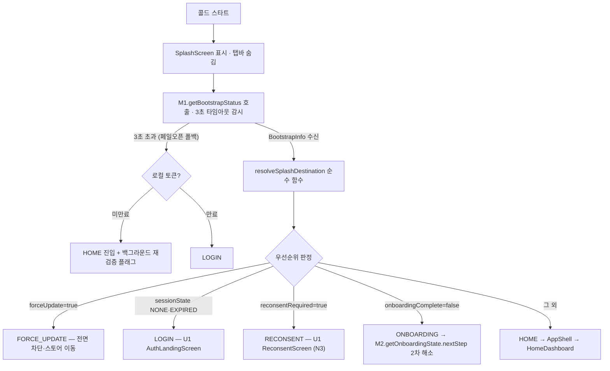

# 유닛 U2 상세 설계 — 앱 셸·홈·내비게이션

> 출처: aidlc-docs/construction/u2-appshell/functional-design/{domain-entities, business-rules, frontend-components}.md · aidlc-docs/construction/u2-appshell/nfr-requirements/{nfr-requirements, tech-stack-decisions}.md · aidlc-docs/construction/u2-appshell/nfr-design/nfr-design-patterns.md · aidlc-docs/construction/u2-appshell/infrastructure-design/infrastructure-design.md · aidlc-docs/construction/plans/u2-appshell-{functional-design, nfr-design}-plan.md · aidlc-docs/inception/application-design/unit-of-work.md(U2) · aidlc-docs에서 2026-07-05 추출 · 이후 본 문서가 정본이다.

이 문서는 유닛 U2(앱 셸·홈·내비게이션)의 상세 설계다. U2는 앱의 뼈대 — 스플래시 진입 분기, 하단 5탭 셸, 홈 대시보드 프레임, 탭바 노출 규칙, 장소 우선 진입 온램프 — 를 세워 이후 모든 유닛(U3~U8)의 화면이 꽂힐 자리를 만든다. 크로스커팅 문서는 [아키텍처](../architecture.md), [도메인 모델](../domain.md), [주요 흐름](../flows.md), [핵심 결정/ADR](../decisions.md), [NFR 기준](../nfr.md), [인프라](../infrastructure.md), [개발 순서](../units.md), [용어집](../glossary.md)를 참조한다. 선행/후행 관계는 [U5 상세](./u5-itinerary.md)·기타 유닛 문서를 함께 본다.

---

## 1. 개요

### 1.1 유닛 정의

| 항목 | 내용 |
|---|---|
| 유닛 | U2 — 앱 셸·홈·내비게이션 |
| 성격 | **클라이언트 중심 경량 유닛** + server/app 부트스트랩·홈 집약 API |
| 담당 에픽 | E2 (스토리 6개: US-E2-01 ~ US-E2-06) |
| 서버 모듈 | `app`(부트스트랩 API·remote config) — 서버 최소 |
| 클라이언트 features | `features/home` + 내비게이션 컨테이너(5탭 셸) + `shared/ui`(탭바·빈 상태 패턴·디자인 시스템 확장) |
| 예상 규모 | 스토리 6 · 신규 서버 영속 엔티티 약 1(`AppConfig`) · 외부 연동 0 · 스케줄러 잡 0 |

### 1.2 목적

앱의 뼈대를 세운다. 구체적으로 다섯 가지를 완성한다.

- **스플래시 진입 분기**: 세션 검증(3초 타임아웃·백그라운드 재검증, G5) × 약관 재동의 필요(N3) × 최소 지원 버전(N4) → 로그인/재동의/강제 업데이트/온보딩 잔여/홈 **5분기**.
- **강제 업데이트 게이트(N4)**: 서버 부트스트랩 API에 최소 버전 필드를 포함하고, 미달 시 전면 차단 + 스토어 이동.
- **하단 5탭 셸(홈·탐색·일정·기록·마이)**: 공용 컴포넌트, 탭 상태 세션 보존·재탭 스크롤 탑(G6), 알림·딥링크 탭 스택 푸시 규칙(G7), 몰입 화면 탭바 숨김 규칙.
- **홈 대시보드 프레임**: 여행 카드(D-day·진행률 G3)·빠른 액션·인기 장소·추억 카드의 **레이아웃과 빈 상태**. 데이터는 후행 유닛이 점진 공급(인기 장소=U3, 여행 카드=U4, 활성 일정 카드=U6, 추억=U7, 최종 통합 검증=U8).
- **장소 우선 진입(US-E2-05) 온램프 UI**: 탐색 랜딩 '장소' 카드·저장 목록 셸·'이 장소들로 여행 만들기' 진입. POI 검색·저장 백엔드(M7)는 U3에서 완성.

### 1.3 범위 경계 — 포함·제외

| 구분 | 내용 |
|---|---|
| **포함** | 스플래시 5분기, 강제 업데이트 게이트, 5탭 셸·탭 상태 보존·딥링크 라우팅·탭바 숨김, 홈 대시보드 레이아웃·빈 상태·슬롯 스키마, 장소 우선 온램프 셸(UI만) |
| **제외** | ① 각 탭 루트의 실제 콘텐츠(탐색 결과=U3, 일정=U5, 기록=U7, 마이=U8) — U2는 **루트·빈 상태·진입 규칙까지만**. ② '지금 뜨는·내 취향 여행 기록' 커뮤니티 카드 — U10 출시와 함께(그 전 미노출). ③ 오프라인 일정 조회 — 미보장 확정(D24/Δ6), 오류·재시도 안내만 |

### 1.4 선행·후행 관계

- **선행 유닛 — U1(파운데이션)**: U1이 부트스트랩 API의 **공급자측**(세션 검증·온보딩 완료 판정·재동의 필요 플래그 집약, BR-U1-44·FD-U1-10)을 소유한다. U2는 그 **소비자측 판정 정본**(스플래시 분기)이다. 인증·무상태·관측성·복원력의 서버 규약, 클라이언트 라이브러리(Expo·상태 관리·토큰 저장·HTTP·PBT), 전역 결정 GD-1~7·공유 인프라(SI)를 전부 U1에서 상속한다.
- **후행 유닛 — U3~U8**: U2는 각 탭 루트·홈 카드 슬롯의 **껍데기(루트·빈 상태·진입 규칙·슬롯 스키마)**를 완성하고, 실제 콘텐츠·데이터를 후행 유닛이 점진 공급한다. U3(장소 온램프 백엔드·인기 장소 집계), U4(예정 여행 카드), U6(활성 여행 카드·진행률·execution 허브), U7(추억 카드), U8(알림 배지·홈 최종 통합)이 각 자리를 채운다.
- **병행 가능성**: 서버 의존이 얕아 U1 완료 후 U3과 부분 병행 가능하다.

### 1.5 완료 기준(DoD) 요지

| 축 | 기준 |
|---|---|
| 기능 | E2 6개 스토리 수용 기준 충족. 스플래시 5분기 × 타임아웃(3초) 조합 시나리오 전수. 홈은 데이터 0건 상태에서 빈 대시보드 대신 **첫 행동 유도** 노출 |
| 하드 제약(D37) | ① 강제 업데이트 미달 버전의 서비스 진입 차단(로그인 포함) 테스트 100%. ② 비로그인 진입이 딥링크 수신 한정임을 검증(D22)하는 라우팅 가드 테스트 100% |
| PBT | 스플래시 분기 결정 함수(세션 상태 × 약관 버전 × 앱 버전 → 목적지)를 순수 함수로 분리해 속성 테스트(어떤 입력 조합에도 정확히 1개 목적지·우선순위 불변: 버전 게이트 > 재동의 > 세션). 탭 상태 보존·복원 왕복 속성 |
| 확장 규칙 | RESILIENCY-10(부트스트랩 호출 타임아웃·확인 불가 시 G5 정책), SECURITY-08(홈 집약 API 소유권 검증). 서버 로직이 얕아 다수 규칙 N/A — 근거 명기 |
| 계약 포인트 | U1 세션·재동의 API 소비자 측 계약 테스트. 홈 카드 슬롯별 공급 계약(후행 유닛이 채울 응답 필드)을 스키마로 고정 |

### 1.6 핵심 리스크와 완화

| 리스크 | 영향 | 완화 |
|---|---|---|
| 강제 업데이트 게이트 오구성 시 전 사용자 차단 | 서비스 전면 장애급 | 최소 버전은 remote config로 관리 + 변경 이력, 확인 불가 시 **페일오픈**(G5 타임아웃 정책 준용), 게이트 로직 결정 함수 PBT |
| 후행 유닛 데이터 부재로 홈이 '공사 중' 인상 | 첫인상 훼손 | 카드별 빈 상태·유도 문구를 U2에서 완성, **미구현 카드는 미노출 원칙** |
| 탭·딥링크 내비게이션 규칙이 후행 유닛에서 파편화 | UX 일관성 붕괴 | 내비게이션 규칙(G6·G7·탭바 숨김)을 `shared/ui` 단일 컴포넌트 + 린트 규칙으로 강제 |

> **선결 과제**: 직접 선결 없음. P9(스토어 계정)는 강제 업데이트 화면의 스토어 링크 확정에 필요하나 개발 차단 요소가 아니다(플레이스홀더 허용).

### 1.7 본 유닛 확정 설계 결정(FD-U2)

| # | 결정 | 요지 | 근거 |
|---|---|---|---|
| FD-U2-01 | 스플래시 분기 결정 함수 정본 | `resolveSplashDestination`을 순수 함수로 확정 — 목적지 5종 enum, 우선순위 강제 업데이트 > 재동의 > 세션/온보딩 고정. U1 공급자 계약(FD-U1-10)의 소비자측 정본 | US-E2-01·06, N3, N4, G5 |
| FD-U2-02 | 온보딩 하위 목적지 해소 | 분기 함수는 5목적지까지만 판정. ONBOARDING 진입 후 정확 재개 단계(약관 미동의 vs 닉네임 미통과)는 `M2.getOnboardingState.nextStep`로 2차 해소 — 함수 순수성 보존 | US-E2-01, U1 BR-U1-26 |
| FD-U2-03 | 타임아웃 페일오픈 폴백 | 부트스트랩 3초 초과 시 버전 게이트 페일오픈 + 로컬 토큰 폴백(미만료→HOME+백그라운드 재검증, 만료→LOGIN) | G5, US-E2-06 |
| FD-U2-04 | 탭 상태 보존 범위 | `TabNavigationState`는 세션 메모리 한정(앱 재시작 시 초기화), 탭별 독립 스택·스크롤 위치. 재탭 시 활성 탭만 스크롤 탑. 오프라인 일정 캐시 미제공(D24)과 정합 | G6, D24/Δ6 |
| FD-U2-05 | 홈 카드 슬롯 스키마·부분 응답 | `HomeDashboardModel`은 가용 슬롯만 담는 부분 응답 계약(침묵 실패 금지). 후행 유닛이 채울 슬롯의 필드·데이터 출처·빈 상태를 U2에서 스키마로 고정 | US-E2-02 |
| FD-U2-06 | 활성 여행 단수 전제 | D21로 진행 중 여행 최대 1개 — 홈 활성 카드·일정 탭이 M18 허브로 수렴, 복수 활성 전환 UI 없음 | D21/Δ3 |
| FD-U2-07 | 커뮤니티 카드 미노출 게이트 | 커뮤니티 여행 기록 카드는 U10 출시 전까지 슬롯 자체 미노출 | US-E2-02 |
| FD-U2-08 | U2 소유 서버 영속 엔티티 = AppConfig 1종 | 최소 지원 버전·스토어 링크 등 remote config성 설정 1종만 서버 영속 | unit-of-work U2 |
| FD-U2-09 | 진행률 표시 규칙 소비 | 홈 여행 카드 진행률은 G3 — 여행 중=방문 체크 완료 비율(`M18.getTripProgress`), 여행 전=D-day만. 계산 정본은 M18/U6, U2는 표시 규칙만 | G3, US-E2-02 |
| FD-U2-10 | 딥링크 라우팅 가드 | 비로그인 진입은 초대·공유 딥링크 수신에 한정(D22/Δ5), 진입 즉시 로그인 게이트. 인증 후 대상 탭 활성화 + 그 탭 스택에 푸시(G7) | D22/Δ5, G7 |

---

## 2. 도메인 엔티티

### 2.1 데이터 소유 지도

U2는 **거의 데이터를 소유하지 않는다** — 대부분 클라이언트 세션 상태이거나 타 모듈이 소유한 데이터의 읽기 전용 집계다. U2의 화면(스플래시·홈·5탭)은 상태를 **생성**하지 않고 조립·표시한다.

| 계층 | 엔티티 | 소유·성격 |
|---|---|---|
| 서버 영속 — U2 소유 | `AppConfig` | remote config성 앱 구성(최소 지원 버전·스토어 링크). **U2 유일 영속 엔티티**(FD-U2-08) |
| 읽기 전용 집계 DTO — U2가 계약 정의·소비 | `BootstrapInfo` | U1 M1이 집계·공급(세션·온보딩·재동의·최소 버전). U2 스플래시가 소비 |
| 읽기 전용 집계 BFF | `HomeDashboardModel` | 홈 집약 응답. 슬롯별 원천은 U1/U3/U4/U6/U7 |
| 참조(실제 소유 M7/U3) | `TrendingPlace` | 인기 장소 집계 결과. U2는 표시 계약만 소비 |
| 클라이언트 세션 상태 — 서버 영속 아님 | `TabNavigationState` | 탭별 스택·스크롤. 세션 메모리 한정, 앱 재시작 초기화(G6) |

> **U2 소유 서버 영속 엔티티 = `AppConfig` 1종**(FD-U2-08). 스플래시 판정 입력(`BootstrapInfo`)은 U1 계정·동의 데이터의 집계이고, 홈 카드 데이터는 후행 유닛이 각각 소유한다. 유일한 서버 영속 데이터는 클라이언트 배포와 독립적으로 조정해야 하는 앱 구성(강제 업데이트 최소 버전 등) 1종이다.

### 2.2 AppConfig — 앱 구성 (server/app, U2 유일 영속 엔티티)

강제 업데이트 게이트·스토어 이동의 서버 정본. 클라이언트 배포와 독립적으로 운영 조정 가능한 remote config성 설정이다. 오구성 시 전 사용자 차단 리스크가 있어 변경 이력을 남긴다(BR-U2-04) [N4/C6].

| 속성 | 타입 | 제약 | 의미·근거 |
|---|---|---|---|
| configKey | 문자열(설정 키) | 필수 · 유니크 | 설정 식별자. 플랫폼(iOS/Android)별 분리 관리 가능하도록 키에 플랫폼 차원 포함 |
| minSupportedVersion | 버전(SemVer) | 필수 | 강제 업데이트 최소 지원 버전 — 클라이언트 `appVersion < minSupportedVersion`이면 강제 업데이트 게이트(N4). 부트스트랩 응답 계약의 필드 [N4/C6, US-E2-06] |
| storeUrl | 문자열(URL) | 선택 | 강제 업데이트 화면의 스토어 이동 링크. NULL=플랫폼 기본 스토어 스킴 사용(P9 스토어 계정 확정 전 플레이스홀더 허용 — 개발 차단 아님) |
| updatedAt | 시각(UTC) | 필수 | 최종 변경 시각(변경 이력의 최신 포인터) |
| updatedBy | 문자열 | 필수 | 변경 주체(운영 감사 — 오구성 추적) |

**불변식**
- **INV-AC1 (버전 형식)**: minSupportedVersion은 유효한 SemVer이며 전순서 비교가 가능하다(BR-U2-04 버전 비교의 전제 — PBT 속성 U2-P3).
- **INV-AC2 (변경 이력 보존)**: minSupportedVersion 변경은 덮어쓰기가 아니라 이력을 남긴다 — 전면 차단 사고의 롤백·원인 추적 근거.

### 2.3 BootstrapInfo — 부트스트랩 집계 (읽기 전용 DTO, U1 M1 공급)

스플래시 분기 판정의 **단일 입력**. U1 `M1.getBootstrapStatus`가 세션·동의·버전을 집계해 반환하는 읽기 전용 응답이다. U2는 이 계약의 소비자이며, 판정 규칙(BR-U2-01·02)의 정본을 소유한다.

| 속성 | 타입 | 제약 | 의미·근거 |
|---|---|---|---|
| sessionState | 열거 {VALID, EXPIRED, NONE} | 필수 | 세션 토큰 유효성. VALID=유효 세션, EXPIRED=만료(재로그인 필요), NONE=세션 없음(미로그인) [G5, US-E2-01] |
| onboardingComplete | 불리언 | 필수 | 온보딩 완료(=약관 동의 + 닉네임 통과, 취향 무관 — U1 BR-U1-26). false면 잔여 온보딩 단계로 분기(정확 단계는 M2.getOnboardingState로 2차 해소, FD-U2-02) |
| reconsentRequired | 불리언 | 필수 | 중대 개정 재동의 필요(blocking) 여부. true면 재동의 게이트(N3). 경미 변경(nonBlocking)은 이 플래그에 미포함(인앱 공지 채널) [N3, US-E1-18, U1 BR-U1-23] |
| minSupportedVersion | 버전(SemVer) | 필수 | 서버 최소 지원 버전(AppConfig 미러) [N4/C6] |
| forceUpdate | 불리언 | 필수 | `= (clientAppVersion < minSupportedVersion)` 서버 판정 결과. true면 나머지와 무관하게 전면 차단(최우선) [N4, US-E2-06, U1 FD-U1-10] |

**불변식**
- **INV-BI1 (판정 총함수 입력)**: (sessionState × onboardingComplete × reconsentRequired × forceUpdate) 조합은 스플래시 결정 함수의 완전한 입력 도메인이며, 어떤 조합에도 목적지가 정확히 1개 정의된다(BR-U2-01·02, PBT 속성 U2-P1).
- **INV-BI2 (우선순위 종속)**: forceUpdate=true이면 다른 필드 값과 무관하게 판정은 FORCE_UPDATE — 필드 간 우선순위는 forceUpdate > reconsentRequired > sessionState/onboardingComplete로 고정(U1 FD-U1-10 소비자측).
- **INV-BI3 (멱등 재검증)**: BootstrapInfo 조회는 부작용 없는 멱등 조회 — 타임아웃 후 온라인 복구 시 동일 API 재호출로 상태 수렴(백그라운드 재검증).

### 2.4 TabNavigationState — 탭 내비게이션 상태 (클라이언트 세션 상태)

5탭 셸의 탭별 화면 스택·스크롤 위치. **세션 메모리 한정** — 앱 재시작 시 초기화된다(G6). 서버 영속 아님. 소유 계층은 클라이언트 `shared/ui`(내비게이션)·`shared/storage`(세션 메모리).

| 속성 | 타입 | 제약 | 의미·근거 |
|---|---|---|---|
| activeTab | 열거 {HOME, EXPLORE, ITINERARY, RECORD, MY} | 필수 · 기본 HOME | 현재 활성 탭. 5탭 고정 [US-E2-03] |
| tabStacks | 맵<탭, 화면 스택> | 필수 | 탭별 독립 내비게이션 스택(하위 화면 이력). 탭 전환 시 이전 탭 스택 보존 [G6] |
| scrollPositions | 맵<탭 또는 화면키, 스크롤 오프셋> | 필수 | 탭·화면별 스크롤 위치 보존값 [G6] |
| sessionEpoch | 식별자 | 필수 · 불변(세션 내) | 세션 생명주기 표식 — 앱 재시작으로 세션 교체 시 전체 상태 초기화의 경계(INV-TN2) |

**불변식**
- **INV-TN1 (탭 격리)**: 한 탭의 스택·스크롤 변경은 타 탭 상태에 영향을 주지 않는다(탭별 독립 보존) [G6, PBT 속성 U2-P2].
- **INV-TN2 (세션 수명)**: 앱 재시작(sessionEpoch 교체) 시 tabStacks·scrollPositions는 전부 초기화된다 — 세션 내에서만 보존, 영속 캐시 아님 [G6, D24와 정합].
- **INV-TN3 (재탭 리셋 국소성)**: 현재 활성 탭 재탭 시 해당 탭만 스크롤 탑으로 이동하며 스택은 루트로 복귀 — 타 탭 무영향 [G6, BR-U2-05].
- **INV-TN4 (딥링크 푸시 정합)**: 딥링크·알림 진입은 대상 탭을 activeTab으로 설정하고 그 탭 스택에 화면을 push한다 — 타 탭 스택은 보존 [G7, BR-U2-06].

### 2.5 HomeDashboardModel — 홈 대시보드 조립 모델 (읽기 전용 집계 BFF)

홈 대시보드의 **카드 슬롯 스키마**. 홈 집약(BFF성) 조회가 가용 슬롯만 담아 반환하는 **부분 응답 계약**이다(침묵 실패 금지). 각 슬롯의 데이터 출처는 후행 유닛이며, U2는 슬롯 스키마·부분 응답·빈 상태·미노출 규칙을 고정한다(FD-U2-05).

| 슬롯 | 데이터 출처(공급 유닛/메서드) | 페이로드 개요 | 빈/미노출 규칙 | 근거 |
|---|---|---|---|---|
| activeTripCard | U6 `M18.getActiveHub` + `M18.getTripProgress` | 진행 중 여행(D-day·진행률·현재/다음 슬롯 요약)→execution 허브 진입 | 진행 중 여행 없음이면 슬롯 미노출(활성 여행 최대 1개, D21) | US-E2-02, D21, G3 |
| upcomingTripCard | U4 `M6.listTrips` | 예정 여행(목적지·기간·D-day·등록 숙소 수·일정 유무) | 예정 여행 0건이면 emptyState로 대체(첫 행동 유도) | US-E2-02, G3 |
| quickAction | U2(자체) | '여행 만들기' 단일 빠른 액션 + (첫 사용자) 'AI로 먼저 일정 받아보기'·'장소 먼저 저장'(US-E2-05) | 항상 노출(홈의 상시 온램프) | US-E2-02, US-E2-05 |
| trendingPlaces | U3 `M7.getTrendingPlaces` | '지금 인기 있는 장소'(최근 7일 저장+방문 가중합 일 1회 배치) | 집계 부재·조회 실패 시 슬롯 생략(부분 응답), 다른 카드 정상 | US-E2-02, G2/G174 |
| memoryCard | U7 `M12.getVisitStats` | '여행 추억 다시 보기'(과거 기록 진입) | 기록 0건이면 미노출 | US-E2-02 |
| preferencePromptCard | U1 `M2.getPendingPreferencePrompts` | 건너뛴 취향 점진 설정 카드(한두 개씩) | 미설정 취향 없으면 미노출 | US-E2-02, G157, U1 BR-U1-28 |
| communityRecordCard | (U10 — 후속) | '지금 뜨는·내 취향 여행 기록'(커뮤니티) | **U10 출시 전까지 슬롯 자체 미노출**(FD-U2-07) | US-E2-02 |
| topBar | U1 세션 + U8 `M14.getInbox` | 워드마크 + 알림 진입점(읽지 않은 알림 배지 카운트) | 미읽음 0이면 배지 없이 진입점만 | US-E2-02 |

**불변식**
- **INV-HD1 (부분 응답 완전성)**: HomeDashboardModel은 항상 렌더 가능한 상태를 반환한다 — 일부 슬롯 조회가 실패해도 가용 슬롯만 담아 반환하고, 실패 슬롯은 로딩/재시도 또는 생략으로 표면화한다(침묵 실패 금지) [RESILIENCY-10, PBT 속성 U2-P4].
- **INV-HD2 (조립 멱등성)**: 동일 슬롯 데이터 집합에 대해 조립 결과(카드 목록·정렬·노출/미노출 판정)는 동일하다 — 조립은 순수 변환.
- **INV-HD3 (활성 여행 단수)**: activeTripCard는 최대 1개 여행만 참조한다(D21로 진행 중 여행 구조적 단수) — 복수 활성 전환 슬롯 없음 [D21/Δ3, FD-U2-06].
- **INV-HD4 (미노출 게이트)**: communityRecordCard 슬롯은 U10 출시 게이트 이전에는 스키마에 예약만 되고 페이로드가 존재하지 않는다(미노출) [FD-U2-07].
- **INV-HD5 (진행률 표시 종속)**: activeTripCard의 진행률은 여행 중일 때만 방문 체크 비율로 표기하고, 여행 전(예정)에는 진행률 없이 D-day만 표기한다 — 계산 정본은 M18(U6), U2는 표시 규칙 [G3, FD-U2-09].

### 2.6 TrendingPlace — 인기 장소 (참조, 실제 소유 M7/U3)

홈 `trendingPlaces` 슬롯이 참조하는 인기 장소 집계 결과. **U2는 소유하지 않는다** — 실제 데이터 소유·집계 배치는 M7 Place Data(U3, `M7.getTrendingPlaces`)이며, U2는 표시용 최소 필드 계약만 소비한다. 정본은 U3 Functional Design.

| 속성 | 타입 | 제약 | 의미·근거 |
|---|---|---|---|
| poiRef | 식별자(canonical POI ID 참조) | 필수 | 인기 장소의 정본 POI 참조(canonical ID — 정본 소유 M7) [G133] |
| displayName | 문자열 | 필수 | 표시 이름(스냅샷) |
| category | 문자열 | 선택 | 카테고리 라벨. NULL=미확인('미확인' 표기 규칙 준용) |
| region | 문자열 | 선택 | 지역 라벨 |
| rank | 정수 | 필수 | 집계 순위(최근 7일 저장+방문 가중합, 일 1회 배치 결과 — 집계 로직 정본 U3) [G2] |

**불변식**
- **INV-TP1 (참조 무결성 위임)**: TrendingPlace의 실제 정본·집계 무결성은 U3(M7)가 소유한다 — U2는 표시 계약만 고정하고, 소실 POI는 '확인 불가' 배지 규칙(G8)에 위임한다.

### 2.7 데이터-스토리 추적 요약

| 데이터 | 소유/참조 | 주 근거 스토리 | 주 결정 |
|---|---|---|---|
| AppConfig | U2 서버 영속(유일) | US-E2-06 | N4/C6 |
| BootstrapInfo | U1 공급·U2 소비(DTO) | US-E2-01, US-E2-06 | G5, N3, N4, D22, U1 FD-U1-10 |
| TabNavigationState | 클라이언트 세션 상태 | US-E2-03 | G6, G7, D24/Δ6 |
| HomeDashboardModel | 읽기 전용 집계 BFF | US-E2-02 | D21, G2, G3, G157 |
| TrendingPlace | 참조(소유 M7/U3) | US-E2-02 | G2/G174, G8 |

---

## 3. 비즈니스 규칙 (BR-U2-01 ~ 14)

규칙 ID `BR-U2-xx`는 본 유닛 전역 유일하며 코드·테스트·리뷰에서 이 ID로 추적한다. 판정 정본은 항상 서버·계약(D28 원칙 준용)이며, 클라이언트 결정 함수는 그 계약의 소비자 사본이다.

### 규칙 색인

| 그룹 | 규칙 |
|---|---|
| A. 스플래시 분기 | BR-U2-01 ~ 03 |
| B. 강제 업데이트 | BR-U2-04 |
| C. 탭 내비게이션 | BR-U2-05 ~ 08 |
| D. 홈 대시보드 조립 | BR-U2-09 ~ 13 |
| E. 오프라인·실패 | BR-U2-14 |

### A. 스플래시 분기

**BR-U2-01 — 스플래시 5분기 판정 (순수 결정 함수)**
- **조건**: 콜드 스타트 시 스플래시에서 `M1.getBootstrapStatus`(BootstrapInfo) 응답을 받은 직후.
- **동작**: `resolveSplashDestination(BootstrapInfo) → Destination` 순수 함수로 목적지 5종 중 정확히 1개를 결정한다. 판정 규칙(우선순위 순):
  1. `forceUpdate=true` → **FORCE_UPDATE**(강제 업데이트 게이트, 나머지 무관)
  2. `sessionState ∈ {NONE, EXPIRED}` → **LOGIN**(세션 없음/만료 → 로그인)
  3. `reconsentRequired=true` → **RECONSENT**(중대 개정 재동의 화면, N3)
  4. `onboardingComplete=false` → **ONBOARDING**(약관 미동의 또는 닉네임 미통과 — 정확 재개 단계는 `M2.getOnboardingState.nextStep`로 2차 해소, FD-U2-02)
  5. 그 외(세션 유효·재동의 불필요·온보딩 완료) → **HOME**

  스플래시에는 하단 탭바를 노출하지 않는다.
- **위반 시 처리**: 한 입력 조합이 0개 또는 2개 이상 목적지로 매핑되면 결함(완전성·상호배타 위반) — PBT 속성 U2-P1로 방지. 우선순위 역전(만료 버전인데 HOME 등)은 하드 제약 라우팅 가드 테스트(D37 소관)로 차단.
- **근거**: US-E2-01, US-E2-06, N3, N4, G5, D22/Δ5, U1 BR-U1-44/FD-U1-10.

**BR-U2-02 — 판정 우선순위: 강제 업데이트 > 재동의 > 세션/온보딩**
- **조건**: BR-U2-01 판정 함수 내 규칙 적용 순서 결정 시.
- **동작**: 우선순위를 **강제 업데이트(N4) > 재동의(N3) > 세션/온보딩(G5)**로 고정한다(INV-BI2). `forceUpdate=true`는 세션·동의·온보딩 상태와 무관하게 항상 FORCE_UPDATE로 귀결하며, 재동의 blocking은 온보딩 잔여 단계보다 우선한다. U1 공급자측(FD-U1-10)과 동일 우선순위 — 공급/소비 명세 공유.
- **위반 시 처리**: 우선순위가 뒤바뀌면(예: 재동의 필요인데 홈 진입, 만료 버전인데 로그인 진입) 하드 결함 — PBT 속성 U2-P1(우선순위 불변) + 계약 테스트.
- **근거**: N3, N4/C6, G5, U1 FD-U1-10.

**BR-U2-03 — 세션 검증 타임아웃 3초·로컬 토큰 폴백 (페일오픈)**
- **조건**: 부트스트랩 네트워크 호출이 3초 내 응답하지 않을 때(스플래시 검증 지연).
- **동작**: ① 검증 지연 중에는 스플래시에 진행 표시를 유지한다(침묵 실패 금지). ② 3초 초과 시 **버전 게이트를 페일오픈**(확인 불가로 강제 차단하지 않음)하고 로컬 토큰으로 폴백한다 — 로컬 토큰 미만료면 **HOME 진입 + 백그라운드 재검증** 플래그, 만료면 **LOGIN**. ③ 온라인 복구 시 동일 멱등 API로 재검증해 상태를 수렴시킨다(INV-BI3). 재검증 결과 forceUpdate/재동의가 확인되면 그 시점에 해당 게이트로 전이.
- **위반 시 처리**: 확인 불가 상황에서 전면 차단(강제 업데이트 오구성 시 전 사용자 차단급 장애)은 리스크 — 페일오픈으로 완화. 백그라운드 재검증 누락(구 상태 고착)은 결함.
- **근거**: G5, US-E2-01, US-E2-06, RESILIENCY-10, FD-U2-03.

### B. 강제 업데이트

**BR-U2-04 — 강제 업데이트 게이트: 최소 버전 미달 전면 차단**
- **조건**: 부트스트랩 판정에서 `clientAppVersion < minSupportedVersion`(서버 `forceUpdate=true`) 또는 클라이언트 로컬 SemVer 비교 결과 미달.
- **동작**: 강제 업데이트 화면으로 분기하고 **서비스 진입(홈·로그인 포함)을 전면 차단**한다. 스토어 이동 액션(AppConfig.storeUrl 또는 플랫폼 기본 스토어)만 제공한다. 버전 비교는 SemVer 전순서 비교로 하며(INV-AC1), 최소 버전은 remote config(AppConfig)로 관리하고 변경 이력을 남긴다(INV-AC2).
- **위반 시 처리**: 미달 버전이 로그인·홈에 진입하면 **하드 제약 위반**(D37 — 100% 테스트). 버전 비교 비단조(높은 버전이 더 차단되는 역전)는 결함 — PBT 속성 U2-P3.
- **근거**: US-E2-06, N4/C6.

### C. 탭 내비게이션

**BR-U2-05 — 탭 상태 세션 보존·재탭 스크롤 탑**
- **조건**: 5탭(홈·탐색·일정·기록·마이) 전환 및 현재 탭 재탭 시.
- **동작**: ① 탭 전환 시 각 탭의 이전 화면 상태(하위 스택·스크롤 위치)를 **세션 내 메모리에 보존**하고 복귀 시 복원한다(INV-TN1). ② 앱 재시작 시에는 초기화한다(세션 메모리 한정 — INV-TN2). ③ 현재 활성 탭을 재탭하면 해당 탭만 스크롤 탑으로 이동하고 스택을 루트로 복귀시킨다(타 탭 무영향 — INV-TN3). 바텀 탭바는 단일 공용 컴포넌트로 전 탭 루트에서 동일 형태로 노출하고 선택 탭을 시각 구분한다.
- **위반 시 처리**: 탭 전환 시 상태 유실(항상 초기화)·재탭이 타 탭 상태를 건드림·앱 재시작 후 잔존은 결함 — PBT 속성 U2-P2(보존/복원 라운드트립).
- **근거**: US-E2-03, G6.

**BR-U2-06 — 딥링크·알림 진입 내비게이션**
- **조건**: 알림 탭·딥링크·공유 링크로 특정 화면에 진입할 때.
- **동작**: 대상 화면이 속한 탭을 활성화(activeTab 설정)하고 그 탭 스택에 화면을 push한다(INV-TN4). 타 탭 스택은 보존한다. 대상 화면이 몰입 화면군이면 탭바 숨김 규칙(BR-U2-08)을 함께 적용한다.
- **위반 시 처리**: 딥링크가 탭 컨텍스트 없이 화면을 띄우거나(뒤로가기 시 탈출 불가) 엉뚱한 탭에 push하면 결함.
- **근거**: US-E2-03, G7.

**BR-U2-07 — 비로그인 진입 가드: 딥링크 수신 한정**
- **조건**: 세션이 없는 상태에서 앱에 진입할 때.
- **동작**: 앱은 로그인 필수이며 비로그인 진입은 **초대·공유 딥링크 수신 시나리오에 한정**한다. 그 경우에도 진입 즉시 로그인 게이트를 두고(딥링크 목적지는 인증 후 이어서 라우팅), 그 외 일반 진입은 스플래시가 LOGIN으로 분기한다(BR-U2-01).
- **위반 시 처리**: 비로그인으로 딥링크 외 화면(홈·탐색 등)에 도달하면 **하드 제약 위반**(D37 — 라우팅 가드 테스트 100%).
- **근거**: US-E2-01, D22/Δ5, FD-U2-10.

**BR-U2-08 — 몰입 화면 탭바 숨김**
- **조건**: 화면 렌더 시 탭바 노출 판정.
- **동작**: 탭 루트 화면과 그 직계 콘텐츠 화면(탐색 랜딩·숙소 상세·장소 검색/저장·공유 일정 둘러보기·기록 회고 등)에서는 탭바를 노출한다. **스플래시·강제 업데이트·온보딩 전체·입력 폼(숙소 검색/등록·여행 생성·필수 방문지)·일정 생성/편집·여행 중 실행·Plan-B·바텀시트/다이얼로그**에서는 탭바를 숨기고 전체 폭 단일 CTA 또는 자체 하단 액션을 사용한다. 탭바 숨김 화면에서도 시스템 뒤로가기·화면 내 닫기로 직전 탭 컨텍스트로 복귀할 수 있다. 숨김/노출 규칙은 `shared/ui` 단일 컴포넌트 + 린트 규칙으로 강제한다.
- **위반 시 처리**: 몰입 화면에 탭바가 남거나 탭 루트에서 탭바가 사라지면 결함(UX 일관성 붕괴). 린트 규칙 미준수는 리뷰 차단.
- **근거**: US-E2-04, 내비게이션 규칙 파편화 리스크.

### D. 홈 대시보드 조립

**BR-U2-09 — 홈 카드 조립·부분 응답**
- **조건**: 홈 대시보드 진입·새로고침 시 홈 집약(BFF성) 조회.
- **동작**: HomeDashboardModel 슬롯 스키마(§2.5)에 따라 가용 슬롯만 담아 조립한다 — 외부/후행 유닛 데이터 로딩 중에는 로딩 상태를 표시하고, 일부 슬롯 실패 시에도 나머지 가용 카드를 우선 표시한다(침묵 실패 금지, INV-HD1). 상단에 워드마크와 알림 진입점(읽지 않은 알림 배지)을 노출한다. 조립은 동일 슬롯 데이터에 대해 멱등(INV-HD2).
- **위반 시 처리**: 한 슬롯 실패로 홈 전체가 공백/오류가 되면 결함(부분 실패 격리 실패). 동일 데이터에 조립 결과가 달라지면 멱등성 위반 — PBT 속성 U2-P4.
- **근거**: US-E2-02, RESILIENCY-10, FD-U2-05.

**BR-U2-10 — 진행 중 여행 카드: 최대 1개·활성 허브 수렴**
- **조건**: 홈 조립 시 진행 중(ACTIVE) 여행 유무 판정.
- **동작**: 진행 중 여행이 있으면 홈 상단에 그날의 활성 일정으로 진입하는 카드를 D-day·진행률과 함께 강조 노출하고, execution 허브(`M18.getActiveHub`)로 수렴시킨다. 날짜 겹침 차단(D21)으로 진행 중 여행은 **항상 최대 1개**이며 복수 활성 여행 전환 UI는 두지 않는다(INV-HD3). 진행 중 여행이 없으면 activeTripCard 슬롯을 미노출한다.
- **위반 시 처리**: 복수 활성 카드 노출·전환 UI 도입은 D21 정책 위반. 활성 카드와 일정 탭 허브가 불일치(수렴 실패)하면 결함.
- **근거**: US-E2-02, US-E2-03, D21/Δ3, FD-U2-06.

**BR-U2-11 — 여행 카드 진행률 계산 표시 규칙**
- **조건**: 여행 카드(활성·예정) 렌더 시.
- **동작**: **여행 중**에는 방문 체크 완료 비율로 진행률을 표시하고(계산 정본 `M18.getTripProgress` — U6), **여행 전(예정)**에는 진행률을 표시하지 않고 D-day만 표시한다(INV-HD5). U2는 이 표시 규칙만 소유하며 비율 계산 로직은 M18/U6 소관이다.
- **위반 시 처리**: 여행 전 카드에 진행률(0% 등)을 표시하거나, 여행 중 카드에 D-day만 표시하고 진행률을 누락하면 결함.
- **근거**: US-E2-02, G3, FD-U2-09.

**BR-U2-12 — 인기 장소 노출: 배치 집계 소비·커뮤니티 카드 미노출**
- **조건**: 홈 trendingPlaces 슬롯 조립 시.
- **동작**: '지금 인기 있는 장소'는 최근 7일 저장+방문 가중합을 일 1회 배치 집계한 결과(`M7.getTrendingPlaces` — 소유 U3)를 노출한다. 집계 부재·조회 실패 시 슬롯을 생략(부분 응답, 다른 카드 정상). **'지금 뜨는·내 취향 여행 기록'(커뮤니티) 카드는 U10 출시 전까지 미노출**한다(INV-HD4).
- **위반 시 처리**: 커뮤니티 카드를 1차에 노출하거나, 인기 장소 실패가 홈 전체를 막으면 결함.
- **근거**: US-E2-02, G2/G174, FD-U2-07.

**BR-U2-13 — 빈 상태: 첫 행동 유도**
- **조건**: 홈·탭 루트 데이터가 0건일 때.
- **동작**: 빈 대시보드/빈 탭 대신 각 섹션 정본의 빈 상태 안내를 노출한다. 홈 첫 사용자(여행·숙소 없음)에게는 '여행 만들기'와 함께 '예약 없이 AI로 먼저 일정 받아보기'·'가고 싶은 곳 먼저 저장'(US-E2-05) 진입을 강조한다. 취향·기록 부족 시 추천 영역을 비우지 않고 설정 유도·바로가기와 점진 취향 카드(미설정 한두 개)를 노출한다. 저장 POI 0곳·일정 0건 등 각 탭 루트의 빈 상태는 해당 섹션 정본의 안내를 따른다.
- **위반 시 처리**: 데이터 0건에서 공백 화면('공사 중' 인상)을 노출하면 결함(첫인상 훼손).
- **근거**: US-E2-02, US-E2-03, US-E2-05, G157.

### E. 오프라인·실패

**BR-U2-14 — 오프라인 일정 조회 미보장**
- **조건**: 일정 탭·활성 일정 화면 진입이 오프라인/네트워크 실패 상태일 때.
- **동작**: 여행 중 일정 조회는 **온라인 전제**로 하며 오프라인 조회를 보장하지 않는다. 실패 시 침묵하지 않고 오류·재시도 안내를 표시한다(오프라인 일정 캐시 미제공 — INV-TN2와 정합). 기록 '입력'의 오프라인 로컬 저장(방문 체크·사진·메모)은 U7 소관이며 조회와 구분한다.
- **위반 시 처리**: 오프라인 일정 캐시를 임의 제공하거나, 실패를 침묵 처리하면 결함(D24 위반·침묵 실패 금지).
- **근거**: US-E2-03, D24/Δ6.

---

## 4. 비즈니스 로직 / 주요 흐름 (Process Flows)

표기: 단계 `Sx`, 분기 `Bx`, 예외 `Ex`. 규칙은 BR-U2-xx, 데이터 불변식은 INV-xx 참조. 시스템 전역 흐름은 [주요 흐름](../flows.md) 참조.

### 4.1 FLOW-1 — 스플래시 부트스트랩 분기

**진입**: 콜드 스타트 → SplashScreen · **관련**: US-E2-01, US-E2-06 · BR-U2-01~03 · G5, N3, N4, D22



**단계 서술**
- **S1**: 스플래시 표시(탭바 숨김) + `M1.getBootstrapStatus(accessToken, appVersion)` 호출, 3초 타임아웃 감시.
  - **E1** 3초 초과(타임아웃) → 페일오픈 폴백(BR-U2-03): 로컬 토큰 미만료 → HOME 진입 + 백그라운드 재검증 플래그(온라인 복구 시 재수렴), 로컬 토큰 만료 → LOGIN.
- **S2**: BootstrapInfo 수신 → `resolveSplashDestination`(순수 함수, BR-U2-01).
- **S3**: 우선순위 판정(BR-U2-02) — B1 forceUpdate → FORCE_UPDATE / B2 sessionState∈{NONE,EXPIRED} → LOGIN / B3 reconsentRequired → RECONSENT(N3) / B4 onboardingComplete=false → ONBOARDING → **S4** `M2.getOnboardingState.nextStep`로 정확 재개 단계(약관/닉네임) 2차 해소(FD-U2-02) / B5 그 외 → HOME.

**사후 조건**: 어떤 BootstrapInfo 조합에도 목적지가 정확히 1개(완전성·상호배타) + 우선순위 불변(PBT 속성 U2-P1). 확인 불가(타임아웃) 시 페일오픈으로 전면 차단 회피(리스크 완화). 온보딩·인증·재동의 화면 자체는 U1(`features/onboarding`) 소유 — U2는 스플래시에서 그 진입점으로 **분기**만 한다.

### 4.2 FLOW-2 — 탭 전환·상태 보존·재탭

**진입**: AppShell 내 탭 조작 · **관련**: US-E2-03 · BR-U2-05 · G6

- **S1**: 탭 A에서 하위 화면 탐색·스크롤 → `tabStacks[A]`·`scrollPositions[A]` 갱신(세션 메모리).
- **S2**: 탭 B로 전환 → activeTab=B, 탭 A 상태 보존(INV-TN1).
- **S3**: 다시 탭 A로 전환 → `tabStacks[A]`·`scrollPositions[A]` 복원(라운드트립 동일 — PBT 속성 U2-P2).
  - **B1** 현재 활성 탭 재탭 → 해당 탭만 스크롤 탑 + 스택 루트 복귀(INV-TN3), 타 탭 무영향.
  - **B2** 앱 재시작(sessionEpoch 교체) → 전체 초기화(INV-TN2).

### 4.3 FLOW-3 — 딥링크·알림 진입

**진입**: 알림 탭·딥링크·공유 링크 · **관련**: US-E2-03 · BR-U2-06·07 · G7, D22/Δ5

- **S1**: 딥링크 수신 → 세션 상태 확인.
  - **B1** 세션 없음 → 로그인 게이트(딥링크 목적지 보관 → 인증 후 이어서 라우팅, BR-U2-07).
  - **B2** 세션 유효 → S2.
- **S2**: `DeepLinkRouter`가 대상 화면이 속한 탭 활성화(activeTab 설정) + 그 탭 스택에 push(INV-TN4, G7).
  - **B3** 대상이 몰입 화면군 → 탭바 숨김 규칙 적용(BR-U2-08).
- **S3**: 타 탭 스택 보존(무영향) — 뒤로가기·닫기로 직전 탭 컨텍스트 복귀.

### 4.4 스플래시 분기 결정 함수의 성격

`resolveSplashDestination`은 부수효과(내비게이션 실행)를 갖지 않고 **목적지 enum만 산출**하는 순수 함수로 분리한다. 이유는 세 가지다. ① 어떤 입력 조합에도 정확히 1개 목적지를 산출해야 하므로 PBT(속성 기반 테스트) 대상으로 삼기 좋다. ② U1 공급자측 판정(FD-U1-10)과 명세를 공유하는 소비자 사본이므로 동치성을 계약 테스트로 검증할 수 있다. ③ 온보딩 하위 목적지(약관 vs 닉네임)까지 함수 안에서 판정하면 순수성이 깨지므로, 함수는 5목적지까지만 판정하고 재개 단계는 `M2.getOnboardingState.nextStep` 2차 조회로 해소한다(FD-U2-02).

---

## 5. 프론트엔드 컴포넌트

클라이언트 feature는 `features/home` + 내비게이션 컨테이너(5탭 셸) + `shared/ui`(탭바·디자인 시스템 확장)이다. 상태 관리·내비게이션 구현체·스타일 시스템·스토어 SDK 선정은 §6 NFR/Tech Stack 소유이며, 본 절은 컴포넌트 책임·props/state 개요·상호작용·`data-testid` 규칙·서버 능력 매핑을 규정한다.

> **`data-testid` 규칙**: `appshell-{screen}-{role}` (예: `appshell-splash-progress`, `appshell-tabbar-home`). 스크린리더/자동화 테스트 앵커로 사용.

### 5.1 컴포넌트 계층

```text
features/home + 내비게이션 컨테이너(shared/ui)
├─ SplashScreen                       — 부트스트랩 호출·5분기 판정(탭바 숨김)
│  └─ SplashProgressIndicator         — 검증 진행 표시(3초 타임아웃·침묵 실패 금지)
├─ ForceUpdateScreen                  — 최소 버전 미달 전면 차단·스토어 이동(탭바 숨김)
├─ AppShell                           — 5탭 바텀 내비 컨테이너(탭 상태·딥링크 라우팅 소유)
│  ├─ TabBar                          — 단일 공용 바텀 탭바(5탭·숨김 규칙·선택 시각 구분)
│  ├─ HomeTabRoot → HomeDashboard     — 홈 대시보드(카드 슬롯 렌더·부분 로딩·빈 상태)
│  │  ├─ HomeTopBar                   — 워드마크 + 알림 진입점(읽지 않은 배지)
│  │  ├─ ActiveTripCard               — 진행 중 여행(D-day·진행률)→execution 허브(U6)
│  │  ├─ UpcomingTripCard             — 예정 여행(D-day·등록 숙소 수·일정 유무, U4)
│  │  ├─ QuickActionCard              — '여행 만들기' + 첫 사용자 온램프 2종
│  │  ├─ TrendingPlacesCard           — '지금 인기 있는 장소'(U3 M7·부분 응답)
│  │  ├─ MemoryCard                   — '여행 추억 다시 보기'(U7)
│  │  ├─ PreferencePromptCard         — 건너뛴 취향 점진 설정(U1 M2)
│  │  └─ HomeEmptyState               — 첫 사용자 빈 상태(첫 행동 유도)
│  ├─ ExploreTabRoot                  — 탐색 랜딩('무엇을 찾을까요?' 3카드) — 콘텐츠 U3
│  │  └─ PlaceSaveOnramp              — 장소 검색·저장 온램프 셸(US-E2-05, 백엔드 U3)
│  ├─ ItineraryTabRoot                — 일정 탭 루트·빈 상태 — 콘텐츠 U5/U6
│  ├─ RecordTabRoot                   — 기록 탭 루트·빈 상태 — 콘텐츠 U7
│  └─ MyTabRoot                       — 마이 탭 루트·빈 상태 — 콘텐츠 U8
└─ shared/ui (U2 확장분)
   ├─ TabBar(공용)·TabBarVisibilityRule — 탭바 숨김 규칙 단일 소스 + 린트 규칙
   ├─ EmptyState / LoadingSkeleton / ErrorRetry — 표준 패턴(ADR-0011)
   └─ DeepLinkRouter                  — 딥링크·알림 → 대상 탭 활성화 + 스택 push(G7)
```

> **후행 유닛이 채우는 자리**: ExploreTabRoot·ItineraryTabRoot·RecordTabRoot·MyTabRoot와 홈의 데이터 슬롯(ActiveTripCard·UpcomingTripCard·TrendingPlacesCard·MemoryCard)은 U2가 **루트·빈 상태·진입 규칙·슬롯 스키마**까지 완성하고, 실제 콘텐츠·데이터는 후행 유닛(U3~U8)이 점진 공급한다(FD-U2-05).

**전역 규칙**
- 스플래시·강제 업데이트·온보딩 전체는 **탭바 숨김** 화면군(BR-U2-08).
- 스플래시 판정은 순수 함수 `resolveSplashDestination`으로 분리 — 어떤 입력 조합에도 정확히 1개 목적지, 우선순위 불변(BR-U2-01·02, PBT 속성 U2-P1).
- 모든 서버 오류는 표준 오류 타입으로 정규화되어 침묵 실패 없이 표면화(`shared/api`) [ADR-0011 클라이언트측].
- 온보딩·인증·재동의 화면 자체는 U1(`features/onboarding`) 소유 — U2는 스플래시에서 그 진입점으로 분기만 한다.

### 5.2 화면별 상세

**SplashScreen (스플래시 분기)**
- **props**: 없음(앱 진입 루트) · **state**: 부트스트랩 조회 상태(대기/응답/타임아웃), 로컬 토큰 상태(미만료/만료), 백그라운드 재검증 플래그.
- **상호작용**: 콜드 스타트 시 `M1.getBootstrapStatus(accessToken, appVersion)` 호출 → 응답을 `resolveSplashDestination`(순수 함수)에 통과시켜 5목적지로 라우팅(BR-U2-01). ONBOARDING 목적지는 `M2.getOnboardingState.nextStep`로 정확 재개 단계 2차 해소(FD-U2-02). 3초 타임아웃 시 로컬 토큰 폴백(BR-U2-03). 검증 지연 중 `SplashProgressIndicator` 유지(침묵 실패 금지).
- **판정 정본**: 서버 계약(BootstrapInfo) — 클라이언트 결정 함수는 그 계약의 소비자 사본(U1 FD-U1-10과 명세 공유, PBT U2-P1로 동치 검증).
- **data-testid**: `appshell-splash-root`, `appshell-splash-progress`.
- **사용 서버 능력**: `M1.getBootstrapStatus`, `M1.getRequiredConsents`(재동의 상세), `M2.getOnboardingState`(잔여 단계).

**ForceUpdateScreen (강제 업데이트 게이트)**
- **props**: `minSupportedVersion`, `storeUrl?` · **state**: 없음(전면 차단 정적 화면).
- **상호작용**: 최소 버전 미달 시 진입 — 서비스 진입(홈·로그인 포함)을 전면 차단하고 스토어 이동 액션만 제공(BR-U2-04). storeUrl 부재 시 플랫폼 기본 스토어 스킴. 뒤로가기·우회 진입 불가(하드 제약 라우팅 가드).
- **data-testid**: `appshell-forceupdate-root`, `appshell-forceupdate-store`.
- **사용 서버 능력**: `M1.getBootstrapStatus`(minSupportedVersion·forceUpdate — 판정 입력, 화면 자체 호출 없음).

**AppShell (내비게이션 컨테이너)**
- **props**: `initialTab`(딥링크 진입 시 대상 탭) · **state**: `TabNavigationState`(§2.4 — activeTab·tabStacks·scrollPositions·sessionEpoch).
- **상호작용**: 탭별 독립 스택 유지·세션 보존(BR-U2-05, INV-TN1). 딥링크·알림 진입은 `DeepLinkRouter`가 대상 탭 활성화 + 그 탭 스택 push(BR-U2-06, G7). 비로그인 딥링크 진입은 로그인 게이트 경유(BR-U2-07, D22). 앱 재시작 시 sessionEpoch 교체로 전체 초기화(INV-TN2).
- **data-testid**: `appshell-shell-root`.
- **사용 서버 능력**: 없음(탭 라우팅·상태 보존은 클라이언트 전용).

**TabBar (단일 공용 컴포넌트)**
- **props**: `activeTab`, `unreadBadge?`(마이/알림 관련) · **state**: 없음(제어 컴포넌트).
- **상호작용**: 5탭 고정(홈·탐색·일정·기록·마이) 동일 형태 노출·선택 탭 시각 구분(US-E2-03). 현재 탭 재탭 시 해당 탭만 스크롤 탑+스택 루트 복귀(BR-U2-05, INV-TN3). 탭바 숨김 규칙(BR-U2-08)은 `TabBarVisibilityRule` 단일 소스 + 린트 규칙으로 강제 — 몰입 화면군에서 숨김.
- **data-testid**: `appshell-tabbar-{home|explore|itinerary|record|my}`.
- **각 탭 루트 진입 규칙**: 홈=HomeDashboard / 탐색=탐색 랜딩(3카드) / 일정=진행 중 여행 있으면 execution 허브(`M18.getActiveHub`), 없으면 최근 여행 일정, 일정 없으면 등록·생성 유도 / 기록=여행 기록·요약 / 마이=마이페이지. 각 탭 데이터 0건은 해당 섹션 정본 빈 상태(BR-U2-13).

**HomeDashboard (홈 대시보드)**
- **props**: 없음(홈 탭 루트) · **state**: 슬롯별 로딩/성공/실패 상태(부분 응답 — INV-HD1).
- **상호작용**: 홈 집약 조회로 HomeDashboardModel 슬롯(§2.5) 조립·렌더(BR-U2-09). 슬롯별 로딩 스켈레톤·부분 실패 격리(가용 카드 우선, 침묵 실패 금지). ActiveTripCard 탭 → execution 허브(U6). QuickActionCard '여행 만들기' → 여행 생성(U4). 첫 사용자 빈 상태(HomeEmptyState)는 첫 행동 유도(BR-U2-13). 진행률 표시 규칙(BR-U2-11): 여행 중=방문 체크 비율, 여행 전=D-day만.
- **data-testid**: `appshell-home-root`, `appshell-home-activetrip`, `appshell-home-trending`, `appshell-home-empty`.
- **슬롯별 사용 서버 능력**(US-E2-02 매핑): ActiveTripCard=`M18.getActiveHub`·`M18.getTripProgress`(U6) / UpcomingTripCard=`M6.listTrips`(U4) / TrendingPlacesCard=`M7.getTrendingPlaces`(U3) / MemoryCard=`M12.getVisitStats`(U7) / PreferencePromptCard=`M2.getPendingPreferencePrompts`(U1) / HomeTopBar 배지=`M14.getInbox`(미읽음, U8) / communityRecordCard=미노출(U10 전까지).

### 5.3 각 탭 루트 자리 (후행 유닛이 채움)

| 탭 루트 | U2 완성 범위 | 후행 유닛 콘텐츠 | data-testid |
|---|---|---|---|
| ExploreTabRoot | 탐색 랜딩 3카드(숙소/장소/여행자 일정 진입) + 장소 저장 온램프 셸(US-E2-05) | 숙소 탐색·장소 검색 백엔드(M7) = U3 | `appshell-explore-root` |
| ItineraryTabRoot | 루트·진입 규칙·빈 상태(일정 없음 → 등록·생성 유도) | 일정 콘텐츠 = U5, 활성 허브 = U6 | `appshell-itinerary-root` |
| RecordTabRoot | 루트·빈 상태(기록 0건) | 기록·회고 = U7 | `appshell-record-root` |
| MyTabRoot | 루트·빈 상태 | 마이페이지·설정 = U8 | `appshell-my-root` |

> 탐색 랜딩의 '여행자 일정(커뮤니티 둘러보기)' 카드는 진입점만 두되 커뮤니티 콘텐츠는 U10 — 전용 커뮤니티 탭은 두지 않는다(US-E2-03).

### 5.4 테스트 가능 속성 (Testable Properties, PBT-U2)

클라이언트 프레임워크는 fast-check(시드 로깅·수축 필수, PBT-08). 아래 속성은 U2 Code Generation의 DoD 항목이다.

| ID | 카테고리 | 속성 서술 | 제너레이터 요구 |
|---|---|---|---|
| U2-P1 | 총함수·논리 게이트(결정표) | **스플래시 분기 결정**: 임의의 BootstrapInfo(sessionState 3값 × onboardingComplete × reconsentRequired × forceUpdate) 전 조합에 대해 `resolveSplashDestination`은 (a) 정확히 1개 목적지 반환(총함수·완전성), (b) 목적지 집합 {FORCE_UPDATE, LOGIN, RECONSENT, ONBOARDING, HOME}이 입력 도메인을 상호배타 분할, (c) 우선순위 불변: forceUpdate=true ⇒ 항상 FORCE_UPDATE, reconsent가 온보딩/세션-완료보다 우선, (d) 동일 입력→동일 출력(결정성), (e) 서버 공급자 판정(U1 FD-U1-10)과 동치 | BootstrapInfo 조합 생성기(열거 3 × 불리언 3축 전수 24조합 exhaustive + SemVer 쌍) |
| U2-P2 | 라운드트립·상태 보존 | **탭 상태 보존/복원**: 임의의 탭 조작 시퀀스(전환·push/pop·스크롤·재탭)에 대해 (a) 탭 A 이탈 후 복귀 시 tabStacks[A]·scrollPositions[A] 라운드트립 동일(INV-TN1), (b) 재탭은 활성 탭만 스크롤 탑+스택 루트 복귀, 타 탭 불변(INV-TN3), (c) sessionEpoch 교체는 전체 초기화(INV-TN2), (d) 딥링크 push는 대상 탭에만 반영(INV-TN4) | 탭 조작 명령 시퀀스 생성기(5탭 × {switch, push, pop, scroll, retap, restart, deeplink}, 길이 0~50) |
| U2-P3 | 단조성·전순서 | **강제 업데이트 버전 비교**: 임의의 (clientVersion, minSupportedVersion) SemVer 쌍에 대해 (a) forceUpdate = (clientVersion < minSupportedVersion)이 SemVer 전순서와 일치, (b) 버전 비교 단조성(clientVersion 상승 시 forceUpdate가 false→true로 되지 않음, minSupportedVersion 상승 시 차단 완화되지 않음), (c) 동일 버전은 미달 아님(경계 포함) | SemVer 생성기(major/minor/patch 경계·프리릴리스 태그·동일 버전 포함) |
| U2-P4 | 멱등성·부분 응답 완전성 | **홈 카드 조립**: 임의의 슬롯 데이터 집합(각 슬롯 {성공·데이터 / 성공·0건 / 실패 / 로딩})에 대해 (a) 항상 렌더 가능(INV-HD1), (b) 동일 입력 재조립 시 동일 결과(멱등, INV-HD2), (c) activeTripCard 최대 1개(INV-HD3), (d) communityRecordCard 항상 미노출(INV-HD4), (e) 여행 전 카드 진행률 미표시·여행 중 카드 진행률 표시(INV-HD5) | 슬롯 상태 조합 생성기(8슬롯 × 4상태 + 여행 상태 {없음/예정/진행중} + 진행률 값) |
| U2-P5 | 게이트 불변식 | **비로그인 진입 가드**: 임의의 (진입 유형 {일반, 초대·공유 딥링크} × 세션 상태)에 대해 (a) 비로그인 + 딥링크 아닌 진입은 반드시 로그인 화면으로 귀결(홈·탐색 직접 도달 0, BR-U2-07, D22), (b) 비로그인 + 딥링크 진입은 로그인 게이트 경유 후 목적지 이어서 라우팅, (c) 인증 완료 후에만 대상 탭 스택 push | 진입 유형 × 세션 상태 × 딥링크 목적지 조합 생성기 |

**속성 합계: 5개** (스플래시 분기 2 · 탭 내비 1 · 홈 조립 1 · 딥링크 가드 1).

**속성 없는 컴포넌트 (No PBT properties identified)**

| 컴포넌트 | 사유 |
|---|---|
| 서버 홈 집약 조회(BFF성, server/app) | 후행 유닛 퍼사드(M6·M7·M12·M18·M14·M2)를 병렬 집계·부분 응답 조립하는 오케스트레이션 — 도메인 불변식은 클라이언트 조립(U2-P4)이 소유. 서버측 부분 실패 격리·소유권 검증(SECURITY-08)은 예시 기반 통합 테스트, 슬롯 스키마는 계약 테스트 |
| AppConfig 조회(remote config 미러) | 단일 설정 값 조회 어댑터 — 자체 도메인 로직 없음. 버전 비교 속성은 U2-P3에서 커버, 조회·캐시는 계약 테스트 |
| ForceUpdateScreen·각 탭 루트 자리 | 전면 차단 정적 화면·후행 유닛이 채우는 빈 껍데기 — 분기 판정은 U2-P1·U2-P3에 귀속, 렌더는 예시 기반 컴포넌트 테스트 |

**DoD 커버리지 대조**

| U2 DoD 명시 속성 | 대응 |
|---|---|
| 스플래시 분기 결정 함수(세션 × 약관 버전 × 앱 버전 → 목적지, 정확히 1개·우선순위 불변) | U2-P1 (+ 버전 비교 U2-P3) |
| 탭 상태 보존·복원 왕복 | U2-P2 |
| (하드 제약) 강제 업데이트 미달 버전 차단 | U2-P3 + 라우팅 가드 계약 테스트 |
| (하드 제약) 비로그인 진입 딥링크 한정 | U2-P5 |
| (설계 보강) 홈 카드 부분 응답·조립 멱등 | U2-P4 |

### 5.5 화면-스토리-서버 능력 추적 매트릭스

| 컴포넌트 | 스토리 | 서버 능력 |
|---|---|---|
| SplashScreen | US-E2-01 | M1.getBootstrapStatus · M1.getRequiredConsents · M2.getOnboardingState |
| ForceUpdateScreen | US-E2-06 | M1.getBootstrapStatus(minSupportedVersion·forceUpdate) |
| AppShell / TabBar | US-E2-03, US-E2-04 | (클라이언트 전용 — 탭 상태·딥링크 라우팅) |
| HomeDashboard | US-E2-02 | M6.listTrips · M18.getActiveHub/getTripProgress · M7.getTrendingPlaces · M12.getVisitStats · M14.getInbox · M2.getPendingPreferencePrompts |
| ExploreTabRoot / PlaceSaveOnramp | US-E2-05 | (셸만 — M7.searchPoi/savePoi/listSavedPois 백엔드는 U3) |
| ItineraryTabRoot | US-E2-03 | M18.getActiveHub · M8.getItinerary · M6.listTrips (진입 규칙, 콘텐츠 U5/U6) |

---

## 6. NFR (비기능 요구·기술 스택·설계 패턴)

### 6.1 U2 NFR 프로필 — "클라이언트 셸"의 NFR 본질

U2에는 신규 인프라·신규 서버 워크로드가 사실상 없다. U2 NFR의 본질은 **클라이언트 진입 경험의 품질**이다. 시스템 전역 NFR 정본은 [NFR 기준](../nfr.md)이며, 본 절은 그 정본을 U2 관점으로 전개하되 인프라·플랫폼 결정은 전역 정본을 상속(재정의 금지)하고 유닛 증분만 확정한다.

| # | NFR 축 | U2 관점 본질 | 근거 |
|---|---|---|---|
| 1 | 첫 인상 지연 | 스플래시 진입 분기가 얼마나 빨리·확실하게 목적지로 도달하는가 | US-E2-01, G5 |
| 2 | 내비게이션 연속성 | 5탭 셸의 상태 보존·전환 지연 | US-E2-03, G6·D38 |
| 3 | 부분 실패 내성 | 홈 대시보드가 후행 유닛 데이터 부재·부분 장애에도 '공사 중' 인상 없이 동작 | US-E2-02, 침묵 실패 금지 |
| 4 | 게이트 안전성 | 강제 업데이트 게이트 오구성이 전 사용자 차단으로 번지지 않는가 | US-E2-06, N4 |

> 서버측은 **부트스트랩 API 1종 + 홈 대시보드 집약 조회 1종**(server/app 소유, BFF성)뿐이며, 인증·무상태·관측성·복원력의 서버 규약은 U1 전역 정본을 그대로 상속한다.

### 6.2 성능 (D38)

전역 성능 목표는 **일반 화면 전환 300ms**와 **스플래시 세션 검증 3초(G5)** 둘이다. G5의 3초는 서버 성능 목표가 아니라 **클라이언트의 최종 대기 한계(fail-policy 경계)**다.

| ID | 요구 | 내용 |
|---|---|---|
| NFR-U2-PERF-01 | 부트스트랩 집계 계약 | 부트스트랩 응답은 세 필드를 한 번에 반환 — `minSupportedVersion`(항상), `sessionState`(토큰 제시 시), `reconsentRequired`(토큰 제시 시). 서버 처리 목표는 U1 정본(p50 100ms·p95 500ms) 상속, 재산정 없음. 무상태 검증 + 단일 질의로 p95 500ms 내 완결 |
| NFR-U2-PERF-02 | 3초 클라이언트 예산 배분 | 스플래시 시작 → 부트스트랩 왕복(TLS+RTT+서버 p95 ≈ 통상 1초 미만) → 분기 결정 함수(µs 수준) → 목적지 전환. 3초 경과 시 미도착이면 G5 폴백 발동 — 3초는 콜드 스타트·네트워크 열화·부분 장애에서만 도달하는 예외 경로 |
| NFR-U2-PERF-03 | 분기 우선순위 결정성 | 분기 결정은 **버전 게이트 > 재동의 > 세션 > 온보딩 잔여 > 홈** 고정 우선순위의 순수 함수(US-E2-06 하드 제약·PBT 대상). 어떤 입력에도 정확히 1개 목적지, 실행 비용 무시 가능(네트워크가 지배) |
| NFR-U2-PERF-04 | 탭 전환 지연 | 하단 5탭 간 전환은 300ms 화면 전환 예산(D38) 내 완료. 탭 루트는 로컬 상태이므로 전환 자체는 네트워크 비의존 — 예산 초과 요인은 탭 최초 진입 시 데이터 로딩뿐이며 스켈레톤·부분 표시로 전환 체감과 분리 |
| NFR-U2-PERF-05 | 탭 상태 메모리 보존 | 각 탭의 이전 화면 상태(스크롤·하위 스택)는 세션 내 메모리 보존(앱 재시작 시 초기화, G6), 현재 탭 재탭 시 스크롤 탑. 보존은 각 탭 내비 스택 인스턴스를 언마운트하지 않고 유지 — 왕복 재조회로 복원하지 않음 |
| NFR-U2-PERF-06 | 병렬 로딩 | 홈 대시보드의 독립 카드(여행=U4·인기 장소=U3·추억=U7, 활성 일정=U6, 최종 통합=U8)는 상호 독립 병렬 로딩. 한 카드의 지연·실패가 다른 카드 표시를 차단하지 않음 |
| NFR-U2-PERF-07 | 부분 실패 허용(침묵 실패 금지) | 홈 집약 조회는 가용 카드만 담은 부분 응답 허용. 실패 카드는 빈칸이 아니라 재시도 가능한 오류 상태 또는 유도 문구(스켈레톤 → 성공/오류/빈 상태). 후행 유닛 미구현 카드는 **미노출 원칙**('공사 중' 인상 차단) |

### 6.3 가용성·복원력 (RESILIENCY-10)

부트스트랩 API의 세션 검증 부분은 **M1 Auth(Critical)에 의존**한다 — 세션 상태 판정이 곧 Auth 판정이다. 부트스트랩 경로의 가용성 바닥은 U1이 결정하며, U2는 **클라이언트측 폴백 절반**을 소유한다.

| ID | 요구 | 내용 |
|---|---|---|
| NFR-U2-AV-01 | 오프라인/열화 스플래시 폴백(G5 정본) | 부트스트랩 3초 타임아웃 또는 네트워크 불가 시 — **로컬 토큰 미만료** → 홈 진입 + 백그라운드 재검증(온라인 복구 시, 재검증에서 세션 무효 401+사유 코드면 로그인 유도). **로컬 토큰 만료** → 로그인. **최소 지원 버전 확인 불가** → **페일오픈**(확인 불가만으로 강제 업데이트 차단하지 않음 — 오구성·확인 실패가 전 사용자 차단으로 번지는 것 방지) |
| NFR-U2-AV-02 | 침묵 실패 금지 | 검증 지연 중 스플래시는 진행 표시 유지, 폴백 발동·백그라운드 재검증 실패는 계측 이벤트로 보고(3초 타임아웃 발동률 메트릭, U1 PAT-OBS-03 클라이언트 행 상속) |
| NFR-U2-AV-03 | 홈 집약 조회 복원력 | 홈 조회는 RESILIENCY-10 상속 — 타임아웃·부분 응답·재시도 안내. U2 시점에는 카드 슬롯이 대부분 빈 상태라 실질 부하 낮음. 외부 의존 0이라 서킷 브레이커 대상 신규 없음 |
| NFR-U2-AV-04 | 오프라인 미보장 명시(D24/Δ6) | 여행 중 일정 조회를 포함한 U2 내비게이션은 온라인 전제이며 오프라인 조회를 보장하지 않음. 오프라인 시 빈 화면·침묵 실패가 아니라 오류·재시도 안내 표시 |

### 6.4 클라이언트 NFR (G6·D24)

| ID | 요구 | 내용 |
|---|---|---|
| NFR-U2-CL-01 | 보존 범위·수명 | 탭 상태 보존은 세션(앱 프로세스 생존) 범위 — 앱 재시작 시 초기화(G6). 보존 대상은 각 탭 내비 스택·스크롤 위치. 메모리 보존이므로 영속 저장소(SecureStore·AsyncStorage) 미사용 — 재시작 초기화가 요구 동작 그 자체(과보존 금지) |
| NFR-U2-CL-02 | 캐시 = 최적화, 가용성 아님 | U2의 서버 상태 캐시(홈 카드·부트스트랩 결과)는 지연 최적화일 뿐 오프라인 가용성 요소가 아님(D24 미보장과 정합). 캐시 미스·만료는 온라인 재조회로 충족, 오프라인에서 캐시로 '조회 보장'을 흉내 내지 않음. 부트스트랩 결과는 스플래시 세션 한정(재기동 시 재조회), 홈 카드는 짧은 stale 허용 + 포그라운드 복귀 시 재검증 |
| NFR-U2-CL-03 | 딥링크 라우팅 무결성 | 알림·딥링크 진입은 대상 탭 활성화 + 그 탭 스택 푸시(G7). 비로그인 딥링크 진입은 초대·공유 딥링크 수신에 한정(D22) — 그 외 딥링크는 인증 게이트 통과 후 대상 화면 도달(라우팅 가드). 클라이언트 계약이며 서버 소유권 검증과 이중 |

### 6.5 보안 (Security Baseline 상속)

U2는 SECURITY 규칙의 신규 1차 구현 지점이 아니다 — 전역 보안 설정(deny-by-default·헤더·에러 핸들러·구조화 로깅·PII 마스킹)은 U1 스캐폴드가 소유하고 U2는 상속한다. U2 증분은 부트스트랩·홈 두 엔드포인트의 규약 적용뿐이다.

| ID | 요구 | 내용 |
|---|---|---|
| NFR-U2-SEC-01 | 부트스트랩·홈도 deny-by-default 상속 | 홈 대시보드 집약 조회는 인증 필수 + 토큰 주체(accountId) 소유권 스코핑(SECURITY-08) — 타 사용자 여행·일정 데이터 미혼입. 부트스트랩의 세션·재동의 부분도 토큰 검증 후에만 응답 |
| NFR-U2-SEC-02 | 최소 버전 체크 = 비인증 허용 경계 | 부트스트랩 응답 중 `minSupportedVersion` 필드만 비인증 공개 — 로그아웃·만료·구버전 사용자도 강제 업데이트 게이트를 받아야 하므로 토큰 없이 접근 가능. 동일 엔드포인트가 (a) 비인증 부분(최소 버전)과 (b) 인증 부분(세션·재동의)을 함께 반환하되 (b)는 유효 토큰 제시 시에만 채워지고 무토큰/무효 토큰에는 미노출 — 세션 정보 누출 없음 |
| NFR-U2-SEC-03 | 딥링크 진입 검증 | 딥링크로 진입한 화면도 대상 리소스 접근 시 서버 소유권 검증(SECURITY-08 — IDOR 원천 차단). 비로그인 딥링크 진입 한정(초대·공유, D22)은 클라이언트 라우팅 가드 + 서버 검증의 이중 방어 — 클라이언트 가드만으로 접근 통제를 신뢰하지 않음 |
| NFR-U2-SEC-04 | 강제 업데이트 게이트 하드 제약 | 최소 버전 미달 앱은 로그인 포함 전 서비스 진입 차단(US-E2-06 DoD 하드 제약). 클라이언트 게이트가 1차, 미달 버전이 부트스트랩 외 API 호출 시 서버측 거부는 표준 401/앱 버전 헤더 관측으로 충분(과설계 금지 — DAU 1천·게이트 목적은 UX 안내이지 침입 차단 아님) |

### 6.6 테스트·품질 (D37 + PBT)

| ID | 요구 | 내용 |
|---|---|---|
| NFR-U2-QA-01 | 스플래시 분기 PBT(1급 대상) | 스플래시 분기 결정 함수를 순수 함수로 분리해 fast-check 속성 테스트: (a) 어떤 입력에도 정확히 1개 목적지, (b) 우선순위 불변(버전 게이트 > 재동의 > 세션 > 온보딩 잔여 > 홈), (c) 타임아웃 폴백 결정성(로컬 토큰 만료 여부 → 홈/로그인). 시드 로깅·수축 필수(PBT-08) |
| NFR-U2-QA-02 | 탭 상태 보존 왕복 PBT | 임의 탭 방문 순서·스크롤 위치에 대해 재탭 시 스크롤 탑·타 탭 상태 불변(G6) |
| NFR-U2-QA-03 | 하드 제약 테스트 | 강제 업데이트 미달 버전의 서비스 진입 차단(로그인 포함), 비로그인 진입이 딥링크 수신 한정임을 검증하는 라우팅 가드 테스트 100%(US-E2-03·06 DoD) |
| NFR-U2-QA-04 | 계약 포인트 | U1 세션·재동의 API 소비자 측 계약 테스트 + 홈 카드 슬롯별 공급 계약(후행 유닛이 채울 응답 필드)을 스키마로 고정 |

### 6.7 규모 (G142 — U2 신규 산정 없음)

- **NFR-U2-SC-01**: 부트스트랩 호출량은 U1이 이미 산정 — "앱 실행마다 1회 × DAU 1천 × 일 5회 = 5,000건/일 ≈ 피크 0.28 RPS". U2는 이 API의 클라이언트 소비자로 서버 산정을 재수행하지 않음. 홈 집약 조회는 부트스트랩과 유사 빈도(앱 진입당 1회)로 기존 태스크가 흡수.
- **NFR-U2-SC-02**: U2 신규 컴퓨트·DB·오토스케일 결정 없음 — 부트스트랩·홈 조회는 U1 app 모놀리스에 흡수, 유일한 신규 저장은 앱 구성(최소 지원 버전) 1건 내외.

### 6.8 기술 스택 결정 (Tech Stack Decisions)

전제: 스택 대분류(RN Expo + Spring Boot Kotlin + PostgreSQL, D02)와 클라이언트 라이브러리 정본(U1 C-1~C-8)은 기확정이다. U2는 그중 **내비게이션 셸 계층**만 구체화하며 나머지는 U1 결정을 상속한다. 서버 스택은 U1 app 모듈을 재사용하고 신규 없음.

| # | 영역 | 결정 | 상속/증분 | 근거 |
|---|---|---|---|---|
| U2-C1 | 내비게이션 라이브러리 | **Expo Router**(파일 기반) — 탭 셸·딥링크 라우팅 | U1 확정 상속 + U2 구체화 | G6·G7, US-E2-03 |
| U2-C2 | 탭 셸 구조 | Expo Router 탭 레이아웃 그룹 + **탭별 독립 스택**(상태 보존) | 증분 | G6, US-E2-03 |
| U2-C3 | 딥링크·URL 스킴 | Expo Router linking config(앱 스킴 `trippilot://` + universal/app links) | 증분 | G7, US-E2-06(스토어 링크) |
| U2-C4 | 상태 관리(세션·탭) | **Zustand**(전역 세션·앱 버전·탭 UI 상태) + **TanStack Query v5**(부트스트랩·홈 서버 상태) | U1 C-4 상속 | D38 |
| U2-C5 | 스플래시 | **expo-splash-screen**(부트스트랩 게이트까지 유지·수동 hide) | 증분 | G5, US-E2-01 |
| U2-C6 | 앱 버전 취득 | **expo-constants**(`nativeAppVersion`/`expoConfig.version`) — 강제 업데이트 비교 입력 | 증분 | N4, US-E2-06 |
| U2-C7 | HTTP(부트스트랩·홈) | axios 인스턴스 + 토큰 회전 인터셉터 | U1 C-6 상속 | D36 |
| U2-C8 | 클라이언트 PBT | fast-check 3.x + Jest(jest-expo) — 스플래시 분기·탭 보존 속성 | U1 C-7 상속 | PBT-09, US-E2-01 |
| U2-S1 | 부트스트랩·홈 서버 | **U1 `server/app` 모듈 재사용 — 신규 서버 스택 0** | 상속 | unit-of-work U2 |

**내비게이션 — Expo Router vs React Navigation**: U1 tech-stack이 이미 Expo Router(파일 기반)를 확정했다. U2는 이를 재검토가 아니라 U2 요구(탭 상태 보존 G6·딥링크 G7) 충족 여부 확인 후 채택한다.

| 기준(U2 요구) | Expo Router(권고) | React Navigation(순정) |
|---|---|---|
| U1 확정 정합 | 이미 확정 — 재결정 불요 | U1 결정 뒤집기 필요(비용) |
| 탭 스택 상태 보존(G6) | 탭 레이아웃 + 탭별 스택에서 화면 언마운트 없이 상태 유지 | 동일 기능(Expo Router가 이를 래핑) |
| 딥링크 라우팅(G7) | 파일 경로=URL 규약으로 딥링크→탭 활성화+스택 푸시가 linking config로 선언적 | 수동 linking 매핑 테이블 유지(경로 증가 시 드리프트) |
| 몰입 화면 탭바 숨김(US-E2-04) | 레이아웃 그룹(`(tabs)` 밖 스택)으로 파일 구조 강제 | screenOptions로 화면별 수동 제어 |
| 후행 유닛 화면 편입 | 파일 추가 = 라우트 추가 — U3~U8 화면이 규약으로 꽂힘 | 라우터 등록 코드 수정 필요 |

- **권고: Expo Router.** U2의 3대 내비 요구(G6 상태 보존·G7 딥링크·US-E2-04 탭바 숨김)를 파일 구조 규약으로 선언적 강제해 후행 유닛의 내비게이션 파편화를 구조적으로 차단한다. React Navigation은 Expo Router가 래핑하므로 저수준 API가 필요하면 언제든 접근 가능 — 순정 단독 채택은 U1 확정을 뒤집을 뿐 이득이 없다.
- **탭 셸 구조(U2-C2)**: `app/(tabs)/_layout.tsx`에 5탭 `Tabs`, 각 탭은 자체 `Stack`. 탭 전환 시 비활성 탭 스택을 언마운트하지 않고 유지(G6 세션 내 메모리 보존), 재탭 시 스크롤 탑 훅. 몰입 화면은 `(tabs)` 밖 별도 스택 그룹에 배치해 탭바가 구조적으로 숨겨지게 한다.
- **딥링크(U2-C3)**: Expo Router `linking`(app scheme + Universal Links/App Links). 비로그인 딥링크 진입은 초대·공유에 한정(D22), 인증 가드 라우트를 레이아웃 레벨에서 적용. 강제 업데이트 화면의 스토어 이동은 아웃바운드 링크(`Linking.openURL`)로 스토어 URL 오픈(신규 외부 연동 아님).
- **상태 관리(U2-C4)**: 서버 상태(부트스트랩 결과·홈 카드)는 TanStack Query v5(병렬 쿼리·부분 실패 격리·stale-while-revalidate), 클라이언트 상태(전역 세션 플래그·앱 버전·탭 UI·온보딩 진행)는 Zustand. 홈 카드는 카드별 독립 쿼리로 두어 한 쿼리 실패가 타 카드를 막지 않게 한다.
- **스플래시·버전 체크(U2-C5·C6)**: expo-splash-screen `preventAutoHideAsync()`로 네이티브 스플래시를 유지하다 부트스트랩 왕복+분기 결정 완료 후 `hideAsync()`(3초 타임아웃 발동 시에도 폴백 목적지 전환 후 hide — 무한 스플래시 금지). 버전 비교·게이트 판정은 클라이언트 순수 함수(PBT 대상). **expo-updates(OTA)는 JS 번들 업데이트로 네이티브 강제 업데이트(N4)를 대체하지 않는다** — N4는 스토어 네이티브 빌드 교체가 필요한 경우의 게이트이며 OTA 정책 자체는 Operations 소관. U2는 서버 `minSupportedVersion` 기반 스토어 이동 게이트만 소유한다.
- **서버측(U2-S1)**: 부트스트랩 API(세션 유효성·최소 버전·재동의를 1왕복 집계)·홈 대시보드 집약 조회(가용 카드만 부분 응답) 모두 U1 `server/app` 모듈 재사용, 신규 서버 프레임워크·모듈 없음. DB는 앱 구성 테이블 1개 내외로 U1 Flyway 파이프라인 재사용.

### 6.9 NFR 설계 패턴 (PAT-U2-01 ~ 06)

U2는 경량 유닛이므로 신규 패턴은 6종이며, 보안·복원력·관측성의 전역 패턴은 U1·shared 정본을 상속한다(재정의 금지). 패턴 형식: 문제 → 적용(설계) → U2 적용 지점 → 검증 기준.

| ID | 패턴 | 분류 | 핵심 근거 |
|---|---|---|---|
| PAT-U2-01 | 스플래시 부트스트랩 단일 왕복 집계 | 성능(서버 절반 U1 상속) | G5, NFR-U2-PERF-01 |
| PAT-U2-02 | 클라이언트 오프라인 우선 세션 폴백 | 복원력 | G5, NFR-U2-AV-01 |
| PAT-U2-03 | 탭별 독립 내비 스택 + 상태 보존 | 성능·UX | G6, NFR-U2-PERF-05 |
| PAT-U2-04 | 홈 카드 병렬 로딩·부분 실패 격리 | 복원력 | RESILIENCY-10, NFR-U2-PERF-07 |
| PAT-U2-05 | 강제 업데이트 게이트 | 안전성 | N4, NFR-U2-SEC-04 |
| PAT-U2-06 | 딥링크 라우팅(탭 활성화+스택 푸시) | UX·보안 | G7, NFR-U2-SEC-03 |

**PAT-U2-01 스플래시 부트스트랩 단일 왕복 집계**
- **문제**: 스플래시는 목적지 결정 전 3가지 상태(세션 유효성·최소 지원 버전·재동의 필요)를 알아야 한다. 순차 3왕복이면 3초 클라이언트 예산(G5)을 왕복 수만큼 잠식하고, 부분 실패 시 분기 상태가 파편화된다.
- **적용**: ① **1왕복 집계 계약** — `server/app` 부트스트랩 엔드포인트가 세 필드를 한 응답으로 반환(minSupportedVersion 항상, sessionState/reconsentRequired는 토큰 제시 시). ② **분기 결정은 순수 함수** — 응답(또는 폴백 신호) → 목적지를 고정 우선순위(버전 게이트 > 재동의 > 세션 무효 > 온보딩 잔여 > 홈)로 계산, 부수효과 없이 목적지만 산출해 PBT 가능. ③ **게이트 유지·해제** — expo-splash-screen을 부트스트랩 완료 또는 3초 타임아웃까지 유지, 결정 후 목적지 전환과 함께 hide.
- **U2 적용 지점**: 스플래시 컨트롤러, 분기 결정 함수(`shared/` 순수 모듈), 부트스트랩 쿼리(TanStack Query). 서버 계약은 `server/app`.
- **검증 기준**: 부트스트랩 응답이 3필드 집계임을 계약 테스트로 확인(NFR-U2-QA-04), 분기 함수가 어떤 입력에도 정확히 1개 목적지·우선순위 불변(PBT NFR-U2-QA-01).

**PAT-U2-02 클라이언트 오프라인 우선 세션 폴백**
- **문제**: 부트스트랩이 3초 안에 오지 않을 때 무한 대기·침묵 실패면 "켜지지 않는 앱"이 되고, 무조건 로그인으로 보내면 정상 세션 사용자를 매번 재로그인시킨다.
- **적용**: G5를 설계 정본으로 승격 — 로컬 토큰 상태 기준 폴백.

| 3초 타임아웃/오프라인 시 상태 | 폴백 동작 | 고지·계측 |
|---|---|---|
| 로컬 토큰 미만료 | 홈 진입 + 백그라운드 재검증(온라인 복구 시 부트스트랩 재시도) | 진행 표시 유지, 재검증 실패(401+사유) 시 로그인 유도 |
| 로컬 토큰 만료 | 로그인 분기 | — |
| 최소 버전 확인 불가 | 페일오픈(강제 업데이트 미발동) | 확인 실패 계측 — 오구성이 전 사용자 차단으로 번지지 않게 |

- **설계 원칙**: 게이트(강제 업데이트)는 **확인된 미달일 때만** 닫힌다 — 확인 불가는 페일오픈(가용성 우선). 이는 보안 게이트 fail-closed와 반대 방향인데, 근거는 강제 업데이트가 보안 게이트가 아니라 **UX 안내 게이트**이기 때문(NFR-U2-SEC-04). 방향을 항목별로 명시해 애매함을 남기지 않는다.
- **검증 기준**: 3초 타임아웃 주입 시 토큰 미만료→홈·만료→로그인·버전확인불가→페일오픈 3분기 테스트, 폴백·재검증 실패 계측 이벤트 발행 확인, 침묵 실패 없음 통합 테스트.

**PAT-U2-03 탭별 독립 내비 스택 + 상태 보존**
- **문제**: 탭 전환마다 화면을 재마운트·재조회하면 전환 지연(300ms 초과)과 불필요 트래픽이 발생하고 컨텍스트가 유실된다(G6 위반). 규칙을 화면마다 코드로 관리하면 후행 유닛에서 파편화된다.
- **적용**: Expo Router 레이아웃 규약으로 상태 보존을 구조로 강제 — 탭별 독립 스택(비활성 탭 언마운트 없이 유지), 보존 수명=세션(재시작 시 초기화, 영속 저장 미사용), 몰입 화면 탭바 숨김(`(tabs)` 밖 스택 그룹). 탭바는 `shared/ui` 단일 공용 컴포넌트 + 린트 규칙으로 일관성 강제.
- **검증 기준**: 탭 전환 300ms 내·상태 보존/복원 왕복 PBT(NFR-U2-QA-02), 탭바 숨김 규칙 스냅샷 테스트.

**PAT-U2-04 홈 카드 병렬 로딩·부분 실패 격리**
- **문제**: 홈 대시보드는 여러 후행 유닛(U3·U4·U6·U7·U8) 공급 카드의 집합이다. 한 카드의 지연·실패가 전체를 막거나 실패를 빈칸으로 방치하면 "공사 중"·"고장 난 앱" 인상을 준다.
- **적용**: 카드별 독립 병렬 쿼리(TanStack Query) + 서버 홈 집약 조회의 가용 카드만 담은 부분 응답(BFF성). 각 카드는 스켈레톤(로딩) → 성공/오류(재시도 가능)/빈 상태(유도 문구). 후행 유닛 미구현 카드는 미노출. 여행·숙소 0건이면 빈 대시보드 대신 첫 행동 유도(여행 만들기·예약 없이 일정·장소 저장 온램프).
- **검증 기준**: 한 카드 실패 주입 시 타 카드 정상 표시·실패 카드 오류 상태(빈칸 아님), 데이터 0건 시 첫 행동 유도 노출, 홈 슬롯 스키마 공급 계약 고정(NFR-U2-QA-04).

**PAT-U2-05 강제 업데이트 게이트**
- **문제**: 지원 종료 구버전 앱은 깨진 화면·오류를 낳는다(N4). 그러나 게이트를 무조건 닫는 방향이면 오구성 1건이 전 사용자 차단(서비스 전면 장애급)으로 번진다.
- **적용**: ① **비교 순수 함수** — 현재 앱 버전(expo-constants) vs 서버 minSupportedVersion semver 비교(PBT 대상), 미달이면 강제 업데이트 화면 분기 + 로그인 포함 전 서비스 진입 차단 + 스토어 이동. ② **페일오픈 안전판** — 최소 버전 확인 불가 시 게이트 미발동(게이트는 UX 안내이지 침입 차단이 아님). ③ **운영 안전** — minSupportedVersion은 원격 구성 + 변경 이력으로 재배포 없이 되돌릴 수 있게, 게이트 결정 함수는 PBT로 회귀 방지.
- **검증 기준**: 미달 버전의 서비스 진입(로그인 포함) 차단 하드 제약 100%(NFR-U2-QA-03), 확인 불가 시 페일오픈 테스트, 버전 게이트가 분기 우선순위 최상위임을 PBT로 확인.

**PAT-U2-06 딥링크 라우팅 — 탭 활성화 + 스택 푸시**
- **문제**: 알림·딥링크 진입이 내비게이션 컨텍스트(어느 탭·스택)를 무시하면 뒤로가기·탭 상태가 깨진다(G7). 동시에 딥링크는 인증 우회 진입 경로가 될 수 있다(D22).
- **적용**: ① **경로=URL 규약** — Expo Router linking으로 딥링크 → 대상 탭 활성화 + 그 탭 스택 푸시를 선언적 처리(경로 추가=라우트 추가라 후행 유닛 화면 자동 커버). ② **인증 가드 라우트** — 비로그인 딥링크 진입은 초대·공유에 한정(D22), 그 외는 레이아웃 레벨 인증 가드가 로그인 리다이렉트 후 원 목적지 복귀. 클라이언트 가드는 1차이며 대상 리소스 접근은 서버 소유권 검증(SECURITY-08)이 2차.
- **검증 기준**: 딥링크 진입 시 대상 탭 활성화+스택 푸시 테스트, 비로그인 진입이 초대·공유 딥링크 한정임을 검증하는 라우팅 가드 100%(NFR-U2-QA-03), 서버 소유권 검증 이중 방어 통합 테스트.

**전역 상속 패턴 (U2 재정의 금지)**

| 상속 패턴 | 정본 | U2 적용 지점 |
|---|---|---|
| PAT-SEC-01 인증 필터 체인(deny-by-default) | U1 nfr-design | 홈 집약 조회=인증 필수·accountId 스코핑, 부트스트랩 최소버전부만 공개 화이트리스트 |
| PAT-PERF-01 토큰 검증 무상태 | U1 nfr-design | 부트스트랩 세션 판정이 무상태 검증 + 단일 질의로 p95 500ms 내 |
| PAT-RES-01 외부 의존 격리 계약 | U1 nfr-design | U2 외부 의존 0 — 신규 서킷 대상 없음. PAT-U2-01·04가 클라이언트측 타임아웃·폴백 담당 |
| PAT-RES-02 헬스체크 shallow/deep | shared(SI)·U1 | 상속 — U2 신규 헬스 경로 없음 |
| PAT-OBS-01 구조화 로깅·PII 마스킹 | U1 nfr-design | 부트스트랩·홈 서버 로그도 동일 마스킹 컨버터·상관 ID 적용 |
| PAT-OBS-03 메트릭·알람 대상 | U1 nfr-design | 클라이언트 행(부트스트랩 3초 타임아웃 발동률·크래시율)에 U2 계측 편입 |
| OPS-01·02·03 운영 프로세스 | U1 nfr-design | 상속 — U2 신규 프로세스 없음 |

### 6.10 확장 규칙 컴플라이언스 요약

U2는 서버 로직이 얕아 다수 규칙이 U1 상속 또는 N/A다. 차단 소견 없음.

| 규칙 | 판정 | 근거 |
|---|---|---|
| SECURITY-08 접근 제어 | 준수(증분) | NFR-U2-SEC-01·02·03·PAT-U2-06 — 홈 소유권 스코핑·최소 버전 비인증 경계·딥링크 검증 |
| SECURITY-05 입력 검증 | 준수(증분) | 부트스트랩(앱 버전 문자열·토큰)·홈 조회 파라미터 스키마 검증 — U1 Jakarta Validation 관례 상속 |
| SECURITY-03·04·14 | 상속 | 로깅·헤더·알림은 U1 스캐폴드 상속, U2 신규 표면 없음 |
| SECURITY-11 보안 설계 | N/A | LLM·고비용 엔드포인트 없음 — U2 무관 |
| SECURITY-01·02·06·07·09·10·12·13·15 | 상속/N/A | 인프라·공급망·자격 증명·예외 처리는 U1·SI 정본 소관 |
| RESILIENCY-10 의존성 격리 | 준수(증분) | NFR-U2-AV-01·02·03·PAT-U2-01·02·04 — 부트스트랩 타임아웃·G5 폴백·홈 부분 실패. 외부 의존 0이라 신규 서킷 없음 |
| RESILIENCY-01·02·08·11·12 | 상속 | 워크로드 분류·Multi-AZ·백업은 U1·SI 정본 — U2 신규 워크로드 없음(부트스트랩은 M1 Critical 상속) |
| RESILIENCY-03·04·05·06·07·09·14·15 | 상속 | 변경 관리·롤백·관측성·헬스체크·복원력 테스트는 전역 정본(GD-2~7·OPS-01~03) 상속 |
| PBT-01~10 | 준수(현 단계분) | NFR-U2-QA-01·02 스플래시 분기·탭 보존 속성 식별. 실행은 Code Generation |

---

## 7. 인프라

### 7.1 요약 — U2 인프라 증분: 신규 AWS 리소스 0

U2는 클라이언트 중심 경량 유닛(신규 엔티티 약 1·외부 연동 0·서버 로직 얕음)이다. 서버측 신규 워크로드는 **부트스트랩 API + 홈 집약 조회 2종**뿐이며 둘 다 U1 `server/app` 모놀리스에 흡수된다. 따라서 U2는 신규 AWS 리소스를 생성하지 않으며, 공유 인프라(SI)의 ECS·ALB·VPC·RDS·시크릿·관측성·환경을 그대로 상속한다. 유일한 인프라 결정은 **최소 지원 버전 값의 저장·조회 방식**(§7.3)이고 이마저 기존 메커니즘 선택이다. 전역 인프라 정본은 [인프라](../infrastructure.md) 참조.

### 7.2 부트스트랩·홈 API의 ALB·ECS 배치 (신규 리소스 0)

- **ALB 라우팅**: ALB는 단일 규칙(443 → 대상 그룹 `trippilot-api`, 전 경로 `/api/*` + `/actuator/health/liveness`)이며 경로 분기가 없다. 부트스트랩(`/api/app/bootstrap` 가칭)·홈 집약 조회(`/api/home` 가칭)는 기존 `/api/*` 규칙에 그대로 흡수 — **ALB 규칙 변경 0건, 대상 그룹·리스너 변경 0건**. 공개/인증 경계는 ALB가 아니라 **Spring Security 화이트리스트가 정본**(NFR-U1-SEC-16이 "부트스트랩 확인 중 비세션 부분(최소 지원 버전)"을 이미 공개 화이트리스트로 예약) — U2는 그 예약 항목을 소비할 뿐 ALB에서 중복 관리하지 않는다(이중 관리 드리프트 방지).
- **ECS 컴퓨트**: 부트스트랩·홈 조회는 무상태 검증 + 단일/소량 질의라 CPU·메모리 부하가 낮다. 부트스트랩 피크 ~0.28 RPS, 홈 조회도 앱 진입당 1회로 유사 빈도. **SI의 1vCPU/2GB ×2 태스크가 흡수** — 추가 태스크·오토스케일 조정 불요(G142).
- **헬스체크**: shallow(`/actuator/health/liveness`)·deep(`/actuator/health/readiness`) 상속 — U2 신규 헬스 경로 없음.

### 7.3 최소 지원 버전 값의 저장·조회 방식 (U2 유일 인프라 결정)

강제 업데이트 게이트(N4·PAT-U2-05)는 서버가 `minSupportedVersion`을 제공해야 하며 **오구성 시 재배포 없이 되돌릴 수 있어야 한다**. 저장 위치를 비교한다.

| 기준 | A. 서버 DB 앱 구성 테이블(권고) | B. AWS SSM Parameter Store | C. 앱 빌드 정적 설정 |
|---|---|---|---|
| 재배포 없이 변경 | **가능** — 행 UPDATE, 부트스트랩 응답 즉시 반영 | 가능 — 파라미터 수정 | **불가** — 앱/서버 재배포 필요(게이트 목적 위배) |
| 신규 인프라 표면 | **0** — 부트스트랩이 이미 DB 접근, U1 Flyway·RDS 재사용 | +1 — SSM 읽기 경로·IAM 권한·엔드포인트 추가 | 0 |
| 변경 이력 | 마이그레이션/운영 UPDATE + append 이력 컬럼(OPS-01 연동) | 파라미터 버전 이력 내장 | Git 이력(단 재배포 필요) |
| 조회 성능 | 인메모리 TTL 캐시(수 분) — 부트스트랩 경로 무부하 | API 호출·캐시 별도 | 무조회(정적) |
| 규모 정합(G142) | **적합** — 값 1개에 새 서비스 불요 | 값 1개에 SSM 도입은 과설계 | — |

- **확정 권고: A(서버 DB 앱 구성 테이블).** 근거: ① unit-of-work가 이미 "앱 구성 1개 내외" DB 마이그레이션을 예정, ② 부트스트랩 API가 이미 DB에 접근하므로 신규 인프라 리소스 0(U1 RDS·Flyway 재사용), ③ 값 1개를 위해 SSM을 도입하는 것은 인터페이스 엔드포인트·IAM 표면을 늘려 과설계. **인메모리 TTL 캐시(수 분)**로 부트스트랩 경로의 DB 질의를 무부하화.
- **B 비채택**: 값 하나에 SSM 읽기 경로·권한·엔드포인트 추가가 이득을 상회(G142). **C 비채택**: 재배포 없이 되돌릴 수 없어 게이트 오구성 대응(전 사용자 차단 리스크)이 불가능.
- **운영 안전**: 값 변경은 경량 변경 관리(OPS-01 — PR/운영 승인 + 변경 이력) 대상. dev/prod 환경별 독립 값. 강제 업데이트 게이트는 확인 불가 시 페일오픈이라 이 값 조회 실패가 전 사용자 차단으로 번지지 않는다.

### 7.4 해당 없음·타 유닛 소유 (참조만)

| 항목 | U2 처리 | 소유 |
|---|---|---|
| CloudFront·정적 자산 호스팅 | **해당 없음** — 모바일 앱 화면은 CDN이 아니라 EAS 빌드 → 앱/플레이 스토어 배포. U2 웹 정적 오리진 없음 | SI CloudFront는 U7(사진)·U10(어드민 웹) 예약분 — U2 무관 |
| 홈 '인기 장소' 집계 잡 | **U2 아님 — 참조만.** 홈 카드 슬롯(레이아웃·빈 상태)만 U2, 데이터 공급(최근 7일 저장+방문 가중합 일 1회 배치, G2)은 U3/M7 소유 | U3 Place Data(M7), SI ShedLock 스케줄 잡 프레임 |
| 홈 여행·활성 일정·추억 카드 데이터 | 슬롯 계약(스키마)만 U2 고정, 데이터는 후행 유닛 | U4(여행)·U6(활성 일정)·U7(추억)·U8(최종 통합) |
| 스토어 이동(강제 업데이트) | 아웃바운드 링크(`Linking.openURL`) — 인프라 신규 요소 아님 | U2 클라이언트(NAT·서버 무관) |
| 스케줄러 잡 | 없음 | — |

### 7.5 SI 대비 델타 표

| 계층(SI 절) | 신규 리소스 | 변경 | 근거 |
|---|---|---|---|
| 컴퓨트 ECS | **0** | 0 — 부트스트랩·홈은 기존 태스크 2개 흡수 | G142 |
| 네트워크 VPC·ALB | **0** | 0 — 기존 `/api/*` 규칙 흡수(경로 분기 없음). 공개 경계는 Spring Security 화이트리스트(U1 기예약) | NFR-U1-SEC-16 |
| 데이터베이스 RDS | **0** | **앱 구성 테이블 1개**(최소 지원 버전 등) — U1 Flyway·RDS 재사용, 신규 AWS 리소스 아님 | unit-of-work U2 |
| 스토리지 S3·CloudFront | **0** | 0 — 모바일 EAS/스토어 배포, CDN 무관 | — |
| 시크릿·KMS | **0** | 0 — U2 신규 시크릿 없음(외부 연동 0) | — |
| 관측성 CloudWatch | **0** | 0 — 클라이언트 계측(3초 타임아웃 발동률·크래시율)은 기존 알람 프레임(PAT-OBS-03 클라이언트 행) 편입 | — |

**총계: 신규 AWS 리소스 0 / 변경 1건(앱 구성 테이블 — 기존 RDS·Flyway 내).**

### 7.6 배포 — shared 파이프라인 재사용

U2는 별도 배포 아키텍처 문서를 만들지 않는다 — 전역 배포 파이프라인 정본(U1 스캐폴드 생성)을 그대로 재사용하며 U2 델타가 없다.

- **서버(부트스트랩·홈 API·앱 구성 마이그레이션)**: `server/**` 경로이므로 `server-ci.yml`·`server-deploy.yml`이 수정 없이 커버. 앱 구성 테이블 추가는 Flyway 마이그레이션(신규 테이블 추가는 forward-only·N-1 호환 규칙상 "자유")로 배포 전 일회성 태스크 실행. 롤백=버전 고정 재배포(GD-4)·롤링(GD-5) 상속.
- **모바일(U2 화면 = 스플래시·5탭 셸·홈·온램프)**: `apps/mobile/**` 경로이므로 `mobile-ci.yml`(tsc·ESLint·Jest+fast-check) 커버. U2 화면은 EAS Build의 development/preview 프로파일에 자연 포함 — 별도 빌드 파이프라인 델타 없음. Expo Router 라우트 추가는 JS 번들 변경이라 대부분 OTA 채널 대상이나, **강제 업데이트 게이트(N4)는 네이티브 스토어 빌드 교체 기준**이므로 expo-updates OTA와 구분(OTA 정책은 Operations 소관, 참조만).
- **환경**: dev(자동)·prod(승인 게이트) 승격 흐름 상속. 최소 지원 버전 값은 환경별 독립.

**U2 배포 델타: 없음.** 서버는 기존 워크플로 흡수, 모바일은 EAS 빌드에 U2 화면 포함.

### 7.7 미결 항목 — 없음 (전역 결정 상속)

U2는 신규 인프라·벤더 종속 미결 항목이 없다. U1이 선결 과제(PD-1~9)를 전부 종결했고 U2는 그 결과와 전역 결정 GD-1~7을 상속한다.

| 잠재 결정 항목 | U2 처리 | 근거 |
|---|---|---|
| 클라우드·CI/CD·배포·롤백 | GD-1~7 상속(재질문 없음) | — |
| 컴퓨트·DB·시크릿·로그·알림 스택 | SI 정본 상속(재정의 금지) | SI, U1 PD-1~9 종결 |
| 부트스트랩 API 서버 스택 | U1 app 모듈 재사용(신규 0) | tech-stack, unit-of-work U2 |
| 최소 지원 버전 저장 방식 | 원격 구성 — 서버 DB 앱 구성 테이블 권고(§7.3) | 유닛 증분(경량) |
| 내비게이션 라이브러리 | Expo Router(U1 기확정) — U2는 탭·딥링크 구체화 | tech-stack |

**대기 항목 0 — 차단 소견 없음.** U2 신규 AWS 리소스 0·미결 항목 0 — SI·U1 정본 상속으로 인프라 설계가 종결된다.
