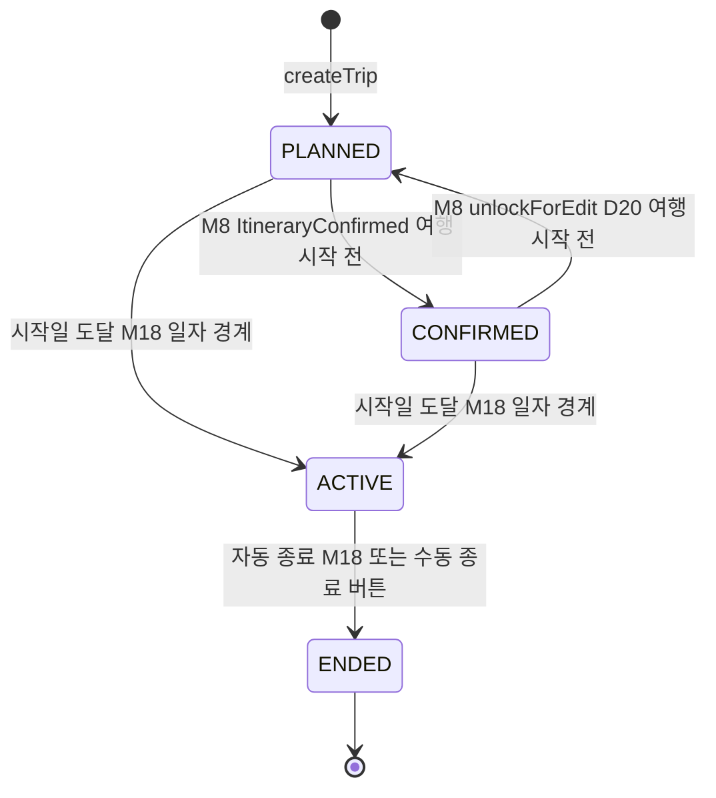

# 유닛 U4 상세 설계 — 여행 생성·필수 방문지

> 출처: aidlc-docs/construction/u4-trip/functional-design/{domain-entities,business-rules,business-logic-model,frontend-components}.md, aidlc-docs/construction/u4-trip/nfr-requirements/{nfr-requirements,tech-stack-decisions}.md, aidlc-docs/construction/u4-trip/nfr-design/nfr-design-patterns.md, aidlc-docs/construction/u4-trip/infrastructure-design/infrastructure-design.md, aidlc-docs/construction/plans/u4-trip-{functional-design,nfr-design}-plan.md, aidlc-docs/inception/application-design/unit-of-work.md(U4) · aidlc-docs에서 2026-07-05 추출 · 이후 본 문서가 정본이다.

## 1. 개요

U4는 **여행 컨텍스트**(여행·거점 연결·필수 방문지·시간창·예산)를 완성하는 유닛이다. 소유 서버 모듈은 **M6 Trip Creation**, 클라이언트 feature는 `features/trip`(생성·상세·거점·필수 방문지)이다. 담당 에픽은 **E4**(11개 스토리 US-E4-01~11).

### 1.1 목적과 위상

U4의 존재 이유는 **U5 솔버의 문제 정의가 이 유닛의 산출 스키마로 결정된다**는 데 있다. 여행(날짜·인원·예산·시간창), 거점 연결, 필수 방문지가 여기서 완성되어야 U5가 "일정을 생성할 준비가 끝난 여행"을 받는다. 따라서 U4는 **CP1(U3→U4)의 소비자이자 CP2(U4→U5)의 공급자**다.

- **CP1 소비**: 등록 숙소(SavedStay)·저장 POI(SavedPlace)는 U3([U3 상세](./u3-place-stay.md))가 소유하는 입력이며, U4는 참조·소비만 한다.
- **CP2 공급**: 본 유닛의 산출 스키마(TripContext)가 U5([U5 상세](./u5-itinerary.md)) 솔버 문제 정의를 결정한다.

규모는 **스토리 11 · 신규 엔티티 약 5 · 외부 연동 0**으로 중간이나, CP2 계약의 정밀도가 U5 성패를 좌우하므로 설계 비중이 높게 배정된 유닛이다. U4는 **순수 CRUD·검증 중심 유닛**으로, 외부 연동·스케줄러 잡·신규 인프라가 전부 0이다.

### 1.2 유닛 범위 (포함·제외)

| 구분 | 항목 |
|---|---|
| 포함 — 여행 CRUD | 제목(선택 입력·자동 생성·금칙어 N6), 날짜 검증(오늘 이후·최대 30일 G42), **기존 여행 날짜 겹침 차단(D21/Δ3 — 활성 여행 항상 최대 1개)**, 인원·예산 선택 입력 |
| 포함 — 예산 | 여행 전체 총액 기준(항공 제외, D26/Δ2), 온보딩 러프 예산 기본값 제시, 1인·1일 파생 표기, 1박 가격대 환산(G26) |
| 포함 — 시간창 | 날짜별 이용 가능 시작/종료 시각(기본 09:00~21:00, D29/G119), 첫날 도착·마지막날 출발 반영 |
| 포함 — 거점 | 등록 숙소(U3 풀)의 여행 연결, 일자별 다중 거점·구간 비중첩 검증(D15), 다박 연속 숙박, 숙소 날짜→여행 기간 자동 반영, 기간 축소·숙소 삭제 시 차단형 확인(G39), 첫날 거점 공백 시 여행지 중심 좌표 기본 거점(G41) |
| 포함 — 필수 방문지 | 저장 POI 체크박스 투입(권역 밖 경고 G158)·**사본 복제**(원본 삭제 독립, G129), 일수 비례 한도(하루 3곳×일수, G40), 방문 시각 고정, 변경 시 재계산 미리보기(G43), 고정/필수 블록 규칙(US-E4-09) |
| 포함 — 여행 속성 | 여행별 속성 저장(동행·이동 수단·예산대 — 계정 취향을 기본값 제안, G134), 국내 좌표 범위 검증(G120) |
| **제외** | 일정 생성 자체(U5) — U4는 "일정을 생성할 준비가 끝난 여행"까지 / 숙소 권역 역추천(US-E2-05 원칙) 및 숙소 나중 등록 시 권역 추천(U5 M8 소유) / 공동 편집·초대(U11) |

### 1.3 선행·후행 유닛

- **선행**: U1(파운데이션 — 서버 스캐폴드·RDS·인증·성능 규약), U2(앱셸 — 5탭·홈 온램프 진입점), **U3(숙소·장소 데이터 — CP1 공급자)**. U4는 직접 선결 과제가 없으나 U3의 P2(지도 API 약관·D13)·P4(TourAPI 캐싱) 완료를 전제로 한다. 여행 생성은 전부 자체 데이터 위에서 동작한다.
- **후행**: **U5(AI 일정 생성 — CP2 소비자)**. TripContext를 신뢰하되 D21·D15·G40을 방어적으로 재검증한다(이중 방어). 이후 U6(실행)·U7(기록)이 여행을 참조한다.

### 1.4 완료 기준(DoD) 요지

- **기능**: E4 11개 스토리 수용 기준 충족. 숙소 없이 여행 먼저 생성(Case B 온램프)과 숙소 선등록 경로 모두 동작.
- **하드 제약(D37) — 테스트 100%·머지 차단**: 날짜 겹침 차단(D21)·거점 구간 비중첩(D15)·필수 방문지 한도(G40). 이 셋은 U5 솔버 "숙소 기준점·충돌 무배치" 하드 제약의 **입력 무결성**이다.
- **PBT**: (1) 임의 여행 집합에서 겹침 차단 후 활성 여행 ≤1 불변식, (2) 거점 구간 집합의 비중첩·기간 커버리지 속성, (3) 예산 총액↔1인·1일 파생값 왕복(반올림 손실 한계), (4) 필수 방문지 한도(임의 일수·추가 순서에 대해 초과 불가), (5) 제목 자동 생성('{여행지} N박M일') 결정성.
- **확장 규칙**: SECURITY-05(전 입력 스키마 검증·금칙어), SECURITY-08(여행 소유권 — IDOR 방지), PBT-01 속성 식별 문서화.
- **계약 포인트**: **CP1 소비자 측**(등록 숙소·저장 POI 스키마) + **CP2(U4→U5) 공급자 측** — 여행 컨텍스트 계약(시간창·거점 목록·필수 방문지·속성) 계약 테스트.

관련 크로스커팅 문서: [아키텍처](../architecture.md) · [도메인 모델](../domain.md) · [주요 흐름](../flows.md) · [핵심 결정/ADR](../decisions.md) · [NFR 기준](../nfr.md) · [인프라](../infrastructure.md) · [개발 순서](../units.md) · [용어집](../glossary.md)

---

## 2. 도메인 엔티티

소유 모듈은 M6 Trip Creation이다. 본 유닛은 여행 상태 머신(§2.2.4)의 **정본 소유자**이며, 엔티티는 5종(Trip·TripDateWindow·BaseAssignment·MustVisit·BudgetAllocation)이다. 표기 규약: `필수`=NULL 불가, `선택`=NULL 허용(NULL 의미 명기), `유니크`=제약 범위 내 유일, `파생`=저장 안 함(조회 시점 계산).

### 2.1 엔티티 지도

```text
[M6 Trip Creation — 여행 컨텍스트 정본]
Account 1 ──── * Trip                    (계정 귀속 여행 — 활성 여행 ≤1, D21)
Trip 1 ──── * TripDateWindow             (날짜별 이용 가능 시각, G119/D29)
Trip 1 ──── * BaseAssignment             (거점 배정 — 스키마·API는 U3 M4, 여행 내 비중첩 검증·스마트 기본은 U4 소비 CP1)
Trip 1 ──── * MustVisit                  (필수 방문지 — 저장 POI 사본 투입 G129·한도 G40)
Trip 1 ──── 1 BudgetAllocation           (예산 전체총액→일예산 파생 — 값 객체, 저장은 Trip.budgetTotal)

[CP1 입력 — U3 소유(본 유닛은 참조·소비만)]
BaseAssignment * ──── 1 SavedStay        (U3 M4 — 계정 레벨 풀, D15)
MustVisit.poiSnapshotRef ──▶ PoiSnapshot (U3 M7 — 확정 시점 사본, 저장 POI 투입 시 M6가 사본 복제 G129)

[CP2 출력 — U5 M8·C2 소비]
Trip + TripDateWindow[] + BaseAssignment[] + MustVisit[] + 여행 속성 → TripContext(솔버 문제 정의)
```

### 2.2 Trip — 여행 (M6, 상태 머신 정본)

여행 단위(목적지·기간·인원·예산·제목·속성)의 정본이자 **여행 상태 머신의 정본 소유자**. 활성 여행은 항상 최대 1개(D21)이며, 이 엔티티의 무결성(겹침 차단·날짜 규칙·국내 범위)이 U5 솔버 "숙소 기준점·충돌 무배치" 하드 제약의 입력 전제다.

#### 2.2.1 속성

| 속성 | 타입 | 제약 | 의미·근거 |
|---|---|---|---|
| tripId | 식별자 | 필수 · 유니크 · 불변 | 여행 정본 키 — BaseAssignment·MustVisit·TripDateWindow가 참조. U5 일정·U6 실행·U7 기록의 여행 참조 단일 키 |
| accountId | 식별자(Account FK) | 필수 | 계정 귀속 — 소유권 검증(SECURITY-08, IDOR 방지) [D22] |
| title | 문자열 | 필수 · 기본 자동생성 | 여행 제목. 미입력 시 `{여행지} N박M일` 자동 생성(결정성), 수시 수정, 금칙어 `C3.checkText` [N6] |
| destination | 구조체 {regionRef, centerCoord{lat,lng}} | 필수 | 여행지(명칭 참조 + 중심 좌표). 중심 좌표는 국내 좌표 범위 검증 통과분(INV-TRIP3)·첫날 공백 기본 거점 좌표원(G41) [G120] |
| startDate | 날짜 | 필수 | 시작일 — 오늘 이후만(INV-TRIP2) [G42] |
| endDate | 날짜 | 필수 | 종료일 — `endDate ≥ startDate` ∧ 기간 ≤ 30일(INV-TRIP2) [G42] |
| party | 정수(양수) | 필수 · 기본 1 | 인원. 미입력 시 1명 — 예산 1인 파생·인원 가중 입력 [PRD 05-1] |
| budgetTotal | 구조체(금액){rawTotal, mappedBand?} | 선택 | **여행 전체 총액(항공 제외 — 숙소+식비+활동+교통)**. NULL=예산 미설정. 온보딩 러프 예산(M2)을 기본값 제안하되 정확 총액으로 수정 가능. 1인·1일은 파생(§2.6, 저장 안 함) [D26/Δ2, G36] |
| attributes | 구조체 {companion, transportModes, budgetTier} | 필수 · 기본 계정 취향 | 여행별 속성 — 동행 유형·이동 수단·예산대. 계정 취향(M2)을 기본값 제안한 여행별 오버라이드, C1 점수화 가중치 입력(CP2) [G134] |
| status | 열거 {PLANNED, CONFIRMED, ACTIVE, ENDED} | 필수 · 기본 `PLANNED` | 여행 생애 상태(§2.2.4 상태 머신 정본). 전이 트리거는 타 유닛 이벤트 수용(CONFIRMED=M8, ACTIVE/ENDED=M18) |
| deletedAt | 시각(UTC) | 선택 | 소프트 삭제 30일 유예(직교 플래그 — 상태와 독립). NULL=미삭제. 값 존재 시 즉시 비노출 [D18] |
| createdAt | 시각(UTC) | 필수 · 불변 | 생성 일시 |

여행 속성 세부: `companion`(동행 유형 — 기본 단일 + '반려동물 동반' 보조 불리언 G19 계열), `transportModes`(이동 수단 다중), `budgetTier`(예산대 열거) — 전부 계정 취향(M2) 기본값 제안 후 여행별 저장 [G134].

#### 2.2.2 파생 표시값 (저장 안 함)

| 파생값 | 계산 | 근거 |
|---|---|---|
| nights / days | `nights = endDate - startDate`, `days = nights + 1` | 제목 자동생성·일예산 분모·한도 분모 |
| dDay | `startDate - today`(여행 전만) | 목록 카드 표시(G3) — 여행 중은 방문 체크 비율(M18 소유) |
| 예산 1인·1일 | BudgetAllocation §2.6 파생 | D26 — 조회 시점 계산 |

#### 2.2.3 제목 자동생성 규칙 (N6 — 결정성)

- 미입력 제목은 `{destination.regionRef 명칭} {nights}박{days}일`로 결정적 생성(동일 여행지·기간 입력 → 동일 제목, PBT U4-P6).
- 사용자 입력 제목·자동 제목 모두 금칙어 검증(`C3.checkText`) 통과 필수 — 위반 시 인라인 오류·대체 제안(빈 제목 저장 금지) [N6, SECURITY-05].

#### 2.2.4 여행 상태 머신 (정본 — components.md §3.1 상세화)

트리거 분업: U4(M6)는 상태 **엔티티·전이 가드의 정본**을 소유하되, CONFIRMED 전이는 M8(U5) 이벤트를, ACTIVE/ENDED 전이는 M18(U6) 트리거를 수용한다. U4 구현 범위는 상태 필드·전이 규칙·가드 검증이며, 트리거 발행 주체는 타 유닛이다(1차 U4 구현 시 이벤트 수신 계약만 확정, INV-TRIP6).



| 전이 | 트리거 | 가드 조건 | 효과 |
|---|---|---|---|
| (없음) → PLANNED | `createTrip` | 겹침 차단(D21)·날짜 규칙(G42)·국내 범위(G120)·제목 금칙어(N6) 통과 | 여행 생성 — 활성 여행 ≤1 불변식 보전(INV-TRIP1) |
| PLANNED → CONFIRMED | M8 `ItineraryConfirmed` 이벤트 | 여행 시작 전 · 활성 일정 존재 | plan 스냅샷 동결(D14, U5 소유) 참조 · M14 리마인드 스케줄 |
| CONFIRMED → PLANNED | M8 `unlockForEdit`(D20) | 여행 시작 전(여행 중 편집은 current에만 반영되므로 이 전이 불가) | 재확정 전 신규 공개 불가(D20) |
| PLANNED/CONFIRMED → ACTIVE | 시작일 00:00 도달(M18 일자 경계 배치) | D21로 동시 활성 여행은 구조적 ≤1 · 일정 미확정이라도 날짜 진입이면 ACTIVE(PRD 07-1) | 홈 활성 카드·일정 탭이 M18 허브로 수렴, plan/current 분리 시작(D14) |
| ACTIVE → ENDED | (a) 종료일 다음날 00:00 자동(M18 `autoEndTrips`) (b) 사용자 '여행 종료' 수동 버튼 | ACTIVE 상태 · 숙소 유무 무관 단일 규칙(D19, Δ4) | `TripEnded` 발행 → M13 회고, M14 완료 알림, M12 기록 귀속 마감 |
| ENDED (최종) | — | 재개 없음 · 종료 후 기록 편집 허용, 회고 갱신은 수동 재생성만(C11) | — |

#### 2.2.5 Trip 불변식

| ID | 불변식 | 내용·처리 | 근거 |
|---|---|---|---|
| INV-TRIP1 | 겹침 차단·활성 ≤1 (하드 제약) | 같은 accountId의 `deletedAt=NULL`인 여행 중 날짜 구간이 겹치는 쌍은 존재하지 않는다 — 생성·기간 변경 단계에서 겹침 차단(D21). 결과로 동시 ACTIVE 여행은 항상 최대 1개. 머지 차단 테스트 | D21/Δ3, PBT U4-P1 |
| INV-TRIP2 | 날짜 규칙 | `startDate ≥ today` ∧ `endDate ≥ startDate` ∧ `days ≤ 30`. 위반 시 생성·변경 차단·인라인 표시 | G42, PBT U4-P5(일부) |
| INV-TRIP3 | 국내 범위 | `destination.centerCoord`는 국내 좌표 범위(bounding box/역지오코딩) 내 — 벗어나면 차단+사유 | G120 |
| INV-TRIP4 | 제목 존재·결정성 | title은 항상 비어 있지 않다(미입력은 자동생성으로 채움) — 자동생성은 결정적, 금칙어 통과분만 저장 | N6, PBT U4-P6 |
| INV-TRIP5 | 예산 전체총액 정규화 | budgetTotal은 **전체 총액(항공 제외)**만 저장 — 카테고리 분배·1인/1일 값은 저장하지 않고 파생. 저장 축과 파생 축의 라운드트립은 라운딩 한계 내 정합 | D26/Δ2, G37, PBT U4-P2 |
| INV-TRIP6 | 상태 전이 가드 | status는 §2.2.4 전이표의 (트리거·가드) 조합으로만 변경 — 표 밖 전이(ENDED→ACTIVE, ACTIVE→CONFIRMED)는 구조적 불가. 가드 미충족 시 전이 거부 | PBT U4-P5 |

### 2.3 TripDateWindow — 날짜별 이용 가능 시각 (M6)

여행 각 날짜의 '이용 가능 시작/종료 시각'(솔버 시간 예산). 첫날 도착·마지막날 출발 시각을 반영해 일정 생성 시간 예산에 직결(CP2 공급). 정확 시각이 아닌 '이용 가능 창'이며, 자정 초과 활동은 해당 일자에 논리적으로 귀속(논리적 하루).

| 속성 | 타입 | 제약 | 의미·근거 |
|---|---|---|---|
| tripId | 식별자(Trip FK) | 필수 | 귀속 여행 |
| date | 날짜 | 필수 · 유니크(tripId 내) | 대상 일자 — 여행 기간 내(INV-WIN2) |
| availStart | 시각(당일) | 필수 · 기본 09:00 | 이용 가능 시작 — 첫날은 도착 시각 반영 [G119, D29] |
| availEnd | 시각(당일) | 필수 · 기본 21:00 | 이용 가능 종료 — 마지막날은 출발 시각 반영 [G119, D29] |
| isUserOverridden | 불리언 | 필수 · 기본 false | 사용자 조정 여부(기본 시간창 vs 명시 조정 구분) |

**불변식**

| ID | 불변식 | 내용 | 근거 |
|---|---|---|---|
| INV-WIN1 | 시각 순서 | `availStart < availEnd`. 위반 시 저장 차단·인라인 | G119 |
| INV-WIN2 | 기간 정합 | date는 `[startDate, endDate]` 내에 존재하며, 기간 변경 시 창 밖 일자는 파괴적 변경 확인 대상(BR-U4-10) | G39, G119 |
| INV-WIN3 | 기본값 완전성 | 사용자가 조정하지 않은 일자도 기본 09:00~21:00 창을 가짐 — CP2로 전달되는 시간창은 전 일자에 대해 총함수(공백 일자 0) | D29, G119 |

### 2.4 BaseAssignment — 여행 거점 배정 (스키마 U3 M4 · 여행 내 검증은 U4 M6 소비)

SavedStay(U3 계정 풀)를 여행 구간 거점으로 연결하는 조인. **데이터·API·조인 스키마·비중첩 판정 순수 함수·스마트 기본 거점 산출(getBaseTimeline)은 U3(M4)이 소유·공급**하고, **여행 컨텍스트가 필요한 여행 내 거점 비중첩 검증 실행·전환일 처리·커버리지 완성·거점 UI는 U4(M6)가 소비·완성**한다. 엔티티 속성 정본은 U3 §7이며, 본 절은 U4가 완성하는 여행 측 규칙·불변식을 정의한다.

#### 2.4.1 U4가 완성하는 파생·산출

| 산출 | 타입 | 의미·근거 |
|---|---|---|
| 비중첩 검증 결과 | `ok \| ConflictDetected(overlapDates)` | 같은 tripId의 active BaseAssignment dateRange 집합에 U3 비중첩 판정 순수 함수를 적용해 **검증 실행**(계정 풀 미연결 숙소는 대상 아님). 겹침 시 겹치는 날짜 표시+거점 선택 유도 [D15, BR-U4-06] |
| isSmartDefault | 불리언(U3 산출·저장, U4 소비) | 공백일 스마트 기본 거점 — **U3 getBaseTimeline이 산출·저장**(공백일=직전 숙소, **첫날 공백=여행지 중심 좌표** Trip.destination.centerCoord, isSmartDefault=true). U4는 이를 소비해 비차단 안내(사후 수정 배지) 표시 [G41, BR-U3-17, BR-U4-12] |
| transitionDay | 파생 식별 | 전환일 — A 숙소 체크아웃일 = B 숙소 체크인일. "출발점=A·복귀점=B" 편도 동선 모델링 입력(CP2, U5 C2 소비) [G50] |
| coverage | 파생 | 여행 전 일자에 대해 (실거점 ∪ 스마트 기본)이 빈틈없이 배정 — CP2 거점 목록의 완전성 [D15, PBT U4-P3] |

#### 2.4.2 BaseAssignment 불변식 (U4 소비 측)

| ID | 불변식 | 내용 | 근거 |
|---|---|---|---|
| INV-BASE-U4-1 | 여행 내 비중첩 (하드 제약) | 같은 tripId에 연결된 active BaseAssignment들의 dateRange는 서로 겹치지 않는다 — **검증 실행은 U4**(U3은 판정 순수 함수 공급). 겹침 허용해 거점 둘인 상태로 일정 생성 진입 금지. 머지 차단 테스트 | D15, PBT U4-P3, CP1 |
| INV-BASE-U4-2 | 좌표 확정 전제 | coordConfirmed=true인 SavedStay만 거점 배정 대상(U3 INV-STAY2 이중 방어) — 미확정 좌표는 "지도에서 위치 확인" 유도 | CP1 시나리오 2 |
| INV-BASE-U4-3 | 스마트 기본 비차단 | 공백일 스마트 기본 거점은 사용자 흐름을 차단하지 않는다(isSmartDefault=true·사후 수정 가능) — 첫날 공백은 여행지 중심 좌표로 채움 | G41, BR-U3-17, PRD 05-6 |
| INV-BASE-U4-4 | 커버리지 완전성 | CP2로 공급되는 거점 목록은 여행 전 일자를 빈틈없이 커버한다(실거점 + 스마트 기본) — 미배정 일자 0 | D15, G41, PBT U4-P3 |

### 2.5 MustVisit — 필수 방문지 (M6)

AI 일정 생성의 기준점(앵커)으로 사용자가 미리 지정한 '꼭 가고 싶은 장소'. 저장 POI 투입 시 **사본 복제**(원본 저장 목록과 독립, G129)하며, 일수 비례 한도(G40) 내에서만 추가된다. 2유형(포함 고정형 기본 / 시각 고정형)으로 일정 반영 규칙이 나뉜다(정본은 U5 PRD 06-4).

#### 2.5.1 속성

| 속성 | 타입 | 제약 | 의미·근거 |
|---|---|---|---|
| mustVisitId | 식별자 | 필수 · 유니크 | — |
| tripId | 식별자(Trip FK) | 필수 | 귀속 여행 |
| poiSnapshotRef | 식별자(PoiSnapshot 참조) | 필수 | **확정 시점 사본 참조**(U3 M7 PoiSnapshot, purpose=MUST_VISIT). 저장 POI 투입은 M6가 사본 복제 — 원본 SavedPlace 삭제와 독립(INV-MV1) [D13, G129] |
| canonicalPoiId | 식별자(Poi 참조) | 필수 | 원본 참조(대조·소실 판정용) — 사본은 독립 잔존 |
| type | 열거 {ANYTIME, FIXED} | 필수 · 기본 `ANYTIME` | 유형 — `ANYTIME`(포함만 보장, 시각·순서는 AI 배치 — 화면 라벨 '아무 때나 꼭 가기') / `FIXED`(시각 고정 — 라벨 '시간 정해두기') [PRD 05-8] |
| fixedDate | 날짜 | 선택 | FIXED 시 지정 날짜. NULL=미입력 → 영업시간·동선 맞춰 자동 배치(U5) [PRD 05-8 예외] |
| fixedStart | 시각 | 선택 | FIXED 시 시작 시각. NULL=미입력 → 자동 배치 |
| stayDuration | 정수(분) | 선택 | FIXED 시 체류 시간. NULL=미입력 → 카테고리 기본값(StayTimeTable, U3 M7) |
| regionOutsideFlag | 불리언 | 필수 · 기본 false | 여행지 권역 밖 항목 표시(경고 배지+기본 해제 신호) [G158] |
| staleFlag | 불리언(파생) | 필수 · 기본 false | 원본 Poi가 `LOST`면 true → '확인 불가' 배지, 시드 투입 제외(사본은 잔존) [G8] |
| createdAt | 시각(UTC) | 필수 | 지정 일시 |

#### 2.5.2 2유형 요약 (내부 용어 ↔ 화면 라벨)

| 내부 type | 화면 라벨 | 일정 반영(정본 U5 PRD 06-4) |
|---|---|---|
| ANYTIME | '아무 때나 꼭 가기' | 포함만 보장 — 시각·순서 재계산 가능하나 일정에서 누락 금지(US-E4-09) |
| FIXED | '시간 정해두기' | 시각 고정 — 생성·재생성 후에도 날짜·시간 불변(고정 블록·warm-start 보존 G46) |

#### 2.5.3 MustVisit 불변식

| ID | 불변식 | 내용 | 근거 |
|---|---|---|---|
| INV-MV1 | 사본 독립 | MustVisit는 poiSnapshotRef 사본을 보유하며, 원본 SavedPlace/PoiSnapshot 삭제·갱신이 MustVisit에 역류하지 않는다(투입 시점 동결) — "사본" 의미는 UI·설계 양쪽에 명시 | G129 |
| INV-MV2 | 한도 (하드 제약) | 한 여행의 MustVisit 개수 ≤ `3 × days`. 초과 추가는 `LimitExceeded`로 차단(추가 순서·일수 무관 상한 불변). 머지 차단 테스트 | G40, PBT U4-P4 |
| INV-MV3 | 유형 필드 정합 | type=ANYTIME이면 fixedDate·fixedStart·stayDuration는 무의미(무시). type=FIXED이면 세 필드는 선택 — 미입력은 오류가 아니라 자동 배치 신호(빈 일정 금지) | PRD 05-8 예외 |
| INV-MV4 | 권역 밖 기본 해제 | regionOutsideFlag=true 항목은 체크박스 화면에서 경고 배지+기본 해제 상태로 표시(사용자 명시 선택 시에만 투입) | G158 |
| INV-MV5 | 소실 제외 | staleFlag=true(원본 LOST) 항목은 시드 투입 제외 안내되되 이미 지정된 사본은 파기되지 않음('확인 불가' 배지 병기) | G8, CP1 시나리오 3 |

### 2.6 BudgetAllocation — 예산 배분 파생 (M6, 값 객체 — 저장 안 함)

여행 전체 총액(Trip.budgetTotal)에서 **파생 계산**되는 1인·1일·1인1일 예산과 솔버 소프트 가중치. v1은 카테고리 분배 없이 총액÷일수÷인원만 산출한다(G37/G47). 저장 실체는 Trip.budgetTotal뿐이며, 본 값 객체는 조회 시점 파생이다.

| 파생값 | 계산 | 의미·근거 |
|---|---|---|
| rawTotal | `Trip.budgetTotal.rawTotal` | 전체 총액(항공 제외 — 정본 저장 축) [D26/Δ2] |
| perPerson | `rawTotal / party` | 1인 파생 표기 |
| perDay | `rawTotal / days` | 1일 파생 표기 |
| perPersonPerDay | `rawTotal / (party × days)` | 1인 1일 파생 — 숙소 가격대 환산·솔버 소프트 가중치 입력(G26/G37) |
| softWeight | perPersonPerDay 기반 카테고리 무료/저/중/고 추정 | **솔버 하드 제약 아님** — LLM 추천 소프트 가중치 + 숙소 필터 상한 환산만(INV-BUDGET2) [G37/G47] |

**불변식**

| ID | 불변식 | 내용 | 근거 |
|---|---|---|---|
| INV-BUDGET1 | 라운드트립 정합 | budgetTotal 존재 시 파생 4값은 결정적이며 `perPersonPerDay × party × days`는 rawTotal과 라운딩 한계 내 정합(왕복 손실 ≤ 라운딩 단위) | D26, PBT U4-P2 |
| INV-BUDGET2 | 소프트 가중치 게이트 | 예산은 솔버 하드 제약으로 승격되지 않음 — softWeight는 C1 점수화 가중치·숙소 필터 상한으로만 전파(예산 초과 배치가 하드 차단되지 않음) | G37/G47, ADR-0008 |
| INV-BUDGET3 | 미설정 중립 | budgetTotal=NULL이면 BudgetAllocation은 미산출(중립) — softWeight 없이 취향 기반 점수화만(빈 값 강요 금지) | PRD 05-1 |

### 2.7 CP1 소비 참조 계약 (U3 → U4 입력)

U4는 다음 U3 소유 엔티티를 **참조·소비만** 한다(스키마 정본은 U3, 본 유닛은 재정의하지 않음). 계약 무결성은 CP1 통합 테스트로 검증한다.

| 입력 엔티티(U3 소유) | U4 소비 용도 | 소비 시 검증 |
|---|---|---|
| SavedStay(내부 숙소 ID·좌표·체크인/아웃·등록 경로) | BaseAssignment 거점 배정 입력, 숙소 날짜→여행 기간 자동 반영(US-E4-05) | coordConfirmed=true 전제(INV-BASE-U4-2), 체크아웃>체크인 완료 상태 |
| SavedPlace(canonical POI·스냅샷·소실 플래그) | MustVisit 체크박스 시드 투입(사본 복제 G129) | 소실('확인 불가') 항목 투입 제외(INV-MV5), 권역 밖 경고(G158) |
| M7 장소 검색 API(`searchPoi`) | 필수 방문지 검색 추가 재사용 | canonical POI·좌표 미확정 시 핀 지정 요구 |

### 2.8 CP2 공급 계약 (U4 → U5 출력) — TripContext

U4 산출 스키마가 U5 솔버 문제 정의를 결정한다(**1차 유닛 체인 정밀도 최고 계약**). 아래 조립 결과가 CP2 경계로 공급되며, U5는 이를 신뢰하되 D21·D15·G40을 방어적으로 재검증한다(이중 방어).

| 공급 객체 | 필드(개요) | 경계 무결성 보장 |
|---|---|---|
| Trip | tripId·accountId·destination(국내 범위 G120)·start/end(오늘 이후·≤30일 G42·겹침 없음 D21)·party·budget(총액+파생 D26)·title·status | INV-TRIP1·2·3·5 |
| TripDateWindow[] | 일자별 availStart/End(기본 09:00~21:00 D29, 첫날·마지막날 반영 G119) — 전 일자 총함수 | INV-WIN3 |
| BaseAssignment[] | 구간(날짜 range — 비중첩 D15)·숙소 참조(내부 ID+스냅샷 좌표)·다박 표현·첫날 공백 기본 거점(G41)·전환일 식별(G50) | INV-BASE-U4-1·4 |
| MustVisit[] | POI 사본(원본 독립 G129)·시각 고정(선택)·한도 내 보장(G40)·권역 밖 경고 이력(G158) | INV-MV1·2 |
| 여행 속성 | 동행·이동·예산대(계정 취향 기본 오버라이드 G134) — C1 점수화 가중치 | — |

**계약 변경 통제**: 시간창·거점 구간 표현 변경은 C2 제약 모델 재작성을 유발 — U5 착수 후에는 필드 **추가만** 허용(파괴적 변경 금지).

### 2.9 엔티티-스토리 추적 요약

| 엔티티 | 주 근거 스토리 | 주 결정 |
|---|---|---|
| Trip | US-E4-01·02·11 | D21/Δ3, D26/Δ2, D29, N6, G42, G120, G134 |
| TripDateWindow | US-E4-01 | G119, D29 |
| BaseAssignment(U4 소비) | US-E4-03·04·06·07 | D15, G41, G50, CP1 |
| MustVisit | US-E4-08·09, US-E2-05 | G40, G129, G158, G43, G8, G46 |
| BudgetAllocation(파생) | US-E4-01 | D26/Δ2, G37/G47, G26 |

---

## 3. 비즈니스 규칙 (BR-U4-01 ~ 25)

규칙 ID `BR-U4-xx`는 본 유닛 전역 유일이며 코드·테스트·리뷰에서 이 ID로 추적한다. 각 규칙은 조건(언제 평가)·동작(무엇을)·위반 시 처리·근거로 구성한다. 판정 정본은 항상 서버이며, 클라이언트 검증은 UX 선반영이다.

### 3.1 규칙 색인

| 그룹 | 규칙 |
|---|---|
| A. 여행 생성·검증 | BR-U4-01 ~ 05 |
| B. 예산 | BR-U4-06 ~ 07 |
| C. 거점 연결 (CP1 소비) | BR-U4-08 ~ 12 |
| D. 필수 방문지 | BR-U4-13 ~ 18 |
| E. 시간창 | BR-U4-19 |
| F. 파괴적 변경·연쇄 | BR-U4-20 ~ 21 |
| G. 상태 머신 | BR-U4-22 ~ 23 |
| H. CP2 공급 계약 | BR-U4-24 ~ 25 |

### 3.2 A. 여행 생성·검증

**BR-U4-01 여행 생성 필수 입력·버튼 게이트**
- 조건: 여행 생성(`createTrip`) 시.
- 동작: 여행지·날짜 범위를 **필수**로 수집 — 둘 중 하나라도 비어 있으면 "여행 생성" 버튼 비활성 유지. 인원·예산·제목·시간창·여행 속성은 **선택**이며, 미입력 시 인원 1명·예산 미설정·제목 자동생성·기본 시간창(09:00~21:00)·계정 취향 기본값으로 생성.
- 위반 시 처리: 여행지·날짜 누락 생성 요청은 클라이언트 게이트+서버 `ValidationFailed`로 거부.
- 근거: US-E4-01, PRD 05-1, D26, G119, G134.

**BR-U4-02 날짜 검증 — 오늘 이후·최대 30일·종료≥시작**
- 조건: 여행 생성·기간 변경(`createTrip`·`updateTripDates`) 시.
- 동작: `startDate ≥ today` ∧ `endDate ≥ startDate` ∧ `days ≤ 30` 검증(INV-TRIP2). 종료일이 시작일보다 빠르면 "종료일은 시작일 이후여야 합니다" 오류.
- 위반 시 처리: `ValidationFailed` — 위반 항목 인라인 표시·생성 차단.
- 근거: US-E4-01, G42.

**BR-U4-03 기존 여행 날짜 겹침 차단 (하드 제약)**
- 조건: 여행 생성·기간 변경 시(자동 반영 US-E4-05 포함).
- 동작: 같은 계정의 미삭제 여행과 날짜 구간이 겹치면 생성·변경을 **차단**(활성 여행 항상 최대 1개, INV-TRIP1). 겹치는 기존 여행을 명시하고 그 여행 편집·삭제 바로가기 제공(정책 근거 카피 병기).
- 위반 시 처리: `DateOverlap(conflictingTripId, dates)` — 차단·사유 안내. D21 하드 제약, 머지 차단 테스트.
- 근거: US-E4-01, US-E4-05, D21/Δ3, PBT U4-P1.

**BR-U4-04 국내 한정 좌표 검증**
- 조건: 여행지 확정 시.
- 동작: 여행지 중심 좌표가 국내 좌표 범위(bounding box/역지오코딩) 내인지 검증(INV-TRIP3). 벗어나면 차단+사유.
- 위반 시 처리: 국외 좌표 여행지는 `ValidationFailed(OUT_OF_KOREA)` — 국내 한정 강제.
- 근거: US-E4-01, G120.

**BR-U4-05 여행 제목 선택 입력·자동 생성·금칙어 (N6)**
- 조건: 여행 생성·제목 수정(`createTrip`·`updateTrip`) 시.
- 동작: 제목을 선택 입력받고, 미입력 시 `{여행지} N박M일` 형식으로 **결정적** 자동 생성(INV-TRIP4). 언제든 수정 가능하며 입력·자동 제목 모두 `C3.checkText` 금칙어 검증.
- 위반 시 처리: 금칙어 포함 제목은 인라인 오류+대체 제안(빈 제목 저장 금지). 자동 생성은 동일 입력 동일 결과(PBT U4-P6).
- 근거: US-E4-11, N6, C2, SECURITY-05.

### 3.3 B. 예산

**BR-U4-06 예산 전체 총액 정규화 (D26)**
- 조건: 예산 입력·저장 시.
- 동작: 예산은 **여행 전체 총액(항공 제외 — 숙소+식비+활동+교통)**으로 입력·저장(INV-TRIP5). 프리셋 없이 총액 직접 입력이며, 온보딩 러프 예산(M2)이 있으면 기본값 제시하되 정확 총액으로 수정 가능. 1인·1일 값은 인원·일수로 나눈 **파생값으로만 표시**(저장 안 함).
- 위반 시 처리: 1인 기준·카테고리 분배 저장은 결함(전체 총액 단일 축 위반). 미입력은 예산 미설정으로 정상 생성.
- 근거: US-E4-01, D26/Δ2, G36, G26.

**BR-U4-07 일예산 파생·소프트 가중치 (G37)**
- 조건: 예산 존재 여행의 일정 생성 입력 조립 시.
- 동작: `총액 ÷ 일수 ÷ 인원`으로 1인 1일 예산을 파생 산출(BudgetAllocation)하고, 이를 숙소 가격 필터 상한·**LLM 소프트 가중치**로 전달 — v1은 카테고리 분배 없음. 예산은 **솔버 하드 제약이 아니다**(INV-BUDGET2).
- 위반 시 처리: 예산을 솔버 하드 차단 제약으로 승격하는 것은 결함(G47 위반). 미설정 예산은 중립(softWeight 없음).
- 근거: US-E4-01, G37/G47, ADR-0008.

### 3.4 C. 거점 연결 (CP1 소비 — 스키마·API는 U3 M4)

**BR-U4-08 등록 숙소 거점 연결 — 계정 풀에서 여행 연결**
- 조건: 숙소를 여행 거점으로 연결(`M4.linkToTrip`) 시.
- 동작: coordConfirmed=true인 SavedStay(U3 계정 레벨 풀)를 여행의 dateRange 거점으로 연결(BaseAssignment). 등록 폼은 U3 직접 등록 3경로(US-E3-08)를 정본으로 재사용하고, 여행 화면은 **등록 진입점만** 제공. 저장 숙소는 저장 시점 명칭·위치 자동 채움(US-E4-04).
- 위반 시 처리: 좌표 미확정 숙소 연결은 차단(INV-BASE-U4-2) — "지도에서 위치 확인" 유도(CP1 시나리오 2). 여행 화면에 등록 폼을 중복 정의하는 것은 결함.
- 근거: US-E4-03, US-E4-04, D15, G31, CP1.

**BR-U4-09 숙소 날짜 → 여행 기간 자동 반영**
- 조건: 숙소 등록·연결 시(`M4.proposeTripDatesFromStay` → `updateTripDates`).
- 동작: "이 숙소의 체크인/아웃 날짜를 여행 기간으로 가져올까요?"를 제안하고, 수락하면 여행 시작일·종료일을 숙소 체크인·체크아웃으로 설정. 자동 반영 값도 날짜 검증(D21 겹침·G42 규칙)을 **동일하게** 통과해야 함.
- 위반 시 처리: 이미 입력된 여행 기간과 숙소 날짜가 충돌하면 두 값을 나란히 보여주고 사용자가 선택하게 함(자동 덮어쓰기 금지). 자동 반영 후 겹침·규칙 위반은 BR-U4-02·03으로 차단.
- 근거: US-E4-05, D21, G42.

**BR-U4-10 여행 기간 이탈 숙소 — 확장 여부 확인**
- 조건: 거점 연결 시 체크인/아웃이 여행 기간을 벗어날 때.
- 동작: 경고를 표시하고 **여행 기간 자동 확장 여부를 사용자에게 묻는다**(자동 변경 없음). 확장 수락 시 `updateTripDates`로 D21·G42 재검증.
- 위반 시 처리: 기간을 확인 없이 자동 확장하는 것은 결함(사용자 확인 필수).
- 근거: US-E4-03 예외, D21, G42.

**BR-U4-11 다중 숙소 구간별 거점·비중첩 검증 (하드 제약)**
- 조건: 같은 여행에 연결된 거점 구간 겹침 판정 시.
- 동작: 등록된 다중 숙소를 체크인 순 정렬하고, 각 날짜에 해당하는 숙소를 그날 기준 거점으로 사용. 같은 tripId active 거점끼리 **날짜 비중첩을 검증**(U3 판정 순수 함수 소비, INV-BASE-U4-1) — 계정 풀 미연결 숙소는 대상 아님. 겹치면 겹치는 날짜를 표시하고 사용자가 그날 기준 거점 숙소를 선택해 구간을 조정하게 함.
- 위반 시 처리: `ConflictDetected(overlapDates)` — 구간 조정 요구. 겹침 허용 상태로 일정 생성 진입은 결함. D15 하드 제약, 머지 차단 테스트.
- 근거: US-E4-06, D15, CP1, PBT U4-P3.

**BR-U4-12 스마트 기본 거점·다박 연속 숙박 — 비차단**
- 조건: 거점 타임라인 산출·공백일 처리 시.
- 동작: 공백·조정 구간마다 모달로 매번 막지 않고 **U3 getBaseTimeline이 산출한 스마트 기본 거점**(공백일=직전 숙소, **첫날 공백=여행지 중심 좌표** G41·isSmartDefault=true, BR-U3-17)을 소비해 일정을 일단 생성하고, "이 날은 ○○ 기준으로 잡았어요 — 바꾸기" **비차단 안내**로 사후 수정하게 함. 다박 숙소는 하나의 등록으로 체크인~체크아웃 연속 숙박을 지정하고, 일정 화면에서 "N박 체류"로 묶어 표시.
- 위반 시 처리: 스마트 기본 거점으로 흐름을 차단하는 것은 결함(비차단 원칙 PRD 05-6). 다박을 매일 반복 블록으로 표시하는 것은 결함.
- 근거: US-E4-06, US-E4-07, G41, G50.

### 3.5 D. 필수 방문지

**BR-U4-13 필수 방문지 추가 — 2유형·기본 포함 고정형**
- 조건: 필수 방문지 추가(`addMustVisit`) 시.
- 동작: 장소 검색(POI명·주소, M7 재사용) 또는 저장 POI 체크박스로 추가. 기본은 **'아무 때나 꼭 가기'**(ANYTIME — 포함만 보장, 시각·순서 AI 배치)이며, 사용자가 원할 때만 **'시간 정해두기'**(FIXED — 날짜·시각 고정) 토글로 전환. 내부 용어(ANYTIME/FIXED)와 화면 라벨은 분리(§2.5.2).
- 위반 시 처리: 시각 지정을 강제하는 것은 결함(대다수는 장소만 고름). FIXED 필드 미입력은 오류가 아닌 자동 배치 신호(INV-MV3).
- 근거: US-E4-08, PRD 05-8.

**BR-U4-14 저장 POI 체크박스 투입 — 사본 복제 (G129)**
- 조건: 저장 POI를 필수 방문지로 투입(`addMustVisit(List<savedPlaceId>)`) 시.
- 동작: 저장 POI를 체크박스 선택 화면에서 골라 일괄 투입하며, 투입은 **사본 복제**(PoiSnapshot 사본 — 원본 저장 목록과 독립, INV-MV1)로 처리. 원본 SavedPlace 삭제·갱신은 MustVisit에 역류하지 않음.
- 위반 시 처리: 원본 참조를 그대로 링크(원본 삭제 시 동반 소실)하는 것은 결함(사본 원칙 위반). "사본" 의미는 UI 카피·설계에 명시.
- 근거: US-E4-08, G129, D13.

**BR-U4-15 권역 밖 경고·기본 해제 (G158)**
- 조건: 저장 POI 체크박스 화면 구성 시.
- 동작: 여행지 권역 밖 항목은 **경고 배지 + 기본 해제 상태**로 표시(regionOutsideFlag=true) — 사용자 명시 선택 시에만 투입.
- 위반 시 처리: 권역 밖 항목을 기본 선택 상태로 노출하는 것은 결함(불필요한 원거리 앵커 오염).
- 근거: US-E4-08, G158.

**BR-U4-16 필수 방문지 한도 — 일수 비례 (하드 제약)**
- 조건: 필수 방문지 추가 시.
- 동작: 한 여행의 필수 방문지 개수 상한은 **하루 3곳 × 여행 일수**(INV-MV2). 초과 추가는 차단하고 사유를 안내.
- 위반 시 처리: `LimitExceeded` — 추가 차단·사유. 추가 순서·일수와 무관하게 상한 불변. G40 하드 제약, 머지 차단 테스트.
- 근거: US-E4-08, G40, PBT U4-P4.

**BR-U4-17 소실 POI 시드 제외·좌표 미확정 핀 지정 (G8)**
- 조건: 필수 방문지 투입·좌표 판정 시.
- 동작: 소실('확인 불가', staleFlag=true) POI는 투입 제외 안내하되 이미 지정된 사본은 파기하지 않음(INV-MV5). 좌표 미확정 POI는 지도 핀 지정을 요구.
- 위반 시 처리: 소실 POI를 앵커 시드로 투입하는 것은 결함(U5 그라운딩 오염). 좌표 미확정 투입은 결함.
- 근거: US-E4-08 예외, G8, CP1 시나리오 3.

**BR-U4-18 확정 후 필수 방문지 변경 — 미리보기 승인 (G43)**
- 조건: 확정된 일정에서 필수 방문지 변경(`updateMustVisit`·`removeMustVisit`·`previewMustVisitChange`) 시.
- 동작: 변경안 **미리보기(전/후 비교)**를 제시하고 사용자 승인 후에만 적용. 생성 전 변경은 즉시 반영하되 해당 범위(날짜 미지정 시 여행 전체) 재계산 필요 신호를 출력에 동봉.
- 위반 시 처리: 확정 일정에 미리보기·승인 없이 반영하는 것은 결함. 솔버 비가용 시 `UpstreamUnavailable` — 변경 보류 안내(침묵 실패 금지).
- 근거: US-E4-08, G43, D28.

### 3.6 E. 시간창

**BR-U4-19 날짜별 시간창 — 기본 09:00~21:00·첫날·마지막날 (G119)**
- 조건: 여행 생성·시간창 설정(`updateTripWindow`) 시.
- 동작: 날짜별 '이용 가능 시작/종료 시각'을 선택 입력받고(기본 09:00~21:00, D29), 첫날 도착·마지막날 출발 시각을 반영. 미조정 일자도 기본 창을 가져 전 일자 총함수로 CP2에 공급(INV-WIN3). `availStart < availEnd` 검증.
- 위반 시 처리: 시각 역전은 `ValidationFailed`. 공백 일자를 시간창 없이 CP2로 보내는 것은 결함(총함수 위반).
- 근거: US-E4-01, G119, D29.

### 3.7 F. 파괴적 변경·연쇄

**BR-U4-20 기간 축소·거점 삭제 차단형 확인 (G39)**
- 조건: 기간 축소·숙소 거점 삭제·연결 숙소 변경 시(`updateTripDates`·거점 해제).
- 동작: 영향받는 블록(거점·필수 방문지·일정)을 **서버가 산출·나열**한 뒤 **차단형 확인**을 거침 — 확인(`ImpactConfirmation`) 없이는 적용하지 않음. 날짜 변경 시 거점 비중첩·시간창 재검증(BR-U4-11·19).
- 위반 시 처리: 확인 없이 파괴적 변경을 반영하는 것은 결함(G39 방어). 영향 블록 미산출은 결함.
- 근거: US-E4-03, US-E4-06, G39, D15.

**BR-U4-21 여행 삭제 2단계 소프트 삭제·연쇄 고지 (D18)**
- 조건: 여행 삭제(`deleteTrip` → `confirmDeleteTrip`) 시.
- 동작: 연쇄 영향(일정·기록·회고) 미리보기(`CascadePreview`)를 고지한 뒤 2단계 확인으로 소프트 삭제(30일 유예, deletedAt). 삭제는 즉시 비노출.
- 위반 시 처리: 연쇄 고지 없는 즉시 하드 삭제는 결함. SavedStay(계정 풀)는 여행 삭제로 파기되지 않음(U3 INV-STAY3 — BaseAssignment만 해제).
- 근거: US-E09-09(계정 관리·삭제 연쇄 소관), D18(직접 근거), D15.

### 3.8 G. 상태 머신

**BR-U4-22 여행 상태 전이 가드 — 정본 소유 (§2.2.4)**
- 조건: 여행 상태 전이 요청 수신 시.
- 동작: 여행 상태(PLANNED→CONFIRMED→ACTIVE→ENDED)는 §2.2.4 전이표의 (트리거·가드) 조합으로만 변경(INV-TRIP6). CONFIRMED 전이는 M8 `ItineraryConfirmed`/`unlockForEdit` 이벤트를, ACTIVE/ENDED 전이는 M18 일자 경계·종료 트리거를 수용.
- 위반 시 처리: 표 밖 전이(ENDED→ACTIVE 재개, ACTIVE→CONFIRMED 역행 등)는 구조적 거부. 가드 미충족 전이는 거부(PBT U4-P5).
- 근거: US-E4-09(간접), D14, D19/Δ4, D20, D21.

**BR-U4-23 여행 종료 단일 규칙 (D19)**
- 조건: 여행 종료 전이 판정 시.
- 동작: ACTIVE 여행은 (a) 종료일 다음날 00:00 자동 종료(M18 `autoEndTrips`) 또는 (b) 사용자 '여행 종료' 수동 버튼으로 ENDED가 됨 — **숙소 유무 무관 단일 규칙**. 종료는 `TripEnded` 발행으로 회고·완료 알림·기록 마감을 트리거(타 유닛 소비).
- 위반 시 처리: 숙소 유무로 종료 규칙을 분기하는 것은 결함(단일 규칙 위반). ENDED 재개는 결함(최종 상태).
- 근거: US-E4-09(간접), D19/Δ4.

### 3.9 H. CP2 공급 계약

**BR-U4-24 여행 컨텍스트 조립·공급 (CP2)**
- 조건: 일정 생성 준비 완료 여행의 컨텍스트 조립 시.
- 동작: Trip·TripDateWindow[]·BaseAssignment[](스마트 기본·전환일 포함)·MustVisit[](사본·시각 고정)·여행 속성을 **TripContext**로 조립해 CP2 경계로 공급(§2.8). 시간창은 전 일자 총함수, 거점은 전 일자 커버리지 완전(INV-WIN3·INV-BASE-U4-4).
- 위반 시 처리: 시간창·거점 공백을 CP2로 보내는 것은 결함(솔버 입력 오염). U5 착수 후 필드 파괴적 변경은 금지(추가만).
- 근거: US-E4-01~09 횡단, CP2, D14.

**BR-U4-25 경계 무결성 보장 — 이중 방어 전제**
- 조건: CP2 공급 직전.
- 동작: D21(겹침)·D15(거점 비중첩)·G40(한도)를 위반하는 컨텍스트는 CP2 경계로 나가지 않음 — U4가 1차 보장하고 U5도 방어적으로 재검증(하드 제약 입력 무결성 이중 방어). 엣지 케이스(전환일·첫날 공백 거점·시각 고정 충돌)는 계약 테스트 시나리오로 고정.
- 위반 시 처리: 조작·버그로 위반 컨텍스트가 공급되면 CP2 계약 테스트가 차단. U4 검증 누락은 결함(이중 방어의 1차 실패).
- 근거: CP2 검증 시나리오 3, D21, D15, G40, U4 리스크.

---

## 4. 비즈니스 로직 / 프로세스 플로우

핵심 프로세스 플로우 4종과 속성 테스트(PBT-01)이다. 표기: 플로우 `FLOW-x`, 단계 `Sx`, 분기 `Bx`, 예외 `Ex`.

### 4.1 FLOW-1 여행 생성 (겹침 검증 · 제목 · 예산)

**진입**: 홈/온램프 '여행 만들기' → 여행 생성 폼 → `M6.createTrip(accountId, input)`
**관련**: US-E4-01·02·11 · BR-U4-01~07,19 · D21, D26, G42, G119, G120, G134, N6

```text
S1 필수 입력 검증 [BR-U4-01]
   ├─ E1 여행지 또는 날짜 공백 → "여행 생성" 버튼 비활성(서버 호출 없음)
   └─ 인원·예산·제목·시간창·속성 미입력 → 기본값(1명·미설정·자동제목·09:00~21:00·계정 취향)
S2 날짜 검증 [BR-U4-02]
   ├─ E2 startDate < today ∨ endDate < startDate ∨ days > 30 → ValidationFailed 인라인 [INV-TRIP2]
   └─ 국내 좌표 범위 검증 [BR-U4-04]
        └─ E3 국외 좌표 → ValidationFailed(OUT_OF_KOREA) [INV-TRIP3, G120]
S3 기존 여행 겹침 검증 [BR-U4-03]
   └─ E4 날짜 구간 겹침 → DateOverlap(conflictingTripId, dates) → 차단 + 겹치는 여행 편집·삭제 바로가기 [INV-TRIP1 하드 제약, D21]
S4 제목 처리 [BR-U4-05]
   ├─ 미입력 → '{여행지} N박M일' 결정적 자동 생성 [INV-TRIP4]
   └─ E5 금칙어(C3.checkText) → 인라인 오류+대체 제안 [N6]
S5 예산 정규화 [BR-U4-06]
   ├─ 전체 총액(항공 제외) 저장 — 온보딩 러프 예산 기본값 제안·수정 가능 [D26/Δ2]
   └─ 1인·1일은 파생 표기(저장 안 함, BudgetAllocation) [INV-TRIP5]
S6 시간창 초기화 — 날짜별 기본 09:00~21:00, 첫날·마지막날 반영 [BR-U4-19, INV-WIN3]
S7 여행 속성 — 동행·이동·예산대(계정 취향 기본값 제안) [G134]
S8 Trip 생성(status=PLANNED) [INV-TRIP6]
   ├─ B1 숙소 미등록 → "숙소 미등록" 상태 표시+"숙소 등록하면 그 위치 기준 일정" 안내 [US-E4-02]
   │     └─ '예약·숙소 없이 일정부터' 1급 온램프 노출(결제 선행 인상 금지)
   └─ B2 온보딩 미설정 취향 → 점진 설정 카드(건너뛰기 가능·중립 기본값) [US-E4-01]
```

**사후 조건**: 활성 여행 ≤1 불변식 보전(INV-TRIP1). 예산은 전체 총액 단일 축(1인/1일은 파생). 시간창은 전 일자 총함수. 숙소 없이도 여행 생성 가능(Case B 온램프).

### 4.2 FLOW-2 숙소 거점 연결 (CP1 소비 · 비중첩 · 날짜 자동 반영)

**진입**: 여행 상세 '거점 지정' 또는 숙소 등록 완료 온램프 → `M4.linkToTrip` / `M4.getBaseTimeline`
**관련**: US-E4-03~07 · BR-U4-08~12,20 · D15, G41, G50, G39, CP1

```text
S1 등록 숙소 선택(U3 계정 풀에서) [BR-U4-08]
   ├─ 저장 숙소는 저장 시점 명칭·위치 자동 채움, 날짜만 입력 [US-E4-04]
   └─ E1 coordConfirmed=false → 차단 → "지도에서 위치 확인"(U3 shared/map) [INV-BASE-U4-2, CP1 시나리오 2]
S2 숙소 날짜 → 여행 기간 자동 반영 제안 [BR-U4-09]
   ├─ M4.proposeTripDatesFromStay → "체크인/아웃을 여행 기간으로?" 제안
   ├─ 수락 → updateTripDates(날짜 검증 D21·G42 재통과) [INV-TRIP1·2]
   └─ E2 기존 여행 기간과 숙소 날짜 충돌 → 두 값 나란히 표시, 사용자 선택(자동 덮어쓰기 없음) [US-E4-05 예외]
S3 여행 기간 이탈 검사 [BR-U4-10]
   └─ E3 체크인/아웃이 여행 기간 밖 → 경고 + "여행 기간 확장?" 확인(자동 변경 없음) → 확장 시 D21·G42 재검증
S4 다중 거점 비중첩 검증 [BR-U4-11]
   ├─ 등록 다중 숙소 체크인 순 정렬, 각 날짜 기준 거점 배정
   ├─ U3 비중첩 판정 순수 함수 소비(계정 풀 미연결 숙소 제외) [INV-BASE-U4-1 하드 제약]
   └─ E4 구간 겹침 → ConflictDetected(overlapDates) → 겹치는 날짜 표시, 그날 기준 거점 선택 [D15]
S5 스마트 기본 거점 산출 [BR-U4-12]
   ├─ 공백일 = 직전 숙소, 첫날 공백 = 여행지 중심 좌표(isSmartDefault=true) [G41]
   ├─ 비차단 안내 "이 날은 ○○ 기준 — 바꾸기"(사후 수정) [PRD 05-6]
   ├─ 다박 숙소 = 하나의 등록으로 연속 숙박, "N박 체류" 묶음 표시 [US-E4-07]
   └─ 전환일 식별(A 체크아웃=B 체크인 → 편도 동선 입력 G50) [INV-BASE-U4-4]
S6 커버리지 확정 — 여행 전 일자 (실거점 ∪ 스마트 기본) 빈틈없이 배정 [INV-BASE-U4-4]
S7 (사후) 기간 축소·거점 삭제 → 영향 블록 차단형 확인 [BR-U4-20, G39]
```

**가드**: coordConfirmed=false 숙소는 거점 자격 없음(U3 INV-STAY2 이중 방어). 비중첩 검증 실행은 U4, 판정 순수 함수는 U3 공급. 기간·거점 파괴적 변경은 항상 영향 블록 나열 후 확인(G39).

### 4.3 FLOW-3 필수 방문지 지정 (사본 투입 · 권역 필터 · 한도)

**진입**: 여행 상세 '필수 방문지' → 검색 추가 또는 저장 POI 체크박스 → `M6.addMustVisit`
**관련**: US-E4-08·09, US-E2-05 · BR-U4-13~18 · G40, G129, G158, G43, G8, G46

```text
S1 추가 경로 선택 [BR-U4-13]
   ├─ 경로 a: 장소 검색(M7.searchPoi — POI명·주소) → POI 선택
   └─ 경로 b: 저장 POI 체크박스 화면(M7.listSavedPlaces)
        ├─ 권역 밖 항목 = 경고 배지 + 기본 해제(regionOutsideFlag) [BR-U4-15, G158]
        └─ E1 소실('확인 불가', staleFlag) 항목 = 투입 제외 안내 [BR-U4-17, G8, CP1 시나리오 3]
S2 유형 선택 [BR-U4-13]
   ├─ 기본 ANYTIME('아무 때나 꼭 가기' — 포함만 보장) [PRD 05-8]
   └─ 토글 FIXED('시간 정해두기' — 날짜·시각 고정)
        └─ 필드 미입력(fixedDate/Start/Duration NULL) → 오류 아님, 자동 배치 신호 [INV-MV3]
S3 좌표 검증 [BR-U4-17]
   └─ E2 좌표 미확정 POI → 지도 핀 지정 요구(U3 shared/map) [US-E4-08 예외]
S4 한도 검증 [BR-U4-16]
   └─ E3 개수 > 3 × days → LimitExceeded → 추가 차단+사유 [INV-MV2 하드 제약, G40]
S5 사본 복제 투입 [BR-U4-14]
   ├─ 저장 POI → PoiSnapshot 사본 복제(원본 SavedPlace 독립) [INV-MV1, G129]
   └─ M7.snapshotUserConfirmed(MUST_VISIT) 영구 스냅샷 참조 [D13]
S6 MustVisit 생성 — 앵커(시드)로 등록 [US-E4-08]
S7 (사후) 변경 처리 [BR-U4-18]
   ├─ 생성 전 변경 → 즉시 반영 + 해당 범위 재계산 필요 신호
   └─ 확정 일정 변경 → previewMustVisitChange(전/후 비교) → 승인 후 적용 [G43]
        └─ E4 솔버 비가용 → UpstreamUnavailable → 변경 보류 안내
```

**사후 조건**: 필수 방문지 ≤ 3×일수(추가 순서·일수 무관 상한 불변). 저장 POI 투입은 사본(원본 삭제 독립, G129). 소실·권역 밖·좌표 미확정은 오염 없이 필터. FIXED는 고정 블록(warm-start 보존 G46), ANYTIME은 포함 보장(누락 금지).

### 4.4 FLOW-4 여행 컨텍스트 조립 (CP2 공급 — U5 솔버 입력)

**진입**: 일정 생성 진입 전 준비 완료 여행 → `M6.getTrip` 집약 → TripContext 조립
**관련**: US-E4-01~09 횡단 · BR-U4-24~25 · CP2, D14, D15, G40, G50, G119

```text
S1 여행 코어 수집 — Trip(destination·기간·party·budget·title·status) [INV-TRIP1~5]
S2 시간창 조립 — TripDateWindow[] 전 일자 총함수(기본 09:00~21:00·첫날·마지막날) [INV-WIN3, G119]
S3 거점 목록 조립 — BaseAssignment[]
   ├─ 구간(날짜 range, 비중첩 D15)·숙소 참조(내부 ID+스냅샷 좌표)
   ├─ 스마트 기본 거점(첫날 공백=여행지 중심 G41)·커버리지 완전 [INV-BASE-U4-4]
   └─ 전환일 식별(편도 동선 G50)
S4 필수 방문지 조립 — MustVisit[]
   ├─ POI 사본(원본 독립 G129)·시각 고정(선택)·한도 내(G40)·권역 밖 경고 이력(G158)
S5 여행 속성 조립 — 동행·이동·예산대(계정 취향 오버라이드) → C1 점수화 가중치 [G134]
S6 경계 무결성 재검증 [BR-U4-25]
   ├─ D21 겹침 없음·D15 비중첩·G40 한도 이내 재확인 → CP2 경계 공급
   └─ B1 위반 컨텍스트 → CP2 경계 거부(U4 1차 실패 시 U5 방어적 재검증 이중 방어)
S7 TripContext 공급 → U5 M8/C2 솔버 문제 정의 [CP2]
```

**사후 조건**: CP2로 나가는 컨텍스트는 시간창 전 일자 총함수·거점 전 일자 커버리지 완전·필수 방문지 한도 이내. 엣지 케이스(전환일·첫날 공백 거점·시각 고정 충돌)는 계약 테스트 시나리오로 고정. U5 착수 후 필드 파괴적 변경 금지(추가만).

### 4.5 Testable Properties (PBT-01)

PBT 전체 강제. 프레임워크: 서버=Kotest Property Testing, 클라이언트=fast-check. 시드 로깅·수축(shrinking) 필수. 아래 속성은 U4 Code Generation의 DoD 항목(속성 테스트 존재·통과)이다.

**M6 Trip Creation (서버 — Kotest)**

| ID | 카테고리 | 속성 서술 | 제너레이터 요구 |
|---|---|---|---|
| U4-P1 | 논리 게이트·불변식 (하드 제약) | **날짜 겹침 차단·활성 ≤1**: 임의 여행 생성/기간 변경 시퀀스(날짜 구간 인접·포함·부분겹침·비접촉 혼합)에 대해 (a) 겹치는 구간 생성·변경은 항상 `DateOverlap`로 차단(INV-TRIP1), (b) 성공한 여행 집합의 미삭제 구간은 서로 겹치지 않음(활성 ≤1 귀결), (c) 판정 대칭(A가 B와 겹침 ⇔ B가 A와 겹침), (d) 소프트 삭제 여행은 겹침 판정 제외 | 날짜 구간 집합 생성기(경계 인접·1일 포함·역전 케이스) + 생성/변경/삭제 순서 셔플 |
| U4-P2 | 파생 함수 왕복 | **예산 총액↔파생 라운드트립**: 임의 (총액·인원·일수)에 대해 (a) perPerson·perDay·perPersonPerDay가 결정적, (b) `perPersonPerDay × party × days`가 rawTotal과 라운딩 한계 내 정합(왕복 손실 ≤ 라운딩 단위, INV-BUDGET1), (c) 총액 NULL이면 파생 미산출(중립, INV-BUDGET3), (d) 예산은 하드 제약으로 승격되지 않음(softWeight만) | (금액·양수 인원·1~30일) 생성기 + 0/미설정 경계 + 나눗셈 나머지 케이스 |
| U4-P3 | 논리 게이트·비중첩·커버리지 (하드 제약) | **거점 구간 비중첩·커버리지**: 같은 여행에 연결된 임의 거점 dateRange 집합에 대해 (a) 겹침 존재 ⇔ `ConflictDetected(overlapDates)`(INV-BASE-U4-1), (b) 계정 풀 미연결 숙소는 판정 제외, (c) 스마트 기본 거점 채움 후 여행 전 일자가 빈틈없이 커버(미배정 0, INV-BASE-U4-4), (d) 첫날 공백은 여행지 중심 좌표로 채움(G41), (e) 판정 순수 함수(U3 공급) — 동일 입력 동일 출력 | 거점 구간 집합 생성기(인접·포함·부분겹침·공백일·첫날 공백) + 연결/미연결 혼합 |
| U4-P4 | 논리 게이트·한도 (하드 제약) | **필수 방문지 한도**: 임의 (일수·추가 순서·유형 혼합) 시퀀스에 대해 (a) 누적 개수 ≤ 3×days 유지, 초과 추가는 항상 `LimitExceeded`로 차단(INV-MV2), (b) 추가 순서·유형(ANYTIME/FIXED)과 무관하게 상한 불변, (c) 삭제 후 재추가로 상한 복원, (d) 권역 밖·소실 항목은 기본 미투입(오염 0) | (1~30일·추가/삭제 이벤트 시퀀스·권역/소실 플래그) 생성기 |
| U4-P5 | 상태 머신 전이 가드 | **여행 상태 전이**: 임의 (현재 상태·트리거) 조합에 대해 (a) §2.2.4 전이표에 정의된 (트리거·가드) 조합만 성공, (b) 표 밖 전이(ENDED→ACTIVE·ACTIVE→CONFIRMED 등) 전부 거부(INV-TRIP6), (c) 가드 미충족(여행 시작 후 CONFIRMED 등) 전이 거부, (d) ENDED는 흡수 상태(이후 전이 0) | (상태 × 트리거) 전수 조합 + 시작일 경계(시작 전/후) 시각 주입 |
| U4-P6 | 순수 함수 결정성 | **제목 자동 생성**: 임의 (여행지명·기간)에 대해 (a) 미입력 제목은 `{여행지} N박M일`로 결정적 생성(동일 입력 동일 출력, INV-TRIP4), (b) nights/days가 날짜에서 정확 산출(경계: 당일=0박1일), (c) 금칙어 포함 시 저장 거부, (d) 재생성 시 동일 결과(멱등) | (여행지명·시작/종료일 경계 포함) 생성기 + 금칙어 사전 주입 |

**속성 없는 컴포넌트 (No PBT properties identified)**

| 컴포넌트 | 판정 | 사유 |
|---|---|---|
| M6 여행 조회·목록(getTrip·listTrips) | No PBT | 조회·집약 — 보편 양화 도메인 불변식은 상태 전이(U4-P5)·겹침(U4-P1)으로 커버. D-day·진행률 표시는 예시 기반 테스트 |
| M6 파괴적 변경 미리보기(deleteTrip·previewMustVisitChange) | No PBT | 영향 블록 산출·솔버 미리보기 위임 — 차단형 확인 게이트는 예시 기반+상태 전이 통합 테스트. 솔버 재검증은 U5 C2 소유 |
| M4 거점 API(linkToTrip·proposeTripDatesFromStay) | No PBT (U4 시점) | 데이터·스키마는 U3 소유(U3-P5 비중첩 판정 공급) — U4는 검증 실행(U4-P3)으로 소비. 날짜 자동 반영은 예시 기반+CP1 통합 테스트 |

**하드 제약 대조 (D37)**: 날짜 겹침 차단(U4-P1·INV-TRIP1) / 거점 구간 비중첩(U4-P3·INV-BASE-U4-1) / 필수 방문지 한도(U4-P4·INV-MV2). 이 세 하드 제약은 U5 솔버 "숙소 기준점·충돌 무배치" 하드 제약의 **입력 무결성**이며, CP2 경계에서 U5가 방어적으로 재검증한다(BR-U4-25, 이중 방어). 속성 합계 6개(전부 M6).

---

## 5. 프론트엔드 컴포넌트

클라이언트 feature는 `features/trip`(여행 생성·상세·거점·필수 방문지·기간 조정)이다. 폼 검증 규칙은 BR-U4-xx의 클라이언트측 대응(UX용 사본 — **판정 정본은 항상 서버**, D28 원칙 준용)이다. **지도 핀·핀 지정·현위치는 U3 `shared/map`(카카오 지도 SDK 브리지)을 재사용**하며 U4는 신규 지도 컴포넌트를 만들지 않는다. data-testid 규약: `trip-{screen}-{role}`.

### 5.1 여행 화면 플로우

```text
[홈/온램프 '여행 만들기' — U2 소유 진입점 (숙소 우선 / '숙소 없이 일정부터' 1급 온램프)]
        │
        ▼
┌─ TripCreateScreen (여행지·날짜·인원·예산·시간창·점진 취향 카드) ──────────┐
│   여행지·날짜 필수(공백 시 생성 비활성) · 겹침/규칙 오류 · 예산 총액 입력   │
└──────────────────────────────────────────────────────────────────┘
   │ 생성 완료                                              │ 등록 숙소 있음
   ▼                                                        ▼
TripListScreen ──탭──▶ TripDetailScreen ───────────┬─ BaseAssignmentScreen (거점 지정·구간 편집·겹침 UI)
(예정/진행/종료 구분)   (기간·거점·필수방문지·상태)   │     │ 숙소 등록 진입점(→ U3 StayRegisterScreen)
                           │                          │     ▼
                           │ '필수 방문지'             │  TripDateChangeDialog (숙소 날짜 자동 반영·기간 변경 영향 확인)
                           ▼                          │
                   MustVisitScreen (검색 추가 / 저장 POI 체크박스·권역 경고 / 시각 고정)
                           │ 준비 완료
                           ▼
                   [AI 일정 생성하기] (U5 진입 — CP2 TripContext 공급)
```

**전역 규칙**
- 여행 화면군은 5탭 셸(U2) 내 '일정' 탭 스택 또는 홈 진입점에서 열린다(탭 규칙 G6·G7은 U2 shared/ui 소유).
- 숙소 등록 폼은 U3 `StayRegisterScreen`(US-E3-08 정본)을 재사용 — 여행 화면은 **등록 진입점만** 제공하고 등록 폼을 중복 정의하지 않는다(BR-U4-08).
- 외부 OTA 이동·제휴 고지는 U3 US-E3-05 정본 — 여행 화면에서 중복 정의하지 않는다(US-E4-10).
- 모든 서버 오류는 표준 오류 타입으로 정규화되어 침묵 실패 없이 표면화(shared/api) [ADR-0011].
- 파괴적 변경(기간 축소·거점 삭제·확정 후 필수 방문지 변경)은 항상 영향 미리보기·확인을 거친다(G39·G43).

### 5.2 컴포넌트 계층

```text
features/trip
├─ TripNavigator                          — 여행 스택 컨테이너('일정' 탭·홈 진입점 하위)
│  ├─ TripCreateScreen
│  │  ├─ DestinationField                 — 여행지 입력(국내 한정·중심 좌표, 공백 시 생성 비활성)
│  │  ├─ TripDateRangePicker              — 시작·종료일(오늘 이후·≤30일·겹침 오류)
│  │  ├─ ImportDatesFromStayButton        — '등록 숙소에서 날짜 가져오기'(등록 숙소 있을 때) / 없으면 대안 노출
│  │  ├─ PartyField                       — 인원(선택·기본 1)
│  │  ├─ BudgetTotalField                 — 예산 전체 총액(항공 제외·러프 예산 기본값·1인/1일 파생 표기)
│  │  ├─ TripWindowEditor                 — 날짜별 이용 가능 시각(기본 09:00~21:00·첫날·마지막날)
│  │  ├─ TripTitleField                   — 제목(선택·자동 생성 미리보기·금칙어)
│  │  ├─ ProgressivePreferenceCard        — 온보딩 미설정 취향 점진 권유(건너뛰기 가능)
│  │  ├─ DateOverlapError                 — 겹치는 기존 여행 표시+편집·삭제 바로가기
│  │  └─ NoStayOnrampBanner               — "숙소 미등록" 상태·'숙소 없이 일정부터' 1급 온램프 안내
│  ├─ TripListScreen
│  │  └─ TripCard                         — 목적지·기간·D-day·등록 숙소 수·일정 유무·상태(예정/진행/종료)
│  ├─ TripDetailScreen
│  │  ├─ TripSummarySection               — 기간·인원·예산 파생·상태 배지
│  │  ├─ BaseTimelineSummary              — 거점 타임라인(스마트 기본 거점 비차단 배지)
│  │  ├─ MustVisitSummary                 — 필수 방문지 목록(유형 배지·'확인 불가' 배지)
│  │  └─ GenerateItineraryOnramp          — [AI 일정 생성하기](U5 진입) / 숙소 0개 시 비활성+등록 유도
│  ├─ BaseAssignmentScreen
│  │  ├─ RegisteredStayPicker             — 계정 풀 등록 숙소 선택(coordConfirmed 전제)
│  │  ├─ StayRegisterEntryButton          — 숙소 등록 진입점(→ U3 StayRegisterScreen)
│  │  ├─ BaseSegmentEditor                — 일자별 구간 거점 편집(다박 'N박 체류' 묶음)
│  │  ├─ BaseOverlapConflict              — 겹침 날짜 표시+그날 기준 거점 선택
│  │  ├─ SmartDefaultBaseBadge            — "이 날은 ○○ 기준 — 바꾸기"(비차단·첫날 공백=여행지 중심)
│  │  └─ CoordConfirmGuard                — 좌표 미확정 숙소 차단→"지도에서 위치 확인"(U3 shared/map)
│  ├─ MustVisitScreen
│  │  ├─ PoiSearchAddField                — 장소 검색 추가(M7.searchPoi)
│  │  ├─ SavedPlaceCheckboxList           — 저장 POI 체크박스 투입(사본 복제)
│  │  │  ├─ RegionOutsideWarnBadge        — 권역 밖 경고+기본 해제(G158)
│  │  │  └─ LostPoiExcludeBadge           — 소실 '확인 불가' 투입 제외(G8)
│  │  ├─ TimingToggle                     — '아무 때나 꼭 가기'(ANYTIME) / '시간 정해두기'(FIXED)
│  │  ├─ FixedTimingEditor                — 날짜·시각·체류(FIXED, 미입력 시 자동 배치)
│  │  ├─ MustVisitLimitGuard              — 한도(3×일수) 초과 차단+사유
│  │  └─ MustVisitChangePreview           — 확정 후 변경 전/후 비교(승인 후 적용 G43)
│  └─ TripDateChangeDialog
│     ├─ DateConflictSideBySide           — 여행 기간 vs 숙소 날짜 충돌 선택(자동 덮어쓰기 없음)
│     ├─ PeriodExtendConfirm              — 여행 기간 확장 여부 확인(자동 변경 없음)
│     └─ DestructiveChangeImpactList      — 기간 축소·거점 삭제 영향 블록 나열+차단형 확인(G39)
└─ (지도) shared/map (U3 재사용 — 신규 없음)
   ├─ MapView / PinDropController         — 거점 좌표 확인·필수 방문지 핀 지정(U3 브리지)
```

### 5.3 여행 생성 화면 — TripCreateScreen

- **props**: `prefill?: TripPrefill`(온램프·숙소 날짜 가져오기 결과) · **state**: 여행지·날짜·인원·예산·시간창·제목 입력값, 겹침/규칙 오류, 점진 취향 카드 상태.
- **폼 검증(서버 규칙 대응)**:
  - 여행지·날짜 공백 ⇔ "여행 생성" 버튼 비활성(BR-U4-01). 날짜는 오늘 이후·≤30일·종료≥시작(BR-U4-02). 국내 좌표 범위(BR-U4-04).
  - 겹침 시 `DateOverlapError`가 겹치는 기존 여행 명시+편집·삭제 바로가기(BR-U4-03 — 정본은 서버 `DateOverlap`).
  - 예산은 전체 총액 입력, 1인·1일은 파생 표기(BR-U4-06). 제목 미입력 시 자동 생성 미리보기+금칙어(BR-U4-05).
  - 등록 숙소 있으면 `ImportDatesFromStayButton`, 없으면 '숙소 등록하기 / 날짜 직접 입력' 대안(US-E4-01).
- **상호작용**: `M6.createTrip` [FLOW-1]. 숙소 미등록 생성 → `NoStayOnrampBanner`(Case B 온램프 US-E4-02). 미설정 취향 → `ProgressivePreferenceCard`(건너뛰기 가능).
- **data-testid**: `trip-create-destination`, `trip-create-daterange`, `trip-create-budget`, `trip-create-title`, `trip-create-overlaperror`, `trip-create-submit`, `trip-create-nostayonramp`.
- **사용 서버 능력**: `M6.createTrip`, `M6.updateTripWindow`, `M2.getPendingPreferencePrompts`.

### 5.4 여행 목록·상세 화면

**TripListScreen**
- **props**: `filter: TripStatusFilter` · **state**: 예정/진행/종료 구분 목록.
- **폼 검증(서버 규칙 대응)**: '진행 중'은 항상 최대 1건(D21). 카드 진행률은 여행 전=D-day, 여행 중=방문 체크 비율(M18 소유, G3).
- **상호작용**: `M6.listTrips`. 카드 탭 → TripDetailScreen.
- **data-testid**: `trip-list-card`, `trip-list-status`.
- **사용 서버 능력**: `M6.listTrips`.

**TripDetailScreen**
- **props**: `tripId: TripId` · **state**: 기간·거점·필수 방문지·일정 유무·상태 로드.
- **폼 검증(서버 규칙 대응)**: 상태 배지(계획중/확정/진행중/종료). 숙소 0개면 `GenerateItineraryOnramp` 비활성+"숙소를 먼저 등록하세요"(US-E4-02 정본은 U5 스토리 1). 예산 미설정·선택 미입력은 명시값 표기.
- **상호작용**: `M6.getTrip`. 거점 → BaseAssignmentScreen, 필수 방문지 → MustVisitScreen, [AI 일정 생성하기] → U5(CP2 TripContext 공급).
- **data-testid**: `trip-detail-status`, `trip-detail-basetimeline`, `trip-detail-mustvisit`, `trip-detail-generateonramp`.
- **사용 서버 능력**: `M6.getTrip`, `M6.deleteTrip`.

### 5.5 거점 연결 화면 (CP1 소비)

**BaseAssignmentScreen**
- **props**: `tripId` · **state**: 등록 숙소 선택, 구간 거점 편집값, 겹침 충돌, 스마트 기본 거점.
- **폼 검증(서버 규칙 대응)**:
  - `RegisteredStayPicker`는 coordConfirmed=true 숙소만 거점 자격 — `CoordConfirmGuard`가 미확정 시 "지도에서 위치 확인"(U3 shared/map, BR-U4-08, INV-BASE-U4-2).
  - `BaseOverlapConflict`: 구간 겹침 시 겹치는 날짜 표시+그날 기준 거점 선택(BR-U4-11 — 정본은 서버 `ConflictDetected`).
  - `SmartDefaultBaseBadge`: 공백일 비차단 안내(첫날 공백=여행지 중심 좌표 G41, BR-U4-12). 다박은 "N박 체류" 묶음(US-E4-07).
  - `StayRegisterEntryButton`은 U3 등록 폼 진입점만(중복 정의 금지).
- **상호작용**: `M4.getBaseTimeline`·`M4.linkToTrip`. 숙소 날짜 자동 반영 → `M4.proposeTripDatesFromStay` → TripDateChangeDialog. 거점 삭제 → `DestructiveChangeImpactList`(차단형 확인 G39).
- **data-testid**: `trip-base-staypicker`, `trip-base-registerentry`, `trip-base-segmenteditor`, `trip-base-overlapconflict`, `trip-base-smartdefaultbadge`, `trip-base-coordguard`.
- **사용 서버 능력**: `M4.getBaseTimeline`, `M4.linkToTrip`, `M4.proposeTripDatesFromStay`, `M6.updateTripDates`.

**TripDateChangeDialog**
- **props**: `tripId`, `proposedDates` · **state**: 충돌 값 비교, 확장 확인, 영향 블록.
- **폼 검증(서버 규칙 대응)**: `DateConflictSideBySide`는 여행 기간 vs 숙소 날짜 충돌 시 두 값 나란히·사용자 선택(자동 덮어쓰기 없음, BR-U4-09). `PeriodExtendConfirm`은 기간 이탈 시 확장 여부 확인(자동 변경 없음, BR-U4-10). `DestructiveChangeImpactList`는 기간 축소 영향 블록 나열+차단형 확인(BR-U4-20, G39). 자동 반영 후 D21·G42 재검증.
- **상호작용**: `M6.updateTripDates(dates, confirmation)`.
- **data-testid**: `trip-datechange-sidebyside`, `trip-datechange-extendconfirm`, `trip-datechange-impactlist`.
- **사용 서버 능력**: `M6.updateTripDates`.

### 5.6 필수 방문지 화면 — MustVisitScreen

- **props**: `tripId` · **state**: 검색 결과, 저장 POI 체크 상태, 유형 토글, FIXED 편집값, 한도 카운트, 변경 미리보기.
- **폼 검증(서버 규칙 대응)**:
  - `PoiSearchAddField`(M7.searchPoi) 또는 `SavedPlaceCheckboxList`로 추가(BR-U4-13). 저장 POI 투입은 사본 복제(BR-U4-14, G129).
  - `RegionOutsideWarnBadge`: 권역 밖 경고+기본 해제(BR-U4-15, G158). `LostPoiExcludeBadge`: 소실 '확인 불가' 투입 제외(BR-U4-17, G8).
  - `TimingToggle`: 기본 '아무 때나 꼭 가기'(ANYTIME), 토글 '시간 정해두기'(FIXED). `FixedTimingEditor` 필드 미입력은 자동 배치(INV-MV3).
  - `MustVisitLimitGuard`: 개수 > 3×일수 시 추가 차단+사유(BR-U4-16 — 정본은 서버 `LimitExceeded`). 좌표 미확정 → 핀 지정(U3 shared/map).
  - `MustVisitChangePreview`: 확정 일정 변경 시 전/후 비교·승인 후 적용(BR-U4-18, G43).
- **상호작용**: `M6.addMustVisit`·`M6.updateMustVisit`·`M6.removeMustVisit`·`M6.previewMustVisitChange`. 검색·저장 목록은 `M7.searchPoi`·`M7.listSavedPlaces`.
- **data-testid**: `trip-mustvisit-searchadd`, `trip-mustvisit-savedcheckbox`, `trip-mustvisit-regionwarn`, `trip-mustvisit-lostbadge`, `trip-mustvisit-timingtoggle`, `trip-mustvisit-limitguard`, `trip-mustvisit-changepreview`.
- **사용 서버 능력**: `M6.addMustVisit`, `M6.updateMustVisit`, `M6.removeMustVisit`, `M6.previewMustVisitChange`, `M7.searchPoi`, `M7.listSavedPlaces`.

### 5.7 shared/ U4 재사용·완성분

| 계층 | U4 범위 | 근거 |
|---|---|---|
| shared/map | **U3 재사용**(신규 없음) — 거점 좌표 확인·필수 방문지 핀 지정 진입점만 연결 | U3 §7, BR-U4-08·17 |
| shared/api | 겹침·규칙·한도 오류 타입 소비·차단형 확인 토큰 흐름·CP2 컨텍스트 조립 | ADR-0011, CP2 |
| shared/ui | 여행 카드·상태 배지·비차단 스마트 기본 배지·명시값('미설정'·자동 제목 미리보기) | PRD 05-1·6 |
| features/onboarding(재사용) | 점진 설정 카드 데이터 소스(M2 미설정 취향) | US-E4-01, G24/G157 |

### 5.8 화면-스토리-서버 능력 추적 매트릭스

| 컴포넌트 | 스토리 | 서버 능력(M6 + M4·M7·M2 소비) |
|---|---|---|
| TripCreateScreen | US-E4-01, US-E4-02, US-E4-11 | M6.createTrip · M6.updateTripWindow · M2.getPendingPreferencePrompts |
| TripListScreen | US-E09-07, US-E2-02 | M6.listTrips |
| TripDetailScreen | US-E4-01~11 횡단 | M6.getTrip · M6.deleteTrip |
| BaseAssignmentScreen | US-E4-03, US-E4-04, US-E4-06, US-E4-07 | M4.getBaseTimeline · M4.linkToTrip · M4.proposeTripDatesFromStay |
| TripDateChangeDialog | US-E4-05, US-E4-03 | M6.updateTripDates |
| MustVisitScreen | US-E4-08, US-E4-09, US-E2-05 | M6.addMustVisit · updateMustVisit · removeMustVisit · previewMustVisitChange · M7.searchPoi · listSavedPlaces |
| GenerateItineraryOnramp(진입점) | US-E4-02(정본 U5) | M8.generateItinerary(NO_BASE 가드 — U5 소유) |
| (지도 핀·핀 지정) | US-E4-03·08 | U3 shared/map(M7.searchPoi·getPoi 재사용) |

---

## 6. 비기능 요구사항 (NFR)

U4는 신규 인프라·외부 의존이 없다. NFR의 본질은 **U5 솔버가 소비할 여행 컨텍스트의 무결성을 CRUD·검증 계층에서 보증하는 것**이다. 전역 NFR 정본은 [NFR 기준](../nfr.md)이며, 본 절은 그 정본을 U4 관점으로 전개한다(인프라·플랫폼 결정은 전역 정본 상속·재정의 금지).

### 6.1 U4 NFR 프로필

1. **데이터 무결성(핵심)** — 세 하드 제약(D37)이 U5 솔버 입력 무결성이다: **날짜 겹침 차단(D21)·거점 구간 비중첩(D15)·필수 방문지 한도(G40)**. 위반은 솔버 입력 오염이므로 100% 테스트가 머지를 차단한다.
2. **파생 일관성** — 예산은 전체 총액 단일 정본(D26), 1인·1일은 파생값. 파생 계산의 왕복·반올림 손실을 한계 내로 강제.
3. **파괴적 변경 안전성** — 기간 축소·거점 삭제·필수 방문지 변경(G39·G43)은 **차단형 확인·미리보기**로 무단 반영을 막는다.
4. **소유권** — 여행·거점·필수 방문지는 전부 계정 귀속(D15·D22)이므로 IDOR을 원천 차단(SECURITY-08).

보안 기본·무상태·관측성·복원력·배포의 서버 규약은 U1 전역 정본을 그대로 상속한다.

**워크로드 중요도**

| 컴포넌트 | 중요도 | 불가용 시 영향·U4 대응 |
|---|---|---|
| 여행 저장/조회 (M6, DB) | **Critical** | 여행 중 접근 불가 시 현장 피해 최대. U4는 자체 데이터(외부 의존 0)이므로 가용성 바닥은 RDS·Auth(U1 M1) 상속 — U4 신규 워크로드 없음 |
| 거점 연결·검증 (M6, U3 M4 데이터 소비) | Critical 경로 상속 | 등록 숙소·저장 POI 스키마는 U3 소유(CP1 소비), 여행 컨텍스트 검증·연결은 U4. 외부 의존 없음 |
| 필수 방문지 (M6) | Critical 경로 상속 | 저장 POI **사본**(G129 — 원본과 독립). 원본 소실도 사본은 유지 |

### 6.2 성능 (D38)

§6.1이 U4에 직접 부과하는 목표는 **일반 화면 전환 300ms**뿐이며, U4 API는 전부 자체 데이터에 대한 단일/소량 질의 CRUD라 U1 CRUD 성능 규약을 상속한다.

| API (M6 인터페이스 그룹) | p50 | p95 | 상한 | 비고 |
|---|---|---|---|---|
| 여행 생성(겹침 검증·시간창·속성 저장) | 100ms | 300ms | 3초 | 겹침 검증 = 인덱스 조회 + DB EXCLUDE 제약. 전환 차단 API |
| 여행 조회/목록 | 50ms | 200ms | 3초 | 계정 스코핑 인덱스 조회(활성 ≤1·이력 소량) |
| 여행 수정(날짜·인원·예산·제목) | 100ms | 300ms | 3초 | 재검증(겹침·기간·금칙어) 포함 |
| 거점 연결·구간 편집(비중첩 검증) | 100ms | 300ms | 3초 | 동일 여행 거점 daterange 비중첩 검증 — 트랜잭션 내 완결 |
| 필수 방문지 추가/삭제(사본 복제·한도 검증) | 50ms | 200ms | 3초 | 사본 INSERT + 일수 비례 한도 카운트 |
| 필수 방문지 변경 미리보기(전/후 비교) | 100ms | 300ms | 3초 | 영향 범위 산출(G43). 실제 재계산 적용은 U5 |
| 여행 컨텍스트 계약 조회(CP2 → U5 공급) | 100ms | 300ms | 3초 | 시간창·거점·필수 방문지·속성 집약(CP2) |

- **NFR-U4-PERF-01 (CRUD 300ms 규약 상속)**: 전 U4 API는 전환 차단 CRUD이므로 서버 p95 ≤ 300ms를 목표 — 자체 데이터·단일 질의라 외부 의존 지연이 없다. 하드 제약 위반은 즉시 오류 노출(침묵 실패 금지, ADR-0011).
- **NFR-U4-PERF-02 (검증 비용 국소화)**: 겹침 검증(D21)·거점 비중첩(D15)·한도(G40)는 DB 제약·인덱스 조회 + 트랜잭션 내 검증으로 국소화 — 전체 여행 스캔·N+1 금지. 겹침 검증은 daterange 인덱스(GiST)로 O(log n).
- **NFR-U4-PERF-03 (클라이언트 폼 전환)**: 여행 생성 폼·거점 편집·필수 방문지 선택 화면 전환은 300ms 예산 내. 폼 검증(RHF+Zod)은 클라이언트 로컬 즉시 검증이되 **하드 제약은 서버가 정본**(제출 시 서버 검증 결과 신뢰).

### 6.3 데이터 무결성 (핵심 · D37 하드 제약, PBT-01)

**여행 날짜 겹침 차단 — 동시성 (D21/Δ3)**
- **NFR-U4-DI-01**: 동일 계정의 여행은 **날짜 구간이 겹칠 수 없다**(활성 여행 항상 최대 1개). 생성·수정·숙소 날짜 자동 반영(US-E4-05)·기간 확장(US-E4-03) 전 경로가 동일 검증을 통과. 위반 시 오류 차단 + 겹치는 기존 여행 명시 + 편집·삭제 바로가기.
- **NFR-U4-DI-02 (동시성 경합)**: 동일 계정이 동시에 두 여행을 생성하면 앱 레벨 사전 검증(SELECT)만으로는 둘 다 통과할 수 있다(TOCTOU 경합). 따라서 겹침 불변식은 **DB 레벨 제약이 정본 가드**여야 한다 — 앱 검증은 UX 오류 메시지용 사전 점검이고 최종 무결성은 DB가 강제. 경합 패배 트랜잭션은 제약 위반을 친절 오류로 변환(침묵 실패·중복 저장 금지).

**거점 구간 비중첩 — 트랜잭션 경계 (D15)**
- **NFR-U4-DI-03**: 같은 여행에 연결된 거점끼리 날짜 구간이 겹치지 않는다. 다중 숙소 구간별 거점·다박 연속 숙박(US-E4-07)은 daterange로 표현하고, 연결·구간 편집을 **단일 트랜잭션 경계** 안에서 검증(부분 반영 금지 — 실패 시 전체 롤백).
- **NFR-U4-DI-04 (거점 공백 = 채움)**: 거점 공백일은 차단이 아니라 **스마트 기본 거점**으로 채운다 — 공백일=직전 숙소, 직전 숙소 없으면 **여행지 중심 좌표 기본 거점**(G41). 비차단 안내이지 하드 제약이 아니다(모달 남발 금지).
- **NFR-U4-DI-05 (숙소 날짜↔여행 기간 정합)**: 숙소 체크인/아웃이 여행 기간을 벗어나면 **기간 자동 확장 여부를 사용자에게 확인**하고, 자동 반영된 기간도 겹침·기간·시작일 검증(D21·G42)을 재통과. 충돌 시 두 값 나란히 제시(무단 덮어쓰기 금지).

**예산 파생 일관성 (D26/Δ2)**
- **NFR-U4-DI-06 (예산 단일 정본)**: 예산은 **여행 전체 총액(항공 제외) 단일 정본**으로 입력·저장하고 1인·1일 값은 파생값(저장 안 하고 조회 시 계산, 또는 저장 시 정본과 정합 강제). 1박 가격대 환산(G26)은 일수 확보 후 파생.
- **NFR-U4-DI-07 (파생 왕복·반올림 한계)**: 총액↔(1인·1일) 파생과 역환산의 **왕복 손실이 반올림 한계 내**여야 한다. 파생은 정밀 산술(BigDecimal)로 계산하고 표시 반올림 정책을 명문화. 인원·일수 변경 시 파생값 자동 재계산(정본 총액 불변).

**필수 방문지 사본·한도 (G129·G40·G158)**
- **NFR-U4-DI-08 (사본 복제 독립 — G129)**: 저장 POI를 필수 방문지로 투입하면 **사본 복제**되어 원본 저장 목록과 독립. 사본은 명칭·좌표·카테고리 등 시드 필드를 확정 시점 스냅샷으로 보유. 원본 소실 시에도 사본 유지, 외부 출처 확인 불가는 **'확인 불가' 배지**(G8).
- **NFR-U4-DI-09 (일수 비례 한도 — G40)**: 필수 방문지는 **하루 3곳 × 여행 일수** 상한, 초과 시 추가 차단·사유 안내. D37 하드 제약(테스트 100%).
- **NFR-U4-DI-10 (권역 밖 경고·좌표 검증)**: 권역 밖 POI는 경고 배지 + 기본 해제(G158). 좌표 미확정은 "지도에서 위치 확인" 강제, 등록·핀 지정 좌표는 국내 좌표 범위 검증(G120 — 범위 밖 차단).

**여행 제목 결정성 (N6)**
- **NFR-U4-DI-11**: 제목 미입력 시 **'{여행지} N박M일'** 자동 생성, 입력·수정 시 **금칙어 검증**(C3, SECURITY-05) 적용해 위반 시 저장 차단·사유 안내. 자동 생성은 결정적 순수 함수.

### 6.4 규모 (G142 — DAU 1천)

- **NFR-U4-SC-01 (계정당 여행 볼륨)**: 겹침 차단(D21)으로 활성 여행은 계정당 최대 1개, 이력도 수십 건 이하로 가정. DAU 1천 × 이력 소량 = 여행 테이블 **수만 행** 수준 — 단일 PostgreSQL로 충분(샤딩·파티셔닝 불요). 거점·필수 방문지·시간창은 여행당 소수 행.
- **NFR-U4-SC-02 (트래픽)**: 여행 생성·편집은 계획 단계 저빈도 쓰기, 조회는 홈 카드·상세 진입 시. DAU 1천 기준 정상 피크 수 RPS 미만으로 SI 태스크 2개가 흡수.
- **NFR-U4-SC-03 (신규 인프라 규모 결정 0)**: U4는 외부 API·캐시·스케줄러·비동기 잡이 없어 쿼터·오토스케일·큐 산정 대상이 없다.

### 6.5 보안 (Security Baseline 상속)

U4는 SECURITY 규칙의 신규 1차 구현 지점이 아니다. 전역 보안 설정(deny-by-default·헤더·에러 핸들러·구조화 로깅·PII 마스킹)은 U1 스캐폴드가 소유하고 U4는 상속한다. U4 증분은 **소유권·입력 검증** 두 지점이다.

- **NFR-U4-SEC-01 (소유권 — SECURITY-08 IDOR)**: 여행·거점 연결·필수 방문지·여행 속성의 접근은 **토큰 주체(accountId) 기준으로만 조회·수정**(IDOR 원천 차단). 여행은 생성 계정 귀속, 거점 숙소는 계정 레벨 풀(D15) — 타 계정 여행에 타인 숙소·POI 연결 불가. 리소스 ID 참조 시 서버가 소유권 재검증(클라이언트 신뢰 금지).
- **NFR-U4-SEC-02 (전 입력 스키마 검증 — SECURITY-05)**: 여행 생성·수정·거점·필수 방문지·시간창의 전 파라미터는 스키마 검증(Jakarta Validation) — 날짜(오늘 이후·≤30일 G42)·인원·예산(음수·과대 상한)·좌표(국내 범위 G120)·시간창(시작<종료)·문자열 최대 길이. 제목·메모 등 UGC는 **금칙어 + 새니타이즈**(C3) 후 저장, 출력 이스케이프(XSS 방어).
- **NFR-U4-SEC-03 (파괴적 변경 승인 경계)**: 기간 축소·거점 삭제·확정 일정의 필수 방문지 변경은 **차단형 확인·미리보기 승인 없이 반영 불가**(G39·G43) — 무단 파괴적 쓰기를 서버가 거부(멱등·확인 토큰 기반).

### 6.6 파괴적 변경 차단형 확인 (G39, ADR-0011)

- **NFR-U4-CHG-01 (영향 산출)**: 여행 기간 축소·숙소(거점) 삭제는 하위 일정·기록을 손상할 수 있으므로 **서버가 영향 블록을 나열**하고 사용자 확인 없이 반영하지 않는다. 영향 산출은 서버 정본(클라이언트 추정 금지) — 삭제될 거점·재계산될 필수 방문지 배치·손상 일정 블록을 구조화 응답으로 반환.
- **NFR-U4-CHG-02 (침묵 실패 금지)**: 파괴적 변경의 영향은 빈 화면·무통보가 아니라 **명시적 영향 목록 + 확인 게이트**로 노출. 확인 후에만 트랜잭션 반영.

### 6.7 필수 방문지 변경 재계산 미리보기 (G43, U5 경계)

- **NFR-U4-CHG-03 (변경 미리보기)**: 필수 방문지를 추가·삭제·변경하면 **변경안 미리보기(전/후 비교)를 제시하고 사용자 승인 후에만 적용**. U4는 생성 전 여행 컨텍스트의 필수 방문지 CRUD와 미리보기 산출·승인 계약을 소유.
- **NFR-U4-CHG-04 (재계산 실행 경계 — U5)**: **확정된 일정의 실제 재계산**(추천 POI 배치 재산출)은 **U5 솔버 소관**. U4는 필수 방문지 변경 이벤트·미리보기 요청을 발생시키고 U5가 재계산 결과를 반환(CP2 계약 경계). 고정 블록(시각 고정 필수 방문지·숙소)은 재생성에도 불변(US-E4-09) — U4는 이 불변 속성을 스키마로 표현하고 U5가 warm-start로 보존.

### 6.8 기술 스택 결정 (Tech Stack)

스택 대분류(RN Expo + Spring Boot Kotlin + PostgreSQL, D02)와 서버·클라이언트 라이브러리 정본(U1 S-1~S-13·C-1~C-8)은 기확정이다. U4는 순수 CRUD·검증 유닛이므로 프레임워크·인증·상태 관리·HTTP·PBT를 전부 U1에서 상속하고, **선택지가 있는 지점은 날짜/기간 표현·동시성 제어·예산 파생 산술 3곳뿐**이다. U4 신규 벤더·클라우드 결정은 0이다(외부 연동 없음).

| # | 영역 | 결정 | 상속/증분 | 근거 ID |
|---|---|---|---|---|
| U4-S1 | 서버 CRUD 프레임워크 | **Spring MVC + JPA/Hibernate + Jakarta Validation** — U1 재사용 | 상속(U1 S-2·S-3·S-8) | D04 |
| U4-S2 | 날짜·기간 표현 | **java.time(`LocalDate`)** + PostgreSQL **`daterange` + `btree_gist`** 배제 제약(EXCLUDE) | 증분(기존 PostgreSQL 기능) | D21·D15, G42·G119 |
| U4-S3 | 겹침·비중첩 동시성 제어 | **DB EXCLUDE 제약(정본 가드)** + 낙관적 잠금 `@Version`(보조) | 증분 | D21·D15, PBT |
| U4-S4 | 예산 파생 산술 | **`BigDecimal`(JDK 내장) + 명시 반올림 정책** — 신규 라이브러리 0 | 증분(내장) | D26, PBT |
| U4-S5 | 마이그레이션 | **Flyway** — U1 파이프라인 재사용(신규 도구 0) | 상속(U1 S-9) | unit-of-work U4 |
| U4-C1 | 여행 생성·편집 폼 | **React Hook Form + Zod** — U1 재사용(입력 검증·금칙어 선반영) | 상속(U1 C-5) | SECURITY-05, N6 |
| U4-C2 | 날짜 범위·시간창 입력 | **Expo/RN 커뮤니티 날짜 피커**(day range·time) — 증분 최소(U4 유일 신규 클라이언트 의존, 순수 JS 우선) | 증분 | G42·G119, US-E4-01 |
| U4-C3 | 상태·HTTP | **Zustand + TanStack Query v5 + axios** — U1·U2 재사용 | 상속(U1 C-4·C-6) | D38 |
| U4-C4 | 클라이언트 PBT | **fast-check + Jest(jest-expo)** — U1 재사용(예산 파생·제목 결정성) | 상속(U1 C-7) | PBT-09 |

**날짜·기간 표현 상세 (U4-S2)**: 애플리케이션은 java.time `LocalDate`(여행 시작/종료·거점 체크인/아웃·시간창 `LocalTime`), 로직상 구간은 `[시작, 종료]` 폐구간. 저장·제약은 PostgreSQL `daterange` 타입 + `btree_gist` 확장의 EXCLUDE 배제 제약:
- 여행: `EXCLUDE USING gist (account_id WITH =, date_range WITH &&)` → 동일 계정 날짜 겹침을 DB가 원자적으로 차단(D21).
- 거점: `EXCLUDE USING gist (trip_id WITH =, stay_range WITH &&)` → 동일 여행 거점 구간 비중첩(D15).

대안 비교: (a) 애플리케이션 SELECT-후-검증만으로는 동시 생성 경합(TOCTOU)에서 둘 다 통과해 겹침 저장 발생 / (b) 정수 컬럼 2개 + 앱 비교는 인덱스 겹침 조회 비효율·경합 취약 / (c) 트리거 함수 수동 구현은 EXCLUDE 제약의 재발명. `daterange` + `btree_gist` EXCLUDE는 겹침 불변식을 DB 레벨에서 선언적·원자적으로 강제하고 GiST 인덱스로 O(log n) 조회하며 **신규 AWS 리소스 0**(관리형 RDS 기본 제공 확장, Flyway 한 줄로 활성화).

**동시성 제어 계층 (U4-S3)**

| 계층 | 역할 | 대상 |
|---|---|---|
| ① DB EXCLUDE 제약(정본 가드) | 겹침·비중첩을 원자적으로 차단 — 경합 패배 트랜잭션은 제약 위반 예외 | 동일 계정 여행 겹침(D21), 동일 여행 거점 비중첩(D15) |
| ② 앱 사전 검증(UX) | 제약 위반 전에 친절 오류·겹치는 여행 명시 | 생성·수정 요청 처리 |
| ③ 낙관적 잠금 `@Version`(보조) | 여행·거점 애그리게이트 동시 수정 경합(lost update) 방지 | 거점 구간 편집·기간 변경 동시 수정 |

제약 위반(SQLState `23P01` 배제 위반)은 도메인 예외로 변환해 "겹치는 여행이 있어요 + 편집·삭제 바로가기"로 노출. 비관적 잠금(`SELECT FOR UPDATE`)은 저빈도 쓰기에 락 경합·데드락을 얹는 과설계 — EXCLUDE 제약이 락 없이 불변식을 보장하므로 불필요.

**예산 파생 산술 (U4-S4)**: `java.math.BigDecimal`(JDK 내장)으로 전체 총액 정본에서 1인·1일 파생값 계산. 부동소수점(`double`) 금지(반올림 누적 오차). 표시 반올림 정책 명문화(예: `HALF_UP`, 원 단위) 및 파생값 비저장(조회 시 계산) 또는 저장 시 정본과 정합 검증.

**클라이언트**: 폼·검증은 RHF + Zod(재사용), Zod 스키마로 즉시 검증(날짜 오늘 이후·≤30일·시간창 시작<종료·예산 음수 차단)을 UX 선반영하되 하드 제약은 서버 정본. 날짜 범위·시간창 입력은 Expo/RN 날짜 피커를 U1 version catalog에 추가(잠금 파일 커밋) — 순수 JS 피커 우선(EAS 재빌드 회피). 상태·HTTP는 Zustand + TanStack Query v5 + axios 재사용, 클라이언트 PBT는 fast-check(예산 왕복·제목 결정성), 서버측 하드 제약 PBT는 Kotest.

### 6.9 NFR 설계 패턴 (U4 신규 6종)

보안 기본·성능·복원력·관측성 골격 패턴은 U1 전역 정본을 상속하고(PAT-SEC-01 인증 필터 체인, PAT-PERF-01 무상태 토큰 검증, PAT-PERF-02 커넥션 풀, PAT-RES-01 외부 의존 격리(U4 대상 없음), PAT-OBS-01 구조화 로깅·PII 마스킹 등), U4는 데이터 무결성·검증 중심 신규 패턴 6종을 소유한다.

| ID | 패턴 | 분류 | 문제 → 적용 요지 | 검증 기준 |
|---|---|---|---|---|
| PAT-U4-01 | 여행 날짜 겹침 차단 동시성 제어 (활성 ≤1) | 데이터 무결성 | 앱 "SELECT→INSERT"만으로는 동시 생성 TOCTOU 경합 발생 → **DB EXCLUDE 제약이 정본 가드**(gist(account_id WITH =, date_range WITH &&)), 앱 검증은 UX 오류용 사전 점검, 경합 패배는 배제 위반 예외(23P01)를 친절 오류+겹치는 여행 바로가기로 변환, GiST로 O(log n) | 임의 여행 집합·추가 순서에서 겹침 차단 후 임의 시점 커버 여행 ≤1, 동시 생성 경합 주입 시 하나만 성공·중복 저장 0, G42 경계. 하드 제약 100%·머지 차단 |
| PAT-U4-02 | 거점 구간 비중첩 검증 트랜잭션 | 데이터 무결성 | 다중 거점 겹치면 그날 기준 거점 모호 → EXCLUDE(trip_id, stay_range) 원자 차단, 다중 연결·편집은 `@Transactional` 단일 커밋(부분 반영 금지·실패 시 롤백), 다박은 단일 daterange 행, 공백일은 스마트 기본 거점 채움(차단 아님) | 거점 구간 비중첩 + 기간 커버리지(전환일·첫날 공백 엣지), 다중 연결 트랜잭션 원자성. 하드 제약 100%·머지 차단 |
| PAT-U4-03 | 예산 단일 정본(전체 총액)→파생 일관성 | 데이터 무결성 | 총액·1인·1일 각각 저장 시 인원·일수 변경으로 어긋남, 부동소수점 왕복 오차 → **전체 총액 SSOT**, 파생은 BigDecimal 계산(비저장), 표시 반올림 정책 명문화, 인원·일수 변경 시 파생 자동 재계산 | 총액↔1인·1일 왕복 손실 반올림 한계 내, 파생 재계산·정본 불변, 음수·과대 예산 검증 |
| PAT-U4-04 | 필수 방문지 사본 복제·일수 비례 한도 불변식 | 데이터 무결성 | 참조 공유 시 원본 삭제가 시드 오염, 무제한 추가 시 솔버 과잉 제약 → 투입 시 **사본 복제**(확정 스냅샷·독립), 상한 3곳×일수 초과 차단, 권역 밖 경고·기본 해제(G158)·국내 좌표 검증(G120), 고정/포함 구분(warm-start 대상 규정) | 임의 일수·추가 순서 한도 초과 불가(하드 제약 100%), 사본이 원본 변경·삭제에 불변 + 소실 시 '확인 불가' 배지, G120 좌표 범위 차단 |
| PAT-U4-05 | 파괴적 변경 차단형 확인(영향 산출) | 안전성·UX | 기간 축소·거점 삭제가 하위 일정·기록 손상 → **서버가 영향 블록 산출**(삭제 거점·밀리는 일정·재계산 대상·초과 한도), 구조화 응답, 확인 게이트 통과 시에만 트랜잭션 반영(멱등·확인 토큰), 미확인 파괴적 쓰기 거부 | 영향 블록 산출 정확성, 미확인 파괴적 쓰기 거부, 확인 후 반영 트랜잭션 정합, 침묵 실패 없음 |
| PAT-U4-06 | 필수 방문지 변경 재계산 미리보기 핸드오프 | UX·데이터(U5 경계) | 확정 일정 무단 변경은 신뢰 훼손, 재계산 중복 구현은 이원화 → **U4는 변경·미리보기·승인 계약 소유, 재계산 본체는 U5 핸드오프**(CP2), 고정 블록 불변(warm-start), 미승인 시 원상 유지 | 미리보기 제시·미승인 시 미적용, CP2 계약(고정 블록 불변 속성), 고정 블록 재계산 불변(실행은 U5) |

---

## 7. 인프라

U4의 인프라 증분은 **신규 AWS 리소스 0**이다. 순수 CRUD·검증 유닛(신규 엔티티 약 5·외부 연동 0·스케줄러 잡 0·신규 외부 시크릿 0)으로, 서버측 신규 워크로드는 여행·거점·필수 방문지 CRUD API뿐이며 전부 U1 `server/app` 모놀리스와 기존 RDS에 흡수된다. 공유 인프라 정본은 [인프라](../infrastructure.md)이며 U4는 SI를 참조만 하고 재정의하지 않는다(SI §0 유닛 표가 이미 "U4 = 추가 없음"으로 예약). **유일한 변경은 RDS 스키마 확장(약 5 테이블) + `btree_gist` 확장 활성화**(Flyway 마이그레이션)다.

### 7.1 API 배치 (신규 리소스 0)

- **ALB 라우팅**: 기존 단일 규칙(443 → 대상 그룹 `trippilot-api`, 전 경로 `/api/*` + `/actuator/health/liveness`, 경로 분기 없음)에 여행 API(`/api/trips`·`/api/trips/{id}/stays`·`/api/trips/{id}/must-visits` 가칭)가 그대로 흡수 — **ALB 규칙·대상 그룹·리스너 변경 0건**. 공개/인증 경계는 ALB가 아니라 Spring Security(전 U4 엔드포인트 인증 필수)가 정본.
- **ECS 컴퓨트**: 여행 CRUD·검증은 무상태 토큰 검증 + 단일/소량 질의라 부하가 낮다. 계획 단계 저빈도 쓰기·조회로 **기존 1vCPU/2GB ×2 태스크가 흡수** — 추가 태스크·오토스케일 조정 불요.
- **헬스체크**: shallow(`/actuator/health/liveness`)·deep(`/actuator/health/readiness`) 상속 — U4 신규 헬스 경로 없음.

### 7.2 RDS 스키마 확장 + btree_gist (Flyway — U4 유일 변경)

- **저장소**: 기존 RDS PostgreSQL(단일 `trippilot` DB·`public` 스키마) 재사용 — 신규 DB 인스턴스·클러스터 없음. U1 Flyway 파이프라인(배포 전 일회성 `app_migrate` 태스크)으로 U4 마이그레이션 적용(forward-only, N-1 호환 — 신규 테이블 추가는 자유).
- **U4 신규 테이블(약 5개)**: 여행, 여행-거점 연결(조인·날짜 구간), 필수 방문지(POI 사본·시각 고정), 일자별 시간창, 여행 속성.
- **`btree_gist` 확장 활성화(핵심)**: 겹침 차단(D21)·거점 비중첩(D15) 하드 제약을 DB 레벨 EXCLUDE 배제 제약으로 강제하기 위해 `CREATE EXTENSION IF NOT EXISTS btree_gist`를 Flyway 마이그레이션으로 실행. 관리형 RDS PostgreSQL 기본 제공 확장(요활성 — 추가 요금·신규 AWS 리소스 없음), `app_migrate` 롤의 DDL 권한으로 생성.
  - 여행: `EXCLUDE USING gist (account_id WITH =, date_range WITH &&)`
  - 거점: `EXCLUDE USING gist (trip_id WITH =, stay_range WITH &&)`
- **인덱스·볼륨**: 여행은 `account_id` 스코핑 조회 인덱스 + daterange GiST(겹침 조회 O(log n)). 볼륨은 계정당 활성 ≤1·이력 소량 → 수만 행 — 기존 gp3 20GB(오토스케일 100GB 상한) 내 충분, 파티셔닝 불요.
- **소유권·권한**: U4 테이블은 `app_user` 표준 DML — 법정 로그·동의 증적 같은 append-only REVOKE 대상 아님. 소유권은 앱 레벨 accountId 스코핑(IDOR 차단).

### 7.3 외부 연동·시크릿·캐시·스케줄러 — U4 신규 없음

| 항목 | U4 처리 | 근거 |
|---|---|---|
| 외부 API 아웃바운드(NAT) | **해당 없음** — U4 외부 연동 0(장소 검색은 M7/U3 재사용). SI NAT·`sg-app` 443 아웃바운드 미소비 | unit-of-work U4 |
| Secrets Manager 항목 | **신규 0** — U4 외부 API 키·서비스 계정 키 없음 | SI §6 |
| 캐시(ElastiCache·인메모리) | **해당 없음** — 자체 데이터 조회, 여행 조회는 인덱스 질의로 충분 | NFR-U4-SC-02 |
| 스케줄러·비동기 잡 | **없음** — ShedLock·아웃박스 미소비 | unit-of-work U4 |
| S3·CloudFront | **해당 없음** — 사진·정적 자산 없음 | SI §5 |
| 등록 숙소·저장 POI 데이터 | U4 아님 — U3(M4·M7) 소유, U4는 CP1 소비자(스키마 계약) | unit-of-work U4 CP1 |

### 7.4 관측성·SI 델타

관측성: U4는 신규 CloudWatch 알람·메트릭 리소스를 생성하지 않는다. 여행 CRUD 로그는 U1 구조화 로깅·PII 마스킹·상관 ID를 상속하고, 여행 저장은 Critical 경로로서 기존 ALB p95·5xx·RDS 알람이 그대로 커버. 도메인 계측(하드 제약 위반율·파괴적 변경 확인 이탈률 등)은 기존 대시보드(`trippilot-{env}-ops`) 위젯·로그 메트릭 필터로 편입(신규 알람 리소스 없음).

**SI 대비 델타 표**

| 계층 (SI 절) | 신규 AWS 리소스 | 변경 |
|---|---|---|
| 컴퓨트 ECS (SI §1) | **0** | 여행 CRUD는 기존 태스크 2개 흡수(저빈도·저부하) |
| 네트워크 VPC·ALB·NAT (SI §2) | **0** | 기존 `/api/*` 규칙 흡수(경로 분기 없음). NAT 아웃바운드 미소비 |
| 데이터베이스 RDS (SI §3) | **0** | **테이블 약 5개** + **`btree_gist` 확장 활성화**(EXCLUDE 제약) — 기존 RDS·Flyway |
| 캐시 (SI §4) | **0** | U4 캐시 대상 없음 |
| 스토리지 S3·CloudFront (SI §5) | **0** | 사진·정적 자산 없음 |
| 시크릿·KMS (SI §6) | **0** | 외부 키 없음 |
| IAM (SI §7) | **0** | 앱 태스크 역할 기존 권한 내 |
| 관측성 CloudWatch (SI §8) | **0** | 기존 ALB·RDS 알람 커버, 도메인 계측 기존 대시보드 편입 |
| 스케줄러 (SI §1.2) | **0** | 스케줄러 잡 없음 |

**총계: 신규 AWS 리소스 0 / 변경 = RDS 스키마 확장(테이블 약 5개) + `btree_gist` 확장 활성화**. U4 인프라의 의의는 새 리소스가 아니라 **DB 레벨 무결성 제약(EXCLUDE)으로 하드 제약을 인프라 차원에서 강제**하는 것이다.

### 7.5 배포

U4는 별도 배포 아키텍처 문서를 만들지 않고 전역 배포 파이프라인 정본을 재사용하며 델타가 사실상 없다.
- **서버(`modules/trip` + 마이그레이션)**: `server/**` 경로이므로 `server-ci.yml`·`server-deploy.yml` 수정 없이 커버. 스키마 확장·`btree_gist` 활성화·EXCLUDE 제약은 Flyway forward-only(N-1 호환 "자유"). 롤백=버전 고정 재배포(GD-4)·롤링(GD-5) 상속.
- **모바일(여행 생성 폼·목록·상세·거점 편집·필수 방문지·기간 변경 다이얼로그)**: `apps/mobile/**` 경로 — `mobile-ci.yml`(tsc·ESLint·Jest+fast-check) 커버. **U4 화면은 순수 JS(RHF·Zod·날짜 피커)이며 신규 네이티브 모듈이 없으므로 EAS 재빌드 델타 없음** — 대부분 expo-updates OTA 채널 대상. 클라이언트 날짜 피커는 순수 JS 우선 채택으로 네이티브 재빌드 회피.
- **환경**: dev(자동)·prod(승인 게이트) 승격 상속. 여행 속성 기본값·시간창 기본(D29) 등 remote config성 값은 환경별 독립.

**U4 배포 델타: 없음.**

---

## 8. 설계 결정 요약 (FD-U4)

Functional Design 단계에서 확정한 유닛 내부 설계 결정이다(전역 결정 D·Δ·N·G는 [핵심 결정/ADR](../decisions.md) 참조).

| # | 결정 | 내용 | 근거 |
|---|---|---|---|
| FD-U4-01 | 여행 상태 머신 정본 소유·트리거 분업 | Trip은 PLANNED→CONFIRMED→ACTIVE→ENDED 상태 머신의 정본을 소유. U4는 상태 엔티티·전이 가드 정본이되 CONFIRMED 전이는 M8(U5) 이벤트, ACTIVE/ENDED 전이는 M18(U6) 트리거를 수용(1차는 수신 계약만) | components §3.1, D14, D19, D20 |
| FD-U4-02 | 날짜 겹침 생성 단계 차단 | 활성 여행 ≤1을 생성·기간 변경 단계 겹침 차단으로 구조적 보장 — 소프트 삭제 여행은 판정 제외. 겹침 시 겹치는 여행 편집·삭제 바로가기 제공. 하드 제약 | D21/Δ3, U4 리스크 |
| FD-U4-03 | 예산 전체 총액 단일 정규화 | budgetTotal은 전체 총액(항공 제외)만 저장 — 1인·1일은 파생, 카테고리 분배 없음. 예산은 솔버 하드 제약 아닌 LLM 소프트 가중치+숙소 필터 상한 | D26/Δ2, G37/G47, ADR-0008 |
| FD-U4-04 | 필수 방문지 2유형·사본 투입 | ANYTIME(포함만 보장·기본)/FIXED(시각 고정) 2유형. 저장 POI 투입은 PoiSnapshot 사본 복제 — 원본 삭제와 독립. 내부 용어 ↔ 화면 라벨 분리 | G129, D13, PRD 05-8 |
| FD-U4-05 | 필수 방문지 한도 일수 비례 | 상한 = 하루 3곳 × 여행 일수 — 초과 추가 차단. 추가 순서·유형 무관 상한 불변. 하드 제약 | G40 |
| FD-U4-06 | 거점 검증 분업 소비 | BaseAssignment 스키마·비중첩 판정 순수 함수는 U3(M4) 공급, 여행 내 비중첩 검증 실행·스마트 기본 거점 생성·전환일 식별·커버리지·거점 UI는 U4 소비. 계정 풀 미연결 숙소는 검증 대상 아님 | D15, CP1 |
| FD-U4-07 | 시간창 전 일자 총함수 | 날짜별 이용 가능 시각(기본 09:00~21:00, 첫날 도착·마지막날 출발 반영) — 미조정 일자도 기본 창 보유해 CP2로 전 일자 총함수 공급(공백 0) | G119, D29 |
| FD-U4-08 | 파괴적 변경 차단형 확인 | 기간 축소·거점 삭제·연결 숙소 변경은 서버가 영향 블록 산출·나열 후 확인(ImpactConfirmation) 없이 미적용. 날짜 변경 시 거점 비중첩·시간창 재검증 | G39, D15 |
| FD-U4-09 | 확정 후 필수 방문지 변경 미리보기 | 확정 일정의 필수 방문지 변경은 전/후 비교 미리보기(previewMustVisitChange) 승인 후 적용 — 생성 전 변경은 즉시 반영+재계산 신호 | G43, D28 |
| FD-U4-10 | CP2 공급 계약·경계 무결성 이중 방어 | TripContext 조립·공급. D21·D15·G40 위반 컨텍스트는 CP2 경계로 미공급 — U4 1차 보장+U5 방어적 재검증. U5 착수 후 필드 파괴적 변경 금지(추가만) | CP2, D14 |
| FD-U4-11 | 제목 자동 생성 결정성 | 미입력 제목은 '{여행지} N박M일' 결정적 생성(멱등)·금칙어 C3 검증 통과분만 저장 — 빈 제목 금지 | N6, C2 |

### 8.1 핵심 리스크와 완화

| 리스크 | 영향 | 완화 |
|---|---|---|
| 날짜 겹침 차단(D21)의 UX 마찰 | 여행 생성 이탈 | 오류에 겹치는 기존 여행 명시+편집·삭제 바로가기, 정책 근거(활성 1개)를 카피에 반영 |
| 시간창×다중 거점×필수 방문지 조합 복잡도 | U5 솔버 입력 오염 | 조합 전수를 PBT로 커버, CP2 계약 테스트에 엣지 케이스(전환일·첫날 공백 거점·시각 고정 충돌) 시나리오 고정 |
| 필수 방문지 사본 규칙(G129) 오해 — 원본 동기화 기대 | 데이터 정합 혼란 | "사본" 의미를 UI 카피·설계 양쪽 명시, 원본 소실 시 '확인 불가' 배지 시나리오(G8) 테스트 |
| 기간 축소·거점 삭제의 파괴적 변경 | 일정·기록 손상 | 차단형 확인(G39) — 영향 블록 나열을 서버가 산출, 확인 없이 반영 불가 |
