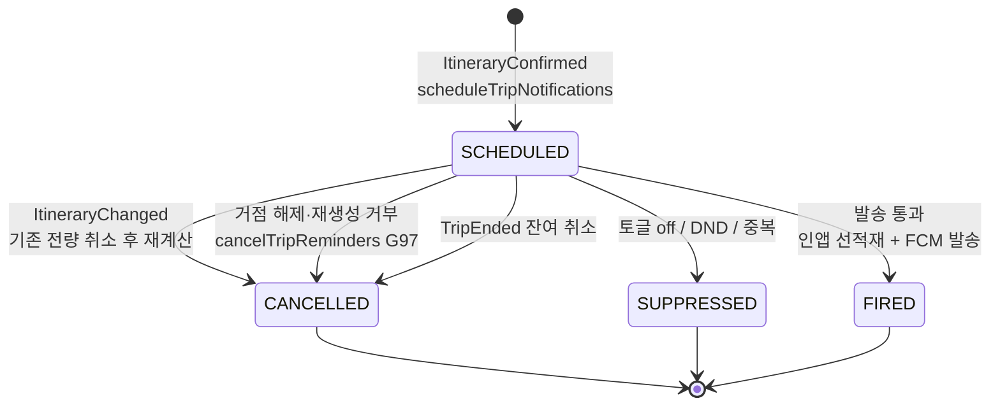
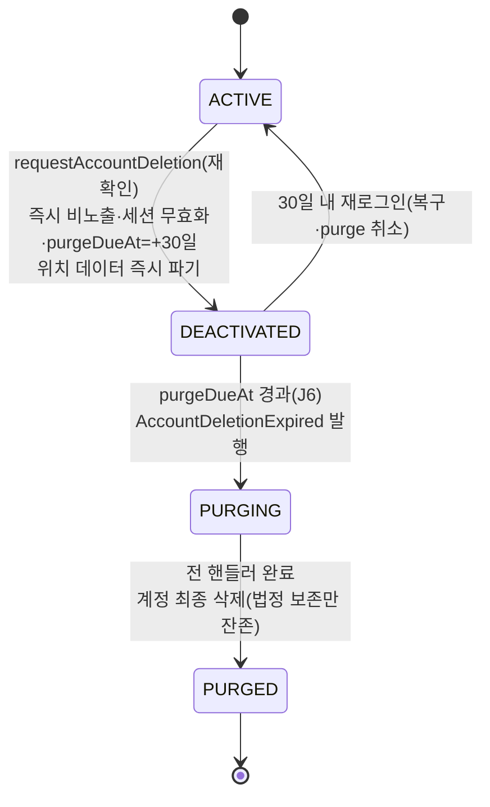
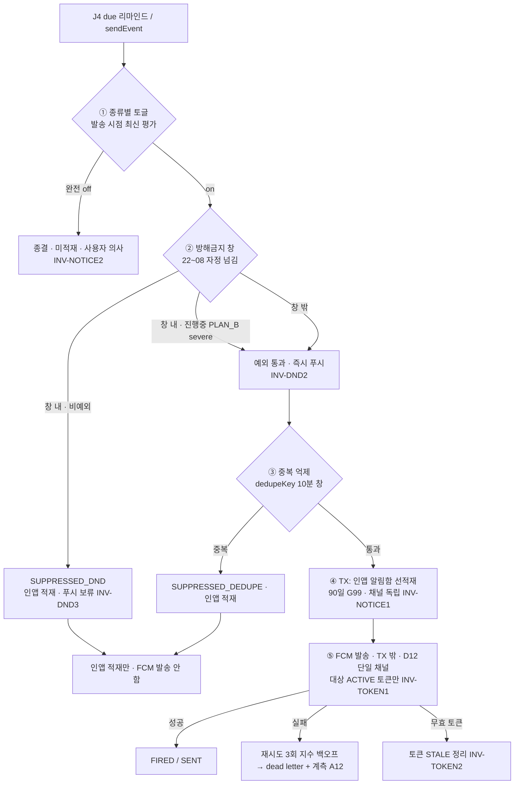

# 유닛 U8 상세 설계 — 알림·마이페이지·설정

> 출처: aidlc/aidlc-docs/construction/u8-notification/functional-design/(domain-entities·business-rules·business-logic-model·frontend-components).md · aidlc/aidlc-docs/construction/u8-notification/nfr-requirements/(nfr-requirements·tech-stack-decisions).md · aidlc/aidlc-docs/construction/u8-notification/nfr-design/nfr-design-patterns.md · aidlc/aidlc-docs/construction/u8-notification/infrastructure-design/infrastructure-design.md · aidlc/aidlc-docs/construction/plans/u8-notification-(functional-design·nfr-design)-plan.md · aidlc/aidlc-docs/inception/application-design/unit-of-work.md(§U8) · aidlc-docs에서 2026-07-05 추출 · 이후 본 문서가 정본이다.

이 문서는 1차 출시의 **마감 유닛 U8(알림·마이페이지·설정)** 하나만으로 그 설계를 완전히 이해할 수 있도록 재구성한 정본이다. 도메인 엔티티·비즈니스 규칙·처리 플로우·프런트엔드 컴포넌트·NFR·인프라를 빠짐없이 담는다. 크로스커팅 기준(전역 아키텍처·NFR·인프라 정본)은 [아키텍처](../architecture.md)·[도메인 모델](../domain.md)·[주요 흐름](../flows.md)·[핵심 결정/ADR](../decisions.md)·[NFR 기준](../nfr.md)·[인프라](../infrastructure.md)·[개발 순서](../units.md)·[용어집](../glossary.md)을 참조한다. 다른 유닛은 [U5 상세](./u5-itinerary.md)·[U7 상세](./u7-archive.md) 형태로 링크한다.

---

## 1. 개요

### 1.1 이 유닛의 성격 — "여행 생명주기를 알림·설정으로 닫는 마감 유닛"

U8은 1차 출시(U1~U8)의 **마지막 유닛**이다. 신규 도메인 로직(M14 알림 발송 파이프라인·인앱 알림함)은 일부이고, 본질은 **전 유닛이 발행한 이벤트를 사용자에게 닿게 하고(알림), 전 모듈의 관리 화면을 하나로 통합하며(마이페이지·설정), 계정 삭제 연쇄·법정 요건을 완결해 스토어 심사 가능한 완제품을 만드는 것**이다. 세 축이 핵심이다.

| 축 | 내용 | 핵심 결정 |
|---|---|---|
| 신뢰성·정확성 | 모든 알림을 **서버 스케줄링 단일 경로**로 발송하고(클라이언트 로컬 예약 없음), 일정 변경 시 발송 시각을 **전면 재계산**하며, 중복 발송을 억제 | D32, D25, G100 |
| 복원력 | 인앱 알림함이 발송 파이프라인의 **선(先)적재 단계**여서 FCM이 실패해도 사용자가 놓치지 않는다(침묵 실패 금지) | D12, ADR-0011 |
| 보안·개인정보 | 계정 삭제 연쇄로 전 모듈 데이터를 파기하되 **법정 보존 데이터는 분리 보관**, 데이터 내보내기·마케팅 동의·위치 3층 동의를 완전 통제 | D18, D34, N8 |

### 1.2 범위 — 에픽·스토리·모듈

- **소유 에픽/스토리**: Epic 9(US-E09-01 ~ US-E09-14) = 14개 스토리 + 홈 카드 최종 통합(US-E2-02 데이터 공급·통합 검증).
- **소유 서버 모듈**: **M14 Notification**(신규 도메인) — 알림 스케줄·알림함·토글·방해금지·FCM 토큰. 여기에 **M1·M2·M4·M6·M12·M13**의 설정·삭제 연쇄를 보완(퍼사드 소비·통합 수준).
- **클라이언트 features**: `features/notification`(인앱 알림함·딥링크 라우팅·푸시 프리프롬프트, 신규), `features/settings`(마이페이지·알림 설정·계정 관리·위치 3층·마케팅·취향·정책 재열람, 신규).

**포함**:
- M14 알림 — 서버 스케줄링 통일(D32), FCM 단일 채널(D12)·디바이스 토큰 관리, CP5 이벤트 구독, 발송 파이프라인(종류별 토글 → 방해금지 22~08시(진행 중 Plan-B 예외 G100) → 중복 억제 10분 창 → FCM+인앱 적재), 인앱 알림함(90일 보존·읽음 관리 G99).
- 마이페이지 — 숙소·예약 기록 관리(저장/등록 통합+출처 라벨 G103), 여행 목록 구분 조회(예정/진행/종료), 스타일 분석 확인, 지난 여행 기록 진입(U7 연결).
- 설정 — 취향 직접 설정·수정, 알림 채널·종류별 설정, 위치 동의 3층 관리 UI(G182), 개인정보·계정 관리(계정 삭제 30일 유예 전 모듈 연쇄 완결 D18/S6, 데이터 내보내기 JSON 즉시 다운로드 G101), 고객 지원·정책 문서 재열람(N5), 외부 OTA 제휴 고지(US-E09-12), 마케팅 수신 동의 관리(N8), 출발점 해제 시 리마인드 중단·재생성 배지(G97).
- 홈 카드 최종 통합 검증(U2 프레임 × U3~U7 데이터 전체).

**명시적 제외**:
- 마케팅 알림 **발송**(1차는 동의 관리만), 커뮤니티 알림 종류(U10 출시와 함께 활성화), 공동편집 알림(U11), 어시스턴트(U9), 사진 포함 전체 아카이브 내보내기(후속 G186 — 텍스트 JSON만).
- 알림 종류에서 '체크인 임박'·'예약 링크 리마인드' 제외(Δ10).

### 1.3 선행·후행 관계

U8은 **CP5(U3·U5·U6·U7 → U8)의 소비자**다. 4개 유닛이 발행하는 이벤트를 단일 구독·스케줄링(D32)하고, U1의 계정 삭제 만료 이벤트를 구독해 알림 데이터를 연쇄 파기한다.

| 구분 | 관계 | 내용 |
|---|---|---|
| 선행(입력) | U1 | 계정·세션·동의 증적·위치 동의 모델·법정 로그·SES·스케줄러·아웃박스·시크릿 프레임 정본. 계정 삭제 상태 모델·유예 배치 골격 |
| 선행(입력) | U2 | 5탭 셸·홈 대시보드 프레임·`HomeDashboardModel` 슬롯 스키마(재정의 금지) |
| 선행(CP5) | U3 | `StayRegistered`(숙소 등록 알림), 인기 장소(홈 슬롯) |
| 선행(CP5) | U4 | `StayLinkedToTrip`, 예정 여행 목록(홈 슬롯) |
| 선행(CP5) | U5 | `ItineraryConfirmed`(리마인드 생성)·`ItineraryChanged`(재계산) |
| 선행(CP5) | U6 | `TriggerFired`(Plan-B 알림), `shared/location` 위치 3층 상태 |
| 선행(CP5) | U7 | `ReflectionReady`(회고 완료 알림), `features/archive` 회고·스타일 상세 화면 재사용 |
| 후행 | 없음(1차 마감) | U8이 마감 유닛. 후속 게이트(U9 어시스턴트·U10 커뮤니티·U11 공동편집)는 CP5 알림 유형을 하위 호환 확장으로 추가 |

### 1.4 완료 기준(DoD) 요지

| 항목 | 기준 |
|---|---|
| 기능 | E9 14개 스토리 수용 기준 충족. 방해금지 억제 알림의 인앱 알림함 적재. 일정 변경 시 리마인드 재계산(D32) |
| 하드 제약(D37) | **계정 무결성** — 삭제 연쇄 완전성(30일 만료 후 여행·기록·회고 파기, 위치 데이터 즉시 파기, 법정 보존 로그만 잔존) 테스트 **100% 통과가 머지 차단**. 타 사용자 알림 미수신(토큰·대상 격리) |
| PBT | 발송 파이프라인 결정 함수(꺼진 종류 발송 0·창 내 비예외 발송 0·10분 창 중복 0·억제분 알림함 적재), 리마인드 재계산 멱등성, 삭제 연쇄 후 잔존=법정 보존 집합, 알림함 90일 보존 경계 |
| 확장 규칙 | SECURITY-08(설정·알림함 소유권), D18+N2(삭제·파기 — 개인정보보호법·위치정보법 정합), RESILIENCY-01 증빙. **1차 출시 전 전 유닛 컴플라이언스 누적 요약 산출** |
| 계약 포인트 | CP5 소비자 측 통합 테스트(각 이벤트 유형별 발송·억제·재계산 시나리오). E2E 종단 흐름(숙소 저장→등록→일정 생성→재계획→알림·기록)에 알림·삭제 경로 편입 |

### 1.5 선결 과제 — P9(스토어 심사)

U8은 비개발 선결 1건(**P9 앱스토어·플레이스토어 개발자 계정 및 심사 요건**)이 있으나, 본 설계 산출물은 어댑터 fake·플레이스홀더로 **비차단**이다.

- FCM 콘솔·푸시 인증서(APNs 인증 키·Firebase 프로젝트)는 P9와 병렬 발급 — `FcmPort` 어댑터를 fake로 개발·테스트 선행하고, 실키는 `external/fcm` 시크릿으로 주입.
- US-E09-13 고객 지원 연락처(이메일 문의)·정책 문서 재열람·오픈소스 라이선스(N5)는 스토어 심사·위치정보법 상시 열람 요건 — 설정 화면에 선결.
- 삭제(D18)·내보내기(S9) 경로는 스토어 심사의 데이터 삭제 요건을 충족한다.

관련 선결 문안: P7(약관 3종 실문안), P5(OTA 제휴 계약 문안)는 출시 전 확정 대상이다.

---

## 2. 도메인 엔티티

### 2.1 엔티티 지도와 소유 경계

M14가 **U8 소유 정본**(알림 스케줄·알림함·토글·방해금지·토큰)이다. 그 밖의 설정 데이터·계정 라이프사이클·마이페이지 집계는 각 모듈이 소유하고 U8이 관리 UI·연쇄 완결·조립을 담당한다.

| 그룹 | 엔티티 | 소유·관계 |
|---|---|---|
| M14 — U8 소유 정본 | NotificationSchedule | Account 1 : * (서버 스케줄 리마인드 — 일정 변경 전면 재계산 D32) |
| | Notice(인앱 알림함) | Account 1 : * (90일 보존·읽음 G99·채널 독립 적재) |
| | NotificationToggle | Account 1 : 1 (종류×채널 독립 토글 — 즉시 반영 D32) |
| | QuietHours(방해금지) | Account 1 : 1 (22~08·진행 중 Plan-B 예외 G100) |
| | PushToken | Account 1 : * (기기별 FCM 토큰 — 다기기·무효 정리 D12) |
| 설정 데이터 — M1/M2 소유·U8 관리 UI | MarketingConsent | 마케팅 수신 동의(수집 U1·철회 U8·1차 미발송 N8) |
| | LocationConsentState | 위치 3층(OS×법정×GPS 옵트인·모델 U1·관리 U8 D34/G182) |
| | AffiliateNoticePref | OTA 제휴 고지 다시 보기 토글(US-E09-12) |
| 계정 라이프사이클 — M1.application 소유·U8 완결 | AccountDeletionCascade | 소프트 삭제·30일 유예·연쇄 목록·법정 보존 분리(D18/S6) |
| | DataExportRequest | 데이터 내보내기(JSON 즉시·사진 제외·부분 마커 G101/S9) |
| 읽기 전용 집계 — 각 모듈 퍼사드(BFF) | MyPageView | 숙소 통합 목록 G103·여행 구분 조회·스타일 요약 카드(저장 안 함) |

표기 규약: `필수`=NULL 불가, `선택`=NULL 허용, `유니크`=제약 범위 내 유일, `불변`=생성 후 변경 불가, `추가전용`=append-only, `파생`=저장 안 함(조회 시점 계산).

### 2.2 알림 종류 정본(NoticeType — C12/Δ10, PRD 12-5)

발송·토글·알림함의 종류 축은 아래 목록이 **정본**이다. 여기 없는 종류는 발송·적재되지 않는다.

| NoticeType | 채널 기본 | 발행 원천(CP5) | 방해금지 예외 |
|---|---|---|---|
| STAY_REGISTERED | 푸시+인앱 | U3 `StayRegistered` / U4 `StayLinkedToTrip` | 아니오 |
| TRIP_REMINDER_D1 | 푸시+인앱 | U5 `ItineraryConfirmed`(D-1 스케줄) | 아니오 |
| TRIP_REMINDER_DAY | 푸시+인앱 | 당일 요약(기본 08:00·설정 가능) | 아니오 |
| TRIP_REMINDER_SLOT | 푸시+인앱 | 개별 일정 N분 전(0/15/30/60·기본 30) | 아니오 |
| PLAN_B | 푸시+인앱 | U6 `TriggerFired`(severe만 푸시) | **예(진행 중 여행·severe만)** |
| REFLECTION_READY | 푸시+인앱 | U7 `ReflectionReady` | 아니오 |
| SYSTEM_SECURITY | 인앱 강제 | M1 보안·계정(시스템) | — (전 채널 OFF에도 인앱 표시) |
| (예약) COMMUNITY_SOCIAL | — | (후속) U10 좋아요·댓글 | 미노출 |
| (예약) COEDIT_INVITE | — | (후속) U11 초대·권한·종료(G95/C8) | 미노출 |

> **제외(Δ10/C12)**: '체크인 임박'·'예약 링크 리마인드'는 종류 목록에서 제외한다(후속 검토).

### 2.3 NotificationSchedule — 서버 스케줄 리마인드 (M14, D32 정본)

여행 확정 시 일괄 생성되는 **서버 스케줄링 리마인드**(D-1·당일 요약·개별 일정 N분 전). 모든 리마인드는 서버 스케줄링으로만 존재하며(D32 — 클라이언트 로컬 스케줄 없음), 일정 변경 시 발송 시각을 **전면 재계산**한다. 발송 시점(fireAt)에 J4 배치가 발송 파이프라인을 태운다.

| 속성 | 타입 | 제약 | 의미·근거 |
|---|---|---|---|
| scheduleId | 식별자 | 필수 · 유니크 | — |
| targetAccountId | 식별자(Account 참조) | 필수 | 발송 대상 계정 |
| tripId | 식별자(Trip 참조) | 필수 | 귀속 여행(리마인드 스케줄 단위) |
| slotRef | 식별자(Slot 참조) | 선택 | 개별 일정 리마인드의 대상 슬롯. NULL=여행 단위(D-1·당일 요약) [D32] |
| type | 열거<NoticeType 리마인드계열> | 필수 | TRIP_REMINDER_D1 / _DAY / _SLOT [Δ10] |
| fireAt | 시각 | 필수 | 발송 예정 시각(서버 산출·재계산 대상) [D32] |
| dedupeKey | 문자열 | 필수 | 멱등 키 `tripId+slotRef+type`(중복 스케줄·중복 발송 방지) [S5, INV-SCHED2] |
| payload | 구조체 {title, body, deeplink, distanceText?} | 필수 | 알림 본문(장소명·시작 시각·**이동 거리만**·소요시간 없음 D25)+딥링크(탭 스택 푸시 G7) |
| status | 열거 {SCHEDULED, FIRED, SUPPRESSED, CANCELLED} | 필수 · 기본 SCHEDULED | 수명(2.3.2) |
| suppressReason | 열거 {TOGGLE_OFF, DND, DEDUPE} | 선택 | SUPPRESSED 사유. NULL=억제 아님 [G100] |

**파생값**: `distanceText`(직전 지점=등록 숙소 또는 직전 일정 → 대상 장소 이동 거리, 추정 표기·소요시간 없음 D25), `isDue`(fireAt ≤ now ∧ status=SCHEDULED — J4 발송 큐 진입 판정).

#### 2.3.1 상태 전이

`ItineraryChanged` 수신 시 기존 SCHEDULED 전량 CANCELLED 후 새 SCHEDULED로 재계산(멱등 키 유지). fireAt 도달(J4) 시 발송 파이프라인이 SUPPRESSED(TOGGLE_OFF/DND/DEDUPE) 또는 FIRED로 종료한다.

#### 2.3.2 불변식(Invariants)

| ID | 불변식 | 근거 |
|---|---|---|
| INV-SCHED1 | **서버 스케줄 통일** — 모든 리마인드는 서버 NotificationSchedule로만 존재하고 클라이언트 로컬 스케줄은 없다(발송 시각 산출·재계산은 서버 단일 정본) | D32, FD-U8-01 |
| INV-SCHED2 | **변경 시 전면 재계산·멱등** — `ItineraryChanged` 수신 시 해당 tripId의 SCHEDULED를 전량 무효화 후 재계산. 동일 (tripId, 일정 상태)에 결정적이고, 중복 수신에도 dedupeKey로 스케줄 중복 생성 0 | D32, S5, U8-P1 |
| INV-SCHED3 | **거점 해제·재생성 거부 시 중단** — 출발점 숙소 해제 후 재생성 거부 시 기존 일정은 유지하되 리마인드 발송을 중단(CANCELLED)하고 재생성 유도 배지 신호를 낸다 | G97, US-E09-02·06 |
| INV-SCHED4 | **본문 소요시간 부재** — payload는 장소명·시작 시각·이동 거리만 담고 소요시간 필드가 없다 | D25, US-E09-02 |
| INV-SCHED5 | **숙소 미등록 유도 1회** — 등록 숙소가 없어 일정이 없으면 개별 리마인드 대신 "숙소를 등록하면 일정 알림을 받을 수 있습니다" 유도를 1회만 스케줄(반복 없음) | US-E09-02 예외 |

### 2.4 Notice — 인앱 알림함 (M14, 90일 보존 G99)

발송 파이프라인을 통과·억제한 알림의 **인앱 알림함 레코드**. 90일 보존·읽음 관리하며, **채널 토글에 독립적으로 적재**(푸시 OFF여도 적재 지속, 역도 동일)한다. 방해금지·중복으로 푸시가 억제된 알림도 인앱 알림함에는 적재된다(침묵 실패 금지).

| 속성 | 타입 | 제약 | 의미·근거 |
|---|---|---|---|
| noticeId | 식별자 | 필수 · 유니크 | — |
| accountId | 식별자(Account 참조) | 필수 | 소유 계정(소유권 격리 SECURITY-08) |
| type | 열거<NoticeType> | 필수 | 알림 종류(정본 C12/Δ10) |
| body | 구조체 {title, text, distanceText?} | 필수 | 알림 본문(소요시간 없음 D25) |
| deeplink | 구조체 {targetTab, stackPush} | 필수 | 딥링크 대상(탭 활성화+스택 푸시 G7) |
| createdAt | 시각 | 필수 · 불변 | 적재 시각(정렬·만료 기준) |
| readAt | 시각 | 선택 | 읽음 시각. NULL=미읽음(미읽음 배지 카운트 대상) [G99] |
| expiresAt | 시각 | 필수 · 파생 | createdAt + 90일(J9 정리 배치 대상) [G99] |
| deliverySource | 열거 {FIRED, SUPPRESSED_DND, SUPPRESSED_DEDUPE} | 필수 | 적재 경로(억제분 구분·배지 처리) [S5] |

**파생값**: `unreadBadgeCount`(readAt=NULL ∧ expiresAt>now 인 Notice 수 — 홈 상단 미읽음 배지·U2 topBar 슬롯), `isExpired`(expiresAt ≤ now — 90일 만료 정리 판정).

#### 2.4.1 불변식

| ID | 불변식 | 근거 |
|---|---|---|
| INV-NOTICE1 | **채널 독립 적재** — 인앱 적재는 푸시 채널 토글·방해금지·중복 억제와 독립. 푸시 OFF·방해금지·중복 억제 상황에도 종류 토글이 완전 off가 아니면 인앱 적재 유지(억제=푸시 보류이지 적재 보류 아님) | D32, G100, U8-P2 |
| INV-NOTICE2 | **종류 off 시 미적재** — 종류 자체가 off(사용자 의사)면 인앱 적재도 없다(채널 토글과 구분되는 종류 수준 억제, 파이프라인 1단계 종결) | S5 |
| INV-NOTICE3 | **90일 보존 경계** — Notice는 createdAt+90일에 만료되며 J9 정리가 만료분을 제거. 보존 경계는 정확히 90일·조기 삭제 없음 | G99, U8-P6 |
| INV-NOTICE4 | **시스템 알림 강제 표시** — SYSTEM_SECURITY는 전 채널 OFF에도 인앱 Notice로 적재·표시(사용자 토글이 억제 못 함) | PRD 12-5 예외 |
| INV-NOTICE5 | **소유권 격리** — Notice는 accountId 소유자만 조회·읽음 처리 가능(타 계정 알림 미수신·미조회) | SECURITY-08 |

### 2.5 NotificationToggle — 종류×채널 토글 (M14, 즉시 반영 D32)

계정별 **알림 종류×채널(푸시/인앱) 독립 토글** 설정. 별도 저장 버튼 없이 즉시 저장되어 다음 알림부터 반영된다. 리마인드 오프셋(개별 일정 N분 전·당일 요약 시각)도 함께 보관한다.

| 속성 | 타입 | 제약 | 의미·근거 |
|---|---|---|---|
| accountId | 식별자(Account 참조) | 필수 · 유니크 | 소유 계정 |
| perType | 맵<NoticeType, {push:bool, inApp:bool}> | 필수 | 종류별 푸시·인앱 독립 토글(기본 전 종류 on) |
| reminderSlotOffsetMin | 열거 {0, 15, 30, 60} | 필수 · 기본 30 | 개별 일정 리마인드 오프셋 |
| dayReminderTime | 시각(로컬) | 필수 · 기본 08:00 | 당일 일정 요약 발송 시각(설정 가능) |
| pbSensitivity | 열거 {LESS, NORMAL, MORE} | 필수 · 기본 NORMAL | Plan-B 자동 트리거 민감도(M9 위임 — U8은 설정 저장) |
| updatedAt | 시각 | 필수 | 최종 변경 시각(즉시 반영 확인) |

#### 2.5.1 불변식

| ID | 불변식 | 근거 |
|---|---|---|
| INV-TOGGLE1 | **즉시 반영** — perType·오프셋·방해금지 변경은 별도 저장 없이 즉시 저장되고 다음 발송부터 반영. 변경 이전 스케줄된 발송에는 발송 시점의 최신 토글이 적용된다(발송 시점 평가) | PRD 12-5, U8-P4 |
| INV-TOGGLE2 | **종류×채널 독립** — 종류의 푸시 off가 인앱 off를 강제하지 않고(역도 동일). 한 종류 푸시 off + 인앱 on 조합이 유효 | PRD 12-5, US-E09-05 |
| INV-TOGGLE3 | **종류 목록 정본** — perType 키는 PRD 12 정본만 포함하고 '체크인 임박'·'예약 링크 리마인드'는 없다. 커뮤니티·공동편집 종류는 U10·U11 출시 시 하위 호환 추가 | Δ10, C12 |
| INV-TOGGLE4 | **OS 권한 종속 표시** — OS 푸시 권한 거부면 푸시 토글은 비활성 표시(설정 이동 안내)되나 인앱 토글은 독립 동작. OS 권한은 발송 게이트가 아니라 표시 상태 | PRD 12-5, US-E09-05 |

### 2.6 QuietHours(DndSetting) — 방해금지 창 (M14, G100)

계정별 **방해금지 시간 창**. 기본 22~08시이며 이 구간의 푸시를 억제한다. **예외: 여행 '진행 중'의 Plan-B(severe) 알림만 창을 통과**한다. 억제된 알림은 인앱 알림함에 적재된다(INV-NOTICE1).

| 속성 | 타입 | 제약 | 의미·근거 |
|---|---|---|---|
| accountId | 식별자(Account 참조) | 필수 · 유니크 | 소유 계정 |
| window | 구조체 {startLocal, endLocal} | 필수 · 기본 {22:00, 08:00} | 방해금지 창(로컬 시각·자정 넘김 허용) |
| enabled | 불리언 | 필수 · 기본 true | 방해금지 사용 여부 |

**파생값**: `isWithinWindow(at)`(발송 판정 시각이 창 내인지 — 자정 넘김 정확 판정), `isDndException(noticeType, tripState, severity)`(PLAN_B ∧ 진행 중 여행 ∧ severe면 true — 창 내여도 통과).

#### 2.6.1 불변식

| ID | 불변식 | 근거 |
|---|---|---|
| INV-DND1 | **창 판정 결정성·경계** — isWithinWindow(at)은 동일 (window, at)에 결정적이고 자정 넘김(22~08) 경계를 정확히 판정(경계값·자정 경계 오분류 없음) | G100, U8-P3 |
| INV-DND2 | **진행 중 Plan-B severe 예외만** — 창을 통과하는 예외는 **여행 진행 중 ∧ PLAN_B ∧ severe** 단 하나. 경미(minor) Plan-B·비진행 여행·기타 종류는 창 내에서 전부 억제 | G100, US-E09-03, U8-P3 |
| INV-DND3 | **억제 ≠ 소실** — 방해금지로 억제된 알림은 인앱 알림함에 적재되어 관측 가능(푸시만 보류). 침묵 실패 금지 | G100, ADR-0011, INV-NOTICE1 |

### 2.7 PushToken — FCM 디바이스 토큰 (M14, D12)

계정별·기기별 **FCM 디바이스 토큰**. FCM 단일 채널(iOS 포함, D12)의 발송 대상이며 다기기를 허용하고 무효 토큰은 정리한다.

| 속성 | 타입 | 제약 | 의미·근거 |
|---|---|---|---|
| tokenId | 식별자 | 필수 · 유니크 | — |
| accountId | 식별자(Account 참조) | 필수 | 소유 계정(대상 격리) [SECURITY-08] |
| deviceId | 문자열 | 필수 · 유니크(계정 내) | 기기 식별(다기기 허용·기기별 1토큰) [D36] |
| fcmToken | 문자열 | 필수 | FCM 토큰(갱신 대상) [D12] |
| state | 열거 {ACTIVE, STALE, REVOKED} | 필수 · 기본 ACTIVE | 토큰 생애(무효 응답 시 STALE·로그아웃 시 REVOKED) |
| updatedAt | 시각 | 필수 | 최종 갱신 시각 |

**불변식**: INV-TOKEN1(**대상 격리** — FCM 발송은 대상 계정의 ACTIVE 토큰에만 향한다·타 계정 발송 0), INV-TOKEN2(**무효 토큰 정리** — FCM 무효 응답 시 STALE로 표시·정리·재발송 안 함, 로그아웃 시 REVOKED).

### 2.8 MarketingConsent — 마케팅 수신 동의 (M1/M2 소유·U8 관리, N8)

**마케팅 수신 동의** 상태. 온보딩에서 수집(선택 항목·U1)하고 설정에서 부여·철회·즉시 저장한다. **1차 출시에서 마케팅 알림 발송은 없다**(발송 기능 후속) — 본 엔티티는 동의 상태의 수집·관리만 다룬다.

| 속성 | 타입 | 제약 | 의미·근거 |
|---|---|---|---|
| accountId | 식별자(Account 참조) | 필수 · 유니크 | 소유 계정 |
| granted | 불리언 | 필수 · 기본 false(온보딩 선택) | 마케팅 수신 동의 여부 [N8] |
| consentEvidenceRef | 식별자(동의 증적 참조) | 필수 | 동의·철회 증적(버전·시각 — U1 동의 증적 테이블) [N2 정합] |
| updatedAt | 시각 | 필수 | 최종 변경 시각(즉시 저장) |

**불변식**: INV-MKT1(**수집·관리만·1차 미발송** — 동의 상태 수집·표시·철회만 지원, 1차에 마케팅 알림 미발송·파이프라인 마케팅 종류 미포함), INV-MKT2(**철회 즉시 반영·증적** — 철회는 즉시 저장·동의 증적에 버전·시각 기록).

### 2.9 LocationConsentState — 위치 3층 동의 (U1 모델·U8 관리, D34/G182)

**위치 동의 3층 상태**의 U8 관리 뷰. 세 층(OS 권한 × 앱 내 위치기반서비스 법정 동의 × GPS 여행 기록 옵트인)을 설정에서 구분 표시·제어하고, 철회 직전 영향 기능을 고지한다. **데이터 모델은 U1 소유**(법정 로그 append-only 포함), U8은 관리 UI·철회 영향 고지·재확인·파기 연동을 소유한다.

| 속성(관리 뷰) | 타입 | 제약 | 의미·근거 |
|---|---|---|---|
| accountId | 식별자(Account 참조) | 필수 · 유니크 | 소유 계정 |
| osPermission | 열거 {GRANTED, DENIED, UNDETERMINED} | 필수 | OS 위치 권한(1층 — 앱 토글의 상위 게이트) [G182] |
| legalConsent | 불리언 | 필수 | 앱 내 위치기반서비스 법정 동의(2층·별도 필수 동의 N2) |
| gpsRecordOptIn | 불리언 | 필수 · 기본 false | GPS 여행 기록 옵트인(3층·별도 옵트인 N2) |
| consentLogRef | 식별자(위치 법정 로그 참조) | 필수 | 위치정보 수집·이용 법정 로그(append-only·앱 삭제 권한 없음 N2) [SECURITY-14] |

#### 2.9.1 위치 3층 조합 동작 매트릭스 (G182 명문화)

| OS 권한 | 법정 동의 | GPS 옵트인 | 이동 지연 트리거 | 실시간 Plan-B(위치) | 현위치 추천 | 예정 일정 알림·날씨·휴무 | GPS 발자취 기록 |
|---|---|---|---|---|---|---|---|
| GRANTED | true | true | O | O | O | O(위치 비의존) | O |
| GRANTED | true | false | O | O | O | O | X(옵트인 없음) |
| GRANTED | false | (n/a) | X | X | X | O | X |
| DENIED | (any) | (any) | X | X | X | O | X |
| UNDETERMINED | (any) | (any) | X(프리프롬프트) | X | X | O | X |

> 판독: **위치 의존 기능**(이동 지연·실시간 Plan-B·현위치 추천·GPS 발자취)은 세 층 충족 시에만 동작하고, **위치 비의존 기능**(예정 일정 알림·날씨·휴무 트리거)은 철회·거부 어느 조합에서도 계속 동작한다(전 조합 폴백 존재).

#### 2.9.2 불변식

| ID | 불변식 | 근거 |
|---|---|---|
| INV-LOC1 | **3층 게이트·위치 비의존 유지** — 위치 의존 기능은 세 층 전부 충족 시에만 활성. 어느 한 층 철회·거부 시에도 위치 비의존 기능은 계속 동작(철회가 앱 전체를 무력화하지 않음) | D34, G182, U8-P7 |
| INV-LOC2 | **철회 영향 고지·재확인** — GPS 옵트인·법정 동의 철회 직전 영향 기능(이동 지연 알림 중단·위치 기반 재계획 제한·현위치 추천 비활성)을 구체 고지하고 재확인(침묵 철회 없음) | D34, US-E09-11 |
| INV-LOC3 | **GPS 철회·탈퇴 즉시 파기** — GPS 옵트인 철회·계정 탈퇴 시 위치 데이터 즉시 파기(U7 `purgeLocationData` 연동·30일 유예 없음). 위치 법정 로그(append-only)는 분리 보관 유지 | D34/N2, U7 INV-GPS2 |
| INV-LOC4 | **OS 권한 상위 게이트** — OS 권한 거부면 앱 내 위치 토글은 비활성 표시(설정 이동 안내)·하위 층 동작 불가 | G182, US-E09-11 예외 |

### 2.10 AffiliateNoticePref — OTA 제휴 고지 설정 (U8, US-E09-12)

외부 OTA 링크 이동 전 **제휴(수익) 링크 고지**의 표시 여부 설정. 한 번 확인하면 다시 보지 않도록 설정할 수 있고, 설정에서 언제든 다시 켤 수 있다.

| 속성 | 타입 | 제약 | 의미·근거 |
|---|---|---|---|
| accountId | 식별자(Account 참조) | 필수 · 유니크 | 소유 계정 |
| showAffiliateNotice | 불리언 | 필수 · 기본 true | 외부 링크 이동 전 제휴 고지 표시 여부 |
| updatedAt | 시각 | 필수 | 최종 변경 시각 |

**불변식**: INV-AFF1(**고지 기본 표시·재활성 가능** — 기본 표시이며 '다시 보지 않기' 확인 후 숨김 가능하되 설정에서 언제든 재활성. 고지 정본 문안=외부 이동·제휴 수수료·추가 비용 없음은 표시 조건과 무관하게 고정).

### 2.11 AccountDeletionCascade — 계정 삭제 연쇄 (M1.application 소유·U8 완결, S6/D18)

**소프트 삭제 + 30일 유예** 계정 삭제의 연쇄 상태. 요청 즉시 전 표면 비노출·세션 무효화, 위치 데이터 즉시 파기, 30일 후 만료 배치가 `AccountDeletionExpired`를 발행해 **각 모듈이 자기 데이터를 파기**한다. **법정 보존 데이터만 분리 보관**한다.

| 속성 | 타입 | 제약 | 의미·근거 |
|---|---|---|---|
| accountId | 식별자(Account 참조) | 필수 · 유니크 | 삭제 대상 계정 |
| state | 열거 {ACTIVE, DEACTIVATED, PURGING, PURGED} | 필수 · 기본 ACTIVE | 삭제 생애(2.11.2) [D18] |
| purgeDueAt | 시각 | 선택 | 완전 삭제 예정(요청 +30일). NULL=삭제 미요청 |
| cascadeTargets | 목록<모듈 파기 대상> | 필수 · 파생 | 연쇄 파기 대상 목록(2.11.1) [S6] |
| legalRetentionSet | 목록<보존 대상> | 필수 · 불변 | 법정 보존 집합(동의 증적·위치 로그·감사 로그 — 분리 보관·앱 삭제 권한 없음) [SECURITY-14] |
| requestedAt | 시각 | 선택 · 불변 | 삭제 요청 시각(재확인 완료 시점) |

#### 2.11.1 연쇄 파기 대상 목록 (cascadeTargets — S6.5)

| 모듈 | 파기 대상 | 파기 시점 |
|---|---|---|
| M4 Saved Accommodation | 등록 숙소·위시리스트 | 만료 배치(AccountDeletionExpired) |
| M6 Trip Creation | 여행·필수 방문지 | 만료 배치 |
| M8 Itinerary | 일정(plan/current)·슬롯 | 만료 배치 |
| M12 Travel Archive | 방문 기록·changelog·사진(오브젝트 스토리지 객체 포함) | 만료 배치 |
| M13 AI Reflection | 회고·요약·스타일 분석 | 만료 배치 |
| M14 Notification | 알림함·스케줄·FCM 토큰 | 만료 배치 |
| M2 User Profile | 프로필·취향 | 만료 배치 |
| **위치 데이터(GPS)** | GPS 폴리라인·위치 파생 | **요청 즉시(유예 없음 D34)** |
| (후속) M15 Community | 공개 콘텐츠 → '삭제된 사용자' 익명화 | 만료 배치 |

**법정 보존(분리 보관·파기 제외)**: 동의 증적·위치정보 수집·이용 법정 로그·감사 로그.

#### 2.11.2 삭제 상태 전이

모듈별 파기는 독립 TX·멱등·부분 진행 허용이며, 전 핸들러 완료 확인 후에만 PURGED로 전이한다.

#### 2.11.3 불변식

| ID | 불변식 | 근거 |
|---|---|---|
| INV-DEL1 | **소프트 삭제·30일 유예·복구** — 요청은 즉시 전 표면 비노출·세션 무효화·purgeDueAt(+30일) 기록. 30일 내 재로그인으로 복구 가능. 유예 중 동일 식별자 재가입 제한(C4) | D18, C4, S6.1·3 |
| INV-DEL2 | **연쇄 완전성·법정 보존 분리(하드 계열)** — 만료 배치 후 잔존 데이터는 **법정 보존 집합과 정확히 일치**. cascadeTargets 전 모듈 데이터가 파기되고 법정 보존(동의 증적·위치 로그·감사 로그)만 남는다 | D18, S6.5, U8-P5 |
| INV-DEL3 | **모듈별 멱등·독립 TX** — 각 핸들러는 이미 삭제된 리소스 skip(멱등)·독립 TX로 부분 진행 허용(`PURGING`이 진행 정본)·at-least-once 재시도. 전 핸들러 완료 확인 후에만 PURGED | S6.5, FD-U8-06, U8-P5 |
| INV-DEL4 | **위치 데이터 즉시 파기** — 위치 데이터(GPS 폴리라인·위치 파생)는 삭제 요청 즉시 파기(30일 유예 없음). 위치 법정 로그만 분리 보관 | D34/N2, S6.2, INV-LOC3 |
| INV-DEL5 | **삭제 재확인·사전 고지** — 등록 숙소·여행 기록·회고 등 삭제 대상을 사전 고지·재확인 후에만 진입 | D18, US-E09-09 |

### 2.12 DataExportRequest — 데이터 내보내기 (S9, G101)

**텍스트 데이터 JSON 즉시 다운로드**. 읽기 전용 수집(각 모듈 퍼사드)·**사진 파일 제외**(메타만)·동기 스트리밍. 특정 모듈 수집 실패 시 해당 섹션 오류 마커 포함(침묵 누락 금지).

| 속성 | 타입 | 제약 | 의미·근거 |
|---|---|---|---|
| exportId | 식별자 | 필수 · 유니크 | — |
| accountId | 식별자(Account 참조) | 필수 | 요청 계정(본인 재인증 필수) [S9] |
| sections | 목록<{module, status: OK\|ERROR}> | 필수 | 수집 섹션별 결과(부분 실패 마커) [G101] |
| requestedAt | 시각 | 필수 · 불변 | 요청 시각(rate-limit 시간당 1회·감사 로그) [SECURITY-03] |

**포함 섹션(읽기 전용)**: M2 프로필·취향, M6 여행·필수 방문지, M8 일정(plan/current), M12 방문 기록·메모·changelog(사진 파일 제외·메타만), M13 회고, M14 알림 설정.

**불변식**: INV-EXPORT1(**완전성·부분 마커** — 포함 섹션 전부 수집, 특정 모듈 실패 시 해당 섹션 오류 마커 포함·부분 성공을 완전본으로 위장 금지), INV-EXPORT2(**사진 제외·즉시 다운로드** — 사진 파일 제외·메타만·JSON 즉시 다운로드·비동기 잡 없음. 사진 포함 전체 아카이브는 후속 G186), INV-EXPORT3(**민감 작업 방어** — rate-limit 계정당 시간당 1회 + 본인 재인증 + 감사 로그, SECURITY-03).

### 2.13 MyPageView — 마이페이지 읽기 전용 집계 (BFF, G103)

마이페이지의 **읽기 전용 집계**(저장 안 함). 숙소 통합 목록(G103)·여행 구분 조회(예정/진행/종료)·스타일 요약 카드를 각 모듈 퍼사드로 조립한다. **소유는 각 모듈**(M4·M6·M13), U8은 조립·표시·출발점 전환 위임만 소유한다.

| 슬롯 | 데이터 출처(퍼사드) | 페이로드 개요 | 빈 상태 규칙 | 근거 |
|---|---|---|---|---|
| stayList | M4 `listMyStays` | 저장/등록 통합 목록+출처 라벨(외부 OTA 예약 등록/앱 내 저장)·숙소명·위치·체크인/아웃·연결 여행·저장 항목 '등록하기' 액션 | 0건이면 "숙소를 탐색하고 등록하면…"+탐색 진입 | G103, D15 |
| tripList | M6 `listTrips` | 여행 예정/진행 중/종료 구분(D19 전이·D21로 진행 중 최대 1개)·목적지·기간·등록 숙소 수·일정 수·회고 진입 | 지난 여행 0건이면 "아직 종료된 여행이 없습니다"·회고 진입 숨김 | D19, D21, US-E09-07 |
| styleSummaryCard | M13 `getStyleSummaryCard` | 대표 디스크립터 한 줄+선호 카테고리 칩+특성 dot 게이지·분석 여행 수·마지막 갱신 | 누적 방문 <10곳이면 "방문 장소가 10곳 이상 쌓이면…(현재 N곳)" 안내 | US-E09-08, G76 |

**불변식**: INV-MYPAGE1(**읽기 전용 집계** — 도메인 상태 생성·변경 없음·조립·표시만), INV-MYPAGE2(**출발점 전환 위임** — 숙소 '일정 출발점으로 등록/해제' 전환은 M4 퍼사드 위임·재생성 여부 확인·거부 시 리마인드 중단+재생성 배지 G97), INV-MYPAGE3(**스타일 게이트 승계** — 10곳 게이트는 U7/M13 정본 승계·재정의 없음), INV-MYPAGE4(**진행 중 여행 단수** — tripList의 '진행 중'은 D21로 항상 최대 1개).

### 2.14 CP5 소비 참조 계약 (U3·U5·U6·U7 → U8 입력)

U8은 4개 유닛이 CP5로 발행하는 이벤트를 **단일 구독·스케줄링(D32)**한다(스키마 정본은 발행 유닛, 본 유닛 재정의 금지). 공통 envelope는 `common/core`(U1 계약) 위에서 동작하며, 미지 유형은 무시가 아닌 **계측 대상**으로 처리한다(침묵 실패 금지).

| 입력 이벤트(발행 유닛) | U8 소비 용도 | 소비 시 처리 |
|---|---|---|
| `StayRegistered`(U3) / `StayLinkedToTrip`(U4) | 숙소 등록/저장 완료 알림 | `sendEvent` — 숙소명·위치·체크인/아웃+출발점 문구(날짜 없으면 "날짜 입력" 안내) |
| `ItineraryConfirmed`(U5) | 리마인드 세트 일괄 스케줄 | `scheduleTripNotifications` — D-1·당일 08시·개별 N분 전(INV-SCHED1) |
| `ItineraryChanged`(U5) | 리마인드 전면 재계산 | `rescheduleOnItineraryChange` — 전량 무효화 후 재계산(멱등 dedupeKey INV-SCHED2) |
| `TriggerFired`(U6) | Plan-B 재계획 알림 | `sendEvent` — severe만 푸시·10분 중복 억제·진행 중 방해금지 예외(INV-DND2)·위치 철회 시 위치 비의존만 |
| `ReflectionReady`(U7) | 회고 완료 알림 | `sendEvent` — "여행 기록이 정리되었습니다"·회고 진입(데이터 없으면 "회고 생성 못 함" 안내) |
| `AccountDeletionExpired`(U1) | 알림 데이터 연쇄 파기 | M14 파기 핸들러 — 알림함·스케줄·FCM 토큰 삭제(멱등 INV-DEL3) |

**CP5 통합 테스트 시나리오**: (1) 유형별 파이프라인 전수 — 5계열 이벤트 각각에 종류별 토글→방해금지(22~08)→중복 억제(10분 창)→FCM+인앱 적재의 전 단계를 통과·차단 조합으로 검증(꺼진 종류 발송 0·억제분 알림함 적재). (2) 리마인드 재계산 멱등성 — `ItineraryChanged` 중복 수신에도 스케줄 중복 생성 0(dedupeKey 멱등). (3) 방해금지 예외 분기 — 창 내 `TriggerFired`(severe·진행 중 여행)만 즉시 발송, 경미·비진행 여행은 억제 후 인앱 적재. **계약 변경 통제**: envelope는 `common/core`(U1) 소유 — 변경은 발행 4유닛 회귀 유발. 유형 추가(U10·U11)는 하위 호환 확장(FD-U8-13).

### 2.15 홈 카드 최종 통합 검증 (U2 슬롯 × U3~U7 데이터)

U8은 마감 유닛으로서 U2가 고정한 `HomeDashboardModel` 슬롯 스키마(재정의 금지)에 전 유닛 데이터가 부분 응답·침묵 실패 금지 원칙대로 전량 채워짐을 통합 검증한다(신규 슬롯 없음).

| U2 슬롯 | 데이터 공급 유닛 | U8 최종 통합 검증 요점 |
|---|---|---|
| activeTripCard | U6 `M18.getActiveHub`·`getTripProgress` | 진행 중 여행 카드·진행률(여행 중만)·execution 허브 진입 |
| upcomingTripCard | U4 `M6.listTrips` | 예정 여행·D-day·0건 emptyState |
| trendingPlaces | U3 `M7.getTrendingPlaces` | 인기 장소·조회 실패 시 슬롯 생략(부분 응답) |
| memoryCard | U7 `M12.getVisitStats` | 추억 진입·기록 0건 미노출 |
| preferencePromptCard | U1 `M2.getPendingPreferencePrompts` | 점진 취향 카드 |
| **topBar** | U1 세션 + **U8 `M14.getInbox`** | **워드마크 + 미읽음 배지 카운트(U8 공급분)** |
| communityRecordCard | (U10 후속) | 미노출 게이트 유지(INV-HD4 승계) |

> **경계(FD-U8-12)**: 슬롯 스키마·부분 응답·미노출 규칙은 **U2 소유**(u2 §4.1 INV-HD1~5 재정의 금지). U8은 미읽음 배지 데이터 공급 + 전 슬롯 채움 통합 검증만 담당.

### 2.16 엔티티-스토리-결정 추적

| 엔티티 | 주 근거 스토리 | 주 결정 |
|---|---|---|
| NotificationSchedule | US-E09-01·02·04 | D32, D25, G97 |
| Notice(알림함) | US-E09-05, US-E2-02 | D32, G99, G100 |
| NotificationToggle | US-E09-05 | D32, Δ10/C12 |
| QuietHours(DndSetting) | US-E09-02·03 | G100 |
| PushToken | US-E09-05 | D12, D36 |
| MarketingConsent | US-E09-14 | N8 |
| LocationConsentState | US-E09-11 | D34/N2, G182 |
| AffiliateNoticePref | US-E09-12 | US-E09-12 |
| AccountDeletionCascade | US-E09-09 | D18, S6, C4, D34 |
| DataExportRequest | US-E09-09 | G101, S9, G186 |
| MyPageView | US-E09-06·07·08 | G103, G97, D15, D19, D21, G76 |

---

## 3. 비즈니스 규칙 (BR-U8-xx)

규칙 ID `BR-U8-xx`는 본 유닛 전역 유일이며 코드·테스트·리뷰에서 이 ID로 추적한다. 각 규칙은 조건/동작/위반 시 처리/근거로 기술한다. 소유 경계 표기: `[소유 정본]`=M14 알림, `[완결]`=삭제 연쇄(S6)·내보내기(S9)의 M1.application 소유·U8 완결, `[관리 UI]`=마케팅·위치 3층·취향의 M1/M2 소유·U8 관리, `[하드 계열]`=계정 무결성.

| 그룹 | 규칙 |
|---|---|
| A. 알림 스케줄링·리마인드 | BR-U8-01 ~ 04 |
| B. 발송 파이프라인·FCM | BR-U8-05 ~ 08 |
| C. 인앱 알림함·토글·종류 정본 | BR-U8-09 ~ 12 |
| D. 계정 삭제 연쇄·데이터 내보내기 | BR-U8-13 ~ 16 |
| E. 위치 3층·마케팅 동의 | BR-U8-17 ~ 19 |
| F. 마이페이지·여행 목록·취향 | BR-U8-20 ~ 23 |
| G. 고객지원·제휴 고지·홈 카드 통합 | BR-U8-24 ~ 26 |

### A. 알림 스케줄링·리마인드

**BR-U8-01 서버 스케줄링 통일·리마인드 세트** `[소유 정본]`
- **조건**: `ItineraryConfirmed`(일정 확정) 수신 시.
- **동작**: 리마인드 세트를 **서버 스케줄링으로 일괄 생성**(D32) — **여행 시작 D-1**, **당일 일정 요약**(기본 오전 8시·설정 가능), **개별 일정 시작 전**(기본 30분·0/15/30/60분 선택). 모든 리마인드는 서버 NotificationSchedule로만 존재(클라이언트 로컬 스케줄 없음, INV-SCHED1). 본문은 장소명·시작 시각·직전 지점으로부터의 **이동 거리만** 포함하고 **소요시간은 표시하지 않는다**(D25, INV-SCHED4).
- **위반 시 처리**: 클라이언트 로컬 스케줄·서버 재계산 누락·소요시간 표기는 결함.
- **근거**: US-E09-02, PRD 12-2, D32, D25, D12.

**BR-U8-02 일정 변경 시 전면 재계산·멱등** `[소유 정본]` `[하드 계열]`
- **조건**: `ItineraryChanged`(편집·Plan-B 확정) 수신 시.
- **동작**: 해당 여행(tripId)의 SCHEDULED 리마인드를 **전량 무효화(CANCELLED) 후 재계산**(D32). 멱등 키(`tripId+slotRef+type`)로 동일 이벤트 중복 수신에도 스케줄 중복 생성 없음. 동일 (tripId, 일정 상태)에 재계산 결과는 결정적(INV-SCHED2).
- **위반 시 처리**: 중복 스케줄 생성·재계산 누락·비멱등 재적용은 결함(중복 발송).
- **근거**: US-E09-02, US-E7-09, D32, S5.

**BR-U8-03 이벤트성 알림 발송 — 숙소 등록/저장·회고 완료** `[소유 정본]`
- **조건**: `StayRegistered`/`StayLinkedToTrip` 또는 `ReflectionReady` 수신 시.
- **동작**: `sendEvent`로 발송 파이프라인(BR-U8-05)을 태운다. **숙소 등록 완료** 알림은 숙소명·위치·체크인/아웃 + "이 숙소가 일정 생성의 출발점으로 설정되었습니다" 문구를 포함하고, **단순 저장**(찜) 완료 알림은 "일정에 반영하려면 숙소를 등록하세요" 행동 유도를 포함한다. 날짜 없는 등록은 "날짜를 입력해야 일정 생성이 가능합니다" 알림으로 대체한다. **회고 완료** 알림은 "여행 기록이 정리되었습니다"+회고 진입 액션이며, 회고 데이터가 전혀 없으면 "기록할 활동이 없어 회고를 생성하지 못했습니다" 알림으로 대체한다.
- **위반 시 처리**: 저장/등록 미구분·날짜 없는 등록의 오알림·회고 무데이터 오알림은 결함.
- **근거**: US-E09-01, US-E09-04, PRD 12-1·4, D32.

**BR-U8-04 숙소 미등록 유도 1회·거점 해제 시 리마인드 중단** `[소유 정본]`
- **조건**: 등록 숙소가 없어 일정이 없는 경우 / 출발점 숙소 해제 후 재생성 거부 시.
- **동작**: 등록 숙소가 없으면 개별 리마인드 대신 **"숙소를 등록하면 일정 알림을 받을 수 있습니다" 안내를 1회만** 발송(반복 없음, INV-SCHED5). 출발점 숙소 해제 후 재생성 거부 시 기존 일정은 유지하되 `cancelTripReminders`로 **리마인드 발송을 중단**하고 일정 화면에 재생성 유도 배지를 표시(G97, INV-SCHED3).
- **위반 시 처리**: 유도 안내 반복·해제 후 리마인드 지속·재생성 배지 누락은 결함.
- **근거**: US-E09-02, US-E09-06, PRD 12-2 예외, G97.

### B. 발송 파이프라인·FCM

**BR-U8-05 발송 파이프라인 게이트 순서 고정** `[소유 정본]` `[하드 계열]`
- **조건**: due 리마인드(J4) 또는 이벤트성 알림(`sendEvent`) 발송 시.
- **동작**: 발송 판정을 **고정 순서 단일 게이트**로 처리 — ①**종류별 토글**(off면 종결·적재도 없음) → ②**방해금지 창**(기본 22~08시, 억제 대상이면 인앱 적재하고 푸시만 보류, **진행 중 여행 Plan-B severe만 예외 통과** G100) → ③**중복 억제**(동일 dedupeKey 10분 창 내 재발송 차단) → ④**TX: 인앱 알림함 선(先) 적재**(90일 보존) → ⑤**FCM 발송**(TX 밖). 인앱 적재는 채널 토글에 독립(억제·푸시 OFF여도 종류 on이면 적재).
- **위반 시 처리**: 게이트 순서 교란·꺼진 종류 발송·창 내 비예외 발송·10분 창 중복 발송·억제분 미적재는 결함.
- **근거**: US-E09-03·05, PRD 12-3·5, D32, G100, S5.

**BR-U8-06 방해금지 창 판정·진행 중 Plan-B 예외** `[소유 정본]`
- **조건**: 발송 시각의 방해금지 창 내 여부 판정 시.
- **동작**: 방해금지 창(기본 22~08시·자정 넘김) 내 여부를 결정적으로 판정하고(경계 정확), 창 내 알림은 억제하되 인앱 알림함에 적재. **예외는 여행 진행 중 ∧ PLAN_B ∧ severe 단 하나**(창 내여도 즉시 푸시 통과, INV-DND2). 경미(minor) Plan-B·비진행 여행·기타 종류는 창 내에서 전부 억제.
- **위반 시 처리**: 창 경계 오분류·비예외 조건 통과·예외 조건 억제는 결함.
- **근거**: US-E09-02·03, PRD 12-3, G100.

**BR-U8-07 Plan-B 중복 억제·민감도·위치 의존 트리거** `[소유 정본]`
- **조건**: `TriggerFired`(Plan-B) 수신·발송 시.
- **동작**: **동일 일정 재계획 알림은 10분 내 1회로 제한**(dedupeKey 10분 창), 자동 트리거 전역 빈도 상한·민감도(적게/보통/많이)를 설정에서 조절(민감도 판정 정본은 M9(U6)·U8은 설정 저장·발송 억제). **위치정보 동의 철회 상태에서는 이동 지연 기반 알림을 발송하지 않고 위치 비의존 트리거(날씨·휴무)만 평가**(D34). 외부 API 실패 시 잘못된 정보로 알림을 보내지 않고 침묵(허위 알림 금지·M9 연동).
- **위반 시 처리**: 10분 창 중복·위치 철회 상태의 위치 의존 알림·API 실패 시 허위 알림은 결함.
- **근거**: US-E09-03, PRD 12-3, D32, D34, G100, ADR-0011.

**BR-U8-08 FCM 단일 발송·실패 시 인앱 이중화** `[소유 정본]`
- **조건**: 알림 푸시 발송 시.
- **동작**: 푸시는 **FCM 단일 채널**(iOS 포함, D12)로 발송하고 기기별 토큰(다기기 허용)을 관리. **FCM 발송 실패 시에도 인앱 알림함 적재는 보장**(4단계에서 이미 적재)되고, 재시도 3회 지수 백오프 후 최종 실패는 dead letter+계측(침묵 실패 금지·G144). **FCM 무효 토큰 응답 시 해당 기기 토큰을 정리**한다. 발송은 대상 계정의 ACTIVE 토큰에만 향한다(타 계정 발송 0·대상 격리).
- **위반 시 처리**: 다중 푸시 채널·FCM 실패 시 인앱 미적재·무효 토큰 미정리·타 계정 발송은 결함.
- **근거**: US-E09-05(발송 기반), D12, S5, SECURITY-08, G144.

### C. 인앱 알림함·토글·종류 정본

**BR-U8-09 인앱 알림함 90일 보존·읽음·채널 독립** `[소유 정본]`
- **조건**: 알림 발송·억제 시 / 알림함 조회·읽음 처리 시.
- **동작**: 발송·억제 알림을 인앱 알림함(Notice)에 적재하고 **90일 보존·읽음 상태 관리**(G99). **푸시 OFF여도 인앱 적재 지속**(역도 동일·채널 독립, INV-NOTICE1). 홈 상단 미읽음 배지 카운트 제공. 90일 경과분은 J9 정리가 제거(보존 경계 정확).
- **위반 시 처리**: 채널 종속 적재·90일 경계 오류·미읽음 배지 누락은 결함.
- **근거**: US-E09-05, US-E2-02, PRD 12-5, D32, G99.

**BR-U8-10 종류×채널 독립 토글·즉시 반영** `[소유 정본]`
- **조건**: 알림 종류×채널(푸시/인앱) 토글 변경 시.
- **동작**: **알림 종류별로 푸시·인앱 토글을 각각 독립 제공**하고, 특정 종류 푸시를 꺼도 인앱 알림함에는 동일 알림이 계속 누적(반대도 동일, INV-TOGGLE2). 변경은 **별도 저장 버튼 없이 즉시 저장되어 다음 알림부터 반영**(발송 시점 최신 토글 평가, INV-TOGGLE1). OS 푸시 권한 거부 시 푸시 토글 비활성 표시+"기기 설정에서 알림 권한을 허용하세요" 안내·설정 이동 링크 노출.
- **위반 시 처리**: 종류/채널 종속 토글·저장 버튼 요구·반영 지연·OS 권한 거부 미표시는 결함.
- **근거**: US-E09-05, PRD 12-5, D32, U8-P4.

**BR-U8-11 알림 종류 정본·시스템 알림 예외** `[소유 정본]`
- **조건**: 알림 종류 목록 구성·시스템 알림 발송 시.
- **동작**: 알림 종류 정본은 **PRD 12 목록(Δ10/C12)** — 숙소 등록/저장 완료·여행 시작 D-1·당일 일정 요약·개별 일정 시작 전·Plan-B 재계획·회고 완료. **'체크인 임박'·'예약 링크 리마인드'는 제외**. **보안·계정 시스템 알림(SYSTEM_SECURITY)은 전 채널 OFF에도 인앱으로 표시**(INV-NOTICE4). (후속) 커뮤니티·공동편집 종류는 하위 호환 예약(미노출).
- **위반 시 처리**: 제외 종류 노출·시스템 알림 토글 억제·비정본 종류 추가는 결함.
- **근거**: US-E09-05, PRD 12-5, Δ10, C12.

**BR-U8-12 리마인드 오프셋·당일 요약 시각·민감도 설정** `[소유 정본]`
- **조건**: 리마인드 오프셋·당일 요약 시각·Plan-B 민감도 설정 변경 시.
- **동작**: 개별 일정 리마인드 오프셋(0/15/30/60분·기본 30), 당일 요약 발송 시각(기본 08:00·설정 가능), Plan-B 민감도(적게/보통/많이·기본 보통)를 설정에서 조정하고 즉시 저장. 이후 스케줄·발송이 최신 설정 반영.
- **위반 시 처리**: 오프셋·시각 미반영·즉시 저장 실패는 결함.
- **근거**: US-E09-02·03, PRD 12-2·3.

### D. 계정 삭제 연쇄·데이터 내보내기

**BR-U8-13 계정 삭제 소프트 삭제·30일 유예·복구** `[완결]` `[하드 계열]`
- **조건**: 설정에서 계정 삭제 요청(`requestAccountDeletion`) 시.
- **동작**: **소프트 삭제 + 30일 유예** — 요청 즉시 전 표면 비노출·전 세션/리프레시 토큰 무효화·purgeDueAt(+30일) 기록(S6.1). **삭제 대상(등록 숙소·여행 기록·회고 등)을 사전 고지하고 재확인** 후에만 진입(INV-DEL5). **30일 내 재로그인 시 복구**(ACTIVE 복원·purge 취소), 유예 중 동일 식별자 재가입 제한(C4).
- **위반 시 처리**: 즉시 완전 삭제·사전 고지/재확인 누락·복구 불가·유예 중 재가입 허용은 결함.
- **근거**: US-E09-09, PRD 12-9, D18, C4, S6.1·3.

**BR-U8-14 삭제 연쇄 완전성·법정 보존 분리** `[완결]` `[하드 계열]`
- **조건**: 30일 유예 만료 배치(J6) 실행 시.
- **동작**: 만료 계정에 `AccountDeletionExpired`를 발행하고 **각 모듈이 자기 파기 핸들러를 소유**해 연쇄 파기(S6.5) — M4·M6·M8·M12(사진 오브젝트 스토리지 포함)·M13·M14·M2. **만료 후 잔존 데이터 = 법정 보존 집합(동의 증적·위치 로그·감사 로그)과 정확히 일치**(INV-DEL2). 각 핸들러는 **이미 삭제된 리소스 skip(멱등)**·독립 TX(부분 진행 허용·`PURGING`이 진행 정본)·at-least-once 재시도이며, 전 핸들러 완료 확인 후 계정 최종 삭제(PURGED). (후속) 커뮤니티 콘텐츠는 '삭제된 사용자' 익명화.
- **위반 시 처리**: 파기 누락(잔존 ≠ 법정 집합)·법정 보존 삭제·비멱등 재적용·미완료 상태 최종 삭제는 결함(법적 리스크).
- **근거**: US-E09-09, D18, S6.5, unit-of-work §U8 DoD.

**BR-U8-15 위치 데이터 즉시 파기 — 유예 분리** `[완결]` `[하드 계열]`
- **조건**: 계정 삭제 요청 시 / GPS 옵트인 철회 시.
- **동작**: **위치 데이터(GPS 폴리라인·위치 파생)는 삭제 요청 즉시 파기**(30일 유예 없음 D34), **위치정보 수집·이용 법정 로그(append-only)는 분리 보관 유지**(앱은 자기 로그 삭제 권한 없음, N2). GPS 옵트인 철회·탈퇴 시에도 동일하게 즉시 파기(U7 `purgeLocationData` 연동) — 여타 데이터의 30일 유예와 구분.
- **위반 시 처리**: 위치 데이터 30일 유예 적용·법정 로그 삭제·철회 후 미파기는 결함(법적 리스크).
- **근거**: US-E09-09·11, D34/N2, S6.2, U7 INV-GPS2.

**BR-U8-16 데이터 내보내기 — JSON 즉시·사진 제외·부분 마커** `[완결]`
- **조건**: 설정에서 데이터 내보내기 요청(`requestDataExport`) 시.
- **동작**: **텍스트 데이터(여행·일정·기록·설정)를 JSON 즉시 다운로드**로 제공(G101) — 읽기 전용 수집(M2·M6·M8·M12(사진 파일 제외·메타만)·M13·M14), 동기 스트리밍(1차 규모). **특정 모듈 수집 실패 시 해당 섹션에 오류 마커 포함**(침묵 누락 금지, INV-EXPORT1). rate-limit(계정당 시간당 1회)+본인 재인증+감사 로그. 사진 포함 전체 아카이브는 후속(G186).
- **위반 시 처리**: 사진 포함·비동기 잡·부분 실패 침묵·재인증/rate-limit 누락은 결함.
- **근거**: US-E09-09, PRD 12-9, G101, G186, S9.

### E. 위치 3층·마케팅 동의

**BR-U8-17 위치 동의 3층 관리·용도 고지** `[관리 UI]`
- **조건**: 설정에서 위치정보 수집 동의 조회·부여·철회 시.
- **동작**: 위치 동의를 **3층(OS 권한 × 앱 내 위치기반서비스 법정 동의 × GPS 여행 기록 옵트인)으로 관리**하고 각 층을 설정에서 구분 표시·제어(D34/G182). 동의 화면에 **용도(이동 지연 감지·실시간 Plan-B 재계획·주변 추천)를 명시**. 데이터 모델은 U1 소유(법정 로그 append-only), U8은 관리 UI·고지·재확인 소유.
- **위반 시 처리**: 3층 미구분·용도 미고지는 결함.
- **근거**: US-E09-11, PRD 12-11, D34/N2, G182.

**BR-U8-18 위치 철회 영향 고지·위치 비의존 유지** `[관리 UI]` `[하드 계열]`
- **조건**: GPS 옵트인·법정 동의 철회 시.
- **동작**: 철회 직전에 **영향 기능(이동 지연 알림 중단·실시간 위치 기반 Plan-B 재계획 제한·현위치 추천 비활성)을 구체 고지하고 재확인**(INV-LOC2). **철회 후에도 위치 비의존 기능(예정 일정 알림·날씨·휴무 트리거)은 계속 동작**(INV-LOC1). 위치 의존 기능은 3층 전부 충족 시에만 활성(조합 매트릭스 2.9.1). **OS 위치 권한 거부 시 앱 내 동의 토글을 비활성 표시**+"기기 설정에서 위치 권한을 허용하세요" 안내(INV-LOC4).
- **위반 시 처리**: 철회 영향 미고지·철회 후 위치 비의존 기능 중단·OS 권한 거부 미표시는 결함.
- **근거**: US-E09-11, PRD 12-11, D34, G182, U8-P7.

**BR-U8-19 마케팅 수신 동의 — 수집·철회·1차 미발송** `[관리 UI]`
- **조건**: 설정에서 마케팅 수신 동의 조회·토글 시.
- **동작**: 온보딩에서 수집한 마케팅 수신 동의(선택·U1)의 **현재 상태를 설정에서 확인**하고 토글로 부여·철회 가능하며 변경은 즉시 저장·증적을 남긴다(N8). **1차 출시에서 마케팅 알림은 발송하지 않는다** — 본 규칙은 동의 상태의 수집·관리만(발송은 후속, INV-MKT1).
- **위반 시 처리**: 1차 출시 마케팅 발송·철회 미저장·증적 누락은 결함.
- **근거**: US-E09-14, N8.

### F. 마이페이지·여행 목록·취향

**BR-U8-20 마이페이지 숙소 통합 목록·출발점 전환** `[관리 UI]`
- **조건**: 마이페이지에서 등록·저장 숙소 조회·출발점 전환 시.
- **동작**: 등록한 숙소와 외부 예약 기록을 **저장/등록 통합 목록 + 출처 라벨(외부 OTA 예약 등록 / 앱 내 저장)로 구분** 표시(G103), 각 항목에 숙소명·위치·체크인/아웃·연결 여행 표시, **저장 항목에는 '등록하기' 액션** 제공. 항목별 **"일정 출발점으로 등록/해제" 전환**(M4 위임), 출발점 변경 시 재생성 여부 확인·**재생성 거부 시 기존 일정 유지·리마인드 중단·재생성 유도 배지**(G97). 숙소 0건이면 "숙소를 탐색하고 등록하면 일정을 만들 수 있습니다"+탐색 진입 버튼.
- **위반 시 처리**: 저장/등록 미구분·출처 라벨 누락·출발점 전환 시 재생성 미확인·0건 빈 화면은 결함.
- **근거**: US-E09-06, PRD 12-6, G103, G97, D15.

**BR-U8-21 여행 목록 구분 조회** `[관리 UI]`
- **조건**: 마이페이지에서 여행 목록 조회 시.
- **동작**: 여행을 **'예정/진행 중/종료'로 분류**(종료 전이 D19 단일 정본·D21로 진행 중 최대 1개), 각 여행 대표 정보(목적지·기간·등록 숙소 수·일정 수) 표시. **지난 여행 기록에서 생성 완료된 회고로 바로 진입** 가능. 지난 여행이 없으면 "아직 종료된 여행이 없습니다"만 표시·회고 진입 숨김.
- **위반 시 처리**: 3분류 미구분·진행 중 복수·지난 여행 0건 회고 진입 노출은 결함.
- **근거**: US-E09-07, PRD 12-7, D19, D21.

**BR-U8-22 여행 스타일 분석 확인 — 10곳 게이트 승계** `[관리 UI]`
- **조건**: 마이페이지에서 스타일 분석 카드 조회 시.
- **동작**: 지난 여행 기록 기반 분석 지표(선호 카테고리·이동 반경·일정 밀도)를 텍스트+시각화로 제공, **스타일 요약 카드(대표 디스크립터 한 줄+선호 카테고리 칩+특성 dot 게이지)** 노출·상세 분석(U7 기록·회고) 진입. **분석 여행 수·마지막 갱신 시점** 표기. **누적 방문 <10곳이면 "방문 장소가 10곳 이상 쌓이면 스타일 분석을 제공합니다(현재 N곳)" 안내**(게이트 정본은 U7 M13 — 재정의 없음, INV-MYPAGE3).
- **위반 시 처리**: 10곳 게이트 재정의·미달에 정식 분석 노출·근거(여행 수·갱신 시점) 누락은 결함.
- **근거**: US-E09-08, PRD 12-8, G76, U7 INV-STYLE1.

**BR-U8-23 여행 취향 직접 설정·직접 설정 우선** `[관리 UI]`
- **조건**: 설정에서 여행 취향 조회·수정 시.
- **동작**: 여행 취향(선호 카테고리·일정 밀도·이동 선호·예산대)을 **온보딩 동일 선택지**로 직접 입력·수정, 수정 값이 **다음 AI 일정 생성·재계획의 입력값으로 반영**(M2 소유·U8 진입·즉시 반영). **직접 설정한 취향과 자동 분석 스타일(US-E09-08)이 충돌하면 직접 설정 값을 우선 적용**(FD-U8-11). 예산 취향은 **여행 전체 총액(항공 제외) 기준**으로 입력·저장하고 1인·1일 값은 파생 표기로만 제공(D26).
- **위반 시 처리**: 자동 분석 우선(직접 설정 무시)·예산 1인/1일 기준 저장·다음 생성 미반영은 결함.
- **근거**: US-E09-10, PRD 12-10, D26.

### G. 고객지원·제휴 고지·홈 카드 통합

**BR-U8-24 고객 지원·정책 문서 재열람** (N5)
- **조건**: 설정에서 정책 문서·오픈소스 라이선스·문의 진입 시.
- **동작**: **이용약관·개인정보처리방침·위치기반서비스 이용약관 3종을 상시 재열람**(위치정보법 상시 열람 요건), **오픈소스 라이선스 목록**(앱스토어 심사 요건)과 **이메일 문의 링크(고객 지원 연락처)** 제공.
- **위반 시 처리**: 정책 3종 재열람 누락·오픈소스 라이선스 누락·문의 링크 누락은 결함(심사·법정 요건).
- **근거**: US-E09-13, N5.

**BR-U8-25 외부 OTA 제휴 링크 고지·다시 보기 토글**
- **조건**: 외부 OTA 링크 이동 직전 / 설정에서 제휴 고지 토글 시.
- **동작**: 외부 링크 이동 직전 **"외부 OTA 사이트로 이동하며, 실제 예약·결제는 해당 사이트에서 진행됩니다"** 고지, 제휴 링크인 경우 **"이 링크를 통한 예약 시 TripPilot이 제휴 수수료를 받을 수 있습니다(추가 비용 없음)"** 명시. **한 번 확인하면 다시 보지 않도록 설정**(AffiliateNoticePref) 가능하고 설정에서 언제든 재활성. **링크 URL 확인 불가·연결 실패 시 이동하지 않고** "링크를 열 수 없습니다. 잠시 후 다시 시도하세요" 표시.
- **위반 시 처리**: 이동 전 미고지·제휴 링크 미명시·다시 보기 재활성 불가·링크 실패 시 이동은 결함.
- **근거**: US-E09-12, PRD 12-12.

**BR-U8-26 홈 카드 최종 통합 검증 (U2 슬롯 × U3~U7)**
- **조건**: 1차 출시 마감 — 홈 대시보드 전 슬롯 데이터 채움 검증 시.
- **동작**: U2가 고정한 `HomeDashboardModel` 슬롯 스키마(재정의 금지)에 **U6 활성 카드·U4 예정 여행·U3 인기 장소·U7 추억·U1 취향 카드·U8 미읽음 배지(getInbox)**가 부분 응답·침묵 실패 금지 원칙대로 전량 채워짐을 검증. **슬롯 스키마·부분 응답·미노출 규칙은 U2 소유**(u2 §4.1 INV-HD1~5 재정의 금지), U8은 미읽음 배지 공급 + 통합 검증만. communityRecordCard는 U10 출시 전 미노출 게이트 유지.
- **위반 시 처리**: 슬롯 스키마 재정의·일부 슬롯 실패 시 전체 실패(부분 응답 위반)·미노출 게이트 위반은 결함.
- **근거**: US-E2-02, u2 §4.1, CP5, unit-of-work §U8.

---

## 4. 비즈니스 로직 / 처리 플로우

핵심 프로세스 플로우 5종과 속성 기반 테스트(PBT) 대상을 정리한다. 표기: 플로우 `FLOW-x`, 단계 `Sx`, 분기 `Bx`, 예외 `Ex`. 정본 서비스는 S5(알림 스케줄링·발송)·S6(계정 삭제 연쇄)·S9(데이터 내보내기)다. **마감 유닛 원칙**: 신규 도메인 로직은 M14 발송 파이프라인·알림함뿐이고 마이페이지·설정·삭제 연쇄·내보내기·홈 카드는 각 모듈 퍼사드 소비·통합이다.

### 4.1 FLOW-1 알림 스케줄링 (CP5 이벤트 구독 → 스케줄 → 재계산)

진입: `ItineraryConfirmed` ∨ `ItineraryChanged` ∨ 거점 해제 → `scheduleTripNotifications` / `rescheduleOnItineraryChange` / `cancelTripReminders`.

| 단계 | 처리 | 근거 |
|---|---|---|
| S1 확정 → 리마인드 세트 스케줄 | `ItineraryConfirmed` 소비 → NotificationSchedule 생성(D-1·당일 08시·개별 N분 전). payload{장소명·시작 시각·이동 거리만}·dedupeKey=tripId+slotRef+type. 서버 스케줄 통일(클라 로컬 0 INV-SCHED1) | BR-U8-01 |
| S1-E1 등록 숙소 없음 | 개별 리마인드 대신 "숙소 등록하면 일정 알림" 유도 1회만(반복 0 INV-SCHED5) | BR-U8-01 |
| S2 일정 변경 → 전면 재계산 | `ItineraryChanged` 소비 → 해당 tripId SCHEDULED 전량 CANCELLED → 재계산(dedupeKey 멱등·중복 수신에도 중복 생성 0 INV-SCHED2) | BR-U8-02 |
| S3 거점 해제·재생성 거부 | `cancelTripReminders` — 기존 일정 유지 + 리마인드 중단(CANCELLED) + 재생성 유도 배지(G97 INV-SCHED3) | BR-U8-04 |
| S4 TripEnded | 관련 SCHEDULED 잔여분 CANCELLED | — |
| S5 fireAt 도달(J4) | FLOW-2 발송 파이프라인 진입 | — |

사후 조건: 서버 스케줄 통일(INV-SCHED1), 재계산 멱등(INV-SCHED2), 소요시간 부재(INV-SCHED4).

### 4.2 FLOW-2 발송 파이프라인 (토글 → 방해금지 → 억제 → FCM+알림함 선적재)

진입: due 리마인드(J4) ∨ 이벤트성 알림 → `sendEvent` / 발송 파이프라인(S5). 발송 판정(토글×방해금지×중복)은 순수 함수로 분리한다.

- **위치 철회 예외(E1)**: 위치 동의 철회 상태에서는 이동 지연 기반 알림 미평가·위치 비의존(날씨·휴무)만 평가(BR-U8-07·D34).
- **외부 API 실패(E2)**: 허위 알림 금지(침묵·M9 연동·다음 정상 응답 재평가).
- **시스템 알림 예외(S6)**: SYSTEM_SECURITY는 전 채널 OFF에도 인앱 적재·표시(INV-NOTICE4).

사후 조건: 꺼진 종류 발송 0, 창 내 비예외 발송 0, 10분 창 중복 0, 억제분 인앱 적재, 시스템 알림 강제 표시. **핵심**: 인앱 알림함은 ④에서 이미 적재되므로 FCM 실패해도 사용자 관측 보장(침묵 실패 금지).

### 4.3 FLOW-3 계정 삭제 연쇄 (S6 · 유예 · 만료 배치 · 법정 보존)

진입: 설정 계정 삭제 → `M1.requestAccountDeletion` → (30일 후) 만료 배치 J6 → `AccountDeletionExpired` 구독(모듈별 파기).

| 단계 | 처리 | 근거 |
|---|---|---|
| S1 삭제 요청 | 삭제 대상 사전 고지(등록 숙소·여행 기록·회고) + 재확인(INV-DEL5). TX: state ACTIVE→DEACTIVATED·purgeDueAt=+30일·전 세션/토큰 무효화·즉시 비노출. 유예 중 동일 식별자 재가입 제한(C4) | BR-U8-13 |
| S2 위치 데이터 즉시 파기 | GPS 폴리라인·위치 파생 즉시 파기(유예 없음 INV-DEL4)·위치 법정 로그(append-only) 분리 보관 유지(N2) | BR-U8-15 |
| S3 30일 내 재로그인 | state ACTIVE 복원·purge 취소(INV-DEL1) | BR-U8-13 |
| S4 만료 배치(J6) | purgeDueAt 경과 → state PURGING + outbox `AccountDeletionExpired` 발행 | BR-U8-14 |
| S5 모듈별 파기 핸들러(구독) | M4·M6·M8·M12(사진 스토리지 포함)·M13·M14·M2 — 이미 삭제 리소스 skip(멱등 INV-DEL3)·부분 진행 허용(PURGING 진행 정본)·at-least-once 재시도. (후속) M15 커뮤니티 익명화 | BR-U8-14 |
| S6 완료 → PURGED | 전 핸들러 완료 확인 → 계정 최종 삭제. 잔존 = 법정 보존 집합(동의 증적·위치 로그·감사 로그)과 정확히 일치(INV-DEL2) | BR-U8-14 |

사후 조건: 소프트 삭제·복구 가능(INV-DEL1), 잔존=법정 집합(INV-DEL2·하드), 모듈별 멱등·독립 TX(INV-DEL3), 위치 즉시 파기(INV-DEL4).

### 4.4 FLOW-4 데이터 내보내기 (S9 · 읽기 전용 수집 · 부분 마커)

진입: 설정 데이터 내보내기 → `M1.requestDataExport`.

| 단계 | 처리 | 근거 |
|---|---|---|
| S1 요청 — 민감 작업 방어 | rate-limit(계정당 시간당 1회) + 본인 재인증(INV-EXPORT3) | BR-U8-16 |
| S2 읽기 전용 수집(각 모듈 퍼사드·TX 불요) | M2·M6·M8·M12(사진 파일 제외·메타만)·M13·M14. E1: 특정 모듈 수집 실패 → 해당 섹션 오류 마커 포함(침묵 누락 금지 INV-EXPORT1) | BR-U8-16 |
| S3 JSON 스트리밍 직렬화 → 즉시 다운로드 | 동기(비동기 잡 없이·1차 규모)·사진 제외(INV-EXPORT2). E2: 전체 실패 → 오류+재시도 안내 | BR-U8-16 |
| S4 감사 로그 기록 | 내보내기 이력 감사 로그(SECURITY-03). 사진 포함 전체 아카이브는 후속(G186) | BR-U8-16 |

사후 조건: 완전성+부분 마커(INV-EXPORT1), 사진 제외·즉시(INV-EXPORT2), 민감 작업 방어(INV-EXPORT3).

### 4.5 FLOW-5 설정 변경 반영 + 홈 카드 최종 통합

진입: 설정 화면 토글·값 변경 → 각 모듈 설정 API / 홈 대시보드 진입 → 홈 집약 조회.

| 단계 | 처리 | 근거 |
|---|---|---|
| S1 알림 설정 변경 — 즉시 저장 | `updateToggles(perType)`·`updateQuietHours(window)`·오프셋·당일 시각·민감도. 별도 저장 버튼 없이 즉시 저장 → 다음 알림부터 반영(발송 시점 평가 INV-TOGGLE1) | BR-U8-10·12 |
| S2 위치 3층 설정 — 철회 영향 고지 | 3층 구분 표시·제어(G182). B1 철회 → 영향 고지+재확인(INV-LOC2) → 위치 의존 비활성·위치 비의존 유지(INV-LOC1). B2 GPS 옵트인 철회·탈퇴 → 위치 데이터 즉시 파기(INV-LOC3). B3 OS 권한 거부 → 앱 토글 비활성+설정 이동(INV-LOC4) | BR-U8-17·18 |
| S3 마케팅 동의 토글 — 수집·관리만 | 부여/철회 즉시 저장+증적(1차 발송 없음 INV-MKT1) | BR-U8-19 |
| S4 취향 직접 설정 — 직접 설정 우선 | 온보딩 동일 선택지 → 다음 AI 생성·재계획 입력 반영(직접 설정 > 자동 스타일). 예산 총액 기준(항공 제외 D26)·1인/1일 파생 표기 | BR-U8-23 |
| S5 제휴 고지 토글 | AffiliateNoticePref(다시 보기·재활성 INV-AFF1) | BR-U8-25 |
| S6 홈 카드 최종 통합 검증 | `HomeDashboardModel`(U2 소유 슬롯) × {U6 활성·U4 예정·U3 인기·U7 추억·U1 취향·U8 미읽음 배지 getInbox}. 부분 응답·침묵 실패 금지(u2 INV-HD1 승계)·communityRecordCard 미노출 게이트 유지 | BR-U8-26 |

사후 조건: 설정 즉시 반영(INV-TOGGLE1), 위치 철회 시 위치 비의존 유지(INV-LOC1), 마케팅 1차 미발송(INV-MKT1), 홈 슬롯 전량 채움(u2 INV-HD1).

### 4.6 Testable Properties (PBT-01)

PBT 전체 강제(D05~07 확장, D37 계층 분리). 프레임워크: 서버=Kotest Property Testing, 클라이언트=fast-check. 시드 로깅·수축(shrinking) 필수(PBT-08). U8 PBT 효용 최대 영역은 **발송 판정 함수(토글×방해금지×억제)와 삭제 연쇄 완전성(법정 보존 분리)**이며, 외부(FCM·스케줄러)만 어댑터 fake(D37). 속성 합계 8개(M14 6 + M1/설정 2).

**M14 Notification (서버 — Kotest)**

| ID | 카테고리 | 속성 서술 |
|---|---|---|
| U8-P1 | 리마인드 재계산 멱등성 | (a) `ItineraryChanged` 재계산은 (tripId, 일정 상태)에 결정적, (b) 중복 수신에도 dedupeKey로 스케줄 중복 생성 0, (c) 변경 시 기존 SCHEDULED 전량 무효화 후 재계산(잔류 0), (d) payload에 소요시간 필드 부재 |
| U8-P2 | 발송 파이프라인 결정 함수 | (a) 꺼진 종류 발송 0(종류 완전 off면 적재도 없음), (b) 종류×채널 독립(푸시 off + 인앱 on 유효·인앱 적재 유지), (c) 발송 시점 최신 토글 평가, (d) 판정은 동일 입력에 결정적(순수 함수) |
| U8-P3 | 방해금지 창 판정·중복 억제 | (a) isWithinWindow 결정적·자정 넘김(22~08) 경계 정확, (b) 창 내 비예외 발송 0·예외는 (진행 중 ∧ PLAN_B ∧ severe) 단 하나, (c) 10분 창 중복 발송 0, (d) 억제분(DND/DEDUPE)은 인앱 알림함 적재 |
| U8-P4 | 토글 즉시 반영 | (a) 토글·방해금지·오프셋 변경 즉시 저장·이후 발송 판정 반영, (b) 설정 직렬화 왕복 무손실, (c) 변경 순서 무관 최종 상태 = 마지막 변경(last-write-wins 결정성) |
| U8-P5 | 삭제 연쇄 완전성(1급·하드 계열) | (a) 만료 배치 후 전 모듈 소유 데이터 파기(잔존 사용자 데이터 0), (b) 잔존 = 법정 보존 집합과 정확히 일치, (c) 모듈별 핸들러 멱등, (d) 파기 순서 셔플·부분 재시도에도 최종 수렴 동일, (e) 위치 데이터는 요청 즉시 파기 |
| U8-P6 | 알림함 보존 경계 | (a) createdAt+90일 초과분만 J9 정리(경계 정확·조기 삭제 0), (b) 미읽음 배지 카운트 = readAt NULL ∧ 미만료 Notice 수(결정적), (c) 읽음 처리 멱등 |

**M1.application / 설정 (서버 — Kotest)**

| ID | 카테고리 | 속성 서술 |
|---|---|---|
| U8-P7 | 위치 3층 조합 매트릭스 | (a) 위치 의존 기능은 3층 전부 충족 시에만 활성(매트릭스 2.9.1 일치), (b) 위치 비의존 기능은 전 조합에서 동작(철회가 앱 무력화 0), (c) OS 권한 거부면 하위 층 무효(상위 게이트), (d) GPS 옵트인 철회 시 위치 데이터 파기 트리거·법정 로그 잔존 |
| U8-P8 | 데이터 내보내기 완전성 | (a) 포함 섹션 전부 시도(완전성·침묵 누락 0), (b) 실패 섹션에 오류 마커 포함, (c) 사진 파일 제외·메타만, (d) 성공 조합에서 직렬화 왕복 무손실 |

**속성 없는 컴포넌트(No PBT properties identified)**: M14 FCM 발송(외부 전송·재시도는 어댑터 fake·예시 기반 통합 테스트), MyPageView 집계(읽기 모델·게이트/분류 정본은 상류·빈 상태는 예시 기반), 정책 재열람·제휴 고지·문의(정적 문서·토글·예시 기반), 홈 카드 최종 통합(슬롯 조립·부분 응답 완전성 PBT는 U2-P4 소유·U8은 CP5 통합 시나리오로 검증).

**하드 제약(D37) 대조 — U8은 계정 무결성 소관**: 계정 무결성(U8-P5·INV-DEL2·3·4·INV-TOKEN1·INV-NOTICE5), 발송 무결성(U8-P2·P3·INV-DND1·2·INV-NOTICE1·2), 위치 데이터 파기(U8-P7(d)·INV-LOC3·DEL4·U7 INV-GPS2 재사용), 개인정보 주권(U8-P8·INV-EXPORT1).

---

## 5. 프론트엔드 컴포넌트

클라이언트 feature는 `features/notification`(인앱 알림함·딥링크 라우팅·푸시 프리프롬프트, 신규)과 `features/settings`(마이페이지·알림 설정·계정 관리·위치 3층·마케팅·취향·정책 재열람, 신규)다. 홈 대시보드·5탭 셸은 U2 `features/home`을 재사용하고(U8은 신규 셸 미생성 — 미읽음 배지 공급+최종 통합 검증만), 기록·회고 상세 화면은 U7 `features/archive`를 재사용한다. 판정 정본은 항상 서버(발송 파이프라인·삭제 연쇄는 서버 M14·M1, 마이페이지 집계는 서버 BFF)다. data-testid 규약: `settings-{screen}-{role}`.

### 5.1 전역 규칙

- 알림·설정 화면군은 5탭 셸(U2) 내 '마이' 탭 스택 + 알림함(딥링크·상단 배지 진입)에서 접근한다.
- 모든 리마인드·알림 본문은 이동 거리만·소요시간 없음(D25 승계).
- 알림 설정 변경은 별도 저장 버튼 없이 즉시 저장(다음 알림부터 반영 BR-U8-10). OS 푸시 권한 거부 시 푸시 토글 비활성+설정 이동 안내.
- 인앱 알림함은 90일 보존·읽음 — 푸시 OFF·방해금지·중복 억제분도 적재(채널 독립 BR-U8-09). 미읽음 배지는 U2 topBar 슬롯에 공급.
- 위치 철회는 영향 고지+재확인 후에만(BR-U8-18) — 철회 후 위치 비의존 기능은 유지. OS 권한 거부 시 앱 토글 비활성.
- 계정 삭제는 삭제 대상 사전 고지+재확인(BR-U8-13) — 소프트 삭제·30일 유예. 데이터 내보내기는 JSON 즉시·사진 제외.
- 마이페이지 집계는 읽기 전용(각 모듈 퍼사드) — 스타일 10곳 게이트·여행 분류·숙소 통합 목록 정본은 상류 모듈(재정의 없음).

### 5.2 컴포넌트 계층

**features/notification** (신규 — D32, G99, G7)
- `NotificationNavigator` — 알림 스택(딥링크·상단 배지 진입)
  - `NotificationInbox` — 인앱 알림함(90일·읽음 G99)
    - `NoticeListItem`(종류 아이콘·본문·읽음 상태·시각) / `UnreadBadge`(미읽음 카운트·U2 topBar 슬롯 공급) / `InboxEmptyState`(0건 빈 상태)
  - `DeeplinkRouter` — 알림 탭 → 대상 탭 활성화+스택 푸시(G7)
  - `PushPrepromptSheet` — 푸시 권한 프리프롬프트(OS 다이얼로그 전 안내)

**features/settings** (신규 — G103, N5, N8, D18)
- `SettingsNavigator` — 마이페이지·설정 스택('마이' 탭 U2 셸 진입)
  - `MyPageHome` — 마이페이지 루트: `StaySectionCard` / `TripSectionCard` / `StyleSummaryCard`(디스크립터·칩·dot 게이지·10곳 게이트)
  - `StayManageScreen` — 숙소·예약 관리(통합 목록·출처 라벨 G103): `StayListItem` / `StartPointToggle`(M4 위임) / `RegisterAction`(저장 항목 '등록하기') / `RegenConfirmDialog`(출발점 변경 시 재생성 확인·거부 시 배지 G97) / `StayEmptyState`
  - `TripListScreen` — 여행 목록 구분 조회(예정/진행/종료 D19·D21): `TripListItem` / `ReflectionEntryLink`(종료 여행 회고 진입·U7 재사용) / `TripEmptyState`
  - `SettingsHome` — 설정 루트(알림·위치·취향·계정·정책 진입)
  - `NotificationSettingsScreen` — 알림 설정: `PerTypeToggleRow`(종류별 푸시/인앱 독립·즉시 저장) / `QuietHoursPicker`(22~08 기본 G100) / `ReminderOffsetPicker`(0/15/30/60·당일 요약 시각) / `SensitivityPicker`(Plan-B 적게/보통/많이) / `OsPermissionBanner`(OS 권한 거부 시 비활성+설정 이동)
  - `LocationConsentScreen` — 위치 3층 설정: `ThreeLayerToggleGroup`(3층 구분·용도 고지) / `RevokeImpactDialog`(철회 영향 고지+재확인 BR-U8-18) / `LocationOsPermissionBanner`
  - `PreferenceSettingsScreen` — 취향 직접 설정: `BudgetTotalInput`(예산 총액·항공 제외 D26·1인/1일 파생 표기)
  - `MarketingConsentToggle` — 마케팅 수신 동의(수집·철회·1차 미발송 N8)
  - `AffiliateNoticeToggle` — OTA 제휴 고지 다시 보기(재활성 US-E09-12)
  - `AccountManageScreen` — 개인정보·계정: `BasicInfoEditor`(닉네임·이메일) / `DataExportButton`(JSON 즉시·사진 제외·재인증) / `AccountDeleteFlow`(대상 사전 고지·재확인·30일 유예 D18) / `DeletionRecoveryNotice`(유예 중 복구 안내)
  - `PolicyDocsScreen` — 정책 재열람(약관 3종·오픈소스 라이선스·이메일 문의 N5)
- (재사용) `HomeIntegrationVerifyView` — 홈 카드 최종 통합 검증(U2 HomeDashboard 슬롯 × U3~U7)

### 5.3 화면별 상세 (props·state·서버 능력·data-testid)

| 화면 | 주요 state | 서버 능력 | data-testid |
|---|---|---|---|
| NotificationInbox + DeeplinkRouter | 알림 목록·미읽음 카운트·페이지 | `M14.getInbox`·`markRead` | inbox-list, inbox-unreadbadge, inbox-empty, inbox-deeplink |
| PushPrepromptSheet | OS 푸시 권한 상태 | `M14.registerDeviceToken(deviceId, fcmToken)` | push-preprompt, push-permissiondenied |
| MyPageHome | 숙소·여행·스타일 요약 | `M4.listMyStays`·`M6.listTrips`·`M13.getStyleSummaryCard` | mypage-staysection, mypage-tripsection, mypage-stylecard |
| StayManageScreen + RegenConfirmDialog | 통합 목록(출처 라벨)·출발점 상태 | `M4.listMyStays`·`linkToTrip`/`unlinkFromTrip`·`M8.regenerate`·`M14.cancelTripReminders` | stay-list, stay-startpointtoggle, stay-register, stay-regenconfirm, stay-empty |
| TripListScreen | 여행 목록(예정/진행/종료) | `M6.listTrips`·(U7)archive | triplist-upcoming, triplist-active, triplist-ended, triplist-reflectionlink, triplist-empty |
| TravelStyleScreen(U7 재사용) | 스타일 분석(metrics·mode·basedOnVisitCount) | `M13.getStyleSummaryCard`·(U7)`M13.analyzeTravelStyle` | style-summary, style-detaillink |
| NotificationSettingsScreen | 종류×채널 토글·방해금지·오프셋·OS 권한 | `M14.getSettings`·`updateToggles`·`updateQuietHours` | noti-typetoggle, noti-quiethours, noti-offset, noti-sensitivity, noti-ospermission |
| LocationConsentScreen | 3층 상태(OS·법정·GPS 옵트인) | (U1)위치 동의 3층 API·(U7)`M12.purgeLocationData` | location-oslayer, location-legallayer, location-gpslayer, location-revokeimpact, location-ospermission |
| PreferenceSettingsScreen | 취향 7종 | `M2.getPreferences`·`updatePreferences` | pref-categories, pref-budgettotal, pref-density |
| MarketingConsentToggle + AffiliateNoticeToggle | 마케팅 동의·제휴 고지 표시 | (M1/M2)마케팅 동의·`M1.updateAffiliateNoticePref` | marketing-toggle, affiliate-toggle |
| AccountManageScreen | 기본 정보·내보내기·삭제 유예 상태 | `M2.updateBasicInfo`·`M1.requestDataExport`·`requestAccountDeletion` | account-basicinfo, account-export, account-delete, account-deleteconfirm, account-recovery |
| PolicyDocsScreen | 정책 문서 목록 | 정책 문서 조회 API(원격 config) | policy-terms, policy-privacy, policy-location, policy-oss, policy-support |
| HomeIntegrationVerifyView | 홈 슬롯 검증 | `M14.getInbox` + (검증)U3~U7 슬롯 능력 | home-integration-badge |

> data-testid는 실제로 `settings-{앞의 값}` 형태를 갖는다(예: `settings-inbox-list`). 표는 접두사를 생략했다.

### 5.4 shared/ 재사용·완성분

| 계층 | U8 범위 | 근거 |
|---|---|---|
| features/home (U2 소유) | **재사용** — 홈 대시보드·5탭 셸. U8은 신규 셸 미생성·미읽음 배지 공급+최종 통합 검증 | u2 §4.1, FD-U8-12 |
| features/archive (U7 소유) | **재사용** — 마이페이지 여행 회고·스타일 상세 진입 | U7 archive, US-E09-07·08 |
| shared/location (U6 소유) | **재사용** — 위치 3층 상태(G182)·OS 권한 상태. U8은 설정 관리 UI·철회 영향 고지 | U6 shared/location, D34/G182 |
| features/notification | **신규** — 인앱 알림함·딥링크 라우팅·푸시 프리프롬프트 | D32, G99, G7 |
| features/settings | **신규** — 마이페이지·알림 설정·계정 관리·위치 3층·마케팅·취향·정책 재열람 | G103, N5, N8, D18 |
| shared/ui | 알림 종류 아이콘·읽음 배지·토글 로우·방해금지 창 피커·삭제 재확인 다이얼로그·정책 문서 뷰 | D32, D18, N5 |

---

## 6. NFR (요구·설계 패턴·기술 스택)

U8의 NFR 본질은 **적시에 정확한 알림을 서버가 발송하되(D32), 어떤 채널이 실패해도 인앱 알림함이 사용자를 놓치지 않고(D12), 사용자가 자기 데이터를 완전하게 통제하되 법정 보존 의무를 어기지 않는 것(D18·D34)**이다. 인프라·무상태·배포의 서버 규약은 U1 전역 정본을 상속하고(재정의 금지), U8은 FCM 발송·서버 폴링 잡·알림함/삭제 스키마·내보내기 증분만 소유한다. 전역 NFR 기준선은 [NFR 기준](../nfr.md)을 참조한다.

### 6.1 워크로드 중요도 (RESILIENCY-01)

| 컴포넌트 | 중요도 | 불가용 시 영향·U8 대응 |
|---|---|---|
| 인앱 알림함 저장·조회(M14 DB) | **High** | 알림 이력 접근 불가 — RDS Multi-AZ 상속. 발송 파이프라인 선적재 단계이므로 발송 실패 관측의 최후 보루 |
| 알림 발송(FCM 아웃바운드) | Medium 이하 | 푸시 미도달 — 인앱 알림함 선적재로 보존(D12), 재시도→dead letter 계측. 발송 자체는 폴백 존재(인앱) |
| 계정 삭제 연쇄(M1 소유·M14 등 파기 핸들러) | **High(법정)** | 삭제 미완료 — 개인정보보호법 위반 리스크. at-least-once 재시도·전 핸들러 완료 후 최종 삭제·법정 보존 분리 |
| 데이터 내보내기(M1) | Medium | 내보내기 실패 — 부분 실패 마커·재시도. 온디맨드 저빈도 |
| 마이페이지 집계 조회(BFF성) | Medium | 카드 일부 누락 — 가용 카드만 부분 응답(침묵 실패 금지) |

핵심 원칙: 발송 채널(FCM)은 폴백 필수 경로(인앱 알림함 선적재)이며, M14 알림함 저장이 High인 근거는 **발송 실패의 관측·복구 지점**이라는 데 있다.

### 6.2 성능 (§6.1·D32·S5)

| 대상 | 목표 | 근거·폴백 |
|---|---|---|
| 리마인드 스케줄 정밀도 | **분 단위**(J4 due 폴링 주기) | 초 단위 정밀 불요(사용자 체감 충분). 초과 적체는 A10 알람 |
| 발송 파이프라인 인앱 적재 | **FCM 발송 전 완료(TX)** | 인앱 적재가 발송 상태 PENDING→CLAIMED TX 내 → FCM 실패해도 관측 |
| 알림함 조회 | **p95 300ms** | 계정·시각 인덱스 + 페이지네이션·읽음 상태(§6.1 상속) |
| 마이페이지 집계(BFF성) | **가용 카드 부분 응답** | 숙소·여행·스타일 카드 병렬 조회 — 일부 실패해도 가용분 우선 |
| 설정 토글 반영 | **즉시(별도 저장 버튼 없음)** | 종류별 토글·방해금지·마케팅·위치 동의 즉시 저장·다음 알림부터 반영 |

- **NFR-U8-PERF-01**: 리마인드는 J4 분 단위 발송 큐로 처리(별도 초 단위 스케줄러 인프라 미도입·과설계 금지). 발송 큐 적체(due 대기 age)는 A10 알람.
- **NFR-U8-PERF-02**: 알림함 적재는 FCM 발송 이전 단계에서 TX로 완료 — 발송 지연·실패에도 사용자는 알림함에서 관측(푸시는 best-effort).
- **NFR-U8-PERF-03**: 알림함은 계정 스코핑·시각 내림차순 인덱스+페이지네이션(300ms 상속). 마이페이지는 M4·M6·M13·M14를 병렬 집약하되 일부 실패해도 가용 카드만 반환(부분 응답).
- **NFR-U8-PERF-04**: 종류별 토글·방해금지·마케팅·위치 동의는 별도 저장 버튼 없이 즉시 저장되고 다음 알림·다음 생성부터 반영.

### 6.3 정확성·신뢰성 (핵심·D32·S5)

| ID | 요구 |
|---|---|
| NFR-U8-REL-01 | **서버 스케줄링 단일 경로**(D32) — 모든 알림은 서버 스케줄링 발송 단일 파이프라인(D12·D32). 기기 로컬 알림 예약(혼합 방식) 미사용(G198=A·G166=A) |
| NFR-U8-REL-02 | **일정 변경 재계산 = 전체 무효화 후 재생성·멱등** — `ItineraryChanged` 수신 시 해당 여행 리마인드 전체 무효화 후 재계산, 멱등 키(tripId+slotId+type)로 중복 이벤트 흡수. `TripEnded`는 잔여 취소, 거점 해제(G97)는 중단+재생성 배지 |
| NFR-U8-REL-03 | **중복 억제 — dedupeKey 10분** — 동일 dedupeKey 10분 창 내 재발송 차단. Plan-B 자동 트리거 상한·민감도는 U6(M9) 소유, U8은 발송 시점 중복 억제 |
| NFR-U8-REL-04 | **방해금지 = 인앱 적재·푸시 보류**(G100) — 창(기본 22~08시) 억제 대상은 인앱 적재하고 푸시만 보류. 예외: 여행 진행 중 Plan-B(severe) 통과. 창은 설정 가능 |
| NFR-U8-REL-05 | **알림 종류 정본·종류별 토글 독립** — PRD 12 목록 정본('체크인 임박'·'예약 링크 리마인드' 제외 Δ10). 종류별 푸시/인앱 독립. 보안/계정 시스템 알림은 전 채널 off여도 인앱 표시 |

### 6.4 복원력 (핵심·RESILIENCY-10·ADR-0011 침묵 실패 금지)

핵심: **어떤 알림 채널이 죽어도 인앱 알림함은 살아 있고, 삭제·내보내기는 부분 실패를 침묵하지 않는다.**

| 의존 단계 | 실패 시 폴백 | 사용자 고지 |
|---|---|---|
| FCM 발송(M14 아웃바운드) | 인앱 알림함은 선적재로 항상 보존(발송 전 TX), 재시도 3회 지수 백오프 → dead letter + 계측 | 알림함에서 확인 가능(푸시 미도달을 침묵하지 않음) |
| FCM 토큰 무효 응답 | 기기 토큰 정리(다음 발송 대상 제외) | 없음(자동 정리) |
| OS 푸시 권한 거부 | 푸시 토글 비활성 표시 + 설정 이동 안내, 인앱 알림함 지속 누적 | "기기 설정에서 알림 권한 허용" |

- **NFR-U8-RES-01**: FCM 발송 실패 시 인앱 알림함은 파이프라인 4단계에서 이미 적재되어 관측 가능. 최종 실패는 dead letter + 계측(A12·커스텀 메트릭). 무효 토큰은 정리.
- **NFR-U8-RES-02**: FCM 어댑터(`FcmPort`)는 명시적 타임아웃 + 재시도 3회(지수 백오프) + dead letter 폴백(U3·U5·U6 Resilience4j 재사용). 서킷은 개별 재시도·dead letter로 갈음(대량 배치 아님).
- **NFR-U8-RES-03**: 계정 삭제 유예 만료(J6) 후 모듈별 파기 핸들러(M2·M4·M6·M8·M12·M13·M14)는 이벤트 재전달로 재시도(at-least-once)·이미 삭제된 리소스 skip(멱등). 전 핸들러 완료 확인 후에만 계정 최종 삭제(부분 진행은 `PURGING` 상태가 정본).
- **NFR-U8-RES-04**: 계정 삭제 요청 즉시 GPS 폴리라인·위치 파생 파기(30일 유예와 무관 D34). 단 위치정보 법정 로그(append-only)는 분리 보관 유지(N2).
- **NFR-U8-RES-05**: 데이터 내보내기의 특정 모듈 수집 실패 시 해당 섹션에 오류 마커 포함 + 재시도 안내(부분 성공을 완전본으로 위장하지 않음). 내보내기 이력은 감사 로그(SECURITY-03).

### 6.5 보안·개인정보 (핵심·D18·D34·N8)

U8은 개인정보 통제 기능(삭제·내보내기·마케팅·위치 동의)의 집약 유닛이다. 전역 보안 설정(deny-by-default·헤더·에러 핸들러·구조화 로깅·시크릿)은 U1 스캐폴드 소유·상속. U8 증분은 4지점이다.

| ID | 요구 |
|---|---|
| NFR-U8-SEC-01 | **계정 삭제 연쇄 완전성**(D18) — 소프트 삭제 + 30일 유예(즉시 비노출·전 세션/토큰 무효화·유예 중 동일 식별자 재가입 제한 C4) 후 J6 만료 시 전 모듈 연쇄 파기. 삭제 사전 고지·재확인 필수 |
| NFR-U8-SEC-02 | **법정 보존 분리**(D18·N2) — ① 위치정보 법정 로그(append-only·앱 삭제 권한 없음 REVOKE+IAM Deny), ② 동의 증적(약관·위치·마케팅 버전·시각), ③ 감사 로그(삭제·내보내기 이력)는 파기 핸들러의 접근 대상이 아니다(권한 분리 SECURITY-14) |
| NFR-U8-SEC-03 | **데이터 내보내기 접근 제어**(S9) — 본인 재인증(민감 작업) + rate-limit(계정당 시간당 1회) + 소유권 스코핑. 텍스트 데이터 JSON만·사진 제외(G101/G186). 내보내기 이력 감사 로그(SECURITY-03) |
| NFR-U8-SEC-04 | **마케팅 동의**(정보통신망법·N8) — 온보딩 수집(선택) + 설정 철회 토글만, 1차 출시 마케팅 알림 발송 없음. 동의·철회 상태·시각은 동의 증적으로 저장(정보통신망법 제50조 근거) |
| NFR-U8-SEC-05 | **위치 3층 동의 설정 제어**(D34·G182) — 3층 각 층 구분 표시·제어. 철회 직전 영향 고지·재확인, GPS 옵트인 철회·탈퇴 시 즉시 파기, 위치 비의존 트리거는 철회 후에도 유지. 3층 모델·법정 로그는 U1·U6 재사용 |
| NFR-U8-SEC-06 | **알림·설정 소유권**(IDOR 차단) — 알림함·설정·마이페이지 집계·내보내기·삭제 접근은 토큰 주체(accountId) 스코핑(NFR-U1-SEC-18 상속·SECURITY-08). 예외: 보안/계정 시스템 알림은 전 채널 off여도 인앱 표시 |
| NFR-U8-SEC-07 | **FCM 서비스 계정 키 = 시크릿** — 소스·이미지·설정 파일 미포함, Secrets Manager 주입(`external/fcm`·NFR-U1-SEC-11 상속). 시크릿 스캔 CI 게이트(SECURITY-10). APNs 인증 키는 FCM 콘솔 등록(P9 병렬) |

### 6.6 규모·확장성 (§6.8 G142 — DAU 1천·활성 여행 ≤1/사용자)

| ID | 요구 |
|---|---|
| NFR-U8-SC-01 | **리마인드 발송량 = 진행/예정 여행 수** — DAU 1천에서 일 발송량 소량. 별도 발송 워커·큐·푸시 SaaS는 과설계(G142·G198). 기존 ShedLock J4 분 단위 큐 + FCM 배치 발송으로 흡수. **전환 트리거**: 분당 발송량이 태스크·FCM 쿼터를 상시 압박하면 EventBridge + 발송 워커 분리 재평가 |
| NFR-U8-SC-02 | **알림함 볼륨 = 90일 보존·J9 정리** — J9(일 1회)가 90일 초과분 정리. 일 수만 행 수준(단일 PostgreSQL 충분) |
| NFR-U8-SC-03 | **삭제·내보내기 배치 = 온디맨드 소량** — 삭제 유예 만료(J6 일 1회)·데이터 내보내기(온디맨드)는 저빈도·소량. 내보내기는 동기 스트리밍 직다운로드(비동기 잡·S3 임시 저장 미도입) |
| NFR-U8-SC-04 | **배치 커넥션 벌크헤드** — 발송·삭제·정리 잡의 DB 커넥션 풀은 알림함/마이페이지 조회 풀과 분리(U1 PAT-PERF-02 상속) |

### 6.7 관측성 (§6.7 G144)

- **NFR-U8-OBS-01**: 발송 결과(SENT/FAILED)·FCM 실패율·dead letter·발송 큐 적체를 계측 — A12(FCM 어댑터 실패율)·A10(잡·큐 적체 >15분)·커스텀 메트릭(dead letter 건수).
- **NFR-U8-OBS-02**: 계정 삭제 요청·유예 만료·모듈별 파기 완료·최종 삭제를 감사 로그로 기록(SECURITY-03·14 — 법정 보존 분리 증빙). 데이터 내보내기 이력도 감사 로그. 감사 로그는 앱 역할 삭제 불가(REVOKE+IAM Deny).
- **NFR-U8-OBS-03**: 삭제·내보내기·재인증 실패·마케팅/위치 동의 변경은 보안 이벤트 메트릭(A14)에 편입.

**마감 유닛 전 유닛 통합 관측성 종합(G144)**: U8은 마감 유닛으로서 전 유닛 관측이 SI §8.2 알람 프레임(A1~A15)에 수렴함을 확인한다(신규 관측 인프라 없음). 전 유닛 외부 의존(지도·LLM·기상청·SES·FCM)의 실패율·쿼터·서킷은 A11·A12 단일 프레임으로, 침묵 실패 금지 관측은 구조화 로그 + 커스텀 메트릭 + 대시보드 1장(`trippilot-{env}-ops`)으로 종결된다. U8은 발송·삭제·내보내기 소스만 추가한다.

### 6.8 NFR 설계 패턴 (PAT-U8-01 ~ 06)

전역 상속 패턴(보안 기본·관측성·무상태·복원력 골격·트랜잭션)은 U1·shared 정본을 재정의 없이 상속한다. 주요 상속 지점: PAT-SEC-01(인증 필터·accountId 스코핑), PAT-SEC-05(시크릿 관리·`external/fcm`), PAT-RES-01(외부 의존 격리 4요소·FcmPort), PAT-RES-03(우아한 성능 저하·부분 응답), PAT-PERF-02(커넥션 벌크헤드), PAT-OBS-01/03(구조화 로깅·메트릭), PAT-U5-04(아웃박스 트랜잭션), SES 어댑터(`MailDeliveryPort` 재사용). U8 신규 패턴 6종은 다음과 같다.

| ID | 패턴 | 문제 → 적용 | 검증 기준 |
|---|---|---|---|
| PAT-U8-01 | 서버 스케줄링 정시 발송 + 일정 변경 재계산 | 로컬 알림은 기기 종속·오프라인 시 정합 붕괴 → 서버 스케줄링 단일 경로 + 무효화 후 재계산 + 멱등 키(tripId+slotId+type)·J4 분 단위 | D32 재계산 테스트, PBT U8-P1, CP5 구독 멱등 계약, G97 |
| PAT-U8-02 | FCM 발송 + 인앱 선적재 이중 파이프라인 | 푸시는 best-effort·미도달 시 침묵 실패 → 인앱 알림함을 선(先)적재 단계로 두어 FCM과 독립 보존, FCM 실패는 재시도·dead letter·계측("푸시는 실패해도 알림함은 남는다") | RESILIENCY-10 FcmPort 계약, fake FCM 실패 주입 시 알림함 보존+dead letter, D12, A12·A10 |
| PAT-U8-03 | 방해금지·중복 억제 — 발송 판정 순수 함수 | 방해금지 시간 푸시·중복 재계획 알림 피로 → clock·토글·방해금지·dedupe를 주입 가능한 순수 함수로 분리(재현 가능 PBT) | G100 억제·Plan-B severe 예외, PBT U8-P2·P3, US-E09-05 종류별 독립·시스템 알림 예외 |
| PAT-U8-04 | 계정 삭제 유예·연쇄 배치·법정 보존 분리 | 전 모듈 파기 의무 vs 법정 보존 vs 부분 삭제·재가입 우회 → 소프트 삭제 + 30일 유예 + 아웃박스 구독 연쇄 파기 + 법정 보존 분리 + 재가입 제한 | D37 계정 무결성 100%(머지 차단), PBT U8-P5(삭제 상태 머신·법정 분리), SECURITY-14, 이벤트 중복 주입 시 핸들러 멱등 |
| PAT-U8-05 | 데이터 내보내기 — 동기 스트리밍(직다운로드) | 데이터 주권 vs 부분 실패 위장 vs 대리 내보내기 → 재인증 + rate-limit + 소유권 + 동기 JSON 스트리밍 + 부분 실패 마커(1차 규모는 비동기·S3 불요) | SECURITY-08 소유권·재인증·rate-limit, S9 부분 실패 마커, PBT U8-P8, SECURITY-03 감사 |
| PAT-U8-06 | 알림함 보존 — 90일·읽음 상태 | 무한 누적 비용·읽음 식별 불가 → 90일 보존 + 읽음 상태 + 미읽음 뱃지 + J9 정리(시각 조건 자연 멱등) | G99 보존·읽음·뱃지, D32 J9 정리, PBT U8-P6, NFR-U8-PERF-03 조회 300ms |

### 6.9 기술 스택 결정 (U8 증분)

스택 대분류(RN Expo + Spring Boot Kotlin + PostgreSQL, D02)와 서버·클라이언트 라이브러리 정본(U1 S-1~S-13·C-1~C-8), Resilience4j, ShedLock, 아웃박스, SES는 기확정이다. U8은 그 위에 **① FCM 서버 SDK, ② 서버 스케줄 폴링 잡, ③ 인앱 알림함(RDS), ④ 계정 삭제 배치** 4개 지점만 구체화하며 SES·스케줄러·아웃박스는 재사용한다. U8 신규 외부 벤더는 **FCM(P9 병렬) 1건뿐**이다.

| # | 영역 | 결정 | 상속/증분 | 근거 |
|---|---|---|---|---|
| U8-N1 | FCM 서버 SDK | **`FcmPort` 추상화 + Firebase Admin SDK(HTTP v1)** · 서버 발송·iOS 포함 FCM 경유·토큰 등록/무효 정리·멀티캐스트 배치·키 `external/fcm`·Resilience4j 재사용 | 증분 | D12·G198·G166 |
| U8-M1 | 메일(내보내기 안내·시스템 메일) | **U1 SES `MailDeliveryPort` 재사용**(신규 없음) | 상속(U1) | SI §4 |
| U8-P1 | 서버 스케줄 폴링 잡 | **기존 ShedLock 스케줄러 재사용**(J4 분 단위·J6 일 1회·J9 일 1회) — 별도 워커·큐 없음. `SKIP LOCKED` 클레임·발송 상태 전이 | 상속 | SI §1.2 |
| U8-D1 | 인앱 알림함 | **자체 RDS 테이블 단일 파이프라인**(D12) — 90일 보존·읽음·미읽음 뱃지·발송 전 선적재 | 증분 | D12·D32·G99 |
| U8-X1 | 계정 삭제 배치 | **기존 스케줄러(J6) + 아웃박스 이벤트 구독 파기 핸들러**(신규 인프라 0) — at-least-once·멱등·법정 보존 분리 | 상속 | D18·C4 |
| U8-X2 | 데이터 내보내기 | **동기 JSON 스트리밍 직다운로드**(비동기 잡·S3 미도입) · 재인증·rate-limit | 증분 | G101/G186 |
| U8-C1 | 클라 푸시 수신·토큰 | **expo-notifications + FCM 토큰 등록**(포그라운드/백그라운드 표시·딥링크 탭 스택 G7)·OS 권한 상태 | 증분 | D12, G7 |
| U8-S1 | 복원력 라이브러리 | **Resilience4j**(타임아웃·재시도 재사용) | 상속 | RESILIENCY-10 |

**대안 비교 요지**: (FCM) `FcmPort`+Firebase Admin SDK가 소스 은닉·토큰 관리·재시도·dead letter를 한 곳에 격리(권고). FCM+APNs 직접 이원 연동은 iOS 이원 관리로 운영 복잡(G198이 FCM 단일 확정·비채택), 서드파티 푸시 SaaS(OneSignal 등)는 개인정보 위탁·인박스 종속으로 D12(자체 DB 알림함)와 배치(비채택). (스케줄러) 기존 ShedLock 재사용이 신규 AWS 리소스 0·아웃박스 직결(권고), 별도 워커+큐·EventBridge는 소량 발송에 과설계·SI §4(브로커 없음)와 배치(비채택). (알림함) 자체 RDS 단일 파이프라인이 FCM 실패 시 최후 관측 보루(권고), 푸시 SaaS 인박스·클라 로컬 저장은 D12 위반·소실 위험(비채택). (내보내기) 동기 직다운로드가 텍스트만·저빈도 규모에 충분(권고), S3 임시+비동기+서명 URL은 사진 포함 전체 아카이브(후속 G186) 전환 트리거로 예약.

**P9 경계**: 지금 확정(콘솔 무관)=`FcmPort` 인터페이스·토큰 등록/정리·재시도·dead letter·멀티캐스트 구조·`external/fcm` 시크릿 프레임. P9 후 확정(콘솔 의존)=Firebase 프로젝트·서비스 계정 키·APNs 인증 키(iOS)·FCM 발송 쿼터(A11 임계).

---

## 7. 인프라

전역 인프라 정본은 [인프라](../infrastructure.md)의 공유 인프라 문서(SI)다. **U8은 SI를 참조만 하고 재정의하지 않는다.** U8 인프라 증분의 핵심은 **신규 AWS 리소스 0**이다 — SI가 이미 U8을 명시적 소비자로 예약해 두었기 때문이다(NAT 아웃바운드 + ShedLock 스케줄 잡 프레임 + FCM 시크릿 예약분 + 아웃박스 + IAM 태스크 역할 + 알람 프레임). U8 인프라 결정은 넷이며 전부 기존 리소스 내 확장/설정이다.

### 7.1 FCM 벤더 아웃바운드·시크릿 (SI §2·§6 상속)

- **아웃바운드 경로**: ECS(프라이빗 앱 서브넷) → NAT Gateway(기존 1개) → FCM(`fcm.googleapis.com`, HTTP v1). `sg-app` 아웃바운드 443은 SI가 이미 허용(목적지 IP 가변 SaaS 예외 문서화에 FCM 포함) — **SG 변경 0**.

| 목적지 | 어댑터(포트·소유) | 용도 |
|---|---|---|
| FCM(`fcm.googleapis.com`, HTTP v1 — iOS 포함 D12) | `FcmPort`·M14 | 서버 스케줄링 푸시 발송(리마인드·Plan-B·회고·등록 완료) — P9 콘솔/인증서 |
| (재사용) Amazon SES | `MailDeliveryPort`·M1(U1) | 데이터 내보내기 안내·계정/보안 시스템 메일 — U1 재사용(아웃바운드 신규 아님) |

- **시크릿**: FCM 서비스 계정 키(Firebase Admin JSON)를 Secrets Manager 항목 **`external/fcm`**(SI §6 예약분 활성화)로 등록. ECS 태스크 정의 `secrets` ARN 참조 주입 — 코드·이미지·Terraform state 평문 0. APNs 인증 키는 FCM 콘솔 등록(P9 — Secrets Manager 아님).
- 어댑터 타임아웃·재시도·dead letter는 앱 소관(Firebase Admin SDK + Resilience4j). 인프라는 A12(FCM 어댑터 실패율)·A11(FCM 쿼터 80%)·A10(발송 큐·dead letter 적체) 알람 제공. SES는 A13(바운스·발송 실패) 재사용.

### 7.2 서버 알림 스케줄 잡 — 기존 ShedLock 스케줄러 재사용 (신규 리소스 0)

앱 프로세스 내 Spring `@Scheduled` + PostgreSQL ShedLock 분산 락 재사용 — 별도 발송 워커·큐·EventBridge 없음(발송량 소량·저빈도).

| 잡 | 소유 | 주기(원격 구성) | 내용 |
|---|---|---|---|
| J4 리마인드 발송 큐 | M14 | **분 단위** | due 도달 알림 스케줄 행 → 발송 파이프라인(토글→방해금지→중복 억제→인앱 적재→FCM) → SENT/FAILED |
| J6 삭제 유예 만료 처리 | M1 | **일 1회** | purgeDueAt 경과 DEACTIVATED 계정 → PURGING 전이 + `AccountDeletionExpired` → 모듈별 파기 핸들러 |
| J9 알림함 보존 정리 | M14 | **일 1회** | 90일 초과 알림함 항목(D32) → 삭제 |

- **중복 실행 방지**: J4는 `SKIP LOCKED` 클레임 + dedupeKey + 발송 상태 전이(PENDING→CLAIMED→SENT/FAILED)로 태스크 2개 이중 발송 배제. J6·J9는 상태/시각 기반 조회 + 조건부 전이 = 자연 멱등.
- **발송 실패 처리(J4)**: FCM 재시도 3회 지수 백오프 → 최종 실패 시 dead letter + 계측. 인앱 알림함은 파이프라인 4단계에서 이미 적재되어 관측 보장.
- **삭제 연쇄(J6)**: 모듈별 파기 핸들러(M2·M4·M6·M8·M12·M13·M14) 실패는 이벤트 재전달로 재시도(at-least-once), 전 핸들러 완료 확인 후 계정 최종 삭제(기삭제 skip 멱등).
- **원격 구성**: 리마인드 오프셋·방해금지 창(22~08시)·발송 상한은 remote config(코드 재배포 없이 조정·OPS-01).

### 7.3 알림함·삭제 감사 저장 — RDS 스키마 확장 (Flyway)

- **저장소**: SI §3의 기존 RDS PostgreSQL(단일 `trippilot` DB·`public` 스키마) 재사용 — 신규 DB 인스턴스·클러스터 없음. U1 Flyway 파이프라인으로 마이그레이션 적용.
- **U8 신규 테이블(~7~8개)**: 알림 스케줄(멱등 키·due·발송 상태), 인앱 알림함(종류·읽음·시각 인덱스·90일 보존), 종류별 토글(푸시/인앱 독립), 방해금지·알림 설정, FCM 기기 토큰(등록·무효 정리), dedupe 이력, dead letter, **계정 삭제 감사**(요청·유예 만료·모듈별 파기 완료·최종 삭제 이력). 마이페이지·설정·마케팅 동의 상태는 M2/M4 등 기존 테이블 재사용(집계 조회).
- **소유권·권한**: 일반 테이블은 `app_user` 표준 DML(accountId 스코핑). **계정 삭제 감사 로그는 append-only** — U1 법정 로그 롤 모델(`app_user` UPDATE/DELETE REVOKE + IAM Deny)을 감사 로그에도 적용(SECURITY-14).
- **법정 보존 데이터**(U1·U6 재사용·U8 파기 제외): 위치정보 법정 로그(append-only)·동의 증적·감사 로그는 계정 삭제 연쇄에서 분리 보관 유지 — U8 파기 핸들러의 접근 대상이 아니다. GPS 폴리라인·위치 파생은 삭제 요청 즉시 파기(D34).
- **볼륨**: 알림함·스케줄은 일 수만 행 수준 — gp3 20GB(오토스케일 100GB 상한) 내 충분. J9가 90일 초과 정리.

### 7.4 데이터 내보내기·마이페이지 집계 — 신규 리소스 0

- **데이터 내보내기(S3 미도입)**: 동기 JSON 스트리밍 직다운로드. 서버가 읽기 전용으로 각 모듈 퍼사드(M2·M6·M8·M12 메타·M13·M14)를 수집해 JSON 스트리밍 응답. S3 임시 저장·비동기 생성·서명 URL은 미도입(텍스트만·사진 제외·온디맨드 저빈도). **전환 트리거**: 사진 포함 전체 아카이브(후속 G186)·대용량 시 S3 임시(U7 photos 버킷 프리픽스 재사용) + 비동기 생성 + 서명 URL 재평가.
- **마이페이지 집계(BFF성)**: M4·M6·M13·M14를 병렬 조회 집약(신규 저장 없음). 일부 실패해도 가용 카드만 부분 응답. 컴퓨트는 기존 태스크 2개 흡수.
- **홈 카드 최종 통합**: U2가 레이아웃·빈 상태를, 후행 유닛이 데이터를 공급했고 U8이 최종 통합 검증. 신규 인프라 없음(BFF성 조회 재사용).

### 7.5 SI 대비 델타 표

| 계층(SI 절) | 신규 AWS 리소스 | 변경 |
|---|---|---|
| 컴퓨트 ECS (§1) | **0** | 0 — 발송·삭제·정리·마이페이지 집계는 기존 태스크 2개 흡수 |
| 네트워크 VPC·NAT·ALB (§2) | **0** | 0 — FCM NAT 아웃바운드·`sg-app` 443·`/api/*` 재사용. 아웃바운드 허용 목록 문서화만 |
| 데이터베이스 RDS (§3) | **0** | 테이블 ~7~8개(기존 RDS·Flyway 확장). 법정 로그·동의 증적 U1·U6 재사용 |
| 시크릿·KMS (§6) | **0**(서비스) | Secrets Manager 항목 1개(`external/fcm` — 예약분 활성화). SES 키 없음(SDK+IAM) |
| 메시징·비동기 (§4) | **0** | 0 — 서버 스케줄링은 기존 ShedLock, 발송/삭제 구독은 기존 아웃박스. 브로커·큐 미도입 |
| 메일 (§4) | **0** | 0 — 내보내기 안내·시스템 메일 = U1 SES 재사용 |
| 스토리지 S3 (§5) | **0** | 0 — 내보내기는 직다운로드(S3 임시 미도입). 삭제 연쇄 사진 S3 객체 파기는 U7 photos 버킷 대상(기존) |
| 관측성 CloudWatch (§8) | **0** | FCM A11·A12·A10·A14·삭제 감사 소스 편입·대시보드 위젯 — 기존 프레임 |

**총계: 신규 AWS 리소스 0** / 변경 = RDS 스키마 확장(~7~8개 테이블) + Secrets Manager 항목 1개(`external/fcm`) + FCM 아웃바운드 활성화 + 알림 스케줄 잡 3종(기존 스케줄러) + 삭제 연쇄 완성 + 데이터 내보내기 직다운로드.

### 7.6 배포 — shared 파이프라인 재사용

U8은 별도 배포 아키텍처 문서를 만들지 않고 전역 배포 파이프라인 정본(U1 deployment-architecture.md)을 재사용한다.

- **서버(M14 모듈 + 알림/삭제 감사 마이그레이션 + 파기 핸들러)**: `server/**` 경로이므로 `server-ci.yml`·`server-deploy.yml` 수정 없이 커버. 신규 테이블 추가는 Flyway forward-only(N-1 호환 자유). 롤백=버전 고정 재배포·롤링 상속. FCM 시크릿(`external/fcm`)은 배포 전 Secrets Manager 등록(P9 후).
- **모바일(`features/notification`·`features/settings`)**: `apps/mobile/**` 경로 — `mobile-ci.yml`(tsc·ESLint·Jest+fast-check) 커버. 설정·마이페이지·알림함 화면은 대부분 순수 JS/TS로 OTA 반영 가능. 단 **`expo-notifications`(FCM 토큰 등록·푸시 수신 표시)는 네이티브 모듈**이다 — 신규 도입·FCM 설정 파일(google-services.json·GoogleService-Info.plist) 추가 시 EAS Build 재빌드 델타(OTA 불가·U3 지도 SDK와 동일 성격). 딥링크 탭 스택 푸시(G7)는 U2 내비게이션 상속.
- **환경**: dev(자동)·prod(승인 게이트) 승격 상속. 리마인드 오프셋·방해금지 창·발송 상한·FCM 키는 remote config·시크릿으로 환경별 독립. dev는 FCM 테스트 프로젝트·검증 기기 토큰으로 발송 검증(prod 콘솔과 분리).

**U8 배포 델타**: 서버는 기존 워크플로 흡수(0 델타). 모바일은 expo-notifications·FCM 설정 파일로 인한 네이티브 재빌드 가능성이 유일한 델타. 유일한 배포 전 조치는 FCM 시크릿 등록(P9 후)이며 인프라 파이프라인 변경은 없다.

### 7.7 부록 — 전 유닛(U1~U8) 인프라 총괄 (마감 유닛 종합)

U8은 1차 마지막 유닛이므로 각 유닛이 활성화·증분한 인프라를 총괄한다. SI가 정의한 공유 인프라 골격 위에서 각 유닛의 요소는 아래와 같다.

| 유닛 | 인프라 역할 | 활성화·증분한 요소 | 신규 AWS 리소스 |
|---|---|---|---|
| U1 | 기반 정의 유닛 | ECS Fargate·ALB·VPC·NAT·RDS Multi-AZ·Secrets Manager·KMS·CloudWatch·SES·ShedLock·아웃박스·S3 로그·IAM·OIDC·Terraform — SI 전체 골격 활성화 | 전 기반 |
| U2 | 앱 셸·부트스트랩 | remote config성 앱 구성(부트스트랩 API) | 0 |
| U3 | 숙소·장소 데이터 | NAT 아웃바운드(TourAPI·카카오·네이버)·Caffeine 인메모리 캐시·외부 쿼터 알람(A11) | 0 |
| U4 | 여행 생성 | 추가 없음(기존 컴퓨트·DB) | 0 |
| U5 | AI 일정 생성 | NAT 아웃바운드(LLM·카카오모빌리티)·LLM 비용 계측·LLM API 키 시크릿 | 0 |
| U6 | 여행 중 실행·Plan-B | NAT 아웃바운드(기상청)·서버 폴링 잡·위치 법정 로그 기록 개시(append-only)·`external/kma` 시크릿 | 0 |
| U7 | 기록·회고 | **S3 photos 버킷 + CloudFront**(SI 예약분 활성화)·`cloudfront/photo-signing-key` 시크릿·회고 LLM(U5 재사용) | **S3 photos·CloudFront** |
| U8 | 알림·마이페이지·설정(마감) | FCM 아웃바운드·`external/fcm` 시크릿·알림 스케줄 잡(J4·J6·J9)·계정 삭제 연쇄 완성(법정 보존 분리)·데이터 내보내기(직다운로드)·홈 카드 최종 통합 | 0 |

**총괄 소견**: 1차 8개 유닛 중 실질 신규 AWS 리소스가 발생한 유닛은 **U7(사진 S3+CloudFront) 하나뿐**이며, 나머지는 SI가 U1에서 정의·예약한 프레임(NAT 아웃바운드·ShedLock 스케줄러·Secrets Manager 항목·아웃박스·알람) 내에서 증분으로 종결됐다. 이는 모듈러 모놀리스(D04) + 공유 인프라 정본(SI) + 규모 정합(G142) 설계가 의도대로 작동해, 유닛마다 인프라를 재설계하지 않고 예약분을 활성화하는 구조가 마감까지 유지됐음을 뜻한다. 후속 게이트 유닛(U9 어시스턴트·U10 커뮤니티 어드민+CloudFront·U11 WebSocket)에서 SI가 예약한 재평가 트리거(경량 pub/sub·WebSocket 스티키니스·어드민 오리진)가 발동될 예정이다.

### 7.8 컴플라이언스 요약 (마감 종합)

| 규칙 | 판정 | 근거 |
|---|---|---|
| RESILIENCY-10 의존성 격리 | **준수(핵심)** | FCM 실패→인앱 선적재·재시도·dead letter, FcmPort 4요소, 삭제 배치 at-least-once |
| RESILIENCY-01 워크로드 분류 | 준수 | 알림함 저장 High·FCM 발송 Medium 이하·삭제 연쇄 High(법정) |
| RESILIENCY-05·07·09 | 준수(증분) | FCM 실패율·dead letter(A12)·발송 큐 적체(A10)·FCM 쿼터(A11)·비용(A15) |
| SECURITY-14 로깅·법정 보존 | **준수(핵심)** | 삭제 감사 append-only·법정 보존 3종(위치 로그·동의 증적·감사) 분리·앱 삭제 권한 없음(REVOKE+IAM Deny) |
| SECURITY-08 접근 제어 | 준수 | 알림함·설정·마이페이지·내보내기·삭제 accountId 스코핑(IDOR) |
| SECURITY-03 로깅 | 준수 | 삭제/내보내기 감사·PII 마스킹(감사/운영 로그 분리) |
| SECURITY-05 입력 검증 | 준수 | 설정 토글·내보내기·삭제 재확인 입력 검증(U1 스캐폴드 상속) |
| SECURITY-10·12 공급망·자격 증명 | 상속 | FCM 키 Secrets Manager·평문 0·시크릿 스캔(U1 CI 상속) |
| SECURITY-11 LLM 경계 | **N/A** | U8은 LLM 직접 호출 없음(회고 알림은 ReflectionReady 구독·U7 소유) |
| RESILIENCY-02·08·11·12 / SECURITY-01·02·04·06·07·09·13·15 | 상속 | Multi-AZ·백업·암호화·헤더·네트워크·하드닝·무결성·예외 처리는 SI·U1 정본 |
| PBT-01~10 | 준수(현 단계분) | 발송 판정 순수 함수·삭제 상태 머신·재계산 멱등·알림함 보존·직렬화. 실행은 Code Generation(U8 DoD) |

**마감 유닛 컴플라이언스 종합**: 전 유닛(U1~U8)의 SECURITY-01~15·RESILIENCY-01~15는 U1 전역 스캐폴드 + SI 인프라 정본을 공통 상속하고, 각 유닛이 소관 증분(U3 외부 응답 검증·U5 LLM 경계·U6 위치 법정 로그·U7 사진 접근 제어·**U8 삭제 연쇄·법정 보존 분리·발송 관측**)을 더한 구조다. U8 마감 시점에 법정 보존 3종(위치 로그·동의 증적·감사 로그)의 append-only·삭제 권한 분리가 삭제 연쇄와 정합함을 확인한다(SECURITY-14 종결). **차단 소견 없음** — U8의 '차단'은 비개발 선결 P9(스토어 심사·지원 연락처)이며, 본 산출물(FCM 어댑터 fake·`external/fcm` 시크릿 프레임·설정 정책 재열람·삭제/내보내기 경로)은 비차단이다(출시는 P9 게이트).

---

## 부록 A. U8 설계 결정(FD-U8-xx) 목록

Functional Design 단계에서 정본을 인터페이스 계약·불변식 수준으로 상세화하며 내린 판단이다(질문 없이 결정).

| ID | 결정 요지 | 근거 |
|---|---|---|
| FD-U8-01 | 알림 스케줄링은 서버 통일(D32) — 리마인드는 `ItineraryConfirmed` 시 일괄 스케줄, `ItineraryChanged` 시 전면 무효화 후 재계산(멱등 키 tripId+slotId+type). 클라이언트 로컬 스케줄 없음 | D32, S5 |
| FD-U8-02 | 발송 파이프라인은 단일 게이트 순서 고정 — 종류별 토글 → 방해금지(진행 중 Plan-B severe만 예외) → 중복 억제(10분) → 인앱 선적재(TX) → FCM 발송(TX 밖·재시도 3회) | S5, G100, D12 |
| FD-U8-03 | 인앱 알림함은 90일 보존·읽음 관리(G99/D32) — 채널 독립 적재, 종류 자체 off면 미적재, 보안·계정 시스템 알림은 전 채널 OFF에도 표시 | D32, G99, PRD 12-5 |
| FD-U8-04 | 알림 종류 정본은 PRD 12 목록(Δ10/C12) — '체크인 임박'·'예약 링크 리마인드' 제외, 커뮤니티·공동편집 예약(미노출) | Δ10, C12 |
| FD-U8-05 | 계정 삭제 연쇄는 소프트 삭제 + 30일 유예(D18/S6) — 위치 데이터 즉시 파기, 30일 내 복구, 만료 배치가 `AccountDeletionExpired` 발행 → 각 모듈 파기 핸들러 소유, 법정 보존 분리 | D18, S6, C4, D34/N2 |
| FD-U8-06 | 모듈별 파기 핸들러는 멱등(기삭제 skip)·독립 TX·부분 진행 허용(`PURGING` 진행 정본)·at-least-once. "잔존=법정 보존 집합"은 릴리스 게이트 PBT | S6, D18 |
| FD-U8-07 | 데이터 내보내기는 텍스트 JSON 즉시 다운로드(G101/S9) — 사진 제외·동기 스트리밍·rate-limit·재인증·부분 실패 마커. 전체 아카이브 후속(G186) | G101, S9, G186 |
| FD-U8-08 | 위치 동의는 3층 관리 UI(D34/G182) — U1 데이터 모델 소유·U8 표시/제어/철회 영향 고지. 철회 후 위치 비의존 유지, GPS 옵트인 철회·탈퇴 시 즉시 파기 | D34/N2, G182 |
| FD-U8-09 | 마이페이지는 읽기 전용 집계(MyPageView, G103) — 숙소 통합/여행 구분/스타일 요약. 출발점 전환은 M4 위임. U8은 조립·표시만 | G103, G97, D15, D19, D21 |
| FD-U8-10 | 마케팅 수신 동의는 수집·관리만(N8) — 1차 출시 발송 없음 | N8 |
| FD-U8-11 | 취향 직접 설정은 온보딩 동일 선택지 — 직접 설정 값 > 자동 스타일 분석, 예산은 총액(항공 제외 D26) 기준 | US-E09-10, D26 |
| FD-U8-12 | 홈 카드 최종 통합 검증은 U2 슬롯 × U3~U7 데이터 전체 — 슬롯 스키마는 U2 소유(재정의 금지), U8은 통합 검증·미읽음 배지 공급만 | u2 §4.1, US-E2-02, CP5 |
| FD-U8-13 | CP5는 미지 유형을 무시가 아닌 계측 대상으로 처리(침묵 실패 금지) — envelope는 `common/core`(U1) 소유, 유형 추가는 하위 호환 확장 | CP5, G144 |
| FD-U8-14 | 추적 ID 체계: 엔티티 불변식 `INV-{도메인}`, 규칙 `BR-U8-xx`, 속성 `U8-Pxx`, 설계 결정 `FD-U8-xx`, data-testid `settings-{screen}-{role}` | U7 관례 승계 |

## 부록 B. Functional Design 위험·주의

- **계정 삭제 연쇄 누락(모듈 추가 시마다 대상 증가)** — 법적 리스크. 삭제 연쇄를 이벤트 구독 계약(`AccountDeletionExpired`)으로 강제, 각 모듈이 자기 파기 핸들러 소유. "잔존 데이터=법정 보존 집합" PBT(U8-P5)를 릴리스 게이트로 고정.
- **발송 파이프라인 게이트 순서·조합 폭발** — 토글×방해금지×중복 억제×채널 독립 적재의 조합. 발송 판정을 순수 결정 함수로 분리해 PBT(U8-P2·P3)로 조합 전수.
- **위치 3층 조합 동작 매트릭스(G182)** — OS 권한 × 법정 동의 × GPS 옵트인 8조합 × 철회 영향. 조합별 동작 매트릭스를 명문화(테이블 주도 테스트 U8-P7). 전 조합 폴백 존재.
- **CP5 소비 스키마 정밀도** — 4계열 이벤트(U3·U5·U6·U7)의 발행 스키마 확정이 U8 착수 게이트. envelope 변경은 발행 4유닛 회귀 유발 — 하위 호환 확장만.
- **스토어 심사 반려(권한 고지·지원 연락처·정책 문서)** — N5 요건(정책 재열람·이메일 문의·오픈소스 라이선스)을 수용 기준으로 완결. P9 심사 요건 체크리스트를 Build and Test 입력으로.
